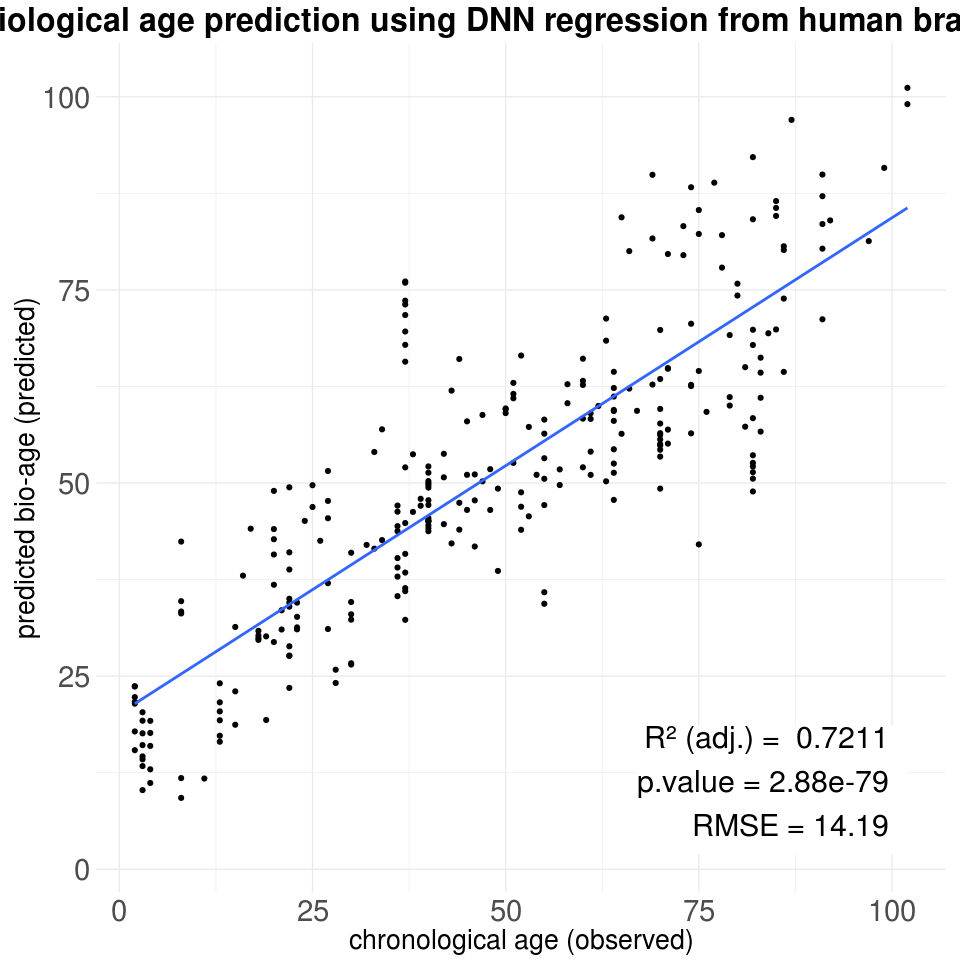

DeepNeuralNetworks4R
================
Óscar González-Velasco

================ Implementation of *Deep Neural Networks* in R programing language. ----------------

Regression algorithm for Omic data prediction in brain transcriptomics (although as a regression model, it can be applied to **any** problem with a dependent continuous variable).

We will use **iris** dataset as a tiny example of a **regression** model using *deep neural networks*:

``` r
library(datasets)
data(iris)
summary(iris)
```

    ##   Sepal.Length    Sepal.Width     Petal.Length    Petal.Width   
    ##  Min.   :4.300   Min.   :2.000   Min.   :1.000   Min.   :0.100  
    ##  1st Qu.:5.100   1st Qu.:2.800   1st Qu.:1.600   1st Qu.:0.300  
    ##  Median :5.800   Median :3.000   Median :4.350   Median :1.300  
    ##  Mean   :5.843   Mean   :3.057   Mean   :3.758   Mean   :1.199  
    ##  3rd Qu.:6.400   3rd Qu.:3.300   3rd Qu.:5.100   3rd Qu.:1.800  
    ##  Max.   :7.900   Max.   :4.400   Max.   :6.900   Max.   :2.500  
    ##        Species  
    ##  setosa    :50  
    ##  versicolor:50  
    ##  virginica :50  
    ##                 
    ##                 
    ## 

We will try to predict petal length from the other parameters.

``` r
# We load the DNN algorithm:
source("./deepNN_algorithmRegressionV3.3.r")

# We will pick 110 samples for the training set and the remaining 40 for the test set.
training.MX <- sample(1:nrow(iris),size = 110)
test.MX <- setdiff(1:150,training.MX)

training.MX <- iris[training.MX,]
training.MX$Species <- as.numeric(training.MX$Species)
training.MX <- t(training.MX)

test.MX <- iris[test.MX,]
test.MX$Species <- as.numeric(test.MX$Species)
test.MX <- t(test.MX)
head(training.MX[,1:5])
```

    ##              137  49  85 140  90
    ## Sepal.Length 6.3 5.3 5.4 6.9 5.5
    ## Sepal.Width  3.4 3.7 3.0 3.1 2.5
    ## Petal.Length 5.6 1.5 4.5 5.4 4.0
    ## Petal.Width  2.4 0.2 1.5 2.1 1.3
    ## Species      3.0 1.0 2.0 3.0 2.0

Here we can find an except for the training dataset, *notice* that *response variables* correspond to **rows**, meanwhile *samples* correspond to **columns** .

Training the regression model
-----------------------------

First, we proceed to create the deep neural network model:

``` r
dnn.model <- deepNeuralNetwork.build(x=c(1,2,4,5),y=3, outputNeurons = 1,
                                 HidenLayerNeurons = c(30,10,3),traindata=data,
                                 random.seed = 1, drawDNN = 0)
```

**x** will specify the indice positions of our explanatory variables on the matrix *data*

**HidenLayerNeurons** will specify the number of neurons that each layer will have. The number of neurons on the very first layer will be the number of variables that we will use to create the regression model.

**deepNeuralNetwork.build** will create an object of class *DeepNNModel* that will store all the information about the dnn model.

And now we train the deep neural network using the following code:

``` r
# 3. train model
dnn.model.trained <- deepNeuralNetwork.training(x=c(1,2,4,5),y=3, model = dnn.model, #ddn.model.in.use, 
                                              traindata=training.MX, testdata=test.MX, 
                                              iterations  = 15000, lr = 0.001, 
                                              reg = 0.001, display=500,maxError = 0.1)
```

    ## [1] 110   4
    ## [1] 40  4
    ## 
     Iteration Number: 1  Actual Loss: 4.284433  Squared: 44.93551 
    ## TLoss Ratio:  -4.190599  Prediction Loss: 0.09383413  Partial predict: 0.09383413 
    ## Error 1: 0.1479529  Error 2: 3.87165 
    ## 
    ##  Log2(E1/E2): -4.709739 
    ## ##################################################### 
    ## 
     Iteration Number: 1  Actual Loss: 4.284433
     Iteration Number: 2  Actual Loss: 4.283506
     Iteration Number: 3  Actual Loss: 4.282569
     Iteration Number: 4  Actual Loss: 4.281625
     Iteration Number: 5  Actual Loss: 4.280675
     Iteration Number: 6  Actual Loss: 4.279717
     Iteration Number: 7  Actual Loss: 4.27875
     Iteration Number: 8  Actual Loss: 4.277772
     Iteration Number: 9  Actual Loss: 4.276784
     Iteration Number: 10  Actual Loss: 4.275783
     Iteration Number: 11  Actual Loss: 4.274767
     Iteration Number: 12  Actual Loss: 4.273735
     Iteration Number: 13  Actual Loss: 4.272684
     Iteration Number: 14  Actual Loss: 4.271614
     Iteration Number: 15  Actual Loss: 4.27052
     Iteration Number: 16  Actual Loss: 4.269402
     Iteration Number: 17  Actual Loss: 4.268256
     Iteration Number: 18  Actual Loss: 4.26708
     Iteration Number: 19  Actual Loss: 4.26587
     Iteration Number: 20  Actual Loss: 4.264625
     Iteration Number: 21  Actual Loss: 4.26334
     Iteration Number: 22  Actual Loss: 4.262011
     Iteration Number: 23  Actual Loss: 4.260637
     Iteration Number: 24  Actual Loss: 4.259212
     Iteration Number: 25  Actual Loss: 4.257732
     Iteration Number: 26  Actual Loss: 4.256195
     Iteration Number: 27  Actual Loss: 4.254595
     Iteration Number: 28  Actual Loss: 4.252932
     Iteration Number: 29  Actual Loss: 4.251198
     Iteration Number: 30  Actual Loss: 4.249389
     Iteration Number: 31  Actual Loss: 4.247499
     Iteration Number: 32  Actual Loss: 4.245523
     Iteration Number: 33  Actual Loss: 4.243457
     Iteration Number: 34  Actual Loss: 4.241295
     Iteration Number: 35  Actual Loss: 4.239031
     Iteration Number: 36  Actual Loss: 4.236661
     Iteration Number: 37  Actual Loss: 4.234178
     Iteration Number: 38  Actual Loss: 4.231576
     Iteration Number: 39  Actual Loss: 4.228849
     Iteration Number: 40  Actual Loss: 4.225991
     Iteration Number: 41  Actual Loss: 4.222996
     Iteration Number: 42  Actual Loss: 4.219856
     Iteration Number: 43  Actual Loss: 4.216566
     Iteration Number: 44  Actual Loss: 4.213118
     Iteration Number: 45  Actual Loss: 4.209506
     Iteration Number: 46  Actual Loss: 4.205721
     Iteration Number: 47  Actual Loss: 4.201757
     Iteration Number: 48  Actual Loss: 4.197607
     Iteration Number: 49  Actual Loss: 4.193263
     Iteration Number: 50  Actual Loss: 4.188716
     Iteration Number: 51  Actual Loss: 4.183959
     Iteration Number: 52  Actual Loss: 4.178984
     Iteration Number: 53  Actual Loss: 4.173783
     Iteration Number: 54  Actual Loss: 4.168347
     Iteration Number: 55  Actual Loss: 4.162668
     Iteration Number: 56  Actual Loss: 4.156737
     Iteration Number: 57  Actual Loss: 4.150545
     Iteration Number: 58  Actual Loss: 4.144084
     Iteration Number: 59  Actual Loss: 4.137344
     Iteration Number: 60  Actual Loss: 4.130317
     Iteration Number: 61  Actual Loss: 4.122992
     Iteration Number: 62  Actual Loss: 4.11536
     Iteration Number: 63  Actual Loss: 4.107412
     Iteration Number: 64  Actual Loss: 4.099139
     Iteration Number: 65  Actual Loss: 4.090529
     Iteration Number: 66  Actual Loss: 4.081574
     Iteration Number: 67  Actual Loss: 4.072263
     Iteration Number: 68  Actual Loss: 4.062586
     Iteration Number: 69  Actual Loss: 4.052532
     Iteration Number: 70  Actual Loss: 4.042092
     Iteration Number: 71  Actual Loss: 4.031255
     Iteration Number: 72  Actual Loss: 4.02001
     Iteration Number: 73  Actual Loss: 4.008347
     Iteration Number: 74  Actual Loss: 3.996255
     Iteration Number: 75  Actual Loss: 3.983722
     Iteration Number: 76  Actual Loss: 3.970739
     Iteration Number: 77  Actual Loss: 3.957293
     Iteration Number: 78  Actual Loss: 3.943375
     Iteration Number: 79  Actual Loss: 3.928973
     Iteration Number: 80  Actual Loss: 3.914076
     Iteration Number: 81  Actual Loss: 3.898672
     Iteration Number: 82  Actual Loss: 3.882751
     Iteration Number: 83  Actual Loss: 3.866301
     Iteration Number: 84  Actual Loss: 3.849311
     Iteration Number: 85  Actual Loss: 3.831771
     Iteration Number: 86  Actual Loss: 3.813668
     Iteration Number: 87  Actual Loss: 3.794991
     Iteration Number: 88  Actual Loss: 3.77573
     Iteration Number: 89  Actual Loss: 3.755874
     Iteration Number: 90  Actual Loss: 3.735411
     Iteration Number: 91  Actual Loss: 3.714332
     Iteration Number: 92  Actual Loss: 3.692624
     Iteration Number: 93  Actual Loss: 3.670278
     Iteration Number: 94  Actual Loss: 3.647284
     Iteration Number: 95  Actual Loss: 3.62363
     Iteration Number: 96  Actual Loss: 3.599308
     Iteration Number: 97  Actual Loss: 3.574308
     Iteration Number: 98  Actual Loss: 3.54862
     Iteration Number: 99  Actual Loss: 3.522236
     Iteration Number: 100  Actual Loss: 3.495147
     Iteration Number: 101  Actual Loss: 3.467345
     Iteration Number: 102  Actual Loss: 3.438822
     Iteration Number: 103  Actual Loss: 3.409571
     Iteration Number: 104  Actual Loss: 3.379587
     Iteration Number: 105  Actual Loss: 3.348862
     Iteration Number: 106  Actual Loss: 3.317394
     Iteration Number: 107  Actual Loss: 3.285176
     Iteration Number: 108  Actual Loss: 3.252207
     Iteration Number: 109  Actual Loss: 3.218485
     Iteration Number: 110  Actual Loss: 3.184009
     Iteration Number: 111  Actual Loss: 3.148779
     Iteration Number: 112  Actual Loss: 3.112797
     Iteration Number: 113  Actual Loss: 3.076069
     Iteration Number: 114  Actual Loss: 3.038598
     Iteration Number: 115  Actual Loss: 3.000394
     Iteration Number: 116  Actual Loss: 2.961466
     Iteration Number: 117  Actual Loss: 2.921827
     Iteration Number: 118  Actual Loss: 2.881493
     Iteration Number: 119  Actual Loss: 2.840483
     Iteration Number: 120  Actual Loss: 2.798819
     Iteration Number: 121  Actual Loss: 2.756529
     Iteration Number: 122  Actual Loss: 2.713642
     Iteration Number: 123  Actual Loss: 2.670197
     Iteration Number: 124  Actual Loss: 2.626234
     Iteration Number: 125  Actual Loss: 2.581803
     Iteration Number: 126  Actual Loss: 2.536958
     Iteration Number: 127  Actual Loss: 2.491765
     Iteration Number: 128  Actual Loss: 2.446295
     Iteration Number: 129  Actual Loss: 2.400633
     Iteration Number: 130  Actual Loss: 2.354871
     Iteration Number: 131  Actual Loss: 2.309117
     Iteration Number: 132  Actual Loss: 2.263491
     Iteration Number: 133  Actual Loss: 2.218131
     Iteration Number: 134  Actual Loss: 2.173189
     Iteration Number: 135  Actual Loss: 2.128839
     Iteration Number: 136  Actual Loss: 2.085272
     Iteration Number: 137  Actual Loss: 2.042703
     Iteration Number: 138  Actual Loss: 2.001371
     Iteration Number: 139  Actual Loss: 1.961538
     Iteration Number: 140  Actual Loss: 1.923489
     Iteration Number: 141  Actual Loss: 1.887534
     Iteration Number: 142  Actual Loss: 1.854005
     Iteration Number: 143  Actual Loss: 1.823248
     Iteration Number: 144  Actual Loss: 1.795616
     Iteration Number: 145  Actual Loss: 1.771457
     Iteration Number: 146  Actual Loss: 1.751082
     Iteration Number: 147  Actual Loss: 1.734729
     Iteration Number: 148  Actual Loss: 1.722483
     Iteration Number: 149  Actual Loss: 1.714187
     Iteration Number: 150  Actual Loss: 1.709433
     Iteration Number: 151  Actual Loss: 1.706723
     Iteration Number: 152  Actual Loss: 1.701976
     Iteration Number: 153  Actual Loss: 1.699358
     Iteration Number: 154  Actual Loss: 1.694601
     Iteration Number: 155  Actual Loss: 1.692088
     Iteration Number: 156  Actual Loss: 1.687308
     Iteration Number: 157  Actual Loss: 1.684912
     Iteration Number: 158  Actual Loss: 1.680098
     Iteration Number: 159  Actual Loss: 1.677827
     Iteration Number: 160  Actual Loss: 1.672972
     Iteration Number: 161  Actual Loss: 1.67083
     Iteration Number: 162  Actual Loss: 1.665929
     Iteration Number: 163  Actual Loss: 1.663919
     Iteration Number: 164  Actual Loss: 1.658971
     Iteration Number: 165  Actual Loss: 1.655461
     Iteration Number: 166  Actual Loss: 1.652412
     Iteration Number: 167  Actual Loss: 1.648717
     Iteration Number: 168  Actual Loss: 1.645228
     Iteration Number: 169  Actual Loss: 1.642072
     Iteration Number: 170  Actual Loss: 1.638198
     Iteration Number: 171  Actual Loss: 1.63552
     Iteration Number: 172  Actual Loss: 1.63131
     Iteration Number: 173  Actual Loss: 1.629055
     Iteration Number: 174  Actual Loss: 1.624554
     Iteration Number: 175  Actual Loss: 1.622667
     Iteration Number: 176  Actual Loss: 1.617921
     Iteration Number: 177  Actual Loss: 1.614609
     Iteration Number: 178  Actual Loss: 1.611562
     Iteration Number: 179  Actual Loss: 1.608282
     Iteration Number: 180  Actual Loss: 1.604668
     Iteration Number: 181  Actual Loss: 1.602083
     Iteration Number: 182  Actual Loss: 1.597982
     Iteration Number: 183  Actual Loss: 1.595991
     Iteration Number: 184  Actual Loss: 1.591481
     Iteration Number: 185  Actual Loss: 1.589979
     Iteration Number: 186  Actual Loss: 1.585139
     Iteration Number: 187  Actual Loss: 1.581754
     Iteration Number: 188  Actual Loss: 1.579779
     Iteration Number: 189  Actual Loss: 1.575343
     Iteration Number: 190  Actual Loss: 1.572172
     Iteration Number: 191  Actual Loss: 1.569148
     Iteration Number: 192  Actual Loss: 1.56624
     Iteration Number: 193  Actual Loss: 1.562502
     Iteration Number: 194  Actual Loss: 1.560488
     Iteration Number: 195  Actual Loss: 1.556152
     Iteration Number: 196  Actual Loss: 1.553044
     Iteration Number: 197  Actual Loss: 1.549983
     Iteration Number: 198  Actual Loss: 1.547275
     Iteration Number: 199  Actual Loss: 1.54344
     Iteration Number: 200  Actual Loss: 1.541717
     Iteration Number: 201  Actual Loss: 1.537239
     Iteration Number: 202  Actual Loss: 1.533902
     Iteration Number: 203  Actual Loss: 1.532316
     Iteration Number: 204  Actual Loss: 1.527772
     Iteration Number: 205  Actual Loss: 1.524426
     Iteration Number: 206  Actual Loss: 1.522977
     Iteration Number: 207  Actual Loss: 1.518368
     Iteration Number: 208  Actual Loss: 1.515033
     Iteration Number: 209  Actual Loss: 1.513609
     Iteration Number: 210  Actual Loss: 1.509006
     Iteration Number: 211  Actual Loss: 1.505683
     Iteration Number: 212  Actual Loss: 1.504274
     Iteration Number: 213  Actual Loss: 1.499678
     Iteration Number: 214  Actual Loss: 1.496372
     Iteration Number: 215  Actual Loss: 1.494948
     Iteration Number: 216  Actual Loss: 1.490375
     Iteration Number: 217  Actual Loss: 1.487072
     Iteration Number: 218  Actual Loss: 1.48567
     Iteration Number: 219  Actual Loss: 1.481091
     Iteration Number: 220  Actual Loss: 1.477837
     Iteration Number: 221  Actual Loss: 1.476289
     Iteration Number: 222  Actual Loss: 1.471798
     Iteration Number: 223  Actual Loss: 1.468447
     Iteration Number: 224  Actual Loss: 1.467274
     Iteration Number: 225  Actual Loss: 1.462571
     Iteration Number: 226  Actual Loss: 1.459736
     Iteration Number: 227  Actual Loss: 1.457232
     Iteration Number: 228  Actual Loss: 1.453249
     Iteration Number: 229  Actual Loss: 1.45036
     Iteration Number: 230  Actual Loss: 1.446907
     Iteration Number: 231  Actual Loss: 1.445358
     Iteration Number: 232  Actual Loss: 1.440832
     Iteration Number: 233  Actual Loss: 1.43763
     Iteration Number: 234  Actual Loss: 1.4359
     Iteration Number: 235  Actual Loss: 1.431446
     Iteration Number: 236  Actual Loss: 1.428093
     Iteration Number: 237  Actual Loss: 1.426776
     Iteration Number: 238  Actual Loss: 1.422092
     Iteration Number: 239  Actual Loss: 1.419095
     Iteration Number: 240  Actual Loss: 1.416845
     Iteration Number: 241  Actual Loss: 1.412589
     Iteration Number: 242  Actual Loss: 1.409058
     Iteration Number: 243  Actual Loss: 1.405509
     Iteration Number: 244  Actual Loss: 1.402632
     Iteration Number: 245  Actual Loss: 1.398865
     Iteration Number: 246  Actual Loss: 1.395833
     Iteration Number: 247  Actual Loss: 1.392165
     Iteration Number: 248  Actual Loss: 1.390987
     Iteration Number: 249  Actual Loss: 1.386111
     Iteration Number: 250  Actual Loss: 1.382813
     Iteration Number: 251  Actual Loss: 1.380958
     Iteration Number: 252  Actual Loss: 1.376334
     Iteration Number: 253  Actual Loss: 1.37301
     Iteration Number: 254  Actual Loss: 1.371164
     Iteration Number: 255  Actual Loss: 1.366488
     Iteration Number: 256  Actual Loss: 1.363103
     Iteration Number: 257  Actual Loss: 1.361302
     Iteration Number: 258  Actual Loss: 1.356548
     Iteration Number: 259  Actual Loss: 1.35308
     Iteration Number: 260  Actual Loss: 1.351372
     Iteration Number: 261  Actual Loss: 1.346521
     Iteration Number: 262  Actual Loss: 1.34292
     Iteration Number: 263  Actual Loss: 1.34134
     Iteration Number: 264  Actual Loss: 1.336337
     Iteration Number: 265  Actual Loss: 1.332574
     Iteration Number: 266  Actual Loss: 1.331196
     Iteration Number: 267  Actual Loss: 1.326043
     Iteration Number: 268  Actual Loss: 1.322095
     Iteration Number: 269  Actual Loss: 1.318816
     Iteration Number: 270  Actual Loss: 1.314582
     Iteration Number: 271  Actual Loss: 1.310539
     Iteration Number: 272  Actual Loss: 1.306468
     Iteration Number: 273  Actual Loss: 1.302368
     Iteration Number: 274  Actual Loss: 1.298238
     Iteration Number: 275  Actual Loss: 1.294078
     Iteration Number: 276  Actual Loss: 1.289887
     Iteration Number: 277  Actual Loss: 1.28566
     Iteration Number: 278  Actual Loss: 1.281397
     Iteration Number: 279  Actual Loss: 1.277101
     Iteration Number: 280  Actual Loss: 1.272768
     Iteration Number: 281  Actual Loss: 1.268402
     Iteration Number: 282  Actual Loss: 1.263999
     Iteration Number: 283  Actual Loss: 1.259556
     Iteration Number: 284  Actual Loss: 1.255075
     Iteration Number: 285  Actual Loss: 1.250579
     Iteration Number: 286  Actual Loss: 1.246062
     Iteration Number: 287  Actual Loss: 1.24151
     Iteration Number: 288  Actual Loss: 1.236929
     Iteration Number: 289  Actual Loss: 1.232319
     Iteration Number: 290  Actual Loss: 1.227679
     Iteration Number: 291  Actual Loss: 1.223004
     Iteration Number: 292  Actual Loss: 1.218303
     Iteration Number: 293  Actual Loss: 1.213567
     Iteration Number: 294  Actual Loss: 1.208794
     Iteration Number: 295  Actual Loss: 1.203985
     Iteration Number: 296  Actual Loss: 1.199144
     Iteration Number: 297  Actual Loss: 1.194276
     Iteration Number: 298  Actual Loss: 1.189407
     Iteration Number: 299  Actual Loss: 1.184513
     Iteration Number: 300  Actual Loss: 1.179578
     Iteration Number: 301  Actual Loss: 1.174601
     Iteration Number: 302  Actual Loss: 1.169581
     Iteration Number: 303  Actual Loss: 1.164532
     Iteration Number: 304  Actual Loss: 1.159483
     Iteration Number: 305  Actual Loss: 1.154397
     Iteration Number: 306  Actual Loss: 1.149276
     Iteration Number: 307  Actual Loss: 1.144119
     Iteration Number: 308  Actual Loss: 1.138928
     Iteration Number: 309  Actual Loss: 1.133654
     Iteration Number: 310  Actual Loss: 1.128325
     Iteration Number: 311  Actual Loss: 1.122918
     Iteration Number: 312  Actual Loss: 1.117435
     Iteration Number: 313  Actual Loss: 1.111907
     Iteration Number: 314  Actual Loss: 1.106349
     Iteration Number: 315  Actual Loss: 1.100786
     Iteration Number: 316  Actual Loss: 1.095343
     Iteration Number: 317  Actual Loss: 1.089942
     Iteration Number: 318  Actual Loss: 1.084533
     Iteration Number: 319  Actual Loss: 1.079231
     Iteration Number: 320  Actual Loss: 1.074051
     Iteration Number: 321  Actual Loss: 1.069087
     Iteration Number: 322  Actual Loss: 1.064415
     Iteration Number: 323  Actual Loss: 1.059863
     Iteration Number: 324  Actual Loss: 1.055612
     Iteration Number: 325  Actual Loss: 1.051348
     Iteration Number: 326  Actual Loss: 1.047305
     Iteration Number: 327  Actual Loss: 1.043283
     Iteration Number: 328  Actual Loss: 1.039231
     Iteration Number: 329  Actual Loss: 1.035053
     Iteration Number: 330  Actual Loss: 1.030791
     Iteration Number: 331  Actual Loss: 1.026383
     Iteration Number: 332  Actual Loss: 1.021928
     Iteration Number: 333  Actual Loss: 1.017733
     Iteration Number: 334  Actual Loss: 1.013514
     Iteration Number: 335  Actual Loss: 1.009524
     Iteration Number: 336  Actual Loss: 1.005844
     Iteration Number: 337  Actual Loss: 1.002522
     Iteration Number: 338  Actual Loss: 0.9994879
     Iteration Number: 339  Actual Loss: 0.996494
     Iteration Number: 340  Actual Loss: 0.9938299
     Iteration Number: 341  Actual Loss: 0.9912757
     Iteration Number: 342  Actual Loss: 0.9889535
     Iteration Number: 343  Actual Loss: 0.9867018
     Iteration Number: 344  Actual Loss: 0.9844758
     Iteration Number: 345  Actual Loss: 0.9825066
     Iteration Number: 346  Actual Loss: 0.980658
     Iteration Number: 347  Actual Loss: 0.9789246
     Iteration Number: 348  Actual Loss: 0.9772935
     Iteration Number: 349  Actual Loss: 0.9757154
     Iteration Number: 350  Actual Loss: 0.9742336
     Iteration Number: 351  Actual Loss: 0.9727935
     Iteration Number: 352  Actual Loss: 0.9717007
     Iteration Number: 353  Actual Loss: 0.9708841
     Iteration Number: 354  Actual Loss: 0.9759651
     Iteration Number: 355  Actual Loss: 0.9707138
     Iteration Number: 356  Actual Loss: 0.9754806
     Iteration Number: 357  Actual Loss: 0.9705536
     Iteration Number: 358  Actual Loss: 0.9750706
     Iteration Number: 359  Actual Loss: 0.9703965
     Iteration Number: 360  Actual Loss: 0.9747107
     Iteration Number: 361  Actual Loss: 0.9702392
     Iteration Number: 362  Actual Loss: 0.9743989
     Iteration Number: 363  Actual Loss: 0.9700774
     Iteration Number: 364  Actual Loss: 0.9741207
     Iteration Number: 365  Actual Loss: 0.9699152
     Iteration Number: 366  Actual Loss: 0.9738723
     Iteration Number: 367  Actual Loss: 0.9697604
     Iteration Number: 368  Actual Loss: 0.9736468
     Iteration Number: 369  Actual Loss: 0.9696134
     Iteration Number: 370  Actual Loss: 0.9734317
     Iteration Number: 371  Actual Loss: 0.9694743
     Iteration Number: 372  Actual Loss: 0.973232
     Iteration Number: 373  Actual Loss: 0.9693589
     Iteration Number: 374  Actual Loss: 0.9730466
     Iteration Number: 375  Actual Loss: 0.969251
     Iteration Number: 376  Actual Loss: 0.9728617
     Iteration Number: 377  Actual Loss: 0.9691502
     Iteration Number: 378  Actual Loss: 0.9726886
     Iteration Number: 379  Actual Loss: 0.9690562
     Iteration Number: 380  Actual Loss: 0.9725256
     Iteration Number: 381  Actual Loss: 0.9689686
     Iteration Number: 382  Actual Loss: 0.9723696
     Iteration Number: 383  Actual Loss: 0.9688876
     Iteration Number: 384  Actual Loss: 0.9722227
     Iteration Number: 385  Actual Loss: 0.9688117
     Iteration Number: 386  Actual Loss: 0.9720841
     Iteration Number: 387  Actual Loss: 0.9687401
     Iteration Number: 388  Actual Loss: 0.9719529
     Iteration Number: 389  Actual Loss: 0.9686729
     Iteration Number: 390  Actual Loss: 0.9718386
     Iteration Number: 391  Actual Loss: 0.9686097
     Iteration Number: 392  Actual Loss: 0.9717302
     Iteration Number: 393  Actual Loss: 0.9685437
     Iteration Number: 394  Actual Loss: 0.9716271
     Iteration Number: 395  Actual Loss: 0.9684771
     Iteration Number: 396  Actual Loss: 0.9715291
     Iteration Number: 397  Actual Loss: 0.9684137
     Iteration Number: 398  Actual Loss: 0.9714353
     Iteration Number: 399  Actual Loss: 0.968353
     Iteration Number: 400  Actual Loss: 0.9713453
     Iteration Number: 401  Actual Loss: 0.9682947
     Iteration Number: 402  Actual Loss: 0.9712586
     Iteration Number: 403  Actual Loss: 0.9682385
     Iteration Number: 404  Actual Loss: 0.971175
     Iteration Number: 405  Actual Loss: 0.9681843
     Iteration Number: 406  Actual Loss: 0.971094
     Iteration Number: 407  Actual Loss: 0.9681316
     Iteration Number: 408  Actual Loss: 0.9710155
     Iteration Number: 409  Actual Loss: 0.9680803
     Iteration Number: 410  Actual Loss: 0.9709392
     Iteration Number: 411  Actual Loss: 0.9680302
     Iteration Number: 412  Actual Loss: 0.9708647
     Iteration Number: 413  Actual Loss: 0.967981
     Iteration Number: 414  Actual Loss: 0.9707921
     Iteration Number: 415  Actual Loss: 0.9679317
     Iteration Number: 416  Actual Loss: 0.9707209
     Iteration Number: 417  Actual Loss: 0.9678828
     Iteration Number: 418  Actual Loss: 0.9706512
     Iteration Number: 419  Actual Loss: 0.9678344
     Iteration Number: 420  Actual Loss: 0.9705828
     Iteration Number: 421  Actual Loss: 0.9677865
     Iteration Number: 422  Actual Loss: 0.9705156
     Iteration Number: 423  Actual Loss: 0.9677391
     Iteration Number: 424  Actual Loss: 0.9704494
     Iteration Number: 425  Actual Loss: 0.9676919
     Iteration Number: 426  Actual Loss: 0.9703841
     Iteration Number: 427  Actual Loss: 0.9676451
     Iteration Number: 428  Actual Loss: 0.9703197
     Iteration Number: 429  Actual Loss: 0.9675983
     Iteration Number: 430  Actual Loss: 0.970256
     Iteration Number: 431  Actual Loss: 0.9675517
     Iteration Number: 432  Actual Loss: 0.9701931
     Iteration Number: 433  Actual Loss: 0.9675048
     Iteration Number: 434  Actual Loss: 0.9701304
     Iteration Number: 435  Actual Loss: 0.967457
     Iteration Number: 436  Actual Loss: 0.9700629
     Iteration Number: 437  Actual Loss: 0.9674101
     Iteration Number: 438  Actual Loss: 0.969996
     Iteration Number: 439  Actual Loss: 0.9673634
     Iteration Number: 440  Actual Loss: 0.9699297
     Iteration Number: 441  Actual Loss: 0.9673168
     Iteration Number: 442  Actual Loss: 0.969864
     Iteration Number: 443  Actual Loss: 0.9672701
     Iteration Number: 444  Actual Loss: 0.969799
     Iteration Number: 445  Actual Loss: 0.9672235
     Iteration Number: 446  Actual Loss: 0.9697346
     Iteration Number: 447  Actual Loss: 0.9671768
     Iteration Number: 448  Actual Loss: 0.9696708
     Iteration Number: 449  Actual Loss: 0.96713
     Iteration Number: 450  Actual Loss: 0.9696075
     Iteration Number: 451  Actual Loss: 0.9670832
     Iteration Number: 452  Actual Loss: 0.9695447
     Iteration Number: 453  Actual Loss: 0.9670364
     Iteration Number: 454  Actual Loss: 0.9694824
     Iteration Number: 455  Actual Loss: 0.9669894
     Iteration Number: 456  Actual Loss: 0.9694206
     Iteration Number: 457  Actual Loss: 0.9669424
     Iteration Number: 458  Actual Loss: 0.9693593
     Iteration Number: 459  Actual Loss: 0.9668954
     Iteration Number: 460  Actual Loss: 0.9692984
     Iteration Number: 461  Actual Loss: 0.9668483
     Iteration Number: 462  Actual Loss: 0.969238
     Iteration Number: 463  Actual Loss: 0.9668011
     Iteration Number: 464  Actual Loss: 0.969178
     Iteration Number: 465  Actual Loss: 0.9667539
     Iteration Number: 466  Actual Loss: 0.9691184
     Iteration Number: 467  Actual Loss: 0.9667067
     Iteration Number: 468  Actual Loss: 0.9690593
     Iteration Number: 469  Actual Loss: 0.9666594
     Iteration Number: 470  Actual Loss: 0.9690006
     Iteration Number: 471  Actual Loss: 0.9666121
     Iteration Number: 472  Actual Loss: 0.9689423
     Iteration Number: 473  Actual Loss: 0.9665648
     Iteration Number: 474  Actual Loss: 0.9688844
     Iteration Number: 475  Actual Loss: 0.9665176
     Iteration Number: 476  Actual Loss: 0.968827
     Iteration Number: 477  Actual Loss: 0.9664703
     Iteration Number: 478  Actual Loss: 0.96877
     Iteration Number: 479  Actual Loss: 0.9664231
     Iteration Number: 480  Actual Loss: 0.9687134
     Iteration Number: 481  Actual Loss: 0.9663759
     Iteration Number: 482  Actual Loss: 0.9686572
     Iteration Number: 483  Actual Loss: 0.9663288
     Iteration Number: 484  Actual Loss: 0.9686014
     Iteration Number: 485  Actual Loss: 0.9662828
     Iteration Number: 486  Actual Loss: 0.9685461
     Iteration Number: 487  Actual Loss: 0.9662369
     Iteration Number: 488  Actual Loss: 0.9684912
     Iteration Number: 489  Actual Loss: 0.966191
     Iteration Number: 490  Actual Loss: 0.9684367
     Iteration Number: 491  Actual Loss: 0.9661453
     Iteration Number: 492  Actual Loss: 0.9683826
     Iteration Number: 493  Actual Loss: 0.9660997
     Iteration Number: 494  Actual Loss: 0.968329
     Iteration Number: 495  Actual Loss: 0.9660545
     Iteration Number: 496  Actual Loss: 0.9682758
     Iteration Number: 497  Actual Loss: 0.9660094
     Iteration Number: 498  Actual Loss: 0.968223
     Iteration Number: 499  Actual Loss: 0.9659645
     Iteration Number: 500  Actual Loss: 0.9681707  Squared: 10.15283 
    ## TLoss Ratio:  -0.936976  Prediction Loss: 0.03119471  Partial predict: 0.03119471 
    ## Error 1: 0.03342883  Error 2: 0.4278943 
    ## 
    ##  Log2(E1/E2): -3.67809 
    ## #####################################################

    ## 
     Iteration Number: 501  Actual Loss: 0.9659196
     Iteration Number: 502  Actual Loss: 0.9681188
     Iteration Number: 503  Actual Loss: 0.965875
     Iteration Number: 504  Actual Loss: 0.9680674
     Iteration Number: 505  Actual Loss: 0.9658304
     Iteration Number: 506  Actual Loss: 0.9680163
     Iteration Number: 507  Actual Loss: 0.9657861
     Iteration Number: 508  Actual Loss: 0.9679658
     Iteration Number: 509  Actual Loss: 0.9657419
     Iteration Number: 510  Actual Loss: 0.9679156
     Iteration Number: 511  Actual Loss: 0.9656979
     Iteration Number: 512  Actual Loss: 0.9678659
     Iteration Number: 513  Actual Loss: 0.9656541
     Iteration Number: 514  Actual Loss: 0.9678166
     Iteration Number: 515  Actual Loss: 0.9656105
     Iteration Number: 516  Actual Loss: 0.9677678
     Iteration Number: 517  Actual Loss: 0.9655671
     Iteration Number: 518  Actual Loss: 0.9677195
     Iteration Number: 519  Actual Loss: 0.965524
     Iteration Number: 520  Actual Loss: 0.9676717
     Iteration Number: 521  Actual Loss: 0.965481
     Iteration Number: 522  Actual Loss: 0.9676245
     Iteration Number: 523  Actual Loss: 0.9654383
     Iteration Number: 524  Actual Loss: 0.9675777
     Iteration Number: 525  Actual Loss: 0.9653959
     Iteration Number: 526  Actual Loss: 0.9675314
     Iteration Number: 527  Actual Loss: 0.9653537
     Iteration Number: 528  Actual Loss: 0.9674855
     Iteration Number: 529  Actual Loss: 0.965312
     Iteration Number: 530  Actual Loss: 0.96744
     Iteration Number: 531  Actual Loss: 0.9652707
     Iteration Number: 532  Actual Loss: 0.967395
     Iteration Number: 533  Actual Loss: 0.9652297
     Iteration Number: 534  Actual Loss: 0.9673505
     Iteration Number: 535  Actual Loss: 0.9651889
     Iteration Number: 536  Actual Loss: 0.9673064
     Iteration Number: 537  Actual Loss: 0.9651484
     Iteration Number: 538  Actual Loss: 0.9672628
     Iteration Number: 539  Actual Loss: 0.9651082
     Iteration Number: 540  Actual Loss: 0.9672196
     Iteration Number: 541  Actual Loss: 0.9650683
     Iteration Number: 542  Actual Loss: 0.9671768
     Iteration Number: 543  Actual Loss: 0.9650287
     Iteration Number: 544  Actual Loss: 0.9671345
     Iteration Number: 545  Actual Loss: 0.9649893
     Iteration Number: 546  Actual Loss: 0.9670927
     Iteration Number: 547  Actual Loss: 0.9649503
     Iteration Number: 548  Actual Loss: 0.9670512
     Iteration Number: 549  Actual Loss: 0.9649115
     Iteration Number: 550  Actual Loss: 0.9670102
     Iteration Number: 551  Actual Loss: 0.964873
     Iteration Number: 552  Actual Loss: 0.9669697
     Iteration Number: 553  Actual Loss: 0.9648348
     Iteration Number: 554  Actual Loss: 0.9669295
     Iteration Number: 555  Actual Loss: 0.9647969
     Iteration Number: 556  Actual Loss: 0.9668898
     Iteration Number: 557  Actual Loss: 0.9647593
     Iteration Number: 558  Actual Loss: 0.9668505
     Iteration Number: 559  Actual Loss: 0.9647219
     Iteration Number: 560  Actual Loss: 0.9668117
     Iteration Number: 561  Actual Loss: 0.9646849
     Iteration Number: 562  Actual Loss: 0.9667733
     Iteration Number: 563  Actual Loss: 0.9646482
     Iteration Number: 564  Actual Loss: 0.9667353
     Iteration Number: 565  Actual Loss: 0.9646118
     Iteration Number: 566  Actual Loss: 0.9666977
     Iteration Number: 567  Actual Loss: 0.9645756
     Iteration Number: 568  Actual Loss: 0.9666605
     Iteration Number: 569  Actual Loss: 0.9645398
     Iteration Number: 570  Actual Loss: 0.9666237
     Iteration Number: 571  Actual Loss: 0.9645043
     Iteration Number: 572  Actual Loss: 0.9665874
     Iteration Number: 573  Actual Loss: 0.9644691
     Iteration Number: 574  Actual Loss: 0.9665514
     Iteration Number: 575  Actual Loss: 0.9644342
     Iteration Number: 576  Actual Loss: 0.9665159
     Iteration Number: 577  Actual Loss: 0.9643996
     Iteration Number: 578  Actual Loss: 0.9664807
     Iteration Number: 579  Actual Loss: 0.9643653
     Iteration Number: 580  Actual Loss: 0.966446
     Iteration Number: 581  Actual Loss: 0.9643313
     Iteration Number: 582  Actual Loss: 0.9664116
     Iteration Number: 583  Actual Loss: 0.9642976
     Iteration Number: 584  Actual Loss: 0.9663778
     Iteration Number: 585  Actual Loss: 0.9642642
     Iteration Number: 586  Actual Loss: 0.9663452
     Iteration Number: 587  Actual Loss: 0.9642311
     Iteration Number: 588  Actual Loss: 0.966313
     Iteration Number: 589  Actual Loss: 0.9641984
     Iteration Number: 590  Actual Loss: 0.9662811
     Iteration Number: 591  Actual Loss: 0.9641659
     Iteration Number: 592  Actual Loss: 0.9662497
     Iteration Number: 593  Actual Loss: 0.9641337
     Iteration Number: 594  Actual Loss: 0.9662186
     Iteration Number: 595  Actual Loss: 0.9641018
     Iteration Number: 596  Actual Loss: 0.9661879
     Iteration Number: 597  Actual Loss: 0.9640702
     Iteration Number: 598  Actual Loss: 0.9661575
     Iteration Number: 599  Actual Loss: 0.9640389
     Iteration Number: 600  Actual Loss: 0.9661275
     Iteration Number: 601  Actual Loss: 0.9640079
     Iteration Number: 602  Actual Loss: 0.9660978
     Iteration Number: 603  Actual Loss: 0.9639772
     Iteration Number: 604  Actual Loss: 0.9660685
     Iteration Number: 605  Actual Loss: 0.9639468
     Iteration Number: 606  Actual Loss: 0.9660396
     Iteration Number: 607  Actual Loss: 0.9639167
     Iteration Number: 608  Actual Loss: 0.966011
     Iteration Number: 609  Actual Loss: 0.9638868
     Iteration Number: 610  Actual Loss: 0.9659827
     Iteration Number: 611  Actual Loss: 0.9638572
     Iteration Number: 612  Actual Loss: 0.9659547
     Iteration Number: 613  Actual Loss: 0.963828
     Iteration Number: 614  Actual Loss: 0.9659271
     Iteration Number: 615  Actual Loss: 0.963799
     Iteration Number: 616  Actual Loss: 0.9658999
     Iteration Number: 617  Actual Loss: 0.9637702
     Iteration Number: 618  Actual Loss: 0.9658729
     Iteration Number: 619  Actual Loss: 0.963742
     Iteration Number: 620  Actual Loss: 0.9658463
     Iteration Number: 621  Actual Loss: 0.963714
     Iteration Number: 622  Actual Loss: 0.96582
     Iteration Number: 623  Actual Loss: 0.9636863
     Iteration Number: 624  Actual Loss: 0.965794
     Iteration Number: 625  Actual Loss: 0.9636588
     Iteration Number: 626  Actual Loss: 0.9657683
     Iteration Number: 627  Actual Loss: 0.9636316
     Iteration Number: 628  Actual Loss: 0.9657429
     Iteration Number: 629  Actual Loss: 0.9636047
     Iteration Number: 630  Actual Loss: 0.9657178
     Iteration Number: 631  Actual Loss: 0.963578
     Iteration Number: 632  Actual Loss: 0.9656931
     Iteration Number: 633  Actual Loss: 0.9635518
     Iteration Number: 634  Actual Loss: 0.9656686
     Iteration Number: 635  Actual Loss: 0.9635259
     Iteration Number: 636  Actual Loss: 0.9656444
     Iteration Number: 637  Actual Loss: 0.9635002
     Iteration Number: 638  Actual Loss: 0.9656205
     Iteration Number: 639  Actual Loss: 0.9634748
     Iteration Number: 640  Actual Loss: 0.9655968
     Iteration Number: 641  Actual Loss: 0.9634496
     Iteration Number: 642  Actual Loss: 0.9655735
     Iteration Number: 643  Actual Loss: 0.9634246
     Iteration Number: 644  Actual Loss: 0.9655504
     Iteration Number: 645  Actual Loss: 0.9633999
     Iteration Number: 646  Actual Loss: 0.9655276
     Iteration Number: 647  Actual Loss: 0.9633754
     Iteration Number: 648  Actual Loss: 0.965505
     Iteration Number: 649  Actual Loss: 0.9633512
     Iteration Number: 650  Actual Loss: 0.9654827
     Iteration Number: 651  Actual Loss: 0.9633271
     Iteration Number: 652  Actual Loss: 0.9654607
     Iteration Number: 653  Actual Loss: 0.9633033
     Iteration Number: 654  Actual Loss: 0.9654389
     Iteration Number: 655  Actual Loss: 0.9632797
     Iteration Number: 656  Actual Loss: 0.9654174
     Iteration Number: 657  Actual Loss: 0.9632564
     Iteration Number: 658  Actual Loss: 0.9653962
     Iteration Number: 659  Actual Loss: 0.9632333
     Iteration Number: 660  Actual Loss: 0.9653752
     Iteration Number: 661  Actual Loss: 0.9632103
     Iteration Number: 662  Actual Loss: 0.9653546
     Iteration Number: 663  Actual Loss: 0.9631876
     Iteration Number: 664  Actual Loss: 0.9653342
     Iteration Number: 665  Actual Loss: 0.9631652
     Iteration Number: 666  Actual Loss: 0.9653141
     Iteration Number: 667  Actual Loss: 0.9631429
     Iteration Number: 668  Actual Loss: 0.9652942
     Iteration Number: 669  Actual Loss: 0.9631208
     Iteration Number: 670  Actual Loss: 0.9652746
     Iteration Number: 671  Actual Loss: 0.963099
     Iteration Number: 672  Actual Loss: 0.9652552
     Iteration Number: 673  Actual Loss: 0.9630773
     Iteration Number: 674  Actual Loss: 0.965236
     Iteration Number: 675  Actual Loss: 0.9630559
     Iteration Number: 676  Actual Loss: 0.965217
     Iteration Number: 677  Actual Loss: 0.9630347
     Iteration Number: 678  Actual Loss: 0.9651983
     Iteration Number: 679  Actual Loss: 0.9630136
     Iteration Number: 680  Actual Loss: 0.9651797
     Iteration Number: 681  Actual Loss: 0.9629928
     Iteration Number: 682  Actual Loss: 0.9651614
     Iteration Number: 683  Actual Loss: 0.9629722
     Iteration Number: 684  Actual Loss: 0.9651433
     Iteration Number: 685  Actual Loss: 0.9629517
     Iteration Number: 686  Actual Loss: 0.9651255
     Iteration Number: 687  Actual Loss: 0.9629314
     Iteration Number: 688  Actual Loss: 0.9651078
     Iteration Number: 689  Actual Loss: 0.9629114
     Iteration Number: 690  Actual Loss: 0.9650903
     Iteration Number: 691  Actual Loss: 0.9628915
     Iteration Number: 692  Actual Loss: 0.9650731
     Iteration Number: 693  Actual Loss: 0.9628718
     Iteration Number: 694  Actual Loss: 0.965056
     Iteration Number: 695  Actual Loss: 0.9628522
     Iteration Number: 696  Actual Loss: 0.9650392
     Iteration Number: 697  Actual Loss: 0.9628329
     Iteration Number: 698  Actual Loss: 0.9650225
     Iteration Number: 699  Actual Loss: 0.9628137
     Iteration Number: 700  Actual Loss: 0.965006
     Iteration Number: 701  Actual Loss: 0.9627947
     Iteration Number: 702  Actual Loss: 0.9649897
     Iteration Number: 703  Actual Loss: 0.9627759
     Iteration Number: 704  Actual Loss: 0.9649737
     Iteration Number: 705  Actual Loss: 0.9627574
     Iteration Number: 706  Actual Loss: 0.9649578
     Iteration Number: 707  Actual Loss: 0.962739
     Iteration Number: 708  Actual Loss: 0.9649421
     Iteration Number: 709  Actual Loss: 0.9627208
     Iteration Number: 710  Actual Loss: 0.9649266
     Iteration Number: 711  Actual Loss: 0.9627029
     Iteration Number: 712  Actual Loss: 0.9649113
     Iteration Number: 713  Actual Loss: 0.9626851
     Iteration Number: 714  Actual Loss: 0.9648961
     Iteration Number: 715  Actual Loss: 0.9626674
     Iteration Number: 716  Actual Loss: 0.9648812
     Iteration Number: 717  Actual Loss: 0.9626499
     Iteration Number: 718  Actual Loss: 0.9648664
     Iteration Number: 719  Actual Loss: 0.9626326
     Iteration Number: 720  Actual Loss: 0.9648518
     Iteration Number: 721  Actual Loss: 0.9626155
     Iteration Number: 722  Actual Loss: 0.9648374
     Iteration Number: 723  Actual Loss: 0.9625985
     Iteration Number: 724  Actual Loss: 0.9648221
     Iteration Number: 725  Actual Loss: 0.9625816
     Iteration Number: 726  Actual Loss: 0.9648069
     Iteration Number: 727  Actual Loss: 0.9625649
     Iteration Number: 728  Actual Loss: 0.9647919
     Iteration Number: 729  Actual Loss: 0.9625484
     Iteration Number: 730  Actual Loss: 0.9647771
     Iteration Number: 731  Actual Loss: 0.962532
     Iteration Number: 732  Actual Loss: 0.9647624
     Iteration Number: 733  Actual Loss: 0.9625158
     Iteration Number: 734  Actual Loss: 0.9647479
     Iteration Number: 735  Actual Loss: 0.9624997
     Iteration Number: 736  Actual Loss: 0.9647336
     Iteration Number: 737  Actual Loss: 0.9624837
     Iteration Number: 738  Actual Loss: 0.9647194
     Iteration Number: 739  Actual Loss: 0.9624679
     Iteration Number: 740  Actual Loss: 0.9647053
     Iteration Number: 741  Actual Loss: 0.9624522
     Iteration Number: 742  Actual Loss: 0.9646915
     Iteration Number: 743  Actual Loss: 0.9624367
     Iteration Number: 744  Actual Loss: 0.9646778
     Iteration Number: 745  Actual Loss: 0.9624213
     Iteration Number: 746  Actual Loss: 0.9646642
     Iteration Number: 747  Actual Loss: 0.962406
     Iteration Number: 748  Actual Loss: 0.9646508
     Iteration Number: 749  Actual Loss: 0.9623909
     Iteration Number: 750  Actual Loss: 0.9646375
     Iteration Number: 751  Actual Loss: 0.9623759
     Iteration Number: 752  Actual Loss: 0.9646244
     Iteration Number: 753  Actual Loss: 0.962361
     Iteration Number: 754  Actual Loss: 0.9646114
     Iteration Number: 755  Actual Loss: 0.9623462
     Iteration Number: 756  Actual Loss: 0.9645985
     Iteration Number: 757  Actual Loss: 0.9623316
     Iteration Number: 758  Actual Loss: 0.9645858
     Iteration Number: 759  Actual Loss: 0.9623171
     Iteration Number: 760  Actual Loss: 0.9645732
     Iteration Number: 761  Actual Loss: 0.9623028
     Iteration Number: 762  Actual Loss: 0.9645608
     Iteration Number: 763  Actual Loss: 0.9622886
     Iteration Number: 764  Actual Loss: 0.9645485
     Iteration Number: 765  Actual Loss: 0.9622745
     Iteration Number: 766  Actual Loss: 0.9645363
     Iteration Number: 767  Actual Loss: 0.9622606
     Iteration Number: 768  Actual Loss: 0.9645242
     Iteration Number: 769  Actual Loss: 0.9622467
     Iteration Number: 770  Actual Loss: 0.9645123
     Iteration Number: 771  Actual Loss: 0.962233
     Iteration Number: 772  Actual Loss: 0.9645005
     Iteration Number: 773  Actual Loss: 0.9622194
     Iteration Number: 774  Actual Loss: 0.9644888
     Iteration Number: 775  Actual Loss: 0.9622059
     Iteration Number: 776  Actual Loss: 0.9644773
     Iteration Number: 777  Actual Loss: 0.9621925
     Iteration Number: 778  Actual Loss: 0.9644658
     Iteration Number: 779  Actual Loss: 0.9621792
     Iteration Number: 780  Actual Loss: 0.9644545
     Iteration Number: 781  Actual Loss: 0.962166
     Iteration Number: 782  Actual Loss: 0.9644433
     Iteration Number: 783  Actual Loss: 0.962153
     Iteration Number: 784  Actual Loss: 0.9644322
     Iteration Number: 785  Actual Loss: 0.96214
     Iteration Number: 786  Actual Loss: 0.9644213
     Iteration Number: 787  Actual Loss: 0.9621271
     Iteration Number: 788  Actual Loss: 0.9644104
     Iteration Number: 789  Actual Loss: 0.9621143
     Iteration Number: 790  Actual Loss: 0.9643997
     Iteration Number: 791  Actual Loss: 0.9621017
     Iteration Number: 792  Actual Loss: 0.964389
     Iteration Number: 793  Actual Loss: 0.9620891
     Iteration Number: 794  Actual Loss: 0.9643785
     Iteration Number: 795  Actual Loss: 0.9620766
     Iteration Number: 796  Actual Loss: 0.964368
     Iteration Number: 797  Actual Loss: 0.9620642
     Iteration Number: 798  Actual Loss: 0.9643577
     Iteration Number: 799  Actual Loss: 0.9620519
     Iteration Number: 800  Actual Loss: 0.9643474
     Iteration Number: 801  Actual Loss: 0.9620397
     Iteration Number: 802  Actual Loss: 0.9643373
     Iteration Number: 803  Actual Loss: 0.9620276
     Iteration Number: 804  Actual Loss: 0.9643272
     Iteration Number: 805  Actual Loss: 0.9620155
     Iteration Number: 806  Actual Loss: 0.9643173
     Iteration Number: 807  Actual Loss: 0.9620036
     Iteration Number: 808  Actual Loss: 0.9643074
     Iteration Number: 809  Actual Loss: 0.9619917
     Iteration Number: 810  Actual Loss: 0.9642976
     Iteration Number: 811  Actual Loss: 0.9619799
     Iteration Number: 812  Actual Loss: 0.964288
     Iteration Number: 813  Actual Loss: 0.9619682
     Iteration Number: 814  Actual Loss: 0.9642784
     Iteration Number: 815  Actual Loss: 0.9619566
     Iteration Number: 816  Actual Loss: 0.9642689
     Iteration Number: 817  Actual Loss: 0.9619451
     Iteration Number: 818  Actual Loss: 0.9642595
     Iteration Number: 819  Actual Loss: 0.9619336
     Iteration Number: 820  Actual Loss: 0.9642502
     Iteration Number: 821  Actual Loss: 0.9619222
     Iteration Number: 822  Actual Loss: 0.9642409
     Iteration Number: 823  Actual Loss: 0.9619109
     Iteration Number: 824  Actual Loss: 0.9642318
     Iteration Number: 825  Actual Loss: 0.9618997
     Iteration Number: 826  Actual Loss: 0.9642227
     Iteration Number: 827  Actual Loss: 0.9618886
     Iteration Number: 828  Actual Loss: 0.9642137
     Iteration Number: 829  Actual Loss: 0.9618775
     Iteration Number: 830  Actual Loss: 0.9642047
     Iteration Number: 831  Actual Loss: 0.9618665
     Iteration Number: 832  Actual Loss: 0.9641959
     Iteration Number: 833  Actual Loss: 0.9618555
     Iteration Number: 834  Actual Loss: 0.9641871
     Iteration Number: 835  Actual Loss: 0.9618447
     Iteration Number: 836  Actual Loss: 0.9641784
     Iteration Number: 837  Actual Loss: 0.9618339
     Iteration Number: 838  Actual Loss: 0.9641698
     Iteration Number: 839  Actual Loss: 0.9618232
     Iteration Number: 840  Actual Loss: 0.9641612
     Iteration Number: 841  Actual Loss: 0.9618125
     Iteration Number: 842  Actual Loss: 0.9641527
     Iteration Number: 843  Actual Loss: 0.9618019
     Iteration Number: 844  Actual Loss: 0.9641443
     Iteration Number: 845  Actual Loss: 0.9617914
     Iteration Number: 846  Actual Loss: 0.964136
     Iteration Number: 847  Actual Loss: 0.961781
     Iteration Number: 848  Actual Loss: 0.9641277
     Iteration Number: 849  Actual Loss: 0.9617706
     Iteration Number: 850  Actual Loss: 0.9641195
     Iteration Number: 851  Actual Loss: 0.9617602
     Iteration Number: 852  Actual Loss: 0.9641113
     Iteration Number: 853  Actual Loss: 0.96175
     Iteration Number: 854  Actual Loss: 0.9641031
     Iteration Number: 855  Actual Loss: 0.9617398
     Iteration Number: 856  Actual Loss: 0.9640951
     Iteration Number: 857  Actual Loss: 0.9617297
     Iteration Number: 858  Actual Loss: 0.9640871
     Iteration Number: 859  Actual Loss: 0.9617196
     Iteration Number: 860  Actual Loss: 0.9640792
     Iteration Number: 861  Actual Loss: 0.9617096
     Iteration Number: 862  Actual Loss: 0.9640713
     Iteration Number: 863  Actual Loss: 0.9616997
     Iteration Number: 864  Actual Loss: 0.9640635
     Iteration Number: 865  Actual Loss: 0.9616898
     Iteration Number: 866  Actual Loss: 0.9640557
     Iteration Number: 867  Actual Loss: 0.96168
     Iteration Number: 868  Actual Loss: 0.964048
     Iteration Number: 869  Actual Loss: 0.9616702
     Iteration Number: 870  Actual Loss: 0.9640404
     Iteration Number: 871  Actual Loss: 0.9616605
     Iteration Number: 872  Actual Loss: 0.9640328
     Iteration Number: 873  Actual Loss: 0.9616509
     Iteration Number: 874  Actual Loss: 0.9640253
     Iteration Number: 875  Actual Loss: 0.9616413
     Iteration Number: 876  Actual Loss: 0.9640179
     Iteration Number: 877  Actual Loss: 0.9616318
     Iteration Number: 878  Actual Loss: 0.9640105
     Iteration Number: 879  Actual Loss: 0.9616223
     Iteration Number: 880  Actual Loss: 0.9640031
     Iteration Number: 881  Actual Loss: 0.9616129
     Iteration Number: 882  Actual Loss: 0.9639958
     Iteration Number: 883  Actual Loss: 0.9616035
     Iteration Number: 884  Actual Loss: 0.9639886
     Iteration Number: 885  Actual Loss: 0.9615942
     Iteration Number: 886  Actual Loss: 0.9639814
     Iteration Number: 887  Actual Loss: 0.9615849
     Iteration Number: 888  Actual Loss: 0.9639743
     Iteration Number: 889  Actual Loss: 0.9615757
     Iteration Number: 890  Actual Loss: 0.9639671
     Iteration Number: 891  Actual Loss: 0.9615665
     Iteration Number: 892  Actual Loss: 0.96396
     Iteration Number: 893  Actual Loss: 0.9615574
     Iteration Number: 894  Actual Loss: 0.9639528
     Iteration Number: 895  Actual Loss: 0.9615484
     Iteration Number: 896  Actual Loss: 0.9639458
     Iteration Number: 897  Actual Loss: 0.9615393
     Iteration Number: 898  Actual Loss: 0.9639387
     Iteration Number: 899  Actual Loss: 0.9615304
     Iteration Number: 900  Actual Loss: 0.9639318
     Iteration Number: 901  Actual Loss: 0.9615215
     Iteration Number: 902  Actual Loss: 0.9639248
     Iteration Number: 903  Actual Loss: 0.9615126
     Iteration Number: 904  Actual Loss: 0.963918
     Iteration Number: 905  Actual Loss: 0.9615038
     Iteration Number: 906  Actual Loss: 0.9639111
     Iteration Number: 907  Actual Loss: 0.961495
     Iteration Number: 908  Actual Loss: 0.9639043
     Iteration Number: 909  Actual Loss: 0.9614863
     Iteration Number: 910  Actual Loss: 0.9638976
     Iteration Number: 911  Actual Loss: 0.9614776
     Iteration Number: 912  Actual Loss: 0.9638909
     Iteration Number: 913  Actual Loss: 0.9614689
     Iteration Number: 914  Actual Loss: 0.9638842
     Iteration Number: 915  Actual Loss: 0.9614604
     Iteration Number: 916  Actual Loss: 0.9638776
     Iteration Number: 917  Actual Loss: 0.9614518
     Iteration Number: 918  Actual Loss: 0.963871
     Iteration Number: 919  Actual Loss: 0.9614433
     Iteration Number: 920  Actual Loss: 0.9638645
     Iteration Number: 921  Actual Loss: 0.9614349
     Iteration Number: 922  Actual Loss: 0.963858
     Iteration Number: 923  Actual Loss: 0.9614265
     Iteration Number: 924  Actual Loss: 0.9638515
     Iteration Number: 925  Actual Loss: 0.9614181
     Iteration Number: 926  Actual Loss: 0.9638451
     Iteration Number: 927  Actual Loss: 0.9614098
     Iteration Number: 928  Actual Loss: 0.9638387
     Iteration Number: 929  Actual Loss: 0.9614015
     Iteration Number: 930  Actual Loss: 0.9638323
     Iteration Number: 931  Actual Loss: 0.9613933
     Iteration Number: 932  Actual Loss: 0.963826
     Iteration Number: 933  Actual Loss: 0.9613851
     Iteration Number: 934  Actual Loss: 0.9638197
     Iteration Number: 935  Actual Loss: 0.9613769
     Iteration Number: 936  Actual Loss: 0.9638135
     Iteration Number: 937  Actual Loss: 0.9613688
     Iteration Number: 938  Actual Loss: 0.9638073
     Iteration Number: 939  Actual Loss: 0.9613607
     Iteration Number: 940  Actual Loss: 0.9638011
     Iteration Number: 941  Actual Loss: 0.9613526
     Iteration Number: 942  Actual Loss: 0.963795
     Iteration Number: 943  Actual Loss: 0.9613446
     Iteration Number: 944  Actual Loss: 0.9637889
     Iteration Number: 945  Actual Loss: 0.9613367
     Iteration Number: 946  Actual Loss: 0.9637828
     Iteration Number: 947  Actual Loss: 0.9613287
     Iteration Number: 948  Actual Loss: 0.9637768
     Iteration Number: 949  Actual Loss: 0.961321
     Iteration Number: 950  Actual Loss: 0.9637708
     Iteration Number: 951  Actual Loss: 0.9613133
     Iteration Number: 952  Actual Loss: 0.9637649
     Iteration Number: 953  Actual Loss: 0.9613057
     Iteration Number: 954  Actual Loss: 0.9637589
     Iteration Number: 955  Actual Loss: 0.9612981
     Iteration Number: 956  Actual Loss: 0.963753
     Iteration Number: 957  Actual Loss: 0.9612905
     Iteration Number: 958  Actual Loss: 0.9637472
     Iteration Number: 959  Actual Loss: 0.961283
     Iteration Number: 960  Actual Loss: 0.9637414
     Iteration Number: 961  Actual Loss: 0.9612755
     Iteration Number: 962  Actual Loss: 0.9637356
     Iteration Number: 963  Actual Loss: 0.961268
     Iteration Number: 964  Actual Loss: 0.9637298
     Iteration Number: 965  Actual Loss: 0.9612606
     Iteration Number: 966  Actual Loss: 0.963724
     Iteration Number: 967  Actual Loss: 0.9612532
     Iteration Number: 968  Actual Loss: 0.9637183
     Iteration Number: 969  Actual Loss: 0.9612458
     Iteration Number: 970  Actual Loss: 0.9637126
     Iteration Number: 971  Actual Loss: 0.9612384
     Iteration Number: 972  Actual Loss: 0.963707
     Iteration Number: 973  Actual Loss: 0.9612311
     Iteration Number: 974  Actual Loss: 0.9637014
     Iteration Number: 975  Actual Loss: 0.9612238
     Iteration Number: 976  Actual Loss: 0.9636958
     Iteration Number: 977  Actual Loss: 0.9612166
     Iteration Number: 978  Actual Loss: 0.9636902
     Iteration Number: 979  Actual Loss: 0.9612093
     Iteration Number: 980  Actual Loss: 0.9636846
     Iteration Number: 981  Actual Loss: 0.9612021
     Iteration Number: 982  Actual Loss: 0.9636791
     Iteration Number: 983  Actual Loss: 0.961195
     Iteration Number: 984  Actual Loss: 0.9636736
     Iteration Number: 985  Actual Loss: 0.9611878
     Iteration Number: 986  Actual Loss: 0.9636681
     Iteration Number: 987  Actual Loss: 0.9611807
     Iteration Number: 988  Actual Loss: 0.9636627
     Iteration Number: 989  Actual Loss: 0.9611736
     Iteration Number: 990  Actual Loss: 0.9636572
     Iteration Number: 991  Actual Loss: 0.9611665
     Iteration Number: 992  Actual Loss: 0.9636518
     Iteration Number: 993  Actual Loss: 0.9611595
     Iteration Number: 994  Actual Loss: 0.9636464
     Iteration Number: 995  Actual Loss: 0.9611525
     Iteration Number: 996  Actual Loss: 0.9636411
     Iteration Number: 997  Actual Loss: 0.9611455
     Iteration Number: 998  Actual Loss: 0.9636357
     Iteration Number: 999  Actual Loss: 0.9611385
     Iteration Number: 1000  Actual Loss: 0.9636304  Squared: 10.10511 
    ## TLoss Ratio:  -0.931507  Prediction Loss: 0.03119471  Partial predict: 0.03212344 
    ## Error 1: 0.03327169  Error 2: 0.453752 
    ## 
    ##  Log2(E1/E2): -3.769537 
    ## #####################################################

    ## 
     Iteration Number: 1001  Actual Loss: 0.9611316
     Iteration Number: 1002  Actual Loss: 0.9636251
     Iteration Number: 1003  Actual Loss: 0.9611247
     Iteration Number: 1004  Actual Loss: 0.9636199
     Iteration Number: 1005  Actual Loss: 0.9611178
     Iteration Number: 1006  Actual Loss: 0.9636146
     Iteration Number: 1007  Actual Loss: 0.9611109
     Iteration Number: 1008  Actual Loss: 0.9636094
     Iteration Number: 1009  Actual Loss: 0.9611041
     Iteration Number: 1010  Actual Loss: 0.9636042
     Iteration Number: 1011  Actual Loss: 0.9610973
     Iteration Number: 1012  Actual Loss: 0.963599
     Iteration Number: 1013  Actual Loss: 0.9610905
     Iteration Number: 1014  Actual Loss: 0.9635938
     Iteration Number: 1015  Actual Loss: 0.9610837
     Iteration Number: 1016  Actual Loss: 0.9635887
     Iteration Number: 1017  Actual Loss: 0.961077
     Iteration Number: 1018  Actual Loss: 0.9635835
     Iteration Number: 1019  Actual Loss: 0.9610703
     Iteration Number: 1020  Actual Loss: 0.9635784
     Iteration Number: 1021  Actual Loss: 0.9610636
     Iteration Number: 1022  Actual Loss: 0.9635733
     Iteration Number: 1023  Actual Loss: 0.9610569
     Iteration Number: 1024  Actual Loss: 0.9635683
     Iteration Number: 1025  Actual Loss: 0.9610503
     Iteration Number: 1026  Actual Loss: 0.9635632
     Iteration Number: 1027  Actual Loss: 0.9610437
     Iteration Number: 1028  Actual Loss: 0.9635582
     Iteration Number: 1029  Actual Loss: 0.9610371
     Iteration Number: 1030  Actual Loss: 0.9635532
     Iteration Number: 1031  Actual Loss: 0.9610305
     Iteration Number: 1032  Actual Loss: 0.9635482
     Iteration Number: 1033  Actual Loss: 0.9610239
     Iteration Number: 1034  Actual Loss: 0.9635432
     Iteration Number: 1035  Actual Loss: 0.9610174
     Iteration Number: 1036  Actual Loss: 0.9635382
     Iteration Number: 1037  Actual Loss: 0.9610109
     Iteration Number: 1038  Actual Loss: 0.9635333
     Iteration Number: 1039  Actual Loss: 0.9610044
     Iteration Number: 1040  Actual Loss: 0.9635284
     Iteration Number: 1041  Actual Loss: 0.960998
     Iteration Number: 1042  Actual Loss: 0.9635235
     Iteration Number: 1043  Actual Loss: 0.9609915
     Iteration Number: 1044  Actual Loss: 0.9635186
     Iteration Number: 1045  Actual Loss: 0.9609851
     Iteration Number: 1046  Actual Loss: 0.9635137
     Iteration Number: 1047  Actual Loss: 0.9609787
     Iteration Number: 1048  Actual Loss: 0.9635089
     Iteration Number: 1049  Actual Loss: 0.9609723
     Iteration Number: 1050  Actual Loss: 0.9635041
     Iteration Number: 1051  Actual Loss: 0.9609659
     Iteration Number: 1052  Actual Loss: 0.9634993
     Iteration Number: 1053  Actual Loss: 0.9609596
     Iteration Number: 1054  Actual Loss: 0.9634945
     Iteration Number: 1055  Actual Loss: 0.9609533
     Iteration Number: 1056  Actual Loss: 0.9634897
     Iteration Number: 1057  Actual Loss: 0.960947
     Iteration Number: 1058  Actual Loss: 0.9634849
     Iteration Number: 1059  Actual Loss: 0.9609407
     Iteration Number: 1060  Actual Loss: 0.9634802
     Iteration Number: 1061  Actual Loss: 0.9609344
     Iteration Number: 1062  Actual Loss: 0.9634754
     Iteration Number: 1063  Actual Loss: 0.9609282
     Iteration Number: 1064  Actual Loss: 0.9634707
     Iteration Number: 1065  Actual Loss: 0.960922
     Iteration Number: 1066  Actual Loss: 0.963466
     Iteration Number: 1067  Actual Loss: 0.9609158
     Iteration Number: 1068  Actual Loss: 0.9634613
     Iteration Number: 1069  Actual Loss: 0.9609096
     Iteration Number: 1070  Actual Loss: 0.9634567
     Iteration Number: 1071  Actual Loss: 0.9609033
     Iteration Number: 1072  Actual Loss: 0.963452
     Iteration Number: 1073  Actual Loss: 0.9608971
     Iteration Number: 1074  Actual Loss: 0.9634474
     Iteration Number: 1075  Actual Loss: 0.9608909
     Iteration Number: 1076  Actual Loss: 0.9634427
     Iteration Number: 1077  Actual Loss: 0.9608847
     Iteration Number: 1078  Actual Loss: 0.9634381
     Iteration Number: 1079  Actual Loss: 0.9608786
     Iteration Number: 1080  Actual Loss: 0.9634335
     Iteration Number: 1081  Actual Loss: 0.9608724
     Iteration Number: 1082  Actual Loss: 0.9634289
     Iteration Number: 1083  Actual Loss: 0.9608663
     Iteration Number: 1084  Actual Loss: 0.9634243
     Iteration Number: 1085  Actual Loss: 0.9608602
     Iteration Number: 1086  Actual Loss: 0.9634198
     Iteration Number: 1087  Actual Loss: 0.9608543
     Iteration Number: 1088  Actual Loss: 0.9634152
     Iteration Number: 1089  Actual Loss: 0.9608483
     Iteration Number: 1090  Actual Loss: 0.9634107
     Iteration Number: 1091  Actual Loss: 0.9608424
     Iteration Number: 1092  Actual Loss: 0.9634062
     Iteration Number: 1093  Actual Loss: 0.9608365
     Iteration Number: 1094  Actual Loss: 0.9634016
     Iteration Number: 1095  Actual Loss: 0.9608307
     Iteration Number: 1096  Actual Loss: 0.9633971
     Iteration Number: 1097  Actual Loss: 0.9608248
     Iteration Number: 1098  Actual Loss: 0.9633927
     Iteration Number: 1099  Actual Loss: 0.960819
     Iteration Number: 1100  Actual Loss: 0.9633882
     Iteration Number: 1101  Actual Loss: 0.9608131
     Iteration Number: 1102  Actual Loss: 0.9633837
     Iteration Number: 1103  Actual Loss: 0.9608073
     Iteration Number: 1104  Actual Loss: 0.9633793
     Iteration Number: 1105  Actual Loss: 0.9608015
     Iteration Number: 1106  Actual Loss: 0.9633748
     Iteration Number: 1107  Actual Loss: 0.9607957
     Iteration Number: 1108  Actual Loss: 0.9633704
     Iteration Number: 1109  Actual Loss: 0.96079
     Iteration Number: 1110  Actual Loss: 0.963366
     Iteration Number: 1111  Actual Loss: 0.9607842
     Iteration Number: 1112  Actual Loss: 0.9633616
     Iteration Number: 1113  Actual Loss: 0.9607785
     Iteration Number: 1114  Actual Loss: 0.9633572
     Iteration Number: 1115  Actual Loss: 0.9607727
     Iteration Number: 1116  Actual Loss: 0.9633528
     Iteration Number: 1117  Actual Loss: 0.960767
     Iteration Number: 1118  Actual Loss: 0.9633484
     Iteration Number: 1119  Actual Loss: 0.9607613
     Iteration Number: 1120  Actual Loss: 0.9633441
     Iteration Number: 1121  Actual Loss: 0.9607557
     Iteration Number: 1122  Actual Loss: 0.9633397
     Iteration Number: 1123  Actual Loss: 0.96075
     Iteration Number: 1124  Actual Loss: 0.9633354
     Iteration Number: 1125  Actual Loss: 0.9607443
     Iteration Number: 1126  Actual Loss: 0.963331
     Iteration Number: 1127  Actual Loss: 0.9607387
     Iteration Number: 1128  Actual Loss: 0.9633267
     Iteration Number: 1129  Actual Loss: 0.960733
     Iteration Number: 1130  Actual Loss: 0.9633224
     Iteration Number: 1131  Actual Loss: 0.9607274
     Iteration Number: 1132  Actual Loss: 0.9633181
     Iteration Number: 1133  Actual Loss: 0.9607218
     Iteration Number: 1134  Actual Loss: 0.9633138
     Iteration Number: 1135  Actual Loss: 0.9607162
     Iteration Number: 1136  Actual Loss: 0.9633095
     Iteration Number: 1137  Actual Loss: 0.9607106
     Iteration Number: 1138  Actual Loss: 0.9633053
     Iteration Number: 1139  Actual Loss: 0.960705
     Iteration Number: 1140  Actual Loss: 0.963301
     Iteration Number: 1141  Actual Loss: 0.9606995
     Iteration Number: 1142  Actual Loss: 0.9632967
     Iteration Number: 1143  Actual Loss: 0.9606939
     Iteration Number: 1144  Actual Loss: 0.9632925
     Iteration Number: 1145  Actual Loss: 0.9606884
     Iteration Number: 1146  Actual Loss: 0.9632883
     Iteration Number: 1147  Actual Loss: 0.9606829
     Iteration Number: 1148  Actual Loss: 0.963284
     Iteration Number: 1149  Actual Loss: 0.9606774
     Iteration Number: 1150  Actual Loss: 0.9632798
     Iteration Number: 1151  Actual Loss: 0.9606719
     Iteration Number: 1152  Actual Loss: 0.9632756
     Iteration Number: 1153  Actual Loss: 0.9606664
     Iteration Number: 1154  Actual Loss: 0.9632714
     Iteration Number: 1155  Actual Loss: 0.9606609
     Iteration Number: 1156  Actual Loss: 0.9632672
     Iteration Number: 1157  Actual Loss: 0.9606555
     Iteration Number: 1158  Actual Loss: 0.963263
     Iteration Number: 1159  Actual Loss: 0.96065
     Iteration Number: 1160  Actual Loss: 0.9632589
     Iteration Number: 1161  Actual Loss: 0.9606446
     Iteration Number: 1162  Actual Loss: 0.9632547
     Iteration Number: 1163  Actual Loss: 0.9606392
     Iteration Number: 1164  Actual Loss: 0.9632505
     Iteration Number: 1165  Actual Loss: 0.9606337
     Iteration Number: 1166  Actual Loss: 0.9632464
     Iteration Number: 1167  Actual Loss: 0.9606283
     Iteration Number: 1168  Actual Loss: 0.9632422
     Iteration Number: 1169  Actual Loss: 0.960623
     Iteration Number: 1170  Actual Loss: 0.9632381
     Iteration Number: 1171  Actual Loss: 0.9606176
     Iteration Number: 1172  Actual Loss: 0.963234
     Iteration Number: 1173  Actual Loss: 0.9606122
     Iteration Number: 1174  Actual Loss: 0.9632299
     Iteration Number: 1175  Actual Loss: 0.9606069
     Iteration Number: 1176  Actual Loss: 0.9632258
     Iteration Number: 1177  Actual Loss: 0.9606015
     Iteration Number: 1178  Actual Loss: 0.9632217
     Iteration Number: 1179  Actual Loss: 0.9605962
     Iteration Number: 1180  Actual Loss: 0.9632176
     Iteration Number: 1181  Actual Loss: 0.9605909
     Iteration Number: 1182  Actual Loss: 0.9632135
     Iteration Number: 1183  Actual Loss: 0.9605856
     Iteration Number: 1184  Actual Loss: 0.9632094
     Iteration Number: 1185  Actual Loss: 0.9605803
     Iteration Number: 1186  Actual Loss: 0.9632053
     Iteration Number: 1187  Actual Loss: 0.960575
     Iteration Number: 1188  Actual Loss: 0.9632013
     Iteration Number: 1189  Actual Loss: 0.9605697
     Iteration Number: 1190  Actual Loss: 0.9631972
     Iteration Number: 1191  Actual Loss: 0.9605644
     Iteration Number: 1192  Actual Loss: 0.9631931
     Iteration Number: 1193  Actual Loss: 0.9605592
     Iteration Number: 1194  Actual Loss: 0.9631891
     Iteration Number: 1195  Actual Loss: 0.9605539
     Iteration Number: 1196  Actual Loss: 0.9631851
     Iteration Number: 1197  Actual Loss: 0.9605487
     Iteration Number: 1198  Actual Loss: 0.963181
     Iteration Number: 1199  Actual Loss: 0.9605435
     Iteration Number: 1200  Actual Loss: 0.963177
     Iteration Number: 1201  Actual Loss: 0.9605383
     Iteration Number: 1202  Actual Loss: 0.963173
     Iteration Number: 1203  Actual Loss: 0.9605331
     Iteration Number: 1204  Actual Loss: 0.963169
     Iteration Number: 1205  Actual Loss: 0.9605279
     Iteration Number: 1206  Actual Loss: 0.963165
     Iteration Number: 1207  Actual Loss: 0.9605227
     Iteration Number: 1208  Actual Loss: 0.963161
     Iteration Number: 1209  Actual Loss: 0.9605175
     Iteration Number: 1210  Actual Loss: 0.963157
     Iteration Number: 1211  Actual Loss: 0.9605124
     Iteration Number: 1212  Actual Loss: 0.963153
     Iteration Number: 1213  Actual Loss: 0.9605072
     Iteration Number: 1214  Actual Loss: 0.963149
     Iteration Number: 1215  Actual Loss: 0.9605021
     Iteration Number: 1216  Actual Loss: 0.9631451
     Iteration Number: 1217  Actual Loss: 0.9604969
     Iteration Number: 1218  Actual Loss: 0.9631411
     Iteration Number: 1219  Actual Loss: 0.9604918
     Iteration Number: 1220  Actual Loss: 0.9631371
     Iteration Number: 1221  Actual Loss: 0.9604867
     Iteration Number: 1222  Actual Loss: 0.9631332
     Iteration Number: 1223  Actual Loss: 0.9604816
     Iteration Number: 1224  Actual Loss: 0.9631292
     Iteration Number: 1225  Actual Loss: 0.9604765
     Iteration Number: 1226  Actual Loss: 0.9631253
     Iteration Number: 1227  Actual Loss: 0.9604714
     Iteration Number: 1228  Actual Loss: 0.9631214
     Iteration Number: 1229  Actual Loss: 0.9604663
     Iteration Number: 1230  Actual Loss: 0.9631174
     Iteration Number: 1231  Actual Loss: 0.9604613
     Iteration Number: 1232  Actual Loss: 0.9631135
     Iteration Number: 1233  Actual Loss: 0.9604562
     Iteration Number: 1234  Actual Loss: 0.9631096
     Iteration Number: 1235  Actual Loss: 0.9604512
     Iteration Number: 1236  Actual Loss: 0.9631057
     Iteration Number: 1237  Actual Loss: 0.9604461
     Iteration Number: 1238  Actual Loss: 0.9631018
     Iteration Number: 1239  Actual Loss: 0.9604411
     Iteration Number: 1240  Actual Loss: 0.9630979
     Iteration Number: 1241  Actual Loss: 0.9604361
     Iteration Number: 1242  Actual Loss: 0.963094
     Iteration Number: 1243  Actual Loss: 0.9604311
     Iteration Number: 1244  Actual Loss: 0.9630901
     Iteration Number: 1245  Actual Loss: 0.9604261
     Iteration Number: 1246  Actual Loss: 0.9630862
     Iteration Number: 1247  Actual Loss: 0.9604211
     Iteration Number: 1248  Actual Loss: 0.9630823
     Iteration Number: 1249  Actual Loss: 0.9604161
     Iteration Number: 1250  Actual Loss: 0.9630785
     Iteration Number: 1251  Actual Loss: 0.9604111
     Iteration Number: 1252  Actual Loss: 0.9630746
     Iteration Number: 1253  Actual Loss: 0.9604062
     Iteration Number: 1254  Actual Loss: 0.9630707
     Iteration Number: 1255  Actual Loss: 0.9604012
     Iteration Number: 1256  Actual Loss: 0.9630669
     Iteration Number: 1257  Actual Loss: 0.9603962
     Iteration Number: 1258  Actual Loss: 0.963063
     Iteration Number: 1259  Actual Loss: 0.9603913
     Iteration Number: 1260  Actual Loss: 0.9630592
     Iteration Number: 1261  Actual Loss: 0.9603864
     Iteration Number: 1262  Actual Loss: 0.9630553
     Iteration Number: 1263  Actual Loss: 0.9603815
     Iteration Number: 1264  Actual Loss: 0.9630515
     Iteration Number: 1265  Actual Loss: 0.9603765
     Iteration Number: 1266  Actual Loss: 0.9630477
     Iteration Number: 1267  Actual Loss: 0.9603716
     Iteration Number: 1268  Actual Loss: 0.9630439
     Iteration Number: 1269  Actual Loss: 0.9603667
     Iteration Number: 1270  Actual Loss: 0.96304
     Iteration Number: 1271  Actual Loss: 0.9603618
     Iteration Number: 1272  Actual Loss: 0.9630362
     Iteration Number: 1273  Actual Loss: 0.960357
     Iteration Number: 1274  Actual Loss: 0.9630324
     Iteration Number: 1275  Actual Loss: 0.9603521
     Iteration Number: 1276  Actual Loss: 0.9630286
     Iteration Number: 1277  Actual Loss: 0.9603472
     Iteration Number: 1278  Actual Loss: 0.9630248
     Iteration Number: 1279  Actual Loss: 0.9603424
     Iteration Number: 1280  Actual Loss: 0.963021
     Iteration Number: 1281  Actual Loss: 0.9603375
     Iteration Number: 1282  Actual Loss: 0.9630172
     Iteration Number: 1283  Actual Loss: 0.9603327
     Iteration Number: 1284  Actual Loss: 0.9630134
     Iteration Number: 1285  Actual Loss: 0.9603278
     Iteration Number: 1286  Actual Loss: 0.9630097
     Iteration Number: 1287  Actual Loss: 0.960323
     Iteration Number: 1288  Actual Loss: 0.9630059
     Iteration Number: 1289  Actual Loss: 0.9603182
     Iteration Number: 1290  Actual Loss: 0.9630021
     Iteration Number: 1291  Actual Loss: 0.9603134
     Iteration Number: 1292  Actual Loss: 0.9629984
     Iteration Number: 1293  Actual Loss: 0.9603086
     Iteration Number: 1294  Actual Loss: 0.9629946
     Iteration Number: 1295  Actual Loss: 0.9603038
     Iteration Number: 1296  Actual Loss: 0.9629908
     Iteration Number: 1297  Actual Loss: 0.960299
     Iteration Number: 1298  Actual Loss: 0.9629871
     Iteration Number: 1299  Actual Loss: 0.9602942
     Iteration Number: 1300  Actual Loss: 0.9629833
     Iteration Number: 1301  Actual Loss: 0.9602895
     Iteration Number: 1302  Actual Loss: 0.9629796
     Iteration Number: 1303  Actual Loss: 0.9602847
     Iteration Number: 1304  Actual Loss: 0.9629759
     Iteration Number: 1305  Actual Loss: 0.96028
     Iteration Number: 1306  Actual Loss: 0.9629721
     Iteration Number: 1307  Actual Loss: 0.9602752
     Iteration Number: 1308  Actual Loss: 0.9629684
     Iteration Number: 1309  Actual Loss: 0.9602705
     Iteration Number: 1310  Actual Loss: 0.9629647
     Iteration Number: 1311  Actual Loss: 0.9602657
     Iteration Number: 1312  Actual Loss: 0.962961
     Iteration Number: 1313  Actual Loss: 0.960261
     Iteration Number: 1314  Actual Loss: 0.9629572
     Iteration Number: 1315  Actual Loss: 0.9602563
     Iteration Number: 1316  Actual Loss: 0.9629535
     Iteration Number: 1317  Actual Loss: 0.9602516
     Iteration Number: 1318  Actual Loss: 0.9629498
     Iteration Number: 1319  Actual Loss: 0.9602469
     Iteration Number: 1320  Actual Loss: 0.9629461
     Iteration Number: 1321  Actual Loss: 0.9602422
     Iteration Number: 1322  Actual Loss: 0.9629424
     Iteration Number: 1323  Actual Loss: 0.9602375
     Iteration Number: 1324  Actual Loss: 0.9629387
     Iteration Number: 1325  Actual Loss: 0.9602328
     Iteration Number: 1326  Actual Loss: 0.962935
     Iteration Number: 1327  Actual Loss: 0.9602282
     Iteration Number: 1328  Actual Loss: 0.9629313
     Iteration Number: 1329  Actual Loss: 0.9602235
     Iteration Number: 1330  Actual Loss: 0.9629277
     Iteration Number: 1331  Actual Loss: 0.9602189
     Iteration Number: 1332  Actual Loss: 0.962924
     Iteration Number: 1333  Actual Loss: 0.9602142
     Iteration Number: 1334  Actual Loss: 0.9629203
     Iteration Number: 1335  Actual Loss: 0.9602096
     Iteration Number: 1336  Actual Loss: 0.9629166
     Iteration Number: 1337  Actual Loss: 0.9602049
     Iteration Number: 1338  Actual Loss: 0.962913
     Iteration Number: 1339  Actual Loss: 0.9602003
     Iteration Number: 1340  Actual Loss: 0.9629093
     Iteration Number: 1341  Actual Loss: 0.9601957
     Iteration Number: 1342  Actual Loss: 0.9629056
     Iteration Number: 1343  Actual Loss: 0.9601911
     Iteration Number: 1344  Actual Loss: 0.962902
     Iteration Number: 1345  Actual Loss: 0.9601865
     Iteration Number: 1346  Actual Loss: 0.9628983
     Iteration Number: 1347  Actual Loss: 0.9601819
     Iteration Number: 1348  Actual Loss: 0.9628947
     Iteration Number: 1349  Actual Loss: 0.9601773
     Iteration Number: 1350  Actual Loss: 0.962891
     Iteration Number: 1351  Actual Loss: 0.9601727
     Iteration Number: 1352  Actual Loss: 0.9628874
     Iteration Number: 1353  Actual Loss: 0.9601681
     Iteration Number: 1354  Actual Loss: 0.9628837
     Iteration Number: 1355  Actual Loss: 0.9601636
     Iteration Number: 1356  Actual Loss: 0.9628801
     Iteration Number: 1357  Actual Loss: 0.960159
     Iteration Number: 1358  Actual Loss: 0.9628765
     Iteration Number: 1359  Actual Loss: 0.9601545
     Iteration Number: 1360  Actual Loss: 0.9628729
     Iteration Number: 1361  Actual Loss: 0.9601499
     Iteration Number: 1362  Actual Loss: 0.9628692
     Iteration Number: 1363  Actual Loss: 0.9601454
     Iteration Number: 1364  Actual Loss: 0.9628656
     Iteration Number: 1365  Actual Loss: 0.9601408
     Iteration Number: 1366  Actual Loss: 0.962862
     Iteration Number: 1367  Actual Loss: 0.9601363
     Iteration Number: 1368  Actual Loss: 0.9628584
     Iteration Number: 1369  Actual Loss: 0.9601318
     Iteration Number: 1370  Actual Loss: 0.9628548
     Iteration Number: 1371  Actual Loss: 0.9601273
     Iteration Number: 1372  Actual Loss: 0.9628512
     Iteration Number: 1373  Actual Loss: 0.9601228
     Iteration Number: 1374  Actual Loss: 0.9628476
     Iteration Number: 1375  Actual Loss: 0.9601183
     Iteration Number: 1376  Actual Loss: 0.962844
     Iteration Number: 1377  Actual Loss: 0.9601138
     Iteration Number: 1378  Actual Loss: 0.9628404
     Iteration Number: 1379  Actual Loss: 0.9601093
     Iteration Number: 1380  Actual Loss: 0.9628368
     Iteration Number: 1381  Actual Loss: 0.9601048
     Iteration Number: 1382  Actual Loss: 0.9628332
     Iteration Number: 1383  Actual Loss: 0.9601003
     Iteration Number: 1384  Actual Loss: 0.9628296
     Iteration Number: 1385  Actual Loss: 0.9600958
     Iteration Number: 1386  Actual Loss: 0.962826
     Iteration Number: 1387  Actual Loss: 0.9600914
     Iteration Number: 1388  Actual Loss: 0.9628225
     Iteration Number: 1389  Actual Loss: 0.9600869
     Iteration Number: 1390  Actual Loss: 0.9628189
     Iteration Number: 1391  Actual Loss: 0.9600825
     Iteration Number: 1392  Actual Loss: 0.9628153
     Iteration Number: 1393  Actual Loss: 0.960078
     Iteration Number: 1394  Actual Loss: 0.9628118
     Iteration Number: 1395  Actual Loss: 0.9600736
     Iteration Number: 1396  Actual Loss: 0.9628082
     Iteration Number: 1397  Actual Loss: 0.9600692
     Iteration Number: 1398  Actual Loss: 0.9628046
     Iteration Number: 1399  Actual Loss: 0.9600648
     Iteration Number: 1400  Actual Loss: 0.9628011
     Iteration Number: 1401  Actual Loss: 0.9600603
     Iteration Number: 1402  Actual Loss: 0.9627975
     Iteration Number: 1403  Actual Loss: 0.9600559
     Iteration Number: 1404  Actual Loss: 0.962794
     Iteration Number: 1405  Actual Loss: 0.9600515
     Iteration Number: 1406  Actual Loss: 0.9627904
     Iteration Number: 1407  Actual Loss: 0.9600471
     Iteration Number: 1408  Actual Loss: 0.9627869
     Iteration Number: 1409  Actual Loss: 0.9600427
     Iteration Number: 1410  Actual Loss: 0.9627834
     Iteration Number: 1411  Actual Loss: 0.9600383
     Iteration Number: 1412  Actual Loss: 0.9627798
     Iteration Number: 1413  Actual Loss: 0.960034
     Iteration Number: 1414  Actual Loss: 0.9627763
     Iteration Number: 1415  Actual Loss: 0.9600296
     Iteration Number: 1416  Actual Loss: 0.9627728
     Iteration Number: 1417  Actual Loss: 0.9600252
     Iteration Number: 1418  Actual Loss: 0.9627692
     Iteration Number: 1419  Actual Loss: 0.9600209
     Iteration Number: 1420  Actual Loss: 0.9627657
     Iteration Number: 1421  Actual Loss: 0.9600165
     Iteration Number: 1422  Actual Loss: 0.9627622
     Iteration Number: 1423  Actual Loss: 0.9600122
     Iteration Number: 1424  Actual Loss: 0.9627587
     Iteration Number: 1425  Actual Loss: 0.9600078
     Iteration Number: 1426  Actual Loss: 0.9627552
     Iteration Number: 1427  Actual Loss: 0.9600035
     Iteration Number: 1428  Actual Loss: 0.9627517
     Iteration Number: 1429  Actual Loss: 0.9599992
     Iteration Number: 1430  Actual Loss: 0.9627482
     Iteration Number: 1431  Actual Loss: 0.9599948
     Iteration Number: 1432  Actual Loss: 0.9627447
     Iteration Number: 1433  Actual Loss: 0.9599905
     Iteration Number: 1434  Actual Loss: 0.9627412
     Iteration Number: 1435  Actual Loss: 0.9599862
     Iteration Number: 1436  Actual Loss: 0.9627377
     Iteration Number: 1437  Actual Loss: 0.9599819
     Iteration Number: 1438  Actual Loss: 0.9627342
     Iteration Number: 1439  Actual Loss: 0.9599776
     Iteration Number: 1440  Actual Loss: 0.9627307
     Iteration Number: 1441  Actual Loss: 0.9599733
     Iteration Number: 1442  Actual Loss: 0.9627272
     Iteration Number: 1443  Actual Loss: 0.959969
     Iteration Number: 1444  Actual Loss: 0.9627237
     Iteration Number: 1445  Actual Loss: 0.9599647
     Iteration Number: 1446  Actual Loss: 0.9627202
     Iteration Number: 1447  Actual Loss: 0.9599604
     Iteration Number: 1448  Actual Loss: 0.9627167
     Iteration Number: 1449  Actual Loss: 0.959956
     Iteration Number: 1450  Actual Loss: 0.9627133
     Iteration Number: 1451  Actual Loss: 0.9599517
     Iteration Number: 1452  Actual Loss: 0.9627098
     Iteration Number: 1453  Actual Loss: 0.9599474
     Iteration Number: 1454  Actual Loss: 0.9627063
     Iteration Number: 1455  Actual Loss: 0.9599431
     Iteration Number: 1456  Actual Loss: 0.9627029
     Iteration Number: 1457  Actual Loss: 0.9599388
     Iteration Number: 1458  Actual Loss: 0.9626994
     Iteration Number: 1459  Actual Loss: 0.9599345
     Iteration Number: 1460  Actual Loss: 0.9626959
     Iteration Number: 1461  Actual Loss: 0.9599302
     Iteration Number: 1462  Actual Loss: 0.9626925
     Iteration Number: 1463  Actual Loss: 0.9599259
     Iteration Number: 1464  Actual Loss: 0.962689
     Iteration Number: 1465  Actual Loss: 0.9599217
     Iteration Number: 1466  Actual Loss: 0.9626855
     Iteration Number: 1467  Actual Loss: 0.9599174
     Iteration Number: 1468  Actual Loss: 0.9626821
     Iteration Number: 1469  Actual Loss: 0.9599131
     Iteration Number: 1470  Actual Loss: 0.9626786
     Iteration Number: 1471  Actual Loss: 0.9599088
     Iteration Number: 1472  Actual Loss: 0.9626752
     Iteration Number: 1473  Actual Loss: 0.9599046
     Iteration Number: 1474  Actual Loss: 0.9626717
     Iteration Number: 1475  Actual Loss: 0.9599003
     Iteration Number: 1476  Actual Loss: 0.9626683
     Iteration Number: 1477  Actual Loss: 0.9598961
     Iteration Number: 1478  Actual Loss: 0.9626648
     Iteration Number: 1479  Actual Loss: 0.9598919
     Iteration Number: 1480  Actual Loss: 0.9626614
     Iteration Number: 1481  Actual Loss: 0.9598876
     Iteration Number: 1482  Actual Loss: 0.962658
     Iteration Number: 1483  Actual Loss: 0.9598834
     Iteration Number: 1484  Actual Loss: 0.9626545
     Iteration Number: 1485  Actual Loss: 0.9598792
     Iteration Number: 1486  Actual Loss: 0.9626511
     Iteration Number: 1487  Actual Loss: 0.9598749
     Iteration Number: 1488  Actual Loss: 0.9626477
     Iteration Number: 1489  Actual Loss: 0.9598707
     Iteration Number: 1490  Actual Loss: 0.9626442
     Iteration Number: 1491  Actual Loss: 0.9598665
     Iteration Number: 1492  Actual Loss: 0.9626408
     Iteration Number: 1493  Actual Loss: 0.9598623
     Iteration Number: 1494  Actual Loss: 0.9626374
     Iteration Number: 1495  Actual Loss: 0.9598581
     Iteration Number: 1496  Actual Loss: 0.962634
     Iteration Number: 1497  Actual Loss: 0.9598539
     Iteration Number: 1498  Actual Loss: 0.9626306
     Iteration Number: 1499  Actual Loss: 0.9598497
     Iteration Number: 1500  Actual Loss: 0.9626272  Squared: 10.09459 
    ## TLoss Ratio:  -0.9305185  Prediction Loss: 0.03119471  Partial predict: 0.03210865 
    ## Error 1: 0.03323707  Error 2: 0.4533343 
    ## 
    ##  Log2(E1/E2): -3.76971 
    ## #####################################################

    ## 
     Iteration Number: 1501  Actual Loss: 0.9598456
     Iteration Number: 1502  Actual Loss: 0.9626238
     Iteration Number: 1503  Actual Loss: 0.9598414
     Iteration Number: 1504  Actual Loss: 0.9626204
     Iteration Number: 1505  Actual Loss: 0.9598372
     Iteration Number: 1506  Actual Loss: 0.962617
     Iteration Number: 1507  Actual Loss: 0.9598331
     Iteration Number: 1508  Actual Loss: 0.9626136
     Iteration Number: 1509  Actual Loss: 0.9598289
     Iteration Number: 1510  Actual Loss: 0.9626102
     Iteration Number: 1511  Actual Loss: 0.9598247
     Iteration Number: 1512  Actual Loss: 0.9626068
     Iteration Number: 1513  Actual Loss: 0.9598206
     Iteration Number: 1514  Actual Loss: 0.9626034
     Iteration Number: 1515  Actual Loss: 0.9598165
     Iteration Number: 1516  Actual Loss: 0.9626
     Iteration Number: 1517  Actual Loss: 0.9598123
     Iteration Number: 1518  Actual Loss: 0.9625966
     Iteration Number: 1519  Actual Loss: 0.9598082
     Iteration Number: 1520  Actual Loss: 0.9625932
     Iteration Number: 1521  Actual Loss: 0.9598041
     Iteration Number: 1522  Actual Loss: 0.9625898
     Iteration Number: 1523  Actual Loss: 0.9597999
     Iteration Number: 1524  Actual Loss: 0.9625865
     Iteration Number: 1525  Actual Loss: 0.9597958
     Iteration Number: 1526  Actual Loss: 0.9625831
     Iteration Number: 1527  Actual Loss: 0.9597917
     Iteration Number: 1528  Actual Loss: 0.9625797
     Iteration Number: 1529  Actual Loss: 0.9597876
     Iteration Number: 1530  Actual Loss: 0.9625763
     Iteration Number: 1531  Actual Loss: 0.9597835
     Iteration Number: 1532  Actual Loss: 0.962573
     Iteration Number: 1533  Actual Loss: 0.9597794
     Iteration Number: 1534  Actual Loss: 0.9625696
     Iteration Number: 1535  Actual Loss: 0.9597753
     Iteration Number: 1536  Actual Loss: 0.9625663
     Iteration Number: 1537  Actual Loss: 0.9597712
     Iteration Number: 1538  Actual Loss: 0.9625629
     Iteration Number: 1539  Actual Loss: 0.9597672
     Iteration Number: 1540  Actual Loss: 0.9625596
     Iteration Number: 1541  Actual Loss: 0.9597631
     Iteration Number: 1542  Actual Loss: 0.9625562
     Iteration Number: 1543  Actual Loss: 0.959759
     Iteration Number: 1544  Actual Loss: 0.9625529
     Iteration Number: 1545  Actual Loss: 0.959755
     Iteration Number: 1546  Actual Loss: 0.9625495
     Iteration Number: 1547  Actual Loss: 0.9597509
     Iteration Number: 1548  Actual Loss: 0.9625462
     Iteration Number: 1549  Actual Loss: 0.9597469
     Iteration Number: 1550  Actual Loss: 0.9625428
     Iteration Number: 1551  Actual Loss: 0.9597428
     Iteration Number: 1552  Actual Loss: 0.9625395
     Iteration Number: 1553  Actual Loss: 0.9597388
     Iteration Number: 1554  Actual Loss: 0.9625362
     Iteration Number: 1555  Actual Loss: 0.9597347
     Iteration Number: 1556  Actual Loss: 0.9625328
     Iteration Number: 1557  Actual Loss: 0.9597307
     Iteration Number: 1558  Actual Loss: 0.9625295
     Iteration Number: 1559  Actual Loss: 0.9597267
     Iteration Number: 1560  Actual Loss: 0.9625262
     Iteration Number: 1561  Actual Loss: 0.9597227
     Iteration Number: 1562  Actual Loss: 0.9625228
     Iteration Number: 1563  Actual Loss: 0.9597187
     Iteration Number: 1564  Actual Loss: 0.9625195
     Iteration Number: 1565  Actual Loss: 0.9597146
     Iteration Number: 1566  Actual Loss: 0.9625162
     Iteration Number: 1567  Actual Loss: 0.9597106
     Iteration Number: 1568  Actual Loss: 0.9625129
     Iteration Number: 1569  Actual Loss: 0.9597066
     Iteration Number: 1570  Actual Loss: 0.9625096
     Iteration Number: 1571  Actual Loss: 0.9597027
     Iteration Number: 1572  Actual Loss: 0.9625063
     Iteration Number: 1573  Actual Loss: 0.9596987
     Iteration Number: 1574  Actual Loss: 0.962503
     Iteration Number: 1575  Actual Loss: 0.9596947
     Iteration Number: 1576  Actual Loss: 0.9624997
     Iteration Number: 1577  Actual Loss: 0.9596907
     Iteration Number: 1578  Actual Loss: 0.9624964
     Iteration Number: 1579  Actual Loss: 0.9596867
     Iteration Number: 1580  Actual Loss: 0.9624931
     Iteration Number: 1581  Actual Loss: 0.9596828
     Iteration Number: 1582  Actual Loss: 0.9624898
     Iteration Number: 1583  Actual Loss: 0.9596788
     Iteration Number: 1584  Actual Loss: 0.9624865
     Iteration Number: 1585  Actual Loss: 0.9596749
     Iteration Number: 1586  Actual Loss: 0.9624832
     Iteration Number: 1587  Actual Loss: 0.9596709
     Iteration Number: 1588  Actual Loss: 0.9624799
     Iteration Number: 1589  Actual Loss: 0.959667
     Iteration Number: 1590  Actual Loss: 0.9624766
     Iteration Number: 1591  Actual Loss: 0.959663
     Iteration Number: 1592  Actual Loss: 0.9624733
     Iteration Number: 1593  Actual Loss: 0.9596591
     Iteration Number: 1594  Actual Loss: 0.9624701
     Iteration Number: 1595  Actual Loss: 0.9596551
     Iteration Number: 1596  Actual Loss: 0.9624668
     Iteration Number: 1597  Actual Loss: 0.9596512
     Iteration Number: 1598  Actual Loss: 0.9624635
     Iteration Number: 1599  Actual Loss: 0.9596473
     Iteration Number: 1600  Actual Loss: 0.9624602
     Iteration Number: 1601  Actual Loss: 0.9596434
     Iteration Number: 1602  Actual Loss: 0.9624569
     Iteration Number: 1603  Actual Loss: 0.9596395
     Iteration Number: 1604  Actual Loss: 0.9624537
     Iteration Number: 1605  Actual Loss: 0.9596356
     Iteration Number: 1606  Actual Loss: 0.9624504
     Iteration Number: 1607  Actual Loss: 0.9596317
     Iteration Number: 1608  Actual Loss: 0.9624471
     Iteration Number: 1609  Actual Loss: 0.9596278
     Iteration Number: 1610  Actual Loss: 0.9624438
     Iteration Number: 1611  Actual Loss: 0.9596239
     Iteration Number: 1612  Actual Loss: 0.9624406
     Iteration Number: 1613  Actual Loss: 0.95962
     Iteration Number: 1614  Actual Loss: 0.9624374
     Iteration Number: 1615  Actual Loss: 0.9596161
     Iteration Number: 1616  Actual Loss: 0.9624342
     Iteration Number: 1617  Actual Loss: 0.9596122
     Iteration Number: 1618  Actual Loss: 0.962431
     Iteration Number: 1619  Actual Loss: 0.9596084
     Iteration Number: 1620  Actual Loss: 0.9624278
     Iteration Number: 1621  Actual Loss: 0.9596045
     Iteration Number: 1622  Actual Loss: 0.9624246
     Iteration Number: 1623  Actual Loss: 0.9596006
     Iteration Number: 1624  Actual Loss: 0.9624214
     Iteration Number: 1625  Actual Loss: 0.9595968
     Iteration Number: 1626  Actual Loss: 0.9624182
     Iteration Number: 1627  Actual Loss: 0.9595929
     Iteration Number: 1628  Actual Loss: 0.962415
     Iteration Number: 1629  Actual Loss: 0.9595891
     Iteration Number: 1630  Actual Loss: 0.9624118
     Iteration Number: 1631  Actual Loss: 0.9595852
     Iteration Number: 1632  Actual Loss: 0.9624086
     Iteration Number: 1633  Actual Loss: 0.9595814
     Iteration Number: 1634  Actual Loss: 0.9624055
     Iteration Number: 1635  Actual Loss: 0.9595775
     Iteration Number: 1636  Actual Loss: 0.9624023
     Iteration Number: 1637  Actual Loss: 0.9595737
     Iteration Number: 1638  Actual Loss: 0.9623991
     Iteration Number: 1639  Actual Loss: 0.9595699
     Iteration Number: 1640  Actual Loss: 0.9623959
     Iteration Number: 1641  Actual Loss: 0.9595661
     Iteration Number: 1642  Actual Loss: 0.9623928
     Iteration Number: 1643  Actual Loss: 0.9595623
     Iteration Number: 1644  Actual Loss: 0.9623896
     Iteration Number: 1645  Actual Loss: 0.9595585
     Iteration Number: 1646  Actual Loss: 0.9623864
     Iteration Number: 1647  Actual Loss: 0.9595546
     Iteration Number: 1648  Actual Loss: 0.9623833
     Iteration Number: 1649  Actual Loss: 0.9595508
     Iteration Number: 1650  Actual Loss: 0.9623801
     Iteration Number: 1651  Actual Loss: 0.9595471
     Iteration Number: 1652  Actual Loss: 0.962377
     Iteration Number: 1653  Actual Loss: 0.9595433
     Iteration Number: 1654  Actual Loss: 0.9623738
     Iteration Number: 1655  Actual Loss: 0.9595395
     Iteration Number: 1656  Actual Loss: 0.9623707
     Iteration Number: 1657  Actual Loss: 0.9595357
     Iteration Number: 1658  Actual Loss: 0.9623675
     Iteration Number: 1659  Actual Loss: 0.9595319
     Iteration Number: 1660  Actual Loss: 0.9623644
     Iteration Number: 1661  Actual Loss: 0.9595281
     Iteration Number: 1662  Actual Loss: 0.9623612
     Iteration Number: 1663  Actual Loss: 0.9595244
     Iteration Number: 1664  Actual Loss: 0.9623581
     Iteration Number: 1665  Actual Loss: 0.9595206
     Iteration Number: 1666  Actual Loss: 0.9623549
     Iteration Number: 1667  Actual Loss: 0.9595169
     Iteration Number: 1668  Actual Loss: 0.9623518
     Iteration Number: 1669  Actual Loss: 0.9595131
     Iteration Number: 1670  Actual Loss: 0.9623487
     Iteration Number: 1671  Actual Loss: 0.9595093
     Iteration Number: 1672  Actual Loss: 0.9623455
     Iteration Number: 1673  Actual Loss: 0.9595056
     Iteration Number: 1674  Actual Loss: 0.9623424
     Iteration Number: 1675  Actual Loss: 0.9595018
     Iteration Number: 1676  Actual Loss: 0.9623393
     Iteration Number: 1677  Actual Loss: 0.9594981
     Iteration Number: 1678  Actual Loss: 0.9623362
     Iteration Number: 1679  Actual Loss: 0.9594944
     Iteration Number: 1680  Actual Loss: 0.962333
     Iteration Number: 1681  Actual Loss: 0.9594906
     Iteration Number: 1682  Actual Loss: 0.9623299
     Iteration Number: 1683  Actual Loss: 0.9594869
     Iteration Number: 1684  Actual Loss: 0.9623268
     Iteration Number: 1685  Actual Loss: 0.9594832
     Iteration Number: 1686  Actual Loss: 0.9623237
     Iteration Number: 1687  Actual Loss: 0.9594795
     Iteration Number: 1688  Actual Loss: 0.9623206
     Iteration Number: 1689  Actual Loss: 0.9594757
     Iteration Number: 1690  Actual Loss: 0.9623175
     Iteration Number: 1691  Actual Loss: 0.959472
     Iteration Number: 1692  Actual Loss: 0.9623144
     Iteration Number: 1693  Actual Loss: 0.9594683
     Iteration Number: 1694  Actual Loss: 0.9623114
     Iteration Number: 1695  Actual Loss: 0.9594646
     Iteration Number: 1696  Actual Loss: 0.9623084
     Iteration Number: 1697  Actual Loss: 0.9594609
     Iteration Number: 1698  Actual Loss: 0.9623054
     Iteration Number: 1699  Actual Loss: 0.9594572
     Iteration Number: 1700  Actual Loss: 0.9623024
     Iteration Number: 1701  Actual Loss: 0.9594536
     Iteration Number: 1702  Actual Loss: 0.9622995
     Iteration Number: 1703  Actual Loss: 0.9594499
     Iteration Number: 1704  Actual Loss: 0.9622965
     Iteration Number: 1705  Actual Loss: 0.9594462
     Iteration Number: 1706  Actual Loss: 0.9622935
     Iteration Number: 1707  Actual Loss: 0.9594425
     Iteration Number: 1708  Actual Loss: 0.9622906
     Iteration Number: 1709  Actual Loss: 0.9594388
     Iteration Number: 1710  Actual Loss: 0.9622876
     Iteration Number: 1711  Actual Loss: 0.9594352
     Iteration Number: 1712  Actual Loss: 0.9622846
     Iteration Number: 1713  Actual Loss: 0.9594315
     Iteration Number: 1714  Actual Loss: 0.9622817
     Iteration Number: 1715  Actual Loss: 0.9594279
     Iteration Number: 1716  Actual Loss: 0.9622787
     Iteration Number: 1717  Actual Loss: 0.9594242
     Iteration Number: 1718  Actual Loss: 0.9622758
     Iteration Number: 1719  Actual Loss: 0.9594206
     Iteration Number: 1720  Actual Loss: 0.9622728
     Iteration Number: 1721  Actual Loss: 0.9594169
     Iteration Number: 1722  Actual Loss: 0.9622699
     Iteration Number: 1723  Actual Loss: 0.9594133
     Iteration Number: 1724  Actual Loss: 0.9622669
     Iteration Number: 1725  Actual Loss: 0.9594097
     Iteration Number: 1726  Actual Loss: 0.962264
     Iteration Number: 1727  Actual Loss: 0.959406
     Iteration Number: 1728  Actual Loss: 0.962261
     Iteration Number: 1729  Actual Loss: 0.9594024
     Iteration Number: 1730  Actual Loss: 0.9622581
     Iteration Number: 1731  Actual Loss: 0.9593988
     Iteration Number: 1732  Actual Loss: 0.9622551
     Iteration Number: 1733  Actual Loss: 0.9593952
     Iteration Number: 1734  Actual Loss: 0.9622522
     Iteration Number: 1735  Actual Loss: 0.9593915
     Iteration Number: 1736  Actual Loss: 0.9622493
     Iteration Number: 1737  Actual Loss: 0.9593879
     Iteration Number: 1738  Actual Loss: 0.9622463
     Iteration Number: 1739  Actual Loss: 0.9593843
     Iteration Number: 1740  Actual Loss: 0.9622434
     Iteration Number: 1741  Actual Loss: 0.9593807
     Iteration Number: 1742  Actual Loss: 0.9622405
     Iteration Number: 1743  Actual Loss: 0.9593771
     Iteration Number: 1744  Actual Loss: 0.9622375
     Iteration Number: 1745  Actual Loss: 0.9593736
     Iteration Number: 1746  Actual Loss: 0.9622346
     Iteration Number: 1747  Actual Loss: 0.95937
     Iteration Number: 1748  Actual Loss: 0.9622317
     Iteration Number: 1749  Actual Loss: 0.9593664
     Iteration Number: 1750  Actual Loss: 0.9622288
     Iteration Number: 1751  Actual Loss: 0.9593628
     Iteration Number: 1752  Actual Loss: 0.9622259
     Iteration Number: 1753  Actual Loss: 0.9593592
     Iteration Number: 1754  Actual Loss: 0.9622229
     Iteration Number: 1755  Actual Loss: 0.9593557
     Iteration Number: 1756  Actual Loss: 0.96222
     Iteration Number: 1757  Actual Loss: 0.9593521
     Iteration Number: 1758  Actual Loss: 0.9622171
     Iteration Number: 1759  Actual Loss: 0.9593485
     Iteration Number: 1760  Actual Loss: 0.9622142
     Iteration Number: 1761  Actual Loss: 0.959345
     Iteration Number: 1762  Actual Loss: 0.9622113
     Iteration Number: 1763  Actual Loss: 0.9593414
     Iteration Number: 1764  Actual Loss: 0.9622084
     Iteration Number: 1765  Actual Loss: 0.9593379
     Iteration Number: 1766  Actual Loss: 0.9622055
     Iteration Number: 1767  Actual Loss: 0.9593344
     Iteration Number: 1768  Actual Loss: 0.9622026
     Iteration Number: 1769  Actual Loss: 0.9593308
     Iteration Number: 1770  Actual Loss: 0.9621997
     Iteration Number: 1771  Actual Loss: 0.9593273
     Iteration Number: 1772  Actual Loss: 0.9621968
     Iteration Number: 1773  Actual Loss: 0.9593238
     Iteration Number: 1774  Actual Loss: 0.9621939
     Iteration Number: 1775  Actual Loss: 0.9593203
     Iteration Number: 1776  Actual Loss: 0.962191
     Iteration Number: 1777  Actual Loss: 0.9593168
     Iteration Number: 1778  Actual Loss: 0.9621881
     Iteration Number: 1779  Actual Loss: 0.9593133
     Iteration Number: 1780  Actual Loss: 0.9621852
     Iteration Number: 1781  Actual Loss: 0.9593098
     Iteration Number: 1782  Actual Loss: 0.9621823
     Iteration Number: 1783  Actual Loss: 0.9593063
     Iteration Number: 1784  Actual Loss: 0.9621794
     Iteration Number: 1785  Actual Loss: 0.9593028
     Iteration Number: 1786  Actual Loss: 0.9621766
     Iteration Number: 1787  Actual Loss: 0.9592994
     Iteration Number: 1788  Actual Loss: 0.9621737
     Iteration Number: 1789  Actual Loss: 0.9592959
     Iteration Number: 1790  Actual Loss: 0.9621708
     Iteration Number: 1791  Actual Loss: 0.9592924
     Iteration Number: 1792  Actual Loss: 0.9621679
     Iteration Number: 1793  Actual Loss: 0.9592889
     Iteration Number: 1794  Actual Loss: 0.9621651
     Iteration Number: 1795  Actual Loss: 0.9592855
     Iteration Number: 1796  Actual Loss: 0.9621622
     Iteration Number: 1797  Actual Loss: 0.959282
     Iteration Number: 1798  Actual Loss: 0.9621593
     Iteration Number: 1799  Actual Loss: 0.9592786
     Iteration Number: 1800  Actual Loss: 0.9621565
     Iteration Number: 1801  Actual Loss: 0.9592751
     Iteration Number: 1802  Actual Loss: 0.9621536
     Iteration Number: 1803  Actual Loss: 0.9592717
     Iteration Number: 1804  Actual Loss: 0.9621508
     Iteration Number: 1805  Actual Loss: 0.9592682
     Iteration Number: 1806  Actual Loss: 0.9621479
     Iteration Number: 1807  Actual Loss: 0.9592648
     Iteration Number: 1808  Actual Loss: 0.962145
     Iteration Number: 1809  Actual Loss: 0.9592614
     Iteration Number: 1810  Actual Loss: 0.9621422
     Iteration Number: 1811  Actual Loss: 0.9592579
     Iteration Number: 1812  Actual Loss: 0.9621393
     Iteration Number: 1813  Actual Loss: 0.9592545
     Iteration Number: 1814  Actual Loss: 0.9621365
     Iteration Number: 1815  Actual Loss: 0.9592511
     Iteration Number: 1816  Actual Loss: 0.9621337
     Iteration Number: 1817  Actual Loss: 0.9592477
     Iteration Number: 1818  Actual Loss: 0.9621308
     Iteration Number: 1819  Actual Loss: 0.9592443
     Iteration Number: 1820  Actual Loss: 0.962128
     Iteration Number: 1821  Actual Loss: 0.9592408
     Iteration Number: 1822  Actual Loss: 0.9621251
     Iteration Number: 1823  Actual Loss: 0.9592374
     Iteration Number: 1824  Actual Loss: 0.9621223
     Iteration Number: 1825  Actual Loss: 0.959234
     Iteration Number: 1826  Actual Loss: 0.9621195
     Iteration Number: 1827  Actual Loss: 0.9592306
     Iteration Number: 1828  Actual Loss: 0.9621166
     Iteration Number: 1829  Actual Loss: 0.9592272
     Iteration Number: 1830  Actual Loss: 0.9621138
     Iteration Number: 1831  Actual Loss: 0.9592239
     Iteration Number: 1832  Actual Loss: 0.962111
     Iteration Number: 1833  Actual Loss: 0.9592205
     Iteration Number: 1834  Actual Loss: 0.9621082
     Iteration Number: 1835  Actual Loss: 0.9592171
     Iteration Number: 1836  Actual Loss: 0.9621053
     Iteration Number: 1837  Actual Loss: 0.9592137
     Iteration Number: 1838  Actual Loss: 0.9621025
     Iteration Number: 1839  Actual Loss: 0.9592103
     Iteration Number: 1840  Actual Loss: 0.9620997
     Iteration Number: 1841  Actual Loss: 0.959207
     Iteration Number: 1842  Actual Loss: 0.9620969
     Iteration Number: 1843  Actual Loss: 0.9592036
     Iteration Number: 1844  Actual Loss: 0.9620941
     Iteration Number: 1845  Actual Loss: 0.9592003
     Iteration Number: 1846  Actual Loss: 0.9620913
     Iteration Number: 1847  Actual Loss: 0.9591969
     Iteration Number: 1848  Actual Loss: 0.9620885
     Iteration Number: 1849  Actual Loss: 0.9591935
     Iteration Number: 1850  Actual Loss: 0.9620857
     Iteration Number: 1851  Actual Loss: 0.9591902
     Iteration Number: 1852  Actual Loss: 0.9620829
     Iteration Number: 1853  Actual Loss: 0.9591869
     Iteration Number: 1854  Actual Loss: 0.9620801
     Iteration Number: 1855  Actual Loss: 0.9591835
     Iteration Number: 1856  Actual Loss: 0.9620773
     Iteration Number: 1857  Actual Loss: 0.9591802
     Iteration Number: 1858  Actual Loss: 0.9620745
     Iteration Number: 1859  Actual Loss: 0.9591768
     Iteration Number: 1860  Actual Loss: 0.9620717
     Iteration Number: 1861  Actual Loss: 0.9591735
     Iteration Number: 1862  Actual Loss: 0.9620689
     Iteration Number: 1863  Actual Loss: 0.9591702
     Iteration Number: 1864  Actual Loss: 0.9620662
     Iteration Number: 1865  Actual Loss: 0.9591669
     Iteration Number: 1866  Actual Loss: 0.9620635
     Iteration Number: 1867  Actual Loss: 0.9591636
     Iteration Number: 1868  Actual Loss: 0.9620608
     Iteration Number: 1869  Actual Loss: 0.9591602
     Iteration Number: 1870  Actual Loss: 0.9620581
     Iteration Number: 1871  Actual Loss: 0.9591569
     Iteration Number: 1872  Actual Loss: 0.9620554
     Iteration Number: 1873  Actual Loss: 0.9591536
     Iteration Number: 1874  Actual Loss: 0.9620528
     Iteration Number: 1875  Actual Loss: 0.9591503
     Iteration Number: 1876  Actual Loss: 0.9620501
     Iteration Number: 1877  Actual Loss: 0.959147
     Iteration Number: 1878  Actual Loss: 0.9620474
     Iteration Number: 1879  Actual Loss: 0.9591437
     Iteration Number: 1880  Actual Loss: 0.9620448
     Iteration Number: 1881  Actual Loss: 0.9591405
     Iteration Number: 1882  Actual Loss: 0.9620421
     Iteration Number: 1883  Actual Loss: 0.9591372
     Iteration Number: 1884  Actual Loss: 0.9620394
     Iteration Number: 1885  Actual Loss: 0.9591339
     Iteration Number: 1886  Actual Loss: 0.9620368
     Iteration Number: 1887  Actual Loss: 0.9591306
     Iteration Number: 1888  Actual Loss: 0.9620341
     Iteration Number: 1889  Actual Loss: 0.9591273
     Iteration Number: 1890  Actual Loss: 0.9620314
     Iteration Number: 1891  Actual Loss: 0.9591241
     Iteration Number: 1892  Actual Loss: 0.9620288
     Iteration Number: 1893  Actual Loss: 0.9591208
     Iteration Number: 1894  Actual Loss: 0.9620261
     Iteration Number: 1895  Actual Loss: 0.9591176
     Iteration Number: 1896  Actual Loss: 0.9620235
     Iteration Number: 1897  Actual Loss: 0.9591143
     Iteration Number: 1898  Actual Loss: 0.9620208
     Iteration Number: 1899  Actual Loss: 0.959111
     Iteration Number: 1900  Actual Loss: 0.9620182
     Iteration Number: 1901  Actual Loss: 0.9591078
     Iteration Number: 1902  Actual Loss: 0.9620155
     Iteration Number: 1903  Actual Loss: 0.9591045
     Iteration Number: 1904  Actual Loss: 0.9620129
     Iteration Number: 1905  Actual Loss: 0.9591013
     Iteration Number: 1906  Actual Loss: 0.9620102
     Iteration Number: 1907  Actual Loss: 0.9590981
     Iteration Number: 1908  Actual Loss: 0.9620076
     Iteration Number: 1909  Actual Loss: 0.9590948
     Iteration Number: 1910  Actual Loss: 0.9620049
     Iteration Number: 1911  Actual Loss: 0.9590916
     Iteration Number: 1912  Actual Loss: 0.9620022
     Iteration Number: 1913  Actual Loss: 0.9590884
     Iteration Number: 1914  Actual Loss: 0.9619995
     Iteration Number: 1915  Actual Loss: 0.9590851
     Iteration Number: 1916  Actual Loss: 0.9619968
     Iteration Number: 1917  Actual Loss: 0.9590819
     Iteration Number: 1918  Actual Loss: 0.9619942
     Iteration Number: 1919  Actual Loss: 0.9590787
     Iteration Number: 1920  Actual Loss: 0.9619915
     Iteration Number: 1921  Actual Loss: 0.9590755
     Iteration Number: 1922  Actual Loss: 0.9619888
     Iteration Number: 1923  Actual Loss: 0.9590723
     Iteration Number: 1924  Actual Loss: 0.9619861
     Iteration Number: 1925  Actual Loss: 0.9590691
     Iteration Number: 1926  Actual Loss: 0.9619834
     Iteration Number: 1927  Actual Loss: 0.9590658
     Iteration Number: 1928  Actual Loss: 0.9619808
     Iteration Number: 1929  Actual Loss: 0.9590626
     Iteration Number: 1930  Actual Loss: 0.9619781
     Iteration Number: 1931  Actual Loss: 0.9590594
     Iteration Number: 1932  Actual Loss: 0.9619754
     Iteration Number: 1933  Actual Loss: 0.9590562
     Iteration Number: 1934  Actual Loss: 0.9619728
     Iteration Number: 1935  Actual Loss: 0.9590531
     Iteration Number: 1936  Actual Loss: 0.9619701
     Iteration Number: 1937  Actual Loss: 0.9590499
     Iteration Number: 1938  Actual Loss: 0.9619674
     Iteration Number: 1939  Actual Loss: 0.9590467
     Iteration Number: 1940  Actual Loss: 0.9619648
     Iteration Number: 1941  Actual Loss: 0.9590435
     Iteration Number: 1942  Actual Loss: 0.9619621
     Iteration Number: 1943  Actual Loss: 0.9590403
     Iteration Number: 1944  Actual Loss: 0.9619595
     Iteration Number: 1945  Actual Loss: 0.9590371
     Iteration Number: 1946  Actual Loss: 0.9619568
     Iteration Number: 1947  Actual Loss: 0.959034
     Iteration Number: 1948  Actual Loss: 0.9619542
     Iteration Number: 1949  Actual Loss: 0.9590308
     Iteration Number: 1950  Actual Loss: 0.9619515
     Iteration Number: 1951  Actual Loss: 0.9590276
     Iteration Number: 1952  Actual Loss: 0.9619489
     Iteration Number: 1953  Actual Loss: 0.9590245
     Iteration Number: 1954  Actual Loss: 0.9619462
     Iteration Number: 1955  Actual Loss: 0.9590213
     Iteration Number: 1956  Actual Loss: 0.9619436
     Iteration Number: 1957  Actual Loss: 0.9590182
     Iteration Number: 1958  Actual Loss: 0.961941
     Iteration Number: 1959  Actual Loss: 0.959015
     Iteration Number: 1960  Actual Loss: 0.9619383
     Iteration Number: 1961  Actual Loss: 0.9590119
     Iteration Number: 1962  Actual Loss: 0.9619357
     Iteration Number: 1963  Actual Loss: 0.9590087
     Iteration Number: 1964  Actual Loss: 0.9619331
     Iteration Number: 1965  Actual Loss: 0.9590056
     Iteration Number: 1966  Actual Loss: 0.9619304
     Iteration Number: 1967  Actual Loss: 0.9590024
     Iteration Number: 1968  Actual Loss: 0.9619278
     Iteration Number: 1969  Actual Loss: 0.9589993
     Iteration Number: 1970  Actual Loss: 0.9619252
     Iteration Number: 1971  Actual Loss: 0.9589962
     Iteration Number: 1972  Actual Loss: 0.9619225
     Iteration Number: 1973  Actual Loss: 0.9589931
     Iteration Number: 1974  Actual Loss: 0.9619199
     Iteration Number: 1975  Actual Loss: 0.9589899
     Iteration Number: 1976  Actual Loss: 0.9619173
     Iteration Number: 1977  Actual Loss: 0.9589868
     Iteration Number: 1978  Actual Loss: 0.9619147
     Iteration Number: 1979  Actual Loss: 0.9589837
     Iteration Number: 1980  Actual Loss: 0.9619121
     Iteration Number: 1981  Actual Loss: 0.9589806
     Iteration Number: 1982  Actual Loss: 0.9619095
     Iteration Number: 1983  Actual Loss: 0.9589775
     Iteration Number: 1984  Actual Loss: 0.9619068
     Iteration Number: 1985  Actual Loss: 0.9589744
     Iteration Number: 1986  Actual Loss: 0.9619042
     Iteration Number: 1987  Actual Loss: 0.9589713
     Iteration Number: 1988  Actual Loss: 0.9619016
     Iteration Number: 1989  Actual Loss: 0.9589682
     Iteration Number: 1990  Actual Loss: 0.961899
     Iteration Number: 1991  Actual Loss: 0.9589651
     Iteration Number: 1992  Actual Loss: 0.9618964
     Iteration Number: 1993  Actual Loss: 0.9589621
     Iteration Number: 1994  Actual Loss: 0.9618938
     Iteration Number: 1995  Actual Loss: 0.958959
     Iteration Number: 1996  Actual Loss: 0.9618912
     Iteration Number: 1997  Actual Loss: 0.9589559
     Iteration Number: 1998  Actual Loss: 0.9618886
     Iteration Number: 1999  Actual Loss: 0.9589528
     Iteration Number: 2000  Actual Loss: 0.961886  Squared: 10.08683 
    ## TLoss Ratio:  -0.9298953  Prediction Loss: 0.03119471  Partial predict: 0.03199073 
    ## Error 1: 0.03321151  Error 2: 0.4500108 
    ## 
    ##  Log2(E1/E2): -3.760204 
    ## #####################################################

    ## 
     Iteration Number: 2001  Actual Loss: 0.9589498
     Iteration Number: 2002  Actual Loss: 0.9618834
     Iteration Number: 2003  Actual Loss: 0.9589467
     Iteration Number: 2004  Actual Loss: 0.9618809
     Iteration Number: 2005  Actual Loss: 0.9589436
     Iteration Number: 2006  Actual Loss: 0.9618783
     Iteration Number: 2007  Actual Loss: 0.9589406
     Iteration Number: 2008  Actual Loss: 0.9618757
     Iteration Number: 2009  Actual Loss: 0.9589375
     Iteration Number: 2010  Actual Loss: 0.9618731
     Iteration Number: 2011  Actual Loss: 0.9589345
     Iteration Number: 2012  Actual Loss: 0.9618705
     Iteration Number: 2013  Actual Loss: 0.9589314
     Iteration Number: 2014  Actual Loss: 0.9618679
     Iteration Number: 2015  Actual Loss: 0.9589284
     Iteration Number: 2016  Actual Loss: 0.9618654
     Iteration Number: 2017  Actual Loss: 0.9589253
     Iteration Number: 2018  Actual Loss: 0.9618628
     Iteration Number: 2019  Actual Loss: 0.9589223
     Iteration Number: 2020  Actual Loss: 0.9618602
     Iteration Number: 2021  Actual Loss: 0.9589193
     Iteration Number: 2022  Actual Loss: 0.9618577
     Iteration Number: 2023  Actual Loss: 0.9589162
     Iteration Number: 2024  Actual Loss: 0.9618551
     Iteration Number: 2025  Actual Loss: 0.9589132
     Iteration Number: 2026  Actual Loss: 0.9618525
     Iteration Number: 2027  Actual Loss: 0.9589102
     Iteration Number: 2028  Actual Loss: 0.96185
     Iteration Number: 2029  Actual Loss: 0.9589072
     Iteration Number: 2030  Actual Loss: 0.9618474
     Iteration Number: 2031  Actual Loss: 0.9589042
     Iteration Number: 2032  Actual Loss: 0.9618448
     Iteration Number: 2033  Actual Loss: 0.9589012
     Iteration Number: 2034  Actual Loss: 0.9618423
     Iteration Number: 2035  Actual Loss: 0.9588981
     Iteration Number: 2036  Actual Loss: 0.9618397
     Iteration Number: 2037  Actual Loss: 0.9588951
     Iteration Number: 2038  Actual Loss: 0.9618372
     Iteration Number: 2039  Actual Loss: 0.9588921
     Iteration Number: 2040  Actual Loss: 0.9618346
     Iteration Number: 2041  Actual Loss: 0.9588891
     Iteration Number: 2042  Actual Loss: 0.9618321
     Iteration Number: 2043  Actual Loss: 0.9588862
     Iteration Number: 2044  Actual Loss: 0.9618295
     Iteration Number: 2045  Actual Loss: 0.9588832
     Iteration Number: 2046  Actual Loss: 0.961827
     Iteration Number: 2047  Actual Loss: 0.9588802
     Iteration Number: 2048  Actual Loss: 0.9618245
     Iteration Number: 2049  Actual Loss: 0.9588772
     Iteration Number: 2050  Actual Loss: 0.9618219
     Iteration Number: 2051  Actual Loss: 0.9588742
     Iteration Number: 2052  Actual Loss: 0.9618194
     Iteration Number: 2053  Actual Loss: 0.9588713
     Iteration Number: 2054  Actual Loss: 0.9618168
     Iteration Number: 2055  Actual Loss: 0.9588683
     Iteration Number: 2056  Actual Loss: 0.9618143
     Iteration Number: 2057  Actual Loss: 0.9588653
     Iteration Number: 2058  Actual Loss: 0.9618118
     Iteration Number: 2059  Actual Loss: 0.9588624
     Iteration Number: 2060  Actual Loss: 0.9618092
     Iteration Number: 2061  Actual Loss: 0.9588594
     Iteration Number: 2062  Actual Loss: 0.9618067
     Iteration Number: 2063  Actual Loss: 0.9588564
     Iteration Number: 2064  Actual Loss: 0.9618042
     Iteration Number: 2065  Actual Loss: 0.9588535
     Iteration Number: 2066  Actual Loss: 0.9618017
     Iteration Number: 2067  Actual Loss: 0.9588505
     Iteration Number: 2068  Actual Loss: 0.9617992
     Iteration Number: 2069  Actual Loss: 0.9588476
     Iteration Number: 2070  Actual Loss: 0.9617966
     Iteration Number: 2071  Actual Loss: 0.9588446
     Iteration Number: 2072  Actual Loss: 0.9617941
     Iteration Number: 2073  Actual Loss: 0.9588417
     Iteration Number: 2074  Actual Loss: 0.9617916
     Iteration Number: 2075  Actual Loss: 0.9588387
     Iteration Number: 2076  Actual Loss: 0.9617891
     Iteration Number: 2077  Actual Loss: 0.9588358
     Iteration Number: 2078  Actual Loss: 0.9617866
     Iteration Number: 2079  Actual Loss: 0.9588328
     Iteration Number: 2080  Actual Loss: 0.9617841
     Iteration Number: 2081  Actual Loss: 0.9588299
     Iteration Number: 2082  Actual Loss: 0.9617816
     Iteration Number: 2083  Actual Loss: 0.9588269
     Iteration Number: 2084  Actual Loss: 0.9617791
     Iteration Number: 2085  Actual Loss: 0.958824
     Iteration Number: 2086  Actual Loss: 0.9617766
     Iteration Number: 2087  Actual Loss: 0.958821
     Iteration Number: 2088  Actual Loss: 0.9617741
     Iteration Number: 2089  Actual Loss: 0.9588181
     Iteration Number: 2090  Actual Loss: 0.9617716
     Iteration Number: 2091  Actual Loss: 0.9588152
     Iteration Number: 2092  Actual Loss: 0.9617691
     Iteration Number: 2093  Actual Loss: 0.9588122
     Iteration Number: 2094  Actual Loss: 0.9617666
     Iteration Number: 2095  Actual Loss: 0.9588093
     Iteration Number: 2096  Actual Loss: 0.9617641
     Iteration Number: 2097  Actual Loss: 0.9588064
     Iteration Number: 2098  Actual Loss: 0.9617616
     Iteration Number: 2099  Actual Loss: 0.9588035
     Iteration Number: 2100  Actual Loss: 0.9617591
     Iteration Number: 2101  Actual Loss: 0.9588005
     Iteration Number: 2102  Actual Loss: 0.9617566
     Iteration Number: 2103  Actual Loss: 0.9587976
     Iteration Number: 2104  Actual Loss: 0.9617541
     Iteration Number: 2105  Actual Loss: 0.9587947
     Iteration Number: 2106  Actual Loss: 0.9617517
     Iteration Number: 2107  Actual Loss: 0.9587918
     Iteration Number: 2108  Actual Loss: 0.9617492
     Iteration Number: 2109  Actual Loss: 0.9587889
     Iteration Number: 2110  Actual Loss: 0.9617467
     Iteration Number: 2111  Actual Loss: 0.958786
     Iteration Number: 2112  Actual Loss: 0.9617442
     Iteration Number: 2113  Actual Loss: 0.9587831
     Iteration Number: 2114  Actual Loss: 0.9617418
     Iteration Number: 2115  Actual Loss: 0.9587802
     Iteration Number: 2116  Actual Loss: 0.9617393
     Iteration Number: 2117  Actual Loss: 0.9587773
     Iteration Number: 2118  Actual Loss: 0.9617368
     Iteration Number: 2119  Actual Loss: 0.9587744
     Iteration Number: 2120  Actual Loss: 0.9617344
     Iteration Number: 2121  Actual Loss: 0.9587716
     Iteration Number: 2122  Actual Loss: 0.9617319
     Iteration Number: 2123  Actual Loss: 0.9587687
     Iteration Number: 2124  Actual Loss: 0.9617294
     Iteration Number: 2125  Actual Loss: 0.9587658
     Iteration Number: 2126  Actual Loss: 0.961727
     Iteration Number: 2127  Actual Loss: 0.9587629
     Iteration Number: 2128  Actual Loss: 0.9617245
     Iteration Number: 2129  Actual Loss: 0.9587601
     Iteration Number: 2130  Actual Loss: 0.961722
     Iteration Number: 2131  Actual Loss: 0.9587572
     Iteration Number: 2132  Actual Loss: 0.9617196
     Iteration Number: 2133  Actual Loss: 0.9587543
     Iteration Number: 2134  Actual Loss: 0.9617171
     Iteration Number: 2135  Actual Loss: 0.9587515
     Iteration Number: 2136  Actual Loss: 0.9617147
     Iteration Number: 2137  Actual Loss: 0.9587486
     Iteration Number: 2138  Actual Loss: 0.9617122
     Iteration Number: 2139  Actual Loss: 0.9587458
     Iteration Number: 2140  Actual Loss: 0.9617098
     Iteration Number: 2141  Actual Loss: 0.9587429
     Iteration Number: 2142  Actual Loss: 0.9617073
     Iteration Number: 2143  Actual Loss: 0.9587401
     Iteration Number: 2144  Actual Loss: 0.9617049
     Iteration Number: 2145  Actual Loss: 0.9587372
     Iteration Number: 2146  Actual Loss: 0.9617024
     Iteration Number: 2147  Actual Loss: 0.9587344
     Iteration Number: 2148  Actual Loss: 0.9617
     Iteration Number: 2149  Actual Loss: 0.9587316
     Iteration Number: 2150  Actual Loss: 0.9616976
     Iteration Number: 2151  Actual Loss: 0.9587287
     Iteration Number: 2152  Actual Loss: 0.9616951
     Iteration Number: 2153  Actual Loss: 0.9587259
     Iteration Number: 2154  Actual Loss: 0.9616927
     Iteration Number: 2155  Actual Loss: 0.9587231
     Iteration Number: 2156  Actual Loss: 0.9616903
     Iteration Number: 2157  Actual Loss: 0.9587203
     Iteration Number: 2158  Actual Loss: 0.9616878
     Iteration Number: 2159  Actual Loss: 0.9587175
     Iteration Number: 2160  Actual Loss: 0.9616854
     Iteration Number: 2161  Actual Loss: 0.9587146
     Iteration Number: 2162  Actual Loss: 0.961683
     Iteration Number: 2163  Actual Loss: 0.9587118
     Iteration Number: 2164  Actual Loss: 0.9616806
     Iteration Number: 2165  Actual Loss: 0.958709
     Iteration Number: 2166  Actual Loss: 0.9616781
     Iteration Number: 2167  Actual Loss: 0.9587062
     Iteration Number: 2168  Actual Loss: 0.9616757
     Iteration Number: 2169  Actual Loss: 0.9587034
     Iteration Number: 2170  Actual Loss: 0.9616733
     Iteration Number: 2171  Actual Loss: 0.9587006
     Iteration Number: 2172  Actual Loss: 0.9616709
     Iteration Number: 2173  Actual Loss: 0.9586978
     Iteration Number: 2174  Actual Loss: 0.9616685
     Iteration Number: 2175  Actual Loss: 0.958695
     Iteration Number: 2176  Actual Loss: 0.961666
     Iteration Number: 2177  Actual Loss: 0.9586923
     Iteration Number: 2178  Actual Loss: 0.9616636
     Iteration Number: 2179  Actual Loss: 0.9586895
     Iteration Number: 2180  Actual Loss: 0.9616612
     Iteration Number: 2181  Actual Loss: 0.9586867
     Iteration Number: 2182  Actual Loss: 0.9616588
     Iteration Number: 2183  Actual Loss: 0.9586839
     Iteration Number: 2184  Actual Loss: 0.9616564
     Iteration Number: 2185  Actual Loss: 0.9586812
     Iteration Number: 2186  Actual Loss: 0.961654
     Iteration Number: 2187  Actual Loss: 0.9586784
     Iteration Number: 2188  Actual Loss: 0.9616516
     Iteration Number: 2189  Actual Loss: 0.9586756
     Iteration Number: 2190  Actual Loss: 0.9616492
     Iteration Number: 2191  Actual Loss: 0.9586729
     Iteration Number: 2192  Actual Loss: 0.9616468
     Iteration Number: 2193  Actual Loss: 0.9586701
     Iteration Number: 2194  Actual Loss: 0.9616444
     Iteration Number: 2195  Actual Loss: 0.9586673
     Iteration Number: 2196  Actual Loss: 0.9616419
     Iteration Number: 2197  Actual Loss: 0.9586646
     Iteration Number: 2198  Actual Loss: 0.9616395
     Iteration Number: 2199  Actual Loss: 0.9586618
     Iteration Number: 2200  Actual Loss: 0.9616371
     Iteration Number: 2201  Actual Loss: 0.9586591
     Iteration Number: 2202  Actual Loss: 0.9616347
     Iteration Number: 2203  Actual Loss: 0.9586563
     Iteration Number: 2204  Actual Loss: 0.9616323
     Iteration Number: 2205  Actual Loss: 0.9586536
     Iteration Number: 2206  Actual Loss: 0.9616299
     Iteration Number: 2207  Actual Loss: 0.9586509
     Iteration Number: 2208  Actual Loss: 0.9616275
     Iteration Number: 2209  Actual Loss: 0.9586481
     Iteration Number: 2210  Actual Loss: 0.9616251
     Iteration Number: 2211  Actual Loss: 0.9586454
     Iteration Number: 2212  Actual Loss: 0.9616226
     Iteration Number: 2213  Actual Loss: 0.9586427
     Iteration Number: 2214  Actual Loss: 0.9616202
     Iteration Number: 2215  Actual Loss: 0.95864
     Iteration Number: 2216  Actual Loss: 0.9616178
     Iteration Number: 2217  Actual Loss: 0.9586372
     Iteration Number: 2218  Actual Loss: 0.9616154
     Iteration Number: 2219  Actual Loss: 0.9586345
     Iteration Number: 2220  Actual Loss: 0.961613
     Iteration Number: 2221  Actual Loss: 0.9586318
     Iteration Number: 2222  Actual Loss: 0.9616106
     Iteration Number: 2223  Actual Loss: 0.9586291
     Iteration Number: 2224  Actual Loss: 0.9616082
     Iteration Number: 2225  Actual Loss: 0.9586264
     Iteration Number: 2226  Actual Loss: 0.9616059
     Iteration Number: 2227  Actual Loss: 0.9586237
     Iteration Number: 2228  Actual Loss: 0.9616035
     Iteration Number: 2229  Actual Loss: 0.958621
     Iteration Number: 2230  Actual Loss: 0.9616011
     Iteration Number: 2231  Actual Loss: 0.9586183
     Iteration Number: 2232  Actual Loss: 0.9615987
     Iteration Number: 2233  Actual Loss: 0.9586156
     Iteration Number: 2234  Actual Loss: 0.9615963
     Iteration Number: 2235  Actual Loss: 0.9586129
     Iteration Number: 2236  Actual Loss: 0.9615939
     Iteration Number: 2237  Actual Loss: 0.9586102
     Iteration Number: 2238  Actual Loss: 0.9615915
     Iteration Number: 2239  Actual Loss: 0.9586075
     Iteration Number: 2240  Actual Loss: 0.9615892
     Iteration Number: 2241  Actual Loss: 0.9586048
     Iteration Number: 2242  Actual Loss: 0.9615868
     Iteration Number: 2243  Actual Loss: 0.9586021
     Iteration Number: 2244  Actual Loss: 0.9615844
     Iteration Number: 2245  Actual Loss: 0.9585995
     Iteration Number: 2246  Actual Loss: 0.961582
     Iteration Number: 2247  Actual Loss: 0.9585968
     Iteration Number: 2248  Actual Loss: 0.9615797
     Iteration Number: 2249  Actual Loss: 0.9585941
     Iteration Number: 2250  Actual Loss: 0.9615773
     Iteration Number: 2251  Actual Loss: 0.9585915
     Iteration Number: 2252  Actual Loss: 0.9615749
     Iteration Number: 2253  Actual Loss: 0.9585888
     Iteration Number: 2254  Actual Loss: 0.9615726
     Iteration Number: 2255  Actual Loss: 0.9585861
     Iteration Number: 2256  Actual Loss: 0.9615702
     Iteration Number: 2257  Actual Loss: 0.9585835
     Iteration Number: 2258  Actual Loss: 0.9615678
     Iteration Number: 2259  Actual Loss: 0.9585808
     Iteration Number: 2260  Actual Loss: 0.9615655
     Iteration Number: 2261  Actual Loss: 0.9585782
     Iteration Number: 2262  Actual Loss: 0.9615631
     Iteration Number: 2263  Actual Loss: 0.9585755
     Iteration Number: 2264  Actual Loss: 0.9615608
     Iteration Number: 2265  Actual Loss: 0.9585729
     Iteration Number: 2266  Actual Loss: 0.9615584
     Iteration Number: 2267  Actual Loss: 0.9585702
     Iteration Number: 2268  Actual Loss: 0.9615561
     Iteration Number: 2269  Actual Loss: 0.9585676
     Iteration Number: 2270  Actual Loss: 0.9615537
     Iteration Number: 2271  Actual Loss: 0.958565
     Iteration Number: 2272  Actual Loss: 0.9615514
     Iteration Number: 2273  Actual Loss: 0.9585623
     Iteration Number: 2274  Actual Loss: 0.961549
     Iteration Number: 2275  Actual Loss: 0.9585597
     Iteration Number: 2276  Actual Loss: 0.9615467
     Iteration Number: 2277  Actual Loss: 0.9585571
     Iteration Number: 2278  Actual Loss: 0.9615443
     Iteration Number: 2279  Actual Loss: 0.9585545
     Iteration Number: 2280  Actual Loss: 0.961542
     Iteration Number: 2281  Actual Loss: 0.9585519
     Iteration Number: 2282  Actual Loss: 0.9615397
     Iteration Number: 2283  Actual Loss: 0.9585492
     Iteration Number: 2284  Actual Loss: 0.9615373
     Iteration Number: 2285  Actual Loss: 0.9585466
     Iteration Number: 2286  Actual Loss: 0.961535
     Iteration Number: 2287  Actual Loss: 0.958544
     Iteration Number: 2288  Actual Loss: 0.9615327
     Iteration Number: 2289  Actual Loss: 0.9585414
     Iteration Number: 2290  Actual Loss: 0.9615303
     Iteration Number: 2291  Actual Loss: 0.9585388
     Iteration Number: 2292  Actual Loss: 0.961528
     Iteration Number: 2293  Actual Loss: 0.9585362
     Iteration Number: 2294  Actual Loss: 0.9615257
     Iteration Number: 2295  Actual Loss: 0.9585336
     Iteration Number: 2296  Actual Loss: 0.9615234
     Iteration Number: 2297  Actual Loss: 0.958531
     Iteration Number: 2298  Actual Loss: 0.961521
     Iteration Number: 2299  Actual Loss: 0.9585284
     Iteration Number: 2300  Actual Loss: 0.9615187
     Iteration Number: 2301  Actual Loss: 0.9585258
     Iteration Number: 2302  Actual Loss: 0.9615164
     Iteration Number: 2303  Actual Loss: 0.9585233
     Iteration Number: 2304  Actual Loss: 0.9615141
     Iteration Number: 2305  Actual Loss: 0.9585207
     Iteration Number: 2306  Actual Loss: 0.9615118
     Iteration Number: 2307  Actual Loss: 0.9585181
     Iteration Number: 2308  Actual Loss: 0.9615095
     Iteration Number: 2309  Actual Loss: 0.9585155
     Iteration Number: 2310  Actual Loss: 0.9615072
     Iteration Number: 2311  Actual Loss: 0.9585129
     Iteration Number: 2312  Actual Loss: 0.9615049
     Iteration Number: 2313  Actual Loss: 0.9585104
     Iteration Number: 2314  Actual Loss: 0.9615026
     Iteration Number: 2315  Actual Loss: 0.9585078
     Iteration Number: 2316  Actual Loss: 0.9615003
     Iteration Number: 2317  Actual Loss: 0.9585052
     Iteration Number: 2318  Actual Loss: 0.961498
     Iteration Number: 2319  Actual Loss: 0.9585026
     Iteration Number: 2320  Actual Loss: 0.9614957
     Iteration Number: 2321  Actual Loss: 0.9585001
     Iteration Number: 2322  Actual Loss: 0.9614934
     Iteration Number: 2323  Actual Loss: 0.9584975
     Iteration Number: 2324  Actual Loss: 0.9614911
     Iteration Number: 2325  Actual Loss: 0.9584949
     Iteration Number: 2326  Actual Loss: 0.9614888
     Iteration Number: 2327  Actual Loss: 0.9584924
     Iteration Number: 2328  Actual Loss: 0.9614865
     Iteration Number: 2329  Actual Loss: 0.9584898
     Iteration Number: 2330  Actual Loss: 0.9614842
     Iteration Number: 2331  Actual Loss: 0.9584873
     Iteration Number: 2332  Actual Loss: 0.9614819
     Iteration Number: 2333  Actual Loss: 0.9584847
     Iteration Number: 2334  Actual Loss: 0.9614796
     Iteration Number: 2335  Actual Loss: 0.9584822
     Iteration Number: 2336  Actual Loss: 0.9614773
     Iteration Number: 2337  Actual Loss: 0.9584796
     Iteration Number: 2338  Actual Loss: 0.961475
     Iteration Number: 2339  Actual Loss: 0.9584771
     Iteration Number: 2340  Actual Loss: 0.9614727
     Iteration Number: 2341  Actual Loss: 0.9584745
     Iteration Number: 2342  Actual Loss: 0.9614704
     Iteration Number: 2343  Actual Loss: 0.958472
     Iteration Number: 2344  Actual Loss: 0.9614682
     Iteration Number: 2345  Actual Loss: 0.9584694
     Iteration Number: 2346  Actual Loss: 0.9614659
     Iteration Number: 2347  Actual Loss: 0.9584669
     Iteration Number: 2348  Actual Loss: 0.9614636
     Iteration Number: 2349  Actual Loss: 0.9584644
     Iteration Number: 2350  Actual Loss: 0.9614613
     Iteration Number: 2351  Actual Loss: 0.9584618
     Iteration Number: 2352  Actual Loss: 0.9614591
     Iteration Number: 2353  Actual Loss: 0.9584593
     Iteration Number: 2354  Actual Loss: 0.9614568
     Iteration Number: 2355  Actual Loss: 0.9584568
     Iteration Number: 2356  Actual Loss: 0.9614545
     Iteration Number: 2357  Actual Loss: 0.9584543
     Iteration Number: 2358  Actual Loss: 0.9614523
     Iteration Number: 2359  Actual Loss: 0.9584518
     Iteration Number: 2360  Actual Loss: 0.96145
     Iteration Number: 2361  Actual Loss: 0.9584492
     Iteration Number: 2362  Actual Loss: 0.9614477
     Iteration Number: 2363  Actual Loss: 0.9584467
     Iteration Number: 2364  Actual Loss: 0.9614455
     Iteration Number: 2365  Actual Loss: 0.9584442
     Iteration Number: 2366  Actual Loss: 0.9614432
     Iteration Number: 2367  Actual Loss: 0.9584417
     Iteration Number: 2368  Actual Loss: 0.9614409
     Iteration Number: 2369  Actual Loss: 0.9584392
     Iteration Number: 2370  Actual Loss: 0.9614387
     Iteration Number: 2371  Actual Loss: 0.9584367
     Iteration Number: 2372  Actual Loss: 0.9614364
     Iteration Number: 2373  Actual Loss: 0.9584342
     Iteration Number: 2374  Actual Loss: 0.9614342
     Iteration Number: 2375  Actual Loss: 0.9584317
     Iteration Number: 2376  Actual Loss: 0.9614319
     Iteration Number: 2377  Actual Loss: 0.9584293
     Iteration Number: 2378  Actual Loss: 0.9614296
     Iteration Number: 2379  Actual Loss: 0.9584268
     Iteration Number: 2380  Actual Loss: 0.9614273
     Iteration Number: 2381  Actual Loss: 0.9584243
     Iteration Number: 2382  Actual Loss: 0.9614251
     Iteration Number: 2383  Actual Loss: 0.9584218
     Iteration Number: 2384  Actual Loss: 0.9614228
     Iteration Number: 2385  Actual Loss: 0.9584193
     Iteration Number: 2386  Actual Loss: 0.9614205
     Iteration Number: 2387  Actual Loss: 0.9584169
     Iteration Number: 2388  Actual Loss: 0.9614183
     Iteration Number: 2389  Actual Loss: 0.9584144
     Iteration Number: 2390  Actual Loss: 0.961416
     Iteration Number: 2391  Actual Loss: 0.9584119
     Iteration Number: 2392  Actual Loss: 0.9614137
     Iteration Number: 2393  Actual Loss: 0.9584095
     Iteration Number: 2394  Actual Loss: 0.9614115
     Iteration Number: 2395  Actual Loss: 0.958407
     Iteration Number: 2396  Actual Loss: 0.9614092
     Iteration Number: 2397  Actual Loss: 0.9584046
     Iteration Number: 2398  Actual Loss: 0.961407
     Iteration Number: 2399  Actual Loss: 0.9584021
     Iteration Number: 2400  Actual Loss: 0.9614048
     Iteration Number: 2401  Actual Loss: 0.9583997
     Iteration Number: 2402  Actual Loss: 0.9614026
     Iteration Number: 2403  Actual Loss: 0.9583972
     Iteration Number: 2404  Actual Loss: 0.9614003
     Iteration Number: 2405  Actual Loss: 0.9583948
     Iteration Number: 2406  Actual Loss: 0.9613981
     Iteration Number: 2407  Actual Loss: 0.9583923
     Iteration Number: 2408  Actual Loss: 0.9613959
     Iteration Number: 2409  Actual Loss: 0.9583899
     Iteration Number: 2410  Actual Loss: 0.9613937
     Iteration Number: 2411  Actual Loss: 0.9583874
     Iteration Number: 2412  Actual Loss: 0.9613915
     Iteration Number: 2413  Actual Loss: 0.958385
     Iteration Number: 2414  Actual Loss: 0.9613893
     Iteration Number: 2415  Actual Loss: 0.9583826
     Iteration Number: 2416  Actual Loss: 0.9613871
     Iteration Number: 2417  Actual Loss: 0.9583802
     Iteration Number: 2418  Actual Loss: 0.9613849
     Iteration Number: 2419  Actual Loss: 0.9583777
     Iteration Number: 2420  Actual Loss: 0.9613827
     Iteration Number: 2421  Actual Loss: 0.9583753
     Iteration Number: 2422  Actual Loss: 0.9613805
     Iteration Number: 2423  Actual Loss: 0.9583729
     Iteration Number: 2424  Actual Loss: 0.9613783
     Iteration Number: 2425  Actual Loss: 0.9583705
     Iteration Number: 2426  Actual Loss: 0.9613761
     Iteration Number: 2427  Actual Loss: 0.9583681
     Iteration Number: 2428  Actual Loss: 0.9613739
     Iteration Number: 2429  Actual Loss: 0.9583657
     Iteration Number: 2430  Actual Loss: 0.9613717
     Iteration Number: 2431  Actual Loss: 0.9583632
     Iteration Number: 2432  Actual Loss: 0.9613695
     Iteration Number: 2433  Actual Loss: 0.9583608
     Iteration Number: 2434  Actual Loss: 0.9613673
     Iteration Number: 2435  Actual Loss: 0.9583584
     Iteration Number: 2436  Actual Loss: 0.9613651
     Iteration Number: 2437  Actual Loss: 0.958356
     Iteration Number: 2438  Actual Loss: 0.961363
     Iteration Number: 2439  Actual Loss: 0.9583536
     Iteration Number: 2440  Actual Loss: 0.9613608
     Iteration Number: 2441  Actual Loss: 0.9583513
     Iteration Number: 2442  Actual Loss: 0.9613586
     Iteration Number: 2443  Actual Loss: 0.9583489
     Iteration Number: 2444  Actual Loss: 0.9613564
     Iteration Number: 2445  Actual Loss: 0.9583465
     Iteration Number: 2446  Actual Loss: 0.9613542
     Iteration Number: 2447  Actual Loss: 0.9583441
     Iteration Number: 2448  Actual Loss: 0.961352
     Iteration Number: 2449  Actual Loss: 0.9583417
     Iteration Number: 2450  Actual Loss: 0.9613498
     Iteration Number: 2451  Actual Loss: 0.9583393
     Iteration Number: 2452  Actual Loss: 0.9613476
     Iteration Number: 2453  Actual Loss: 0.9583368
     Iteration Number: 2454  Actual Loss: 0.9613454
     Iteration Number: 2455  Actual Loss: 0.9583344
     Iteration Number: 2456  Actual Loss: 0.9613432
     Iteration Number: 2457  Actual Loss: 0.958332
     Iteration Number: 2458  Actual Loss: 0.9613411
     Iteration Number: 2459  Actual Loss: 0.9583296
     Iteration Number: 2460  Actual Loss: 0.9613389
     Iteration Number: 2461  Actual Loss: 0.9583272
     Iteration Number: 2462  Actual Loss: 0.9613367
     Iteration Number: 2463  Actual Loss: 0.9583248
     Iteration Number: 2464  Actual Loss: 0.9613345
     Iteration Number: 2465  Actual Loss: 0.9583224
     Iteration Number: 2466  Actual Loss: 0.9613323
     Iteration Number: 2467  Actual Loss: 0.95832
     Iteration Number: 2468  Actual Loss: 0.9613301
     Iteration Number: 2469  Actual Loss: 0.9583177
     Iteration Number: 2470  Actual Loss: 0.9613279
     Iteration Number: 2471  Actual Loss: 0.9583153
     Iteration Number: 2472  Actual Loss: 0.9613258
     Iteration Number: 2473  Actual Loss: 0.9583129
     Iteration Number: 2474  Actual Loss: 0.9613236
     Iteration Number: 2475  Actual Loss: 0.9583105
     Iteration Number: 2476  Actual Loss: 0.9613214
     Iteration Number: 2477  Actual Loss: 0.9583082
     Iteration Number: 2478  Actual Loss: 0.9613192
     Iteration Number: 2479  Actual Loss: 0.9583058
     Iteration Number: 2480  Actual Loss: 0.9613171
     Iteration Number: 2481  Actual Loss: 0.9583034
     Iteration Number: 2482  Actual Loss: 0.9613149
     Iteration Number: 2483  Actual Loss: 0.958301
     Iteration Number: 2484  Actual Loss: 0.9613127
     Iteration Number: 2485  Actual Loss: 0.9582987
     Iteration Number: 2486  Actual Loss: 0.9613106
     Iteration Number: 2487  Actual Loss: 0.9582963
     Iteration Number: 2488  Actual Loss: 0.9613084
     Iteration Number: 2489  Actual Loss: 0.9582939
     Iteration Number: 2490  Actual Loss: 0.9613063
     Iteration Number: 2491  Actual Loss: 0.9582916
     Iteration Number: 2492  Actual Loss: 0.9613041
     Iteration Number: 2493  Actual Loss: 0.9582892
     Iteration Number: 2494  Actual Loss: 0.9613019
     Iteration Number: 2495  Actual Loss: 0.9582869
     Iteration Number: 2496  Actual Loss: 0.9612998
     Iteration Number: 2497  Actual Loss: 0.9582845
     Iteration Number: 2498  Actual Loss: 0.9612976
     Iteration Number: 2499  Actual Loss: 0.9582822
     Iteration Number: 2500  Actual Loss: 0.9612955  Squared: 10.08063 
    ## TLoss Ratio:  -0.9294177  Prediction Loss: 0.03119471  Partial predict: 0.03187779 
    ## Error 1: 0.03319111  Error 2: 0.4468387 
    ## 
    ##  Log2(E1/E2): -3.750885 
    ## #####################################################

    ## 
     Iteration Number: 2501  Actual Loss: 0.9582798
     Iteration Number: 2502  Actual Loss: 0.9612933
     Iteration Number: 2503  Actual Loss: 0.9582775
     Iteration Number: 2504  Actual Loss: 0.9612912
     Iteration Number: 2505  Actual Loss: 0.9582751
     Iteration Number: 2506  Actual Loss: 0.9612891
     Iteration Number: 2507  Actual Loss: 0.9582727
     Iteration Number: 2508  Actual Loss: 0.9612869
     Iteration Number: 2509  Actual Loss: 0.9582703
     Iteration Number: 2510  Actual Loss: 0.9612848
     Iteration Number: 2511  Actual Loss: 0.9582679
     Iteration Number: 2512  Actual Loss: 0.9612826
     Iteration Number: 2513  Actual Loss: 0.9582655
     Iteration Number: 2514  Actual Loss: 0.9612805
     Iteration Number: 2515  Actual Loss: 0.9582631
     Iteration Number: 2516  Actual Loss: 0.9612784
     Iteration Number: 2517  Actual Loss: 0.9582607
     Iteration Number: 2518  Actual Loss: 0.9612763
     Iteration Number: 2519  Actual Loss: 0.9582583
     Iteration Number: 2520  Actual Loss: 0.9612741
     Iteration Number: 2521  Actual Loss: 0.958256
     Iteration Number: 2522  Actual Loss: 0.961272
     Iteration Number: 2523  Actual Loss: 0.9582536
     Iteration Number: 2524  Actual Loss: 0.9612699
     Iteration Number: 2525  Actual Loss: 0.9582512
     Iteration Number: 2526  Actual Loss: 0.9612678
     Iteration Number: 2527  Actual Loss: 0.9582488
     Iteration Number: 2528  Actual Loss: 0.9612656
     Iteration Number: 2529  Actual Loss: 0.9582465
     Iteration Number: 2530  Actual Loss: 0.9612635
     Iteration Number: 2531  Actual Loss: 0.9582441
     Iteration Number: 2532  Actual Loss: 0.9612614
     Iteration Number: 2533  Actual Loss: 0.9582417
     Iteration Number: 2534  Actual Loss: 0.9612593
     Iteration Number: 2535  Actual Loss: 0.9582394
     Iteration Number: 2536  Actual Loss: 0.9612572
     Iteration Number: 2537  Actual Loss: 0.958237
     Iteration Number: 2538  Actual Loss: 0.9612551
     Iteration Number: 2539  Actual Loss: 0.9582347
     Iteration Number: 2540  Actual Loss: 0.961253
     Iteration Number: 2541  Actual Loss: 0.9582323
     Iteration Number: 2542  Actual Loss: 0.9612509
     Iteration Number: 2543  Actual Loss: 0.9582299
     Iteration Number: 2544  Actual Loss: 0.9612488
     Iteration Number: 2545  Actual Loss: 0.9582276
     Iteration Number: 2546  Actual Loss: 0.9612467
     Iteration Number: 2547  Actual Loss: 0.9582252
     Iteration Number: 2548  Actual Loss: 0.9612446
     Iteration Number: 2549  Actual Loss: 0.9582229
     Iteration Number: 2550  Actual Loss: 0.9612425
     Iteration Number: 2551  Actual Loss: 0.9582206
     Iteration Number: 2552  Actual Loss: 0.9612404
     Iteration Number: 2553  Actual Loss: 0.9582182
     Iteration Number: 2554  Actual Loss: 0.9612384
     Iteration Number: 2555  Actual Loss: 0.9582159
     Iteration Number: 2556  Actual Loss: 0.9612363
     Iteration Number: 2557  Actual Loss: 0.9582135
     Iteration Number: 2558  Actual Loss: 0.9612342
     Iteration Number: 2559  Actual Loss: 0.9582112
     Iteration Number: 2560  Actual Loss: 0.9612321
     Iteration Number: 2561  Actual Loss: 0.9582089
     Iteration Number: 2562  Actual Loss: 0.96123
     Iteration Number: 2563  Actual Loss: 0.9582066
     Iteration Number: 2564  Actual Loss: 0.961228
     Iteration Number: 2565  Actual Loss: 0.9582042
     Iteration Number: 2566  Actual Loss: 0.9612259
     Iteration Number: 2567  Actual Loss: 0.9582019
     Iteration Number: 2568  Actual Loss: 0.9612238
     Iteration Number: 2569  Actual Loss: 0.9581996
     Iteration Number: 2570  Actual Loss: 0.9612217
     Iteration Number: 2571  Actual Loss: 0.9581973
     Iteration Number: 2572  Actual Loss: 0.9612197
     Iteration Number: 2573  Actual Loss: 0.958195
     Iteration Number: 2574  Actual Loss: 0.9612176
     Iteration Number: 2575  Actual Loss: 0.9581927
     Iteration Number: 2576  Actual Loss: 0.9612155
     Iteration Number: 2577  Actual Loss: 0.9581904
     Iteration Number: 2578  Actual Loss: 0.9612134
     Iteration Number: 2579  Actual Loss: 0.9581881
     Iteration Number: 2580  Actual Loss: 0.9612114
     Iteration Number: 2581  Actual Loss: 0.9581858
     Iteration Number: 2582  Actual Loss: 0.9612093
     Iteration Number: 2583  Actual Loss: 0.9581835
     Iteration Number: 2584  Actual Loss: 0.9612073
     Iteration Number: 2585  Actual Loss: 0.9581812
     Iteration Number: 2586  Actual Loss: 0.9612052
     Iteration Number: 2587  Actual Loss: 0.9581789
     Iteration Number: 2588  Actual Loss: 0.9612031
     Iteration Number: 2589  Actual Loss: 0.9581767
     Iteration Number: 2590  Actual Loss: 0.9612011
     Iteration Number: 2591  Actual Loss: 0.9581744
     Iteration Number: 2592  Actual Loss: 0.961199
     Iteration Number: 2593  Actual Loss: 0.9581721
     Iteration Number: 2594  Actual Loss: 0.961197
     Iteration Number: 2595  Actual Loss: 0.9581698
     Iteration Number: 2596  Actual Loss: 0.9611949
     Iteration Number: 2597  Actual Loss: 0.9581676
     Iteration Number: 2598  Actual Loss: 0.9611929
     Iteration Number: 2599  Actual Loss: 0.9581653
     Iteration Number: 2600  Actual Loss: 0.9611909
     Iteration Number: 2601  Actual Loss: 0.958163
     Iteration Number: 2602  Actual Loss: 0.9611888
     Iteration Number: 2603  Actual Loss: 0.9581608
     Iteration Number: 2604  Actual Loss: 0.9611868
     Iteration Number: 2605  Actual Loss: 0.9581585
     Iteration Number: 2606  Actual Loss: 0.9611847
     Iteration Number: 2607  Actual Loss: 0.9581562
     Iteration Number: 2608  Actual Loss: 0.9611827
     Iteration Number: 2609  Actual Loss: 0.958154
     Iteration Number: 2610  Actual Loss: 0.9611807
     Iteration Number: 2611  Actual Loss: 0.9581517
     Iteration Number: 2612  Actual Loss: 0.9611786
     Iteration Number: 2613  Actual Loss: 0.9581495
     Iteration Number: 2614  Actual Loss: 0.9611766
     Iteration Number: 2615  Actual Loss: 0.9581472
     Iteration Number: 2616  Actual Loss: 0.9611746
     Iteration Number: 2617  Actual Loss: 0.958145
     Iteration Number: 2618  Actual Loss: 0.9611725
     Iteration Number: 2619  Actual Loss: 0.9581427
     Iteration Number: 2620  Actual Loss: 0.9611705
     Iteration Number: 2621  Actual Loss: 0.9581405
     Iteration Number: 2622  Actual Loss: 0.9611685
     Iteration Number: 2623  Actual Loss: 0.9581383
     Iteration Number: 2624  Actual Loss: 0.9611665
     Iteration Number: 2625  Actual Loss: 0.958136
     Iteration Number: 2626  Actual Loss: 0.9611644
     Iteration Number: 2627  Actual Loss: 0.9581338
     Iteration Number: 2628  Actual Loss: 0.9611624
     Iteration Number: 2629  Actual Loss: 0.9581316
     Iteration Number: 2630  Actual Loss: 0.9611604
     Iteration Number: 2631  Actual Loss: 0.9581293
     Iteration Number: 2632  Actual Loss: 0.9611584
     Iteration Number: 2633  Actual Loss: 0.9581271
     Iteration Number: 2634  Actual Loss: 0.9611564
     Iteration Number: 2635  Actual Loss: 0.9581249
     Iteration Number: 2636  Actual Loss: 0.9611544
     Iteration Number: 2637  Actual Loss: 0.9581227
     Iteration Number: 2638  Actual Loss: 0.9611524
     Iteration Number: 2639  Actual Loss: 0.9581204
     Iteration Number: 2640  Actual Loss: 0.9611504
     Iteration Number: 2641  Actual Loss: 0.9581182
     Iteration Number: 2642  Actual Loss: 0.9611484
     Iteration Number: 2643  Actual Loss: 0.958116
     Iteration Number: 2644  Actual Loss: 0.9611464
     Iteration Number: 2645  Actual Loss: 0.9581138
     Iteration Number: 2646  Actual Loss: 0.9611444
     Iteration Number: 2647  Actual Loss: 0.9581116
     Iteration Number: 2648  Actual Loss: 0.9611424
     Iteration Number: 2649  Actual Loss: 0.9581094
     Iteration Number: 2650  Actual Loss: 0.9611404
     Iteration Number: 2651  Actual Loss: 0.9581072
     Iteration Number: 2652  Actual Loss: 0.9611384
     Iteration Number: 2653  Actual Loss: 0.958105
     Iteration Number: 2654  Actual Loss: 0.9611364
     Iteration Number: 2655  Actual Loss: 0.9581028
     Iteration Number: 2656  Actual Loss: 0.9611344
     Iteration Number: 2657  Actual Loss: 0.9581006
     Iteration Number: 2658  Actual Loss: 0.9611324
     Iteration Number: 2659  Actual Loss: 0.9580984
     Iteration Number: 2660  Actual Loss: 0.9611304
     Iteration Number: 2661  Actual Loss: 0.9580962
     Iteration Number: 2662  Actual Loss: 0.9611284
     Iteration Number: 2663  Actual Loss: 0.958094
     Iteration Number: 2664  Actual Loss: 0.9611265
     Iteration Number: 2665  Actual Loss: 0.9580918
     Iteration Number: 2666  Actual Loss: 0.9611245
     Iteration Number: 2667  Actual Loss: 0.9580896
     Iteration Number: 2668  Actual Loss: 0.9611225
     Iteration Number: 2669  Actual Loss: 0.9580874
     Iteration Number: 2670  Actual Loss: 0.9611205
     Iteration Number: 2671  Actual Loss: 0.9580853
     Iteration Number: 2672  Actual Loss: 0.9611186
     Iteration Number: 2673  Actual Loss: 0.9580831
     Iteration Number: 2674  Actual Loss: 0.9611166
     Iteration Number: 2675  Actual Loss: 0.9580809
     Iteration Number: 2676  Actual Loss: 0.9611146
     Iteration Number: 2677  Actual Loss: 0.9580787
     Iteration Number: 2678  Actual Loss: 0.9611126
     Iteration Number: 2679  Actual Loss: 0.9580766
     Iteration Number: 2680  Actual Loss: 0.9611107
     Iteration Number: 2681  Actual Loss: 0.9580744
     Iteration Number: 2682  Actual Loss: 0.9611087
     Iteration Number: 2683  Actual Loss: 0.9580722
     Iteration Number: 2684  Actual Loss: 0.9611068
     Iteration Number: 2685  Actual Loss: 0.95807
     Iteration Number: 2686  Actual Loss: 0.9611048
     Iteration Number: 2687  Actual Loss: 0.9580678
     Iteration Number: 2688  Actual Loss: 0.9611028
     Iteration Number: 2689  Actual Loss: 0.9580656
     Iteration Number: 2690  Actual Loss: 0.9611009
     Iteration Number: 2691  Actual Loss: 0.9580634
     Iteration Number: 2692  Actual Loss: 0.9610989
     Iteration Number: 2693  Actual Loss: 0.9580613
     Iteration Number: 2694  Actual Loss: 0.961097
     Iteration Number: 2695  Actual Loss: 0.9580591
     Iteration Number: 2696  Actual Loss: 0.961095
     Iteration Number: 2697  Actual Loss: 0.9580569
     Iteration Number: 2698  Actual Loss: 0.9610931
     Iteration Number: 2699  Actual Loss: 0.9580548
     Iteration Number: 2700  Actual Loss: 0.9610911
     Iteration Number: 2701  Actual Loss: 0.9580526
     Iteration Number: 2702  Actual Loss: 0.9610892
     Iteration Number: 2703  Actual Loss: 0.9580505
     Iteration Number: 2704  Actual Loss: 0.9610872
     Iteration Number: 2705  Actual Loss: 0.9580483
     Iteration Number: 2706  Actual Loss: 0.9610853
     Iteration Number: 2707  Actual Loss: 0.9580462
     Iteration Number: 2708  Actual Loss: 0.9610833
     Iteration Number: 2709  Actual Loss: 0.958044
     Iteration Number: 2710  Actual Loss: 0.9610814
     Iteration Number: 2711  Actual Loss: 0.9580419
     Iteration Number: 2712  Actual Loss: 0.9610794
     Iteration Number: 2713  Actual Loss: 0.9580397
     Iteration Number: 2714  Actual Loss: 0.9610775
     Iteration Number: 2715  Actual Loss: 0.9580376
     Iteration Number: 2716  Actual Loss: 0.9610755
     Iteration Number: 2717  Actual Loss: 0.9580354
     Iteration Number: 2718  Actual Loss: 0.9610736
     Iteration Number: 2719  Actual Loss: 0.9580333
     Iteration Number: 2720  Actual Loss: 0.9610717
     Iteration Number: 2721  Actual Loss: 0.9580311
     Iteration Number: 2722  Actual Loss: 0.9610697
     Iteration Number: 2723  Actual Loss: 0.958029
     Iteration Number: 2724  Actual Loss: 0.9610678
     Iteration Number: 2725  Actual Loss: 0.9580269
     Iteration Number: 2726  Actual Loss: 0.9610659
     Iteration Number: 2727  Actual Loss: 0.9580247
     Iteration Number: 2728  Actual Loss: 0.9610639
     Iteration Number: 2729  Actual Loss: 0.9580226
     Iteration Number: 2730  Actual Loss: 0.961062
     Iteration Number: 2731  Actual Loss: 0.9580205
     Iteration Number: 2732  Actual Loss: 0.9610601
     Iteration Number: 2733  Actual Loss: 0.9580184
     Iteration Number: 2734  Actual Loss: 0.9610582
     Iteration Number: 2735  Actual Loss: 0.9580163
     Iteration Number: 2736  Actual Loss: 0.9610563
     Iteration Number: 2737  Actual Loss: 0.9580142
     Iteration Number: 2738  Actual Loss: 0.9610543
     Iteration Number: 2739  Actual Loss: 0.9580121
     Iteration Number: 2740  Actual Loss: 0.9610524
     Iteration Number: 2741  Actual Loss: 0.95801
     Iteration Number: 2742  Actual Loss: 0.9610505
     Iteration Number: 2743  Actual Loss: 0.9580079
     Iteration Number: 2744  Actual Loss: 0.9610486
     Iteration Number: 2745  Actual Loss: 0.9580058
     Iteration Number: 2746  Actual Loss: 0.9610467
     Iteration Number: 2747  Actual Loss: 0.9580037
     Iteration Number: 2748  Actual Loss: 0.9610448
     Iteration Number: 2749  Actual Loss: 0.9580016
     Iteration Number: 2750  Actual Loss: 0.9610429
     Iteration Number: 2751  Actual Loss: 0.9579996
     Iteration Number: 2752  Actual Loss: 0.961041
     Iteration Number: 2753  Actual Loss: 0.9579975
     Iteration Number: 2754  Actual Loss: 0.9610391
     Iteration Number: 2755  Actual Loss: 0.9579954
     Iteration Number: 2756  Actual Loss: 0.9610372
     Iteration Number: 2757  Actual Loss: 0.9579933
     Iteration Number: 2758  Actual Loss: 0.9610353
     Iteration Number: 2759  Actual Loss: 0.9579912
     Iteration Number: 2760  Actual Loss: 0.9610334
     Iteration Number: 2761  Actual Loss: 0.9579891
     Iteration Number: 2762  Actual Loss: 0.9610315
     Iteration Number: 2763  Actual Loss: 0.9579871
     Iteration Number: 2764  Actual Loss: 0.9610296
     Iteration Number: 2765  Actual Loss: 0.957985
     Iteration Number: 2766  Actual Loss: 0.9610277
     Iteration Number: 2767  Actual Loss: 0.9579829
     Iteration Number: 2768  Actual Loss: 0.9610258
     Iteration Number: 2769  Actual Loss: 0.9579808
     Iteration Number: 2770  Actual Loss: 0.9610239
     Iteration Number: 2771  Actual Loss: 0.9579788
     Iteration Number: 2772  Actual Loss: 0.9610221
     Iteration Number: 2773  Actual Loss: 0.9579767
     Iteration Number: 2774  Actual Loss: 0.9610202
     Iteration Number: 2775  Actual Loss: 0.9579746
     Iteration Number: 2776  Actual Loss: 0.9610183
     Iteration Number: 2777  Actual Loss: 0.9579726
     Iteration Number: 2778  Actual Loss: 0.9610164
     Iteration Number: 2779  Actual Loss: 0.9579705
     Iteration Number: 2780  Actual Loss: 0.9610146
     Iteration Number: 2781  Actual Loss: 0.9579684
     Iteration Number: 2782  Actual Loss: 0.9610127
     Iteration Number: 2783  Actual Loss: 0.9579664
     Iteration Number: 2784  Actual Loss: 0.9610108
     Iteration Number: 2785  Actual Loss: 0.9579643
     Iteration Number: 2786  Actual Loss: 0.961009
     Iteration Number: 2787  Actual Loss: 0.9579623
     Iteration Number: 2788  Actual Loss: 0.9610071
     Iteration Number: 2789  Actual Loss: 0.9579602
     Iteration Number: 2790  Actual Loss: 0.9610052
     Iteration Number: 2791  Actual Loss: 0.9579582
     Iteration Number: 2792  Actual Loss: 0.9610034
     Iteration Number: 2793  Actual Loss: 0.9579561
     Iteration Number: 2794  Actual Loss: 0.9610015
     Iteration Number: 2795  Actual Loss: 0.9579541
     Iteration Number: 2796  Actual Loss: 0.9609997
     Iteration Number: 2797  Actual Loss: 0.957952
     Iteration Number: 2798  Actual Loss: 0.9609978
     Iteration Number: 2799  Actual Loss: 0.95795
     Iteration Number: 2800  Actual Loss: 0.9609959
     Iteration Number: 2801  Actual Loss: 0.957948
     Iteration Number: 2802  Actual Loss: 0.9609941
     Iteration Number: 2803  Actual Loss: 0.9579459
     Iteration Number: 2804  Actual Loss: 0.9609922
     Iteration Number: 2805  Actual Loss: 0.9579439
     Iteration Number: 2806  Actual Loss: 0.9609904
     Iteration Number: 2807  Actual Loss: 0.9579419
     Iteration Number: 2808  Actual Loss: 0.9609886
     Iteration Number: 2809  Actual Loss: 0.9579399
     Iteration Number: 2810  Actual Loss: 0.9609867
     Iteration Number: 2811  Actual Loss: 0.9579379
     Iteration Number: 2812  Actual Loss: 0.9609849
     Iteration Number: 2813  Actual Loss: 0.9579358
     Iteration Number: 2814  Actual Loss: 0.960983
     Iteration Number: 2815  Actual Loss: 0.9579338
     Iteration Number: 2816  Actual Loss: 0.9609812
     Iteration Number: 2817  Actual Loss: 0.9579318
     Iteration Number: 2818  Actual Loss: 0.9609794
     Iteration Number: 2819  Actual Loss: 0.9579298
     Iteration Number: 2820  Actual Loss: 0.9609775
     Iteration Number: 2821  Actual Loss: 0.9579278
     Iteration Number: 2822  Actual Loss: 0.9609757
     Iteration Number: 2823  Actual Loss: 0.9579258
     Iteration Number: 2824  Actual Loss: 0.9609739
     Iteration Number: 2825  Actual Loss: 0.9579238
     Iteration Number: 2826  Actual Loss: 0.960972
     Iteration Number: 2827  Actual Loss: 0.9579218
     Iteration Number: 2828  Actual Loss: 0.9609702
     Iteration Number: 2829  Actual Loss: 0.9579198
     Iteration Number: 2830  Actual Loss: 0.9609684
     Iteration Number: 2831  Actual Loss: 0.9579178
     Iteration Number: 2832  Actual Loss: 0.9609666
     Iteration Number: 2833  Actual Loss: 0.9579158
     Iteration Number: 2834  Actual Loss: 0.9609648
     Iteration Number: 2835  Actual Loss: 0.9579138
     Iteration Number: 2836  Actual Loss: 0.9609629
     Iteration Number: 2837  Actual Loss: 0.9579118
     Iteration Number: 2838  Actual Loss: 0.9609611
     Iteration Number: 2839  Actual Loss: 0.9579099
     Iteration Number: 2840  Actual Loss: 0.9609593
     Iteration Number: 2841  Actual Loss: 0.9579079
     Iteration Number: 2842  Actual Loss: 0.9609575
     Iteration Number: 2843  Actual Loss: 0.9579059
     Iteration Number: 2844  Actual Loss: 0.9609557
     Iteration Number: 2845  Actual Loss: 0.957904
     Iteration Number: 2846  Actual Loss: 0.9609539
     Iteration Number: 2847  Actual Loss: 0.957902
     Iteration Number: 2848  Actual Loss: 0.9609521
     Iteration Number: 2849  Actual Loss: 0.9579001
     Iteration Number: 2850  Actual Loss: 0.9609503
     Iteration Number: 2851  Actual Loss: 0.9578981
     Iteration Number: 2852  Actual Loss: 0.9609485
     Iteration Number: 2853  Actual Loss: 0.9578962
     Iteration Number: 2854  Actual Loss: 0.9609467
     Iteration Number: 2855  Actual Loss: 0.9578943
     Iteration Number: 2856  Actual Loss: 0.9609449
     Iteration Number: 2857  Actual Loss: 0.9578923
     Iteration Number: 2858  Actual Loss: 0.9609431
     Iteration Number: 2859  Actual Loss: 0.9578904
     Iteration Number: 2860  Actual Loss: 0.9609413
     Iteration Number: 2861  Actual Loss: 0.9578884
     Iteration Number: 2862  Actual Loss: 0.9609395
     Iteration Number: 2863  Actual Loss: 0.9578865
     Iteration Number: 2864  Actual Loss: 0.9609377
     Iteration Number: 2865  Actual Loss: 0.9578846
     Iteration Number: 2866  Actual Loss: 0.9609359
     Iteration Number: 2867  Actual Loss: 0.9578827
     Iteration Number: 2868  Actual Loss: 0.9609342
     Iteration Number: 2869  Actual Loss: 0.9578807
     Iteration Number: 2870  Actual Loss: 0.9609324
     Iteration Number: 2871  Actual Loss: 0.9578788
     Iteration Number: 2872  Actual Loss: 0.9609306
     Iteration Number: 2873  Actual Loss: 0.9578769
     Iteration Number: 2874  Actual Loss: 0.9609288
     Iteration Number: 2875  Actual Loss: 0.957875
     Iteration Number: 2876  Actual Loss: 0.9609271
     Iteration Number: 2877  Actual Loss: 0.9578731
     Iteration Number: 2878  Actual Loss: 0.9609253
     Iteration Number: 2879  Actual Loss: 0.9578711
     Iteration Number: 2880  Actual Loss: 0.9609235
     Iteration Number: 2881  Actual Loss: 0.9578692
     Iteration Number: 2882  Actual Loss: 0.9609217
     Iteration Number: 2883  Actual Loss: 0.9578673
     Iteration Number: 2884  Actual Loss: 0.96092
     Iteration Number: 2885  Actual Loss: 0.9578654
     Iteration Number: 2886  Actual Loss: 0.9609182
     Iteration Number: 2887  Actual Loss: 0.9578635
     Iteration Number: 2888  Actual Loss: 0.9609164
     Iteration Number: 2889  Actual Loss: 0.9578616
     Iteration Number: 2890  Actual Loss: 0.9609147
     Iteration Number: 2891  Actual Loss: 0.9578597
     Iteration Number: 2892  Actual Loss: 0.9609129
     Iteration Number: 2893  Actual Loss: 0.9578578
     Iteration Number: 2894  Actual Loss: 0.9609112
     Iteration Number: 2895  Actual Loss: 0.9578559
     Iteration Number: 2896  Actual Loss: 0.9609094
     Iteration Number: 2897  Actual Loss: 0.957854
     Iteration Number: 2898  Actual Loss: 0.9609077
     Iteration Number: 2899  Actual Loss: 0.9578521
     Iteration Number: 2900  Actual Loss: 0.9609059
     Iteration Number: 2901  Actual Loss: 0.9578502
     Iteration Number: 2902  Actual Loss: 0.9609042
     Iteration Number: 2903  Actual Loss: 0.9578483
     Iteration Number: 2904  Actual Loss: 0.9609024
     Iteration Number: 2905  Actual Loss: 0.9578464
     Iteration Number: 2906  Actual Loss: 0.9609007
     Iteration Number: 2907  Actual Loss: 0.9578446
     Iteration Number: 2908  Actual Loss: 0.9608989
     Iteration Number: 2909  Actual Loss: 0.9578427
     Iteration Number: 2910  Actual Loss: 0.9608972
     Iteration Number: 2911  Actual Loss: 0.9578408
     Iteration Number: 2912  Actual Loss: 0.9608955
     Iteration Number: 2913  Actual Loss: 0.9578389
     Iteration Number: 2914  Actual Loss: 0.9608937
     Iteration Number: 2915  Actual Loss: 0.957837
     Iteration Number: 2916  Actual Loss: 0.960892
     Iteration Number: 2917  Actual Loss: 0.9578352
     Iteration Number: 2918  Actual Loss: 0.9608903
     Iteration Number: 2919  Actual Loss: 0.9578333
     Iteration Number: 2920  Actual Loss: 0.9608885
     Iteration Number: 2921  Actual Loss: 0.9578314
     Iteration Number: 2922  Actual Loss: 0.9608868
     Iteration Number: 2923  Actual Loss: 0.9578296
     Iteration Number: 2924  Actual Loss: 0.9608851
     Iteration Number: 2925  Actual Loss: 0.9578277
     Iteration Number: 2926  Actual Loss: 0.9608834
     Iteration Number: 2927  Actual Loss: 0.9578258
     Iteration Number: 2928  Actual Loss: 0.9608816
     Iteration Number: 2929  Actual Loss: 0.957824
     Iteration Number: 2930  Actual Loss: 0.9608799
     Iteration Number: 2931  Actual Loss: 0.9578221
     Iteration Number: 2932  Actual Loss: 0.9608782
     Iteration Number: 2933  Actual Loss: 0.9578202
     Iteration Number: 2934  Actual Loss: 0.9608765
     Iteration Number: 2935  Actual Loss: 0.9578184
     Iteration Number: 2936  Actual Loss: 0.9608748
     Iteration Number: 2937  Actual Loss: 0.9578165
     Iteration Number: 2938  Actual Loss: 0.9608731
     Iteration Number: 2939  Actual Loss: 0.9578147
     Iteration Number: 2940  Actual Loss: 0.9608714
     Iteration Number: 2941  Actual Loss: 0.9578128
     Iteration Number: 2942  Actual Loss: 0.9608697
     Iteration Number: 2943  Actual Loss: 0.957811
     Iteration Number: 2944  Actual Loss: 0.960868
     Iteration Number: 2945  Actual Loss: 0.9578091
     Iteration Number: 2946  Actual Loss: 0.9608663
     Iteration Number: 2947  Actual Loss: 0.9578073
     Iteration Number: 2948  Actual Loss: 0.9608646
     Iteration Number: 2949  Actual Loss: 0.9578054
     Iteration Number: 2950  Actual Loss: 0.9608629
     Iteration Number: 2951  Actual Loss: 0.9578036
     Iteration Number: 2952  Actual Loss: 0.9608612
     Iteration Number: 2953  Actual Loss: 0.9578018
     Iteration Number: 2954  Actual Loss: 0.9608596
     Iteration Number: 2955  Actual Loss: 0.9577999
     Iteration Number: 2956  Actual Loss: 0.9608579
     Iteration Number: 2957  Actual Loss: 0.9577981
     Iteration Number: 2958  Actual Loss: 0.9608562
     Iteration Number: 2959  Actual Loss: 0.9577963
     Iteration Number: 2960  Actual Loss: 0.9608545
     Iteration Number: 2961  Actual Loss: 0.9577944
     Iteration Number: 2962  Actual Loss: 0.9608528
     Iteration Number: 2963  Actual Loss: 0.9577926
     Iteration Number: 2964  Actual Loss: 0.9608511
     Iteration Number: 2965  Actual Loss: 0.9577907
     Iteration Number: 2966  Actual Loss: 0.9608495
     Iteration Number: 2967  Actual Loss: 0.9577889
     Iteration Number: 2968  Actual Loss: 0.9608478
     Iteration Number: 2969  Actual Loss: 0.957787
     Iteration Number: 2970  Actual Loss: 0.9608461
     Iteration Number: 2971  Actual Loss: 0.9577852
     Iteration Number: 2972  Actual Loss: 0.9608444
     Iteration Number: 2973  Actual Loss: 0.9577833
     Iteration Number: 2974  Actual Loss: 0.9608428
     Iteration Number: 2975  Actual Loss: 0.9577815
     Iteration Number: 2976  Actual Loss: 0.9608411
     Iteration Number: 2977  Actual Loss: 0.9577796
     Iteration Number: 2978  Actual Loss: 0.9608394
     Iteration Number: 2979  Actual Loss: 0.9577778
     Iteration Number: 2980  Actual Loss: 0.9608378
     Iteration Number: 2981  Actual Loss: 0.9577759
     Iteration Number: 2982  Actual Loss: 0.9608361
     Iteration Number: 2983  Actual Loss: 0.9577741
     Iteration Number: 2984  Actual Loss: 0.9608345
     Iteration Number: 2985  Actual Loss: 0.9577722
     Iteration Number: 2986  Actual Loss: 0.9608328
     Iteration Number: 2987  Actual Loss: 0.9577704
     Iteration Number: 2988  Actual Loss: 0.9608312
     Iteration Number: 2989  Actual Loss: 0.9577685
     Iteration Number: 2990  Actual Loss: 0.9608295
     Iteration Number: 2991  Actual Loss: 0.9577667
     Iteration Number: 2992  Actual Loss: 0.9608278
     Iteration Number: 2993  Actual Loss: 0.9577649
     Iteration Number: 2994  Actual Loss: 0.9608262
     Iteration Number: 2995  Actual Loss: 0.957763
     Iteration Number: 2996  Actual Loss: 0.9608246
     Iteration Number: 2997  Actual Loss: 0.9577612
     Iteration Number: 2998  Actual Loss: 0.9608229
     Iteration Number: 2999  Actual Loss: 0.9577594
     Iteration Number: 3000  Actual Loss: 0.9608213  Squared: 10.07565 
    ## TLoss Ratio:  -0.9290425  Prediction Loss: 0.03119471  Partial predict: 0.03177877 
    ## Error 1: 0.03317468  Error 2: 0.4440672 
    ## 
    ##  Log2(E1/E2): -3.742623 
    ## #####################################################

    ## 
     Iteration Number: 3001  Actual Loss: 0.9577576
     Iteration Number: 3002  Actual Loss: 0.9608196
     Iteration Number: 3003  Actual Loss: 0.9577557
     Iteration Number: 3004  Actual Loss: 0.960818
     Iteration Number: 3005  Actual Loss: 0.9577539
     Iteration Number: 3006  Actual Loss: 0.9608163
     Iteration Number: 3007  Actual Loss: 0.9577521
     Iteration Number: 3008  Actual Loss: 0.9608147
     Iteration Number: 3009  Actual Loss: 0.9577503
     Iteration Number: 3010  Actual Loss: 0.9608131
     Iteration Number: 3011  Actual Loss: 0.9577485
     Iteration Number: 3012  Actual Loss: 0.9608114
     Iteration Number: 3013  Actual Loss: 0.9577466
     Iteration Number: 3014  Actual Loss: 0.9608098
     Iteration Number: 3015  Actual Loss: 0.9577448
     Iteration Number: 3016  Actual Loss: 0.9608082
     Iteration Number: 3017  Actual Loss: 0.957743
     Iteration Number: 3018  Actual Loss: 0.9608066
     Iteration Number: 3019  Actual Loss: 0.9577412
     Iteration Number: 3020  Actual Loss: 0.9608049
     Iteration Number: 3021  Actual Loss: 0.9577394
     Iteration Number: 3022  Actual Loss: 0.9608033
     Iteration Number: 3023  Actual Loss: 0.9577376
     Iteration Number: 3024  Actual Loss: 0.9608017
     Iteration Number: 3025  Actual Loss: 0.9577358
     Iteration Number: 3026  Actual Loss: 0.9608001
     Iteration Number: 3027  Actual Loss: 0.957734
     Iteration Number: 3028  Actual Loss: 0.9607985
     Iteration Number: 3029  Actual Loss: 0.9577322
     Iteration Number: 3030  Actual Loss: 0.9607969
     Iteration Number: 3031  Actual Loss: 0.9577304
     Iteration Number: 3032  Actual Loss: 0.9607952
     Iteration Number: 3033  Actual Loss: 0.9577286
     Iteration Number: 3034  Actual Loss: 0.9607936
     Iteration Number: 3035  Actual Loss: 0.9577268
     Iteration Number: 3036  Actual Loss: 0.960792
     Iteration Number: 3037  Actual Loss: 0.957725
     Iteration Number: 3038  Actual Loss: 0.9607904
     Iteration Number: 3039  Actual Loss: 0.9577232
     Iteration Number: 3040  Actual Loss: 0.9607888
     Iteration Number: 3041  Actual Loss: 0.9577215
     Iteration Number: 3042  Actual Loss: 0.9607872
     Iteration Number: 3043  Actual Loss: 0.9577197
     Iteration Number: 3044  Actual Loss: 0.9607856
     Iteration Number: 3045  Actual Loss: 0.9577179
     Iteration Number: 3046  Actual Loss: 0.960784
     Iteration Number: 3047  Actual Loss: 0.9577161
     Iteration Number: 3048  Actual Loss: 0.9607824
     Iteration Number: 3049  Actual Loss: 0.9577143
     Iteration Number: 3050  Actual Loss: 0.9607807
     Iteration Number: 3051  Actual Loss: 0.9577126
     Iteration Number: 3052  Actual Loss: 0.9607791
     Iteration Number: 3053  Actual Loss: 0.9577108
     Iteration Number: 3054  Actual Loss: 0.9607775
     Iteration Number: 3055  Actual Loss: 0.957709
     Iteration Number: 3056  Actual Loss: 0.9607759
     Iteration Number: 3057  Actual Loss: 0.9577073
     Iteration Number: 3058  Actual Loss: 0.9607742
     Iteration Number: 3059  Actual Loss: 0.9577055
     Iteration Number: 3060  Actual Loss: 0.9607726
     Iteration Number: 3061  Actual Loss: 0.9577037
     Iteration Number: 3062  Actual Loss: 0.960771
     Iteration Number: 3063  Actual Loss: 0.957702
     Iteration Number: 3064  Actual Loss: 0.9607694
     Iteration Number: 3065  Actual Loss: 0.9577002
     Iteration Number: 3066  Actual Loss: 0.9607678
     Iteration Number: 3067  Actual Loss: 0.9576984
     Iteration Number: 3068  Actual Loss: 0.9607662
     Iteration Number: 3069  Actual Loss: 0.9576967
     Iteration Number: 3070  Actual Loss: 0.9607646
     Iteration Number: 3071  Actual Loss: 0.9576949
     Iteration Number: 3072  Actual Loss: 0.960763
     Iteration Number: 3073  Actual Loss: 0.9576932
     Iteration Number: 3074  Actual Loss: 0.9607614
     Iteration Number: 3075  Actual Loss: 0.9576914
     Iteration Number: 3076  Actual Loss: 0.9607598
     Iteration Number: 3077  Actual Loss: 0.9576897
     Iteration Number: 3078  Actual Loss: 0.9607582
     Iteration Number: 3079  Actual Loss: 0.9576879
     Iteration Number: 3080  Actual Loss: 0.9607566
     Iteration Number: 3081  Actual Loss: 0.9576862
     Iteration Number: 3082  Actual Loss: 0.960755
     Iteration Number: 3083  Actual Loss: 0.9576844
     Iteration Number: 3084  Actual Loss: 0.9607534
     Iteration Number: 3085  Actual Loss: 0.9576827
     Iteration Number: 3086  Actual Loss: 0.9607518
     Iteration Number: 3087  Actual Loss: 0.957681
     Iteration Number: 3088  Actual Loss: 0.9607502
     Iteration Number: 3089  Actual Loss: 0.9576792
     Iteration Number: 3090  Actual Loss: 0.9607486
     Iteration Number: 3091  Actual Loss: 0.9576775
     Iteration Number: 3092  Actual Loss: 0.960747
     Iteration Number: 3093  Actual Loss: 0.9576758
     Iteration Number: 3094  Actual Loss: 0.9607454
     Iteration Number: 3095  Actual Loss: 0.957674
     Iteration Number: 3096  Actual Loss: 0.9607439
     Iteration Number: 3097  Actual Loss: 0.9576723
     Iteration Number: 3098  Actual Loss: 0.9607423
     Iteration Number: 3099  Actual Loss: 0.9576706
     Iteration Number: 3100  Actual Loss: 0.9607407
     Iteration Number: 3101  Actual Loss: 0.9576688
     Iteration Number: 3102  Actual Loss: 0.9607391
     Iteration Number: 3103  Actual Loss: 0.9576671
     Iteration Number: 3104  Actual Loss: 0.9607376
     Iteration Number: 3105  Actual Loss: 0.9576654
     Iteration Number: 3106  Actual Loss: 0.960736
     Iteration Number: 3107  Actual Loss: 0.9576637
     Iteration Number: 3108  Actual Loss: 0.9607344
     Iteration Number: 3109  Actual Loss: 0.9576619
     Iteration Number: 3110  Actual Loss: 0.9607328
     Iteration Number: 3111  Actual Loss: 0.9576602
     Iteration Number: 3112  Actual Loss: 0.9607313
     Iteration Number: 3113  Actual Loss: 0.9576585
     Iteration Number: 3114  Actual Loss: 0.9607297
     Iteration Number: 3115  Actual Loss: 0.9576568
     Iteration Number: 3116  Actual Loss: 0.9607281
     Iteration Number: 3117  Actual Loss: 0.9576551
     Iteration Number: 3118  Actual Loss: 0.9607266
     Iteration Number: 3119  Actual Loss: 0.9576534
     Iteration Number: 3120  Actual Loss: 0.960725
     Iteration Number: 3121  Actual Loss: 0.9576517
     Iteration Number: 3122  Actual Loss: 0.9607235
     Iteration Number: 3123  Actual Loss: 0.9576499
     Iteration Number: 3124  Actual Loss: 0.9607219
     Iteration Number: 3125  Actual Loss: 0.9576482
     Iteration Number: 3126  Actual Loss: 0.9607204
     Iteration Number: 3127  Actual Loss: 0.9576465
     Iteration Number: 3128  Actual Loss: 0.9607188
     Iteration Number: 3129  Actual Loss: 0.9576448
     Iteration Number: 3130  Actual Loss: 0.9607173
     Iteration Number: 3131  Actual Loss: 0.9576431
     Iteration Number: 3132  Actual Loss: 0.9607157
     Iteration Number: 3133  Actual Loss: 0.9576414
     Iteration Number: 3134  Actual Loss: 0.9607142
     Iteration Number: 3135  Actual Loss: 0.9576398
     Iteration Number: 3136  Actual Loss: 0.9607126
     Iteration Number: 3137  Actual Loss: 0.9576382
     Iteration Number: 3138  Actual Loss: 0.9607111
     Iteration Number: 3139  Actual Loss: 0.9576365
     Iteration Number: 3140  Actual Loss: 0.9607095
     Iteration Number: 3141  Actual Loss: 0.9576349
     Iteration Number: 3142  Actual Loss: 0.960708
     Iteration Number: 3143  Actual Loss: 0.9576333
     Iteration Number: 3144  Actual Loss: 0.9607065
     Iteration Number: 3145  Actual Loss: 0.9576317
     Iteration Number: 3146  Actual Loss: 0.9607049
     Iteration Number: 3147  Actual Loss: 0.9576301
     Iteration Number: 3148  Actual Loss: 0.9607034
     Iteration Number: 3149  Actual Loss: 0.9576285
     Iteration Number: 3150  Actual Loss: 0.9607019
     Iteration Number: 3151  Actual Loss: 0.9576268
     Iteration Number: 3152  Actual Loss: 0.9607003
     Iteration Number: 3153  Actual Loss: 0.9576252
     Iteration Number: 3154  Actual Loss: 0.9606988
     Iteration Number: 3155  Actual Loss: 0.9576236
     Iteration Number: 3156  Actual Loss: 0.9606973
     Iteration Number: 3157  Actual Loss: 0.957622
     Iteration Number: 3158  Actual Loss: 0.9606958
     Iteration Number: 3159  Actual Loss: 0.9576204
     Iteration Number: 3160  Actual Loss: 0.9606942
     Iteration Number: 3161  Actual Loss: 0.9576188
     Iteration Number: 3162  Actual Loss: 0.9606927
     Iteration Number: 3163  Actual Loss: 0.9576172
     Iteration Number: 3164  Actual Loss: 0.9606912
     Iteration Number: 3165  Actual Loss: 0.9576156
     Iteration Number: 3166  Actual Loss: 0.9606897
     Iteration Number: 3167  Actual Loss: 0.957614
     Iteration Number: 3168  Actual Loss: 0.9606882
     Iteration Number: 3169  Actual Loss: 0.9576124
     Iteration Number: 3170  Actual Loss: 0.9606867
     Iteration Number: 3171  Actual Loss: 0.9576108
     Iteration Number: 3172  Actual Loss: 0.9606852
     Iteration Number: 3173  Actual Loss: 0.9576092
     Iteration Number: 3174  Actual Loss: 0.9606837
     Iteration Number: 3175  Actual Loss: 0.9576076
     Iteration Number: 3176  Actual Loss: 0.9606822
     Iteration Number: 3177  Actual Loss: 0.957606
     Iteration Number: 3178  Actual Loss: 0.9606807
     Iteration Number: 3179  Actual Loss: 0.9576044
     Iteration Number: 3180  Actual Loss: 0.9606792
     Iteration Number: 3181  Actual Loss: 0.9576028
     Iteration Number: 3182  Actual Loss: 0.9606777
     Iteration Number: 3183  Actual Loss: 0.9576012
     Iteration Number: 3184  Actual Loss: 0.9606762
     Iteration Number: 3185  Actual Loss: 0.9575996
     Iteration Number: 3186  Actual Loss: 0.9606747
     Iteration Number: 3187  Actual Loss: 0.957598
     Iteration Number: 3188  Actual Loss: 0.9606732
     Iteration Number: 3189  Actual Loss: 0.9575965
     Iteration Number: 3190  Actual Loss: 0.9606717
     Iteration Number: 3191  Actual Loss: 0.9575949
     Iteration Number: 3192  Actual Loss: 0.9606702
     Iteration Number: 3193  Actual Loss: 0.9575933
     Iteration Number: 3194  Actual Loss: 0.9606687
     Iteration Number: 3195  Actual Loss: 0.9575917
     Iteration Number: 3196  Actual Loss: 0.9606672
     Iteration Number: 3197  Actual Loss: 0.9575901
     Iteration Number: 3198  Actual Loss: 0.9606656
     Iteration Number: 3199  Actual Loss: 0.9575885
     Iteration Number: 3200  Actual Loss: 0.9606641
     Iteration Number: 3201  Actual Loss: 0.9575869
     Iteration Number: 3202  Actual Loss: 0.9606626
     Iteration Number: 3203  Actual Loss: 0.9575854
     Iteration Number: 3204  Actual Loss: 0.9606611
     Iteration Number: 3205  Actual Loss: 0.9575838
     Iteration Number: 3206  Actual Loss: 0.9606595
     Iteration Number: 3207  Actual Loss: 0.9575822
     Iteration Number: 3208  Actual Loss: 0.960658
     Iteration Number: 3209  Actual Loss: 0.9575806
     Iteration Number: 3210  Actual Loss: 0.9606565
     Iteration Number: 3211  Actual Loss: 0.957579
     Iteration Number: 3212  Actual Loss: 0.960655
     Iteration Number: 3213  Actual Loss: 0.9575775
     Iteration Number: 3214  Actual Loss: 0.9606535
     Iteration Number: 3215  Actual Loss: 0.9575759
     Iteration Number: 3216  Actual Loss: 0.960652
     Iteration Number: 3217  Actual Loss: 0.9575743
     Iteration Number: 3218  Actual Loss: 0.9606505
     Iteration Number: 3219  Actual Loss: 0.9575727
     Iteration Number: 3220  Actual Loss: 0.960649
     Iteration Number: 3221  Actual Loss: 0.9575712
     Iteration Number: 3222  Actual Loss: 0.9606475
     Iteration Number: 3223  Actual Loss: 0.9575696
     Iteration Number: 3224  Actual Loss: 0.960646
     Iteration Number: 3225  Actual Loss: 0.957568
     Iteration Number: 3226  Actual Loss: 0.9606445
     Iteration Number: 3227  Actual Loss: 0.9575665
     Iteration Number: 3228  Actual Loss: 0.9606431
     Iteration Number: 3229  Actual Loss: 0.9575649
     Iteration Number: 3230  Actual Loss: 0.9606416
     Iteration Number: 3231  Actual Loss: 0.9575633
     Iteration Number: 3232  Actual Loss: 0.9606401
     Iteration Number: 3233  Actual Loss: 0.9575618
     Iteration Number: 3234  Actual Loss: 0.9606386
     Iteration Number: 3235  Actual Loss: 0.9575602
     Iteration Number: 3236  Actual Loss: 0.9606371
     Iteration Number: 3237  Actual Loss: 0.9575587
     Iteration Number: 3238  Actual Loss: 0.9606356
     Iteration Number: 3239  Actual Loss: 0.9575571
     Iteration Number: 3240  Actual Loss: 0.9606342
     Iteration Number: 3241  Actual Loss: 0.9575556
     Iteration Number: 3242  Actual Loss: 0.9606327
     Iteration Number: 3243  Actual Loss: 0.957554
     Iteration Number: 3244  Actual Loss: 0.9606312
     Iteration Number: 3245  Actual Loss: 0.9575525
     Iteration Number: 3246  Actual Loss: 0.9606297
     Iteration Number: 3247  Actual Loss: 0.957551
     Iteration Number: 3248  Actual Loss: 0.9606282
     Iteration Number: 3249  Actual Loss: 0.9575495
     Iteration Number: 3250  Actual Loss: 0.9606268
     Iteration Number: 3251  Actual Loss: 0.957548
     Iteration Number: 3252  Actual Loss: 0.9606253
     Iteration Number: 3253  Actual Loss: 0.9575464
     Iteration Number: 3254  Actual Loss: 0.9606238
     Iteration Number: 3255  Actual Loss: 0.9575449
     Iteration Number: 3256  Actual Loss: 0.9606224
     Iteration Number: 3257  Actual Loss: 0.9575434
     Iteration Number: 3258  Actual Loss: 0.960621
     Iteration Number: 3259  Actual Loss: 0.9575419
     Iteration Number: 3260  Actual Loss: 0.9606195
     Iteration Number: 3261  Actual Loss: 0.9575404
     Iteration Number: 3262  Actual Loss: 0.9606181
     Iteration Number: 3263  Actual Loss: 0.9575389
     Iteration Number: 3264  Actual Loss: 0.9606166
     Iteration Number: 3265  Actual Loss: 0.9575374
     Iteration Number: 3266  Actual Loss: 0.9606152
     Iteration Number: 3267  Actual Loss: 0.9575359
     Iteration Number: 3268  Actual Loss: 0.9606138
     Iteration Number: 3269  Actual Loss: 0.9575343
     Iteration Number: 3270  Actual Loss: 0.9606124
     Iteration Number: 3271  Actual Loss: 0.9575328
     Iteration Number: 3272  Actual Loss: 0.9606109
     Iteration Number: 3273  Actual Loss: 0.9575313
     Iteration Number: 3274  Actual Loss: 0.9606095
     Iteration Number: 3275  Actual Loss: 0.9575298
     Iteration Number: 3276  Actual Loss: 0.9606081
     Iteration Number: 3277  Actual Loss: 0.9575283
     Iteration Number: 3278  Actual Loss: 0.9606067
     Iteration Number: 3279  Actual Loss: 0.9575268
     Iteration Number: 3280  Actual Loss: 0.9606052
     Iteration Number: 3281  Actual Loss: 0.9575254
     Iteration Number: 3282  Actual Loss: 0.9606038
     Iteration Number: 3283  Actual Loss: 0.9575239
     Iteration Number: 3284  Actual Loss: 0.9606024
     Iteration Number: 3285  Actual Loss: 0.9575224
     Iteration Number: 3286  Actual Loss: 0.960601
     Iteration Number: 3287  Actual Loss: 0.9575209
     Iteration Number: 3288  Actual Loss: 0.9605996
     Iteration Number: 3289  Actual Loss: 0.9575194
     Iteration Number: 3290  Actual Loss: 0.9605982
     Iteration Number: 3291  Actual Loss: 0.9575179
     Iteration Number: 3292  Actual Loss: 0.9605968
     Iteration Number: 3293  Actual Loss: 0.9575164
     Iteration Number: 3294  Actual Loss: 0.9605954
     Iteration Number: 3295  Actual Loss: 0.9575149
     Iteration Number: 3296  Actual Loss: 0.960594
     Iteration Number: 3297  Actual Loss: 0.9575134
     Iteration Number: 3298  Actual Loss: 0.9605926
     Iteration Number: 3299  Actual Loss: 0.957512
     Iteration Number: 3300  Actual Loss: 0.9605912
     Iteration Number: 3301  Actual Loss: 0.9575105
     Iteration Number: 3302  Actual Loss: 0.9605898
     Iteration Number: 3303  Actual Loss: 0.957509
     Iteration Number: 3304  Actual Loss: 0.9605884
     Iteration Number: 3305  Actual Loss: 0.9575075
     Iteration Number: 3306  Actual Loss: 0.960587
     Iteration Number: 3307  Actual Loss: 0.9575061
     Iteration Number: 3308  Actual Loss: 0.9605857
     Iteration Number: 3309  Actual Loss: 0.9575046
     Iteration Number: 3310  Actual Loss: 0.9605843
     Iteration Number: 3311  Actual Loss: 0.9575031
     Iteration Number: 3312  Actual Loss: 0.9605829
     Iteration Number: 3313  Actual Loss: 0.9575016
     Iteration Number: 3314  Actual Loss: 0.9605815
     Iteration Number: 3315  Actual Loss: 0.9575002
     Iteration Number: 3316  Actual Loss: 0.9605801
     Iteration Number: 3317  Actual Loss: 0.9574987
     Iteration Number: 3318  Actual Loss: 0.9605788
     Iteration Number: 3319  Actual Loss: 0.9574973
     Iteration Number: 3320  Actual Loss: 0.9605774
     Iteration Number: 3321  Actual Loss: 0.9574958
     Iteration Number: 3322  Actual Loss: 0.960576
     Iteration Number: 3323  Actual Loss: 0.9574943
     Iteration Number: 3324  Actual Loss: 0.9605747
     Iteration Number: 3325  Actual Loss: 0.9574929
     Iteration Number: 3326  Actual Loss: 0.9605733
     Iteration Number: 3327  Actual Loss: 0.9574914
     Iteration Number: 3328  Actual Loss: 0.9605719
     Iteration Number: 3329  Actual Loss: 0.95749
     Iteration Number: 3330  Actual Loss: 0.9605706
     Iteration Number: 3331  Actual Loss: 0.9574885
     Iteration Number: 3332  Actual Loss: 0.9605692
     Iteration Number: 3333  Actual Loss: 0.957487
     Iteration Number: 3334  Actual Loss: 0.9605678
     Iteration Number: 3335  Actual Loss: 0.9574856
     Iteration Number: 3336  Actual Loss: 0.9605665
     Iteration Number: 3337  Actual Loss: 0.9574841
     Iteration Number: 3338  Actual Loss: 0.9605651
     Iteration Number: 3339  Actual Loss: 0.9574827
     Iteration Number: 3340  Actual Loss: 0.9605638
     Iteration Number: 3341  Actual Loss: 0.9574812
     Iteration Number: 3342  Actual Loss: 0.9605624
     Iteration Number: 3343  Actual Loss: 0.9574798
     Iteration Number: 3344  Actual Loss: 0.9605611
     Iteration Number: 3345  Actual Loss: 0.9574784
     Iteration Number: 3346  Actual Loss: 0.9605597
     Iteration Number: 3347  Actual Loss: 0.9574769
     Iteration Number: 3348  Actual Loss: 0.9605584
     Iteration Number: 3349  Actual Loss: 0.9574755
     Iteration Number: 3350  Actual Loss: 0.9605571
     Iteration Number: 3351  Actual Loss: 0.957474
     Iteration Number: 3352  Actual Loss: 0.9605557
     Iteration Number: 3353  Actual Loss: 0.9574726
     Iteration Number: 3354  Actual Loss: 0.9605544
     Iteration Number: 3355  Actual Loss: 0.9574712
     Iteration Number: 3356  Actual Loss: 0.960553
     Iteration Number: 3357  Actual Loss: 0.9574697
     Iteration Number: 3358  Actual Loss: 0.9605517
     Iteration Number: 3359  Actual Loss: 0.9574683
     Iteration Number: 3360  Actual Loss: 0.9605503
     Iteration Number: 3361  Actual Loss: 0.9574669
     Iteration Number: 3362  Actual Loss: 0.960549
     Iteration Number: 3363  Actual Loss: 0.9574654
     Iteration Number: 3364  Actual Loss: 0.9605477
     Iteration Number: 3365  Actual Loss: 0.957464
     Iteration Number: 3366  Actual Loss: 0.9605463
     Iteration Number: 3367  Actual Loss: 0.9574626
     Iteration Number: 3368  Actual Loss: 0.960545
     Iteration Number: 3369  Actual Loss: 0.9574612
     Iteration Number: 3370  Actual Loss: 0.9605437
     Iteration Number: 3371  Actual Loss: 0.9574597
     Iteration Number: 3372  Actual Loss: 0.9605423
     Iteration Number: 3373  Actual Loss: 0.9574583
     Iteration Number: 3374  Actual Loss: 0.960541
     Iteration Number: 3375  Actual Loss: 0.9574569
     Iteration Number: 3376  Actual Loss: 0.9605397
     Iteration Number: 3377  Actual Loss: 0.9574555
     Iteration Number: 3378  Actual Loss: 0.9605383
     Iteration Number: 3379  Actual Loss: 0.957454
     Iteration Number: 3380  Actual Loss: 0.960537
     Iteration Number: 3381  Actual Loss: 0.9574526
     Iteration Number: 3382  Actual Loss: 0.9605357
     Iteration Number: 3383  Actual Loss: 0.9574512
     Iteration Number: 3384  Actual Loss: 0.9605344
     Iteration Number: 3385  Actual Loss: 0.9574498
     Iteration Number: 3386  Actual Loss: 0.9605331
     Iteration Number: 3387  Actual Loss: 0.9574484
     Iteration Number: 3388  Actual Loss: 0.9605318
     Iteration Number: 3389  Actual Loss: 0.957447
     Iteration Number: 3390  Actual Loss: 0.9605304
     Iteration Number: 3391  Actual Loss: 0.9574456
     Iteration Number: 3392  Actual Loss: 0.9605291
     Iteration Number: 3393  Actual Loss: 0.9574442
     Iteration Number: 3394  Actual Loss: 0.9605278
     Iteration Number: 3395  Actual Loss: 0.9574428
     Iteration Number: 3396  Actual Loss: 0.9605265
     Iteration Number: 3397  Actual Loss: 0.9574414
     Iteration Number: 3398  Actual Loss: 0.9605252
     Iteration Number: 3399  Actual Loss: 0.95744
     Iteration Number: 3400  Actual Loss: 0.9605239
     Iteration Number: 3401  Actual Loss: 0.9574386
     Iteration Number: 3402  Actual Loss: 0.9605226
     Iteration Number: 3403  Actual Loss: 0.9574372
     Iteration Number: 3404  Actual Loss: 0.9605213
     Iteration Number: 3405  Actual Loss: 0.9574358
     Iteration Number: 3406  Actual Loss: 0.96052
     Iteration Number: 3407  Actual Loss: 0.9574344
     Iteration Number: 3408  Actual Loss: 0.9605187
     Iteration Number: 3409  Actual Loss: 0.957433
     Iteration Number: 3410  Actual Loss: 0.9605174
     Iteration Number: 3411  Actual Loss: 0.9574316
     Iteration Number: 3412  Actual Loss: 0.9605161
     Iteration Number: 3413  Actual Loss: 0.9574302
     Iteration Number: 3414  Actual Loss: 0.9605148
     Iteration Number: 3415  Actual Loss: 0.9574288
     Iteration Number: 3416  Actual Loss: 0.9605136
     Iteration Number: 3417  Actual Loss: 0.9574274
     Iteration Number: 3418  Actual Loss: 0.9605123
     Iteration Number: 3419  Actual Loss: 0.957426
     Iteration Number: 3420  Actual Loss: 0.960511
     Iteration Number: 3421  Actual Loss: 0.9574246
     Iteration Number: 3422  Actual Loss: 0.9605098
     Iteration Number: 3423  Actual Loss: 0.9574232
     Iteration Number: 3424  Actual Loss: 0.9605086
     Iteration Number: 3425  Actual Loss: 0.9574218
     Iteration Number: 3426  Actual Loss: 0.9605073
     Iteration Number: 3427  Actual Loss: 0.9574204
     Iteration Number: 3428  Actual Loss: 0.9605061
     Iteration Number: 3429  Actual Loss: 0.9574191
     Iteration Number: 3430  Actual Loss: 0.9605049
     Iteration Number: 3431  Actual Loss: 0.9574177
     Iteration Number: 3432  Actual Loss: 0.9605036
     Iteration Number: 3433  Actual Loss: 0.9574163
     Iteration Number: 3434  Actual Loss: 0.9605024
     Iteration Number: 3435  Actual Loss: 0.9574149
     Iteration Number: 3436  Actual Loss: 0.9605012
     Iteration Number: 3437  Actual Loss: 0.9574135
     Iteration Number: 3438  Actual Loss: 0.9605
     Iteration Number: 3439  Actual Loss: 0.9574122
     Iteration Number: 3440  Actual Loss: 0.9604987
     Iteration Number: 3441  Actual Loss: 0.9574108
     Iteration Number: 3442  Actual Loss: 0.9604975
     Iteration Number: 3443  Actual Loss: 0.9574094
     Iteration Number: 3444  Actual Loss: 0.9604963
     Iteration Number: 3445  Actual Loss: 0.9574081
     Iteration Number: 3446  Actual Loss: 0.9604951
     Iteration Number: 3447  Actual Loss: 0.9574067
     Iteration Number: 3448  Actual Loss: 0.9604939
     Iteration Number: 3449  Actual Loss: 0.9574053
     Iteration Number: 3450  Actual Loss: 0.9604926
     Iteration Number: 3451  Actual Loss: 0.957404
     Iteration Number: 3452  Actual Loss: 0.9604914
     Iteration Number: 3453  Actual Loss: 0.9574026
     Iteration Number: 3454  Actual Loss: 0.9604902
     Iteration Number: 3455  Actual Loss: 0.9574012
     Iteration Number: 3456  Actual Loss: 0.960489
     Iteration Number: 3457  Actual Loss: 0.9573999
     Iteration Number: 3458  Actual Loss: 0.9604878
     Iteration Number: 3459  Actual Loss: 0.9573985
     Iteration Number: 3460  Actual Loss: 0.9604866
     Iteration Number: 3461  Actual Loss: 0.9573972
     Iteration Number: 3462  Actual Loss: 0.9604854
     Iteration Number: 3463  Actual Loss: 0.9573958
     Iteration Number: 3464  Actual Loss: 0.9604842
     Iteration Number: 3465  Actual Loss: 0.9573944
     Iteration Number: 3466  Actual Loss: 0.960483
     Iteration Number: 3467  Actual Loss: 0.9573931
     Iteration Number: 3468  Actual Loss: 0.9604818
     Iteration Number: 3469  Actual Loss: 0.9573917
     Iteration Number: 3470  Actual Loss: 0.9604806
     Iteration Number: 3471  Actual Loss: 0.9573904
     Iteration Number: 3472  Actual Loss: 0.9604794
     Iteration Number: 3473  Actual Loss: 0.9573891
     Iteration Number: 3474  Actual Loss: 0.9604782
     Iteration Number: 3475  Actual Loss: 0.9573877
     Iteration Number: 3476  Actual Loss: 0.9604771
     Iteration Number: 3477  Actual Loss: 0.9573864
     Iteration Number: 3478  Actual Loss: 0.9604759
     Iteration Number: 3479  Actual Loss: 0.957385
     Iteration Number: 3480  Actual Loss: 0.9604747
     Iteration Number: 3481  Actual Loss: 0.9573837
     Iteration Number: 3482  Actual Loss: 0.9604735
     Iteration Number: 3483  Actual Loss: 0.9573824
     Iteration Number: 3484  Actual Loss: 0.9604724
     Iteration Number: 3485  Actual Loss: 0.957381
     Iteration Number: 3486  Actual Loss: 0.9604712
     Iteration Number: 3487  Actual Loss: 0.9573797
     Iteration Number: 3488  Actual Loss: 0.96047
     Iteration Number: 3489  Actual Loss: 0.9573784
     Iteration Number: 3490  Actual Loss: 0.9604688
     Iteration Number: 3491  Actual Loss: 0.957377
     Iteration Number: 3492  Actual Loss: 0.9604677
     Iteration Number: 3493  Actual Loss: 0.9573757
     Iteration Number: 3494  Actual Loss: 0.9604665
     Iteration Number: 3495  Actual Loss: 0.9573744
     Iteration Number: 3496  Actual Loss: 0.9604654
     Iteration Number: 3497  Actual Loss: 0.957373
     Iteration Number: 3498  Actual Loss: 0.9604642
     Iteration Number: 3499  Actual Loss: 0.9573717
     Iteration Number: 3500  Actual Loss: 0.960463  Squared: 10.07187 
    ## TLoss Ratio:  -0.9287699  Prediction Loss: 0.03119471  Partial predict: 0.03169312 
    ## Error 1: 0.03316224  Error 2: 0.4416768 
    ## 
    ##  Log2(E1/E2): -3.735378 
    ## #####################################################

    ## 
     Iteration Number: 3501  Actual Loss: 0.9573704
     Iteration Number: 3502  Actual Loss: 0.9604619
     Iteration Number: 3503  Actual Loss: 0.957369
     Iteration Number: 3504  Actual Loss: 0.9604607
     Iteration Number: 3505  Actual Loss: 0.9573677
     Iteration Number: 3506  Actual Loss: 0.9604596
     Iteration Number: 3507  Actual Loss: 0.9573664
     Iteration Number: 3508  Actual Loss: 0.9604584
     Iteration Number: 3509  Actual Loss: 0.957365
     Iteration Number: 3510  Actual Loss: 0.9604571
     Iteration Number: 3511  Actual Loss: 0.9573637
     Iteration Number: 3512  Actual Loss: 0.9604559
     Iteration Number: 3513  Actual Loss: 0.9573624
     Iteration Number: 3514  Actual Loss: 0.9604546
     Iteration Number: 3515  Actual Loss: 0.957361
     Iteration Number: 3516  Actual Loss: 0.9604533
     Iteration Number: 3517  Actual Loss: 0.9573597
     Iteration Number: 3518  Actual Loss: 0.960452
     Iteration Number: 3519  Actual Loss: 0.9573584
     Iteration Number: 3520  Actual Loss: 0.9604507
     Iteration Number: 3521  Actual Loss: 0.957357
     Iteration Number: 3522  Actual Loss: 0.9604493
     Iteration Number: 3523  Actual Loss: 0.9573557
     Iteration Number: 3524  Actual Loss: 0.960448
     Iteration Number: 3525  Actual Loss: 0.9573543
     Iteration Number: 3526  Actual Loss: 0.9604466
     Iteration Number: 3527  Actual Loss: 0.957353
     Iteration Number: 3528  Actual Loss: 0.9604453
     Iteration Number: 3529  Actual Loss: 0.9573516
     Iteration Number: 3530  Actual Loss: 0.9604439
     Iteration Number: 3531  Actual Loss: 0.9573503
     Iteration Number: 3532  Actual Loss: 0.9604426
     Iteration Number: 3533  Actual Loss: 0.9573489
     Iteration Number: 3534  Actual Loss: 0.9604412
     Iteration Number: 3535  Actual Loss: 0.9573475
     Iteration Number: 3536  Actual Loss: 0.9604398
     Iteration Number: 3537  Actual Loss: 0.9573462
     Iteration Number: 3538  Actual Loss: 0.9604385
     Iteration Number: 3539  Actual Loss: 0.9573448
     Iteration Number: 3540  Actual Loss: 0.9604371
     Iteration Number: 3541  Actual Loss: 0.9573434
     Iteration Number: 3542  Actual Loss: 0.9604357
     Iteration Number: 3543  Actual Loss: 0.9573421
     Iteration Number: 3544  Actual Loss: 0.9604344
     Iteration Number: 3545  Actual Loss: 0.9573407
     Iteration Number: 3546  Actual Loss: 0.960433
     Iteration Number: 3547  Actual Loss: 0.9573394
     Iteration Number: 3548  Actual Loss: 0.9604317
     Iteration Number: 3549  Actual Loss: 0.957338
     Iteration Number: 3550  Actual Loss: 0.9604304
     Iteration Number: 3551  Actual Loss: 0.9573366
     Iteration Number: 3552  Actual Loss: 0.9604291
     Iteration Number: 3553  Actual Loss: 0.9573353
     Iteration Number: 3554  Actual Loss: 0.9604277
     Iteration Number: 3555  Actual Loss: 0.9573339
     Iteration Number: 3556  Actual Loss: 0.9604264
     Iteration Number: 3557  Actual Loss: 0.9573325
     Iteration Number: 3558  Actual Loss: 0.9604251
     Iteration Number: 3559  Actual Loss: 0.9573312
     Iteration Number: 3560  Actual Loss: 0.9604238
     Iteration Number: 3561  Actual Loss: 0.9573298
     Iteration Number: 3562  Actual Loss: 0.9604224
     Iteration Number: 3563  Actual Loss: 0.9573285
     Iteration Number: 3564  Actual Loss: 0.9604211
     Iteration Number: 3565  Actual Loss: 0.9573271
     Iteration Number: 3566  Actual Loss: 0.9604198
     Iteration Number: 3567  Actual Loss: 0.9573257
     Iteration Number: 3568  Actual Loss: 0.9604184
     Iteration Number: 3569  Actual Loss: 0.9573244
     Iteration Number: 3570  Actual Loss: 0.9604171
     Iteration Number: 3571  Actual Loss: 0.957323
     Iteration Number: 3572  Actual Loss: 0.9604157
     Iteration Number: 3573  Actual Loss: 0.9573217
     Iteration Number: 3574  Actual Loss: 0.9604144
     Iteration Number: 3575  Actual Loss: 0.9573203
     Iteration Number: 3576  Actual Loss: 0.960413
     Iteration Number: 3577  Actual Loss: 0.9573189
     Iteration Number: 3578  Actual Loss: 0.9604117
     Iteration Number: 3579  Actual Loss: 0.9573176
     Iteration Number: 3580  Actual Loss: 0.9604103
     Iteration Number: 3581  Actual Loss: 0.9573162
     Iteration Number: 3582  Actual Loss: 0.960409
     Iteration Number: 3583  Actual Loss: 0.9573149
     Iteration Number: 3584  Actual Loss: 0.9604077
     Iteration Number: 3585  Actual Loss: 0.9573135
     Iteration Number: 3586  Actual Loss: 0.9604063
     Iteration Number: 3587  Actual Loss: 0.9573122
     Iteration Number: 3588  Actual Loss: 0.960405
     Iteration Number: 3589  Actual Loss: 0.9573108
     Iteration Number: 3590  Actual Loss: 0.9604036
     Iteration Number: 3591  Actual Loss: 0.9573095
     Iteration Number: 3592  Actual Loss: 0.9604023
     Iteration Number: 3593  Actual Loss: 0.9573081
     Iteration Number: 3594  Actual Loss: 0.960401
     Iteration Number: 3595  Actual Loss: 0.9573068
     Iteration Number: 3596  Actual Loss: 0.9603996
     Iteration Number: 3597  Actual Loss: 0.9573054
     Iteration Number: 3598  Actual Loss: 0.9603983
     Iteration Number: 3599  Actual Loss: 0.9573041
     Iteration Number: 3600  Actual Loss: 0.9603969
     Iteration Number: 3601  Actual Loss: 0.9573028
     Iteration Number: 3602  Actual Loss: 0.9603955
     Iteration Number: 3603  Actual Loss: 0.9573014
     Iteration Number: 3604  Actual Loss: 0.9603941
     Iteration Number: 3605  Actual Loss: 0.9573001
     Iteration Number: 3606  Actual Loss: 0.9603927
     Iteration Number: 3607  Actual Loss: 0.9572987
     Iteration Number: 3608  Actual Loss: 0.9603913
     Iteration Number: 3609  Actual Loss: 0.9572974
     Iteration Number: 3610  Actual Loss: 0.9603899
     Iteration Number: 3611  Actual Loss: 0.957296
     Iteration Number: 3612  Actual Loss: 0.9603885
     Iteration Number: 3613  Actual Loss: 0.9572947
     Iteration Number: 3614  Actual Loss: 0.9603871
     Iteration Number: 3615  Actual Loss: 0.9572933
     Iteration Number: 3616  Actual Loss: 0.9603857
     Iteration Number: 3617  Actual Loss: 0.957292
     Iteration Number: 3618  Actual Loss: 0.9603843
     Iteration Number: 3619  Actual Loss: 0.9572906
     Iteration Number: 3620  Actual Loss: 0.9603829
     Iteration Number: 3621  Actual Loss: 0.9572893
     Iteration Number: 3622  Actual Loss: 0.9603815
     Iteration Number: 3623  Actual Loss: 0.9572879
     Iteration Number: 3624  Actual Loss: 0.9603801
     Iteration Number: 3625  Actual Loss: 0.9572866
     Iteration Number: 3626  Actual Loss: 0.9603788
     Iteration Number: 3627  Actual Loss: 0.9572852
     Iteration Number: 3628  Actual Loss: 0.9603774
     Iteration Number: 3629  Actual Loss: 0.9572839
     Iteration Number: 3630  Actual Loss: 0.960376
     Iteration Number: 3631  Actual Loss: 0.9572825
     Iteration Number: 3632  Actual Loss: 0.9603746
     Iteration Number: 3633  Actual Loss: 0.9572812
     Iteration Number: 3634  Actual Loss: 0.9603732
     Iteration Number: 3635  Actual Loss: 0.9572799
     Iteration Number: 3636  Actual Loss: 0.9603719
     Iteration Number: 3637  Actual Loss: 0.9572785
     Iteration Number: 3638  Actual Loss: 0.9603705
     Iteration Number: 3639  Actual Loss: 0.9572772
     Iteration Number: 3640  Actual Loss: 0.9603691
     Iteration Number: 3641  Actual Loss: 0.9572758
     Iteration Number: 3642  Actual Loss: 0.9603678
     Iteration Number: 3643  Actual Loss: 0.9572745
     Iteration Number: 3644  Actual Loss: 0.9603664
     Iteration Number: 3645  Actual Loss: 0.9572732
     Iteration Number: 3646  Actual Loss: 0.9603651
     Iteration Number: 3647  Actual Loss: 0.9572718
     Iteration Number: 3648  Actual Loss: 0.9603637
     Iteration Number: 3649  Actual Loss: 0.9572705
     Iteration Number: 3650  Actual Loss: 0.9603623
     Iteration Number: 3651  Actual Loss: 0.9572692
     Iteration Number: 3652  Actual Loss: 0.960361
     Iteration Number: 3653  Actual Loss: 0.9572678
     Iteration Number: 3654  Actual Loss: 0.9603596
     Iteration Number: 3655  Actual Loss: 0.9572665
     Iteration Number: 3656  Actual Loss: 0.9603583
     Iteration Number: 3657  Actual Loss: 0.9572652
     Iteration Number: 3658  Actual Loss: 0.9603569
     Iteration Number: 3659  Actual Loss: 0.9572639
     Iteration Number: 3660  Actual Loss: 0.9603555
     Iteration Number: 3661  Actual Loss: 0.9572626
     Iteration Number: 3662  Actual Loss: 0.9603542
     Iteration Number: 3663  Actual Loss: 0.9572612
     Iteration Number: 3664  Actual Loss: 0.9603528
     Iteration Number: 3665  Actual Loss: 0.9572599
     Iteration Number: 3666  Actual Loss: 0.9603514
     Iteration Number: 3667  Actual Loss: 0.9572586
     Iteration Number: 3668  Actual Loss: 0.9603501
     Iteration Number: 3669  Actual Loss: 0.9572573
     Iteration Number: 3670  Actual Loss: 0.9603487
     Iteration Number: 3671  Actual Loss: 0.957256
     Iteration Number: 3672  Actual Loss: 0.9603474
     Iteration Number: 3673  Actual Loss: 0.9572547
     Iteration Number: 3674  Actual Loss: 0.960346
     Iteration Number: 3675  Actual Loss: 0.9572533
     Iteration Number: 3676  Actual Loss: 0.9603447
     Iteration Number: 3677  Actual Loss: 0.957252
     Iteration Number: 3678  Actual Loss: 0.9603433
     Iteration Number: 3679  Actual Loss: 0.9572507
     Iteration Number: 3680  Actual Loss: 0.960342
     Iteration Number: 3681  Actual Loss: 0.9572494
     Iteration Number: 3682  Actual Loss: 0.9603406
     Iteration Number: 3683  Actual Loss: 0.9572481
     Iteration Number: 3684  Actual Loss: 0.9603393
     Iteration Number: 3685  Actual Loss: 0.9572468
     Iteration Number: 3686  Actual Loss: 0.9603379
     Iteration Number: 3687  Actual Loss: 0.9572455
     Iteration Number: 3688  Actual Loss: 0.9603366
     Iteration Number: 3689  Actual Loss: 0.9572442
     Iteration Number: 3690  Actual Loss: 0.9603353
     Iteration Number: 3691  Actual Loss: 0.9572429
     Iteration Number: 3692  Actual Loss: 0.9603339
     Iteration Number: 3693  Actual Loss: 0.9572416
     Iteration Number: 3694  Actual Loss: 0.9603326
     Iteration Number: 3695  Actual Loss: 0.9572403
     Iteration Number: 3696  Actual Loss: 0.9603312
     Iteration Number: 3697  Actual Loss: 0.957239
     Iteration Number: 3698  Actual Loss: 0.9603299
     Iteration Number: 3699  Actual Loss: 0.9572377
     Iteration Number: 3700  Actual Loss: 0.9603285
     Iteration Number: 3701  Actual Loss: 0.9572364
     Iteration Number: 3702  Actual Loss: 0.9603271
     Iteration Number: 3703  Actual Loss: 0.9572351
     Iteration Number: 3704  Actual Loss: 0.9603258
     Iteration Number: 3705  Actual Loss: 0.9572338
     Iteration Number: 3706  Actual Loss: 0.9603244
     Iteration Number: 3707  Actual Loss: 0.9572325
     Iteration Number: 3708  Actual Loss: 0.960323
     Iteration Number: 3709  Actual Loss: 0.9572311
     Iteration Number: 3710  Actual Loss: 0.9603217
     Iteration Number: 3711  Actual Loss: 0.9572298
     Iteration Number: 3712  Actual Loss: 0.9603203
     Iteration Number: 3713  Actual Loss: 0.9572285
     Iteration Number: 3714  Actual Loss: 0.960319
     Iteration Number: 3715  Actual Loss: 0.9572272
     Iteration Number: 3716  Actual Loss: 0.9603176
     Iteration Number: 3717  Actual Loss: 0.9572259
     Iteration Number: 3718  Actual Loss: 0.9603163
     Iteration Number: 3719  Actual Loss: 0.9572246
     Iteration Number: 3720  Actual Loss: 0.9603149
     Iteration Number: 3721  Actual Loss: 0.9572233
     Iteration Number: 3722  Actual Loss: 0.9603135
     Iteration Number: 3723  Actual Loss: 0.9572219
     Iteration Number: 3724  Actual Loss: 0.9603122
     Iteration Number: 3725  Actual Loss: 0.9572205
     Iteration Number: 3726  Actual Loss: 0.9603108
     Iteration Number: 3727  Actual Loss: 0.9572192
     Iteration Number: 3728  Actual Loss: 0.9603095
     Iteration Number: 3729  Actual Loss: 0.9572178
     Iteration Number: 3730  Actual Loss: 0.9603081
     Iteration Number: 3731  Actual Loss: 0.9572164
     Iteration Number: 3732  Actual Loss: 0.9603068
     Iteration Number: 3733  Actual Loss: 0.957215
     Iteration Number: 3734  Actual Loss: 0.9603054
     Iteration Number: 3735  Actual Loss: 0.9572137
     Iteration Number: 3736  Actual Loss: 0.9603041
     Iteration Number: 3737  Actual Loss: 0.9572123
     Iteration Number: 3738  Actual Loss: 0.9603027
     Iteration Number: 3739  Actual Loss: 0.9572109
     Iteration Number: 3740  Actual Loss: 0.9603014
     Iteration Number: 3741  Actual Loss: 0.9572096
     Iteration Number: 3742  Actual Loss: 0.9603
     Iteration Number: 3743  Actual Loss: 0.9572082
     Iteration Number: 3744  Actual Loss: 0.9602987
     Iteration Number: 3745  Actual Loss: 0.9572068
     Iteration Number: 3746  Actual Loss: 0.9602973
     Iteration Number: 3747  Actual Loss: 0.9572054
     Iteration Number: 3748  Actual Loss: 0.960296
     Iteration Number: 3749  Actual Loss: 0.9572041
     Iteration Number: 3750  Actual Loss: 0.9602947
     Iteration Number: 3751  Actual Loss: 0.9572027
     Iteration Number: 3752  Actual Loss: 0.9602933
     Iteration Number: 3753  Actual Loss: 0.9572013
     Iteration Number: 3754  Actual Loss: 0.960292
     Iteration Number: 3755  Actual Loss: 0.9572
     Iteration Number: 3756  Actual Loss: 0.9602906
     Iteration Number: 3757  Actual Loss: 0.9571986
     Iteration Number: 3758  Actual Loss: 0.9602893
     Iteration Number: 3759  Actual Loss: 0.9571973
     Iteration Number: 3760  Actual Loss: 0.960288
     Iteration Number: 3761  Actual Loss: 0.9571959
     Iteration Number: 3762  Actual Loss: 0.9602866
     Iteration Number: 3763  Actual Loss: 0.9571945
     Iteration Number: 3764  Actual Loss: 0.9602853
     Iteration Number: 3765  Actual Loss: 0.9571932
     Iteration Number: 3766  Actual Loss: 0.960284
     Iteration Number: 3767  Actual Loss: 0.9571918
     Iteration Number: 3768  Actual Loss: 0.9602826
     Iteration Number: 3769  Actual Loss: 0.9571905
     Iteration Number: 3770  Actual Loss: 0.9602813
     Iteration Number: 3771  Actual Loss: 0.9571891
     Iteration Number: 3772  Actual Loss: 0.96028
     Iteration Number: 3773  Actual Loss: 0.9571878
     Iteration Number: 3774  Actual Loss: 0.9602787
     Iteration Number: 3775  Actual Loss: 0.9571864
     Iteration Number: 3776  Actual Loss: 0.9602774
     Iteration Number: 3777  Actual Loss: 0.9571851
     Iteration Number: 3778  Actual Loss: 0.960276
     Iteration Number: 3779  Actual Loss: 0.9571837
     Iteration Number: 3780  Actual Loss: 0.9602747
     Iteration Number: 3781  Actual Loss: 0.9571823
     Iteration Number: 3782  Actual Loss: 0.9602734
     Iteration Number: 3783  Actual Loss: 0.9571809
     Iteration Number: 3784  Actual Loss: 0.9602721
     Iteration Number: 3785  Actual Loss: 0.9571795
     Iteration Number: 3786  Actual Loss: 0.9602708
     Iteration Number: 3787  Actual Loss: 0.9571781
     Iteration Number: 3788  Actual Loss: 0.9602695
     Iteration Number: 3789  Actual Loss: 0.9571768
     Iteration Number: 3790  Actual Loss: 0.9602682
     Iteration Number: 3791  Actual Loss: 0.9571754
     Iteration Number: 3792  Actual Loss: 0.9602669
     Iteration Number: 3793  Actual Loss: 0.957174
     Iteration Number: 3794  Actual Loss: 0.9602656
     Iteration Number: 3795  Actual Loss: 0.9571726
     Iteration Number: 3796  Actual Loss: 0.9602643
     Iteration Number: 3797  Actual Loss: 0.9571712
     Iteration Number: 3798  Actual Loss: 0.9602629
     Iteration Number: 3799  Actual Loss: 0.9571699
     Iteration Number: 3800  Actual Loss: 0.9602617
     Iteration Number: 3801  Actual Loss: 0.9571685
     Iteration Number: 3802  Actual Loss: 0.9602604
     Iteration Number: 3803  Actual Loss: 0.9571671
     Iteration Number: 3804  Actual Loss: 0.9602591
     Iteration Number: 3805  Actual Loss: 0.9571657
     Iteration Number: 3806  Actual Loss: 0.9602578
     Iteration Number: 3807  Actual Loss: 0.9571644
     Iteration Number: 3808  Actual Loss: 0.9602565
     Iteration Number: 3809  Actual Loss: 0.957163
     Iteration Number: 3810  Actual Loss: 0.9602552
     Iteration Number: 3811  Actual Loss: 0.9571615
     Iteration Number: 3812  Actual Loss: 0.9602539
     Iteration Number: 3813  Actual Loss: 0.9571601
     Iteration Number: 3814  Actual Loss: 0.9602526
     Iteration Number: 3815  Actual Loss: 0.9571586
     Iteration Number: 3816  Actual Loss: 0.9602513
     Iteration Number: 3817  Actual Loss: 0.9571571
     Iteration Number: 3818  Actual Loss: 0.9602501
     Iteration Number: 3819  Actual Loss: 0.9571556
     Iteration Number: 3820  Actual Loss: 0.9602488
     Iteration Number: 3821  Actual Loss: 0.9571542
     Iteration Number: 3822  Actual Loss: 0.9602475
     Iteration Number: 3823  Actual Loss: 0.9571527
     Iteration Number: 3824  Actual Loss: 0.9602462
     Iteration Number: 3825  Actual Loss: 0.9571512
     Iteration Number: 3826  Actual Loss: 0.960245
     Iteration Number: 3827  Actual Loss: 0.9571497
     Iteration Number: 3828  Actual Loss: 0.9602437
     Iteration Number: 3829  Actual Loss: 0.9571483
     Iteration Number: 3830  Actual Loss: 0.9602424
     Iteration Number: 3831  Actual Loss: 0.9571468
     Iteration Number: 3832  Actual Loss: 0.9602411
     Iteration Number: 3833  Actual Loss: 0.9571454
     Iteration Number: 3834  Actual Loss: 0.9602399
     Iteration Number: 3835  Actual Loss: 0.9571439
     Iteration Number: 3836  Actual Loss: 0.9602386
     Iteration Number: 3837  Actual Loss: 0.9571425
     Iteration Number: 3838  Actual Loss: 0.9602373
     Iteration Number: 3839  Actual Loss: 0.957141
     Iteration Number: 3840  Actual Loss: 0.9602361
     Iteration Number: 3841  Actual Loss: 0.9571395
     Iteration Number: 3842  Actual Loss: 0.9602348
     Iteration Number: 3843  Actual Loss: 0.957138
     Iteration Number: 3844  Actual Loss: 0.9602335
     Iteration Number: 3845  Actual Loss: 0.9571364
     Iteration Number: 3846  Actual Loss: 0.9602323
     Iteration Number: 3847  Actual Loss: 0.9571349
     Iteration Number: 3848  Actual Loss: 0.960231
     Iteration Number: 3849  Actual Loss: 0.9571334
     Iteration Number: 3850  Actual Loss: 0.9602297
     Iteration Number: 3851  Actual Loss: 0.9571319
     Iteration Number: 3852  Actual Loss: 0.9602285
     Iteration Number: 3853  Actual Loss: 0.9571304
     Iteration Number: 3854  Actual Loss: 0.9602272
     Iteration Number: 3855  Actual Loss: 0.9571289
     Iteration Number: 3856  Actual Loss: 0.9602259
     Iteration Number: 3857  Actual Loss: 0.9571274
     Iteration Number: 3858  Actual Loss: 0.9602247
     Iteration Number: 3859  Actual Loss: 0.9571259
     Iteration Number: 3860  Actual Loss: 0.9602235
     Iteration Number: 3861  Actual Loss: 0.9571244
     Iteration Number: 3862  Actual Loss: 0.9602223
     Iteration Number: 3863  Actual Loss: 0.9571229
     Iteration Number: 3864  Actual Loss: 0.9602211
     Iteration Number: 3865  Actual Loss: 0.9571214
     Iteration Number: 3866  Actual Loss: 0.9602199
     Iteration Number: 3867  Actual Loss: 0.9571199
     Iteration Number: 3868  Actual Loss: 0.9602187
     Iteration Number: 3869  Actual Loss: 0.9571184
     Iteration Number: 3870  Actual Loss: 0.9602176
     Iteration Number: 3871  Actual Loss: 0.9571168
     Iteration Number: 3872  Actual Loss: 0.9602164
     Iteration Number: 3873  Actual Loss: 0.9571153
     Iteration Number: 3874  Actual Loss: 0.9602152
     Iteration Number: 3875  Actual Loss: 0.9571138
     Iteration Number: 3876  Actual Loss: 0.9602141
     Iteration Number: 3877  Actual Loss: 0.9571123
     Iteration Number: 3878  Actual Loss: 0.9602129
     Iteration Number: 3879  Actual Loss: 0.9571108
     Iteration Number: 3880  Actual Loss: 0.9602117
     Iteration Number: 3881  Actual Loss: 0.9571093
     Iteration Number: 3882  Actual Loss: 0.9602106
     Iteration Number: 3883  Actual Loss: 0.9571078
     Iteration Number: 3884  Actual Loss: 0.9602094
     Iteration Number: 3885  Actual Loss: 0.9571063
     Iteration Number: 3886  Actual Loss: 0.9602083
     Iteration Number: 3887  Actual Loss: 0.9571048
     Iteration Number: 3888  Actual Loss: 0.9602071
     Iteration Number: 3889  Actual Loss: 0.9571033
     Iteration Number: 3890  Actual Loss: 0.960206
     Iteration Number: 3891  Actual Loss: 0.9571019
     Iteration Number: 3892  Actual Loss: 0.9602048
     Iteration Number: 3893  Actual Loss: 0.9571004
     Iteration Number: 3894  Actual Loss: 0.9602037
     Iteration Number: 3895  Actual Loss: 0.9570989
     Iteration Number: 3896  Actual Loss: 0.9602025
     Iteration Number: 3897  Actual Loss: 0.9570974
     Iteration Number: 3898  Actual Loss: 0.9602014
     Iteration Number: 3899  Actual Loss: 0.9570959
     Iteration Number: 3900  Actual Loss: 0.9602002
     Iteration Number: 3901  Actual Loss: 0.9570944
     Iteration Number: 3902  Actual Loss: 0.9601991
     Iteration Number: 3903  Actual Loss: 0.9570929
     Iteration Number: 3904  Actual Loss: 0.960198
     Iteration Number: 3905  Actual Loss: 0.9570914
     Iteration Number: 3906  Actual Loss: 0.9601968
     Iteration Number: 3907  Actual Loss: 0.9570899
     Iteration Number: 3908  Actual Loss: 0.9601957
     Iteration Number: 3909  Actual Loss: 0.9570884
     Iteration Number: 3910  Actual Loss: 0.9601946
     Iteration Number: 3911  Actual Loss: 0.9570869
     Iteration Number: 3912  Actual Loss: 0.9601934
     Iteration Number: 3913  Actual Loss: 0.9570853
     Iteration Number: 3914  Actual Loss: 0.9601923
     Iteration Number: 3915  Actual Loss: 0.9570838
     Iteration Number: 3916  Actual Loss: 0.9601912
     Iteration Number: 3917  Actual Loss: 0.9570823
     Iteration Number: 3918  Actual Loss: 0.9601901
     Iteration Number: 3919  Actual Loss: 0.9570807
     Iteration Number: 3920  Actual Loss: 0.960189
     Iteration Number: 3921  Actual Loss: 0.9570792
     Iteration Number: 3922  Actual Loss: 0.9601878
     Iteration Number: 3923  Actual Loss: 0.9570777
     Iteration Number: 3924  Actual Loss: 0.9601867
     Iteration Number: 3925  Actual Loss: 0.9570762
     Iteration Number: 3926  Actual Loss: 0.9601856
     Iteration Number: 3927  Actual Loss: 0.9570747
     Iteration Number: 3928  Actual Loss: 0.9601845
     Iteration Number: 3929  Actual Loss: 0.9570732
     Iteration Number: 3930  Actual Loss: 0.9601834
     Iteration Number: 3931  Actual Loss: 0.9570717
     Iteration Number: 3932  Actual Loss: 0.9601823
     Iteration Number: 3933  Actual Loss: 0.9570702
     Iteration Number: 3934  Actual Loss: 0.9601812
     Iteration Number: 3935  Actual Loss: 0.9570687
     Iteration Number: 3936  Actual Loss: 0.9601801
     Iteration Number: 3937  Actual Loss: 0.9570672
     Iteration Number: 3938  Actual Loss: 0.960179
     Iteration Number: 3939  Actual Loss: 0.9570657
     Iteration Number: 3940  Actual Loss: 0.9601779
     Iteration Number: 3941  Actual Loss: 0.9570642
     Iteration Number: 3942  Actual Loss: 0.9601768
     Iteration Number: 3943  Actual Loss: 0.9570627
     Iteration Number: 3944  Actual Loss: 0.9601757
     Iteration Number: 3945  Actual Loss: 0.9570612
     Iteration Number: 3946  Actual Loss: 0.9601746
     Iteration Number: 3947  Actual Loss: 0.9570597
     Iteration Number: 3948  Actual Loss: 0.9601735
     Iteration Number: 3949  Actual Loss: 0.9570582
     Iteration Number: 3950  Actual Loss: 0.9601724
     Iteration Number: 3951  Actual Loss: 0.9570567
     Iteration Number: 3952  Actual Loss: 0.9601714
     Iteration Number: 3953  Actual Loss: 0.9570552
     Iteration Number: 3954  Actual Loss: 0.9601703
     Iteration Number: 3955  Actual Loss: 0.9570537
     Iteration Number: 3956  Actual Loss: 0.9601692
     Iteration Number: 3957  Actual Loss: 0.9570522
     Iteration Number: 3958  Actual Loss: 0.9601681
     Iteration Number: 3959  Actual Loss: 0.9570507
     Iteration Number: 3960  Actual Loss: 0.960167
     Iteration Number: 3961  Actual Loss: 0.9570492
     Iteration Number: 3962  Actual Loss: 0.960166
     Iteration Number: 3963  Actual Loss: 0.9570477
     Iteration Number: 3964  Actual Loss: 0.9601649
     Iteration Number: 3965  Actual Loss: 0.9570462
     Iteration Number: 3966  Actual Loss: 0.9601638
     Iteration Number: 3967  Actual Loss: 0.9570447
     Iteration Number: 3968  Actual Loss: 0.9601628
     Iteration Number: 3969  Actual Loss: 0.9570432
     Iteration Number: 3970  Actual Loss: 0.9601617
     Iteration Number: 3971  Actual Loss: 0.9570417
     Iteration Number: 3972  Actual Loss: 0.9601606
     Iteration Number: 3973  Actual Loss: 0.9570402
     Iteration Number: 3974  Actual Loss: 0.9601596
     Iteration Number: 3975  Actual Loss: 0.9570388
     Iteration Number: 3976  Actual Loss: 0.9601585
     Iteration Number: 3977  Actual Loss: 0.9570373
     Iteration Number: 3978  Actual Loss: 0.9601574
     Iteration Number: 3979  Actual Loss: 0.9570359
     Iteration Number: 3980  Actual Loss: 0.9601564
     Iteration Number: 3981  Actual Loss: 0.9570344
     Iteration Number: 3982  Actual Loss: 0.9601553
     Iteration Number: 3983  Actual Loss: 0.957033
     Iteration Number: 3984  Actual Loss: 0.9601543
     Iteration Number: 3985  Actual Loss: 0.9570315
     Iteration Number: 3986  Actual Loss: 0.9601532
     Iteration Number: 3987  Actual Loss: 0.9570301
     Iteration Number: 3988  Actual Loss: 0.9601522
     Iteration Number: 3989  Actual Loss: 0.9570287
     Iteration Number: 3990  Actual Loss: 0.9601511
     Iteration Number: 3991  Actual Loss: 0.9570272
     Iteration Number: 3992  Actual Loss: 0.9601501
     Iteration Number: 3993  Actual Loss: 0.9570258
     Iteration Number: 3994  Actual Loss: 0.960149
     Iteration Number: 3995  Actual Loss: 0.9570243
     Iteration Number: 3996  Actual Loss: 0.960148
     Iteration Number: 3997  Actual Loss: 0.9570229
     Iteration Number: 3998  Actual Loss: 0.9601469
     Iteration Number: 3999  Actual Loss: 0.9570214
     Iteration Number: 4000  Actual Loss: 0.9601459  Squared: 10.06851 
    ## TLoss Ratio:  -0.9285365  Prediction Loss: 0.03119471  Partial predict: 0.03160943 
    ## Error 1: 0.0331512  Error 2: 0.439347 
    ## 
    ##  Log2(E1/E2): -3.728228 
    ## #####################################################

    ## 
     Iteration Number: 4001  Actual Loss: 0.95702
     Iteration Number: 4002  Actual Loss: 0.9601449
     Iteration Number: 4003  Actual Loss: 0.9570186
     Iteration Number: 4004  Actual Loss: 0.9601438
     Iteration Number: 4005  Actual Loss: 0.9570171
     Iteration Number: 4006  Actual Loss: 0.9601428
     Iteration Number: 4007  Actual Loss: 0.9570157
     Iteration Number: 4008  Actual Loss: 0.9601418
     Iteration Number: 4009  Actual Loss: 0.9570142
     Iteration Number: 4010  Actual Loss: 0.9601408
     Iteration Number: 4011  Actual Loss: 0.9570128
     Iteration Number: 4012  Actual Loss: 0.9601397
     Iteration Number: 4013  Actual Loss: 0.9570114
     Iteration Number: 4014  Actual Loss: 0.9601387
     Iteration Number: 4015  Actual Loss: 0.9570099
     Iteration Number: 4016  Actual Loss: 0.9601377
     Iteration Number: 4017  Actual Loss: 0.9570085
     Iteration Number: 4018  Actual Loss: 0.9601367
     Iteration Number: 4019  Actual Loss: 0.9570071
     Iteration Number: 4020  Actual Loss: 0.9601357
     Iteration Number: 4021  Actual Loss: 0.9570056
     Iteration Number: 4022  Actual Loss: 0.9601347
     Iteration Number: 4023  Actual Loss: 0.9570042
     Iteration Number: 4024  Actual Loss: 0.9601337
     Iteration Number: 4025  Actual Loss: 0.9570028
     Iteration Number: 4026  Actual Loss: 0.9601327
     Iteration Number: 4027  Actual Loss: 0.9570013
     Iteration Number: 4028  Actual Loss: 0.9601317
     Iteration Number: 4029  Actual Loss: 0.9569999
     Iteration Number: 4030  Actual Loss: 0.9601307
     Iteration Number: 4031  Actual Loss: 0.9569985
     Iteration Number: 4032  Actual Loss: 0.9601297
     Iteration Number: 4033  Actual Loss: 0.956997
     Iteration Number: 4034  Actual Loss: 0.9601287
     Iteration Number: 4035  Actual Loss: 0.9569956
     Iteration Number: 4036  Actual Loss: 0.9601277
     Iteration Number: 4037  Actual Loss: 0.9569942
     Iteration Number: 4038  Actual Loss: 0.9601267
     Iteration Number: 4039  Actual Loss: 0.9569927
     Iteration Number: 4040  Actual Loss: 0.9601257
     Iteration Number: 4041  Actual Loss: 0.9569913
     Iteration Number: 4042  Actual Loss: 0.9601247
     Iteration Number: 4043  Actual Loss: 0.9569899
     Iteration Number: 4044  Actual Loss: 0.9601237
     Iteration Number: 4045  Actual Loss: 0.9569884
     Iteration Number: 4046  Actual Loss: 0.9601227
     Iteration Number: 4047  Actual Loss: 0.956987
     Iteration Number: 4048  Actual Loss: 0.9601218
     Iteration Number: 4049  Actual Loss: 0.9569856
     Iteration Number: 4050  Actual Loss: 0.9601208
     Iteration Number: 4051  Actual Loss: 0.9569841
     Iteration Number: 4052  Actual Loss: 0.9601198
     Iteration Number: 4053  Actual Loss: 0.9569827
     Iteration Number: 4054  Actual Loss: 0.9601188
     Iteration Number: 4055  Actual Loss: 0.9569813
     Iteration Number: 4056  Actual Loss: 0.9601179
     Iteration Number: 4057  Actual Loss: 0.9569798
     Iteration Number: 4058  Actual Loss: 0.9601169
     Iteration Number: 4059  Actual Loss: 0.9569784
     Iteration Number: 4060  Actual Loss: 0.9601159
     Iteration Number: 4061  Actual Loss: 0.9569769
     Iteration Number: 4062  Actual Loss: 0.9601149
     Iteration Number: 4063  Actual Loss: 0.9569754
     Iteration Number: 4064  Actual Loss: 0.960114
     Iteration Number: 4065  Actual Loss: 0.956974
     Iteration Number: 4066  Actual Loss: 0.960113
     Iteration Number: 4067  Actual Loss: 0.9569725
     Iteration Number: 4068  Actual Loss: 0.9601121
     Iteration Number: 4069  Actual Loss: 0.956971
     Iteration Number: 4070  Actual Loss: 0.9601111
     Iteration Number: 4071  Actual Loss: 0.9569696
     Iteration Number: 4072  Actual Loss: 0.9601102
     Iteration Number: 4073  Actual Loss: 0.9569681
     Iteration Number: 4074  Actual Loss: 0.9601092
     Iteration Number: 4075  Actual Loss: 0.9569667
     Iteration Number: 4076  Actual Loss: 0.9601083
     Iteration Number: 4077  Actual Loss: 0.9569652
     Iteration Number: 4078  Actual Loss: 0.9601073
     Iteration Number: 4079  Actual Loss: 0.9569638
     Iteration Number: 4080  Actual Loss: 0.9601064
     Iteration Number: 4081  Actual Loss: 0.9569623
     Iteration Number: 4082  Actual Loss: 0.9601054
     Iteration Number: 4083  Actual Loss: 0.9569608
     Iteration Number: 4084  Actual Loss: 0.9601045
     Iteration Number: 4085  Actual Loss: 0.9569592
     Iteration Number: 4086  Actual Loss: 0.9601036
     Iteration Number: 4087  Actual Loss: 0.9569577
     Iteration Number: 4088  Actual Loss: 0.9601026
     Iteration Number: 4089  Actual Loss: 0.9569562
     Iteration Number: 4090  Actual Loss: 0.9601017
     Iteration Number: 4091  Actual Loss: 0.9569547
     Iteration Number: 4092  Actual Loss: 0.9601008
     Iteration Number: 4093  Actual Loss: 0.9569532
     Iteration Number: 4094  Actual Loss: 0.9600998
     Iteration Number: 4095  Actual Loss: 0.9569517
     Iteration Number: 4096  Actual Loss: 0.9600989
     Iteration Number: 4097  Actual Loss: 0.9569502
     Iteration Number: 4098  Actual Loss: 0.960098
     Iteration Number: 4099  Actual Loss: 0.9569487
     Iteration Number: 4100  Actual Loss: 0.9600971
     Iteration Number: 4101  Actual Loss: 0.9569472
     Iteration Number: 4102  Actual Loss: 0.9600962
     Iteration Number: 4103  Actual Loss: 0.9569457
     Iteration Number: 4104  Actual Loss: 0.9600952
     Iteration Number: 4105  Actual Loss: 0.9569442
     Iteration Number: 4106  Actual Loss: 0.9600943
     Iteration Number: 4107  Actual Loss: 0.9569427
     Iteration Number: 4108  Actual Loss: 0.9600934
     Iteration Number: 4109  Actual Loss: 0.9569412
     Iteration Number: 4110  Actual Loss: 0.9600925
     Iteration Number: 4111  Actual Loss: 0.9569397
     Iteration Number: 4112  Actual Loss: 0.9600916
     Iteration Number: 4113  Actual Loss: 0.9569382
     Iteration Number: 4114  Actual Loss: 0.9600907
     Iteration Number: 4115  Actual Loss: 0.9569367
     Iteration Number: 4116  Actual Loss: 0.9600898
     Iteration Number: 4117  Actual Loss: 0.9569352
     Iteration Number: 4118  Actual Loss: 0.9600889
     Iteration Number: 4119  Actual Loss: 0.9569337
     Iteration Number: 4120  Actual Loss: 0.960088
     Iteration Number: 4121  Actual Loss: 0.9569322
     Iteration Number: 4122  Actual Loss: 0.9600871
     Iteration Number: 4123  Actual Loss: 0.9569307
     Iteration Number: 4124  Actual Loss: 0.9600862
     Iteration Number: 4125  Actual Loss: 0.9569293
     Iteration Number: 4126  Actual Loss: 0.9600853
     Iteration Number: 4127  Actual Loss: 0.9569278
     Iteration Number: 4128  Actual Loss: 0.9600844
     Iteration Number: 4129  Actual Loss: 0.9569263
     Iteration Number: 4130  Actual Loss: 0.9600835
     Iteration Number: 4131  Actual Loss: 0.9569248
     Iteration Number: 4132  Actual Loss: 0.9600826
     Iteration Number: 4133  Actual Loss: 0.9569233
     Iteration Number: 4134  Actual Loss: 0.9600817
     Iteration Number: 4135  Actual Loss: 0.9569218
     Iteration Number: 4136  Actual Loss: 0.9600809
     Iteration Number: 4137  Actual Loss: 0.9569203
     Iteration Number: 4138  Actual Loss: 0.96008
     Iteration Number: 4139  Actual Loss: 0.9569188
     Iteration Number: 4140  Actual Loss: 0.9600791
     Iteration Number: 4141  Actual Loss: 0.9569174
     Iteration Number: 4142  Actual Loss: 0.9600782
     Iteration Number: 4143  Actual Loss: 0.9569159
     Iteration Number: 4144  Actual Loss: 0.9600773
     Iteration Number: 4145  Actual Loss: 0.9569144
     Iteration Number: 4146  Actual Loss: 0.9600765
     Iteration Number: 4147  Actual Loss: 0.9569129
     Iteration Number: 4148  Actual Loss: 0.9600756
     Iteration Number: 4149  Actual Loss: 0.9569114
     Iteration Number: 4150  Actual Loss: 0.9600747
     Iteration Number: 4151  Actual Loss: 0.95691
     Iteration Number: 4152  Actual Loss: 0.9600738
     Iteration Number: 4153  Actual Loss: 0.9569085
     Iteration Number: 4154  Actual Loss: 0.960073
     Iteration Number: 4155  Actual Loss: 0.9569071
     Iteration Number: 4156  Actual Loss: 0.9600721
     Iteration Number: 4157  Actual Loss: 0.9569056
     Iteration Number: 4158  Actual Loss: 0.9600712
     Iteration Number: 4159  Actual Loss: 0.9569042
     Iteration Number: 4160  Actual Loss: 0.9600704
     Iteration Number: 4161  Actual Loss: 0.9569027
     Iteration Number: 4162  Actual Loss: 0.9600695
     Iteration Number: 4163  Actual Loss: 0.9569013
     Iteration Number: 4164  Actual Loss: 0.9600687
     Iteration Number: 4165  Actual Loss: 0.9568999
     Iteration Number: 4166  Actual Loss: 0.9600678
     Iteration Number: 4167  Actual Loss: 0.9568984
     Iteration Number: 4168  Actual Loss: 0.9600669
     Iteration Number: 4169  Actual Loss: 0.956897
     Iteration Number: 4170  Actual Loss: 0.9600661
     Iteration Number: 4171  Actual Loss: 0.9568955
     Iteration Number: 4172  Actual Loss: 0.9600652
     Iteration Number: 4173  Actual Loss: 0.9568941
     Iteration Number: 4174  Actual Loss: 0.9600644
     Iteration Number: 4175  Actual Loss: 0.9568926
     Iteration Number: 4176  Actual Loss: 0.9600635
     Iteration Number: 4177  Actual Loss: 0.9568913
     Iteration Number: 4178  Actual Loss: 0.9600627
     Iteration Number: 4179  Actual Loss: 0.9568901
     Iteration Number: 4180  Actual Loss: 0.9600618
     Iteration Number: 4181  Actual Loss: 0.9568889
     Iteration Number: 4182  Actual Loss: 0.960061
     Iteration Number: 4183  Actual Loss: 0.9568876
     Iteration Number: 4184  Actual Loss: 0.9600601
     Iteration Number: 4185  Actual Loss: 0.9568864
     Iteration Number: 4186  Actual Loss: 0.9600593
     Iteration Number: 4187  Actual Loss: 0.9568851
     Iteration Number: 4188  Actual Loss: 0.9600584
     Iteration Number: 4189  Actual Loss: 0.9568839
     Iteration Number: 4190  Actual Loss: 0.9600576
     Iteration Number: 4191  Actual Loss: 0.9568827
     Iteration Number: 4192  Actual Loss: 0.9600567
     Iteration Number: 4193  Actual Loss: 0.9568814
     Iteration Number: 4194  Actual Loss: 0.9600559
     Iteration Number: 4195  Actual Loss: 0.9568802
     Iteration Number: 4196  Actual Loss: 0.9600551
     Iteration Number: 4197  Actual Loss: 0.956879
     Iteration Number: 4198  Actual Loss: 0.9600542
     Iteration Number: 4199  Actual Loss: 0.9568777
     Iteration Number: 4200  Actual Loss: 0.9600534
     Iteration Number: 4201  Actual Loss: 0.9568765
     Iteration Number: 4202  Actual Loss: 0.9600526
     Iteration Number: 4203  Actual Loss: 0.9568753
     Iteration Number: 4204  Actual Loss: 0.9600517
     Iteration Number: 4205  Actual Loss: 0.9568741
     Iteration Number: 4206  Actual Loss: 0.9600509
     Iteration Number: 4207  Actual Loss: 0.9568728
     Iteration Number: 4208  Actual Loss: 0.9600501
     Iteration Number: 4209  Actual Loss: 0.9568716
     Iteration Number: 4210  Actual Loss: 0.9600493
     Iteration Number: 4211  Actual Loss: 0.9568704
     Iteration Number: 4212  Actual Loss: 0.9600484
     Iteration Number: 4213  Actual Loss: 0.9568692
     Iteration Number: 4214  Actual Loss: 0.9600476
     Iteration Number: 4215  Actual Loss: 0.9568679
     Iteration Number: 4216  Actual Loss: 0.9600468
     Iteration Number: 4217  Actual Loss: 0.9568667
     Iteration Number: 4218  Actual Loss: 0.960046
     Iteration Number: 4219  Actual Loss: 0.9568655
     Iteration Number: 4220  Actual Loss: 0.9600452
     Iteration Number: 4221  Actual Loss: 0.9568643
     Iteration Number: 4222  Actual Loss: 0.9600444
     Iteration Number: 4223  Actual Loss: 0.9568631
     Iteration Number: 4224  Actual Loss: 0.9600436
     Iteration Number: 4225  Actual Loss: 0.9568619
     Iteration Number: 4226  Actual Loss: 0.9600428
     Iteration Number: 4227  Actual Loss: 0.9568606
     Iteration Number: 4228  Actual Loss: 0.960042
     Iteration Number: 4229  Actual Loss: 0.9568594
     Iteration Number: 4230  Actual Loss: 0.9600412
     Iteration Number: 4231  Actual Loss: 0.9568582
     Iteration Number: 4232  Actual Loss: 0.9600404
     Iteration Number: 4233  Actual Loss: 0.9568569
     Iteration Number: 4234  Actual Loss: 0.9600396
     Iteration Number: 4235  Actual Loss: 0.9568557
     Iteration Number: 4236  Actual Loss: 0.9600388
     Iteration Number: 4237  Actual Loss: 0.9568545
     Iteration Number: 4238  Actual Loss: 0.960038
     Iteration Number: 4239  Actual Loss: 0.9568533
     Iteration Number: 4240  Actual Loss: 0.9600372
     Iteration Number: 4241  Actual Loss: 0.956852
     Iteration Number: 4242  Actual Loss: 0.9600364
     Iteration Number: 4243  Actual Loss: 0.9568508
     Iteration Number: 4244  Actual Loss: 0.9600356
     Iteration Number: 4245  Actual Loss: 0.9568496
     Iteration Number: 4246  Actual Loss: 0.9600348
     Iteration Number: 4247  Actual Loss: 0.9568484
     Iteration Number: 4248  Actual Loss: 0.9600341
     Iteration Number: 4249  Actual Loss: 0.9568472
     Iteration Number: 4250  Actual Loss: 0.9600333
     Iteration Number: 4251  Actual Loss: 0.9568459
     Iteration Number: 4252  Actual Loss: 0.9600325
     Iteration Number: 4253  Actual Loss: 0.9568447
     Iteration Number: 4254  Actual Loss: 0.9600317
     Iteration Number: 4255  Actual Loss: 0.9568435
     Iteration Number: 4256  Actual Loss: 0.960031
     Iteration Number: 4257  Actual Loss: 0.9568423
     Iteration Number: 4258  Actual Loss: 0.9600302
     Iteration Number: 4259  Actual Loss: 0.9568411
     Iteration Number: 4260  Actual Loss: 0.9600294
     Iteration Number: 4261  Actual Loss: 0.9568399
     Iteration Number: 4262  Actual Loss: 0.9600287
     Iteration Number: 4263  Actual Loss: 0.9568387
     Iteration Number: 4264  Actual Loss: 0.9600279
     Iteration Number: 4265  Actual Loss: 0.9568375
     Iteration Number: 4266  Actual Loss: 0.9600272
     Iteration Number: 4267  Actual Loss: 0.9568363
     Iteration Number: 4268  Actual Loss: 0.9600264
     Iteration Number: 4269  Actual Loss: 0.9568351
     Iteration Number: 4270  Actual Loss: 0.9600257
     Iteration Number: 4271  Actual Loss: 0.9568339
     Iteration Number: 4272  Actual Loss: 0.9600249
     Iteration Number: 4273  Actual Loss: 0.9568327
     Iteration Number: 4274  Actual Loss: 0.9600241
     Iteration Number: 4275  Actual Loss: 0.9568315
     Iteration Number: 4276  Actual Loss: 0.9600234
     Iteration Number: 4277  Actual Loss: 0.9568303
     Iteration Number: 4278  Actual Loss: 0.9600227
     Iteration Number: 4279  Actual Loss: 0.9568291
     Iteration Number: 4280  Actual Loss: 0.9600219
     Iteration Number: 4281  Actual Loss: 0.9568279
     Iteration Number: 4282  Actual Loss: 0.9600212
     Iteration Number: 4283  Actual Loss: 0.9568268
     Iteration Number: 4284  Actual Loss: 0.9600204
     Iteration Number: 4285  Actual Loss: 0.9568256
     Iteration Number: 4286  Actual Loss: 0.9600197
     Iteration Number: 4287  Actual Loss: 0.9568244
     Iteration Number: 4288  Actual Loss: 0.960019
     Iteration Number: 4289  Actual Loss: 0.9568232
     Iteration Number: 4290  Actual Loss: 0.9600182
     Iteration Number: 4291  Actual Loss: 0.956822
     Iteration Number: 4292  Actual Loss: 0.9600175
     Iteration Number: 4293  Actual Loss: 0.9568209
     Iteration Number: 4294  Actual Loss: 0.9600168
     Iteration Number: 4295  Actual Loss: 0.9568197
     Iteration Number: 4296  Actual Loss: 0.9600161
     Iteration Number: 4297  Actual Loss: 0.9568185
     Iteration Number: 4298  Actual Loss: 0.9600154
     Iteration Number: 4299  Actual Loss: 0.9568173
     Iteration Number: 4300  Actual Loss: 0.9600146
     Iteration Number: 4301  Actual Loss: 0.9568161
     Iteration Number: 4302  Actual Loss: 0.9600139
     Iteration Number: 4303  Actual Loss: 0.956815
     Iteration Number: 4304  Actual Loss: 0.9600132
     Iteration Number: 4305  Actual Loss: 0.9568138
     Iteration Number: 4306  Actual Loss: 0.9600125
     Iteration Number: 4307  Actual Loss: 0.9568126
     Iteration Number: 4308  Actual Loss: 0.9600118
     Iteration Number: 4309  Actual Loss: 0.9568115
     Iteration Number: 4310  Actual Loss: 0.9600111
     Iteration Number: 4311  Actual Loss: 0.9568103
     Iteration Number: 4312  Actual Loss: 0.9600104
     Iteration Number: 4313  Actual Loss: 0.9568091
     Iteration Number: 4314  Actual Loss: 0.9600097
     Iteration Number: 4315  Actual Loss: 0.956808
     Iteration Number: 4316  Actual Loss: 0.9600091
     Iteration Number: 4317  Actual Loss: 0.9568068
     Iteration Number: 4318  Actual Loss: 0.9600084
     Iteration Number: 4319  Actual Loss: 0.9568056
     Iteration Number: 4320  Actual Loss: 0.9600077
     Iteration Number: 4321  Actual Loss: 0.9568044
     Iteration Number: 4322  Actual Loss: 0.960007
     Iteration Number: 4323  Actual Loss: 0.9568033
     Iteration Number: 4324  Actual Loss: 0.9600063
     Iteration Number: 4325  Actual Loss: 0.9568021
     Iteration Number: 4326  Actual Loss: 0.9600056
     Iteration Number: 4327  Actual Loss: 0.9568009
     Iteration Number: 4328  Actual Loss: 0.960005
     Iteration Number: 4329  Actual Loss: 0.9567997
     Iteration Number: 4330  Actual Loss: 0.9600043
     Iteration Number: 4331  Actual Loss: 0.9567985
     Iteration Number: 4332  Actual Loss: 0.9600036
     Iteration Number: 4333  Actual Loss: 0.9567974
     Iteration Number: 4334  Actual Loss: 0.9600029
     Iteration Number: 4335  Actual Loss: 0.9567962
     Iteration Number: 4336  Actual Loss: 0.9600023
     Iteration Number: 4337  Actual Loss: 0.956795
     Iteration Number: 4338  Actual Loss: 0.9600016
     Iteration Number: 4339  Actual Loss: 0.9567938
     Iteration Number: 4340  Actual Loss: 0.9600009
     Iteration Number: 4341  Actual Loss: 0.9567927
     Iteration Number: 4342  Actual Loss: 0.9600003
     Iteration Number: 4343  Actual Loss: 0.9567915
     Iteration Number: 4344  Actual Loss: 0.9599996
     Iteration Number: 4345  Actual Loss: 0.9567903
     Iteration Number: 4346  Actual Loss: 0.9599989
     Iteration Number: 4347  Actual Loss: 0.9567891
     Iteration Number: 4348  Actual Loss: 0.9599983
     Iteration Number: 4349  Actual Loss: 0.956788
     Iteration Number: 4350  Actual Loss: 0.9599976
     Iteration Number: 4351  Actual Loss: 0.9567868
     Iteration Number: 4352  Actual Loss: 0.959997
     Iteration Number: 4353  Actual Loss: 0.9567856
     Iteration Number: 4354  Actual Loss: 0.9599963
     Iteration Number: 4355  Actual Loss: 0.9567845
     Iteration Number: 4356  Actual Loss: 0.9599957
     Iteration Number: 4357  Actual Loss: 0.9567833
     Iteration Number: 4358  Actual Loss: 0.9599951
     Iteration Number: 4359  Actual Loss: 0.9567821
     Iteration Number: 4360  Actual Loss: 0.9599944
     Iteration Number: 4361  Actual Loss: 0.956781
     Iteration Number: 4362  Actual Loss: 0.9599938
     Iteration Number: 4363  Actual Loss: 0.9567798
     Iteration Number: 4364  Actual Loss: 0.9599932
     Iteration Number: 4365  Actual Loss: 0.9567786
     Iteration Number: 4366  Actual Loss: 0.9599925
     Iteration Number: 4367  Actual Loss: 0.9567775
     Iteration Number: 4368  Actual Loss: 0.9599919
     Iteration Number: 4369  Actual Loss: 0.9567763
     Iteration Number: 4370  Actual Loss: 0.9599913
     Iteration Number: 4371  Actual Loss: 0.9567752
     Iteration Number: 4372  Actual Loss: 0.9599907
     Iteration Number: 4373  Actual Loss: 0.956774
     Iteration Number: 4374  Actual Loss: 0.95999
     Iteration Number: 4375  Actual Loss: 0.9567729
     Iteration Number: 4376  Actual Loss: 0.9599894
     Iteration Number: 4377  Actual Loss: 0.9567717
     Iteration Number: 4378  Actual Loss: 0.9599888
     Iteration Number: 4379  Actual Loss: 0.9567705
     Iteration Number: 4380  Actual Loss: 0.9599882
     Iteration Number: 4381  Actual Loss: 0.9567694
     Iteration Number: 4382  Actual Loss: 0.9599876
     Iteration Number: 4383  Actual Loss: 0.9567682
     Iteration Number: 4384  Actual Loss: 0.959987
     Iteration Number: 4385  Actual Loss: 0.9567671
     Iteration Number: 4386  Actual Loss: 0.9599864
     Iteration Number: 4387  Actual Loss: 0.9567659
     Iteration Number: 4388  Actual Loss: 0.9599858
     Iteration Number: 4389  Actual Loss: 0.9567648
     Iteration Number: 4390  Actual Loss: 0.9599852
     Iteration Number: 4391  Actual Loss: 0.9567636
     Iteration Number: 4392  Actual Loss: 0.9599846
     Iteration Number: 4393  Actual Loss: 0.9567625
     Iteration Number: 4394  Actual Loss: 0.959984
     Iteration Number: 4395  Actual Loss: 0.9567613
     Iteration Number: 4396  Actual Loss: 0.9599834
     Iteration Number: 4397  Actual Loss: 0.9567602
     Iteration Number: 4398  Actual Loss: 0.9599829
     Iteration Number: 4399  Actual Loss: 0.956759
     Iteration Number: 4400  Actual Loss: 0.9599823
     Iteration Number: 4401  Actual Loss: 0.9567579
     Iteration Number: 4402  Actual Loss: 0.9599817
     Iteration Number: 4403  Actual Loss: 0.9567567
     Iteration Number: 4404  Actual Loss: 0.9599811
     Iteration Number: 4405  Actual Loss: 0.9567556
     Iteration Number: 4406  Actual Loss: 0.9599806
     Iteration Number: 4407  Actual Loss: 0.9567545
     Iteration Number: 4408  Actual Loss: 0.95998
     Iteration Number: 4409  Actual Loss: 0.9567533
     Iteration Number: 4410  Actual Loss: 0.9599794
     Iteration Number: 4411  Actual Loss: 0.9567522
     Iteration Number: 4412  Actual Loss: 0.9599789
     Iteration Number: 4413  Actual Loss: 0.956751
     Iteration Number: 4414  Actual Loss: 0.9599783
     Iteration Number: 4415  Actual Loss: 0.9567499
     Iteration Number: 4416  Actual Loss: 0.9599778
     Iteration Number: 4417  Actual Loss: 0.9567488
     Iteration Number: 4418  Actual Loss: 0.9599772
     Iteration Number: 4419  Actual Loss: 0.9567476
     Iteration Number: 4420  Actual Loss: 0.9599767
     Iteration Number: 4421  Actual Loss: 0.9567465
     Iteration Number: 4422  Actual Loss: 0.9599761
     Iteration Number: 4423  Actual Loss: 0.9567454
     Iteration Number: 4424  Actual Loss: 0.9599756
     Iteration Number: 4425  Actual Loss: 0.9567442
     Iteration Number: 4426  Actual Loss: 0.959975
     Iteration Number: 4427  Actual Loss: 0.9567431
     Iteration Number: 4428  Actual Loss: 0.9599745
     Iteration Number: 4429  Actual Loss: 0.956742
     Iteration Number: 4430  Actual Loss: 0.9599739
     Iteration Number: 4431  Actual Loss: 0.9567408
     Iteration Number: 4432  Actual Loss: 0.9599734
     Iteration Number: 4433  Actual Loss: 0.9567397
     Iteration Number: 4434  Actual Loss: 0.9599728
     Iteration Number: 4435  Actual Loss: 0.9567386
     Iteration Number: 4436  Actual Loss: 0.9599723
     Iteration Number: 4437  Actual Loss: 0.9567375
     Iteration Number: 4438  Actual Loss: 0.9599718
     Iteration Number: 4439  Actual Loss: 0.9567363
     Iteration Number: 4440  Actual Loss: 0.9599712
     Iteration Number: 4441  Actual Loss: 0.9567352
     Iteration Number: 4442  Actual Loss: 0.9599707
     Iteration Number: 4443  Actual Loss: 0.9567341
     Iteration Number: 4444  Actual Loss: 0.9599702
     Iteration Number: 4445  Actual Loss: 0.956733
     Iteration Number: 4446  Actual Loss: 0.9599696
     Iteration Number: 4447  Actual Loss: 0.9567318
     Iteration Number: 4448  Actual Loss: 0.9599691
     Iteration Number: 4449  Actual Loss: 0.9567307
     Iteration Number: 4450  Actual Loss: 0.9599686
     Iteration Number: 4451  Actual Loss: 0.9567296
     Iteration Number: 4452  Actual Loss: 0.9599681
     Iteration Number: 4453  Actual Loss: 0.9567286
     Iteration Number: 4454  Actual Loss: 0.9599675
     Iteration Number: 4455  Actual Loss: 0.9567276
     Iteration Number: 4456  Actual Loss: 0.959967
     Iteration Number: 4457  Actual Loss: 0.9567265
     Iteration Number: 4458  Actual Loss: 0.9599665
     Iteration Number: 4459  Actual Loss: 0.9567255
     Iteration Number: 4460  Actual Loss: 0.959966
     Iteration Number: 4461  Actual Loss: 0.9567245
     Iteration Number: 4462  Actual Loss: 0.9599655
     Iteration Number: 4463  Actual Loss: 0.9567235
     Iteration Number: 4464  Actual Loss: 0.9599649
     Iteration Number: 4465  Actual Loss: 0.9567225
     Iteration Number: 4466  Actual Loss: 0.9599644
     Iteration Number: 4467  Actual Loss: 0.9567215
     Iteration Number: 4468  Actual Loss: 0.9599639
     Iteration Number: 4469  Actual Loss: 0.9567204
     Iteration Number: 4470  Actual Loss: 0.9599634
     Iteration Number: 4471  Actual Loss: 0.9567194
     Iteration Number: 4472  Actual Loss: 0.9599629
     Iteration Number: 4473  Actual Loss: 0.9567184
     Iteration Number: 4474  Actual Loss: 0.9599624
     Iteration Number: 4475  Actual Loss: 0.9567174
     Iteration Number: 4476  Actual Loss: 0.9599619
     Iteration Number: 4477  Actual Loss: 0.9567164
     Iteration Number: 4478  Actual Loss: 0.9599614
     Iteration Number: 4479  Actual Loss: 0.9567154
     Iteration Number: 4480  Actual Loss: 0.9599609
     Iteration Number: 4481  Actual Loss: 0.9567144
     Iteration Number: 4482  Actual Loss: 0.9599604
     Iteration Number: 4483  Actual Loss: 0.9567134
     Iteration Number: 4484  Actual Loss: 0.9599599
     Iteration Number: 4485  Actual Loss: 0.9567124
     Iteration Number: 4486  Actual Loss: 0.9599594
     Iteration Number: 4487  Actual Loss: 0.9567114
     Iteration Number: 4488  Actual Loss: 0.9599589
     Iteration Number: 4489  Actual Loss: 0.9567103
     Iteration Number: 4490  Actual Loss: 0.9599584
     Iteration Number: 4491  Actual Loss: 0.9567093
     Iteration Number: 4492  Actual Loss: 0.9599579
     Iteration Number: 4493  Actual Loss: 0.9567083
     Iteration Number: 4494  Actual Loss: 0.9599574
     Iteration Number: 4495  Actual Loss: 0.9567073
     Iteration Number: 4496  Actual Loss: 0.959957
     Iteration Number: 4497  Actual Loss: 0.9567063
     Iteration Number: 4498  Actual Loss: 0.9599565
     Iteration Number: 4499  Actual Loss: 0.9567053
     Iteration Number: 4500  Actual Loss: 0.959956  Squared: 10.06649 
    ## TLoss Ratio:  -0.9284236  Prediction Loss: 0.03119471  Partial predict: 0.03153242 
    ## Error 1: 0.03314455  Error 2: 0.437209 
    ## 
    ##  Log2(E1/E2): -3.72148 
    ## #####################################################

    ## 
     Iteration Number: 4501  Actual Loss: 0.9567043
     Iteration Number: 4502  Actual Loss: 0.9599556
     Iteration Number: 4503  Actual Loss: 0.9567033
     Iteration Number: 4504  Actual Loss: 0.9599551
     Iteration Number: 4505  Actual Loss: 0.9567023
     Iteration Number: 4506  Actual Loss: 0.9599546
     Iteration Number: 4507  Actual Loss: 0.9567013
     Iteration Number: 4508  Actual Loss: 0.9599542
     Iteration Number: 4509  Actual Loss: 0.9567003
     Iteration Number: 4510  Actual Loss: 0.9599537
     Iteration Number: 4511  Actual Loss: 0.9566994
     Iteration Number: 4512  Actual Loss: 0.9599533
     Iteration Number: 4513  Actual Loss: 0.9566984
     Iteration Number: 4514  Actual Loss: 0.9599528
     Iteration Number: 4515  Actual Loss: 0.9566974
     Iteration Number: 4516  Actual Loss: 0.9599524
     Iteration Number: 4517  Actual Loss: 0.9566964
     Iteration Number: 4518  Actual Loss: 0.959952
     Iteration Number: 4519  Actual Loss: 0.9566954
     Iteration Number: 4520  Actual Loss: 0.9599515
     Iteration Number: 4521  Actual Loss: 0.9566944
     Iteration Number: 4522  Actual Loss: 0.9599511
     Iteration Number: 4523  Actual Loss: 0.9566935
     Iteration Number: 4524  Actual Loss: 0.9599507
     Iteration Number: 4525  Actual Loss: 0.9566925
     Iteration Number: 4526  Actual Loss: 0.9599502
     Iteration Number: 4527  Actual Loss: 0.9566916
     Iteration Number: 4528  Actual Loss: 0.9599498
     Iteration Number: 4529  Actual Loss: 0.9566906
     Iteration Number: 4530  Actual Loss: 0.9599494
     Iteration Number: 4531  Actual Loss: 0.9566897
     Iteration Number: 4532  Actual Loss: 0.9599489
     Iteration Number: 4533  Actual Loss: 0.9566887
     Iteration Number: 4534  Actual Loss: 0.9599485
     Iteration Number: 4535  Actual Loss: 0.9566878
     Iteration Number: 4536  Actual Loss: 0.9599481
     Iteration Number: 4537  Actual Loss: 0.9566868
     Iteration Number: 4538  Actual Loss: 0.9599477
     Iteration Number: 4539  Actual Loss: 0.9566859
     Iteration Number: 4540  Actual Loss: 0.9599473
     Iteration Number: 4541  Actual Loss: 0.956685
     Iteration Number: 4542  Actual Loss: 0.9599469
     Iteration Number: 4543  Actual Loss: 0.956684
     Iteration Number: 4544  Actual Loss: 0.9599464
     Iteration Number: 4545  Actual Loss: 0.9566831
     Iteration Number: 4546  Actual Loss: 0.959946
     Iteration Number: 4547  Actual Loss: 0.9566822
     Iteration Number: 4548  Actual Loss: 0.9599456
     Iteration Number: 4549  Actual Loss: 0.9566812
     Iteration Number: 4550  Actual Loss: 0.9599452
     Iteration Number: 4551  Actual Loss: 0.9566803
     Iteration Number: 4552  Actual Loss: 0.9599448
     Iteration Number: 4553  Actual Loss: 0.9566794
     Iteration Number: 4554  Actual Loss: 0.9599444
     Iteration Number: 4555  Actual Loss: 0.9566784
     Iteration Number: 4556  Actual Loss: 0.959944
     Iteration Number: 4557  Actual Loss: 0.9566775
     Iteration Number: 4558  Actual Loss: 0.9599436
     Iteration Number: 4559  Actual Loss: 0.9566766
     Iteration Number: 4560  Actual Loss: 0.9599432
     Iteration Number: 4561  Actual Loss: 0.9566757
     Iteration Number: 4562  Actual Loss: 0.9599428
     Iteration Number: 4563  Actual Loss: 0.9566747
     Iteration Number: 4564  Actual Loss: 0.9599424
     Iteration Number: 4565  Actual Loss: 0.9566738
     Iteration Number: 4566  Actual Loss: 0.9599419
     Iteration Number: 4567  Actual Loss: 0.9566729
     Iteration Number: 4568  Actual Loss: 0.9599414
     Iteration Number: 4569  Actual Loss: 0.956672
     Iteration Number: 4570  Actual Loss: 0.9599409
     Iteration Number: 4571  Actual Loss: 0.9566711
     Iteration Number: 4572  Actual Loss: 0.9599404
     Iteration Number: 4573  Actual Loss: 0.9566702
     Iteration Number: 4574  Actual Loss: 0.9599399
     Iteration Number: 4575  Actual Loss: 0.9566693
     Iteration Number: 4576  Actual Loss: 0.9599394
     Iteration Number: 4577  Actual Loss: 0.9566683
     Iteration Number: 4578  Actual Loss: 0.9599389
     Iteration Number: 4579  Actual Loss: 0.9566674
     Iteration Number: 4580  Actual Loss: 0.9599384
     Iteration Number: 4581  Actual Loss: 0.9566665
     Iteration Number: 4582  Actual Loss: 0.9599379
     Iteration Number: 4583  Actual Loss: 0.9566656
     Iteration Number: 4584  Actual Loss: 0.9599374
     Iteration Number: 4585  Actual Loss: 0.9566647
     Iteration Number: 4586  Actual Loss: 0.9599369
     Iteration Number: 4587  Actual Loss: 0.9566639
     Iteration Number: 4588  Actual Loss: 0.9599364
     Iteration Number: 4589  Actual Loss: 0.956663
     Iteration Number: 4590  Actual Loss: 0.9599359
     Iteration Number: 4591  Actual Loss: 0.9566621
     Iteration Number: 4592  Actual Loss: 0.9599354
     Iteration Number: 4593  Actual Loss: 0.9566612
     Iteration Number: 4594  Actual Loss: 0.9599349
     Iteration Number: 4595  Actual Loss: 0.9566603
     Iteration Number: 4596  Actual Loss: 0.9599344
     Iteration Number: 4597  Actual Loss: 0.9566594
     Iteration Number: 4598  Actual Loss: 0.959934
     Iteration Number: 4599  Actual Loss: 0.9566585
     Iteration Number: 4600  Actual Loss: 0.9599335
     Iteration Number: 4601  Actual Loss: 0.9566576
     Iteration Number: 4602  Actual Loss: 0.959933
     Iteration Number: 4603  Actual Loss: 0.9566568
     Iteration Number: 4604  Actual Loss: 0.9599325
     Iteration Number: 4605  Actual Loss: 0.9566559
     Iteration Number: 4606  Actual Loss: 0.9599321
     Iteration Number: 4607  Actual Loss: 0.9566548
     Iteration Number: 4608  Actual Loss: 0.9599316
     Iteration Number: 4609  Actual Loss: 0.9566537
     Iteration Number: 4610  Actual Loss: 0.9599311
     Iteration Number: 4611  Actual Loss: 0.9566526
     Iteration Number: 4612  Actual Loss: 0.9599307
     Iteration Number: 4613  Actual Loss: 0.9566515
     Iteration Number: 4614  Actual Loss: 0.9599302
     Iteration Number: 4615  Actual Loss: 0.9566504
     Iteration Number: 4616  Actual Loss: 0.9599297
     Iteration Number: 4617  Actual Loss: 0.9566493
     Iteration Number: 4618  Actual Loss: 0.9599293
     Iteration Number: 4619  Actual Loss: 0.9566481
     Iteration Number: 4620  Actual Loss: 0.9599288
     Iteration Number: 4621  Actual Loss: 0.956647
     Iteration Number: 4622  Actual Loss: 0.9599284
     Iteration Number: 4623  Actual Loss: 0.9566459
     Iteration Number: 4624  Actual Loss: 0.9599279
     Iteration Number: 4625  Actual Loss: 0.9566448
     Iteration Number: 4626  Actual Loss: 0.9599274
     Iteration Number: 4627  Actual Loss: 0.9566437
     Iteration Number: 4628  Actual Loss: 0.959927
     Iteration Number: 4629  Actual Loss: 0.9566426
     Iteration Number: 4630  Actual Loss: 0.9599265
     Iteration Number: 4631  Actual Loss: 0.9566415
     Iteration Number: 4632  Actual Loss: 0.9599261
     Iteration Number: 4633  Actual Loss: 0.9566404
     Iteration Number: 4634  Actual Loss: 0.9599256
     Iteration Number: 4635  Actual Loss: 0.9566393
     Iteration Number: 4636  Actual Loss: 0.9599252
     Iteration Number: 4637  Actual Loss: 0.9566382
     Iteration Number: 4638  Actual Loss: 0.9599248
     Iteration Number: 4639  Actual Loss: 0.9566371
     Iteration Number: 4640  Actual Loss: 0.9599243
     Iteration Number: 4641  Actual Loss: 0.956636
     Iteration Number: 4642  Actual Loss: 0.9599239
     Iteration Number: 4643  Actual Loss: 0.9566349
     Iteration Number: 4644  Actual Loss: 0.9599234
     Iteration Number: 4645  Actual Loss: 0.9566338
     Iteration Number: 4646  Actual Loss: 0.959923
     Iteration Number: 4647  Actual Loss: 0.9566327
     Iteration Number: 4648  Actual Loss: 0.9599226
     Iteration Number: 4649  Actual Loss: 0.9566316
     Iteration Number: 4650  Actual Loss: 0.9599221
     Iteration Number: 4651  Actual Loss: 0.9566305
     Iteration Number: 4652  Actual Loss: 0.9599217
     Iteration Number: 4653  Actual Loss: 0.9566294
     Iteration Number: 4654  Actual Loss: 0.9599213
     Iteration Number: 4655  Actual Loss: 0.9566283
     Iteration Number: 4656  Actual Loss: 0.9599208
     Iteration Number: 4657  Actual Loss: 0.9566272
     Iteration Number: 4658  Actual Loss: 0.9599204
     Iteration Number: 4659  Actual Loss: 0.9566261
     Iteration Number: 4660  Actual Loss: 0.95992
     Iteration Number: 4661  Actual Loss: 0.956625
     Iteration Number: 4662  Actual Loss: 0.9599196
     Iteration Number: 4663  Actual Loss: 0.9566239
     Iteration Number: 4664  Actual Loss: 0.9599192
     Iteration Number: 4665  Actual Loss: 0.9566228
     Iteration Number: 4666  Actual Loss: 0.9599188
     Iteration Number: 4667  Actual Loss: 0.9566217
     Iteration Number: 4668  Actual Loss: 0.9599184
     Iteration Number: 4669  Actual Loss: 0.9566206
     Iteration Number: 4670  Actual Loss: 0.959918
     Iteration Number: 4671  Actual Loss: 0.9566195
     Iteration Number: 4672  Actual Loss: 0.9599176
     Iteration Number: 4673  Actual Loss: 0.9566184
     Iteration Number: 4674  Actual Loss: 0.9599172
     Iteration Number: 4675  Actual Loss: 0.9566173
     Iteration Number: 4676  Actual Loss: 0.9599168
     Iteration Number: 4677  Actual Loss: 0.9566162
     Iteration Number: 4678  Actual Loss: 0.9599164
     Iteration Number: 4679  Actual Loss: 0.9566152
     Iteration Number: 4680  Actual Loss: 0.959916
     Iteration Number: 4681  Actual Loss: 0.9566141
     Iteration Number: 4682  Actual Loss: 0.9599156
     Iteration Number: 4683  Actual Loss: 0.956613
     Iteration Number: 4684  Actual Loss: 0.9599152
     Iteration Number: 4685  Actual Loss: 0.9566119
     Iteration Number: 4686  Actual Loss: 0.9599148
     Iteration Number: 4687  Actual Loss: 0.9566108
     Iteration Number: 4688  Actual Loss: 0.9599144
     Iteration Number: 4689  Actual Loss: 0.9566097
     Iteration Number: 4690  Actual Loss: 0.9599141
     Iteration Number: 4691  Actual Loss: 0.9566086
     Iteration Number: 4692  Actual Loss: 0.9599137
     Iteration Number: 4693  Actual Loss: 0.9566075
     Iteration Number: 4694  Actual Loss: 0.9599134
     Iteration Number: 4695  Actual Loss: 0.9566065
     Iteration Number: 4696  Actual Loss: 0.959913
     Iteration Number: 4697  Actual Loss: 0.9566054
     Iteration Number: 4698  Actual Loss: 0.9599127
     Iteration Number: 4699  Actual Loss: 0.9566043
     Iteration Number: 4700  Actual Loss: 0.9599124
     Iteration Number: 4701  Actual Loss: 0.9566032
     Iteration Number: 4702  Actual Loss: 0.959912
     Iteration Number: 4703  Actual Loss: 0.9566021
     Iteration Number: 4704  Actual Loss: 0.9599117
     Iteration Number: 4705  Actual Loss: 0.956601
     Iteration Number: 4706  Actual Loss: 0.9599114
     Iteration Number: 4707  Actual Loss: 0.9565999
     Iteration Number: 4708  Actual Loss: 0.959911
     Iteration Number: 4709  Actual Loss: 0.9565988
     Iteration Number: 4710  Actual Loss: 0.9599107
     Iteration Number: 4711  Actual Loss: 0.9565977
     Iteration Number: 4712  Actual Loss: 0.9599104
     Iteration Number: 4713  Actual Loss: 0.9565967
     Iteration Number: 4714  Actual Loss: 0.95991
     Iteration Number: 4715  Actual Loss: 0.9565956
     Iteration Number: 4716  Actual Loss: 0.9599097
     Iteration Number: 4717  Actual Loss: 0.9565945
     Iteration Number: 4718  Actual Loss: 0.9599094
     Iteration Number: 4719  Actual Loss: 0.9565934
     Iteration Number: 4720  Actual Loss: 0.9599091
     Iteration Number: 4721  Actual Loss: 0.9565923
     Iteration Number: 4722  Actual Loss: 0.9599088
     Iteration Number: 4723  Actual Loss: 0.9565912
     Iteration Number: 4724  Actual Loss: 0.9599084
     Iteration Number: 4725  Actual Loss: 0.9565902
     Iteration Number: 4726  Actual Loss: 0.9599081
     Iteration Number: 4727  Actual Loss: 0.9565891
     Iteration Number: 4728  Actual Loss: 0.9599078
     Iteration Number: 4729  Actual Loss: 0.956588
     Iteration Number: 4730  Actual Loss: 0.9599075
     Iteration Number: 4731  Actual Loss: 0.9565869
     Iteration Number: 4732  Actual Loss: 0.9599072
     Iteration Number: 4733  Actual Loss: 0.9565858
     Iteration Number: 4734  Actual Loss: 0.9599069
     Iteration Number: 4735  Actual Loss: 0.9565848
     Iteration Number: 4736  Actual Loss: 0.9599067
     Iteration Number: 4737  Actual Loss: 0.9565836
     Iteration Number: 4738  Actual Loss: 0.9599064
     Iteration Number: 4739  Actual Loss: 0.9565825
     Iteration Number: 4740  Actual Loss: 0.9599062
     Iteration Number: 4741  Actual Loss: 0.9565814
     Iteration Number: 4742  Actual Loss: 0.9599058
     Iteration Number: 4743  Actual Loss: 0.9565802
     Iteration Number: 4744  Actual Loss: 0.9599055
     Iteration Number: 4745  Actual Loss: 0.9565791
     Iteration Number: 4746  Actual Loss: 0.9599051
     Iteration Number: 4747  Actual Loss: 0.956578
     Iteration Number: 4748  Actual Loss: 0.9599048
     Iteration Number: 4749  Actual Loss: 0.9565768
     Iteration Number: 4750  Actual Loss: 0.9599044
     Iteration Number: 4751  Actual Loss: 0.9565757
     Iteration Number: 4752  Actual Loss: 0.9599041
     Iteration Number: 4753  Actual Loss: 0.9565746
     Iteration Number: 4754  Actual Loss: 0.9599037
     Iteration Number: 4755  Actual Loss: 0.9565734
     Iteration Number: 4756  Actual Loss: 0.9599034
     Iteration Number: 4757  Actual Loss: 0.9565723
     Iteration Number: 4758  Actual Loss: 0.9599031
     Iteration Number: 4759  Actual Loss: 0.9565712
     Iteration Number: 4760  Actual Loss: 0.9599027
     Iteration Number: 4761  Actual Loss: 0.95657
     Iteration Number: 4762  Actual Loss: 0.9599024
     Iteration Number: 4763  Actual Loss: 0.9565689
     Iteration Number: 4764  Actual Loss: 0.959902
     Iteration Number: 4765  Actual Loss: 0.9565678
     Iteration Number: 4766  Actual Loss: 0.9599017
     Iteration Number: 4767  Actual Loss: 0.9565666
     Iteration Number: 4768  Actual Loss: 0.9599014
     Iteration Number: 4769  Actual Loss: 0.9565655
     Iteration Number: 4770  Actual Loss: 0.9599011
     Iteration Number: 4771  Actual Loss: 0.9565644
     Iteration Number: 4772  Actual Loss: 0.9599008
     Iteration Number: 4773  Actual Loss: 0.9565633
     Iteration Number: 4774  Actual Loss: 0.9599005
     Iteration Number: 4775  Actual Loss: 0.9565621
     Iteration Number: 4776  Actual Loss: 0.9599001
     Iteration Number: 4777  Actual Loss: 0.956561
     Iteration Number: 4778  Actual Loss: 0.9598998
     Iteration Number: 4779  Actual Loss: 0.9565599
     Iteration Number: 4780  Actual Loss: 0.9598995
     Iteration Number: 4781  Actual Loss: 0.9565588
     Iteration Number: 4782  Actual Loss: 0.9598992
     Iteration Number: 4783  Actual Loss: 0.9565578
     Iteration Number: 4784  Actual Loss: 0.9598989
     Iteration Number: 4785  Actual Loss: 0.9565568
     Iteration Number: 4786  Actual Loss: 0.9598986
     Iteration Number: 4787  Actual Loss: 0.9565558
     Iteration Number: 4788  Actual Loss: 0.9598983
     Iteration Number: 4789  Actual Loss: 0.9565548
     Iteration Number: 4790  Actual Loss: 0.959898
     Iteration Number: 4791  Actual Loss: 0.9565539
     Iteration Number: 4792  Actual Loss: 0.9598977
     Iteration Number: 4793  Actual Loss: 0.9565529
     Iteration Number: 4794  Actual Loss: 0.9598974
     Iteration Number: 4795  Actual Loss: 0.9565519
     Iteration Number: 4796  Actual Loss: 0.9598971
     Iteration Number: 4797  Actual Loss: 0.9565509
     Iteration Number: 4798  Actual Loss: 0.9598968
     Iteration Number: 4799  Actual Loss: 0.95655
     Iteration Number: 4800  Actual Loss: 0.9598965
     Iteration Number: 4801  Actual Loss: 0.956549
     Iteration Number: 4802  Actual Loss: 0.9598963
     Iteration Number: 4803  Actual Loss: 0.9565479
     Iteration Number: 4804  Actual Loss: 0.959896
     Iteration Number: 4805  Actual Loss: 0.9565469
     Iteration Number: 4806  Actual Loss: 0.9598957
     Iteration Number: 4807  Actual Loss: 0.9565459
     Iteration Number: 4808  Actual Loss: 0.9598954
     Iteration Number: 4809  Actual Loss: 0.9565449
     Iteration Number: 4810  Actual Loss: 0.9598952
     Iteration Number: 4811  Actual Loss: 0.9565439
     Iteration Number: 4812  Actual Loss: 0.9598949
     Iteration Number: 4813  Actual Loss: 0.9565429
     Iteration Number: 4814  Actual Loss: 0.9598947
     Iteration Number: 4815  Actual Loss: 0.9565419
     Iteration Number: 4816  Actual Loss: 0.9598944
     Iteration Number: 4817  Actual Loss: 0.9565409
     Iteration Number: 4818  Actual Loss: 0.9598942
     Iteration Number: 4819  Actual Loss: 0.9565399
     Iteration Number: 4820  Actual Loss: 0.9598939
     Iteration Number: 4821  Actual Loss: 0.9565389
     Iteration Number: 4822  Actual Loss: 0.9598937
     Iteration Number: 4823  Actual Loss: 0.9565379
     Iteration Number: 4824  Actual Loss: 0.9598934
     Iteration Number: 4825  Actual Loss: 0.9565369
     Iteration Number: 4826  Actual Loss: 0.9598932
     Iteration Number: 4827  Actual Loss: 0.9565359
     Iteration Number: 4828  Actual Loss: 0.9598929
     Iteration Number: 4829  Actual Loss: 0.9565349
     Iteration Number: 4830  Actual Loss: 0.9598926
     Iteration Number: 4831  Actual Loss: 0.956534
     Iteration Number: 4832  Actual Loss: 0.9598923
     Iteration Number: 4833  Actual Loss: 0.956533
     Iteration Number: 4834  Actual Loss: 0.9598921
     Iteration Number: 4835  Actual Loss: 0.956532
     Iteration Number: 4836  Actual Loss: 0.9598918
     Iteration Number: 4837  Actual Loss: 0.956531
     Iteration Number: 4838  Actual Loss: 0.9598915
     Iteration Number: 4839  Actual Loss: 0.95653
     Iteration Number: 4840  Actual Loss: 0.9598912
     Iteration Number: 4841  Actual Loss: 0.956529
     Iteration Number: 4842  Actual Loss: 0.959891
     Iteration Number: 4843  Actual Loss: 0.9565281
     Iteration Number: 4844  Actual Loss: 0.9598907
     Iteration Number: 4845  Actual Loss: 0.9565271
     Iteration Number: 4846  Actual Loss: 0.9598904
     Iteration Number: 4847  Actual Loss: 0.956526
     Iteration Number: 4848  Actual Loss: 0.9598901
     Iteration Number: 4849  Actual Loss: 0.956525
     Iteration Number: 4850  Actual Loss: 0.9598898
     Iteration Number: 4851  Actual Loss: 0.9565239
     Iteration Number: 4852  Actual Loss: 0.9598895
     Iteration Number: 4853  Actual Loss: 0.9565228
     Iteration Number: 4854  Actual Loss: 0.9598892
     Iteration Number: 4855  Actual Loss: 0.9565216
     Iteration Number: 4856  Actual Loss: 0.9598889
     Iteration Number: 4857  Actual Loss: 0.9565205
     Iteration Number: 4858  Actual Loss: 0.9598886
     Iteration Number: 4859  Actual Loss: 0.9565194
     Iteration Number: 4860  Actual Loss: 0.9598883
     Iteration Number: 4861  Actual Loss: 0.9565183
     Iteration Number: 4862  Actual Loss: 0.9598879
     Iteration Number: 4863  Actual Loss: 0.9565172
     Iteration Number: 4864  Actual Loss: 0.9598876
     Iteration Number: 4865  Actual Loss: 0.956516
     Iteration Number: 4866  Actual Loss: 0.9598873
     Iteration Number: 4867  Actual Loss: 0.9565149
     Iteration Number: 4868  Actual Loss: 0.959887
     Iteration Number: 4869  Actual Loss: 0.9565138
     Iteration Number: 4870  Actual Loss: 0.9598867
     Iteration Number: 4871  Actual Loss: 0.9565127
     Iteration Number: 4872  Actual Loss: 0.9598864
     Iteration Number: 4873  Actual Loss: 0.9565116
     Iteration Number: 4874  Actual Loss: 0.9598861
     Iteration Number: 4875  Actual Loss: 0.9565104
     Iteration Number: 4876  Actual Loss: 0.9598858
     Iteration Number: 4877  Actual Loss: 0.9565093
     Iteration Number: 4878  Actual Loss: 0.9598855
     Iteration Number: 4879  Actual Loss: 0.9565082
     Iteration Number: 4880  Actual Loss: 0.9598852
     Iteration Number: 4881  Actual Loss: 0.9565071
     Iteration Number: 4882  Actual Loss: 0.9598849
     Iteration Number: 4883  Actual Loss: 0.956506
     Iteration Number: 4884  Actual Loss: 0.9598845
     Iteration Number: 4885  Actual Loss: 0.9565048
     Iteration Number: 4886  Actual Loss: 0.9598842
     Iteration Number: 4887  Actual Loss: 0.9565037
     Iteration Number: 4888  Actual Loss: 0.9598839
     Iteration Number: 4889  Actual Loss: 0.9565026
     Iteration Number: 4890  Actual Loss: 0.9598837
     Iteration Number: 4891  Actual Loss: 0.9565015
     Iteration Number: 4892  Actual Loss: 0.9598834
     Iteration Number: 4893  Actual Loss: 0.9565004
     Iteration Number: 4894  Actual Loss: 0.9598831
     Iteration Number: 4895  Actual Loss: 0.9564993
     Iteration Number: 4896  Actual Loss: 0.9598828
     Iteration Number: 4897  Actual Loss: 0.9564982
     Iteration Number: 4898  Actual Loss: 0.9598825
     Iteration Number: 4899  Actual Loss: 0.9564971
     Iteration Number: 4900  Actual Loss: 0.9598822
     Iteration Number: 4901  Actual Loss: 0.9564959
     Iteration Number: 4902  Actual Loss: 0.9598819
     Iteration Number: 4903  Actual Loss: 0.9564948
     Iteration Number: 4904  Actual Loss: 0.9598816
     Iteration Number: 4905  Actual Loss: 0.9564937
     Iteration Number: 4906  Actual Loss: 0.9598813
     Iteration Number: 4907  Actual Loss: 0.9564926
     Iteration Number: 4908  Actual Loss: 0.9598811
     Iteration Number: 4909  Actual Loss: 0.9564915
     Iteration Number: 4910  Actual Loss: 0.9598808
     Iteration Number: 4911  Actual Loss: 0.9564904
     Iteration Number: 4912  Actual Loss: 0.9598805
     Iteration Number: 4913  Actual Loss: 0.9564893
     Iteration Number: 4914  Actual Loss: 0.9598802
     Iteration Number: 4915  Actual Loss: 0.9564882
     Iteration Number: 4916  Actual Loss: 0.9598799
     Iteration Number: 4917  Actual Loss: 0.9564871
     Iteration Number: 4918  Actual Loss: 0.9598797
     Iteration Number: 4919  Actual Loss: 0.956486
     Iteration Number: 4920  Actual Loss: 0.9598794
     Iteration Number: 4921  Actual Loss: 0.9564849
     Iteration Number: 4922  Actual Loss: 0.9598792
     Iteration Number: 4923  Actual Loss: 0.9564838
     Iteration Number: 4924  Actual Loss: 0.959879
     Iteration Number: 4925  Actual Loss: 0.9564827
     Iteration Number: 4926  Actual Loss: 0.959879
     Iteration Number: 4927  Actual Loss: 0.9564816
     Iteration Number: 4928  Actual Loss: 0.9598791
     Iteration Number: 4929  Actual Loss: 0.9564805
     Iteration Number: 4930  Actual Loss: 0.9598791
     Iteration Number: 4931  Actual Loss: 0.9564794
     Iteration Number: 4932  Actual Loss: 0.9598792
     Iteration Number: 4933  Actual Loss: 0.9564783
     Iteration Number: 4934  Actual Loss: 0.9598792
     Iteration Number: 4935  Actual Loss: 0.9564772
     Iteration Number: 4936  Actual Loss: 0.9598793
     Iteration Number: 4937  Actual Loss: 0.9564761
     Iteration Number: 4938  Actual Loss: 0.9598794
     Iteration Number: 4939  Actual Loss: 0.956475
     Iteration Number: 4940  Actual Loss: 0.9598794
     Iteration Number: 4941  Actual Loss: 0.9564739
     Iteration Number: 4942  Actual Loss: 0.9598795
     Iteration Number: 4943  Actual Loss: 0.9564728
     Iteration Number: 4944  Actual Loss: 0.9598795
     Iteration Number: 4945  Actual Loss: 0.9564717
     Iteration Number: 4946  Actual Loss: 0.9598796
     Iteration Number: 4947  Actual Loss: 0.9564706
     Iteration Number: 4948  Actual Loss: 0.9598797
     Iteration Number: 4949  Actual Loss: 0.9564695
     Iteration Number: 4950  Actual Loss: 0.9598798
     Iteration Number: 4951  Actual Loss: 0.9564685
     Iteration Number: 4952  Actual Loss: 0.9598798
     Iteration Number: 4953  Actual Loss: 0.9564674
     Iteration Number: 4954  Actual Loss: 0.9598799
     Iteration Number: 4955  Actual Loss: 0.9564664
     Iteration Number: 4956  Actual Loss: 0.95988
     Iteration Number: 4957  Actual Loss: 0.9564653
     Iteration Number: 4958  Actual Loss: 0.9598801
     Iteration Number: 4959  Actual Loss: 0.9564643
     Iteration Number: 4960  Actual Loss: 0.9598802
     Iteration Number: 4961  Actual Loss: 0.9564632
     Iteration Number: 4962  Actual Loss: 0.9598803
     Iteration Number: 4963  Actual Loss: 0.9564622
     Iteration Number: 4964  Actual Loss: 0.9598804
     Iteration Number: 4965  Actual Loss: 0.9564611
     Iteration Number: 4966  Actual Loss: 0.9598804
     Iteration Number: 4967  Actual Loss: 0.95646
     Iteration Number: 4968  Actual Loss: 0.9598805
     Iteration Number: 4969  Actual Loss: 0.956459
     Iteration Number: 4970  Actual Loss: 0.9598806
     Iteration Number: 4971  Actual Loss: 0.9564579
     Iteration Number: 4972  Actual Loss: 0.9598807
     Iteration Number: 4973  Actual Loss: 0.9564569
     Iteration Number: 4974  Actual Loss: 0.9598808
     Iteration Number: 4975  Actual Loss: 0.9564558
     Iteration Number: 4976  Actual Loss: 0.9598809
     Iteration Number: 4977  Actual Loss: 0.9564548
     Iteration Number: 4978  Actual Loss: 0.959881
     Iteration Number: 4979  Actual Loss: 0.9564537
     Iteration Number: 4980  Actual Loss: 0.9598812
     Iteration Number: 4981  Actual Loss: 0.9564527
     Iteration Number: 4982  Actual Loss: 0.9598813
     Iteration Number: 4983  Actual Loss: 0.9564516
     Iteration Number: 4984  Actual Loss: 0.9598814
     Iteration Number: 4985  Actual Loss: 0.9564506
     Iteration Number: 4986  Actual Loss: 0.9598815
     Iteration Number: 4987  Actual Loss: 0.9564495
     Iteration Number: 4988  Actual Loss: 0.9598816
     Iteration Number: 4989  Actual Loss: 0.9564485
     Iteration Number: 4990  Actual Loss: 0.9598817
     Iteration Number: 4991  Actual Loss: 0.9564475
     Iteration Number: 4992  Actual Loss: 0.9598818
     Iteration Number: 4993  Actual Loss: 0.9564464
     Iteration Number: 4994  Actual Loss: 0.959882
     Iteration Number: 4995  Actual Loss: 0.9564454
     Iteration Number: 4996  Actual Loss: 0.9598821
     Iteration Number: 4997  Actual Loss: 0.9564443
     Iteration Number: 4998  Actual Loss: 0.9598822
     Iteration Number: 4999  Actual Loss: 0.9564433
     Iteration Number: 5000  Actual Loss: 0.9598823  Squared: 10.06569 
    ## TLoss Ratio:  -0.9284189  Prediction Loss: 0.03119471  Partial predict: 0.03146343 
    ## Error 1: 0.0331419  Error 2: 0.435298 
    ## 
    ##  Log2(E1/E2): -3.715275 
    ## #####################################################

    ## 
     Iteration Number: 5001  Actual Loss: 0.9564422
     Iteration Number: 5002  Actual Loss: 0.9598825
     Iteration Number: 5003  Actual Loss: 0.9564412
     Iteration Number: 5004  Actual Loss: 0.9598826
     Iteration Number: 5005  Actual Loss: 0.9564402
     Iteration Number: 5006  Actual Loss: 0.9598827
     Iteration Number: 5007  Actual Loss: 0.9564391
     Iteration Number: 5008  Actual Loss: 0.9598828
     Iteration Number: 5009  Actual Loss: 0.9564381
     Iteration Number: 5010  Actual Loss: 0.959883
     Iteration Number: 5011  Actual Loss: 0.956437
     Iteration Number: 5012  Actual Loss: 0.9598831
     Iteration Number: 5013  Actual Loss: 0.956436
     Iteration Number: 5014  Actual Loss: 0.9598833
     Iteration Number: 5015  Actual Loss: 0.956435
     Iteration Number: 5016  Actual Loss: 0.9598834
     Iteration Number: 5017  Actual Loss: 0.9564339
     Iteration Number: 5018  Actual Loss: 0.9598836
     Iteration Number: 5019  Actual Loss: 0.9564329
     Iteration Number: 5020  Actual Loss: 0.9598837
     Iteration Number: 5021  Actual Loss: 0.9564319
     Iteration Number: 5022  Actual Loss: 0.9598838
     Iteration Number: 5023  Actual Loss: 0.9564308
     Iteration Number: 5024  Actual Loss: 0.959884
     Iteration Number: 5025  Actual Loss: 0.9564298
     Iteration Number: 5026  Actual Loss: 0.9598842
     Iteration Number: 5027  Actual Loss: 0.9564287
     Iteration Number: 5028  Actual Loss: 0.9598843
     Iteration Number: 5029  Actual Loss: 0.9564277
     Iteration Number: 5030  Actual Loss: 0.9598845
     Iteration Number: 5031  Actual Loss: 0.9564267
     Iteration Number: 5032  Actual Loss: 0.9598846
     Iteration Number: 5033  Actual Loss: 0.9564257
     Iteration Number: 5034  Actual Loss: 0.9598848
     Iteration Number: 5035  Actual Loss: 0.9564246
     Iteration Number: 5036  Actual Loss: 0.9598849
     Iteration Number: 5037  Actual Loss: 0.9564236
     Iteration Number: 5038  Actual Loss: 0.9598851
     Iteration Number: 5039  Actual Loss: 0.9564226
     Iteration Number: 5040  Actual Loss: 0.9598853
     Iteration Number: 5041  Actual Loss: 0.9564215
     Iteration Number: 5042  Actual Loss: 0.9598854
     Iteration Number: 5043  Actual Loss: 0.9564205
     Iteration Number: 5044  Actual Loss: 0.9598856
     Iteration Number: 5045  Actual Loss: 0.9564195
     Iteration Number: 5046  Actual Loss: 0.9598858
     Iteration Number: 5047  Actual Loss: 0.9564185
     Iteration Number: 5048  Actual Loss: 0.959886
     Iteration Number: 5049  Actual Loss: 0.9564174
     Iteration Number: 5050  Actual Loss: 0.9598861
     Iteration Number: 5051  Actual Loss: 0.9564164
     Iteration Number: 5052  Actual Loss: 0.9598863
     Iteration Number: 5053  Actual Loss: 0.9564154
     Iteration Number: 5054  Actual Loss: 0.9598865
     Iteration Number: 5055  Actual Loss: 0.9564144
     Iteration Number: 5056  Actual Loss: 0.9598867
     Iteration Number: 5057  Actual Loss: 0.9564134
     Iteration Number: 5058  Actual Loss: 0.9598869
     Iteration Number: 5059  Actual Loss: 0.9564123
     Iteration Number: 5060  Actual Loss: 0.959887
     Iteration Number: 5061  Actual Loss: 0.9564113
     Iteration Number: 5062  Actual Loss: 0.9598872
     Iteration Number: 5063  Actual Loss: 0.9564103
     Iteration Number: 5064  Actual Loss: 0.9598874
     Iteration Number: 5065  Actual Loss: 0.9564093
     Iteration Number: 5066  Actual Loss: 0.9598876
     Iteration Number: 5067  Actual Loss: 0.9564082
     Iteration Number: 5068  Actual Loss: 0.9598878
     Iteration Number: 5069  Actual Loss: 0.9564072
     Iteration Number: 5070  Actual Loss: 0.959888
     Iteration Number: 5071  Actual Loss: 0.9564062
     Iteration Number: 5072  Actual Loss: 0.9598882
     Iteration Number: 5073  Actual Loss: 0.9564052
     Iteration Number: 5074  Actual Loss: 0.9598884
     Iteration Number: 5075  Actual Loss: 0.9564041
     Iteration Number: 5076  Actual Loss: 0.9598886
     Iteration Number: 5077  Actual Loss: 0.9564031
     Iteration Number: 5078  Actual Loss: 0.9598888
     Iteration Number: 5079  Actual Loss: 0.9564021
     Iteration Number: 5080  Actual Loss: 0.959889
     Iteration Number: 5081  Actual Loss: 0.9564011
     Iteration Number: 5082  Actual Loss: 0.9598892
     Iteration Number: 5083  Actual Loss: 0.9564
     Iteration Number: 5084  Actual Loss: 0.9598894
     Iteration Number: 5085  Actual Loss: 0.956399
     Iteration Number: 5086  Actual Loss: 0.9598896
     Iteration Number: 5087  Actual Loss: 0.956398
     Iteration Number: 5088  Actual Loss: 0.9598899
     Iteration Number: 5089  Actual Loss: 0.956397
     Iteration Number: 5090  Actual Loss: 0.9598901
     Iteration Number: 5091  Actual Loss: 0.956396
     Iteration Number: 5092  Actual Loss: 0.9598903
     Iteration Number: 5093  Actual Loss: 0.9563949
     Iteration Number: 5094  Actual Loss: 0.9598905
     Iteration Number: 5095  Actual Loss: 0.9563939
     Iteration Number: 5096  Actual Loss: 0.9598907
     Iteration Number: 5097  Actual Loss: 0.9563929
     Iteration Number: 5098  Actual Loss: 0.959891
     Iteration Number: 5099  Actual Loss: 0.9563919
     Iteration Number: 5100  Actual Loss: 0.9598912
     Iteration Number: 5101  Actual Loss: 0.9563909
     Iteration Number: 5102  Actual Loss: 0.9598914
     Iteration Number: 5103  Actual Loss: 0.9563899
     Iteration Number: 5104  Actual Loss: 0.9598916
     Iteration Number: 5105  Actual Loss: 0.9563889
     Iteration Number: 5106  Actual Loss: 0.9598918
     Iteration Number: 5107  Actual Loss: 0.9563878
     Iteration Number: 5108  Actual Loss: 0.9598921
     Iteration Number: 5109  Actual Loss: 0.9563868
     Iteration Number: 5110  Actual Loss: 0.9598923
     Iteration Number: 5111  Actual Loss: 0.9563858
     Iteration Number: 5112  Actual Loss: 0.9598926
     Iteration Number: 5113  Actual Loss: 0.9563849
     Iteration Number: 5114  Actual Loss: 0.9598928
     Iteration Number: 5115  Actual Loss: 0.9563839
     Iteration Number: 5116  Actual Loss: 0.9598931
     Iteration Number: 5117  Actual Loss: 0.9563829
     Iteration Number: 5118  Actual Loss: 0.9598933
     Iteration Number: 5119  Actual Loss: 0.9563819
     Iteration Number: 5120  Actual Loss: 0.9598936
     Iteration Number: 5121  Actual Loss: 0.9563809
     Iteration Number: 5122  Actual Loss: 0.9598938
     Iteration Number: 5123  Actual Loss: 0.9563799
     Iteration Number: 5124  Actual Loss: 0.9598941
     Iteration Number: 5125  Actual Loss: 0.9563789
     Iteration Number: 5126  Actual Loss: 0.9598944
     Iteration Number: 5127  Actual Loss: 0.9563779
     Iteration Number: 5128  Actual Loss: 0.9598946
     Iteration Number: 5129  Actual Loss: 0.9563769
     Iteration Number: 5130  Actual Loss: 0.9598949
     Iteration Number: 5131  Actual Loss: 0.9563759
     Iteration Number: 5132  Actual Loss: 0.9598952
     Iteration Number: 5133  Actual Loss: 0.9563749
     Iteration Number: 5134  Actual Loss: 0.9598954
     Iteration Number: 5135  Actual Loss: 0.9563738
     Iteration Number: 5136  Actual Loss: 0.9598957
     Iteration Number: 5137  Actual Loss: 0.9563728
     Iteration Number: 5138  Actual Loss: 0.959896
     Iteration Number: 5139  Actual Loss: 0.9563718
     Iteration Number: 5140  Actual Loss: 0.9598963
     Iteration Number: 5141  Actual Loss: 0.9563708
     Iteration Number: 5142  Actual Loss: 0.9598966
     Iteration Number: 5143  Actual Loss: 0.9563698
     Iteration Number: 5144  Actual Loss: 0.9598968
     Iteration Number: 5145  Actual Loss: 0.9563688
     Iteration Number: 5146  Actual Loss: 0.9598971
     Iteration Number: 5147  Actual Loss: 0.9563678
     Iteration Number: 5148  Actual Loss: 0.9598973
     Iteration Number: 5149  Actual Loss: 0.9563668
     Iteration Number: 5150  Actual Loss: 0.9598975
     Iteration Number: 5151  Actual Loss: 0.9563658
     Iteration Number: 5152  Actual Loss: 0.9598978
     Iteration Number: 5153  Actual Loss: 0.9563648
     Iteration Number: 5154  Actual Loss: 0.959898
     Iteration Number: 5155  Actual Loss: 0.9563638
     Iteration Number: 5156  Actual Loss: 0.9598983
     Iteration Number: 5157  Actual Loss: 0.9563628
     Iteration Number: 5158  Actual Loss: 0.9598986
     Iteration Number: 5159  Actual Loss: 0.9563618
     Iteration Number: 5160  Actual Loss: 0.9598988
     Iteration Number: 5161  Actual Loss: 0.9563608
     Iteration Number: 5162  Actual Loss: 0.9598991
     Iteration Number: 5163  Actual Loss: 0.9563598
     Iteration Number: 5164  Actual Loss: 0.9598993
     Iteration Number: 5165  Actual Loss: 0.9563588
     Iteration Number: 5166  Actual Loss: 0.9598996
     Iteration Number: 5167  Actual Loss: 0.9563579
     Iteration Number: 5168  Actual Loss: 0.9598999
     Iteration Number: 5169  Actual Loss: 0.9563569
     Iteration Number: 5170  Actual Loss: 0.9599001
     Iteration Number: 5171  Actual Loss: 0.9563559
     Iteration Number: 5172  Actual Loss: 0.9599004
     Iteration Number: 5173  Actual Loss: 0.9563549
     Iteration Number: 5174  Actual Loss: 0.9599007
     Iteration Number: 5175  Actual Loss: 0.9563539
     Iteration Number: 5176  Actual Loss: 0.959901
     Iteration Number: 5177  Actual Loss: 0.9563529
     Iteration Number: 5178  Actual Loss: 0.9599012
     Iteration Number: 5179  Actual Loss: 0.956352
     Iteration Number: 5180  Actual Loss: 0.9599015
     Iteration Number: 5181  Actual Loss: 0.956351
     Iteration Number: 5182  Actual Loss: 0.9599018
     Iteration Number: 5183  Actual Loss: 0.95635
     Iteration Number: 5184  Actual Loss: 0.9599021
     Iteration Number: 5185  Actual Loss: 0.956349
     Iteration Number: 5186  Actual Loss: 0.9599024
     Iteration Number: 5187  Actual Loss: 0.9563481
     Iteration Number: 5188  Actual Loss: 0.9599027
     Iteration Number: 5189  Actual Loss: 0.9563471
     Iteration Number: 5190  Actual Loss: 0.959903
     Iteration Number: 5191  Actual Loss: 0.9563461
     Iteration Number: 5192  Actual Loss: 0.9599033
     Iteration Number: 5193  Actual Loss: 0.9563451
     Iteration Number: 5194  Actual Loss: 0.9599036
     Iteration Number: 5195  Actual Loss: 0.9563442
     Iteration Number: 5196  Actual Loss: 0.9599039
     Iteration Number: 5197  Actual Loss: 0.9563432
     Iteration Number: 5198  Actual Loss: 0.9599042
     Iteration Number: 5199  Actual Loss: 0.9563422
     Iteration Number: 5200  Actual Loss: 0.9599045
     Iteration Number: 5201  Actual Loss: 0.9563412
     Iteration Number: 5202  Actual Loss: 0.9599048
     Iteration Number: 5203  Actual Loss: 0.9563403
     Iteration Number: 5204  Actual Loss: 0.9599051
     Iteration Number: 5205  Actual Loss: 0.9563393
     Iteration Number: 5206  Actual Loss: 0.9599054
     Iteration Number: 5207  Actual Loss: 0.9563383
     Iteration Number: 5208  Actual Loss: 0.9599058
     Iteration Number: 5209  Actual Loss: 0.9563374
     Iteration Number: 5210  Actual Loss: 0.9599061
     Iteration Number: 5211  Actual Loss: 0.9563364
     Iteration Number: 5212  Actual Loss: 0.9599064
     Iteration Number: 5213  Actual Loss: 0.9563354
     Iteration Number: 5214  Actual Loss: 0.9599068
     Iteration Number: 5215  Actual Loss: 0.9563345
     Iteration Number: 5216  Actual Loss: 0.9599071
     Iteration Number: 5217  Actual Loss: 0.9563335
     Iteration Number: 5218  Actual Loss: 0.9599074
     Iteration Number: 5219  Actual Loss: 0.9563325
     Iteration Number: 5220  Actual Loss: 0.9599079
     Iteration Number: 5221  Actual Loss: 0.9563316
     Iteration Number: 5222  Actual Loss: 0.9599084
     Iteration Number: 5223  Actual Loss: 0.9563306
     Iteration Number: 5224  Actual Loss: 0.9599088
     Iteration Number: 5225  Actual Loss: 0.9563296
     Iteration Number: 5226  Actual Loss: 0.9599093
     Iteration Number: 5227  Actual Loss: 0.9563287
     Iteration Number: 5228  Actual Loss: 0.9599098
     Iteration Number: 5229  Actual Loss: 0.9563277
     Iteration Number: 5230  Actual Loss: 0.9599103
     Iteration Number: 5231  Actual Loss: 0.9563268
     Iteration Number: 5232  Actual Loss: 0.9599108
     Iteration Number: 5233  Actual Loss: 0.9563258
     Iteration Number: 5234  Actual Loss: 0.9599113
     Iteration Number: 5235  Actual Loss: 0.9563249
     Iteration Number: 5236  Actual Loss: 0.9599118
     Iteration Number: 5237  Actual Loss: 0.9563239
     Iteration Number: 5238  Actual Loss: 0.9599123
     Iteration Number: 5239  Actual Loss: 0.9563229
     Iteration Number: 5240  Actual Loss: 0.9599128
     Iteration Number: 5241  Actual Loss: 0.956322
     Iteration Number: 5242  Actual Loss: 0.9599133
     Iteration Number: 5243  Actual Loss: 0.956321
     Iteration Number: 5244  Actual Loss: 0.9599138
     Iteration Number: 5245  Actual Loss: 0.9563201
     Iteration Number: 5246  Actual Loss: 0.9599143
     Iteration Number: 5247  Actual Loss: 0.9563191
     Iteration Number: 5248  Actual Loss: 0.9599148
     Iteration Number: 5249  Actual Loss: 0.9563182
     Iteration Number: 5250  Actual Loss: 0.9599153
     Iteration Number: 5251  Actual Loss: 0.9563172
     Iteration Number: 5252  Actual Loss: 0.9599159
     Iteration Number: 5253  Actual Loss: 0.9563163
     Iteration Number: 5254  Actual Loss: 0.9599164
     Iteration Number: 5255  Actual Loss: 0.9563153
     Iteration Number: 5256  Actual Loss: 0.9599169
     Iteration Number: 5257  Actual Loss: 0.9563144
     Iteration Number: 5258  Actual Loss: 0.9599174
     Iteration Number: 5259  Actual Loss: 0.9563134
     Iteration Number: 5260  Actual Loss: 0.959918
     Iteration Number: 5261  Actual Loss: 0.9563124
     Iteration Number: 5262  Actual Loss: 0.9599185
     Iteration Number: 5263  Actual Loss: 0.9563115
     Iteration Number: 5264  Actual Loss: 0.959919
     Iteration Number: 5265  Actual Loss: 0.9563105
     Iteration Number: 5266  Actual Loss: 0.9599196
     Iteration Number: 5267  Actual Loss: 0.9563096
     Iteration Number: 5268  Actual Loss: 0.9599201
     Iteration Number: 5269  Actual Loss: 0.9563086
     Iteration Number: 5270  Actual Loss: 0.9599206
     Iteration Number: 5271  Actual Loss: 0.9563076
     Iteration Number: 5272  Actual Loss: 0.9599212
     Iteration Number: 5273  Actual Loss: 0.9563067
     Iteration Number: 5274  Actual Loss: 0.9599217
     Iteration Number: 5275  Actual Loss: 0.9563057
     Iteration Number: 5276  Actual Loss: 0.9599223
     Iteration Number: 5277  Actual Loss: 0.9563048
     Iteration Number: 5278  Actual Loss: 0.9599228
     Iteration Number: 5279  Actual Loss: 0.9563038
     Iteration Number: 5280  Actual Loss: 0.9599234
     Iteration Number: 5281  Actual Loss: 0.9563029
     Iteration Number: 5282  Actual Loss: 0.9599239
     Iteration Number: 5283  Actual Loss: 0.9563019
     Iteration Number: 5284  Actual Loss: 0.9599245
     Iteration Number: 5285  Actual Loss: 0.9563009
     Iteration Number: 5286  Actual Loss: 0.959925
     Iteration Number: 5287  Actual Loss: 0.9563
     Iteration Number: 5288  Actual Loss: 0.9599256
     Iteration Number: 5289  Actual Loss: 0.956299
     Iteration Number: 5290  Actual Loss: 0.9599261
     Iteration Number: 5291  Actual Loss: 0.9562981
     Iteration Number: 5292  Actual Loss: 0.9599267
     Iteration Number: 5293  Actual Loss: 0.9562973
     Iteration Number: 5294  Actual Loss: 0.9599272
     Iteration Number: 5295  Actual Loss: 0.9562964
     Iteration Number: 5296  Actual Loss: 0.9599278
     Iteration Number: 5297  Actual Loss: 0.9562955
     Iteration Number: 5298  Actual Loss: 0.9599284
     Iteration Number: 5299  Actual Loss: 0.9562947
     Iteration Number: 5300  Actual Loss: 0.9599289
     Iteration Number: 5301  Actual Loss: 0.9562938
     Iteration Number: 5302  Actual Loss: 0.9599295
     Iteration Number: 5303  Actual Loss: 0.9562929
     Iteration Number: 5304  Actual Loss: 0.9599301
     Iteration Number: 5305  Actual Loss: 0.956292
     Iteration Number: 5306  Actual Loss: 0.9599307
     Iteration Number: 5307  Actual Loss: 0.9562912
     Iteration Number: 5308  Actual Loss: 0.9599313
     Iteration Number: 5309  Actual Loss: 0.9562903
     Iteration Number: 5310  Actual Loss: 0.9599319
     Iteration Number: 5311  Actual Loss: 0.9562895
     Iteration Number: 5312  Actual Loss: 0.9599326
     Iteration Number: 5313  Actual Loss: 0.9562886
     Iteration Number: 5314  Actual Loss: 0.9599333
     Iteration Number: 5315  Actual Loss: 0.9562878
     Iteration Number: 5316  Actual Loss: 0.9599339
     Iteration Number: 5317  Actual Loss: 0.956287
     Iteration Number: 5318  Actual Loss: 0.9599346
     Iteration Number: 5319  Actual Loss: 0.9562861
     Iteration Number: 5320  Actual Loss: 0.9599353
     Iteration Number: 5321  Actual Loss: 0.9562853
     Iteration Number: 5322  Actual Loss: 0.959936
     Iteration Number: 5323  Actual Loss: 0.9562845
     Iteration Number: 5324  Actual Loss: 0.9599367
     Iteration Number: 5325  Actual Loss: 0.9562837
     Iteration Number: 5326  Actual Loss: 0.9599373
     Iteration Number: 5327  Actual Loss: 0.9562828
     Iteration Number: 5328  Actual Loss: 0.959938
     Iteration Number: 5329  Actual Loss: 0.956282
     Iteration Number: 5330  Actual Loss: 0.9599387
     Iteration Number: 5331  Actual Loss: 0.9562812
     Iteration Number: 5332  Actual Loss: 0.9599394
     Iteration Number: 5333  Actual Loss: 0.9562803
     Iteration Number: 5334  Actual Loss: 0.9599401
     Iteration Number: 5335  Actual Loss: 0.9562795
     Iteration Number: 5336  Actual Loss: 0.9599408
     Iteration Number: 5337  Actual Loss: 0.9562787
     Iteration Number: 5338  Actual Loss: 0.9599415
     Iteration Number: 5339  Actual Loss: 0.9562779
     Iteration Number: 5340  Actual Loss: 0.9599422
     Iteration Number: 5341  Actual Loss: 0.956277
     Iteration Number: 5342  Actual Loss: 0.9599429
     Iteration Number: 5343  Actual Loss: 0.9562762
     Iteration Number: 5344  Actual Loss: 0.9599436
     Iteration Number: 5345  Actual Loss: 0.9562754
     Iteration Number: 5346  Actual Loss: 0.9599443
     Iteration Number: 5347  Actual Loss: 0.9562746
     Iteration Number: 5348  Actual Loss: 0.959945
     Iteration Number: 5349  Actual Loss: 0.9562737
     Iteration Number: 5350  Actual Loss: 0.9599458
     Iteration Number: 5351  Actual Loss: 0.9562729
     Iteration Number: 5352  Actual Loss: 0.9599465
     Iteration Number: 5353  Actual Loss: 0.956272
     Iteration Number: 5354  Actual Loss: 0.9599472
     Iteration Number: 5355  Actual Loss: 0.9562711
     Iteration Number: 5356  Actual Loss: 0.9599479
     Iteration Number: 5357  Actual Loss: 0.9562703
     Iteration Number: 5358  Actual Loss: 0.9599486
     Iteration Number: 5359  Actual Loss: 0.9562694
     Iteration Number: 5360  Actual Loss: 0.9599493
     Iteration Number: 5361  Actual Loss: 0.9562686
     Iteration Number: 5362  Actual Loss: 0.9599501
     Iteration Number: 5363  Actual Loss: 0.9562677
     Iteration Number: 5364  Actual Loss: 0.9599508
     Iteration Number: 5365  Actual Loss: 0.9562668
     Iteration Number: 5366  Actual Loss: 0.9599515
     Iteration Number: 5367  Actual Loss: 0.956266
     Iteration Number: 5368  Actual Loss: 0.9599523
     Iteration Number: 5369  Actual Loss: 0.9562651
     Iteration Number: 5370  Actual Loss: 0.959953
     Iteration Number: 5371  Actual Loss: 0.9562643
     Iteration Number: 5372  Actual Loss: 0.9599538
     Iteration Number: 5373  Actual Loss: 0.9562634
     Iteration Number: 5374  Actual Loss: 0.9599545
     Iteration Number: 5375  Actual Loss: 0.9562626
     Iteration Number: 5376  Actual Loss: 0.9599553
     Iteration Number: 5377  Actual Loss: 0.9562617
     Iteration Number: 5378  Actual Loss: 0.9599561
     Iteration Number: 5379  Actual Loss: 0.9562608
     Iteration Number: 5380  Actual Loss: 0.9599569
     Iteration Number: 5381  Actual Loss: 0.95626
     Iteration Number: 5382  Actual Loss: 0.9599576
     Iteration Number: 5383  Actual Loss: 0.9562591
     Iteration Number: 5384  Actual Loss: 0.9599584
     Iteration Number: 5385  Actual Loss: 0.9562583
     Iteration Number: 5386  Actual Loss: 0.9599592
     Iteration Number: 5387  Actual Loss: 0.9562574
     Iteration Number: 5388  Actual Loss: 0.9599599
     Iteration Number: 5389  Actual Loss: 0.9562566
     Iteration Number: 5390  Actual Loss: 0.9599605
     Iteration Number: 5391  Actual Loss: 0.9562557
     Iteration Number: 5392  Actual Loss: 0.9599611
     Iteration Number: 5393  Actual Loss: 0.9562549
     Iteration Number: 5394  Actual Loss: 0.9599616
     Iteration Number: 5395  Actual Loss: 0.9562541
     Iteration Number: 5396  Actual Loss: 0.9599622
     Iteration Number: 5397  Actual Loss: 0.9562532
     Iteration Number: 5398  Actual Loss: 0.9599628
     Iteration Number: 5399  Actual Loss: 0.9562524
     Iteration Number: 5400  Actual Loss: 0.9599634
     Iteration Number: 5401  Actual Loss: 0.9562515
     Iteration Number: 5402  Actual Loss: 0.959964
     Iteration Number: 5403  Actual Loss: 0.9562507
     Iteration Number: 5404  Actual Loss: 0.9599646
     Iteration Number: 5405  Actual Loss: 0.9562498
     Iteration Number: 5406  Actual Loss: 0.9599652
     Iteration Number: 5407  Actual Loss: 0.956249
     Iteration Number: 5408  Actual Loss: 0.9599658
     Iteration Number: 5409  Actual Loss: 0.9562481
     Iteration Number: 5410  Actual Loss: 0.9599664
     Iteration Number: 5411  Actual Loss: 0.9562473
     Iteration Number: 5412  Actual Loss: 0.959967
     Iteration Number: 5413  Actual Loss: 0.9562465
     Iteration Number: 5414  Actual Loss: 0.9599676
     Iteration Number: 5415  Actual Loss: 0.9562456
     Iteration Number: 5416  Actual Loss: 0.9599682
     Iteration Number: 5417  Actual Loss: 0.9562448
     Iteration Number: 5418  Actual Loss: 0.9599688
     Iteration Number: 5419  Actual Loss: 0.956244
     Iteration Number: 5420  Actual Loss: 0.9599694
     Iteration Number: 5421  Actual Loss: 0.9562432
     Iteration Number: 5422  Actual Loss: 0.95997
     Iteration Number: 5423  Actual Loss: 0.9562423
     Iteration Number: 5424  Actual Loss: 0.9599706
     Iteration Number: 5425  Actual Loss: 0.9562415
     Iteration Number: 5426  Actual Loss: 0.9599713
     Iteration Number: 5427  Actual Loss: 0.9562407
     Iteration Number: 5428  Actual Loss: 0.9599719
     Iteration Number: 5429  Actual Loss: 0.9562399
     Iteration Number: 5430  Actual Loss: 0.9599725
     Iteration Number: 5431  Actual Loss: 0.9562391
     Iteration Number: 5432  Actual Loss: 0.9599731
     Iteration Number: 5433  Actual Loss: 0.9562383
     Iteration Number: 5434  Actual Loss: 0.9599737
     Iteration Number: 5435  Actual Loss: 0.9562374
     Iteration Number: 5436  Actual Loss: 0.9599744
     Iteration Number: 5437  Actual Loss: 0.9562366
     Iteration Number: 5438  Actual Loss: 0.959975
     Iteration Number: 5439  Actual Loss: 0.9562358
     Iteration Number: 5440  Actual Loss: 0.9599756
     Iteration Number: 5441  Actual Loss: 0.956235
     Iteration Number: 5442  Actual Loss: 0.9599763
     Iteration Number: 5443  Actual Loss: 0.9562342
     Iteration Number: 5444  Actual Loss: 0.9599769
     Iteration Number: 5445  Actual Loss: 0.9562334
     Iteration Number: 5446  Actual Loss: 0.9599775
     Iteration Number: 5447  Actual Loss: 0.9562326
     Iteration Number: 5448  Actual Loss: 0.9599782
     Iteration Number: 5449  Actual Loss: 0.9562318
     Iteration Number: 5450  Actual Loss: 0.9599788
     Iteration Number: 5451  Actual Loss: 0.956231
     Iteration Number: 5452  Actual Loss: 0.9599795
     Iteration Number: 5453  Actual Loss: 0.9562302
     Iteration Number: 5454  Actual Loss: 0.9599801
     Iteration Number: 5455  Actual Loss: 0.9562295
     Iteration Number: 5456  Actual Loss: 0.9599808
     Iteration Number: 5457  Actual Loss: 0.9562286
     Iteration Number: 5458  Actual Loss: 0.9599814
     Iteration Number: 5459  Actual Loss: 0.9562277
     Iteration Number: 5460  Actual Loss: 0.9599821
     Iteration Number: 5461  Actual Loss: 0.9562269
     Iteration Number: 5462  Actual Loss: 0.9599827
     Iteration Number: 5463  Actual Loss: 0.956226
     Iteration Number: 5464  Actual Loss: 0.9599834
     Iteration Number: 5465  Actual Loss: 0.9562251
     Iteration Number: 5466  Actual Loss: 0.959984
     Iteration Number: 5467  Actual Loss: 0.9562242
     Iteration Number: 5468  Actual Loss: 0.9599847
     Iteration Number: 5469  Actual Loss: 0.9562233
     Iteration Number: 5470  Actual Loss: 0.9599854
     Iteration Number: 5471  Actual Loss: 0.9562224
     Iteration Number: 5472  Actual Loss: 0.959986
     Iteration Number: 5473  Actual Loss: 0.9562216
     Iteration Number: 5474  Actual Loss: 0.9599867
     Iteration Number: 5475  Actual Loss: 0.9562207
     Iteration Number: 5476  Actual Loss: 0.9599874
     Iteration Number: 5477  Actual Loss: 0.9562198
     Iteration Number: 5478  Actual Loss: 0.9599881
     Iteration Number: 5479  Actual Loss: 0.9562189
     Iteration Number: 5480  Actual Loss: 0.9599888
     Iteration Number: 5481  Actual Loss: 0.956218
     Iteration Number: 5482  Actual Loss: 0.9599895
     Iteration Number: 5483  Actual Loss: 0.9562172
     Iteration Number: 5484  Actual Loss: 0.9599902
     Iteration Number: 5485  Actual Loss: 0.9562163
     Iteration Number: 5486  Actual Loss: 0.9599909
     Iteration Number: 5487  Actual Loss: 0.9562154
     Iteration Number: 5488  Actual Loss: 0.9599917
     Iteration Number: 5489  Actual Loss: 0.9562145
     Iteration Number: 5490  Actual Loss: 0.9599924
     Iteration Number: 5491  Actual Loss: 0.9562137
     Iteration Number: 5492  Actual Loss: 0.9599931
     Iteration Number: 5493  Actual Loss: 0.9562128
     Iteration Number: 5494  Actual Loss: 0.9599938
     Iteration Number: 5495  Actual Loss: 0.956212
     Iteration Number: 5496  Actual Loss: 0.9599945
     Iteration Number: 5497  Actual Loss: 0.9562111
     Iteration Number: 5498  Actual Loss: 0.9599953
     Iteration Number: 5499  Actual Loss: 0.9562102
     Iteration Number: 5500  Actual Loss: 0.959996  Squared: 10.06685 
    ## TLoss Ratio:  -0.9285946  Prediction Loss: 0.03119471  Partial predict: 0.03140142 
    ## Error 1: 0.03314574  Error 2: 0.4335839 
    ## 
    ##  Log2(E1/E2): -3.709416 
    ## #####################################################

    ## 
     Iteration Number: 5501  Actual Loss: 0.9562094
     Iteration Number: 5502  Actual Loss: 0.9599967
     Iteration Number: 5503  Actual Loss: 0.9562085
     Iteration Number: 5504  Actual Loss: 0.9599974
     Iteration Number: 5505  Actual Loss: 0.9562077
     Iteration Number: 5506  Actual Loss: 0.9599982
     Iteration Number: 5507  Actual Loss: 0.9562069
     Iteration Number: 5508  Actual Loss: 0.9599989
     Iteration Number: 5509  Actual Loss: 0.956206
     Iteration Number: 5510  Actual Loss: 0.9599996
     Iteration Number: 5511  Actual Loss: 0.9562052
     Iteration Number: 5512  Actual Loss: 0.9600004
     Iteration Number: 5513  Actual Loss: 0.9562043
     Iteration Number: 5514  Actual Loss: 0.9600011
     Iteration Number: 5515  Actual Loss: 0.9562035
     Iteration Number: 5516  Actual Loss: 0.9600018
     Iteration Number: 5517  Actual Loss: 0.9562026
     Iteration Number: 5518  Actual Loss: 0.9600026
     Iteration Number: 5519  Actual Loss: 0.9562018
     Iteration Number: 5520  Actual Loss: 0.9600033
     Iteration Number: 5521  Actual Loss: 0.9562009
     Iteration Number: 5522  Actual Loss: 0.9600041
     Iteration Number: 5523  Actual Loss: 0.9562001
     Iteration Number: 5524  Actual Loss: 0.9600048
     Iteration Number: 5525  Actual Loss: 0.9561993
     Iteration Number: 5526  Actual Loss: 0.9600055
     Iteration Number: 5527  Actual Loss: 0.9561984
     Iteration Number: 5528  Actual Loss: 0.9600062
     Iteration Number: 5529  Actual Loss: 0.9561976
     Iteration Number: 5530  Actual Loss: 0.9600069
     Iteration Number: 5531  Actual Loss: 0.9561967
     Iteration Number: 5532  Actual Loss: 0.9600076
     Iteration Number: 5533  Actual Loss: 0.9561959
     Iteration Number: 5534  Actual Loss: 0.9600083
     Iteration Number: 5535  Actual Loss: 0.9561951
     Iteration Number: 5536  Actual Loss: 0.960009
     Iteration Number: 5537  Actual Loss: 0.9561942
     Iteration Number: 5538  Actual Loss: 0.9600097
     Iteration Number: 5539  Actual Loss: 0.9561934
     Iteration Number: 5540  Actual Loss: 0.9600104
     Iteration Number: 5541  Actual Loss: 0.9561926
     Iteration Number: 5542  Actual Loss: 0.9600111
     Iteration Number: 5543  Actual Loss: 0.9561917
     Iteration Number: 5544  Actual Loss: 0.9600119
     Iteration Number: 5545  Actual Loss: 0.9561909
     Iteration Number: 5546  Actual Loss: 0.9600126
     Iteration Number: 5547  Actual Loss: 0.95619
     Iteration Number: 5548  Actual Loss: 0.9600133
     Iteration Number: 5549  Actual Loss: 0.9561892
     Iteration Number: 5550  Actual Loss: 0.960014
     Iteration Number: 5551  Actual Loss: 0.9561884
     Iteration Number: 5552  Actual Loss: 0.9600147
     Iteration Number: 5553  Actual Loss: 0.9561875
     Iteration Number: 5554  Actual Loss: 0.9600154
     Iteration Number: 5555  Actual Loss: 0.9561867
     Iteration Number: 5556  Actual Loss: 0.9600161
     Iteration Number: 5557  Actual Loss: 0.9561859
     Iteration Number: 5558  Actual Loss: 0.9600169
     Iteration Number: 5559  Actual Loss: 0.9561851
     Iteration Number: 5560  Actual Loss: 0.9600176
     Iteration Number: 5561  Actual Loss: 0.9561842
     Iteration Number: 5562  Actual Loss: 0.9600183
     Iteration Number: 5563  Actual Loss: 0.9561834
     Iteration Number: 5564  Actual Loss: 0.960019
     Iteration Number: 5565  Actual Loss: 0.9561826
     Iteration Number: 5566  Actual Loss: 0.9600198
     Iteration Number: 5567  Actual Loss: 0.9561817
     Iteration Number: 5568  Actual Loss: 0.9600206
     Iteration Number: 5569  Actual Loss: 0.9561809
     Iteration Number: 5570  Actual Loss: 0.9600215
     Iteration Number: 5571  Actual Loss: 0.9561801
     Iteration Number: 5572  Actual Loss: 0.9600225
     Iteration Number: 5573  Actual Loss: 0.9561793
     Iteration Number: 5574  Actual Loss: 0.9600234
     Iteration Number: 5575  Actual Loss: 0.9561784
     Iteration Number: 5576  Actual Loss: 0.9600244
     Iteration Number: 5577  Actual Loss: 0.9561776
     Iteration Number: 5578  Actual Loss: 0.9600253
     Iteration Number: 5579  Actual Loss: 0.9561768
     Iteration Number: 5580  Actual Loss: 0.9600263
     Iteration Number: 5581  Actual Loss: 0.956176
     Iteration Number: 5582  Actual Loss: 0.9600273
     Iteration Number: 5583  Actual Loss: 0.9561751
     Iteration Number: 5584  Actual Loss: 0.9600282
     Iteration Number: 5585  Actual Loss: 0.9561743
     Iteration Number: 5586  Actual Loss: 0.9600292
     Iteration Number: 5587  Actual Loss: 0.9561735
     Iteration Number: 5588  Actual Loss: 0.9600302
     Iteration Number: 5589  Actual Loss: 0.9561727
     Iteration Number: 5590  Actual Loss: 0.9600311
     Iteration Number: 5591  Actual Loss: 0.9561719
     Iteration Number: 5592  Actual Loss: 0.9600321
     Iteration Number: 5593  Actual Loss: 0.956171
     Iteration Number: 5594  Actual Loss: 0.9600331
     Iteration Number: 5595  Actual Loss: 0.9561702
     Iteration Number: 5596  Actual Loss: 0.960034
     Iteration Number: 5597  Actual Loss: 0.9561694
     Iteration Number: 5598  Actual Loss: 0.960035
     Iteration Number: 5599  Actual Loss: 0.9561686
     Iteration Number: 5600  Actual Loss: 0.960036
     Iteration Number: 5601  Actual Loss: 0.9561678
     Iteration Number: 5602  Actual Loss: 0.960037
     Iteration Number: 5603  Actual Loss: 0.956167
     Iteration Number: 5604  Actual Loss: 0.960038
     Iteration Number: 5605  Actual Loss: 0.9561661
     Iteration Number: 5606  Actual Loss: 0.960039
     Iteration Number: 5607  Actual Loss: 0.9561653
     Iteration Number: 5608  Actual Loss: 0.96004
     Iteration Number: 5609  Actual Loss: 0.9561645
     Iteration Number: 5610  Actual Loss: 0.960041
     Iteration Number: 5611  Actual Loss: 0.9561637
     Iteration Number: 5612  Actual Loss: 0.960042
     Iteration Number: 5613  Actual Loss: 0.9561629
     Iteration Number: 5614  Actual Loss: 0.960043
     Iteration Number: 5615  Actual Loss: 0.9561621
     Iteration Number: 5616  Actual Loss: 0.960044
     Iteration Number: 5617  Actual Loss: 0.9561613
     Iteration Number: 5618  Actual Loss: 0.960045
     Iteration Number: 5619  Actual Loss: 0.9561605
     Iteration Number: 5620  Actual Loss: 0.960046
     Iteration Number: 5621  Actual Loss: 0.9561596
     Iteration Number: 5622  Actual Loss: 0.9600471
     Iteration Number: 5623  Actual Loss: 0.9561588
     Iteration Number: 5624  Actual Loss: 0.9600481
     Iteration Number: 5625  Actual Loss: 0.956158
     Iteration Number: 5626  Actual Loss: 0.9600491
     Iteration Number: 5627  Actual Loss: 0.9561572
     Iteration Number: 5628  Actual Loss: 0.9600501
     Iteration Number: 5629  Actual Loss: 0.9561564
     Iteration Number: 5630  Actual Loss: 0.9600511
     Iteration Number: 5631  Actual Loss: 0.9561556
     Iteration Number: 5632  Actual Loss: 0.9600521
     Iteration Number: 5633  Actual Loss: 0.9561548
     Iteration Number: 5634  Actual Loss: 0.9600532
     Iteration Number: 5635  Actual Loss: 0.956154
     Iteration Number: 5636  Actual Loss: 0.9600542
     Iteration Number: 5637  Actual Loss: 0.9561533
     Iteration Number: 5638  Actual Loss: 0.9600552
     Iteration Number: 5639  Actual Loss: 0.9561525
     Iteration Number: 5640  Actual Loss: 0.9600562
     Iteration Number: 5641  Actual Loss: 0.9561517
     Iteration Number: 5642  Actual Loss: 0.9600573
     Iteration Number: 5643  Actual Loss: 0.9561509
     Iteration Number: 5644  Actual Loss: 0.9600583
     Iteration Number: 5645  Actual Loss: 0.9561501
     Iteration Number: 5646  Actual Loss: 0.9600593
     Iteration Number: 5647  Actual Loss: 0.9561493
     Iteration Number: 5648  Actual Loss: 0.9600604
     Iteration Number: 5649  Actual Loss: 0.9561485
     Iteration Number: 5650  Actual Loss: 0.9600614
     Iteration Number: 5651  Actual Loss: 0.9561477
     Iteration Number: 5652  Actual Loss: 0.9600624
     Iteration Number: 5653  Actual Loss: 0.956147
     Iteration Number: 5654  Actual Loss: 0.9600635
     Iteration Number: 5655  Actual Loss: 0.9561462
     Iteration Number: 5656  Actual Loss: 0.9600645
     Iteration Number: 5657  Actual Loss: 0.9561454
     Iteration Number: 5658  Actual Loss: 0.9600656
     Iteration Number: 5659  Actual Loss: 0.9561446
     Iteration Number: 5660  Actual Loss: 0.9600666
     Iteration Number: 5661  Actual Loss: 0.9561438
     Iteration Number: 5662  Actual Loss: 0.9600677
     Iteration Number: 5663  Actual Loss: 0.9561431
     Iteration Number: 5664  Actual Loss: 0.9600687
     Iteration Number: 5665  Actual Loss: 0.9561423
     Iteration Number: 5666  Actual Loss: 0.9600698
     Iteration Number: 5667  Actual Loss: 0.9561414
     Iteration Number: 5668  Actual Loss: 0.9600708
     Iteration Number: 5669  Actual Loss: 0.9561402
     Iteration Number: 5670  Actual Loss: 0.9600719
     Iteration Number: 5671  Actual Loss: 0.9561391
     Iteration Number: 5672  Actual Loss: 0.9600729
     Iteration Number: 5673  Actual Loss: 0.956138
     Iteration Number: 5674  Actual Loss: 0.960074
     Iteration Number: 5675  Actual Loss: 0.9561369
     Iteration Number: 5676  Actual Loss: 0.9600751
     Iteration Number: 5677  Actual Loss: 0.9561357
     Iteration Number: 5678  Actual Loss: 0.9600761
     Iteration Number: 5679  Actual Loss: 0.9561346
     Iteration Number: 5680  Actual Loss: 0.9600772
     Iteration Number: 5681  Actual Loss: 0.9561335
     Iteration Number: 5682  Actual Loss: 0.9600782
     Iteration Number: 5683  Actual Loss: 0.9561324
     Iteration Number: 5684  Actual Loss: 0.9600793
     Iteration Number: 5685  Actual Loss: 0.9561312
     Iteration Number: 5686  Actual Loss: 0.9600804
     Iteration Number: 5687  Actual Loss: 0.9561301
     Iteration Number: 5688  Actual Loss: 0.9600814
     Iteration Number: 5689  Actual Loss: 0.956129
     Iteration Number: 5690  Actual Loss: 0.9600825
     Iteration Number: 5691  Actual Loss: 0.9561279
     Iteration Number: 5692  Actual Loss: 0.9600835
     Iteration Number: 5693  Actual Loss: 0.9561268
     Iteration Number: 5694  Actual Loss: 0.9600846
     Iteration Number: 5695  Actual Loss: 0.9561256
     Iteration Number: 5696  Actual Loss: 0.9600856
     Iteration Number: 5697  Actual Loss: 0.9561245
     Iteration Number: 5698  Actual Loss: 0.9600867
     Iteration Number: 5699  Actual Loss: 0.9561234
     Iteration Number: 5700  Actual Loss: 0.9600877
     Iteration Number: 5701  Actual Loss: 0.9561223
     Iteration Number: 5702  Actual Loss: 0.9600888
     Iteration Number: 5703  Actual Loss: 0.9561212
     Iteration Number: 5704  Actual Loss: 0.9600898
     Iteration Number: 5705  Actual Loss: 0.9561201
     Iteration Number: 5706  Actual Loss: 0.9600909
     Iteration Number: 5707  Actual Loss: 0.9561189
     Iteration Number: 5708  Actual Loss: 0.9600919
     Iteration Number: 5709  Actual Loss: 0.9561178
     Iteration Number: 5710  Actual Loss: 0.960093
     Iteration Number: 5711  Actual Loss: 0.9561167
     Iteration Number: 5712  Actual Loss: 0.960094
     Iteration Number: 5713  Actual Loss: 0.9561156
     Iteration Number: 5714  Actual Loss: 0.9600951
     Iteration Number: 5715  Actual Loss: 0.9561145
     Iteration Number: 5716  Actual Loss: 0.9600962
     Iteration Number: 5717  Actual Loss: 0.9561133
     Iteration Number: 5718  Actual Loss: 0.9600973
     Iteration Number: 5719  Actual Loss: 0.9561122
     Iteration Number: 5720  Actual Loss: 0.9600984
     Iteration Number: 5721  Actual Loss: 0.9561111
     Iteration Number: 5722  Actual Loss: 0.9600995
     Iteration Number: 5723  Actual Loss: 0.95611
     Iteration Number: 5724  Actual Loss: 0.9601006
     Iteration Number: 5725  Actual Loss: 0.9561089
     Iteration Number: 5726  Actual Loss: 0.9601017
     Iteration Number: 5727  Actual Loss: 0.9561078
     Iteration Number: 5728  Actual Loss: 0.9601028
     Iteration Number: 5729  Actual Loss: 0.9561066
     Iteration Number: 5730  Actual Loss: 0.9601039
     Iteration Number: 5731  Actual Loss: 0.9561055
     Iteration Number: 5732  Actual Loss: 0.960105
     Iteration Number: 5733  Actual Loss: 0.9561044
     Iteration Number: 5734  Actual Loss: 0.9601061
     Iteration Number: 5735  Actual Loss: 0.9561033
     Iteration Number: 5736  Actual Loss: 0.9601073
     Iteration Number: 5737  Actual Loss: 0.9561022
     Iteration Number: 5738  Actual Loss: 0.9601084
     Iteration Number: 5739  Actual Loss: 0.9561011
     Iteration Number: 5740  Actual Loss: 0.9601096
     Iteration Number: 5741  Actual Loss: 0.9561
     Iteration Number: 5742  Actual Loss: 0.9601107
     Iteration Number: 5743  Actual Loss: 0.9560989
     Iteration Number: 5744  Actual Loss: 0.9601119
     Iteration Number: 5745  Actual Loss: 0.9560979
     Iteration Number: 5746  Actual Loss: 0.960113
     Iteration Number: 5747  Actual Loss: 0.9560969
     Iteration Number: 5748  Actual Loss: 0.9601142
     Iteration Number: 5749  Actual Loss: 0.9560958
     Iteration Number: 5750  Actual Loss: 0.9601153
     Iteration Number: 5751  Actual Loss: 0.9560948
     Iteration Number: 5752  Actual Loss: 0.9601165
     Iteration Number: 5753  Actual Loss: 0.9560938
     Iteration Number: 5754  Actual Loss: 0.9601176
     Iteration Number: 5755  Actual Loss: 0.9560927
     Iteration Number: 5756  Actual Loss: 0.9601188
     Iteration Number: 5757  Actual Loss: 0.9560917
     Iteration Number: 5758  Actual Loss: 0.9601199
     Iteration Number: 5759  Actual Loss: 0.9560907
     Iteration Number: 5760  Actual Loss: 0.9601211
     Iteration Number: 5761  Actual Loss: 0.9560896
     Iteration Number: 5762  Actual Loss: 0.9601223
     Iteration Number: 5763  Actual Loss: 0.9560886
     Iteration Number: 5764  Actual Loss: 0.9601234
     Iteration Number: 5765  Actual Loss: 0.9560876
     Iteration Number: 5766  Actual Loss: 0.9601246
     Iteration Number: 5767  Actual Loss: 0.9560866
     Iteration Number: 5768  Actual Loss: 0.9601258
     Iteration Number: 5769  Actual Loss: 0.9560855
     Iteration Number: 5770  Actual Loss: 0.960127
     Iteration Number: 5771  Actual Loss: 0.9560845
     Iteration Number: 5772  Actual Loss: 0.9601281
     Iteration Number: 5773  Actual Loss: 0.9560835
     Iteration Number: 5774  Actual Loss: 0.9601293
     Iteration Number: 5775  Actual Loss: 0.9560825
     Iteration Number: 5776  Actual Loss: 0.9601305
     Iteration Number: 5777  Actual Loss: 0.9560814
     Iteration Number: 5778  Actual Loss: 0.9601317
     Iteration Number: 5779  Actual Loss: 0.9560804
     Iteration Number: 5780  Actual Loss: 0.9601329
     Iteration Number: 5781  Actual Loss: 0.9560794
     Iteration Number: 5782  Actual Loss: 0.9601341
     Iteration Number: 5783  Actual Loss: 0.9560784
     Iteration Number: 5784  Actual Loss: 0.9601353
     Iteration Number: 5785  Actual Loss: 0.9560774
     Iteration Number: 5786  Actual Loss: 0.9601365
     Iteration Number: 5787  Actual Loss: 0.9560764
     Iteration Number: 5788  Actual Loss: 0.9601377
     Iteration Number: 5789  Actual Loss: 0.9560754
     Iteration Number: 5790  Actual Loss: 0.9601389
     Iteration Number: 5791  Actual Loss: 0.9560744
     Iteration Number: 5792  Actual Loss: 0.9601401
     Iteration Number: 5793  Actual Loss: 0.9560734
     Iteration Number: 5794  Actual Loss: 0.9601413
     Iteration Number: 5795  Actual Loss: 0.9560724
     Iteration Number: 5796  Actual Loss: 0.9601425
     Iteration Number: 5797  Actual Loss: 0.9560714
     Iteration Number: 5798  Actual Loss: 0.9601437
     Iteration Number: 5799  Actual Loss: 0.9560704
     Iteration Number: 5800  Actual Loss: 0.9601449
     Iteration Number: 5801  Actual Loss: 0.9560694
     Iteration Number: 5802  Actual Loss: 0.9601461
     Iteration Number: 5803  Actual Loss: 0.9560684
     Iteration Number: 5804  Actual Loss: 0.9601473
     Iteration Number: 5805  Actual Loss: 0.9560674
     Iteration Number: 5806  Actual Loss: 0.9601485
     Iteration Number: 5807  Actual Loss: 0.9560664
     Iteration Number: 5808  Actual Loss: 0.9601497
     Iteration Number: 5809  Actual Loss: 0.9560654
     Iteration Number: 5810  Actual Loss: 0.9601509
     Iteration Number: 5811  Actual Loss: 0.9560644
     Iteration Number: 5812  Actual Loss: 0.9601521
     Iteration Number: 5813  Actual Loss: 0.9560634
     Iteration Number: 5814  Actual Loss: 0.9601534
     Iteration Number: 5815  Actual Loss: 0.9560624
     Iteration Number: 5816  Actual Loss: 0.9601546
     Iteration Number: 5817  Actual Loss: 0.9560614
     Iteration Number: 5818  Actual Loss: 0.9601558
     Iteration Number: 5819  Actual Loss: 0.9560604
     Iteration Number: 5820  Actual Loss: 0.960157
     Iteration Number: 5821  Actual Loss: 0.9560594
     Iteration Number: 5822  Actual Loss: 0.9601582
     Iteration Number: 5823  Actual Loss: 0.9560585
     Iteration Number: 5824  Actual Loss: 0.9601595
     Iteration Number: 5825  Actual Loss: 0.9560575
     Iteration Number: 5826  Actual Loss: 0.9601607
     Iteration Number: 5827  Actual Loss: 0.9560566
     Iteration Number: 5828  Actual Loss: 0.9601619
     Iteration Number: 5829  Actual Loss: 0.9560556
     Iteration Number: 5830  Actual Loss: 0.9601632
     Iteration Number: 5831  Actual Loss: 0.9560546
     Iteration Number: 5832  Actual Loss: 0.9601645
     Iteration Number: 5833  Actual Loss: 0.9560536
     Iteration Number: 5834  Actual Loss: 0.9601657
     Iteration Number: 5835  Actual Loss: 0.9560526
     Iteration Number: 5836  Actual Loss: 0.960167
     Iteration Number: 5837  Actual Loss: 0.9560516
     Iteration Number: 5838  Actual Loss: 0.9601682
     Iteration Number: 5839  Actual Loss: 0.9560506
     Iteration Number: 5840  Actual Loss: 0.9601695
     Iteration Number: 5841  Actual Loss: 0.9560496
     Iteration Number: 5842  Actual Loss: 0.9601708
     Iteration Number: 5843  Actual Loss: 0.9560486
     Iteration Number: 5844  Actual Loss: 0.960172
     Iteration Number: 5845  Actual Loss: 0.9560476
     Iteration Number: 5846  Actual Loss: 0.9601733
     Iteration Number: 5847  Actual Loss: 0.9560466
     Iteration Number: 5848  Actual Loss: 0.9601746
     Iteration Number: 5849  Actual Loss: 0.9560456
     Iteration Number: 5850  Actual Loss: 0.9601758
     Iteration Number: 5851  Actual Loss: 0.9560446
     Iteration Number: 5852  Actual Loss: 0.9601771
     Iteration Number: 5853  Actual Loss: 0.9560436
     Iteration Number: 5854  Actual Loss: 0.9601784
     Iteration Number: 5855  Actual Loss: 0.9560426
     Iteration Number: 5856  Actual Loss: 0.9601797
     Iteration Number: 5857  Actual Loss: 0.9560416
     Iteration Number: 5858  Actual Loss: 0.9601809
     Iteration Number: 5859  Actual Loss: 0.9560406
     Iteration Number: 5860  Actual Loss: 0.9601822
     Iteration Number: 5861  Actual Loss: 0.9560397
     Iteration Number: 5862  Actual Loss: 0.9601835
     Iteration Number: 5863  Actual Loss: 0.9560388
     Iteration Number: 5864  Actual Loss: 0.9601848
     Iteration Number: 5865  Actual Loss: 0.9560379
     Iteration Number: 5866  Actual Loss: 0.9601861
     Iteration Number: 5867  Actual Loss: 0.9560369
     Iteration Number: 5868  Actual Loss: 0.9601873
     Iteration Number: 5869  Actual Loss: 0.956036
     Iteration Number: 5870  Actual Loss: 0.9601886
     Iteration Number: 5871  Actual Loss: 0.956035
     Iteration Number: 5872  Actual Loss: 0.9601899
     Iteration Number: 5873  Actual Loss: 0.9560341
     Iteration Number: 5874  Actual Loss: 0.9601912
     Iteration Number: 5875  Actual Loss: 0.9560331
     Iteration Number: 5876  Actual Loss: 0.9601925
     Iteration Number: 5877  Actual Loss: 0.9560322
     Iteration Number: 5878  Actual Loss: 0.9601938
     Iteration Number: 5879  Actual Loss: 0.9560312
     Iteration Number: 5880  Actual Loss: 0.9601952
     Iteration Number: 5881  Actual Loss: 0.9560303
     Iteration Number: 5882  Actual Loss: 0.9601965
     Iteration Number: 5883  Actual Loss: 0.9560293
     Iteration Number: 5884  Actual Loss: 0.9601978
     Iteration Number: 5885  Actual Loss: 0.9560284
     Iteration Number: 5886  Actual Loss: 0.9601992
     Iteration Number: 5887  Actual Loss: 0.9560274
     Iteration Number: 5888  Actual Loss: 0.9602005
     Iteration Number: 5889  Actual Loss: 0.9560265
     Iteration Number: 5890  Actual Loss: 0.9602018
     Iteration Number: 5891  Actual Loss: 0.9560255
     Iteration Number: 5892  Actual Loss: 0.9602032
     Iteration Number: 5893  Actual Loss: 0.9560246
     Iteration Number: 5894  Actual Loss: 0.9602045
     Iteration Number: 5895  Actual Loss: 0.9560237
     Iteration Number: 5896  Actual Loss: 0.9602059
     Iteration Number: 5897  Actual Loss: 0.9560227
     Iteration Number: 5898  Actual Loss: 0.9602072
     Iteration Number: 5899  Actual Loss: 0.9560218
     Iteration Number: 5900  Actual Loss: 0.9602085
     Iteration Number: 5901  Actual Loss: 0.9560208
     Iteration Number: 5902  Actual Loss: 0.9602099
     Iteration Number: 5903  Actual Loss: 0.9560199
     Iteration Number: 5904  Actual Loss: 0.9602113
     Iteration Number: 5905  Actual Loss: 0.9560189
     Iteration Number: 5906  Actual Loss: 0.9602126
     Iteration Number: 5907  Actual Loss: 0.956018
     Iteration Number: 5908  Actual Loss: 0.960214
     Iteration Number: 5909  Actual Loss: 0.9560171
     Iteration Number: 5910  Actual Loss: 0.9602153
     Iteration Number: 5911  Actual Loss: 0.9560161
     Iteration Number: 5912  Actual Loss: 0.9602167
     Iteration Number: 5913  Actual Loss: 0.9560152
     Iteration Number: 5914  Actual Loss: 0.9602181
     Iteration Number: 5915  Actual Loss: 0.9560143
     Iteration Number: 5916  Actual Loss: 0.9602194
     Iteration Number: 5917  Actual Loss: 0.9560133
     Iteration Number: 5918  Actual Loss: 0.9602208
     Iteration Number: 5919  Actual Loss: 0.9560124
     Iteration Number: 5920  Actual Loss: 0.9602222
     Iteration Number: 5921  Actual Loss: 0.9560115
     Iteration Number: 5922  Actual Loss: 0.9602235
     Iteration Number: 5923  Actual Loss: 0.9560105
     Iteration Number: 5924  Actual Loss: 0.9602249
     Iteration Number: 5925  Actual Loss: 0.9560096
     Iteration Number: 5926  Actual Loss: 0.9602263
     Iteration Number: 5927  Actual Loss: 0.9560087
     Iteration Number: 5928  Actual Loss: 0.9602277
     Iteration Number: 5929  Actual Loss: 0.9560078
     Iteration Number: 5930  Actual Loss: 0.9602291
     Iteration Number: 5931  Actual Loss: 0.9560068
     Iteration Number: 5932  Actual Loss: 0.9602304
     Iteration Number: 5933  Actual Loss: 0.9560059
     Iteration Number: 5934  Actual Loss: 0.9602318
     Iteration Number: 5935  Actual Loss: 0.956005
     Iteration Number: 5936  Actual Loss: 0.9602332
     Iteration Number: 5937  Actual Loss: 0.9560041
     Iteration Number: 5938  Actual Loss: 0.9602346
     Iteration Number: 5939  Actual Loss: 0.9560031
     Iteration Number: 5940  Actual Loss: 0.9602359
     Iteration Number: 5941  Actual Loss: 0.9560022
     Iteration Number: 5942  Actual Loss: 0.9602373
     Iteration Number: 5943  Actual Loss: 0.9560013
     Iteration Number: 5944  Actual Loss: 0.9602386
     Iteration Number: 5945  Actual Loss: 0.9560004
     Iteration Number: 5946  Actual Loss: 0.96024
     Iteration Number: 5947  Actual Loss: 0.9559995
     Iteration Number: 5948  Actual Loss: 0.9602414
     Iteration Number: 5949  Actual Loss: 0.9559987
     Iteration Number: 5950  Actual Loss: 0.9602427
     Iteration Number: 5951  Actual Loss: 0.9559979
     Iteration Number: 5952  Actual Loss: 0.9602441
     Iteration Number: 5953  Actual Loss: 0.9559971
     Iteration Number: 5954  Actual Loss: 0.9602455
     Iteration Number: 5955  Actual Loss: 0.9559963
     Iteration Number: 5956  Actual Loss: 0.9602468
     Iteration Number: 5957  Actual Loss: 0.9559955
     Iteration Number: 5958  Actual Loss: 0.9602482
     Iteration Number: 5959  Actual Loss: 0.9559947
     Iteration Number: 5960  Actual Loss: 0.9602496
     Iteration Number: 5961  Actual Loss: 0.9559939
     Iteration Number: 5962  Actual Loss: 0.960251
     Iteration Number: 5963  Actual Loss: 0.9559931
     Iteration Number: 5964  Actual Loss: 0.9602523
     Iteration Number: 5965  Actual Loss: 0.9559923
     Iteration Number: 5966  Actual Loss: 0.9602537
     Iteration Number: 5967  Actual Loss: 0.9559915
     Iteration Number: 5968  Actual Loss: 0.9602551
     Iteration Number: 5969  Actual Loss: 0.9559907
     Iteration Number: 5970  Actual Loss: 0.9602565
     Iteration Number: 5971  Actual Loss: 0.9559899
     Iteration Number: 5972  Actual Loss: 0.9602579
     Iteration Number: 5973  Actual Loss: 0.9559891
     Iteration Number: 5974  Actual Loss: 0.9602592
     Iteration Number: 5975  Actual Loss: 0.9559883
     Iteration Number: 5976  Actual Loss: 0.9602606
     Iteration Number: 5977  Actual Loss: 0.9559875
     Iteration Number: 5978  Actual Loss: 0.960262
     Iteration Number: 5979  Actual Loss: 0.9559867
     Iteration Number: 5980  Actual Loss: 0.9602634
     Iteration Number: 5981  Actual Loss: 0.9559859
     Iteration Number: 5982  Actual Loss: 0.9602648
     Iteration Number: 5983  Actual Loss: 0.9559851
     Iteration Number: 5984  Actual Loss: 0.9602662
     Iteration Number: 5985  Actual Loss: 0.9559843
     Iteration Number: 5986  Actual Loss: 0.9602676
     Iteration Number: 5987  Actual Loss: 0.9559835
     Iteration Number: 5988  Actual Loss: 0.960269
     Iteration Number: 5989  Actual Loss: 0.9559827
     Iteration Number: 5990  Actual Loss: 0.9602705
     Iteration Number: 5991  Actual Loss: 0.9559819
     Iteration Number: 5992  Actual Loss: 0.9602719
     Iteration Number: 5993  Actual Loss: 0.9559811
     Iteration Number: 5994  Actual Loss: 0.9602733
     Iteration Number: 5995  Actual Loss: 0.9559803
     Iteration Number: 5996  Actual Loss: 0.9602748
     Iteration Number: 5997  Actual Loss: 0.9559796
     Iteration Number: 5998  Actual Loss: 0.9602762
     Iteration Number: 5999  Actual Loss: 0.9559788
     Iteration Number: 6000  Actual Loss: 0.9602776  Squared: 10.06978 
    ## TLoss Ratio:  -0.9289333  Prediction Loss: 0.03119471  Partial predict: 0.03134435 
    ## Error 1: 0.03315538  Error 2: 0.4320091 
    ## 
    ##  Log2(E1/E2): -3.703747 
    ## #####################################################

    ## 
     Iteration Number: 6001  Actual Loss: 0.955978
     Iteration Number: 6002  Actual Loss: 0.9602791
     Iteration Number: 6003  Actual Loss: 0.9559772
     Iteration Number: 6004  Actual Loss: 0.9602805
     Iteration Number: 6005  Actual Loss: 0.9559764
     Iteration Number: 6006  Actual Loss: 0.960282
     Iteration Number: 6007  Actual Loss: 0.9559756
     Iteration Number: 6008  Actual Loss: 0.9602834
     Iteration Number: 6009  Actual Loss: 0.9559749
     Iteration Number: 6010  Actual Loss: 0.9602849
     Iteration Number: 6011  Actual Loss: 0.9559741
     Iteration Number: 6012  Actual Loss: 0.9602864
     Iteration Number: 6013  Actual Loss: 0.9559733
     Iteration Number: 6014  Actual Loss: 0.9602879
     Iteration Number: 6015  Actual Loss: 0.9559726
     Iteration Number: 6016  Actual Loss: 0.9602895
     Iteration Number: 6017  Actual Loss: 0.9559718
     Iteration Number: 6018  Actual Loss: 0.960291
     Iteration Number: 6019  Actual Loss: 0.955971
     Iteration Number: 6020  Actual Loss: 0.9602926
     Iteration Number: 6021  Actual Loss: 0.9559703
     Iteration Number: 6022  Actual Loss: 0.9602942
     Iteration Number: 6023  Actual Loss: 0.9559695
     Iteration Number: 6024  Actual Loss: 0.9602958
     Iteration Number: 6025  Actual Loss: 0.9559687
     Iteration Number: 6026  Actual Loss: 0.9602974
     Iteration Number: 6027  Actual Loss: 0.955968
     Iteration Number: 6028  Actual Loss: 0.960299
     Iteration Number: 6029  Actual Loss: 0.9559672
     Iteration Number: 6030  Actual Loss: 0.9603006
     Iteration Number: 6031  Actual Loss: 0.9559664
     Iteration Number: 6032  Actual Loss: 0.9603022
     Iteration Number: 6033  Actual Loss: 0.9559657
     Iteration Number: 6034  Actual Loss: 0.9603038
     Iteration Number: 6035  Actual Loss: 0.9559649
     Iteration Number: 6036  Actual Loss: 0.9603054
     Iteration Number: 6037  Actual Loss: 0.9559642
     Iteration Number: 6038  Actual Loss: 0.960307
     Iteration Number: 6039  Actual Loss: 0.9559634
     Iteration Number: 6040  Actual Loss: 0.9603087
     Iteration Number: 6041  Actual Loss: 0.9559626
     Iteration Number: 6042  Actual Loss: 0.9603103
     Iteration Number: 6043  Actual Loss: 0.9559619
     Iteration Number: 6044  Actual Loss: 0.9603119
     Iteration Number: 6045  Actual Loss: 0.9559611
     Iteration Number: 6046  Actual Loss: 0.9603136
     Iteration Number: 6047  Actual Loss: 0.9559604
     Iteration Number: 6048  Actual Loss: 0.9603152
     Iteration Number: 6049  Actual Loss: 0.9559596
     Iteration Number: 6050  Actual Loss: 0.9603169
     Iteration Number: 6051  Actual Loss: 0.9559589
     Iteration Number: 6052  Actual Loss: 0.9603185
     Iteration Number: 6053  Actual Loss: 0.9559581
     Iteration Number: 6054  Actual Loss: 0.9603202
     Iteration Number: 6055  Actual Loss: 0.9559573
     Iteration Number: 6056  Actual Loss: 0.9603218
     Iteration Number: 6057  Actual Loss: 0.9559566
     Iteration Number: 6058  Actual Loss: 0.9603235
     Iteration Number: 6059  Actual Loss: 0.9559558
     Iteration Number: 6060  Actual Loss: 0.9603251
     Iteration Number: 6061  Actual Loss: 0.9559551
     Iteration Number: 6062  Actual Loss: 0.9603268
     Iteration Number: 6063  Actual Loss: 0.9559543
     Iteration Number: 6064  Actual Loss: 0.9603284
     Iteration Number: 6065  Actual Loss: 0.9559536
     Iteration Number: 6066  Actual Loss: 0.9603301
     Iteration Number: 6067  Actual Loss: 0.9559528
     Iteration Number: 6068  Actual Loss: 0.9603317
     Iteration Number: 6069  Actual Loss: 0.955952
     Iteration Number: 6070  Actual Loss: 0.9603334
     Iteration Number: 6071  Actual Loss: 0.9559511
     Iteration Number: 6072  Actual Loss: 0.960335
     Iteration Number: 6073  Actual Loss: 0.9559502
     Iteration Number: 6074  Actual Loss: 0.9603367
     Iteration Number: 6075  Actual Loss: 0.9559493
     Iteration Number: 6076  Actual Loss: 0.9603384
     Iteration Number: 6077  Actual Loss: 0.9559484
     Iteration Number: 6078  Actual Loss: 0.96034
     Iteration Number: 6079  Actual Loss: 0.9559475
     Iteration Number: 6080  Actual Loss: 0.9603417
     Iteration Number: 6081  Actual Loss: 0.9559465
     Iteration Number: 6082  Actual Loss: 0.9603434
     Iteration Number: 6083  Actual Loss: 0.9559456
     Iteration Number: 6084  Actual Loss: 0.960345
     Iteration Number: 6085  Actual Loss: 0.9559447
     Iteration Number: 6086  Actual Loss: 0.9603467
     Iteration Number: 6087  Actual Loss: 0.9559438
     Iteration Number: 6088  Actual Loss: 0.9603484
     Iteration Number: 6089  Actual Loss: 0.9559429
     Iteration Number: 6090  Actual Loss: 0.96035
     Iteration Number: 6091  Actual Loss: 0.955942
     Iteration Number: 6092  Actual Loss: 0.9603517
     Iteration Number: 6093  Actual Loss: 0.9559411
     Iteration Number: 6094  Actual Loss: 0.9603534
     Iteration Number: 6095  Actual Loss: 0.9559401
     Iteration Number: 6096  Actual Loss: 0.960355
     Iteration Number: 6097  Actual Loss: 0.9559392
     Iteration Number: 6098  Actual Loss: 0.9603567
     Iteration Number: 6099  Actual Loss: 0.9559383
     Iteration Number: 6100  Actual Loss: 0.9603584
     Iteration Number: 6101  Actual Loss: 0.9559374
     Iteration Number: 6102  Actual Loss: 0.96036
     Iteration Number: 6103  Actual Loss: 0.9559365
     Iteration Number: 6104  Actual Loss: 0.9603617
     Iteration Number: 6105  Actual Loss: 0.9559356
     Iteration Number: 6106  Actual Loss: 0.9603634
     Iteration Number: 6107  Actual Loss: 0.9559347
     Iteration Number: 6108  Actual Loss: 0.9603651
     Iteration Number: 6109  Actual Loss: 0.9559338
     Iteration Number: 6110  Actual Loss: 0.9603667
     Iteration Number: 6111  Actual Loss: 0.9559329
     Iteration Number: 6112  Actual Loss: 0.9603684
     Iteration Number: 6113  Actual Loss: 0.9559321
     Iteration Number: 6114  Actual Loss: 0.9603701
     Iteration Number: 6115  Actual Loss: 0.9559312
     Iteration Number: 6116  Actual Loss: 0.9603718
     Iteration Number: 6117  Actual Loss: 0.9559303
     Iteration Number: 6118  Actual Loss: 0.9603734
     Iteration Number: 6119  Actual Loss: 0.9559294
     Iteration Number: 6120  Actual Loss: 0.9603751
     Iteration Number: 6121  Actual Loss: 0.9559285
     Iteration Number: 6122  Actual Loss: 0.9603768
     Iteration Number: 6123  Actual Loss: 0.9559277
     Iteration Number: 6124  Actual Loss: 0.9603785
     Iteration Number: 6125  Actual Loss: 0.9559268
     Iteration Number: 6126  Actual Loss: 0.9603802
     Iteration Number: 6127  Actual Loss: 0.9559259
     Iteration Number: 6128  Actual Loss: 0.9603819
     Iteration Number: 6129  Actual Loss: 0.955925
     Iteration Number: 6130  Actual Loss: 0.9603836
     Iteration Number: 6131  Actual Loss: 0.9559244
     Iteration Number: 6132  Actual Loss: 0.9603853
     Iteration Number: 6133  Actual Loss: 0.9559238
     Iteration Number: 6134  Actual Loss: 0.960387
     Iteration Number: 6135  Actual Loss: 0.9559232
     Iteration Number: 6136  Actual Loss: 0.9603887
     Iteration Number: 6137  Actual Loss: 0.9559225
     Iteration Number: 6138  Actual Loss: 0.9603904
     Iteration Number: 6139  Actual Loss: 0.9559219
     Iteration Number: 6140  Actual Loss: 0.9603921
     Iteration Number: 6141  Actual Loss: 0.9559213
     Iteration Number: 6142  Actual Loss: 0.9603938
     Iteration Number: 6143  Actual Loss: 0.9559207
     Iteration Number: 6144  Actual Loss: 0.9603955
     Iteration Number: 6145  Actual Loss: 0.9559201
     Iteration Number: 6146  Actual Loss: 0.9603972
     Iteration Number: 6147  Actual Loss: 0.9559195
     Iteration Number: 6148  Actual Loss: 0.9603989
     Iteration Number: 6149  Actual Loss: 0.9559189
     Iteration Number: 6150  Actual Loss: 0.9604006
     Iteration Number: 6151  Actual Loss: 0.9559182
     Iteration Number: 6152  Actual Loss: 0.9604023
     Iteration Number: 6153  Actual Loss: 0.9559176
     Iteration Number: 6154  Actual Loss: 0.9604041
     Iteration Number: 6155  Actual Loss: 0.955917
     Iteration Number: 6156  Actual Loss: 0.9604058
     Iteration Number: 6157  Actual Loss: 0.9559164
     Iteration Number: 6158  Actual Loss: 0.9604075
     Iteration Number: 6159  Actual Loss: 0.9559158
     Iteration Number: 6160  Actual Loss: 0.9604092
     Iteration Number: 6161  Actual Loss: 0.9559152
     Iteration Number: 6162  Actual Loss: 0.960411
     Iteration Number: 6163  Actual Loss: 0.9559145
     Iteration Number: 6164  Actual Loss: 0.9604127
     Iteration Number: 6165  Actual Loss: 0.9559138
     Iteration Number: 6166  Actual Loss: 0.9604144
     Iteration Number: 6167  Actual Loss: 0.9559132
     Iteration Number: 6168  Actual Loss: 0.9604162
     Iteration Number: 6169  Actual Loss: 0.9559125
     Iteration Number: 6170  Actual Loss: 0.9604179
     Iteration Number: 6171  Actual Loss: 0.9559118
     Iteration Number: 6172  Actual Loss: 0.9604196
     Iteration Number: 6173  Actual Loss: 0.9559112
     Iteration Number: 6174  Actual Loss: 0.9604214
     Iteration Number: 6175  Actual Loss: 0.9559105
     Iteration Number: 6176  Actual Loss: 0.9604231
     Iteration Number: 6177  Actual Loss: 0.9559098
     Iteration Number: 6178  Actual Loss: 0.9604248
     Iteration Number: 6179  Actual Loss: 0.9559091
     Iteration Number: 6180  Actual Loss: 0.9604266
     Iteration Number: 6181  Actual Loss: 0.9559084
     Iteration Number: 6182  Actual Loss: 0.9604283
     Iteration Number: 6183  Actual Loss: 0.9559077
     Iteration Number: 6184  Actual Loss: 0.9604301
     Iteration Number: 6185  Actual Loss: 0.955907
     Iteration Number: 6186  Actual Loss: 0.9604318
     Iteration Number: 6187  Actual Loss: 0.9559063
     Iteration Number: 6188  Actual Loss: 0.9604335
     Iteration Number: 6189  Actual Loss: 0.9559056
     Iteration Number: 6190  Actual Loss: 0.9604353
     Iteration Number: 6191  Actual Loss: 0.9559049
     Iteration Number: 6192  Actual Loss: 0.960437
     Iteration Number: 6193  Actual Loss: 0.9559042
     Iteration Number: 6194  Actual Loss: 0.9604388
     Iteration Number: 6195  Actual Loss: 0.9559035
     Iteration Number: 6196  Actual Loss: 0.9604405
     Iteration Number: 6197  Actual Loss: 0.9559028
     Iteration Number: 6198  Actual Loss: 0.9604423
     Iteration Number: 6199  Actual Loss: 0.9559021
     Iteration Number: 6200  Actual Loss: 0.960444
     Iteration Number: 6201  Actual Loss: 0.9559014
     Iteration Number: 6202  Actual Loss: 0.9604458
     Iteration Number: 6203  Actual Loss: 0.9559007
     Iteration Number: 6204  Actual Loss: 0.9604475
     Iteration Number: 6205  Actual Loss: 0.9559
     Iteration Number: 6206  Actual Loss: 0.9604493
     Iteration Number: 6207  Actual Loss: 0.9558993
     Iteration Number: 6208  Actual Loss: 0.9604511
     Iteration Number: 6209  Actual Loss: 0.9558985
     Iteration Number: 6210  Actual Loss: 0.9604528
     Iteration Number: 6211  Actual Loss: 0.9558978
     Iteration Number: 6212  Actual Loss: 0.9604546
     Iteration Number: 6213  Actual Loss: 0.9558971
     Iteration Number: 6214  Actual Loss: 0.9604563
     Iteration Number: 6215  Actual Loss: 0.9558964
     Iteration Number: 6216  Actual Loss: 0.9604581
     Iteration Number: 6217  Actual Loss: 0.9558957
     Iteration Number: 6218  Actual Loss: 0.9604599
     Iteration Number: 6219  Actual Loss: 0.955895
     Iteration Number: 6220  Actual Loss: 0.9604616
     Iteration Number: 6221  Actual Loss: 0.9558943
     Iteration Number: 6222  Actual Loss: 0.9604634
     Iteration Number: 6223  Actual Loss: 0.9558936
     Iteration Number: 6224  Actual Loss: 0.9604652
     Iteration Number: 6225  Actual Loss: 0.9558929
     Iteration Number: 6226  Actual Loss: 0.9604669
     Iteration Number: 6227  Actual Loss: 0.9558922
     Iteration Number: 6228  Actual Loss: 0.9604687
     Iteration Number: 6229  Actual Loss: 0.9558915
     Iteration Number: 6230  Actual Loss: 0.9604705
     Iteration Number: 6231  Actual Loss: 0.9558908
     Iteration Number: 6232  Actual Loss: 0.9604723
     Iteration Number: 6233  Actual Loss: 0.9558901
     Iteration Number: 6234  Actual Loss: 0.9604741
     Iteration Number: 6235  Actual Loss: 0.9558894
     Iteration Number: 6236  Actual Loss: 0.9604759
     Iteration Number: 6237  Actual Loss: 0.9558887
     Iteration Number: 6238  Actual Loss: 0.9604776
     Iteration Number: 6239  Actual Loss: 0.955888
     Iteration Number: 6240  Actual Loss: 0.9604794
     Iteration Number: 6241  Actual Loss: 0.9558873
     Iteration Number: 6242  Actual Loss: 0.9604812
     Iteration Number: 6243  Actual Loss: 0.9558866
     Iteration Number: 6244  Actual Loss: 0.960483
     Iteration Number: 6245  Actual Loss: 0.9558859
     Iteration Number: 6246  Actual Loss: 0.9604848
     Iteration Number: 6247  Actual Loss: 0.9558852
     Iteration Number: 6248  Actual Loss: 0.9604866
     Iteration Number: 6249  Actual Loss: 0.9558845
     Iteration Number: 6250  Actual Loss: 0.9604884
     Iteration Number: 6251  Actual Loss: 0.9558837
     Iteration Number: 6252  Actual Loss: 0.9604902
     Iteration Number: 6253  Actual Loss: 0.955883
     Iteration Number: 6254  Actual Loss: 0.960492
     Iteration Number: 6255  Actual Loss: 0.9558823
     Iteration Number: 6256  Actual Loss: 0.9604938
     Iteration Number: 6257  Actual Loss: 0.9558816
     Iteration Number: 6258  Actual Loss: 0.9604956
     Iteration Number: 6259  Actual Loss: 0.9558808
     Iteration Number: 6260  Actual Loss: 0.9604974
     Iteration Number: 6261  Actual Loss: 0.9558801
     Iteration Number: 6262  Actual Loss: 0.9604991
     Iteration Number: 6263  Actual Loss: 0.9558794
     Iteration Number: 6264  Actual Loss: 0.9605008
     Iteration Number: 6265  Actual Loss: 0.9558787
     Iteration Number: 6266  Actual Loss: 0.9605025
     Iteration Number: 6267  Actual Loss: 0.9558779
     Iteration Number: 6268  Actual Loss: 0.9605043
     Iteration Number: 6269  Actual Loss: 0.9558772
     Iteration Number: 6270  Actual Loss: 0.960506
     Iteration Number: 6271  Actual Loss: 0.9558765
     Iteration Number: 6272  Actual Loss: 0.9605077
     Iteration Number: 6273  Actual Loss: 0.9558758
     Iteration Number: 6274  Actual Loss: 0.9605095
     Iteration Number: 6275  Actual Loss: 0.955875
     Iteration Number: 6276  Actual Loss: 0.9605112
     Iteration Number: 6277  Actual Loss: 0.9558743
     Iteration Number: 6278  Actual Loss: 0.9605129
     Iteration Number: 6279  Actual Loss: 0.9558736
     Iteration Number: 6280  Actual Loss: 0.9605147
     Iteration Number: 6281  Actual Loss: 0.9558728
     Iteration Number: 6282  Actual Loss: 0.9605164
     Iteration Number: 6283  Actual Loss: 0.955872
     Iteration Number: 6284  Actual Loss: 0.9605181
     Iteration Number: 6285  Actual Loss: 0.9558713
     Iteration Number: 6286  Actual Loss: 0.9605199
     Iteration Number: 6287  Actual Loss: 0.9558705
     Iteration Number: 6288  Actual Loss: 0.9605216
     Iteration Number: 6289  Actual Loss: 0.9558697
     Iteration Number: 6290  Actual Loss: 0.9605233
     Iteration Number: 6291  Actual Loss: 0.9558689
     Iteration Number: 6292  Actual Loss: 0.9605251
     Iteration Number: 6293  Actual Loss: 0.9558682
     Iteration Number: 6294  Actual Loss: 0.9605268
     Iteration Number: 6295  Actual Loss: 0.9558674
     Iteration Number: 6296  Actual Loss: 0.9605286
     Iteration Number: 6297  Actual Loss: 0.9558666
     Iteration Number: 6298  Actual Loss: 0.9605303
     Iteration Number: 6299  Actual Loss: 0.9558658
     Iteration Number: 6300  Actual Loss: 0.9605321
     Iteration Number: 6301  Actual Loss: 0.9558651
     Iteration Number: 6302  Actual Loss: 0.9605338
     Iteration Number: 6303  Actual Loss: 0.9558644
     Iteration Number: 6304  Actual Loss: 0.9605356
     Iteration Number: 6305  Actual Loss: 0.9558636
     Iteration Number: 6306  Actual Loss: 0.9605373
     Iteration Number: 6307  Actual Loss: 0.9558629
     Iteration Number: 6308  Actual Loss: 0.9605391
     Iteration Number: 6309  Actual Loss: 0.9558622
     Iteration Number: 6310  Actual Loss: 0.9605408
     Iteration Number: 6311  Actual Loss: 0.9558615
     Iteration Number: 6312  Actual Loss: 0.9605426
     Iteration Number: 6313  Actual Loss: 0.9558607
     Iteration Number: 6314  Actual Loss: 0.9605443
     Iteration Number: 6315  Actual Loss: 0.95586
     Iteration Number: 6316  Actual Loss: 0.9605461
     Iteration Number: 6317  Actual Loss: 0.9558593
     Iteration Number: 6318  Actual Loss: 0.9605478
     Iteration Number: 6319  Actual Loss: 0.9558586
     Iteration Number: 6320  Actual Loss: 0.9605496
     Iteration Number: 6321  Actual Loss: 0.9558578
     Iteration Number: 6322  Actual Loss: 0.9605513
     Iteration Number: 6323  Actual Loss: 0.9558571
     Iteration Number: 6324  Actual Loss: 0.9605531
     Iteration Number: 6325  Actual Loss: 0.9558564
     Iteration Number: 6326  Actual Loss: 0.9605548
     Iteration Number: 6327  Actual Loss: 0.9558557
     Iteration Number: 6328  Actual Loss: 0.9605566
     Iteration Number: 6329  Actual Loss: 0.9558549
     Iteration Number: 6330  Actual Loss: 0.9605584
     Iteration Number: 6331  Actual Loss: 0.9558542
     Iteration Number: 6332  Actual Loss: 0.9605601
     Iteration Number: 6333  Actual Loss: 0.9558535
     Iteration Number: 6334  Actual Loss: 0.9605619
     Iteration Number: 6335  Actual Loss: 0.9558528
     Iteration Number: 6336  Actual Loss: 0.9605637
     Iteration Number: 6337  Actual Loss: 0.955852
     Iteration Number: 6338  Actual Loss: 0.9605654
     Iteration Number: 6339  Actual Loss: 0.9558513
     Iteration Number: 6340  Actual Loss: 0.9605672
     Iteration Number: 6341  Actual Loss: 0.9558506
     Iteration Number: 6342  Actual Loss: 0.960569
     Iteration Number: 6343  Actual Loss: 0.9558499
     Iteration Number: 6344  Actual Loss: 0.9605707
     Iteration Number: 6345  Actual Loss: 0.9558491
     Iteration Number: 6346  Actual Loss: 0.9605725
     Iteration Number: 6347  Actual Loss: 0.9558484
     Iteration Number: 6348  Actual Loss: 0.9605743
     Iteration Number: 6349  Actual Loss: 0.9558477
     Iteration Number: 6350  Actual Loss: 0.960576
     Iteration Number: 6351  Actual Loss: 0.955847
     Iteration Number: 6352  Actual Loss: 0.9605778
     Iteration Number: 6353  Actual Loss: 0.9558464
     Iteration Number: 6354  Actual Loss: 0.9605796
     Iteration Number: 6355  Actual Loss: 0.9558457
     Iteration Number: 6356  Actual Loss: 0.9605814
     Iteration Number: 6357  Actual Loss: 0.955845
     Iteration Number: 6358  Actual Loss: 0.9605831
     Iteration Number: 6359  Actual Loss: 0.9558444
     Iteration Number: 6360  Actual Loss: 0.9605849
     Iteration Number: 6361  Actual Loss: 0.9558437
     Iteration Number: 6362  Actual Loss: 0.9605867
     Iteration Number: 6363  Actual Loss: 0.955843
     Iteration Number: 6364  Actual Loss: 0.9605885
     Iteration Number: 6365  Actual Loss: 0.9558424
     Iteration Number: 6366  Actual Loss: 0.9605902
     Iteration Number: 6367  Actual Loss: 0.9558417
     Iteration Number: 6368  Actual Loss: 0.960592
     Iteration Number: 6369  Actual Loss: 0.9558411
     Iteration Number: 6370  Actual Loss: 0.9605937
     Iteration Number: 6371  Actual Loss: 0.9558404
     Iteration Number: 6372  Actual Loss: 0.9605955
     Iteration Number: 6373  Actual Loss: 0.9558397
     Iteration Number: 6374  Actual Loss: 0.9605972
     Iteration Number: 6375  Actual Loss: 0.9558391
     Iteration Number: 6376  Actual Loss: 0.960599
     Iteration Number: 6377  Actual Loss: 0.9558384
     Iteration Number: 6378  Actual Loss: 0.9606008
     Iteration Number: 6379  Actual Loss: 0.9558377
     Iteration Number: 6380  Actual Loss: 0.9606025
     Iteration Number: 6381  Actual Loss: 0.9558371
     Iteration Number: 6382  Actual Loss: 0.9606043
     Iteration Number: 6383  Actual Loss: 0.9558364
     Iteration Number: 6384  Actual Loss: 0.9606061
     Iteration Number: 6385  Actual Loss: 0.9558358
     Iteration Number: 6386  Actual Loss: 0.9606078
     Iteration Number: 6387  Actual Loss: 0.9558351
     Iteration Number: 6388  Actual Loss: 0.9606096
     Iteration Number: 6389  Actual Loss: 0.9558344
     Iteration Number: 6390  Actual Loss: 0.9606114
     Iteration Number: 6391  Actual Loss: 0.9558338
     Iteration Number: 6392  Actual Loss: 0.9606132
     Iteration Number: 6393  Actual Loss: 0.9558331
     Iteration Number: 6394  Actual Loss: 0.9606151
     Iteration Number: 6395  Actual Loss: 0.9558325
     Iteration Number: 6396  Actual Loss: 0.960617
     Iteration Number: 6397  Actual Loss: 0.9558318
     Iteration Number: 6398  Actual Loss: 0.9606189
     Iteration Number: 6399  Actual Loss: 0.9558311
     Iteration Number: 6400  Actual Loss: 0.9606209
     Iteration Number: 6401  Actual Loss: 0.9558305
     Iteration Number: 6402  Actual Loss: 0.9606228
     Iteration Number: 6403  Actual Loss: 0.9558298
     Iteration Number: 6404  Actual Loss: 0.9606247
     Iteration Number: 6405  Actual Loss: 0.9558292
     Iteration Number: 6406  Actual Loss: 0.9606266
     Iteration Number: 6407  Actual Loss: 0.9558285
     Iteration Number: 6408  Actual Loss: 0.9606286
     Iteration Number: 6409  Actual Loss: 0.9558278
     Iteration Number: 6410  Actual Loss: 0.9606305
     Iteration Number: 6411  Actual Loss: 0.9558272
     Iteration Number: 6412  Actual Loss: 0.9606324
     Iteration Number: 6413  Actual Loss: 0.9558265
     Iteration Number: 6414  Actual Loss: 0.9606344
     Iteration Number: 6415  Actual Loss: 0.9558259
     Iteration Number: 6416  Actual Loss: 0.9606363
     Iteration Number: 6417  Actual Loss: 0.9558252
     Iteration Number: 6418  Actual Loss: 0.9606382
     Iteration Number: 6419  Actual Loss: 0.9558244
     Iteration Number: 6420  Actual Loss: 0.9606402
     Iteration Number: 6421  Actual Loss: 0.9558237
     Iteration Number: 6422  Actual Loss: 0.9606421
     Iteration Number: 6423  Actual Loss: 0.9558227
     Iteration Number: 6424  Actual Loss: 0.960644
     Iteration Number: 6425  Actual Loss: 0.9558218
     Iteration Number: 6426  Actual Loss: 0.960646
     Iteration Number: 6427  Actual Loss: 0.9558208
     Iteration Number: 6428  Actual Loss: 0.9606479
     Iteration Number: 6429  Actual Loss: 0.9558199
     Iteration Number: 6430  Actual Loss: 0.9606498
     Iteration Number: 6431  Actual Loss: 0.9558189
     Iteration Number: 6432  Actual Loss: 0.9606517
     Iteration Number: 6433  Actual Loss: 0.9558179
     Iteration Number: 6434  Actual Loss: 0.9606537
     Iteration Number: 6435  Actual Loss: 0.955817
     Iteration Number: 6436  Actual Loss: 0.9606556
     Iteration Number: 6437  Actual Loss: 0.955816
     Iteration Number: 6438  Actual Loss: 0.9606575
     Iteration Number: 6439  Actual Loss: 0.9558151
     Iteration Number: 6440  Actual Loss: 0.9606594
     Iteration Number: 6441  Actual Loss: 0.9558141
     Iteration Number: 6442  Actual Loss: 0.9606614
     Iteration Number: 6443  Actual Loss: 0.9558131
     Iteration Number: 6444  Actual Loss: 0.9606633
     Iteration Number: 6445  Actual Loss: 0.9558122
     Iteration Number: 6446  Actual Loss: 0.9606652
     Iteration Number: 6447  Actual Loss: 0.9558112
     Iteration Number: 6448  Actual Loss: 0.9606671
     Iteration Number: 6449  Actual Loss: 0.9558103
     Iteration Number: 6450  Actual Loss: 0.9606691
     Iteration Number: 6451  Actual Loss: 0.9558093
     Iteration Number: 6452  Actual Loss: 0.960671
     Iteration Number: 6453  Actual Loss: 0.9558084
     Iteration Number: 6454  Actual Loss: 0.9606729
     Iteration Number: 6455  Actual Loss: 0.9558074
     Iteration Number: 6456  Actual Loss: 0.9606748
     Iteration Number: 6457  Actual Loss: 0.9558064
     Iteration Number: 6458  Actual Loss: 0.9606768
     Iteration Number: 6459  Actual Loss: 0.9558055
     Iteration Number: 6460  Actual Loss: 0.9606787
     Iteration Number: 6461  Actual Loss: 0.9558045
     Iteration Number: 6462  Actual Loss: 0.9606806
     Iteration Number: 6463  Actual Loss: 0.9558036
     Iteration Number: 6464  Actual Loss: 0.9606826
     Iteration Number: 6465  Actual Loss: 0.9558026
     Iteration Number: 6466  Actual Loss: 0.9606845
     Iteration Number: 6467  Actual Loss: 0.9558017
     Iteration Number: 6468  Actual Loss: 0.9606862
     Iteration Number: 6469  Actual Loss: 0.9558007
     Iteration Number: 6470  Actual Loss: 0.9606879
     Iteration Number: 6471  Actual Loss: 0.9557998
     Iteration Number: 6472  Actual Loss: 0.9606895
     Iteration Number: 6473  Actual Loss: 0.9557988
     Iteration Number: 6474  Actual Loss: 0.9606912
     Iteration Number: 6475  Actual Loss: 0.9557979
     Iteration Number: 6476  Actual Loss: 0.9606928
     Iteration Number: 6477  Actual Loss: 0.955797
     Iteration Number: 6478  Actual Loss: 0.9606945
     Iteration Number: 6479  Actual Loss: 0.9557961
     Iteration Number: 6480  Actual Loss: 0.9606962
     Iteration Number: 6481  Actual Loss: 0.9557951
     Iteration Number: 6482  Actual Loss: 0.9606978
     Iteration Number: 6483  Actual Loss: 0.9557942
     Iteration Number: 6484  Actual Loss: 0.9606995
     Iteration Number: 6485  Actual Loss: 0.9557933
     Iteration Number: 6486  Actual Loss: 0.9607011
     Iteration Number: 6487  Actual Loss: 0.9557924
     Iteration Number: 6488  Actual Loss: 0.9607028
     Iteration Number: 6489  Actual Loss: 0.9557915
     Iteration Number: 6490  Actual Loss: 0.9607048
     Iteration Number: 6491  Actual Loss: 0.9557906
     Iteration Number: 6492  Actual Loss: 0.9607067
     Iteration Number: 6493  Actual Loss: 0.9557896
     Iteration Number: 6494  Actual Loss: 0.9607086
     Iteration Number: 6495  Actual Loss: 0.9557887
     Iteration Number: 6496  Actual Loss: 0.9607106
     Iteration Number: 6497  Actual Loss: 0.9557878
     Iteration Number: 6498  Actual Loss: 0.9607125
     Iteration Number: 6499  Actual Loss: 0.9557869
     Iteration Number: 6500  Actual Loss: 0.9607144  Squared: 10.07434 
    ## TLoss Ratio:  -0.929424  Prediction Loss: 0.03119471  Partial predict: 0.0312904 
    ## Error 1: 0.03317039  Error 2: 0.4305233 
    ## 
    ##  Log2(E1/E2): -3.698124 
    ## #####################################################

    ## 
     Iteration Number: 6501  Actual Loss: 0.955786
     Iteration Number: 6502  Actual Loss: 0.9607164
     Iteration Number: 6503  Actual Loss: 0.9557851
     Iteration Number: 6504  Actual Loss: 0.9607183
     Iteration Number: 6505  Actual Loss: 0.9557842
     Iteration Number: 6506  Actual Loss: 0.9607202
     Iteration Number: 6507  Actual Loss: 0.9557833
     Iteration Number: 6508  Actual Loss: 0.9607222
     Iteration Number: 6509  Actual Loss: 0.9557824
     Iteration Number: 6510  Actual Loss: 0.9607241
     Iteration Number: 6511  Actual Loss: 0.9557815
     Iteration Number: 6512  Actual Loss: 0.960726
     Iteration Number: 6513  Actual Loss: 0.9557806
     Iteration Number: 6514  Actual Loss: 0.960728
     Iteration Number: 6515  Actual Loss: 0.9557797
     Iteration Number: 6516  Actual Loss: 0.9607299
     Iteration Number: 6517  Actual Loss: 0.9557788
     Iteration Number: 6518  Actual Loss: 0.9607319
     Iteration Number: 6519  Actual Loss: 0.955778
     Iteration Number: 6520  Actual Loss: 0.9607338
     Iteration Number: 6521  Actual Loss: 0.9557771
     Iteration Number: 6522  Actual Loss: 0.9607358
     Iteration Number: 6523  Actual Loss: 0.9557762
     Iteration Number: 6524  Actual Loss: 0.9607377
     Iteration Number: 6525  Actual Loss: 0.9557752
     Iteration Number: 6526  Actual Loss: 0.9607397
     Iteration Number: 6527  Actual Loss: 0.9557743
     Iteration Number: 6528  Actual Loss: 0.9607416
     Iteration Number: 6529  Actual Loss: 0.9557733
     Iteration Number: 6530  Actual Loss: 0.9607436
     Iteration Number: 6531  Actual Loss: 0.9557724
     Iteration Number: 6532  Actual Loss: 0.9607456
     Iteration Number: 6533  Actual Loss: 0.9557714
     Iteration Number: 6534  Actual Loss: 0.9607475
     Iteration Number: 6535  Actual Loss: 0.9557705
     Iteration Number: 6536  Actual Loss: 0.9607495
     Iteration Number: 6537  Actual Loss: 0.9557695
     Iteration Number: 6538  Actual Loss: 0.9607515
     Iteration Number: 6539  Actual Loss: 0.9557686
     Iteration Number: 6540  Actual Loss: 0.9607535
     Iteration Number: 6541  Actual Loss: 0.9557676
     Iteration Number: 6542  Actual Loss: 0.9607555
     Iteration Number: 6543  Actual Loss: 0.9557667
     Iteration Number: 6544  Actual Loss: 0.9607574
     Iteration Number: 6545  Actual Loss: 0.9557657
     Iteration Number: 6546  Actual Loss: 0.9607594
     Iteration Number: 6547  Actual Loss: 0.9557648
     Iteration Number: 6548  Actual Loss: 0.9607615
     Iteration Number: 6549  Actual Loss: 0.9557638
     Iteration Number: 6550  Actual Loss: 0.9607636
     Iteration Number: 6551  Actual Loss: 0.9557629
     Iteration Number: 6552  Actual Loss: 0.9607657
     Iteration Number: 6553  Actual Loss: 0.9557619
     Iteration Number: 6554  Actual Loss: 0.9607678
     Iteration Number: 6555  Actual Loss: 0.955761
     Iteration Number: 6556  Actual Loss: 0.9607699
     Iteration Number: 6557  Actual Loss: 0.95576
     Iteration Number: 6558  Actual Loss: 0.960772
     Iteration Number: 6559  Actual Loss: 0.9557591
     Iteration Number: 6560  Actual Loss: 0.9607741
     Iteration Number: 6561  Actual Loss: 0.9557581
     Iteration Number: 6562  Actual Loss: 0.9607762
     Iteration Number: 6563  Actual Loss: 0.9557572
     Iteration Number: 6564  Actual Loss: 0.9607783
     Iteration Number: 6565  Actual Loss: 0.9557563
     Iteration Number: 6566  Actual Loss: 0.9607804
     Iteration Number: 6567  Actual Loss: 0.9557553
     Iteration Number: 6568  Actual Loss: 0.9607825
     Iteration Number: 6569  Actual Loss: 0.9557544
     Iteration Number: 6570  Actual Loss: 0.9607847
     Iteration Number: 6571  Actual Loss: 0.9557534
     Iteration Number: 6572  Actual Loss: 0.9607868
     Iteration Number: 6573  Actual Loss: 0.9557525
     Iteration Number: 6574  Actual Loss: 0.960789
     Iteration Number: 6575  Actual Loss: 0.9557515
     Iteration Number: 6576  Actual Loss: 0.9607912
     Iteration Number: 6577  Actual Loss: 0.9557506
     Iteration Number: 6578  Actual Loss: 0.9607933
     Iteration Number: 6579  Actual Loss: 0.9557496
     Iteration Number: 6580  Actual Loss: 0.9607955
     Iteration Number: 6581  Actual Loss: 0.9557487
     Iteration Number: 6582  Actual Loss: 0.9607977
     Iteration Number: 6583  Actual Loss: 0.9557478
     Iteration Number: 6584  Actual Loss: 0.9607999
     Iteration Number: 6585  Actual Loss: 0.9557468
     Iteration Number: 6586  Actual Loss: 0.960802
     Iteration Number: 6587  Actual Loss: 0.9557458
     Iteration Number: 6588  Actual Loss: 0.9608042
     Iteration Number: 6589  Actual Loss: 0.9557448
     Iteration Number: 6590  Actual Loss: 0.9608064
     Iteration Number: 6591  Actual Loss: 0.9557438
     Iteration Number: 6592  Actual Loss: 0.9608086
     Iteration Number: 6593  Actual Loss: 0.9557428
     Iteration Number: 6594  Actual Loss: 0.9608108
     Iteration Number: 6595  Actual Loss: 0.9557418
     Iteration Number: 6596  Actual Loss: 0.960813
     Iteration Number: 6597  Actual Loss: 0.9557408
     Iteration Number: 6598  Actual Loss: 0.9608152
     Iteration Number: 6599  Actual Loss: 0.9557397
     Iteration Number: 6600  Actual Loss: 0.9608173
     Iteration Number: 6601  Actual Loss: 0.9557387
     Iteration Number: 6602  Actual Loss: 0.9608195
     Iteration Number: 6603  Actual Loss: 0.9557377
     Iteration Number: 6604  Actual Loss: 0.9608217
     Iteration Number: 6605  Actual Loss: 0.9557367
     Iteration Number: 6606  Actual Loss: 0.9608239
     Iteration Number: 6607  Actual Loss: 0.9557357
     Iteration Number: 6608  Actual Loss: 0.9608261
     Iteration Number: 6609  Actual Loss: 0.9557347
     Iteration Number: 6610  Actual Loss: 0.9608283
     Iteration Number: 6611  Actual Loss: 0.9557337
     Iteration Number: 6612  Actual Loss: 0.9608305
     Iteration Number: 6613  Actual Loss: 0.9557327
     Iteration Number: 6614  Actual Loss: 0.9608327
     Iteration Number: 6615  Actual Loss: 0.9557317
     Iteration Number: 6616  Actual Loss: 0.9608348
     Iteration Number: 6617  Actual Loss: 0.9557307
     Iteration Number: 6618  Actual Loss: 0.960837
     Iteration Number: 6619  Actual Loss: 0.9557297
     Iteration Number: 6620  Actual Loss: 0.9608392
     Iteration Number: 6621  Actual Loss: 0.9557287
     Iteration Number: 6622  Actual Loss: 0.9608414
     Iteration Number: 6623  Actual Loss: 0.9557277
     Iteration Number: 6624  Actual Loss: 0.9608434
     Iteration Number: 6625  Actual Loss: 0.9557267
     Iteration Number: 6626  Actual Loss: 0.9608455
     Iteration Number: 6627  Actual Loss: 0.9557256
     Iteration Number: 6628  Actual Loss: 0.9608475
     Iteration Number: 6629  Actual Loss: 0.9557246
     Iteration Number: 6630  Actual Loss: 0.9608496
     Iteration Number: 6631  Actual Loss: 0.9557236
     Iteration Number: 6632  Actual Loss: 0.9608516
     Iteration Number: 6633  Actual Loss: 0.9557226
     Iteration Number: 6634  Actual Loss: 0.9608537
     Iteration Number: 6635  Actual Loss: 0.9557216
     Iteration Number: 6636  Actual Loss: 0.9608557
     Iteration Number: 6637  Actual Loss: 0.9557206
     Iteration Number: 6638  Actual Loss: 0.9608578
     Iteration Number: 6639  Actual Loss: 0.9557196
     Iteration Number: 6640  Actual Loss: 0.9608598
     Iteration Number: 6641  Actual Loss: 0.9557186
     Iteration Number: 6642  Actual Loss: 0.9608619
     Iteration Number: 6643  Actual Loss: 0.9557176
     Iteration Number: 6644  Actual Loss: 0.9608639
     Iteration Number: 6645  Actual Loss: 0.9557165
     Iteration Number: 6646  Actual Loss: 0.960866
     Iteration Number: 6647  Actual Loss: 0.9557155
     Iteration Number: 6648  Actual Loss: 0.960868
     Iteration Number: 6649  Actual Loss: 0.9557145
     Iteration Number: 6650  Actual Loss: 0.9608701
     Iteration Number: 6651  Actual Loss: 0.9557135
     Iteration Number: 6652  Actual Loss: 0.9608721
     Iteration Number: 6653  Actual Loss: 0.9557125
     Iteration Number: 6654  Actual Loss: 0.9608742
     Iteration Number: 6655  Actual Loss: 0.9557115
     Iteration Number: 6656  Actual Loss: 0.9608763
     Iteration Number: 6657  Actual Loss: 0.9557105
     Iteration Number: 6658  Actual Loss: 0.9608783
     Iteration Number: 6659  Actual Loss: 0.9557095
     Iteration Number: 6660  Actual Loss: 0.9608804
     Iteration Number: 6661  Actual Loss: 0.9557085
     Iteration Number: 6662  Actual Loss: 0.9608824
     Iteration Number: 6663  Actual Loss: 0.9557075
     Iteration Number: 6664  Actual Loss: 0.9608845
     Iteration Number: 6665  Actual Loss: 0.9557064
     Iteration Number: 6666  Actual Loss: 0.9608866
     Iteration Number: 6667  Actual Loss: 0.9557054
     Iteration Number: 6668  Actual Loss: 0.9608886
     Iteration Number: 6669  Actual Loss: 0.9557044
     Iteration Number: 6670  Actual Loss: 0.9608906
     Iteration Number: 6671  Actual Loss: 0.9557034
     Iteration Number: 6672  Actual Loss: 0.9608927
     Iteration Number: 6673  Actual Loss: 0.9557025
     Iteration Number: 6674  Actual Loss: 0.9608947
     Iteration Number: 6675  Actual Loss: 0.9557015
     Iteration Number: 6676  Actual Loss: 0.9608967
     Iteration Number: 6677  Actual Loss: 0.9557005
     Iteration Number: 6678  Actual Loss: 0.9608988
     Iteration Number: 6679  Actual Loss: 0.9556995
     Iteration Number: 6680  Actual Loss: 0.9609008
     Iteration Number: 6681  Actual Loss: 0.9556985
     Iteration Number: 6682  Actual Loss: 0.9609029
     Iteration Number: 6683  Actual Loss: 0.9556975
     Iteration Number: 6684  Actual Loss: 0.9609049
     Iteration Number: 6685  Actual Loss: 0.9556965
     Iteration Number: 6686  Actual Loss: 0.9609069
     Iteration Number: 6687  Actual Loss: 0.9556955
     Iteration Number: 6688  Actual Loss: 0.960909
     Iteration Number: 6689  Actual Loss: 0.9556945
     Iteration Number: 6690  Actual Loss: 0.960911
     Iteration Number: 6691  Actual Loss: 0.9556935
     Iteration Number: 6692  Actual Loss: 0.960913
     Iteration Number: 6693  Actual Loss: 0.9556925
     Iteration Number: 6694  Actual Loss: 0.9609151
     Iteration Number: 6695  Actual Loss: 0.9556915
     Iteration Number: 6696  Actual Loss: 0.9609171
     Iteration Number: 6697  Actual Loss: 0.9556906
     Iteration Number: 6698  Actual Loss: 0.9609192
     Iteration Number: 6699  Actual Loss: 0.9556896
     Iteration Number: 6700  Actual Loss: 0.9609212
     Iteration Number: 6701  Actual Loss: 0.9556886
     Iteration Number: 6702  Actual Loss: 0.9609233
     Iteration Number: 6703  Actual Loss: 0.9556877
     Iteration Number: 6704  Actual Loss: 0.9609253
     Iteration Number: 6705  Actual Loss: 0.9556867
     Iteration Number: 6706  Actual Loss: 0.9609273
     Iteration Number: 6707  Actual Loss: 0.9556857
     Iteration Number: 6708  Actual Loss: 0.9609294
     Iteration Number: 6709  Actual Loss: 0.9556848
     Iteration Number: 6710  Actual Loss: 0.9609314
     Iteration Number: 6711  Actual Loss: 0.9556838
     Iteration Number: 6712  Actual Loss: 0.9609335
     Iteration Number: 6713  Actual Loss: 0.9556828
     Iteration Number: 6714  Actual Loss: 0.9609355
     Iteration Number: 6715  Actual Loss: 0.9556819
     Iteration Number: 6716  Actual Loss: 0.9609376
     Iteration Number: 6717  Actual Loss: 0.9556809
     Iteration Number: 6718  Actual Loss: 0.9609396
     Iteration Number: 6719  Actual Loss: 0.9556799
     Iteration Number: 6720  Actual Loss: 0.9609417
     Iteration Number: 6721  Actual Loss: 0.955679
     Iteration Number: 6722  Actual Loss: 0.9609437
     Iteration Number: 6723  Actual Loss: 0.955678
     Iteration Number: 6724  Actual Loss: 0.9609458
     Iteration Number: 6725  Actual Loss: 0.9556771
     Iteration Number: 6726  Actual Loss: 0.9609478
     Iteration Number: 6727  Actual Loss: 0.9556761
     Iteration Number: 6728  Actual Loss: 0.9609498
     Iteration Number: 6729  Actual Loss: 0.9556751
     Iteration Number: 6730  Actual Loss: 0.9609519
     Iteration Number: 6731  Actual Loss: 0.9556742
     Iteration Number: 6732  Actual Loss: 0.9609539
     Iteration Number: 6733  Actual Loss: 0.9556732
     Iteration Number: 6734  Actual Loss: 0.960956
     Iteration Number: 6735  Actual Loss: 0.9556722
     Iteration Number: 6736  Actual Loss: 0.960958
     Iteration Number: 6737  Actual Loss: 0.9556713
     Iteration Number: 6738  Actual Loss: 0.9609601
     Iteration Number: 6739  Actual Loss: 0.9556703
     Iteration Number: 6740  Actual Loss: 0.9609621
     Iteration Number: 6741  Actual Loss: 0.9556693
     Iteration Number: 6742  Actual Loss: 0.9609642
     Iteration Number: 6743  Actual Loss: 0.9556684
     Iteration Number: 6744  Actual Loss: 0.9609662
     Iteration Number: 6745  Actual Loss: 0.9556674
     Iteration Number: 6746  Actual Loss: 0.9609683
     Iteration Number: 6747  Actual Loss: 0.9556664
     Iteration Number: 6748  Actual Loss: 0.9609703
     Iteration Number: 6749  Actual Loss: 0.9556655
     Iteration Number: 6750  Actual Loss: 0.9609724
     Iteration Number: 6751  Actual Loss: 0.9556645
     Iteration Number: 6752  Actual Loss: 0.9609744
     Iteration Number: 6753  Actual Loss: 0.9556636
     Iteration Number: 6754  Actual Loss: 0.9609765
     Iteration Number: 6755  Actual Loss: 0.9556626
     Iteration Number: 6756  Actual Loss: 0.9609786
     Iteration Number: 6757  Actual Loss: 0.9556616
     Iteration Number: 6758  Actual Loss: 0.9609806
     Iteration Number: 6759  Actual Loss: 0.9556607
     Iteration Number: 6760  Actual Loss: 0.9609827
     Iteration Number: 6761  Actual Loss: 0.9556597
     Iteration Number: 6762  Actual Loss: 0.9609847
     Iteration Number: 6763  Actual Loss: 0.9556587
     Iteration Number: 6764  Actual Loss: 0.9609868
     Iteration Number: 6765  Actual Loss: 0.9556578
     Iteration Number: 6766  Actual Loss: 0.9609889
     Iteration Number: 6767  Actual Loss: 0.9556568
     Iteration Number: 6768  Actual Loss: 0.960991
     Iteration Number: 6769  Actual Loss: 0.9556558
     Iteration Number: 6770  Actual Loss: 0.9609931
     Iteration Number: 6771  Actual Loss: 0.9556549
     Iteration Number: 6772  Actual Loss: 0.9609952
     Iteration Number: 6773  Actual Loss: 0.9556539
     Iteration Number: 6774  Actual Loss: 0.9609973
     Iteration Number: 6775  Actual Loss: 0.9556529
     Iteration Number: 6776  Actual Loss: 0.9609994
     Iteration Number: 6777  Actual Loss: 0.9556519
     Iteration Number: 6778  Actual Loss: 0.9610016
     Iteration Number: 6779  Actual Loss: 0.9556509
     Iteration Number: 6780  Actual Loss: 0.9610037
     Iteration Number: 6781  Actual Loss: 0.9556498
     Iteration Number: 6782  Actual Loss: 0.9610058
     Iteration Number: 6783  Actual Loss: 0.9556488
     Iteration Number: 6784  Actual Loss: 0.9610079
     Iteration Number: 6785  Actual Loss: 0.9556478
     Iteration Number: 6786  Actual Loss: 0.96101
     Iteration Number: 6787  Actual Loss: 0.9556468
     Iteration Number: 6788  Actual Loss: 0.9610122
     Iteration Number: 6789  Actual Loss: 0.9556458
     Iteration Number: 6790  Actual Loss: 0.9610143
     Iteration Number: 6791  Actual Loss: 0.9556448
     Iteration Number: 6792  Actual Loss: 0.9610164
     Iteration Number: 6793  Actual Loss: 0.9556438
     Iteration Number: 6794  Actual Loss: 0.9610186
     Iteration Number: 6795  Actual Loss: 0.9556428
     Iteration Number: 6796  Actual Loss: 0.9610207
     Iteration Number: 6797  Actual Loss: 0.9556418
     Iteration Number: 6798  Actual Loss: 0.9610228
     Iteration Number: 6799  Actual Loss: 0.9556408
     Iteration Number: 6800  Actual Loss: 0.9610249
     Iteration Number: 6801  Actual Loss: 0.9556398
     Iteration Number: 6802  Actual Loss: 0.961027
     Iteration Number: 6803  Actual Loss: 0.9556388
     Iteration Number: 6804  Actual Loss: 0.9610291
     Iteration Number: 6805  Actual Loss: 0.9556378
     Iteration Number: 6806  Actual Loss: 0.9610312
     Iteration Number: 6807  Actual Loss: 0.9556368
     Iteration Number: 6808  Actual Loss: 0.9610333
     Iteration Number: 6809  Actual Loss: 0.9556358
     Iteration Number: 6810  Actual Loss: 0.9610354
     Iteration Number: 6811  Actual Loss: 0.9556348
     Iteration Number: 6812  Actual Loss: 0.9610375
     Iteration Number: 6813  Actual Loss: 0.9556338
     Iteration Number: 6814  Actual Loss: 0.9610396
     Iteration Number: 6815  Actual Loss: 0.9556329
     Iteration Number: 6816  Actual Loss: 0.9610416
     Iteration Number: 6817  Actual Loss: 0.9556319
     Iteration Number: 6818  Actual Loss: 0.9610437
     Iteration Number: 6819  Actual Loss: 0.9556309
     Iteration Number: 6820  Actual Loss: 0.9610458
     Iteration Number: 6821  Actual Loss: 0.9556299
     Iteration Number: 6822  Actual Loss: 0.9610479
     Iteration Number: 6823  Actual Loss: 0.9556289
     Iteration Number: 6824  Actual Loss: 0.96105
     Iteration Number: 6825  Actual Loss: 0.9556279
     Iteration Number: 6826  Actual Loss: 0.9610521
     Iteration Number: 6827  Actual Loss: 0.9556269
     Iteration Number: 6828  Actual Loss: 0.9610542
     Iteration Number: 6829  Actual Loss: 0.9556259
     Iteration Number: 6830  Actual Loss: 0.9610563
     Iteration Number: 6831  Actual Loss: 0.9556249
     Iteration Number: 6832  Actual Loss: 0.9610584
     Iteration Number: 6833  Actual Loss: 0.9556239
     Iteration Number: 6834  Actual Loss: 0.9610605
     Iteration Number: 6835  Actual Loss: 0.9556229
     Iteration Number: 6836  Actual Loss: 0.9610626
     Iteration Number: 6837  Actual Loss: 0.9556219
     Iteration Number: 6838  Actual Loss: 0.9610647
     Iteration Number: 6839  Actual Loss: 0.9556209
     Iteration Number: 6840  Actual Loss: 0.9610668
     Iteration Number: 6841  Actual Loss: 0.9556199
     Iteration Number: 6842  Actual Loss: 0.9610688
     Iteration Number: 6843  Actual Loss: 0.9556189
     Iteration Number: 6844  Actual Loss: 0.9610709
     Iteration Number: 6845  Actual Loss: 0.9556179
     Iteration Number: 6846  Actual Loss: 0.961073
     Iteration Number: 6847  Actual Loss: 0.9556169
     Iteration Number: 6848  Actual Loss: 0.9610751
     Iteration Number: 6849  Actual Loss: 0.9556159
     Iteration Number: 6850  Actual Loss: 0.9610772
     Iteration Number: 6851  Actual Loss: 0.9556149
     Iteration Number: 6852  Actual Loss: 0.9610793
     Iteration Number: 6853  Actual Loss: 0.9556139
     Iteration Number: 6854  Actual Loss: 0.9610814
     Iteration Number: 6855  Actual Loss: 0.9556129
     Iteration Number: 6856  Actual Loss: 0.9610835
     Iteration Number: 6857  Actual Loss: 0.9556118
     Iteration Number: 6858  Actual Loss: 0.9610856
     Iteration Number: 6859  Actual Loss: 0.9556107
     Iteration Number: 6860  Actual Loss: 0.9610877
     Iteration Number: 6861  Actual Loss: 0.9556096
     Iteration Number: 6862  Actual Loss: 0.9610899
     Iteration Number: 6863  Actual Loss: 0.9556085
     Iteration Number: 6864  Actual Loss: 0.961092
     Iteration Number: 6865  Actual Loss: 0.9556074
     Iteration Number: 6866  Actual Loss: 0.9610941
     Iteration Number: 6867  Actual Loss: 0.9556063
     Iteration Number: 6868  Actual Loss: 0.9610963
     Iteration Number: 6869  Actual Loss: 0.9556052
     Iteration Number: 6870  Actual Loss: 0.9610984
     Iteration Number: 6871  Actual Loss: 0.9556041
     Iteration Number: 6872  Actual Loss: 0.9611006
     Iteration Number: 6873  Actual Loss: 0.955603
     Iteration Number: 6874  Actual Loss: 0.9611027
     Iteration Number: 6875  Actual Loss: 0.9556019
     Iteration Number: 6876  Actual Loss: 0.9611048
     Iteration Number: 6877  Actual Loss: 0.9556008
     Iteration Number: 6878  Actual Loss: 0.961107
     Iteration Number: 6879  Actual Loss: 0.9555997
     Iteration Number: 6880  Actual Loss: 0.9611091
     Iteration Number: 6881  Actual Loss: 0.9555986
     Iteration Number: 6882  Actual Loss: 0.9611113
     Iteration Number: 6883  Actual Loss: 0.9555975
     Iteration Number: 6884  Actual Loss: 0.9611134
     Iteration Number: 6885  Actual Loss: 0.9555964
     Iteration Number: 6886  Actual Loss: 0.9611155
     Iteration Number: 6887  Actual Loss: 0.9555953
     Iteration Number: 6888  Actual Loss: 0.9611177
     Iteration Number: 6889  Actual Loss: 0.9555942
     Iteration Number: 6890  Actual Loss: 0.9611198
     Iteration Number: 6891  Actual Loss: 0.9555931
     Iteration Number: 6892  Actual Loss: 0.961122
     Iteration Number: 6893  Actual Loss: 0.955592
     Iteration Number: 6894  Actual Loss: 0.9611241
     Iteration Number: 6895  Actual Loss: 0.9555909
     Iteration Number: 6896  Actual Loss: 0.9611262
     Iteration Number: 6897  Actual Loss: 0.9555898
     Iteration Number: 6898  Actual Loss: 0.9611284
     Iteration Number: 6899  Actual Loss: 0.9555887
     Iteration Number: 6900  Actual Loss: 0.9611305
     Iteration Number: 6901  Actual Loss: 0.9555876
     Iteration Number: 6902  Actual Loss: 0.9611327
     Iteration Number: 6903  Actual Loss: 0.9555865
     Iteration Number: 6904  Actual Loss: 0.9611348
     Iteration Number: 6905  Actual Loss: 0.9555854
     Iteration Number: 6906  Actual Loss: 0.9611369
     Iteration Number: 6907  Actual Loss: 0.9555844
     Iteration Number: 6908  Actual Loss: 0.961139
     Iteration Number: 6909  Actual Loss: 0.9555833
     Iteration Number: 6910  Actual Loss: 0.9611411
     Iteration Number: 6911  Actual Loss: 0.9555822
     Iteration Number: 6912  Actual Loss: 0.9611432
     Iteration Number: 6913  Actual Loss: 0.9555812
     Iteration Number: 6914  Actual Loss: 0.9611453
     Iteration Number: 6915  Actual Loss: 0.9555801
     Iteration Number: 6916  Actual Loss: 0.9611474
     Iteration Number: 6917  Actual Loss: 0.9555791
     Iteration Number: 6918  Actual Loss: 0.9611496
     Iteration Number: 6919  Actual Loss: 0.955578
     Iteration Number: 6920  Actual Loss: 0.9611517
     Iteration Number: 6921  Actual Loss: 0.9555769
     Iteration Number: 6922  Actual Loss: 0.9611538
     Iteration Number: 6923  Actual Loss: 0.9555759
     Iteration Number: 6924  Actual Loss: 0.9611559
     Iteration Number: 6925  Actual Loss: 0.9555748
     Iteration Number: 6926  Actual Loss: 0.9611579
     Iteration Number: 6927  Actual Loss: 0.9555737
     Iteration Number: 6928  Actual Loss: 0.96116
     Iteration Number: 6929  Actual Loss: 0.9555727
     Iteration Number: 6930  Actual Loss: 0.9611621
     Iteration Number: 6931  Actual Loss: 0.9555716
     Iteration Number: 6932  Actual Loss: 0.9611642
     Iteration Number: 6933  Actual Loss: 0.9555706
     Iteration Number: 6934  Actual Loss: 0.9611663
     Iteration Number: 6935  Actual Loss: 0.9555695
     Iteration Number: 6936  Actual Loss: 0.9611684
     Iteration Number: 6937  Actual Loss: 0.9555684
     Iteration Number: 6938  Actual Loss: 0.9611704
     Iteration Number: 6939  Actual Loss: 0.9555674
     Iteration Number: 6940  Actual Loss: 0.9611725
     Iteration Number: 6941  Actual Loss: 0.9555663
     Iteration Number: 6942  Actual Loss: 0.9611746
     Iteration Number: 6943  Actual Loss: 0.9555653
     Iteration Number: 6944  Actual Loss: 0.9611767
     Iteration Number: 6945  Actual Loss: 0.9555642
     Iteration Number: 6946  Actual Loss: 0.9611788
     Iteration Number: 6947  Actual Loss: 0.9555632
     Iteration Number: 6948  Actual Loss: 0.9611809
     Iteration Number: 6949  Actual Loss: 0.9555621
     Iteration Number: 6950  Actual Loss: 0.961183
     Iteration Number: 6951  Actual Loss: 0.955561
     Iteration Number: 6952  Actual Loss: 0.9611851
     Iteration Number: 6953  Actual Loss: 0.95556
     Iteration Number: 6954  Actual Loss: 0.9611872
     Iteration Number: 6955  Actual Loss: 0.9555589
     Iteration Number: 6956  Actual Loss: 0.9611893
     Iteration Number: 6957  Actual Loss: 0.9555578
     Iteration Number: 6958  Actual Loss: 0.9611914
     Iteration Number: 6959  Actual Loss: 0.9555568
     Iteration Number: 6960  Actual Loss: 0.9611935
     Iteration Number: 6961  Actual Loss: 0.9555557
     Iteration Number: 6962  Actual Loss: 0.9611956
     Iteration Number: 6963  Actual Loss: 0.9555547
     Iteration Number: 6964  Actual Loss: 0.9611977
     Iteration Number: 6965  Actual Loss: 0.9555536
     Iteration Number: 6966  Actual Loss: 0.9611998
     Iteration Number: 6967  Actual Loss: 0.9555526
     Iteration Number: 6968  Actual Loss: 0.9612019
     Iteration Number: 6969  Actual Loss: 0.9555515
     Iteration Number: 6970  Actual Loss: 0.961204
     Iteration Number: 6971  Actual Loss: 0.9555505
     Iteration Number: 6972  Actual Loss: 0.9612061
     Iteration Number: 6973  Actual Loss: 0.9555494
     Iteration Number: 6974  Actual Loss: 0.9612082
     Iteration Number: 6975  Actual Loss: 0.9555483
     Iteration Number: 6976  Actual Loss: 0.9612103
     Iteration Number: 6977  Actual Loss: 0.9555473
     Iteration Number: 6978  Actual Loss: 0.9612124
     Iteration Number: 6979  Actual Loss: 0.9555463
     Iteration Number: 6980  Actual Loss: 0.9612145
     Iteration Number: 6981  Actual Loss: 0.9555452
     Iteration Number: 6982  Actual Loss: 0.9612166
     Iteration Number: 6983  Actual Loss: 0.9555442
     Iteration Number: 6984  Actual Loss: 0.9612187
     Iteration Number: 6985  Actual Loss: 0.9555432
     Iteration Number: 6986  Actual Loss: 0.9612208
     Iteration Number: 6987  Actual Loss: 0.9555421
     Iteration Number: 6988  Actual Loss: 0.9612229
     Iteration Number: 6989  Actual Loss: 0.9555411
     Iteration Number: 6990  Actual Loss: 0.961225
     Iteration Number: 6991  Actual Loss: 0.95554
     Iteration Number: 6992  Actual Loss: 0.9612271
     Iteration Number: 6993  Actual Loss: 0.955539
     Iteration Number: 6994  Actual Loss: 0.9612292
     Iteration Number: 6995  Actual Loss: 0.955538
     Iteration Number: 6996  Actual Loss: 0.9612313
     Iteration Number: 6997  Actual Loss: 0.9555369
     Iteration Number: 6998  Actual Loss: 0.9612334
     Iteration Number: 6999  Actual Loss: 0.9555359
     Iteration Number: 7000  Actual Loss: 0.9612355  Squared: 10.07979 
    ## TLoss Ratio:  -0.929997  Prediction Loss: 0.03119471  Partial predict: 0.03123852 
    ## Error 1: 0.03318831  Error 2: 0.4290969 
    ## 
    ##  Log2(E1/E2): -3.692556 
    ## #####################################################

    ## 
     Iteration Number: 7001  Actual Loss: 0.9555348
     Iteration Number: 7002  Actual Loss: 0.9612376
     Iteration Number: 7003  Actual Loss: 0.9555338
     Iteration Number: 7004  Actual Loss: 0.9612397
     Iteration Number: 7005  Actual Loss: 0.9555327
     Iteration Number: 7006  Actual Loss: 0.9612418
     Iteration Number: 7007  Actual Loss: 0.9555317
     Iteration Number: 7008  Actual Loss: 0.9612439
     Iteration Number: 7009  Actual Loss: 0.9555306
     Iteration Number: 7010  Actual Loss: 0.961246
     Iteration Number: 7011  Actual Loss: 0.9555295
     Iteration Number: 7012  Actual Loss: 0.9612481
     Iteration Number: 7013  Actual Loss: 0.9555285
     Iteration Number: 7014  Actual Loss: 0.9612502
     Iteration Number: 7015  Actual Loss: 0.9555274
     Iteration Number: 7016  Actual Loss: 0.9612522
     Iteration Number: 7017  Actual Loss: 0.9555263
     Iteration Number: 7018  Actual Loss: 0.9612543
     Iteration Number: 7019  Actual Loss: 0.9555253
     Iteration Number: 7020  Actual Loss: 0.9612564
     Iteration Number: 7021  Actual Loss: 0.9555242
     Iteration Number: 7022  Actual Loss: 0.9612584
     Iteration Number: 7023  Actual Loss: 0.9555231
     Iteration Number: 7024  Actual Loss: 0.9612605
     Iteration Number: 7025  Actual Loss: 0.9555221
     Iteration Number: 7026  Actual Loss: 0.9612626
     Iteration Number: 7027  Actual Loss: 0.955521
     Iteration Number: 7028  Actual Loss: 0.9612646
     Iteration Number: 7029  Actual Loss: 0.9555199
     Iteration Number: 7030  Actual Loss: 0.9612667
     Iteration Number: 7031  Actual Loss: 0.9555189
     Iteration Number: 7032  Actual Loss: 0.9612688
     Iteration Number: 7033  Actual Loss: 0.9555178
     Iteration Number: 7034  Actual Loss: 0.9612708
     Iteration Number: 7035  Actual Loss: 0.9555167
     Iteration Number: 7036  Actual Loss: 0.9612729
     Iteration Number: 7037  Actual Loss: 0.9555157
     Iteration Number: 7038  Actual Loss: 0.961275
     Iteration Number: 7039  Actual Loss: 0.9555146
     Iteration Number: 7040  Actual Loss: 0.961277
     Iteration Number: 7041  Actual Loss: 0.9555135
     Iteration Number: 7042  Actual Loss: 0.9612791
     Iteration Number: 7043  Actual Loss: 0.9555125
     Iteration Number: 7044  Actual Loss: 0.9612812
     Iteration Number: 7045  Actual Loss: 0.9555114
     Iteration Number: 7046  Actual Loss: 0.9612832
     Iteration Number: 7047  Actual Loss: 0.9555103
     Iteration Number: 7048  Actual Loss: 0.9612853
     Iteration Number: 7049  Actual Loss: 0.9555092
     Iteration Number: 7050  Actual Loss: 0.9612874
     Iteration Number: 7051  Actual Loss: 0.9555082
     Iteration Number: 7052  Actual Loss: 0.9612894
     Iteration Number: 7053  Actual Loss: 0.9555071
     Iteration Number: 7054  Actual Loss: 0.9612915
     Iteration Number: 7055  Actual Loss: 0.955506
     Iteration Number: 7056  Actual Loss: 0.9612935
     Iteration Number: 7057  Actual Loss: 0.955505
     Iteration Number: 7058  Actual Loss: 0.9612956
     Iteration Number: 7059  Actual Loss: 0.9555039
     Iteration Number: 7060  Actual Loss: 0.9612977
     Iteration Number: 7061  Actual Loss: 0.9555028
     Iteration Number: 7062  Actual Loss: 0.9612997
     Iteration Number: 7063  Actual Loss: 0.9555017
     Iteration Number: 7064  Actual Loss: 0.9613018
     Iteration Number: 7065  Actual Loss: 0.9555007
     Iteration Number: 7066  Actual Loss: 0.9613038
     Iteration Number: 7067  Actual Loss: 0.9554996
     Iteration Number: 7068  Actual Loss: 0.9613059
     Iteration Number: 7069  Actual Loss: 0.9554985
     Iteration Number: 7070  Actual Loss: 0.961308
     Iteration Number: 7071  Actual Loss: 0.9554974
     Iteration Number: 7072  Actual Loss: 0.96131
     Iteration Number: 7073  Actual Loss: 0.9554964
     Iteration Number: 7074  Actual Loss: 0.9613121
     Iteration Number: 7075  Actual Loss: 0.9554953
     Iteration Number: 7076  Actual Loss: 0.9613141
     Iteration Number: 7077  Actual Loss: 0.9554942
     Iteration Number: 7078  Actual Loss: 0.9613162
     Iteration Number: 7079  Actual Loss: 0.9554932
     Iteration Number: 7080  Actual Loss: 0.9613183
     Iteration Number: 7081  Actual Loss: 0.9554921
     Iteration Number: 7082  Actual Loss: 0.9613203
     Iteration Number: 7083  Actual Loss: 0.955491
     Iteration Number: 7084  Actual Loss: 0.9613224
     Iteration Number: 7085  Actual Loss: 0.95549
     Iteration Number: 7086  Actual Loss: 0.9613244
     Iteration Number: 7087  Actual Loss: 0.9554889
     Iteration Number: 7088  Actual Loss: 0.9613265
     Iteration Number: 7089  Actual Loss: 0.9554878
     Iteration Number: 7090  Actual Loss: 0.9613285
     Iteration Number: 7091  Actual Loss: 0.9554868
     Iteration Number: 7092  Actual Loss: 0.9613305
     Iteration Number: 7093  Actual Loss: 0.9554857
     Iteration Number: 7094  Actual Loss: 0.9613326
     Iteration Number: 7095  Actual Loss: 0.9554846
     Iteration Number: 7096  Actual Loss: 0.9613346
     Iteration Number: 7097  Actual Loss: 0.9554835
     Iteration Number: 7098  Actual Loss: 0.9613366
     Iteration Number: 7099  Actual Loss: 0.9554825
     Iteration Number: 7100  Actual Loss: 0.9613386
     Iteration Number: 7101  Actual Loss: 0.9554814
     Iteration Number: 7102  Actual Loss: 0.9613407
     Iteration Number: 7103  Actual Loss: 0.9554803
     Iteration Number: 7104  Actual Loss: 0.9613427
     Iteration Number: 7105  Actual Loss: 0.9554793
     Iteration Number: 7106  Actual Loss: 0.9613448
     Iteration Number: 7107  Actual Loss: 0.9554782
     Iteration Number: 7108  Actual Loss: 0.9613468
     Iteration Number: 7109  Actual Loss: 0.9554771
     Iteration Number: 7110  Actual Loss: 0.9613489
     Iteration Number: 7111  Actual Loss: 0.9554761
     Iteration Number: 7112  Actual Loss: 0.961351
     Iteration Number: 7113  Actual Loss: 0.955475
     Iteration Number: 7114  Actual Loss: 0.9613531
     Iteration Number: 7115  Actual Loss: 0.9554739
     Iteration Number: 7116  Actual Loss: 0.9613552
     Iteration Number: 7117  Actual Loss: 0.9554729
     Iteration Number: 7118  Actual Loss: 0.9613573
     Iteration Number: 7119  Actual Loss: 0.9554718
     Iteration Number: 7120  Actual Loss: 0.9613594
     Iteration Number: 7121  Actual Loss: 0.9554707
     Iteration Number: 7122  Actual Loss: 0.9613614
     Iteration Number: 7123  Actual Loss: 0.9554697
     Iteration Number: 7124  Actual Loss: 0.9613635
     Iteration Number: 7125  Actual Loss: 0.9554686
     Iteration Number: 7126  Actual Loss: 0.9613656
     Iteration Number: 7127  Actual Loss: 0.9554675
     Iteration Number: 7128  Actual Loss: 0.9613677
     Iteration Number: 7129  Actual Loss: 0.9554664
     Iteration Number: 7130  Actual Loss: 0.9613697
     Iteration Number: 7131  Actual Loss: 0.9554653
     Iteration Number: 7132  Actual Loss: 0.9613718
     Iteration Number: 7133  Actual Loss: 0.9554643
     Iteration Number: 7134  Actual Loss: 0.9613739
     Iteration Number: 7135  Actual Loss: 0.9554632
     Iteration Number: 7136  Actual Loss: 0.961376
     Iteration Number: 7137  Actual Loss: 0.9554621
     Iteration Number: 7138  Actual Loss: 0.961378
     Iteration Number: 7139  Actual Loss: 0.955461
     Iteration Number: 7140  Actual Loss: 0.9613801
     Iteration Number: 7141  Actual Loss: 0.9554599
     Iteration Number: 7142  Actual Loss: 0.9613822
     Iteration Number: 7143  Actual Loss: 0.9554588
     Iteration Number: 7144  Actual Loss: 0.9613842
     Iteration Number: 7145  Actual Loss: 0.9554578
     Iteration Number: 7146  Actual Loss: 0.9613863
     Iteration Number: 7147  Actual Loss: 0.9554567
     Iteration Number: 7148  Actual Loss: 0.9613884
     Iteration Number: 7149  Actual Loss: 0.9554556
     Iteration Number: 7150  Actual Loss: 0.9613904
     Iteration Number: 7151  Actual Loss: 0.9554545
     Iteration Number: 7152  Actual Loss: 0.9613925
     Iteration Number: 7153  Actual Loss: 0.9554534
     Iteration Number: 7154  Actual Loss: 0.9613946
     Iteration Number: 7155  Actual Loss: 0.9554523
     Iteration Number: 7156  Actual Loss: 0.9613967
     Iteration Number: 7157  Actual Loss: 0.9554512
     Iteration Number: 7158  Actual Loss: 0.9613987
     Iteration Number: 7159  Actual Loss: 0.9554502
     Iteration Number: 7160  Actual Loss: 0.9614008
     Iteration Number: 7161  Actual Loss: 0.9554491
     Iteration Number: 7162  Actual Loss: 0.9614029
     Iteration Number: 7163  Actual Loss: 0.955448
     Iteration Number: 7164  Actual Loss: 0.9614049
     Iteration Number: 7165  Actual Loss: 0.9554469
     Iteration Number: 7166  Actual Loss: 0.961407
     Iteration Number: 7167  Actual Loss: 0.9554458
     Iteration Number: 7168  Actual Loss: 0.961409
     Iteration Number: 7169  Actual Loss: 0.9554447
     Iteration Number: 7170  Actual Loss: 0.9614111
     Iteration Number: 7171  Actual Loss: 0.9554436
     Iteration Number: 7172  Actual Loss: 0.9614132
     Iteration Number: 7173  Actual Loss: 0.9554426
     Iteration Number: 7174  Actual Loss: 0.9614152
     Iteration Number: 7175  Actual Loss: 0.9554415
     Iteration Number: 7176  Actual Loss: 0.9614173
     Iteration Number: 7177  Actual Loss: 0.9554405
     Iteration Number: 7178  Actual Loss: 0.9614194
     Iteration Number: 7179  Actual Loss: 0.9554394
     Iteration Number: 7180  Actual Loss: 0.9614214
     Iteration Number: 7181  Actual Loss: 0.9554384
     Iteration Number: 7182  Actual Loss: 0.9614234
     Iteration Number: 7183  Actual Loss: 0.9554373
     Iteration Number: 7184  Actual Loss: 0.9614254
     Iteration Number: 7185  Actual Loss: 0.9554363
     Iteration Number: 7186  Actual Loss: 0.9614274
     Iteration Number: 7187  Actual Loss: 0.9554352
     Iteration Number: 7188  Actual Loss: 0.9614293
     Iteration Number: 7189  Actual Loss: 0.9554342
     Iteration Number: 7190  Actual Loss: 0.9614313
     Iteration Number: 7191  Actual Loss: 0.9554331
     Iteration Number: 7192  Actual Loss: 0.9614333
     Iteration Number: 7193  Actual Loss: 0.9554321
     Iteration Number: 7194  Actual Loss: 0.9614352
     Iteration Number: 7195  Actual Loss: 0.955431
     Iteration Number: 7196  Actual Loss: 0.9614372
     Iteration Number: 7197  Actual Loss: 0.9554299
     Iteration Number: 7198  Actual Loss: 0.9614391
     Iteration Number: 7199  Actual Loss: 0.9554289
     Iteration Number: 7200  Actual Loss: 0.9614411
     Iteration Number: 7201  Actual Loss: 0.9554278
     Iteration Number: 7202  Actual Loss: 0.961443
     Iteration Number: 7203  Actual Loss: 0.9554268
     Iteration Number: 7204  Actual Loss: 0.961445
     Iteration Number: 7205  Actual Loss: 0.9554257
     Iteration Number: 7206  Actual Loss: 0.961447
     Iteration Number: 7207  Actual Loss: 0.9554247
     Iteration Number: 7208  Actual Loss: 0.9614489
     Iteration Number: 7209  Actual Loss: 0.9554236
     Iteration Number: 7210  Actual Loss: 0.9614507
     Iteration Number: 7211  Actual Loss: 0.9554226
     Iteration Number: 7212  Actual Loss: 0.9614526
     Iteration Number: 7213  Actual Loss: 0.9554215
     Iteration Number: 7214  Actual Loss: 0.9614545
     Iteration Number: 7215  Actual Loss: 0.9554205
     Iteration Number: 7216  Actual Loss: 0.9614564
     Iteration Number: 7217  Actual Loss: 0.9554194
     Iteration Number: 7218  Actual Loss: 0.9614583
     Iteration Number: 7219  Actual Loss: 0.9554184
     Iteration Number: 7220  Actual Loss: 0.9614601
     Iteration Number: 7221  Actual Loss: 0.9554174
     Iteration Number: 7222  Actual Loss: 0.961462
     Iteration Number: 7223  Actual Loss: 0.9554165
     Iteration Number: 7224  Actual Loss: 0.9614639
     Iteration Number: 7225  Actual Loss: 0.9554155
     Iteration Number: 7226  Actual Loss: 0.9614657
     Iteration Number: 7227  Actual Loss: 0.9554145
     Iteration Number: 7228  Actual Loss: 0.9614676
     Iteration Number: 7229  Actual Loss: 0.9554136
     Iteration Number: 7230  Actual Loss: 0.9614693
     Iteration Number: 7231  Actual Loss: 0.9554127
     Iteration Number: 7232  Actual Loss: 0.961471
     Iteration Number: 7233  Actual Loss: 0.9554117
     Iteration Number: 7234  Actual Loss: 0.9614727
     Iteration Number: 7235  Actual Loss: 0.9554108
     Iteration Number: 7236  Actual Loss: 0.9614745
     Iteration Number: 7237  Actual Loss: 0.9554098
     Iteration Number: 7238  Actual Loss: 0.9614762
     Iteration Number: 7239  Actual Loss: 0.9554089
     Iteration Number: 7240  Actual Loss: 0.961478
     Iteration Number: 7241  Actual Loss: 0.955408
     Iteration Number: 7242  Actual Loss: 0.9614798
     Iteration Number: 7243  Actual Loss: 0.955407
     Iteration Number: 7244  Actual Loss: 0.9614816
     Iteration Number: 7245  Actual Loss: 0.955406
     Iteration Number: 7246  Actual Loss: 0.9614834
     Iteration Number: 7247  Actual Loss: 0.9554051
     Iteration Number: 7248  Actual Loss: 0.9614852
     Iteration Number: 7249  Actual Loss: 0.9554041
     Iteration Number: 7250  Actual Loss: 0.961487
     Iteration Number: 7251  Actual Loss: 0.9554032
     Iteration Number: 7252  Actual Loss: 0.9614888
     Iteration Number: 7253  Actual Loss: 0.9554022
     Iteration Number: 7254  Actual Loss: 0.9614906
     Iteration Number: 7255  Actual Loss: 0.9554012
     Iteration Number: 7256  Actual Loss: 0.9614924
     Iteration Number: 7257  Actual Loss: 0.9554003
     Iteration Number: 7258  Actual Loss: 0.9614942
     Iteration Number: 7259  Actual Loss: 0.9553993
     Iteration Number: 7260  Actual Loss: 0.961496
     Iteration Number: 7261  Actual Loss: 0.9553984
     Iteration Number: 7262  Actual Loss: 0.9614977
     Iteration Number: 7263  Actual Loss: 0.9553974
     Iteration Number: 7264  Actual Loss: 0.9614995
     Iteration Number: 7265  Actual Loss: 0.9553964
     Iteration Number: 7266  Actual Loss: 0.9615013
     Iteration Number: 7267  Actual Loss: 0.9553955
     Iteration Number: 7268  Actual Loss: 0.9615031
     Iteration Number: 7269  Actual Loss: 0.9553945
     Iteration Number: 7270  Actual Loss: 0.9615049
     Iteration Number: 7271  Actual Loss: 0.9553936
     Iteration Number: 7272  Actual Loss: 0.9615067
     Iteration Number: 7273  Actual Loss: 0.9553926
     Iteration Number: 7274  Actual Loss: 0.9615085
     Iteration Number: 7275  Actual Loss: 0.9553916
     Iteration Number: 7276  Actual Loss: 0.9615103
     Iteration Number: 7277  Actual Loss: 0.9553907
     Iteration Number: 7278  Actual Loss: 0.9615121
     Iteration Number: 7279  Actual Loss: 0.9553897
     Iteration Number: 7280  Actual Loss: 0.9615139
     Iteration Number: 7281  Actual Loss: 0.9553888
     Iteration Number: 7282  Actual Loss: 0.9615157
     Iteration Number: 7283  Actual Loss: 0.9553878
     Iteration Number: 7284  Actual Loss: 0.9615175
     Iteration Number: 7285  Actual Loss: 0.9553868
     Iteration Number: 7286  Actual Loss: 0.9615193
     Iteration Number: 7287  Actual Loss: 0.9553859
     Iteration Number: 7288  Actual Loss: 0.9615211
     Iteration Number: 7289  Actual Loss: 0.9553849
     Iteration Number: 7290  Actual Loss: 0.961523
     Iteration Number: 7291  Actual Loss: 0.9553839
     Iteration Number: 7292  Actual Loss: 0.9615248
     Iteration Number: 7293  Actual Loss: 0.955383
     Iteration Number: 7294  Actual Loss: 0.9615266
     Iteration Number: 7295  Actual Loss: 0.955382
     Iteration Number: 7296  Actual Loss: 0.9615284
     Iteration Number: 7297  Actual Loss: 0.955381
     Iteration Number: 7298  Actual Loss: 0.9615302
     Iteration Number: 7299  Actual Loss: 0.9553801
     Iteration Number: 7300  Actual Loss: 0.961532
     Iteration Number: 7301  Actual Loss: 0.9553791
     Iteration Number: 7302  Actual Loss: 0.9615338
     Iteration Number: 7303  Actual Loss: 0.9553782
     Iteration Number: 7304  Actual Loss: 0.9615355
     Iteration Number: 7305  Actual Loss: 0.9553772
     Iteration Number: 7306  Actual Loss: 0.9615373
     Iteration Number: 7307  Actual Loss: 0.9553763
     Iteration Number: 7308  Actual Loss: 0.9615391
     Iteration Number: 7309  Actual Loss: 0.9553753
     Iteration Number: 7310  Actual Loss: 0.9615409
     Iteration Number: 7311  Actual Loss: 0.9553743
     Iteration Number: 7312  Actual Loss: 0.9615427
     Iteration Number: 7313  Actual Loss: 0.9553734
     Iteration Number: 7314  Actual Loss: 0.9615445
     Iteration Number: 7315  Actual Loss: 0.9553724
     Iteration Number: 7316  Actual Loss: 0.9615463
     Iteration Number: 7317  Actual Loss: 0.9553714
     Iteration Number: 7318  Actual Loss: 0.9615481
     Iteration Number: 7319  Actual Loss: 0.9553705
     Iteration Number: 7320  Actual Loss: 0.9615499
     Iteration Number: 7321  Actual Loss: 0.9553695
     Iteration Number: 7322  Actual Loss: 0.9615517
     Iteration Number: 7323  Actual Loss: 0.9553686
     Iteration Number: 7324  Actual Loss: 0.9615535
     Iteration Number: 7325  Actual Loss: 0.9553676
     Iteration Number: 7326  Actual Loss: 0.9615553
     Iteration Number: 7327  Actual Loss: 0.9553666
     Iteration Number: 7328  Actual Loss: 0.9615571
     Iteration Number: 7329  Actual Loss: 0.9553657
     Iteration Number: 7330  Actual Loss: 0.9615589
     Iteration Number: 7331  Actual Loss: 0.9553647
     Iteration Number: 7332  Actual Loss: 0.9615607
     Iteration Number: 7333  Actual Loss: 0.9553638
     Iteration Number: 7334  Actual Loss: 0.9615625
     Iteration Number: 7335  Actual Loss: 0.9553628
     Iteration Number: 7336  Actual Loss: 0.9615643
     Iteration Number: 7337  Actual Loss: 0.9553618
     Iteration Number: 7338  Actual Loss: 0.9615661
     Iteration Number: 7339  Actual Loss: 0.9553609
     Iteration Number: 7340  Actual Loss: 0.9615679
     Iteration Number: 7341  Actual Loss: 0.9553599
     Iteration Number: 7342  Actual Loss: 0.9615697
     Iteration Number: 7343  Actual Loss: 0.9553589
     Iteration Number: 7344  Actual Loss: 0.9615715
     Iteration Number: 7345  Actual Loss: 0.955358
     Iteration Number: 7346  Actual Loss: 0.9615734
     Iteration Number: 7347  Actual Loss: 0.955357
     Iteration Number: 7348  Actual Loss: 0.9615752
     Iteration Number: 7349  Actual Loss: 0.9553561
     Iteration Number: 7350  Actual Loss: 0.961577
     Iteration Number: 7351  Actual Loss: 0.9553551
     Iteration Number: 7352  Actual Loss: 0.9615789
     Iteration Number: 7353  Actual Loss: 0.9553541
     Iteration Number: 7354  Actual Loss: 0.9615807
     Iteration Number: 7355  Actual Loss: 0.9553532
     Iteration Number: 7356  Actual Loss: 0.9615825
     Iteration Number: 7357  Actual Loss: 0.9553522
     Iteration Number: 7358  Actual Loss: 0.9615843
     Iteration Number: 7359  Actual Loss: 0.9553512
     Iteration Number: 7360  Actual Loss: 0.9615862
     Iteration Number: 7361  Actual Loss: 0.9553503
     Iteration Number: 7362  Actual Loss: 0.961588
     Iteration Number: 7363  Actual Loss: 0.9553493
     Iteration Number: 7364  Actual Loss: 0.9615898
     Iteration Number: 7365  Actual Loss: 0.9553483
     Iteration Number: 7366  Actual Loss: 0.9615916
     Iteration Number: 7367  Actual Loss: 0.9553474
     Iteration Number: 7368  Actual Loss: 0.9615935
     Iteration Number: 7369  Actual Loss: 0.9553464
     Iteration Number: 7370  Actual Loss: 0.9615953
     Iteration Number: 7371  Actual Loss: 0.9553454
     Iteration Number: 7372  Actual Loss: 0.9615971
     Iteration Number: 7373  Actual Loss: 0.9553445
     Iteration Number: 7374  Actual Loss: 0.961599
     Iteration Number: 7375  Actual Loss: 0.9553435
     Iteration Number: 7376  Actual Loss: 0.9616008
     Iteration Number: 7377  Actual Loss: 0.9553425
     Iteration Number: 7378  Actual Loss: 0.9616026
     Iteration Number: 7379  Actual Loss: 0.9553416
     Iteration Number: 7380  Actual Loss: 0.9616044
     Iteration Number: 7381  Actual Loss: 0.9553406
     Iteration Number: 7382  Actual Loss: 0.9616063
     Iteration Number: 7383  Actual Loss: 0.9553396
     Iteration Number: 7384  Actual Loss: 0.9616081
     Iteration Number: 7385  Actual Loss: 0.9553387
     Iteration Number: 7386  Actual Loss: 0.9616099
     Iteration Number: 7387  Actual Loss: 0.9553377
     Iteration Number: 7388  Actual Loss: 0.9616117
     Iteration Number: 7389  Actual Loss: 0.9553367
     Iteration Number: 7390  Actual Loss: 0.9616136
     Iteration Number: 7391  Actual Loss: 0.9553358
     Iteration Number: 7392  Actual Loss: 0.9616154
     Iteration Number: 7393  Actual Loss: 0.9553348
     Iteration Number: 7394  Actual Loss: 0.9616172
     Iteration Number: 7395  Actual Loss: 0.9553338
     Iteration Number: 7396  Actual Loss: 0.961619
     Iteration Number: 7397  Actual Loss: 0.9553329
     Iteration Number: 7398  Actual Loss: 0.9616208
     Iteration Number: 7399  Actual Loss: 0.9553319
     Iteration Number: 7400  Actual Loss: 0.9616227
     Iteration Number: 7401  Actual Loss: 0.9553309
     Iteration Number: 7402  Actual Loss: 0.9616245
     Iteration Number: 7403  Actual Loss: 0.9553299
     Iteration Number: 7404  Actual Loss: 0.9616263
     Iteration Number: 7405  Actual Loss: 0.9553288
     Iteration Number: 7406  Actual Loss: 0.9616281
     Iteration Number: 7407  Actual Loss: 0.9553278
     Iteration Number: 7408  Actual Loss: 0.9616299
     Iteration Number: 7409  Actual Loss: 0.9553268
     Iteration Number: 7410  Actual Loss: 0.9616317
     Iteration Number: 7411  Actual Loss: 0.9553258
     Iteration Number: 7412  Actual Loss: 0.9616336
     Iteration Number: 7413  Actual Loss: 0.9553248
     Iteration Number: 7414  Actual Loss: 0.9616354
     Iteration Number: 7415  Actual Loss: 0.9553237
     Iteration Number: 7416  Actual Loss: 0.9616372
     Iteration Number: 7417  Actual Loss: 0.9553227
     Iteration Number: 7418  Actual Loss: 0.961639
     Iteration Number: 7419  Actual Loss: 0.9553218
     Iteration Number: 7420  Actual Loss: 0.9616408
     Iteration Number: 7421  Actual Loss: 0.9553208
     Iteration Number: 7422  Actual Loss: 0.9616426
     Iteration Number: 7423  Actual Loss: 0.9553198
     Iteration Number: 7424  Actual Loss: 0.9616444
     Iteration Number: 7425  Actual Loss: 0.9553187
     Iteration Number: 7426  Actual Loss: 0.9616462
     Iteration Number: 7427  Actual Loss: 0.9553177
     Iteration Number: 7428  Actual Loss: 0.961648
     Iteration Number: 7429  Actual Loss: 0.9553166
     Iteration Number: 7430  Actual Loss: 0.9616498
     Iteration Number: 7431  Actual Loss: 0.9553155
     Iteration Number: 7432  Actual Loss: 0.9616516
     Iteration Number: 7433  Actual Loss: 0.9553145
     Iteration Number: 7434  Actual Loss: 0.9616534
     Iteration Number: 7435  Actual Loss: 0.9553134
     Iteration Number: 7436  Actual Loss: 0.9616552
     Iteration Number: 7437  Actual Loss: 0.9553124
     Iteration Number: 7438  Actual Loss: 0.961657
     Iteration Number: 7439  Actual Loss: 0.9553113
     Iteration Number: 7440  Actual Loss: 0.9616588
     Iteration Number: 7441  Actual Loss: 0.9553102
     Iteration Number: 7442  Actual Loss: 0.9616606
     Iteration Number: 7443  Actual Loss: 0.9553092
     Iteration Number: 7444  Actual Loss: 0.9616625
     Iteration Number: 7445  Actual Loss: 0.9553081
     Iteration Number: 7446  Actual Loss: 0.9616643
     Iteration Number: 7447  Actual Loss: 0.9553071
     Iteration Number: 7448  Actual Loss: 0.9616661
     Iteration Number: 7449  Actual Loss: 0.955306
     Iteration Number: 7450  Actual Loss: 0.961668
     Iteration Number: 7451  Actual Loss: 0.9553049
     Iteration Number: 7452  Actual Loss: 0.9616698
     Iteration Number: 7453  Actual Loss: 0.9553039
     Iteration Number: 7454  Actual Loss: 0.9616716
     Iteration Number: 7455  Actual Loss: 0.9553028
     Iteration Number: 7456  Actual Loss: 0.9616734
     Iteration Number: 7457  Actual Loss: 0.9553018
     Iteration Number: 7458  Actual Loss: 0.9616753
     Iteration Number: 7459  Actual Loss: 0.9553007
     Iteration Number: 7460  Actual Loss: 0.9616771
     Iteration Number: 7461  Actual Loss: 0.9552997
     Iteration Number: 7462  Actual Loss: 0.9616789
     Iteration Number: 7463  Actual Loss: 0.9552985
     Iteration Number: 7464  Actual Loss: 0.9616807
     Iteration Number: 7465  Actual Loss: 0.9552969
     Iteration Number: 7466  Actual Loss: 0.9616826
     Iteration Number: 7467  Actual Loss: 0.9552954
     Iteration Number: 7468  Actual Loss: 0.9616844
     Iteration Number: 7469  Actual Loss: 0.9552938
     Iteration Number: 7470  Actual Loss: 0.9616862
     Iteration Number: 7471  Actual Loss: 0.9552922
     Iteration Number: 7472  Actual Loss: 0.9616881
     Iteration Number: 7473  Actual Loss: 0.9552907
     Iteration Number: 7474  Actual Loss: 0.9616899
     Iteration Number: 7475  Actual Loss: 0.9552891
     Iteration Number: 7476  Actual Loss: 0.9616917
     Iteration Number: 7477  Actual Loss: 0.9552876
     Iteration Number: 7478  Actual Loss: 0.9616935
     Iteration Number: 7479  Actual Loss: 0.955286
     Iteration Number: 7480  Actual Loss: 0.9616954
     Iteration Number: 7481  Actual Loss: 0.9552844
     Iteration Number: 7482  Actual Loss: 0.9616972
     Iteration Number: 7483  Actual Loss: 0.9552829
     Iteration Number: 7484  Actual Loss: 0.961699
     Iteration Number: 7485  Actual Loss: 0.9552813
     Iteration Number: 7486  Actual Loss: 0.9617009
     Iteration Number: 7487  Actual Loss: 0.9552798
     Iteration Number: 7488  Actual Loss: 0.9617027
     Iteration Number: 7489  Actual Loss: 0.9552782
     Iteration Number: 7490  Actual Loss: 0.9617044
     Iteration Number: 7491  Actual Loss: 0.9552767
     Iteration Number: 7492  Actual Loss: 0.9617061
     Iteration Number: 7493  Actual Loss: 0.9552751
     Iteration Number: 7494  Actual Loss: 0.9617079
     Iteration Number: 7495  Actual Loss: 0.9552735
     Iteration Number: 7496  Actual Loss: 0.9617096
     Iteration Number: 7497  Actual Loss: 0.955272
     Iteration Number: 7498  Actual Loss: 0.9617113
     Iteration Number: 7499  Actual Loss: 0.9552704
     Iteration Number: 7500  Actual Loss: 0.9617131  Squared: 10.08477 
    ## TLoss Ratio:  -0.9305196  Prediction Loss: 0.03119346  Partial predict: 0.03119346 
    ## Error 1: 0.03320473  Error 2: 0.42786 
    ## 
    ##  Log2(E1/E2): -3.687678 
    ## #####################################################

    ## 
     Iteration Number: 7501  Actual Loss: 0.9552689
     Iteration Number: 7502  Actual Loss: 0.9617148
     Iteration Number: 7503  Actual Loss: 0.9552673
     Iteration Number: 7504  Actual Loss: 0.9617165
     Iteration Number: 7505  Actual Loss: 0.9552658
     Iteration Number: 7506  Actual Loss: 0.9617182
     Iteration Number: 7507  Actual Loss: 0.9552643
     Iteration Number: 7508  Actual Loss: 0.96172
     Iteration Number: 7509  Actual Loss: 0.9552627
     Iteration Number: 7510  Actual Loss: 0.9617217
     Iteration Number: 7511  Actual Loss: 0.9552612
     Iteration Number: 7512  Actual Loss: 0.9617234
     Iteration Number: 7513  Actual Loss: 0.9552596
     Iteration Number: 7514  Actual Loss: 0.9617251
     Iteration Number: 7515  Actual Loss: 0.9552581
     Iteration Number: 7516  Actual Loss: 0.9617268
     Iteration Number: 7517  Actual Loss: 0.9552566
     Iteration Number: 7518  Actual Loss: 0.9617286
     Iteration Number: 7519  Actual Loss: 0.955255
     Iteration Number: 7520  Actual Loss: 0.9617303
     Iteration Number: 7521  Actual Loss: 0.9552535
     Iteration Number: 7522  Actual Loss: 0.961732
     Iteration Number: 7523  Actual Loss: 0.9552519
     Iteration Number: 7524  Actual Loss: 0.9617337
     Iteration Number: 7525  Actual Loss: 0.9552504
     Iteration Number: 7526  Actual Loss: 0.9617355
     Iteration Number: 7527  Actual Loss: 0.9552489
     Iteration Number: 7528  Actual Loss: 0.9617372
     Iteration Number: 7529  Actual Loss: 0.9552473
     Iteration Number: 7530  Actual Loss: 0.9617389
     Iteration Number: 7531  Actual Loss: 0.9552458
     Iteration Number: 7532  Actual Loss: 0.9617406
     Iteration Number: 7533  Actual Loss: 0.9552443
     Iteration Number: 7534  Actual Loss: 0.9617423
     Iteration Number: 7535  Actual Loss: 0.9552428
     Iteration Number: 7536  Actual Loss: 0.9617441
     Iteration Number: 7537  Actual Loss: 0.9552413
     Iteration Number: 7538  Actual Loss: 0.9617458
     Iteration Number: 7539  Actual Loss: 0.9552398
     Iteration Number: 7540  Actual Loss: 0.9617475
     Iteration Number: 7541  Actual Loss: 0.9552384
     Iteration Number: 7542  Actual Loss: 0.9617492
     Iteration Number: 7543  Actual Loss: 0.9552369
     Iteration Number: 7544  Actual Loss: 0.9617509
     Iteration Number: 7545  Actual Loss: 0.9552355
     Iteration Number: 7546  Actual Loss: 0.9617527
     Iteration Number: 7547  Actual Loss: 0.955234
     Iteration Number: 7548  Actual Loss: 0.9617544
     Iteration Number: 7549  Actual Loss: 0.9552326
     Iteration Number: 7550  Actual Loss: 0.9617561
     Iteration Number: 7551  Actual Loss: 0.9552311
     Iteration Number: 7552  Actual Loss: 0.9617578
     Iteration Number: 7553  Actual Loss: 0.9552297
     Iteration Number: 7554  Actual Loss: 0.9617595
     Iteration Number: 7555  Actual Loss: 0.9552283
     Iteration Number: 7556  Actual Loss: 0.9617612
     Iteration Number: 7557  Actual Loss: 0.9552268
     Iteration Number: 7558  Actual Loss: 0.961763
     Iteration Number: 7559  Actual Loss: 0.9552254
     Iteration Number: 7560  Actual Loss: 0.9617647
     Iteration Number: 7561  Actual Loss: 0.9552239
     Iteration Number: 7562  Actual Loss: 0.9617664
     Iteration Number: 7563  Actual Loss: 0.9552225
     Iteration Number: 7564  Actual Loss: 0.9617681
     Iteration Number: 7565  Actual Loss: 0.955221
     Iteration Number: 7566  Actual Loss: 0.9617698
     Iteration Number: 7567  Actual Loss: 0.9552196
     Iteration Number: 7568  Actual Loss: 0.9617715
     Iteration Number: 7569  Actual Loss: 0.9552181
     Iteration Number: 7570  Actual Loss: 0.9617732
     Iteration Number: 7571  Actual Loss: 0.9552167
     Iteration Number: 7572  Actual Loss: 0.9617749
     Iteration Number: 7573  Actual Loss: 0.9552153
     Iteration Number: 7574  Actual Loss: 0.9617767
     Iteration Number: 7575  Actual Loss: 0.9552138
     Iteration Number: 7576  Actual Loss: 0.9617784
     Iteration Number: 7577  Actual Loss: 0.9552124
     Iteration Number: 7578  Actual Loss: 0.9617801
     Iteration Number: 7579  Actual Loss: 0.9552109
     Iteration Number: 7580  Actual Loss: 0.9617819
     Iteration Number: 7581  Actual Loss: 0.9552095
     Iteration Number: 7582  Actual Loss: 0.9617837
     Iteration Number: 7583  Actual Loss: 0.9552081
     Iteration Number: 7584  Actual Loss: 0.9617854
     Iteration Number: 7585  Actual Loss: 0.9552066
     Iteration Number: 7586  Actual Loss: 0.9617872
     Iteration Number: 7587  Actual Loss: 0.9552052
     Iteration Number: 7588  Actual Loss: 0.9617889
     Iteration Number: 7589  Actual Loss: 0.9552038
     Iteration Number: 7590  Actual Loss: 0.9617907
     Iteration Number: 7591  Actual Loss: 0.9552024
     Iteration Number: 7592  Actual Loss: 0.9617924
     Iteration Number: 7593  Actual Loss: 0.9552009
     Iteration Number: 7594  Actual Loss: 0.9617942
     Iteration Number: 7595  Actual Loss: 0.9551995
     Iteration Number: 7596  Actual Loss: 0.9617959
     Iteration Number: 7597  Actual Loss: 0.9551981
     Iteration Number: 7598  Actual Loss: 0.9617977
     Iteration Number: 7599  Actual Loss: 0.9551967
     Iteration Number: 7600  Actual Loss: 0.9617994
     Iteration Number: 7601  Actual Loss: 0.9551952
     Iteration Number: 7602  Actual Loss: 0.9618012
     Iteration Number: 7603  Actual Loss: 0.9551938
     Iteration Number: 7604  Actual Loss: 0.9618029
     Iteration Number: 7605  Actual Loss: 0.9551924
     Iteration Number: 7606  Actual Loss: 0.9618047
     Iteration Number: 7607  Actual Loss: 0.9551909
     Iteration Number: 7608  Actual Loss: 0.9618064
     Iteration Number: 7609  Actual Loss: 0.9551895
     Iteration Number: 7610  Actual Loss: 0.9618082
     Iteration Number: 7611  Actual Loss: 0.9551881
     Iteration Number: 7612  Actual Loss: 0.9618099
     Iteration Number: 7613  Actual Loss: 0.9551867
     Iteration Number: 7614  Actual Loss: 0.9618116
     Iteration Number: 7615  Actual Loss: 0.9551852
     Iteration Number: 7616  Actual Loss: 0.9618134
     Iteration Number: 7617  Actual Loss: 0.9551838
     Iteration Number: 7618  Actual Loss: 0.9618151
     Iteration Number: 7619  Actual Loss: 0.9551824
     Iteration Number: 7620  Actual Loss: 0.9618169
     Iteration Number: 7621  Actual Loss: 0.955181
     Iteration Number: 7622  Actual Loss: 0.9618186
     Iteration Number: 7623  Actual Loss: 0.9551795
     Iteration Number: 7624  Actual Loss: 0.9618204
     Iteration Number: 7625  Actual Loss: 0.9551781
     Iteration Number: 7626  Actual Loss: 0.9618221
     Iteration Number: 7627  Actual Loss: 0.9551767
     Iteration Number: 7628  Actual Loss: 0.9618238
     Iteration Number: 7629  Actual Loss: 0.9551753
     Iteration Number: 7630  Actual Loss: 0.9618256
     Iteration Number: 7631  Actual Loss: 0.9551739
     Iteration Number: 7632  Actual Loss: 0.9618273
     Iteration Number: 7633  Actual Loss: 0.9551726
     Iteration Number: 7634  Actual Loss: 0.9618291
     Iteration Number: 7635  Actual Loss: 0.9551714
     Iteration Number: 7636  Actual Loss: 0.9618308
     Iteration Number: 7637  Actual Loss: 0.9551701
     Iteration Number: 7638  Actual Loss: 0.9618326
     Iteration Number: 7639  Actual Loss: 0.9551688
     Iteration Number: 7640  Actual Loss: 0.9618343
     Iteration Number: 7641  Actual Loss: 0.9551676
     Iteration Number: 7642  Actual Loss: 0.9618361
     Iteration Number: 7643  Actual Loss: 0.9551663
     Iteration Number: 7644  Actual Loss: 0.9618378
     Iteration Number: 7645  Actual Loss: 0.955165
     Iteration Number: 7646  Actual Loss: 0.9618396
     Iteration Number: 7647  Actual Loss: 0.9551638
     Iteration Number: 7648  Actual Loss: 0.9618413
     Iteration Number: 7649  Actual Loss: 0.9551625
     Iteration Number: 7650  Actual Loss: 0.9618431
     Iteration Number: 7651  Actual Loss: 0.9551612
     Iteration Number: 7652  Actual Loss: 0.9618448
     Iteration Number: 7653  Actual Loss: 0.9551598
     Iteration Number: 7654  Actual Loss: 0.9618465
     Iteration Number: 7655  Actual Loss: 0.9551585
     Iteration Number: 7656  Actual Loss: 0.9618483
     Iteration Number: 7657  Actual Loss: 0.9551571
     Iteration Number: 7658  Actual Loss: 0.96185
     Iteration Number: 7659  Actual Loss: 0.9551558
     Iteration Number: 7660  Actual Loss: 0.9618518
     Iteration Number: 7661  Actual Loss: 0.9551544
     Iteration Number: 7662  Actual Loss: 0.9618535
     Iteration Number: 7663  Actual Loss: 0.9551531
     Iteration Number: 7664  Actual Loss: 0.9618553
     Iteration Number: 7665  Actual Loss: 0.9551518
     Iteration Number: 7666  Actual Loss: 0.961857
     Iteration Number: 7667  Actual Loss: 0.9551504
     Iteration Number: 7668  Actual Loss: 0.9618588
     Iteration Number: 7669  Actual Loss: 0.9551491
     Iteration Number: 7670  Actual Loss: 0.9618605
     Iteration Number: 7671  Actual Loss: 0.9551477
     Iteration Number: 7672  Actual Loss: 0.9618623
     Iteration Number: 7673  Actual Loss: 0.9551464
     Iteration Number: 7674  Actual Loss: 0.961864
     Iteration Number: 7675  Actual Loss: 0.955145
     Iteration Number: 7676  Actual Loss: 0.9618658
     Iteration Number: 7677  Actual Loss: 0.9551437
     Iteration Number: 7678  Actual Loss: 0.9618675
     Iteration Number: 7679  Actual Loss: 0.9551424
     Iteration Number: 7680  Actual Loss: 0.9618692
     Iteration Number: 7681  Actual Loss: 0.9551411
     Iteration Number: 7682  Actual Loss: 0.961871
     Iteration Number: 7683  Actual Loss: 0.9551398
     Iteration Number: 7684  Actual Loss: 0.9618727
     Iteration Number: 7685  Actual Loss: 0.9551384
     Iteration Number: 7686  Actual Loss: 0.9618745
     Iteration Number: 7687  Actual Loss: 0.9551369
     Iteration Number: 7688  Actual Loss: 0.9618762
     Iteration Number: 7689  Actual Loss: 0.9551354
     Iteration Number: 7690  Actual Loss: 0.9618779
     Iteration Number: 7691  Actual Loss: 0.955134
     Iteration Number: 7692  Actual Loss: 0.9618797
     Iteration Number: 7693  Actual Loss: 0.9551325
     Iteration Number: 7694  Actual Loss: 0.9618814
     Iteration Number: 7695  Actual Loss: 0.9551311
     Iteration Number: 7696  Actual Loss: 0.9618831
     Iteration Number: 7697  Actual Loss: 0.9551296
     Iteration Number: 7698  Actual Loss: 0.9618849
     Iteration Number: 7699  Actual Loss: 0.9551281
     Iteration Number: 7700  Actual Loss: 0.9618866
     Iteration Number: 7701  Actual Loss: 0.9551267
     Iteration Number: 7702  Actual Loss: 0.9618884
     Iteration Number: 7703  Actual Loss: 0.9551252
     Iteration Number: 7704  Actual Loss: 0.9618901
     Iteration Number: 7705  Actual Loss: 0.9551237
     Iteration Number: 7706  Actual Loss: 0.9618918
     Iteration Number: 7707  Actual Loss: 0.9551223
     Iteration Number: 7708  Actual Loss: 0.9618936
     Iteration Number: 7709  Actual Loss: 0.9551208
     Iteration Number: 7710  Actual Loss: 0.9618953
     Iteration Number: 7711  Actual Loss: 0.9551194
     Iteration Number: 7712  Actual Loss: 0.961897
     Iteration Number: 7713  Actual Loss: 0.9551179
     Iteration Number: 7714  Actual Loss: 0.9618987
     Iteration Number: 7715  Actual Loss: 0.9551164
     Iteration Number: 7716  Actual Loss: 0.9619005
     Iteration Number: 7717  Actual Loss: 0.955115
     Iteration Number: 7718  Actual Loss: 0.9619022
     Iteration Number: 7719  Actual Loss: 0.9551135
     Iteration Number: 7720  Actual Loss: 0.9619039
     Iteration Number: 7721  Actual Loss: 0.955112
     Iteration Number: 7722  Actual Loss: 0.9619057
     Iteration Number: 7723  Actual Loss: 0.9551106
     Iteration Number: 7724  Actual Loss: 0.9619074
     Iteration Number: 7725  Actual Loss: 0.9551091
     Iteration Number: 7726  Actual Loss: 0.9619091
     Iteration Number: 7727  Actual Loss: 0.9551077
     Iteration Number: 7728  Actual Loss: 0.9619108
     Iteration Number: 7729  Actual Loss: 0.9551062
     Iteration Number: 7730  Actual Loss: 0.9619126
     Iteration Number: 7731  Actual Loss: 0.9551047
     Iteration Number: 7732  Actual Loss: 0.9619143
     Iteration Number: 7733  Actual Loss: 0.9551033
     Iteration Number: 7734  Actual Loss: 0.961916
     Iteration Number: 7735  Actual Loss: 0.9551018
     Iteration Number: 7736  Actual Loss: 0.9619178
     Iteration Number: 7737  Actual Loss: 0.9551004
     Iteration Number: 7738  Actual Loss: 0.9619195
     Iteration Number: 7739  Actual Loss: 0.9550989
     Iteration Number: 7740  Actual Loss: 0.9619212
     Iteration Number: 7741  Actual Loss: 0.9550975
     Iteration Number: 7742  Actual Loss: 0.961923
     Iteration Number: 7743  Actual Loss: 0.955096
     Iteration Number: 7744  Actual Loss: 0.9619247
     Iteration Number: 7745  Actual Loss: 0.9550945
     Iteration Number: 7746  Actual Loss: 0.9619263
     Iteration Number: 7747  Actual Loss: 0.9550931
     Iteration Number: 7748  Actual Loss: 0.961928
     Iteration Number: 7749  Actual Loss: 0.9550916
     Iteration Number: 7750  Actual Loss: 0.9619296
     Iteration Number: 7751  Actual Loss: 0.9550902
     Iteration Number: 7752  Actual Loss: 0.9619313
     Iteration Number: 7753  Actual Loss: 0.9550889
     Iteration Number: 7754  Actual Loss: 0.9619329
     Iteration Number: 7755  Actual Loss: 0.9550875
     Iteration Number: 7756  Actual Loss: 0.9619346
     Iteration Number: 7757  Actual Loss: 0.9550862
     Iteration Number: 7758  Actual Loss: 0.9619362
     Iteration Number: 7759  Actual Loss: 0.9550848
     Iteration Number: 7760  Actual Loss: 0.9619379
     Iteration Number: 7761  Actual Loss: 0.9550835
     Iteration Number: 7762  Actual Loss: 0.9619396
     Iteration Number: 7763  Actual Loss: 0.9550821
     Iteration Number: 7764  Actual Loss: 0.9619413
     Iteration Number: 7765  Actual Loss: 0.9550808
     Iteration Number: 7766  Actual Loss: 0.9619429
     Iteration Number: 7767  Actual Loss: 0.9550795
     Iteration Number: 7768  Actual Loss: 0.9619445
     Iteration Number: 7769  Actual Loss: 0.9550781
     Iteration Number: 7770  Actual Loss: 0.9619462
     Iteration Number: 7771  Actual Loss: 0.9550768
     Iteration Number: 7772  Actual Loss: 0.9619478
     Iteration Number: 7773  Actual Loss: 0.9550755
     Iteration Number: 7774  Actual Loss: 0.9619494
     Iteration Number: 7775  Actual Loss: 0.9550741
     Iteration Number: 7776  Actual Loss: 0.9619511
     Iteration Number: 7777  Actual Loss: 0.9550728
     Iteration Number: 7778  Actual Loss: 0.9619527
     Iteration Number: 7779  Actual Loss: 0.9550715
     Iteration Number: 7780  Actual Loss: 0.9619543
     Iteration Number: 7781  Actual Loss: 0.9550701
     Iteration Number: 7782  Actual Loss: 0.9619559
     Iteration Number: 7783  Actual Loss: 0.9550688
     Iteration Number: 7784  Actual Loss: 0.9619576
     Iteration Number: 7785  Actual Loss: 0.9550675
     Iteration Number: 7786  Actual Loss: 0.9619592
     Iteration Number: 7787  Actual Loss: 0.9550661
     Iteration Number: 7788  Actual Loss: 0.9619608
     Iteration Number: 7789  Actual Loss: 0.9550648
     Iteration Number: 7790  Actual Loss: 0.9619625
     Iteration Number: 7791  Actual Loss: 0.9550635
     Iteration Number: 7792  Actual Loss: 0.9619641
     Iteration Number: 7793  Actual Loss: 0.9550622
     Iteration Number: 7794  Actual Loss: 0.9619657
     Iteration Number: 7795  Actual Loss: 0.9550608
     Iteration Number: 7796  Actual Loss: 0.9619673
     Iteration Number: 7797  Actual Loss: 0.9550595
     Iteration Number: 7798  Actual Loss: 0.9619689
     Iteration Number: 7799  Actual Loss: 0.9550582
     Iteration Number: 7800  Actual Loss: 0.9619705
     Iteration Number: 7801  Actual Loss: 0.9550569
     Iteration Number: 7802  Actual Loss: 0.9619721
     Iteration Number: 7803  Actual Loss: 0.9550555
     Iteration Number: 7804  Actual Loss: 0.9619737
     Iteration Number: 7805  Actual Loss: 0.9550542
     Iteration Number: 7806  Actual Loss: 0.9619753
     Iteration Number: 7807  Actual Loss: 0.9550529
     Iteration Number: 7808  Actual Loss: 0.961977
     Iteration Number: 7809  Actual Loss: 0.9550516
     Iteration Number: 7810  Actual Loss: 0.9619786
     Iteration Number: 7811  Actual Loss: 0.9550503
     Iteration Number: 7812  Actual Loss: 0.9619799
     Iteration Number: 7813  Actual Loss: 0.955049
     Iteration Number: 7814  Actual Loss: 0.961981
     Iteration Number: 7815  Actual Loss: 0.9550476
     Iteration Number: 7816  Actual Loss: 0.9619822
     Iteration Number: 7817  Actual Loss: 0.9550463
     Iteration Number: 7818  Actual Loss: 0.9619833
     Iteration Number: 7819  Actual Loss: 0.955045
     Iteration Number: 7820  Actual Loss: 0.9619844
     Iteration Number: 7821  Actual Loss: 0.9550437
     Iteration Number: 7822  Actual Loss: 0.9619856
     Iteration Number: 7823  Actual Loss: 0.9550424
     Iteration Number: 7824  Actual Loss: 0.9619867
     Iteration Number: 7825  Actual Loss: 0.9550411
     Iteration Number: 7826  Actual Loss: 0.9619878
     Iteration Number: 7827  Actual Loss: 0.9550398
     Iteration Number: 7828  Actual Loss: 0.961989
     Iteration Number: 7829  Actual Loss: 0.9550385
     Iteration Number: 7830  Actual Loss: 0.9619901
     Iteration Number: 7831  Actual Loss: 0.9550372
     Iteration Number: 7832  Actual Loss: 0.9619912
     Iteration Number: 7833  Actual Loss: 0.9550359
     Iteration Number: 7834  Actual Loss: 0.9619924
     Iteration Number: 7835  Actual Loss: 0.9550346
     Iteration Number: 7836  Actual Loss: 0.9619935
     Iteration Number: 7837  Actual Loss: 0.9550334
     Iteration Number: 7838  Actual Loss: 0.9619947
     Iteration Number: 7839  Actual Loss: 0.9550321
     Iteration Number: 7840  Actual Loss: 0.9619958
     Iteration Number: 7841  Actual Loss: 0.9550308
     Iteration Number: 7842  Actual Loss: 0.9619969
     Iteration Number: 7843  Actual Loss: 0.9550295
     Iteration Number: 7844  Actual Loss: 0.9619981
     Iteration Number: 7845  Actual Loss: 0.9550282
     Iteration Number: 7846  Actual Loss: 0.9619992
     Iteration Number: 7847  Actual Loss: 0.9550269
     Iteration Number: 7848  Actual Loss: 0.9620003
     Iteration Number: 7849  Actual Loss: 0.9550256
     Iteration Number: 7850  Actual Loss: 0.9620015
     Iteration Number: 7851  Actual Loss: 0.9550243
     Iteration Number: 7852  Actual Loss: 0.9620026
     Iteration Number: 7853  Actual Loss: 0.955023
     Iteration Number: 7854  Actual Loss: 0.9620038
     Iteration Number: 7855  Actual Loss: 0.9550218
     Iteration Number: 7856  Actual Loss: 0.962005
     Iteration Number: 7857  Actual Loss: 0.9550205
     Iteration Number: 7858  Actual Loss: 0.9620062
     Iteration Number: 7859  Actual Loss: 0.9550192
     Iteration Number: 7860  Actual Loss: 0.9620074
     Iteration Number: 7861  Actual Loss: 0.9550179
     Iteration Number: 7862  Actual Loss: 0.9620086
     Iteration Number: 7863  Actual Loss: 0.9550167
     Iteration Number: 7864  Actual Loss: 0.9620098
     Iteration Number: 7865  Actual Loss: 0.9550157
     Iteration Number: 7866  Actual Loss: 0.962011
     Iteration Number: 7867  Actual Loss: 0.9550147
     Iteration Number: 7868  Actual Loss: 0.9620122
     Iteration Number: 7869  Actual Loss: 0.9550136
     Iteration Number: 7870  Actual Loss: 0.9620135
     Iteration Number: 7871  Actual Loss: 0.9550126
     Iteration Number: 7872  Actual Loss: 0.9620149
     Iteration Number: 7873  Actual Loss: 0.9550116
     Iteration Number: 7874  Actual Loss: 0.9620162
     Iteration Number: 7875  Actual Loss: 0.9550105
     Iteration Number: 7876  Actual Loss: 0.9620175
     Iteration Number: 7877  Actual Loss: 0.9550095
     Iteration Number: 7878  Actual Loss: 0.9620188
     Iteration Number: 7879  Actual Loss: 0.9550085
     Iteration Number: 7880  Actual Loss: 0.9620201
     Iteration Number: 7881  Actual Loss: 0.9550075
     Iteration Number: 7882  Actual Loss: 0.9620214
     Iteration Number: 7883  Actual Loss: 0.9550064
     Iteration Number: 7884  Actual Loss: 0.9620228
     Iteration Number: 7885  Actual Loss: 0.9550054
     Iteration Number: 7886  Actual Loss: 0.9620241
     Iteration Number: 7887  Actual Loss: 0.9550044
     Iteration Number: 7888  Actual Loss: 0.9620255
     Iteration Number: 7889  Actual Loss: 0.9550034
     Iteration Number: 7890  Actual Loss: 0.9620269
     Iteration Number: 7891  Actual Loss: 0.9550024
     Iteration Number: 7892  Actual Loss: 0.9620283
     Iteration Number: 7893  Actual Loss: 0.9550013
     Iteration Number: 7894  Actual Loss: 0.9620297
     Iteration Number: 7895  Actual Loss: 0.9550003
     Iteration Number: 7896  Actual Loss: 0.9620311
     Iteration Number: 7897  Actual Loss: 0.9549993
     Iteration Number: 7898  Actual Loss: 0.9620325
     Iteration Number: 7899  Actual Loss: 0.9549983
     Iteration Number: 7900  Actual Loss: 0.9620339
     Iteration Number: 7901  Actual Loss: 0.9549973
     Iteration Number: 7902  Actual Loss: 0.9620353
     Iteration Number: 7903  Actual Loss: 0.9549963
     Iteration Number: 7904  Actual Loss: 0.9620367
     Iteration Number: 7905  Actual Loss: 0.9549953
     Iteration Number: 7906  Actual Loss: 0.9620381
     Iteration Number: 7907  Actual Loss: 0.9549942
     Iteration Number: 7908  Actual Loss: 0.9620394
     Iteration Number: 7909  Actual Loss: 0.9549932
     Iteration Number: 7910  Actual Loss: 0.9620408
     Iteration Number: 7911  Actual Loss: 0.9549921
     Iteration Number: 7912  Actual Loss: 0.9620422
     Iteration Number: 7913  Actual Loss: 0.954991
     Iteration Number: 7914  Actual Loss: 0.9620436
     Iteration Number: 7915  Actual Loss: 0.9549899
     Iteration Number: 7916  Actual Loss: 0.962045
     Iteration Number: 7917  Actual Loss: 0.9549888
     Iteration Number: 7918  Actual Loss: 0.9620464
     Iteration Number: 7919  Actual Loss: 0.9549877
     Iteration Number: 7920  Actual Loss: 0.9620478
     Iteration Number: 7921  Actual Loss: 0.9549865
     Iteration Number: 7922  Actual Loss: 0.9620492
     Iteration Number: 7923  Actual Loss: 0.9549854
     Iteration Number: 7924  Actual Loss: 0.9620506
     Iteration Number: 7925  Actual Loss: 0.9549843
     Iteration Number: 7926  Actual Loss: 0.962052
     Iteration Number: 7927  Actual Loss: 0.9549832
     Iteration Number: 7928  Actual Loss: 0.9620534
     Iteration Number: 7929  Actual Loss: 0.954982
     Iteration Number: 7930  Actual Loss: 0.9620548
     Iteration Number: 7931  Actual Loss: 0.9549809
     Iteration Number: 7932  Actual Loss: 0.9620562
     Iteration Number: 7933  Actual Loss: 0.9549798
     Iteration Number: 7934  Actual Loss: 0.9620576
     Iteration Number: 7935  Actual Loss: 0.9549787
     Iteration Number: 7936  Actual Loss: 0.962059
     Iteration Number: 7937  Actual Loss: 0.9549775
     Iteration Number: 7938  Actual Loss: 0.9620604
     Iteration Number: 7939  Actual Loss: 0.9549764
     Iteration Number: 7940  Actual Loss: 0.9620618
     Iteration Number: 7941  Actual Loss: 0.9549753
     Iteration Number: 7942  Actual Loss: 0.9620632
     Iteration Number: 7943  Actual Loss: 0.9549742
     Iteration Number: 7944  Actual Loss: 0.9620646
     Iteration Number: 7945  Actual Loss: 0.954973
     Iteration Number: 7946  Actual Loss: 0.962066
     Iteration Number: 7947  Actual Loss: 0.9549719
     Iteration Number: 7948  Actual Loss: 0.9620674
     Iteration Number: 7949  Actual Loss: 0.9549708
     Iteration Number: 7950  Actual Loss: 0.9620688
     Iteration Number: 7951  Actual Loss: 0.9549697
     Iteration Number: 7952  Actual Loss: 0.9620702
     Iteration Number: 7953  Actual Loss: 0.9549685
     Iteration Number: 7954  Actual Loss: 0.9620717
     Iteration Number: 7955  Actual Loss: 0.9549674
     Iteration Number: 7956  Actual Loss: 0.9620731
     Iteration Number: 7957  Actual Loss: 0.9549663
     Iteration Number: 7958  Actual Loss: 0.9620745
     Iteration Number: 7959  Actual Loss: 0.9549651
     Iteration Number: 7960  Actual Loss: 0.9620759
     Iteration Number: 7961  Actual Loss: 0.954964
     Iteration Number: 7962  Actual Loss: 0.9620773
     Iteration Number: 7963  Actual Loss: 0.9549629
     Iteration Number: 7964  Actual Loss: 0.9620787
     Iteration Number: 7965  Actual Loss: 0.9549617
     Iteration Number: 7966  Actual Loss: 0.9620801
     Iteration Number: 7967  Actual Loss: 0.9549606
     Iteration Number: 7968  Actual Loss: 0.9620816
     Iteration Number: 7969  Actual Loss: 0.9549595
     Iteration Number: 7970  Actual Loss: 0.962083
     Iteration Number: 7971  Actual Loss: 0.9549584
     Iteration Number: 7972  Actual Loss: 0.9620845
     Iteration Number: 7973  Actual Loss: 0.9549572
     Iteration Number: 7974  Actual Loss: 0.962086
     Iteration Number: 7975  Actual Loss: 0.9549561
     Iteration Number: 7976  Actual Loss: 0.9620875
     Iteration Number: 7977  Actual Loss: 0.954955
     Iteration Number: 7978  Actual Loss: 0.962089
     Iteration Number: 7979  Actual Loss: 0.9549539
     Iteration Number: 7980  Actual Loss: 0.9620905
     Iteration Number: 7981  Actual Loss: 0.9549528
     Iteration Number: 7982  Actual Loss: 0.962092
     Iteration Number: 7983  Actual Loss: 0.9549517
     Iteration Number: 7984  Actual Loss: 0.9620934
     Iteration Number: 7985  Actual Loss: 0.9549506
     Iteration Number: 7986  Actual Loss: 0.9620949
     Iteration Number: 7987  Actual Loss: 0.9549496
     Iteration Number: 7988  Actual Loss: 0.9620964
     Iteration Number: 7989  Actual Loss: 0.9549485
     Iteration Number: 7990  Actual Loss: 0.9620979
     Iteration Number: 7991  Actual Loss: 0.9549474
     Iteration Number: 7992  Actual Loss: 0.9620994
     Iteration Number: 7993  Actual Loss: 0.9549463
     Iteration Number: 7994  Actual Loss: 0.9621009
     Iteration Number: 7995  Actual Loss: 0.9549452
     Iteration Number: 7996  Actual Loss: 0.9621024
     Iteration Number: 7997  Actual Loss: 0.9549441
     Iteration Number: 7998  Actual Loss: 0.9621039
     Iteration Number: 7999  Actual Loss: 0.954943
     Iteration Number: 8000  Actual Loss: 0.9621054  Squared: 10.08886 
    ## TLoss Ratio:  -0.9309496  Prediction Loss: 0.03115577  Partial predict: 0.03115577 
    ## Error 1: 0.03321818  Error 2: 0.4268267 
    ## 
    ##  Log2(E1/E2): -3.683605 
    ## #####################################################

    ## 
     Iteration Number: 8001  Actual Loss: 0.9549419
     Iteration Number: 8002  Actual Loss: 0.9621068
     Iteration Number: 8003  Actual Loss: 0.9549409
     Iteration Number: 8004  Actual Loss: 0.9621083
     Iteration Number: 8005  Actual Loss: 0.9549399
     Iteration Number: 8006  Actual Loss: 0.9621098
     Iteration Number: 8007  Actual Loss: 0.9549389
     Iteration Number: 8008  Actual Loss: 0.9621113
     Iteration Number: 8009  Actual Loss: 0.9549379
     Iteration Number: 8010  Actual Loss: 0.9621128
     Iteration Number: 8011  Actual Loss: 0.9549368
     Iteration Number: 8012  Actual Loss: 0.9621143
     Iteration Number: 8013  Actual Loss: 0.9549358
     Iteration Number: 8014  Actual Loss: 0.9621158
     Iteration Number: 8015  Actual Loss: 0.9549347
     Iteration Number: 8016  Actual Loss: 0.9621173
     Iteration Number: 8017  Actual Loss: 0.9549335
     Iteration Number: 8018  Actual Loss: 0.9621188
     Iteration Number: 8019  Actual Loss: 0.9549323
     Iteration Number: 8020  Actual Loss: 0.9621203
     Iteration Number: 8021  Actual Loss: 0.9549311
     Iteration Number: 8022  Actual Loss: 0.9621218
     Iteration Number: 8023  Actual Loss: 0.9549299
     Iteration Number: 8024  Actual Loss: 0.9621233
     Iteration Number: 8025  Actual Loss: 0.9549287
     Iteration Number: 8026  Actual Loss: 0.9621248
     Iteration Number: 8027  Actual Loss: 0.9549276
     Iteration Number: 8028  Actual Loss: 0.9621263
     Iteration Number: 8029  Actual Loss: 0.9549264
     Iteration Number: 8030  Actual Loss: 0.9621278
     Iteration Number: 8031  Actual Loss: 0.9549253
     Iteration Number: 8032  Actual Loss: 0.9621293
     Iteration Number: 8033  Actual Loss: 0.9549241
     Iteration Number: 8034  Actual Loss: 0.9621307
     Iteration Number: 8035  Actual Loss: 0.954923
     Iteration Number: 8036  Actual Loss: 0.9621322
     Iteration Number: 8037  Actual Loss: 0.9549218
     Iteration Number: 8038  Actual Loss: 0.9621337
     Iteration Number: 8039  Actual Loss: 0.9549206
     Iteration Number: 8040  Actual Loss: 0.9621352
     Iteration Number: 8041  Actual Loss: 0.9549195
     Iteration Number: 8042  Actual Loss: 0.9621367
     Iteration Number: 8043  Actual Loss: 0.9549183
     Iteration Number: 8044  Actual Loss: 0.9621382
     Iteration Number: 8045  Actual Loss: 0.9549172
     Iteration Number: 8046  Actual Loss: 0.9621396
     Iteration Number: 8047  Actual Loss: 0.9549161
     Iteration Number: 8048  Actual Loss: 0.9621411
     Iteration Number: 8049  Actual Loss: 0.9549149
     Iteration Number: 8050  Actual Loss: 0.9621426
     Iteration Number: 8051  Actual Loss: 0.9549138
     Iteration Number: 8052  Actual Loss: 0.9621441
     Iteration Number: 8053  Actual Loss: 0.9549126
     Iteration Number: 8054  Actual Loss: 0.9621456
     Iteration Number: 8055  Actual Loss: 0.9549115
     Iteration Number: 8056  Actual Loss: 0.962147
     Iteration Number: 8057  Actual Loss: 0.9549104
     Iteration Number: 8058  Actual Loss: 0.9621485
     Iteration Number: 8059  Actual Loss: 0.9549092
     Iteration Number: 8060  Actual Loss: 0.96215
     Iteration Number: 8061  Actual Loss: 0.9549081
     Iteration Number: 8062  Actual Loss: 0.9621515
     Iteration Number: 8063  Actual Loss: 0.9549069
     Iteration Number: 8064  Actual Loss: 0.962153
     Iteration Number: 8065  Actual Loss: 0.9549058
     Iteration Number: 8066  Actual Loss: 0.9621544
     Iteration Number: 8067  Actual Loss: 0.9549047
     Iteration Number: 8068  Actual Loss: 0.9621559
     Iteration Number: 8069  Actual Loss: 0.9549035
     Iteration Number: 8070  Actual Loss: 0.9621574
     Iteration Number: 8071  Actual Loss: 0.9549024
     Iteration Number: 8072  Actual Loss: 0.9621589
     Iteration Number: 8073  Actual Loss: 0.9549013
     Iteration Number: 8074  Actual Loss: 0.9621603
     Iteration Number: 8075  Actual Loss: 0.9549002
     Iteration Number: 8076  Actual Loss: 0.9621618
     Iteration Number: 8077  Actual Loss: 0.954899
     Iteration Number: 8078  Actual Loss: 0.9621633
     Iteration Number: 8079  Actual Loss: 0.9548979
     Iteration Number: 8080  Actual Loss: 0.9621648
     Iteration Number: 8081  Actual Loss: 0.9548968
     Iteration Number: 8082  Actual Loss: 0.9621662
     Iteration Number: 8083  Actual Loss: 0.9548957
     Iteration Number: 8084  Actual Loss: 0.9621677
     Iteration Number: 8085  Actual Loss: 0.9548946
     Iteration Number: 8086  Actual Loss: 0.9621692
     Iteration Number: 8087  Actual Loss: 0.9548935
     Iteration Number: 8088  Actual Loss: 0.9621707
     Iteration Number: 8089  Actual Loss: 0.9548924
     Iteration Number: 8090  Actual Loss: 0.9621721
     Iteration Number: 8091  Actual Loss: 0.9548913
     Iteration Number: 8092  Actual Loss: 0.9621736
     Iteration Number: 8093  Actual Loss: 0.9548901
     Iteration Number: 8094  Actual Loss: 0.9621751
     Iteration Number: 8095  Actual Loss: 0.954889
     Iteration Number: 8096  Actual Loss: 0.9621766
     Iteration Number: 8097  Actual Loss: 0.9548879
     Iteration Number: 8098  Actual Loss: 0.9621781
     Iteration Number: 8099  Actual Loss: 0.9548868
     Iteration Number: 8100  Actual Loss: 0.9621798
     Iteration Number: 8101  Actual Loss: 0.9548856
     Iteration Number: 8102  Actual Loss: 0.9621815
     Iteration Number: 8103  Actual Loss: 0.9548845
     Iteration Number: 8104  Actual Loss: 0.9621831
     Iteration Number: 8105  Actual Loss: 0.9548834
     Iteration Number: 8106  Actual Loss: 0.9621847
     Iteration Number: 8107  Actual Loss: 0.9548823
     Iteration Number: 8108  Actual Loss: 0.9621863
     Iteration Number: 8109  Actual Loss: 0.9548811
     Iteration Number: 8110  Actual Loss: 0.9621879
     Iteration Number: 8111  Actual Loss: 0.95488
     Iteration Number: 8112  Actual Loss: 0.9621896
     Iteration Number: 8113  Actual Loss: 0.954879
     Iteration Number: 8114  Actual Loss: 0.9621912
     Iteration Number: 8115  Actual Loss: 0.9548782
     Iteration Number: 8116  Actual Loss: 0.9621928
     Iteration Number: 8117  Actual Loss: 0.9548773
     Iteration Number: 8118  Actual Loss: 0.9621944
     Iteration Number: 8119  Actual Loss: 0.9548765
     Iteration Number: 8120  Actual Loss: 0.962196
     Iteration Number: 8121  Actual Loss: 0.9548757
     Iteration Number: 8122  Actual Loss: 0.9621976
     Iteration Number: 8123  Actual Loss: 0.9548748
     Iteration Number: 8124  Actual Loss: 0.9621992
     Iteration Number: 8125  Actual Loss: 0.954874
     Iteration Number: 8126  Actual Loss: 0.9622009
     Iteration Number: 8127  Actual Loss: 0.9548731
     Iteration Number: 8128  Actual Loss: 0.9622025
     Iteration Number: 8129  Actual Loss: 0.9548723
     Iteration Number: 8130  Actual Loss: 0.9622041
     Iteration Number: 8131  Actual Loss: 0.9548714
     Iteration Number: 8132  Actual Loss: 0.9622057
     Iteration Number: 8133  Actual Loss: 0.9548706
     Iteration Number: 8134  Actual Loss: 0.9622073
     Iteration Number: 8135  Actual Loss: 0.9548698
     Iteration Number: 8136  Actual Loss: 0.962209
     Iteration Number: 8137  Actual Loss: 0.9548689
     Iteration Number: 8138  Actual Loss: 0.9622106
     Iteration Number: 8139  Actual Loss: 0.9548681
     Iteration Number: 8140  Actual Loss: 0.9622123
     Iteration Number: 8141  Actual Loss: 0.9548673
     Iteration Number: 8142  Actual Loss: 0.962214
     Iteration Number: 8143  Actual Loss: 0.9548664
     Iteration Number: 8144  Actual Loss: 0.9622156
     Iteration Number: 8145  Actual Loss: 0.9548656
     Iteration Number: 8146  Actual Loss: 0.9622173
     Iteration Number: 8147  Actual Loss: 0.9548648
     Iteration Number: 8148  Actual Loss: 0.9622189
     Iteration Number: 8149  Actual Loss: 0.954864
     Iteration Number: 8150  Actual Loss: 0.9622206
     Iteration Number: 8151  Actual Loss: 0.9548631
     Iteration Number: 8152  Actual Loss: 0.9622223
     Iteration Number: 8153  Actual Loss: 0.9548623
     Iteration Number: 8154  Actual Loss: 0.9622239
     Iteration Number: 8155  Actual Loss: 0.9548615
     Iteration Number: 8156  Actual Loss: 0.9622256
     Iteration Number: 8157  Actual Loss: 0.9548607
     Iteration Number: 8158  Actual Loss: 0.9622273
     Iteration Number: 8159  Actual Loss: 0.9548599
     Iteration Number: 8160  Actual Loss: 0.9622289
     Iteration Number: 8161  Actual Loss: 0.954859
     Iteration Number: 8162  Actual Loss: 0.9622306
     Iteration Number: 8163  Actual Loss: 0.9548582
     Iteration Number: 8164  Actual Loss: 0.9622323
     Iteration Number: 8165  Actual Loss: 0.9548574
     Iteration Number: 8166  Actual Loss: 0.9622339
     Iteration Number: 8167  Actual Loss: 0.9548566
     Iteration Number: 8168  Actual Loss: 0.9622356
     Iteration Number: 8169  Actual Loss: 0.9548558
     Iteration Number: 8170  Actual Loss: 0.9622373
     Iteration Number: 8171  Actual Loss: 0.954855
     Iteration Number: 8172  Actual Loss: 0.962239
     Iteration Number: 8173  Actual Loss: 0.9548542
     Iteration Number: 8174  Actual Loss: 0.9622407
     Iteration Number: 8175  Actual Loss: 0.9548534
     Iteration Number: 8176  Actual Loss: 0.9622423
     Iteration Number: 8177  Actual Loss: 0.9548526
     Iteration Number: 8178  Actual Loss: 0.962244
     Iteration Number: 8179  Actual Loss: 0.9548518
     Iteration Number: 8180  Actual Loss: 0.9622457
     Iteration Number: 8181  Actual Loss: 0.954851
     Iteration Number: 8182  Actual Loss: 0.9622474
     Iteration Number: 8183  Actual Loss: 0.9548502
     Iteration Number: 8184  Actual Loss: 0.9622491
     Iteration Number: 8185  Actual Loss: 0.9548494
     Iteration Number: 8186  Actual Loss: 0.9622508
     Iteration Number: 8187  Actual Loss: 0.9548486
     Iteration Number: 8188  Actual Loss: 0.9622524
     Iteration Number: 8189  Actual Loss: 0.9548478
     Iteration Number: 8190  Actual Loss: 0.9622541
     Iteration Number: 8191  Actual Loss: 0.954847
     Iteration Number: 8192  Actual Loss: 0.9622558
     Iteration Number: 8193  Actual Loss: 0.9548462
     Iteration Number: 8194  Actual Loss: 0.9622575
     Iteration Number: 8195  Actual Loss: 0.9548455
     Iteration Number: 8196  Actual Loss: 0.9622592
     Iteration Number: 8197  Actual Loss: 0.9548447
     Iteration Number: 8198  Actual Loss: 0.962261
     Iteration Number: 8199  Actual Loss: 0.9548439
     Iteration Number: 8200  Actual Loss: 0.9622628
     Iteration Number: 8201  Actual Loss: 0.9548431
     Iteration Number: 8202  Actual Loss: 0.9622646
     Iteration Number: 8203  Actual Loss: 0.9548423
     Iteration Number: 8204  Actual Loss: 0.9622664
     Iteration Number: 8205  Actual Loss: 0.9548416
     Iteration Number: 8206  Actual Loss: 0.9622682
     Iteration Number: 8207  Actual Loss: 0.9548408
     Iteration Number: 8208  Actual Loss: 0.96227
     Iteration Number: 8209  Actual Loss: 0.95484
     Iteration Number: 8210  Actual Loss: 0.9622717
     Iteration Number: 8211  Actual Loss: 0.9548393
     Iteration Number: 8212  Actual Loss: 0.9622734
     Iteration Number: 8213  Actual Loss: 0.9548385
     Iteration Number: 8214  Actual Loss: 0.9622751
     Iteration Number: 8215  Actual Loss: 0.9548378
     Iteration Number: 8216  Actual Loss: 0.9622769
     Iteration Number: 8217  Actual Loss: 0.9548371
     Iteration Number: 8218  Actual Loss: 0.9622786
     Iteration Number: 8219  Actual Loss: 0.9548364
     Iteration Number: 8220  Actual Loss: 0.9622803
     Iteration Number: 8221  Actual Loss: 0.9548357
     Iteration Number: 8222  Actual Loss: 0.962282
     Iteration Number: 8223  Actual Loss: 0.9548349
     Iteration Number: 8224  Actual Loss: 0.9622836
     Iteration Number: 8225  Actual Loss: 0.9548342
     Iteration Number: 8226  Actual Loss: 0.9622852
     Iteration Number: 8227  Actual Loss: 0.9548335
     Iteration Number: 8228  Actual Loss: 0.9622868
     Iteration Number: 8229  Actual Loss: 0.9548328
     Iteration Number: 8230  Actual Loss: 0.9622884
     Iteration Number: 8231  Actual Loss: 0.9548321
     Iteration Number: 8232  Actual Loss: 0.96229
     Iteration Number: 8233  Actual Loss: 0.9548313
     Iteration Number: 8234  Actual Loss: 0.9622916
     Iteration Number: 8235  Actual Loss: 0.9548306
     Iteration Number: 8236  Actual Loss: 0.9622932
     Iteration Number: 8237  Actual Loss: 0.9548299
     Iteration Number: 8238  Actual Loss: 0.9622948
     Iteration Number: 8239  Actual Loss: 0.9548292
     Iteration Number: 8240  Actual Loss: 0.9622964
     Iteration Number: 8241  Actual Loss: 0.9548285
     Iteration Number: 8242  Actual Loss: 0.9622981
     Iteration Number: 8243  Actual Loss: 0.9548279
     Iteration Number: 8244  Actual Loss: 0.9622997
     Iteration Number: 8245  Actual Loss: 0.9548273
     Iteration Number: 8246  Actual Loss: 0.9623013
     Iteration Number: 8247  Actual Loss: 0.9548267
     Iteration Number: 8248  Actual Loss: 0.9623029
     Iteration Number: 8249  Actual Loss: 0.954826
     Iteration Number: 8250  Actual Loss: 0.9623045
     Iteration Number: 8251  Actual Loss: 0.9548254
     Iteration Number: 8252  Actual Loss: 0.9623061
     Iteration Number: 8253  Actual Loss: 0.9548247
     Iteration Number: 8254  Actual Loss: 0.9623078
     Iteration Number: 8255  Actual Loss: 0.9548241
     Iteration Number: 8256  Actual Loss: 0.9623094
     Iteration Number: 8257  Actual Loss: 0.9548234
     Iteration Number: 8258  Actual Loss: 0.962311
     Iteration Number: 8259  Actual Loss: 0.9548228
     Iteration Number: 8260  Actual Loss: 0.9623126
     Iteration Number: 8261  Actual Loss: 0.9548221
     Iteration Number: 8262  Actual Loss: 0.9623143
     Iteration Number: 8263  Actual Loss: 0.9548215
     Iteration Number: 8264  Actual Loss: 0.9623159
     Iteration Number: 8265  Actual Loss: 0.9548208
     Iteration Number: 8266  Actual Loss: 0.9623175
     Iteration Number: 8267  Actual Loss: 0.9548202
     Iteration Number: 8268  Actual Loss: 0.9623191
     Iteration Number: 8269  Actual Loss: 0.9548195
     Iteration Number: 8270  Actual Loss: 0.9623208
     Iteration Number: 8271  Actual Loss: 0.9548189
     Iteration Number: 8272  Actual Loss: 0.9623224
     Iteration Number: 8273  Actual Loss: 0.9548182
     Iteration Number: 8274  Actual Loss: 0.962324
     Iteration Number: 8275  Actual Loss: 0.9548176
     Iteration Number: 8276  Actual Loss: 0.9623257
     Iteration Number: 8277  Actual Loss: 0.954817
     Iteration Number: 8278  Actual Loss: 0.9623273
     Iteration Number: 8279  Actual Loss: 0.9548163
     Iteration Number: 8280  Actual Loss: 0.9623289
     Iteration Number: 8281  Actual Loss: 0.9548157
     Iteration Number: 8282  Actual Loss: 0.9623304
     Iteration Number: 8283  Actual Loss: 0.954815
     Iteration Number: 8284  Actual Loss: 0.9623319
     Iteration Number: 8285  Actual Loss: 0.9548144
     Iteration Number: 8286  Actual Loss: 0.9623335
     Iteration Number: 8287  Actual Loss: 0.9548138
     Iteration Number: 8288  Actual Loss: 0.962335
     Iteration Number: 8289  Actual Loss: 0.9548133
     Iteration Number: 8290  Actual Loss: 0.9623366
     Iteration Number: 8291  Actual Loss: 0.9548127
     Iteration Number: 8292  Actual Loss: 0.9623381
     Iteration Number: 8293  Actual Loss: 0.9548122
     Iteration Number: 8294  Actual Loss: 0.9623397
     Iteration Number: 8295  Actual Loss: 0.9548116
     Iteration Number: 8296  Actual Loss: 0.9623412
     Iteration Number: 8297  Actual Loss: 0.954811
     Iteration Number: 8298  Actual Loss: 0.9623427
     Iteration Number: 8299  Actual Loss: 0.9548105
     Iteration Number: 8300  Actual Loss: 0.9623443
     Iteration Number: 8301  Actual Loss: 0.9548099
     Iteration Number: 8302  Actual Loss: 0.9623458
     Iteration Number: 8303  Actual Loss: 0.9548093
     Iteration Number: 8304  Actual Loss: 0.9623475
     Iteration Number: 8305  Actual Loss: 0.9548087
     Iteration Number: 8306  Actual Loss: 0.9623493
     Iteration Number: 8307  Actual Loss: 0.9548081
     Iteration Number: 8308  Actual Loss: 0.962351
     Iteration Number: 8309  Actual Loss: 0.9548075
     Iteration Number: 8310  Actual Loss: 0.9623528
     Iteration Number: 8311  Actual Loss: 0.9548069
     Iteration Number: 8312  Actual Loss: 0.9623546
     Iteration Number: 8313  Actual Loss: 0.9548063
     Iteration Number: 8314  Actual Loss: 0.9623564
     Iteration Number: 8315  Actual Loss: 0.9548058
     Iteration Number: 8316  Actual Loss: 0.9623581
     Iteration Number: 8317  Actual Loss: 0.9548052
     Iteration Number: 8318  Actual Loss: 0.9623599
     Iteration Number: 8319  Actual Loss: 0.9548047
     Iteration Number: 8320  Actual Loss: 0.9623617
     Iteration Number: 8321  Actual Loss: 0.9548042
     Iteration Number: 8322  Actual Loss: 0.9623635
     Iteration Number: 8323  Actual Loss: 0.9548036
     Iteration Number: 8324  Actual Loss: 0.9623653
     Iteration Number: 8325  Actual Loss: 0.9548031
     Iteration Number: 8326  Actual Loss: 0.9623671
     Iteration Number: 8327  Actual Loss: 0.9548025
     Iteration Number: 8328  Actual Loss: 0.9623689
     Iteration Number: 8329  Actual Loss: 0.954802
     Iteration Number: 8330  Actual Loss: 0.9623707
     Iteration Number: 8331  Actual Loss: 0.9548015
     Iteration Number: 8332  Actual Loss: 0.9623724
     Iteration Number: 8333  Actual Loss: 0.954801
     Iteration Number: 8334  Actual Loss: 0.9623742
     Iteration Number: 8335  Actual Loss: 0.9548004
     Iteration Number: 8336  Actual Loss: 0.962376
     Iteration Number: 8337  Actual Loss: 0.9547999
     Iteration Number: 8338  Actual Loss: 0.9623777
     Iteration Number: 8339  Actual Loss: 0.9547994
     Iteration Number: 8340  Actual Loss: 0.9623793
     Iteration Number: 8341  Actual Loss: 0.9547989
     Iteration Number: 8342  Actual Loss: 0.962381
     Iteration Number: 8343  Actual Loss: 0.9547984
     Iteration Number: 8344  Actual Loss: 0.9623827
     Iteration Number: 8345  Actual Loss: 0.9547978
     Iteration Number: 8346  Actual Loss: 0.9623844
     Iteration Number: 8347  Actual Loss: 0.9547973
     Iteration Number: 8348  Actual Loss: 0.9623861
     Iteration Number: 8349  Actual Loss: 0.9547968
     Iteration Number: 8350  Actual Loss: 0.9623878
     Iteration Number: 8351  Actual Loss: 0.9547963
     Iteration Number: 8352  Actual Loss: 0.9623895
     Iteration Number: 8353  Actual Loss: 0.9547958
     Iteration Number: 8354  Actual Loss: 0.9623912
     Iteration Number: 8355  Actual Loss: 0.9547953
     Iteration Number: 8356  Actual Loss: 0.9623929
     Iteration Number: 8357  Actual Loss: 0.9547947
     Iteration Number: 8358  Actual Loss: 0.9623946
     Iteration Number: 8359  Actual Loss: 0.9547941
     Iteration Number: 8360  Actual Loss: 0.9623963
     Iteration Number: 8361  Actual Loss: 0.9547935
     Iteration Number: 8362  Actual Loss: 0.9623979
     Iteration Number: 8363  Actual Loss: 0.954793
     Iteration Number: 8364  Actual Loss: 0.9623996
     Iteration Number: 8365  Actual Loss: 0.9547924
     Iteration Number: 8366  Actual Loss: 0.9624013
     Iteration Number: 8367  Actual Loss: 0.9547918
     Iteration Number: 8368  Actual Loss: 0.962403
     Iteration Number: 8369  Actual Loss: 0.9547912
     Iteration Number: 8370  Actual Loss: 0.9624048
     Iteration Number: 8371  Actual Loss: 0.9547907
     Iteration Number: 8372  Actual Loss: 0.9624065
     Iteration Number: 8373  Actual Loss: 0.9547901
     Iteration Number: 8374  Actual Loss: 0.9624082
     Iteration Number: 8375  Actual Loss: 0.9547896
     Iteration Number: 8376  Actual Loss: 0.9624099
     Iteration Number: 8377  Actual Loss: 0.954789
     Iteration Number: 8378  Actual Loss: 0.9624116
     Iteration Number: 8379  Actual Loss: 0.9547884
     Iteration Number: 8380  Actual Loss: 0.9624133
     Iteration Number: 8381  Actual Loss: 0.9547878
     Iteration Number: 8382  Actual Loss: 0.962415
     Iteration Number: 8383  Actual Loss: 0.9547873
     Iteration Number: 8384  Actual Loss: 0.9624167
     Iteration Number: 8385  Actual Loss: 0.9547867
     Iteration Number: 8386  Actual Loss: 0.9624185
     Iteration Number: 8387  Actual Loss: 0.9547861
     Iteration Number: 8388  Actual Loss: 0.9624202
     Iteration Number: 8389  Actual Loss: 0.9547855
     Iteration Number: 8390  Actual Loss: 0.9624219
     Iteration Number: 8391  Actual Loss: 0.954785
     Iteration Number: 8392  Actual Loss: 0.9624237
     Iteration Number: 8393  Actual Loss: 0.9547844
     Iteration Number: 8394  Actual Loss: 0.9624254
     Iteration Number: 8395  Actual Loss: 0.9547838
     Iteration Number: 8396  Actual Loss: 0.9624272
     Iteration Number: 8397  Actual Loss: 0.9547833
     Iteration Number: 8398  Actual Loss: 0.9624289
     Iteration Number: 8399  Actual Loss: 0.9547827
     Iteration Number: 8400  Actual Loss: 0.9624306
     Iteration Number: 8401  Actual Loss: 0.9547822
     Iteration Number: 8402  Actual Loss: 0.9624324
     Iteration Number: 8403  Actual Loss: 0.9547816
     Iteration Number: 8404  Actual Loss: 0.9624342
     Iteration Number: 8405  Actual Loss: 0.9547811
     Iteration Number: 8406  Actual Loss: 0.9624359
     Iteration Number: 8407  Actual Loss: 0.9547805
     Iteration Number: 8408  Actual Loss: 0.9624377
     Iteration Number: 8409  Actual Loss: 0.95478
     Iteration Number: 8410  Actual Loss: 0.9624394
     Iteration Number: 8411  Actual Loss: 0.9547794
     Iteration Number: 8412  Actual Loss: 0.9624412
     Iteration Number: 8413  Actual Loss: 0.9547789
     Iteration Number: 8414  Actual Loss: 0.962443
     Iteration Number: 8415  Actual Loss: 0.9547783
     Iteration Number: 8416  Actual Loss: 0.9624447
     Iteration Number: 8417  Actual Loss: 0.9547778
     Iteration Number: 8418  Actual Loss: 0.9624465
     Iteration Number: 8419  Actual Loss: 0.9547773
     Iteration Number: 8420  Actual Loss: 0.9624483
     Iteration Number: 8421  Actual Loss: 0.9547767
     Iteration Number: 8422  Actual Loss: 0.9624501
     Iteration Number: 8423  Actual Loss: 0.9547762
     Iteration Number: 8424  Actual Loss: 0.9624518
     Iteration Number: 8425  Actual Loss: 0.9547757
     Iteration Number: 8426  Actual Loss: 0.9624536
     Iteration Number: 8427  Actual Loss: 0.9547751
     Iteration Number: 8428  Actual Loss: 0.9624554
     Iteration Number: 8429  Actual Loss: 0.9547746
     Iteration Number: 8430  Actual Loss: 0.9624572
     Iteration Number: 8431  Actual Loss: 0.9547742
     Iteration Number: 8432  Actual Loss: 0.962459
     Iteration Number: 8433  Actual Loss: 0.9547738
     Iteration Number: 8434  Actual Loss: 0.9624608
     Iteration Number: 8435  Actual Loss: 0.9547734
     Iteration Number: 8436  Actual Loss: 0.9624627
     Iteration Number: 8437  Actual Loss: 0.9547729
     Iteration Number: 8438  Actual Loss: 0.9624647
     Iteration Number: 8439  Actual Loss: 0.9547725
     Iteration Number: 8440  Actual Loss: 0.9624666
     Iteration Number: 8441  Actual Loss: 0.9547721
     Iteration Number: 8442  Actual Loss: 0.9624686
     Iteration Number: 8443  Actual Loss: 0.9547717
     Iteration Number: 8444  Actual Loss: 0.9624705
     Iteration Number: 8445  Actual Loss: 0.9547713
     Iteration Number: 8446  Actual Loss: 0.9624725
     Iteration Number: 8447  Actual Loss: 0.9547709
     Iteration Number: 8448  Actual Loss: 0.9624745
     Iteration Number: 8449  Actual Loss: 0.9547705
     Iteration Number: 8450  Actual Loss: 0.9624764
     Iteration Number: 8451  Actual Loss: 0.9547701
     Iteration Number: 8452  Actual Loss: 0.9624784
     Iteration Number: 8453  Actual Loss: 0.9547698
     Iteration Number: 8454  Actual Loss: 0.9624804
     Iteration Number: 8455  Actual Loss: 0.9547694
     Iteration Number: 8456  Actual Loss: 0.9624823
     Iteration Number: 8457  Actual Loss: 0.9547691
     Iteration Number: 8458  Actual Loss: 0.9624843
     Iteration Number: 8459  Actual Loss: 0.9547687
     Iteration Number: 8460  Actual Loss: 0.9624863
     Iteration Number: 8461  Actual Loss: 0.9547684
     Iteration Number: 8462  Actual Loss: 0.9624883
     Iteration Number: 8463  Actual Loss: 0.9547681
     Iteration Number: 8464  Actual Loss: 0.9624903
     Iteration Number: 8465  Actual Loss: 0.9547678
     Iteration Number: 8466  Actual Loss: 0.9624922
     Iteration Number: 8467  Actual Loss: 0.9547675
     Iteration Number: 8468  Actual Loss: 0.9624942
     Iteration Number: 8469  Actual Loss: 0.9547672
     Iteration Number: 8470  Actual Loss: 0.9624962
     Iteration Number: 8471  Actual Loss: 0.9547669
     Iteration Number: 8472  Actual Loss: 0.9624982
     Iteration Number: 8473  Actual Loss: 0.9547666
     Iteration Number: 8474  Actual Loss: 0.9625002
     Iteration Number: 8475  Actual Loss: 0.9547662
     Iteration Number: 8476  Actual Loss: 0.9625023
     Iteration Number: 8477  Actual Loss: 0.9547659
     Iteration Number: 8478  Actual Loss: 0.9625043
     Iteration Number: 8479  Actual Loss: 0.9547657
     Iteration Number: 8480  Actual Loss: 0.9625063
     Iteration Number: 8481  Actual Loss: 0.9547654
     Iteration Number: 8482  Actual Loss: 0.9625083
     Iteration Number: 8483  Actual Loss: 0.9547651
     Iteration Number: 8484  Actual Loss: 0.9625103
     Iteration Number: 8485  Actual Loss: 0.9547648
     Iteration Number: 8486  Actual Loss: 0.9625124
     Iteration Number: 8487  Actual Loss: 0.9547645
     Iteration Number: 8488  Actual Loss: 0.9625144
     Iteration Number: 8489  Actual Loss: 0.9547642
     Iteration Number: 8490  Actual Loss: 0.9625164
     Iteration Number: 8491  Actual Loss: 0.9547638
     Iteration Number: 8492  Actual Loss: 0.9625184
     Iteration Number: 8493  Actual Loss: 0.9547634
     Iteration Number: 8494  Actual Loss: 0.9625205
     Iteration Number: 8495  Actual Loss: 0.954763
     Iteration Number: 8496  Actual Loss: 0.9625225
     Iteration Number: 8497  Actual Loss: 0.9547626
     Iteration Number: 8498  Actual Loss: 0.9625245
     Iteration Number: 8499  Actual Loss: 0.9547622
     Iteration Number: 8500  Actual Loss: 0.9625266  Squared: 10.09324 
    ## TLoss Ratio:  -0.9314058  Prediction Loss: 0.0311208  Partial predict: 0.0311208 
    ## Error 1: 0.03323261  Error 2: 0.4258689 
    ## 
    ##  Log2(E1/E2): -3.679738 
    ## #####################################################

    ## 
     Iteration Number: 8501  Actual Loss: 0.9547618
     Iteration Number: 8502  Actual Loss: 0.9625286
     Iteration Number: 8503  Actual Loss: 0.9547615
     Iteration Number: 8504  Actual Loss: 0.9625306
     Iteration Number: 8505  Actual Loss: 0.9547611
     Iteration Number: 8506  Actual Loss: 0.9625327
     Iteration Number: 8507  Actual Loss: 0.9547608
     Iteration Number: 8508  Actual Loss: 0.9625347
     Iteration Number: 8509  Actual Loss: 0.9547605
     Iteration Number: 8510  Actual Loss: 0.9625368
     Iteration Number: 8511  Actual Loss: 0.9547601
     Iteration Number: 8512  Actual Loss: 0.9625388
     Iteration Number: 8513  Actual Loss: 0.9547598
     Iteration Number: 8514  Actual Loss: 0.9625409
     Iteration Number: 8515  Actual Loss: 0.9547595
     Iteration Number: 8516  Actual Loss: 0.962543
     Iteration Number: 8517  Actual Loss: 0.9547592
     Iteration Number: 8518  Actual Loss: 0.962545
     Iteration Number: 8519  Actual Loss: 0.9547589
     Iteration Number: 8520  Actual Loss: 0.9625471
     Iteration Number: 8521  Actual Loss: 0.9547586
     Iteration Number: 8522  Actual Loss: 0.9625491
     Iteration Number: 8523  Actual Loss: 0.9547583
     Iteration Number: 8524  Actual Loss: 0.9625512
     Iteration Number: 8525  Actual Loss: 0.954758
     Iteration Number: 8526  Actual Loss: 0.9625533
     Iteration Number: 8527  Actual Loss: 0.9547577
     Iteration Number: 8528  Actual Loss: 0.9625553
     Iteration Number: 8529  Actual Loss: 0.9547574
     Iteration Number: 8530  Actual Loss: 0.9625574
     Iteration Number: 8531  Actual Loss: 0.9547571
     Iteration Number: 8532  Actual Loss: 0.9625595
     Iteration Number: 8533  Actual Loss: 0.9547568
     Iteration Number: 8534  Actual Loss: 0.9625616
     Iteration Number: 8535  Actual Loss: 0.9547565
     Iteration Number: 8536  Actual Loss: 0.9625637
     Iteration Number: 8537  Actual Loss: 0.9547562
     Iteration Number: 8538  Actual Loss: 0.9625658
     Iteration Number: 8539  Actual Loss: 0.9547559
     Iteration Number: 8540  Actual Loss: 0.9625679
     Iteration Number: 8541  Actual Loss: 0.9547556
     Iteration Number: 8542  Actual Loss: 0.9625699
     Iteration Number: 8543  Actual Loss: 0.9547554
     Iteration Number: 8544  Actual Loss: 0.962572
     Iteration Number: 8545  Actual Loss: 0.9547551
     Iteration Number: 8546  Actual Loss: 0.9625741
     Iteration Number: 8547  Actual Loss: 0.9547548
     Iteration Number: 8548  Actual Loss: 0.9625762
     Iteration Number: 8549  Actual Loss: 0.9547545
     Iteration Number: 8550  Actual Loss: 0.9625786
     Iteration Number: 8551  Actual Loss: 0.9547542
     Iteration Number: 8552  Actual Loss: 0.962581
     Iteration Number: 8553  Actual Loss: 0.9547539
     Iteration Number: 8554  Actual Loss: 0.9625835
     Iteration Number: 8555  Actual Loss: 0.9547536
     Iteration Number: 8556  Actual Loss: 0.962586
     Iteration Number: 8557  Actual Loss: 0.9547533
     Iteration Number: 8558  Actual Loss: 0.9625885
     Iteration Number: 8559  Actual Loss: 0.954753
     Iteration Number: 8560  Actual Loss: 0.962591
     Iteration Number: 8561  Actual Loss: 0.9547527
     Iteration Number: 8562  Actual Loss: 0.9625936
     Iteration Number: 8563  Actual Loss: 0.9547524
     Iteration Number: 8564  Actual Loss: 0.9625961
     Iteration Number: 8565  Actual Loss: 0.9547522
     Iteration Number: 8566  Actual Loss: 0.9625987
     Iteration Number: 8567  Actual Loss: 0.9547519
     Iteration Number: 8568  Actual Loss: 0.9626012
     Iteration Number: 8569  Actual Loss: 0.9547516
     Iteration Number: 8570  Actual Loss: 0.9626038
     Iteration Number: 8571  Actual Loss: 0.9547514
     Iteration Number: 8572  Actual Loss: 0.9626064
     Iteration Number: 8573  Actual Loss: 0.9547511
     Iteration Number: 8574  Actual Loss: 0.9626089
     Iteration Number: 8575  Actual Loss: 0.9547508
     Iteration Number: 8576  Actual Loss: 0.9626116
     Iteration Number: 8577  Actual Loss: 0.9547506
     Iteration Number: 8578  Actual Loss: 0.9626142
     Iteration Number: 8579  Actual Loss: 0.9547503
     Iteration Number: 8580  Actual Loss: 0.9626169
     Iteration Number: 8581  Actual Loss: 0.95475
     Iteration Number: 8582  Actual Loss: 0.9626195
     Iteration Number: 8583  Actual Loss: 0.9547498
     Iteration Number: 8584  Actual Loss: 0.9626222
     Iteration Number: 8585  Actual Loss: 0.9547495
     Iteration Number: 8586  Actual Loss: 0.9626248
     Iteration Number: 8587  Actual Loss: 0.9547493
     Iteration Number: 8588  Actual Loss: 0.9626275
     Iteration Number: 8589  Actual Loss: 0.954749
     Iteration Number: 8590  Actual Loss: 0.9626302
     Iteration Number: 8591  Actual Loss: 0.9547488
     Iteration Number: 8592  Actual Loss: 0.9626329
     Iteration Number: 8593  Actual Loss: 0.9547486
     Iteration Number: 8594  Actual Loss: 0.9626355
     Iteration Number: 8595  Actual Loss: 0.9547483
     Iteration Number: 8596  Actual Loss: 0.9626382
     Iteration Number: 8597  Actual Loss: 0.9547481
     Iteration Number: 8598  Actual Loss: 0.9626409
     Iteration Number: 8599  Actual Loss: 0.9547479
     Iteration Number: 8600  Actual Loss: 0.9626436
     Iteration Number: 8601  Actual Loss: 0.9547476
     Iteration Number: 8602  Actual Loss: 0.9626463
     Iteration Number: 8603  Actual Loss: 0.9547474
     Iteration Number: 8604  Actual Loss: 0.962649
     Iteration Number: 8605  Actual Loss: 0.9547472
     Iteration Number: 8606  Actual Loss: 0.9626517
     Iteration Number: 8607  Actual Loss: 0.9547469
     Iteration Number: 8608  Actual Loss: 0.9626544
     Iteration Number: 8609  Actual Loss: 0.9547467
     Iteration Number: 8610  Actual Loss: 0.9626571
     Iteration Number: 8611  Actual Loss: 0.9547465
     Iteration Number: 8612  Actual Loss: 0.9626597
     Iteration Number: 8613  Actual Loss: 0.9547463
     Iteration Number: 8614  Actual Loss: 0.9626623
     Iteration Number: 8615  Actual Loss: 0.9547461
     Iteration Number: 8616  Actual Loss: 0.962665
     Iteration Number: 8617  Actual Loss: 0.9547459
     Iteration Number: 8618  Actual Loss: 0.9626676
     Iteration Number: 8619  Actual Loss: 0.9547458
     Iteration Number: 8620  Actual Loss: 0.9626703
     Iteration Number: 8621  Actual Loss: 0.9547456
     Iteration Number: 8622  Actual Loss: 0.9626729
     Iteration Number: 8623  Actual Loss: 0.9547454
     Iteration Number: 8624  Actual Loss: 0.9626756
     Iteration Number: 8625  Actual Loss: 0.9547452
     Iteration Number: 8626  Actual Loss: 0.9626782
     Iteration Number: 8627  Actual Loss: 0.954745
     Iteration Number: 8628  Actual Loss: 0.9626809
     Iteration Number: 8629  Actual Loss: 0.9547449
     Iteration Number: 8630  Actual Loss: 0.9626836
     Iteration Number: 8631  Actual Loss: 0.9547447
     Iteration Number: 8632  Actual Loss: 0.9626862
     Iteration Number: 8633  Actual Loss: 0.9547445
     Iteration Number: 8634  Actual Loss: 0.9626889
     Iteration Number: 8635  Actual Loss: 0.9547444
     Iteration Number: 8636  Actual Loss: 0.9626916
     Iteration Number: 8637  Actual Loss: 0.9547442
     Iteration Number: 8638  Actual Loss: 0.9626943
     Iteration Number: 8639  Actual Loss: 0.954744
     Iteration Number: 8640  Actual Loss: 0.9626969
     Iteration Number: 8641  Actual Loss: 0.9547439
     Iteration Number: 8642  Actual Loss: 0.9626996
     Iteration Number: 8643  Actual Loss: 0.9547437
     Iteration Number: 8644  Actual Loss: 0.9627023
     Iteration Number: 8645  Actual Loss: 0.9547436
     Iteration Number: 8646  Actual Loss: 0.9627051
     Iteration Number: 8647  Actual Loss: 0.9547434
     Iteration Number: 8648  Actual Loss: 0.9627078
     Iteration Number: 8649  Actual Loss: 0.9547433
     Iteration Number: 8650  Actual Loss: 0.9627106
     Iteration Number: 8651  Actual Loss: 0.9547431
     Iteration Number: 8652  Actual Loss: 0.9627133
     Iteration Number: 8653  Actual Loss: 0.954743
     Iteration Number: 8654  Actual Loss: 0.9627161
     Iteration Number: 8655  Actual Loss: 0.9547428
     Iteration Number: 8656  Actual Loss: 0.9627189
     Iteration Number: 8657  Actual Loss: 0.9547427
     Iteration Number: 8658  Actual Loss: 0.9627216
     Iteration Number: 8659  Actual Loss: 0.9547426
     Iteration Number: 8660  Actual Loss: 0.9627244
     Iteration Number: 8661  Actual Loss: 0.9547424
     Iteration Number: 8662  Actual Loss: 0.9627272
     Iteration Number: 8663  Actual Loss: 0.9547423
     Iteration Number: 8664  Actual Loss: 0.96273
     Iteration Number: 8665  Actual Loss: 0.9547422
     Iteration Number: 8666  Actual Loss: 0.9627328
     Iteration Number: 8667  Actual Loss: 0.9547421
     Iteration Number: 8668  Actual Loss: 0.9627355
     Iteration Number: 8669  Actual Loss: 0.9547419
     Iteration Number: 8670  Actual Loss: 0.9627383
     Iteration Number: 8671  Actual Loss: 0.9547418
     Iteration Number: 8672  Actual Loss: 0.9627411
     Iteration Number: 8673  Actual Loss: 0.9547417
     Iteration Number: 8674  Actual Loss: 0.9627439
     Iteration Number: 8675  Actual Loss: 0.9547416
     Iteration Number: 8676  Actual Loss: 0.9627467
     Iteration Number: 8677  Actual Loss: 0.9547415
     Iteration Number: 8678  Actual Loss: 0.9627495
     Iteration Number: 8679  Actual Loss: 0.9547415
     Iteration Number: 8680  Actual Loss: 0.9627523
     Iteration Number: 8681  Actual Loss: 0.9547414
     Iteration Number: 8682  Actual Loss: 0.9627551
     Iteration Number: 8683  Actual Loss: 0.9547414
     Iteration Number: 8684  Actual Loss: 0.9627579
     Iteration Number: 8685  Actual Loss: 0.9547413
     Iteration Number: 8686  Actual Loss: 0.9627607
     Iteration Number: 8687  Actual Loss: 0.9547412
     Iteration Number: 8688  Actual Loss: 0.9627636
     Iteration Number: 8689  Actual Loss: 0.954741
     Iteration Number: 8690  Actual Loss: 0.9627664
     Iteration Number: 8691  Actual Loss: 0.9547409
     Iteration Number: 8692  Actual Loss: 0.9627692
     Iteration Number: 8693  Actual Loss: 0.9547407
     Iteration Number: 8694  Actual Loss: 0.962772
     Iteration Number: 8695  Actual Loss: 0.9547406
     Iteration Number: 8696  Actual Loss: 0.9627748
     Iteration Number: 8697  Actual Loss: 0.9547404
     Iteration Number: 8698  Actual Loss: 0.9627776
     Iteration Number: 8699  Actual Loss: 0.9547403
     Iteration Number: 8700  Actual Loss: 0.9627804
     Iteration Number: 8701  Actual Loss: 0.9547401
     Iteration Number: 8702  Actual Loss: 0.9627832
     Iteration Number: 8703  Actual Loss: 0.95474
     Iteration Number: 8704  Actual Loss: 0.962786
     Iteration Number: 8705  Actual Loss: 0.9547399
     Iteration Number: 8706  Actual Loss: 0.9627888
     Iteration Number: 8707  Actual Loss: 0.9547397
     Iteration Number: 8708  Actual Loss: 0.9627916
     Iteration Number: 8709  Actual Loss: 0.9547396
     Iteration Number: 8710  Actual Loss: 0.9627944
     Iteration Number: 8711  Actual Loss: 0.9547395
     Iteration Number: 8712  Actual Loss: 0.9627972
     Iteration Number: 8713  Actual Loss: 0.9547393
     Iteration Number: 8714  Actual Loss: 0.9628
     Iteration Number: 8715  Actual Loss: 0.9547392
     Iteration Number: 8716  Actual Loss: 0.9628028
     Iteration Number: 8717  Actual Loss: 0.9547391
     Iteration Number: 8718  Actual Loss: 0.9628056
     Iteration Number: 8719  Actual Loss: 0.954739
     Iteration Number: 8720  Actual Loss: 0.9628084
     Iteration Number: 8721  Actual Loss: 0.9547389
     Iteration Number: 8722  Actual Loss: 0.9628113
     Iteration Number: 8723  Actual Loss: 0.9547387
     Iteration Number: 8724  Actual Loss: 0.9628141
     Iteration Number: 8725  Actual Loss: 0.9547386
     Iteration Number: 8726  Actual Loss: 0.9628169
     Iteration Number: 8727  Actual Loss: 0.9547385
     Iteration Number: 8728  Actual Loss: 0.9628197
     Iteration Number: 8729  Actual Loss: 0.9547384
     Iteration Number: 8730  Actual Loss: 0.9628224
     Iteration Number: 8731  Actual Loss: 0.9547383
     Iteration Number: 8732  Actual Loss: 0.9628251
     Iteration Number: 8733  Actual Loss: 0.9547382
     Iteration Number: 8734  Actual Loss: 0.9628277
     Iteration Number: 8735  Actual Loss: 0.9547381
     Iteration Number: 8736  Actual Loss: 0.9628304
     Iteration Number: 8737  Actual Loss: 0.954738
     Iteration Number: 8738  Actual Loss: 0.962833
     Iteration Number: 8739  Actual Loss: 0.9547379
     Iteration Number: 8740  Actual Loss: 0.9628357
     Iteration Number: 8741  Actual Loss: 0.9547378
     Iteration Number: 8742  Actual Loss: 0.9628383
     Iteration Number: 8743  Actual Loss: 0.9547377
     Iteration Number: 8744  Actual Loss: 0.962841
     Iteration Number: 8745  Actual Loss: 0.9547377
     Iteration Number: 8746  Actual Loss: 0.9628437
     Iteration Number: 8747  Actual Loss: 0.9547376
     Iteration Number: 8748  Actual Loss: 0.9628463
     Iteration Number: 8749  Actual Loss: 0.9547375
     Iteration Number: 8750  Actual Loss: 0.962849
     Iteration Number: 8751  Actual Loss: 0.9547374
     Iteration Number: 8752  Actual Loss: 0.9628517
     Iteration Number: 8753  Actual Loss: 0.9547373
     Iteration Number: 8754  Actual Loss: 0.9628543
     Iteration Number: 8755  Actual Loss: 0.9547372
     Iteration Number: 8756  Actual Loss: 0.962857
     Iteration Number: 8757  Actual Loss: 0.9547372
     Iteration Number: 8758  Actual Loss: 0.9628597
     Iteration Number: 8759  Actual Loss: 0.9547371
     Iteration Number: 8760  Actual Loss: 0.9628624
     Iteration Number: 8761  Actual Loss: 0.954737
     Iteration Number: 8762  Actual Loss: 0.962865
     Iteration Number: 8763  Actual Loss: 0.954737
     Iteration Number: 8764  Actual Loss: 0.9628677
     Iteration Number: 8765  Actual Loss: 0.9547369
     Iteration Number: 8766  Actual Loss: 0.9628704
     Iteration Number: 8767  Actual Loss: 0.9547368
     Iteration Number: 8768  Actual Loss: 0.9628731
     Iteration Number: 8769  Actual Loss: 0.9547368
     Iteration Number: 8770  Actual Loss: 0.9628759
     Iteration Number: 8771  Actual Loss: 0.9547367
     Iteration Number: 8772  Actual Loss: 0.9628786
     Iteration Number: 8773  Actual Loss: 0.9547367
     Iteration Number: 8774  Actual Loss: 0.9628813
     Iteration Number: 8775  Actual Loss: 0.9547366
     Iteration Number: 8776  Actual Loss: 0.9628841
     Iteration Number: 8777  Actual Loss: 0.9547366
     Iteration Number: 8778  Actual Loss: 0.9628868
     Iteration Number: 8779  Actual Loss: 0.9547365
     Iteration Number: 8780  Actual Loss: 0.9628895
     Iteration Number: 8781  Actual Loss: 0.9547365
     Iteration Number: 8782  Actual Loss: 0.9628923
     Iteration Number: 8783  Actual Loss: 0.9547364
     Iteration Number: 8784  Actual Loss: 0.962895
     Iteration Number: 8785  Actual Loss: 0.9547364
     Iteration Number: 8786  Actual Loss: 0.9628978
     Iteration Number: 8787  Actual Loss: 0.9547364
     Iteration Number: 8788  Actual Loss: 0.9629005
     Iteration Number: 8789  Actual Loss: 0.9547364
     Iteration Number: 8790  Actual Loss: 0.9629033
     Iteration Number: 8791  Actual Loss: 0.9547363
     Iteration Number: 8792  Actual Loss: 0.962906
     Iteration Number: 8793  Actual Loss: 0.9547362
     Iteration Number: 8794  Actual Loss: 0.9629088
     Iteration Number: 8795  Actual Loss: 0.9547362
     Iteration Number: 8796  Actual Loss: 0.9629115
     Iteration Number: 8797  Actual Loss: 0.9547361
     Iteration Number: 8798  Actual Loss: 0.9629143
     Iteration Number: 8799  Actual Loss: 0.954736
     Iteration Number: 8800  Actual Loss: 0.962917
     Iteration Number: 8801  Actual Loss: 0.9547359
     Iteration Number: 8802  Actual Loss: 0.9629198
     Iteration Number: 8803  Actual Loss: 0.9547359
     Iteration Number: 8804  Actual Loss: 0.9629226
     Iteration Number: 8805  Actual Loss: 0.9547358
     Iteration Number: 8806  Actual Loss: 0.9629254
     Iteration Number: 8807  Actual Loss: 0.9547359
     Iteration Number: 8808  Actual Loss: 0.9629282
     Iteration Number: 8809  Actual Loss: 0.9547361
     Iteration Number: 8810  Actual Loss: 0.962931
     Iteration Number: 8811  Actual Loss: 0.9547362
     Iteration Number: 8812  Actual Loss: 0.9629338
     Iteration Number: 8813  Actual Loss: 0.9547364
     Iteration Number: 8814  Actual Loss: 0.9629366
     Iteration Number: 8815  Actual Loss: 0.9547366
     Iteration Number: 8816  Actual Loss: 0.9629394
     Iteration Number: 8817  Actual Loss: 0.9547367
     Iteration Number: 8818  Actual Loss: 0.9629422
     Iteration Number: 8819  Actual Loss: 0.9547369
     Iteration Number: 8820  Actual Loss: 0.962945
     Iteration Number: 8821  Actual Loss: 0.954737
     Iteration Number: 8822  Actual Loss: 0.9629479
     Iteration Number: 8823  Actual Loss: 0.9547372
     Iteration Number: 8824  Actual Loss: 0.9629507
     Iteration Number: 8825  Actual Loss: 0.9547374
     Iteration Number: 8826  Actual Loss: 0.9629535
     Iteration Number: 8827  Actual Loss: 0.9547376
     Iteration Number: 8828  Actual Loss: 0.9629563
     Iteration Number: 8829  Actual Loss: 0.9547377
     Iteration Number: 8830  Actual Loss: 0.9629591
     Iteration Number: 8831  Actual Loss: 0.9547379
     Iteration Number: 8832  Actual Loss: 0.9629619
     Iteration Number: 8833  Actual Loss: 0.9547381
     Iteration Number: 8834  Actual Loss: 0.9629647
     Iteration Number: 8835  Actual Loss: 0.9547383
     Iteration Number: 8836  Actual Loss: 0.962968
     Iteration Number: 8837  Actual Loss: 0.9547385
     Iteration Number: 8838  Actual Loss: 0.9629712
     Iteration Number: 8839  Actual Loss: 0.9547386
     Iteration Number: 8840  Actual Loss: 0.9629745
     Iteration Number: 8841  Actual Loss: 0.9547388
     Iteration Number: 8842  Actual Loss: 0.9629778
     Iteration Number: 8843  Actual Loss: 0.954739
     Iteration Number: 8844  Actual Loss: 0.9629811
     Iteration Number: 8845  Actual Loss: 0.9547392
     Iteration Number: 8846  Actual Loss: 0.9629843
     Iteration Number: 8847  Actual Loss: 0.9547394
     Iteration Number: 8848  Actual Loss: 0.9629876
     Iteration Number: 8849  Actual Loss: 0.9547396
     Iteration Number: 8850  Actual Loss: 0.9629909
     Iteration Number: 8851  Actual Loss: 0.9547398
     Iteration Number: 8852  Actual Loss: 0.9629942
     Iteration Number: 8853  Actual Loss: 0.95474
     Iteration Number: 8854  Actual Loss: 0.9629975
     Iteration Number: 8855  Actual Loss: 0.9547402
     Iteration Number: 8856  Actual Loss: 0.9630008
     Iteration Number: 8857  Actual Loss: 0.9547405
     Iteration Number: 8858  Actual Loss: 0.9630041
     Iteration Number: 8859  Actual Loss: 0.954741
     Iteration Number: 8860  Actual Loss: 0.9630073
     Iteration Number: 8861  Actual Loss: 0.9547415
     Iteration Number: 8862  Actual Loss: 0.9630106
     Iteration Number: 8863  Actual Loss: 0.954742
     Iteration Number: 8864  Actual Loss: 0.9630139
     Iteration Number: 8865  Actual Loss: 0.9547425
     Iteration Number: 8866  Actual Loss: 0.9630172
     Iteration Number: 8867  Actual Loss: 0.954743
     Iteration Number: 8868  Actual Loss: 0.9630205
     Iteration Number: 8869  Actual Loss: 0.9547435
     Iteration Number: 8870  Actual Loss: 0.9630238
     Iteration Number: 8871  Actual Loss: 0.954744
     Iteration Number: 8872  Actual Loss: 0.9630272
     Iteration Number: 8873  Actual Loss: 0.9547446
     Iteration Number: 8874  Actual Loss: 0.9630305
     Iteration Number: 8875  Actual Loss: 0.9547451
     Iteration Number: 8876  Actual Loss: 0.9630338
     Iteration Number: 8877  Actual Loss: 0.9547456
     Iteration Number: 8878  Actual Loss: 0.9630371
     Iteration Number: 8879  Actual Loss: 0.9547461
     Iteration Number: 8880  Actual Loss: 0.9630404
     Iteration Number: 8881  Actual Loss: 0.9547466
     Iteration Number: 8882  Actual Loss: 0.9630438
     Iteration Number: 8883  Actual Loss: 0.9547472
     Iteration Number: 8884  Actual Loss: 0.9630471
     Iteration Number: 8885  Actual Loss: 0.9547477
     Iteration Number: 8886  Actual Loss: 0.9630505
     Iteration Number: 8887  Actual Loss: 0.9547482
     Iteration Number: 8888  Actual Loss: 0.9630538
     Iteration Number: 8889  Actual Loss: 0.9547488
     Iteration Number: 8890  Actual Loss: 0.9630572
     Iteration Number: 8891  Actual Loss: 0.9547493
     Iteration Number: 8892  Actual Loss: 0.9630605
     Iteration Number: 8893  Actual Loss: 0.9547498
     Iteration Number: 8894  Actual Loss: 0.9630639
     Iteration Number: 8895  Actual Loss: 0.9547504
     Iteration Number: 8896  Actual Loss: 0.9630673
     Iteration Number: 8897  Actual Loss: 0.9547509
     Iteration Number: 8898  Actual Loss: 0.9630706
     Iteration Number: 8899  Actual Loss: 0.9547515
     Iteration Number: 8900  Actual Loss: 0.963074
     Iteration Number: 8901  Actual Loss: 0.954752
     Iteration Number: 8902  Actual Loss: 0.9630774
     Iteration Number: 8903  Actual Loss: 0.9547525
     Iteration Number: 8904  Actual Loss: 0.9630808
     Iteration Number: 8905  Actual Loss: 0.9547531
     Iteration Number: 8906  Actual Loss: 0.9630842
     Iteration Number: 8907  Actual Loss: 0.9547536
     Iteration Number: 8908  Actual Loss: 0.9630876
     Iteration Number: 8909  Actual Loss: 0.9547542
     Iteration Number: 8910  Actual Loss: 0.963091
     Iteration Number: 8911  Actual Loss: 0.9547547
     Iteration Number: 8912  Actual Loss: 0.9630944
     Iteration Number: 8913  Actual Loss: 0.9547553
     Iteration Number: 8914  Actual Loss: 0.9630978
     Iteration Number: 8915  Actual Loss: 0.9547558
     Iteration Number: 8916  Actual Loss: 0.9631012
     Iteration Number: 8917  Actual Loss: 0.9547564
     Iteration Number: 8918  Actual Loss: 0.9631046
     Iteration Number: 8919  Actual Loss: 0.9547569
     Iteration Number: 8920  Actual Loss: 0.963108
     Iteration Number: 8921  Actual Loss: 0.9547575
     Iteration Number: 8922  Actual Loss: 0.9631114
     Iteration Number: 8923  Actual Loss: 0.954758
     Iteration Number: 8924  Actual Loss: 0.9631149
     Iteration Number: 8925  Actual Loss: 0.9547586
     Iteration Number: 8926  Actual Loss: 0.9631183
     Iteration Number: 8927  Actual Loss: 0.9547591
     Iteration Number: 8928  Actual Loss: 0.9631218
     Iteration Number: 8929  Actual Loss: 0.9547597
     Iteration Number: 8930  Actual Loss: 0.9631254
     Iteration Number: 8931  Actual Loss: 0.9547603
     Iteration Number: 8932  Actual Loss: 0.9631289
     Iteration Number: 8933  Actual Loss: 0.9547608
     Iteration Number: 8934  Actual Loss: 0.9631325
     Iteration Number: 8935  Actual Loss: 0.9547614
     Iteration Number: 8936  Actual Loss: 0.963136
     Iteration Number: 8937  Actual Loss: 0.954762
     Iteration Number: 8938  Actual Loss: 0.9631396
     Iteration Number: 8939  Actual Loss: 0.9547626
     Iteration Number: 8940  Actual Loss: 0.9631431
     Iteration Number: 8941  Actual Loss: 0.9547631
     Iteration Number: 8942  Actual Loss: 0.9631467
     Iteration Number: 8943  Actual Loss: 0.9547637
     Iteration Number: 8944  Actual Loss: 0.9631503
     Iteration Number: 8945  Actual Loss: 0.9547643
     Iteration Number: 8946  Actual Loss: 0.9631538
     Iteration Number: 8947  Actual Loss: 0.9547649
     Iteration Number: 8948  Actual Loss: 0.9631574
     Iteration Number: 8949  Actual Loss: 0.9547655
     Iteration Number: 8950  Actual Loss: 0.963161
     Iteration Number: 8951  Actual Loss: 0.9547661
     Iteration Number: 8952  Actual Loss: 0.9631646
     Iteration Number: 8953  Actual Loss: 0.9547666
     Iteration Number: 8954  Actual Loss: 0.9631682
     Iteration Number: 8955  Actual Loss: 0.9547672
     Iteration Number: 8956  Actual Loss: 0.9631718
     Iteration Number: 8957  Actual Loss: 0.9547678
     Iteration Number: 8958  Actual Loss: 0.9631754
     Iteration Number: 8959  Actual Loss: 0.9547684
     Iteration Number: 8960  Actual Loss: 0.963179
     Iteration Number: 8961  Actual Loss: 0.954769
     Iteration Number: 8962  Actual Loss: 0.9631826
     Iteration Number: 8963  Actual Loss: 0.9547696
     Iteration Number: 8964  Actual Loss: 0.9631862
     Iteration Number: 8965  Actual Loss: 0.9547702
     Iteration Number: 8966  Actual Loss: 0.9631898
     Iteration Number: 8967  Actual Loss: 0.9547708
     Iteration Number: 8968  Actual Loss: 0.9631934
     Iteration Number: 8969  Actual Loss: 0.9547715
     Iteration Number: 8970  Actual Loss: 0.9631971
     Iteration Number: 8971  Actual Loss: 0.9547721
     Iteration Number: 8972  Actual Loss: 0.9632009
     Iteration Number: 8973  Actual Loss: 0.9547727
     Iteration Number: 8974  Actual Loss: 0.9632047
     Iteration Number: 8975  Actual Loss: 0.9547732
     Iteration Number: 8976  Actual Loss: 0.9632084
     Iteration Number: 8977  Actual Loss: 0.9547738
     Iteration Number: 8978  Actual Loss: 0.9632122
     Iteration Number: 8979  Actual Loss: 0.9547743
     Iteration Number: 8980  Actual Loss: 0.9632159
     Iteration Number: 8981  Actual Loss: 0.9547748
     Iteration Number: 8982  Actual Loss: 0.9632197
     Iteration Number: 8983  Actual Loss: 0.9547754
     Iteration Number: 8984  Actual Loss: 0.9632235
     Iteration Number: 8985  Actual Loss: 0.9547759
     Iteration Number: 8986  Actual Loss: 0.9632272
     Iteration Number: 8987  Actual Loss: 0.9547764
     Iteration Number: 8988  Actual Loss: 0.963231
     Iteration Number: 8989  Actual Loss: 0.954777
     Iteration Number: 8990  Actual Loss: 0.9632348
     Iteration Number: 8991  Actual Loss: 0.9547775
     Iteration Number: 8992  Actual Loss: 0.9632386
     Iteration Number: 8993  Actual Loss: 0.9547779
     Iteration Number: 8994  Actual Loss: 0.9632423
     Iteration Number: 8995  Actual Loss: 0.9547782
     Iteration Number: 8996  Actual Loss: 0.9632461
     Iteration Number: 8997  Actual Loss: 0.9547785
     Iteration Number: 8998  Actual Loss: 0.9632499
     Iteration Number: 8999  Actual Loss: 0.9547789
     Iteration Number: 9000  Actual Loss: 0.9632537  Squared: 10.10083 
    ## TLoss Ratio:  -0.9321638  Prediction Loss: 0.03108986  Partial predict: 0.03108986 
    ## Error 1: 0.0332576  Error 2: 0.4250226 
    ## 
    ##  Log2(E1/E2): -3.675784 
    ## #####################################################

    ## 
     Iteration Number: 9001  Actual Loss: 0.9547792
     Iteration Number: 9002  Actual Loss: 0.9632574
     Iteration Number: 9003  Actual Loss: 0.9547796
     Iteration Number: 9004  Actual Loss: 0.9632611
     Iteration Number: 9005  Actual Loss: 0.9547799
     Iteration Number: 9006  Actual Loss: 0.9632647
     Iteration Number: 9007  Actual Loss: 0.9547803
     Iteration Number: 9008  Actual Loss: 0.9632684
     Iteration Number: 9009  Actual Loss: 0.9547806
     Iteration Number: 9010  Actual Loss: 0.9632721
     Iteration Number: 9011  Actual Loss: 0.954781
     Iteration Number: 9012  Actual Loss: 0.9632758
     Iteration Number: 9013  Actual Loss: 0.9547813
     Iteration Number: 9014  Actual Loss: 0.9632795
     Iteration Number: 9015  Actual Loss: 0.9547817
     Iteration Number: 9016  Actual Loss: 0.9632832
     Iteration Number: 9017  Actual Loss: 0.954782
     Iteration Number: 9018  Actual Loss: 0.9632869
     Iteration Number: 9019  Actual Loss: 0.9547824
     Iteration Number: 9020  Actual Loss: 0.9632907
     Iteration Number: 9021  Actual Loss: 0.9547828
     Iteration Number: 9022  Actual Loss: 0.9632944
     Iteration Number: 9023  Actual Loss: 0.9547831
     Iteration Number: 9024  Actual Loss: 0.9632981
     Iteration Number: 9025  Actual Loss: 0.9547835
     Iteration Number: 9026  Actual Loss: 0.9633018
     Iteration Number: 9027  Actual Loss: 0.9547838
     Iteration Number: 9028  Actual Loss: 0.9633056
     Iteration Number: 9029  Actual Loss: 0.9547842
     Iteration Number: 9030  Actual Loss: 0.9633093
     Iteration Number: 9031  Actual Loss: 0.9547846
     Iteration Number: 9032  Actual Loss: 0.963313
     Iteration Number: 9033  Actual Loss: 0.954785
     Iteration Number: 9034  Actual Loss: 0.9633167
     Iteration Number: 9035  Actual Loss: 0.9547853
     Iteration Number: 9036  Actual Loss: 0.9633206
     Iteration Number: 9037  Actual Loss: 0.9547857
     Iteration Number: 9038  Actual Loss: 0.9633244
     Iteration Number: 9039  Actual Loss: 0.9547861
     Iteration Number: 9040  Actual Loss: 0.9633283
     Iteration Number: 9041  Actual Loss: 0.9547865
     Iteration Number: 9042  Actual Loss: 0.9633321
     Iteration Number: 9043  Actual Loss: 0.9547869
     Iteration Number: 9044  Actual Loss: 0.963336
     Iteration Number: 9045  Actual Loss: 0.9547872
     Iteration Number: 9046  Actual Loss: 0.9633398
     Iteration Number: 9047  Actual Loss: 0.9547874
     Iteration Number: 9048  Actual Loss: 0.9633436
     Iteration Number: 9049  Actual Loss: 0.9547875
     Iteration Number: 9050  Actual Loss: 0.9633474
     Iteration Number: 9051  Actual Loss: 0.9547876
     Iteration Number: 9052  Actual Loss: 0.9633511
     Iteration Number: 9053  Actual Loss: 0.9547878
     Iteration Number: 9054  Actual Loss: 0.9633549
     Iteration Number: 9055  Actual Loss: 0.9547879
     Iteration Number: 9056  Actual Loss: 0.9633586
     Iteration Number: 9057  Actual Loss: 0.954788
     Iteration Number: 9058  Actual Loss: 0.9633623
     Iteration Number: 9059  Actual Loss: 0.9547881
     Iteration Number: 9060  Actual Loss: 0.9633661
     Iteration Number: 9061  Actual Loss: 0.9547882
     Iteration Number: 9062  Actual Loss: 0.9633698
     Iteration Number: 9063  Actual Loss: 0.9547883
     Iteration Number: 9064  Actual Loss: 0.9633736
     Iteration Number: 9065  Actual Loss: 0.9547884
     Iteration Number: 9066  Actual Loss: 0.9633774
     Iteration Number: 9067  Actual Loss: 0.9547886
     Iteration Number: 9068  Actual Loss: 0.9633813
     Iteration Number: 9069  Actual Loss: 0.9547886
     Iteration Number: 9070  Actual Loss: 0.9633851
     Iteration Number: 9071  Actual Loss: 0.9547887
     Iteration Number: 9072  Actual Loss: 0.963389
     Iteration Number: 9073  Actual Loss: 0.9547886
     Iteration Number: 9074  Actual Loss: 0.9633928
     Iteration Number: 9075  Actual Loss: 0.9547886
     Iteration Number: 9076  Actual Loss: 0.9633967
     Iteration Number: 9077  Actual Loss: 0.9547886
     Iteration Number: 9078  Actual Loss: 0.9634006
     Iteration Number: 9079  Actual Loss: 0.9547886
     Iteration Number: 9080  Actual Loss: 0.9634044
     Iteration Number: 9081  Actual Loss: 0.9547886
     Iteration Number: 9082  Actual Loss: 0.9634083
     Iteration Number: 9083  Actual Loss: 0.9547886
     Iteration Number: 9084  Actual Loss: 0.9634122
     Iteration Number: 9085  Actual Loss: 0.9547887
     Iteration Number: 9086  Actual Loss: 0.9634161
     Iteration Number: 9087  Actual Loss: 0.9547887
     Iteration Number: 9088  Actual Loss: 0.9634199
     Iteration Number: 9089  Actual Loss: 0.9547887
     Iteration Number: 9090  Actual Loss: 0.9634238
     Iteration Number: 9091  Actual Loss: 0.9547887
     Iteration Number: 9092  Actual Loss: 0.9634277
     Iteration Number: 9093  Actual Loss: 0.9547887
     Iteration Number: 9094  Actual Loss: 0.9634316
     Iteration Number: 9095  Actual Loss: 0.9547887
     Iteration Number: 9096  Actual Loss: 0.9634355
     Iteration Number: 9097  Actual Loss: 0.9547887
     Iteration Number: 9098  Actual Loss: 0.9634393
     Iteration Number: 9099  Actual Loss: 0.9547887
     Iteration Number: 9100  Actual Loss: 0.9634432
     Iteration Number: 9101  Actual Loss: 0.9547888
     Iteration Number: 9102  Actual Loss: 0.9634471
     Iteration Number: 9103  Actual Loss: 0.9547888
     Iteration Number: 9104  Actual Loss: 0.963451
     Iteration Number: 9105  Actual Loss: 0.9547888
     Iteration Number: 9106  Actual Loss: 0.9634549
     Iteration Number: 9107  Actual Loss: 0.9547888
     Iteration Number: 9108  Actual Loss: 0.9634588
     Iteration Number: 9109  Actual Loss: 0.9547889
     Iteration Number: 9110  Actual Loss: 0.9634627
     Iteration Number: 9111  Actual Loss: 0.9547889
     Iteration Number: 9112  Actual Loss: 0.9634666
     Iteration Number: 9113  Actual Loss: 0.9547889
     Iteration Number: 9114  Actual Loss: 0.9634705
     Iteration Number: 9115  Actual Loss: 0.9547889
     Iteration Number: 9116  Actual Loss: 0.9634744
     Iteration Number: 9117  Actual Loss: 0.9547889
     Iteration Number: 9118  Actual Loss: 0.9634783
     Iteration Number: 9119  Actual Loss: 0.9547888
     Iteration Number: 9120  Actual Loss: 0.9634822
     Iteration Number: 9121  Actual Loss: 0.9547888
     Iteration Number: 9122  Actual Loss: 0.963486
     Iteration Number: 9123  Actual Loss: 0.9547888
     Iteration Number: 9124  Actual Loss: 0.9634899
     Iteration Number: 9125  Actual Loss: 0.9547887
     Iteration Number: 9126  Actual Loss: 0.9634938
     Iteration Number: 9127  Actual Loss: 0.9547887
     Iteration Number: 9128  Actual Loss: 0.9634977
     Iteration Number: 9129  Actual Loss: 0.9547886
     Iteration Number: 9130  Actual Loss: 0.9635016
     Iteration Number: 9131  Actual Loss: 0.9547886
     Iteration Number: 9132  Actual Loss: 0.9635055
     Iteration Number: 9133  Actual Loss: 0.9547886
     Iteration Number: 9134  Actual Loss: 0.9635094
     Iteration Number: 9135  Actual Loss: 0.9547885
     Iteration Number: 9136  Actual Loss: 0.9635133
     Iteration Number: 9137  Actual Loss: 0.9547885
     Iteration Number: 9138  Actual Loss: 0.9635172
     Iteration Number: 9139  Actual Loss: 0.9547885
     Iteration Number: 9140  Actual Loss: 0.9635212
     Iteration Number: 9141  Actual Loss: 0.9547884
     Iteration Number: 9142  Actual Loss: 0.9635252
     Iteration Number: 9143  Actual Loss: 0.9547884
     Iteration Number: 9144  Actual Loss: 0.9635292
     Iteration Number: 9145  Actual Loss: 0.9547884
     Iteration Number: 9146  Actual Loss: 0.9635332
     Iteration Number: 9147  Actual Loss: 0.9547884
     Iteration Number: 9148  Actual Loss: 0.9635372
     Iteration Number: 9149  Actual Loss: 0.9547883
     Iteration Number: 9150  Actual Loss: 0.9635412
     Iteration Number: 9151  Actual Loss: 0.9547883
     Iteration Number: 9152  Actual Loss: 0.9635452
     Iteration Number: 9153  Actual Loss: 0.9547884
     Iteration Number: 9154  Actual Loss: 0.9635492
     Iteration Number: 9155  Actual Loss: 0.9547885
     Iteration Number: 9156  Actual Loss: 0.9635532
     Iteration Number: 9157  Actual Loss: 0.9547887
     Iteration Number: 9158  Actual Loss: 0.9635573
     Iteration Number: 9159  Actual Loss: 0.9547888
     Iteration Number: 9160  Actual Loss: 0.9635613
     Iteration Number: 9161  Actual Loss: 0.9547889
     Iteration Number: 9162  Actual Loss: 0.9635653
     Iteration Number: 9163  Actual Loss: 0.9547887
     Iteration Number: 9164  Actual Loss: 0.9635693
     Iteration Number: 9165  Actual Loss: 0.9547884
     Iteration Number: 9166  Actual Loss: 0.9635733
     Iteration Number: 9167  Actual Loss: 0.9547881
     Iteration Number: 9168  Actual Loss: 0.9635774
     Iteration Number: 9169  Actual Loss: 0.9547878
     Iteration Number: 9170  Actual Loss: 0.9635814
     Iteration Number: 9171  Actual Loss: 0.9547875
     Iteration Number: 9172  Actual Loss: 0.9635854
     Iteration Number: 9173  Actual Loss: 0.9547872
     Iteration Number: 9174  Actual Loss: 0.9635894
     Iteration Number: 9175  Actual Loss: 0.9547869
     Iteration Number: 9176  Actual Loss: 0.9635935
     Iteration Number: 9177  Actual Loss: 0.9547866
     Iteration Number: 9178  Actual Loss: 0.9635975
     Iteration Number: 9179  Actual Loss: 0.9547863
     Iteration Number: 9180  Actual Loss: 0.9636015
     Iteration Number: 9181  Actual Loss: 0.954786
     Iteration Number: 9182  Actual Loss: 0.9636056
     Iteration Number: 9183  Actual Loss: 0.9547857
     Iteration Number: 9184  Actual Loss: 0.9636096
     Iteration Number: 9185  Actual Loss: 0.9547855
     Iteration Number: 9186  Actual Loss: 0.9636138
     Iteration Number: 9187  Actual Loss: 0.9547852
     Iteration Number: 9188  Actual Loss: 0.963618
     Iteration Number: 9189  Actual Loss: 0.9547849
     Iteration Number: 9190  Actual Loss: 0.9636222
     Iteration Number: 9191  Actual Loss: 0.9547846
     Iteration Number: 9192  Actual Loss: 0.9636263
     Iteration Number: 9193  Actual Loss: 0.9547844
     Iteration Number: 9194  Actual Loss: 0.9636305
     Iteration Number: 9195  Actual Loss: 0.9547841
     Iteration Number: 9196  Actual Loss: 0.9636347
     Iteration Number: 9197  Actual Loss: 0.9547838
     Iteration Number: 9198  Actual Loss: 0.9636389
     Iteration Number: 9199  Actual Loss: 0.9547835
     Iteration Number: 9200  Actual Loss: 0.9636431
     Iteration Number: 9201  Actual Loss: 0.9547833
     Iteration Number: 9202  Actual Loss: 0.9636472
     Iteration Number: 9203  Actual Loss: 0.954783
     Iteration Number: 9204  Actual Loss: 0.9636513
     Iteration Number: 9205  Actual Loss: 0.9547828
     Iteration Number: 9206  Actual Loss: 0.9636554
     Iteration Number: 9207  Actual Loss: 0.9547825
     Iteration Number: 9208  Actual Loss: 0.9636596
     Iteration Number: 9209  Actual Loss: 0.9547822
     Iteration Number: 9210  Actual Loss: 0.9636637
     Iteration Number: 9211  Actual Loss: 0.954782
     Iteration Number: 9212  Actual Loss: 0.9636678
     Iteration Number: 9213  Actual Loss: 0.9547817
     Iteration Number: 9214  Actual Loss: 0.9636719
     Iteration Number: 9215  Actual Loss: 0.9547815
     Iteration Number: 9216  Actual Loss: 0.9636761
     Iteration Number: 9217  Actual Loss: 0.9547812
     Iteration Number: 9218  Actual Loss: 0.9636803
     Iteration Number: 9219  Actual Loss: 0.954781
     Iteration Number: 9220  Actual Loss: 0.9636845
     Iteration Number: 9221  Actual Loss: 0.9547808
     Iteration Number: 9222  Actual Loss: 0.9636887
     Iteration Number: 9223  Actual Loss: 0.9547805
     Iteration Number: 9224  Actual Loss: 0.9636929
     Iteration Number: 9225  Actual Loss: 0.9547803
     Iteration Number: 9226  Actual Loss: 0.9636971
     Iteration Number: 9227  Actual Loss: 0.95478
     Iteration Number: 9228  Actual Loss: 0.9637014
     Iteration Number: 9229  Actual Loss: 0.9547798
     Iteration Number: 9230  Actual Loss: 0.9637056
     Iteration Number: 9231  Actual Loss: 0.9547796
     Iteration Number: 9232  Actual Loss: 0.9637098
     Iteration Number: 9233  Actual Loss: 0.9547794
     Iteration Number: 9234  Actual Loss: 0.963714
     Iteration Number: 9235  Actual Loss: 0.9547791
     Iteration Number: 9236  Actual Loss: 0.9637182
     Iteration Number: 9237  Actual Loss: 0.9547789
     Iteration Number: 9238  Actual Loss: 0.9637224
     Iteration Number: 9239  Actual Loss: 0.9547787
     Iteration Number: 9240  Actual Loss: 0.9637266
     Iteration Number: 9241  Actual Loss: 0.9547785
     Iteration Number: 9242  Actual Loss: 0.9637309
     Iteration Number: 9243  Actual Loss: 0.9547782
     Iteration Number: 9244  Actual Loss: 0.9637351
     Iteration Number: 9245  Actual Loss: 0.954778
     Iteration Number: 9246  Actual Loss: 0.9637393
     Iteration Number: 9247  Actual Loss: 0.9547778
     Iteration Number: 9248  Actual Loss: 0.9637434
     Iteration Number: 9249  Actual Loss: 0.9547776
     Iteration Number: 9250  Actual Loss: 0.9637476
     Iteration Number: 9251  Actual Loss: 0.9547774
     Iteration Number: 9252  Actual Loss: 0.9637517
     Iteration Number: 9253  Actual Loss: 0.9547772
     Iteration Number: 9254  Actual Loss: 0.9637559
     Iteration Number: 9255  Actual Loss: 0.954777
     Iteration Number: 9256  Actual Loss: 0.9637601
     Iteration Number: 9257  Actual Loss: 0.9547768
     Iteration Number: 9258  Actual Loss: 0.9637642
     Iteration Number: 9259  Actual Loss: 0.9547766
     Iteration Number: 9260  Actual Loss: 0.9637683
     Iteration Number: 9261  Actual Loss: 0.9547764
     Iteration Number: 9262  Actual Loss: 0.9637724
     Iteration Number: 9263  Actual Loss: 0.9547762
     Iteration Number: 9264  Actual Loss: 0.9637765
     Iteration Number: 9265  Actual Loss: 0.954776
     Iteration Number: 9266  Actual Loss: 0.9637805
     Iteration Number: 9267  Actual Loss: 0.9547758
     Iteration Number: 9268  Actual Loss: 0.9637846
     Iteration Number: 9269  Actual Loss: 0.9547756
     Iteration Number: 9270  Actual Loss: 0.9637887
     Iteration Number: 9271  Actual Loss: 0.9547754
     Iteration Number: 9272  Actual Loss: 0.9637928
     Iteration Number: 9273  Actual Loss: 0.9547752
     Iteration Number: 9274  Actual Loss: 0.9637969
     Iteration Number: 9275  Actual Loss: 0.954775
     Iteration Number: 9276  Actual Loss: 0.9638011
     Iteration Number: 9277  Actual Loss: 0.9547748
     Iteration Number: 9278  Actual Loss: 0.9638052
     Iteration Number: 9279  Actual Loss: 0.9547746
     Iteration Number: 9280  Actual Loss: 0.9638094
     Iteration Number: 9281  Actual Loss: 0.9547745
     Iteration Number: 9282  Actual Loss: 0.9638135
     Iteration Number: 9283  Actual Loss: 0.9547743
     Iteration Number: 9284  Actual Loss: 0.9638177
     Iteration Number: 9285  Actual Loss: 0.9547741
     Iteration Number: 9286  Actual Loss: 0.9638218
     Iteration Number: 9287  Actual Loss: 0.9547739
     Iteration Number: 9288  Actual Loss: 0.963826
     Iteration Number: 9289  Actual Loss: 0.9547737
     Iteration Number: 9290  Actual Loss: 0.9638301
     Iteration Number: 9291  Actual Loss: 0.9547736
     Iteration Number: 9292  Actual Loss: 0.9638343
     Iteration Number: 9293  Actual Loss: 0.9547734
     Iteration Number: 9294  Actual Loss: 0.9638384
     Iteration Number: 9295  Actual Loss: 0.9547732
     Iteration Number: 9296  Actual Loss: 0.9638425
     Iteration Number: 9297  Actual Loss: 0.9547731
     Iteration Number: 9298  Actual Loss: 0.9638467
     Iteration Number: 9299  Actual Loss: 0.9547729
     Iteration Number: 9300  Actual Loss: 0.9638508
     Iteration Number: 9301  Actual Loss: 0.9547727
     Iteration Number: 9302  Actual Loss: 0.9638549
     Iteration Number: 9303  Actual Loss: 0.9547726
     Iteration Number: 9304  Actual Loss: 0.9638591
     Iteration Number: 9305  Actual Loss: 0.9547724
     Iteration Number: 9306  Actual Loss: 0.9638632
     Iteration Number: 9307  Actual Loss: 0.9547723
     Iteration Number: 9308  Actual Loss: 0.9638674
     Iteration Number: 9309  Actual Loss: 0.9547721
     Iteration Number: 9310  Actual Loss: 0.9638716
     Iteration Number: 9311  Actual Loss: 0.954772
     Iteration Number: 9312  Actual Loss: 0.9638758
     Iteration Number: 9313  Actual Loss: 0.9547718
     Iteration Number: 9314  Actual Loss: 0.96388
     Iteration Number: 9315  Actual Loss: 0.9547717
     Iteration Number: 9316  Actual Loss: 0.9638841
     Iteration Number: 9317  Actual Loss: 0.9547715
     Iteration Number: 9318  Actual Loss: 0.9638883
     Iteration Number: 9319  Actual Loss: 0.9547714
     Iteration Number: 9320  Actual Loss: 0.9638924
     Iteration Number: 9321  Actual Loss: 0.9547712
     Iteration Number: 9322  Actual Loss: 0.9638966
     Iteration Number: 9323  Actual Loss: 0.9547711
     Iteration Number: 9324  Actual Loss: 0.9639007
     Iteration Number: 9325  Actual Loss: 0.9547709
     Iteration Number: 9326  Actual Loss: 0.9639049
     Iteration Number: 9327  Actual Loss: 0.9547708
     Iteration Number: 9328  Actual Loss: 0.963909
     Iteration Number: 9329  Actual Loss: 0.9547708
     Iteration Number: 9330  Actual Loss: 0.9639132
     Iteration Number: 9331  Actual Loss: 0.9547707
     Iteration Number: 9332  Actual Loss: 0.9639173
     Iteration Number: 9333  Actual Loss: 0.9547707
     Iteration Number: 9334  Actual Loss: 0.9639215
     Iteration Number: 9335  Actual Loss: 0.9547706
     Iteration Number: 9336  Actual Loss: 0.9639256
     Iteration Number: 9337  Actual Loss: 0.9547706
     Iteration Number: 9338  Actual Loss: 0.9639298
     Iteration Number: 9339  Actual Loss: 0.9547705
     Iteration Number: 9340  Actual Loss: 0.9639339
     Iteration Number: 9341  Actual Loss: 0.9547704
     Iteration Number: 9342  Actual Loss: 0.963938
     Iteration Number: 9343  Actual Loss: 0.9547704
     Iteration Number: 9344  Actual Loss: 0.9639421
     Iteration Number: 9345  Actual Loss: 0.9547702
     Iteration Number: 9346  Actual Loss: 0.9639462
     Iteration Number: 9347  Actual Loss: 0.9547698
     Iteration Number: 9348  Actual Loss: 0.9639504
     Iteration Number: 9349  Actual Loss: 0.9547695
     Iteration Number: 9350  Actual Loss: 0.9639545
     Iteration Number: 9351  Actual Loss: 0.9547691
     Iteration Number: 9352  Actual Loss: 0.9639586
     Iteration Number: 9353  Actual Loss: 0.9547687
     Iteration Number: 9354  Actual Loss: 0.9639626
     Iteration Number: 9355  Actual Loss: 0.9547684
     Iteration Number: 9356  Actual Loss: 0.9639667
     Iteration Number: 9357  Actual Loss: 0.954768
     Iteration Number: 9358  Actual Loss: 0.9639708
     Iteration Number: 9359  Actual Loss: 0.9547676
     Iteration Number: 9360  Actual Loss: 0.9639749
     Iteration Number: 9361  Actual Loss: 0.9547673
     Iteration Number: 9362  Actual Loss: 0.963979
     Iteration Number: 9363  Actual Loss: 0.9547669
     Iteration Number: 9364  Actual Loss: 0.9639831
     Iteration Number: 9365  Actual Loss: 0.9547666
     Iteration Number: 9366  Actual Loss: 0.9639871
     Iteration Number: 9367  Actual Loss: 0.9547662
     Iteration Number: 9368  Actual Loss: 0.9639912
     Iteration Number: 9369  Actual Loss: 0.9547659
     Iteration Number: 9370  Actual Loss: 0.9639953
     Iteration Number: 9371  Actual Loss: 0.9547655
     Iteration Number: 9372  Actual Loss: 0.9639993
     Iteration Number: 9373  Actual Loss: 0.9547652
     Iteration Number: 9374  Actual Loss: 0.9640034
     Iteration Number: 9375  Actual Loss: 0.9547648
     Iteration Number: 9376  Actual Loss: 0.9640075
     Iteration Number: 9377  Actual Loss: 0.9547645
     Iteration Number: 9378  Actual Loss: 0.9640115
     Iteration Number: 9379  Actual Loss: 0.9547641
     Iteration Number: 9380  Actual Loss: 0.9640156
     Iteration Number: 9381  Actual Loss: 0.9547638
     Iteration Number: 9382  Actual Loss: 0.9640196
     Iteration Number: 9383  Actual Loss: 0.9547635
     Iteration Number: 9384  Actual Loss: 0.9640237
     Iteration Number: 9385  Actual Loss: 0.9547631
     Iteration Number: 9386  Actual Loss: 0.9640277
     Iteration Number: 9387  Actual Loss: 0.9547628
     Iteration Number: 9388  Actual Loss: 0.9640317
     Iteration Number: 9389  Actual Loss: 0.9547625
     Iteration Number: 9390  Actual Loss: 0.9640358
     Iteration Number: 9391  Actual Loss: 0.9547621
     Iteration Number: 9392  Actual Loss: 0.9640398
     Iteration Number: 9393  Actual Loss: 0.9547618
     Iteration Number: 9394  Actual Loss: 0.9640438
     Iteration Number: 9395  Actual Loss: 0.9547615
     Iteration Number: 9396  Actual Loss: 0.9640478
     Iteration Number: 9397  Actual Loss: 0.9547612
     Iteration Number: 9398  Actual Loss: 0.9640518
     Iteration Number: 9399  Actual Loss: 0.9547608
     Iteration Number: 9400  Actual Loss: 0.9640559
     Iteration Number: 9401  Actual Loss: 0.9547605
     Iteration Number: 9402  Actual Loss: 0.9640599
     Iteration Number: 9403  Actual Loss: 0.9547602
     Iteration Number: 9404  Actual Loss: 0.964064
     Iteration Number: 9405  Actual Loss: 0.9547599
     Iteration Number: 9406  Actual Loss: 0.964068
     Iteration Number: 9407  Actual Loss: 0.9547595
     Iteration Number: 9408  Actual Loss: 0.9640721
     Iteration Number: 9409  Actual Loss: 0.9547592
     Iteration Number: 9410  Actual Loss: 0.9640761
     Iteration Number: 9411  Actual Loss: 0.9547589
     Iteration Number: 9412  Actual Loss: 0.9640801
     Iteration Number: 9413  Actual Loss: 0.9547586
     Iteration Number: 9414  Actual Loss: 0.9640841
     Iteration Number: 9415  Actual Loss: 0.9547583
     Iteration Number: 9416  Actual Loss: 0.9640881
     Iteration Number: 9417  Actual Loss: 0.954758
     Iteration Number: 9418  Actual Loss: 0.9640921
     Iteration Number: 9419  Actual Loss: 0.9547577
     Iteration Number: 9420  Actual Loss: 0.964096
     Iteration Number: 9421  Actual Loss: 0.9547574
     Iteration Number: 9422  Actual Loss: 0.9641
     Iteration Number: 9423  Actual Loss: 0.9547571
     Iteration Number: 9424  Actual Loss: 0.964104
     Iteration Number: 9425  Actual Loss: 0.9547568
     Iteration Number: 9426  Actual Loss: 0.9641079
     Iteration Number: 9427  Actual Loss: 0.9547565
     Iteration Number: 9428  Actual Loss: 0.9641119
     Iteration Number: 9429  Actual Loss: 0.9547562
     Iteration Number: 9430  Actual Loss: 0.9641158
     Iteration Number: 9431  Actual Loss: 0.9547559
     Iteration Number: 9432  Actual Loss: 0.9641198
     Iteration Number: 9433  Actual Loss: 0.9547556
     Iteration Number: 9434  Actual Loss: 0.9641237
     Iteration Number: 9435  Actual Loss: 0.9547553
     Iteration Number: 9436  Actual Loss: 0.9641277
     Iteration Number: 9437  Actual Loss: 0.954755
     Iteration Number: 9438  Actual Loss: 0.9641316
     Iteration Number: 9439  Actual Loss: 0.9547547
     Iteration Number: 9440  Actual Loss: 0.9641355
     Iteration Number: 9441  Actual Loss: 0.9547544
     Iteration Number: 9442  Actual Loss: 0.9641394
     Iteration Number: 9443  Actual Loss: 0.9547541
     Iteration Number: 9444  Actual Loss: 0.9641433
     Iteration Number: 9445  Actual Loss: 0.9547538
     Iteration Number: 9446  Actual Loss: 0.9641472
     Iteration Number: 9447  Actual Loss: 0.9547536
     Iteration Number: 9448  Actual Loss: 0.9641511
     Iteration Number: 9449  Actual Loss: 0.9547533
     Iteration Number: 9450  Actual Loss: 0.964155
     Iteration Number: 9451  Actual Loss: 0.954753
     Iteration Number: 9452  Actual Loss: 0.9641589
     Iteration Number: 9453  Actual Loss: 0.9547527
     Iteration Number: 9454  Actual Loss: 0.9641628
     Iteration Number: 9455  Actual Loss: 0.9547525
     Iteration Number: 9456  Actual Loss: 0.9641667
     Iteration Number: 9457  Actual Loss: 0.9547522
     Iteration Number: 9458  Actual Loss: 0.9641705
     Iteration Number: 9459  Actual Loss: 0.9547519
     Iteration Number: 9460  Actual Loss: 0.9641744
     Iteration Number: 9461  Actual Loss: 0.9547516
     Iteration Number: 9462  Actual Loss: 0.9641783
     Iteration Number: 9463  Actual Loss: 0.9547508
     Iteration Number: 9464  Actual Loss: 0.9641822
     Iteration Number: 9465  Actual Loss: 0.95475
     Iteration Number: 9466  Actual Loss: 0.964186
     Iteration Number: 9467  Actual Loss: 0.9547492
     Iteration Number: 9468  Actual Loss: 0.9641899
     Iteration Number: 9469  Actual Loss: 0.9547484
     Iteration Number: 9470  Actual Loss: 0.9641937
     Iteration Number: 9471  Actual Loss: 0.9547475
     Iteration Number: 9472  Actual Loss: 0.9641975
     Iteration Number: 9473  Actual Loss: 0.9547467
     Iteration Number: 9474  Actual Loss: 0.9642013
     Iteration Number: 9475  Actual Loss: 0.9547459
     Iteration Number: 9476  Actual Loss: 0.9642051
     Iteration Number: 9477  Actual Loss: 0.9547451
     Iteration Number: 9478  Actual Loss: 0.9642088
     Iteration Number: 9479  Actual Loss: 0.9547443
     Iteration Number: 9480  Actual Loss: 0.9642126
     Iteration Number: 9481  Actual Loss: 0.9547435
     Iteration Number: 9482  Actual Loss: 0.9642164
     Iteration Number: 9483  Actual Loss: 0.9547427
     Iteration Number: 9484  Actual Loss: 0.9642201
     Iteration Number: 9485  Actual Loss: 0.9547419
     Iteration Number: 9486  Actual Loss: 0.9642238
     Iteration Number: 9487  Actual Loss: 0.9547411
     Iteration Number: 9488  Actual Loss: 0.9642276
     Iteration Number: 9489  Actual Loss: 0.9547403
     Iteration Number: 9490  Actual Loss: 0.9642313
     Iteration Number: 9491  Actual Loss: 0.9547395
     Iteration Number: 9492  Actual Loss: 0.964235
     Iteration Number: 9493  Actual Loss: 0.9547387
     Iteration Number: 9494  Actual Loss: 0.9642387
     Iteration Number: 9495  Actual Loss: 0.9547379
     Iteration Number: 9496  Actual Loss: 0.9642424
     Iteration Number: 9497  Actual Loss: 0.9547371
     Iteration Number: 9498  Actual Loss: 0.9642461
     Iteration Number: 9499  Actual Loss: 0.9547363
     Iteration Number: 9500  Actual Loss: 0.9642498  Squared: 10.11124 
    ## TLoss Ratio:  -0.9332081  Prediction Loss: 0.03104165  Partial predict: 0.03104165 
    ## Error 1: 0.03329187  Error 2: 0.4237055 
    ## 
    ##  Log2(E1/E2): -3.66982 
    ## #####################################################

    ## 
     Iteration Number: 9501  Actual Loss: 0.9547355
     Iteration Number: 9502  Actual Loss: 0.9642534
     Iteration Number: 9503  Actual Loss: 0.9547347
     Iteration Number: 9504  Actual Loss: 0.9642571
     Iteration Number: 9505  Actual Loss: 0.9547339
     Iteration Number: 9506  Actual Loss: 0.9642608
     Iteration Number: 9507  Actual Loss: 0.9547332
     Iteration Number: 9508  Actual Loss: 0.9642644
     Iteration Number: 9509  Actual Loss: 0.9547324
     Iteration Number: 9510  Actual Loss: 0.9642681
     Iteration Number: 9511  Actual Loss: 0.9547316
     Iteration Number: 9512  Actual Loss: 0.9642717
     Iteration Number: 9513  Actual Loss: 0.9547308
     Iteration Number: 9514  Actual Loss: 0.9642753
     Iteration Number: 9515  Actual Loss: 0.9547301
     Iteration Number: 9516  Actual Loss: 0.9642789
     Iteration Number: 9517  Actual Loss: 0.9547293
     Iteration Number: 9518  Actual Loss: 0.9642825
     Iteration Number: 9519  Actual Loss: 0.9547285
     Iteration Number: 9520  Actual Loss: 0.9642861
     Iteration Number: 9521  Actual Loss: 0.9547278
     Iteration Number: 9522  Actual Loss: 0.9642897
     Iteration Number: 9523  Actual Loss: 0.954727
     Iteration Number: 9524  Actual Loss: 0.9642933
     Iteration Number: 9525  Actual Loss: 0.9547262
     Iteration Number: 9526  Actual Loss: 0.9642968
     Iteration Number: 9527  Actual Loss: 0.9547255
     Iteration Number: 9528  Actual Loss: 0.9643004
     Iteration Number: 9529  Actual Loss: 0.9547247
     Iteration Number: 9530  Actual Loss: 0.9643039
     Iteration Number: 9531  Actual Loss: 0.954724
     Iteration Number: 9532  Actual Loss: 0.9643075
     Iteration Number: 9533  Actual Loss: 0.9547232
     Iteration Number: 9534  Actual Loss: 0.964311
     Iteration Number: 9535  Actual Loss: 0.9547225
     Iteration Number: 9536  Actual Loss: 0.9643145
     Iteration Number: 9537  Actual Loss: 0.9547217
     Iteration Number: 9538  Actual Loss: 0.9643181
     Iteration Number: 9539  Actual Loss: 0.954721
     Iteration Number: 9540  Actual Loss: 0.9643215
     Iteration Number: 9541  Actual Loss: 0.9547202
     Iteration Number: 9542  Actual Loss: 0.964325
     Iteration Number: 9543  Actual Loss: 0.9547195
     Iteration Number: 9544  Actual Loss: 0.9643285
     Iteration Number: 9545  Actual Loss: 0.9547187
     Iteration Number: 9546  Actual Loss: 0.964332
     Iteration Number: 9547  Actual Loss: 0.9547181
     Iteration Number: 9548  Actual Loss: 0.9643354
     Iteration Number: 9549  Actual Loss: 0.9547173
     Iteration Number: 9550  Actual Loss: 0.9643389
     Iteration Number: 9551  Actual Loss: 0.9547166
     Iteration Number: 9552  Actual Loss: 0.9643423
     Iteration Number: 9553  Actual Loss: 0.9547157
     Iteration Number: 9554  Actual Loss: 0.9643458
     Iteration Number: 9555  Actual Loss: 0.9547151
     Iteration Number: 9556  Actual Loss: 0.9643491
     Iteration Number: 9557  Actual Loss: 0.9547141
     Iteration Number: 9558  Actual Loss: 0.9643527
     Iteration Number: 9559  Actual Loss: 0.9547136
     Iteration Number: 9560  Actual Loss: 0.9643558
     Iteration Number: 9561  Actual Loss: 0.9547126
     Iteration Number: 9562  Actual Loss: 0.9643595
     Iteration Number: 9563  Actual Loss: 0.9547122
     Iteration Number: 9564  Actual Loss: 0.9643625
     Iteration Number: 9565  Actual Loss: 0.9547109
     Iteration Number: 9566  Actual Loss: 0.9643664
     Iteration Number: 9567  Actual Loss: 0.9547108
     Iteration Number: 9568  Actual Loss: 0.9643689
     Iteration Number: 9569  Actual Loss: 0.9547092
     Iteration Number: 9570  Actual Loss: 0.9643733
     Iteration Number: 9571  Actual Loss: 0.9547096
     Iteration Number: 9572  Actual Loss: 0.9643751
     Iteration Number: 9573  Actual Loss: 0.9547072
     Iteration Number: 9574  Actual Loss: 0.9643803
     Iteration Number: 9575  Actual Loss: 0.9547088
     Iteration Number: 9576  Actual Loss: 0.9643807
     Iteration Number: 9577  Actual Loss: 0.9547048
     Iteration Number: 9578  Actual Loss: 0.9643875
     Iteration Number: 9579  Actual Loss: 0.9547088
     Iteration Number: 9580  Actual Loss: 0.9643845
     Iteration Number: 9581  Actual Loss: 0.9547014
     Iteration Number: 9582  Actual Loss: 0.9643942
     Iteration Number: 9583  Actual Loss: 0.9547106
     Iteration Number: 9584  Actual Loss: 0.9643825
     Iteration Number: 9585  Actual Loss: 0.9546962
     Iteration Number: 9586  Actual Loss: 0.9643956
     Iteration Number: 9587  Actual Loss: 0.9547168
     Iteration Number: 9588  Actual Loss: 0.9643602
     Iteration Number: 9589  Actual Loss: 0.9546887
     Iteration Number: 9590  Actual Loss: 0.964369
     Iteration Number: 9591  Actual Loss: 0.9547329
     Iteration Number: 9592  Actual Loss: 0.9642782
     Iteration Number: 9593  Actual Loss: 0.954684
     Iteration Number: 9594  Actual Loss: 0.9642619
     Iteration Number: 9595  Actual Loss: 0.9547587
     Iteration Number: 9596  Actual Loss: 0.9641312
     Iteration Number: 9597  Actual Loss: 0.9546989
     Iteration Number: 9598  Actual Loss: 0.9641232
     Iteration Number: 9599  Actual Loss: 0.9547655
     Iteration Number: 9600  Actual Loss: 0.9640577
     Iteration Number: 9601  Actual Loss: 0.9547233
     Iteration Number: 9602  Actual Loss: 0.9640718
     Iteration Number: 9603  Actual Loss: 0.9547544
     Iteration Number: 9604  Actual Loss: 0.9640552
     Iteration Number: 9605  Actual Loss: 0.9547346
     Iteration Number: 9606  Actual Loss: 0.9640677
     Iteration Number: 9607  Actual Loss: 0.9547461
     Iteration Number: 9608  Actual Loss: 0.9640659
     Iteration Number: 9609  Actual Loss: 0.9547375
     Iteration Number: 9610  Actual Loss: 0.9640747
     Iteration Number: 9611  Actual Loss: 0.9547415
     Iteration Number: 9612  Actual Loss: 0.9640773
     Iteration Number: 9613  Actual Loss: 0.9547374
     Iteration Number: 9614  Actual Loss: 0.964084
     Iteration Number: 9615  Actual Loss: 0.9547385
     Iteration Number: 9616  Actual Loss: 0.9640882
     Iteration Number: 9617  Actual Loss: 0.9547362
     Iteration Number: 9618  Actual Loss: 0.964094
     Iteration Number: 9619  Actual Loss: 0.9547361
     Iteration Number: 9620  Actual Loss: 0.9640987
     Iteration Number: 9621  Actual Loss: 0.9547346
     Iteration Number: 9622  Actual Loss: 0.9641042
     Iteration Number: 9623  Actual Loss: 0.954734
     Iteration Number: 9624  Actual Loss: 0.9641091
     Iteration Number: 9625  Actual Loss: 0.9547328
     Iteration Number: 9626  Actual Loss: 0.9641144
     Iteration Number: 9627  Actual Loss: 0.954732
     Iteration Number: 9628  Actual Loss: 0.9641194
     Iteration Number: 9629  Actual Loss: 0.9547309
     Iteration Number: 9630  Actual Loss: 0.9641246
     Iteration Number: 9631  Actual Loss: 0.9547301
     Iteration Number: 9632  Actual Loss: 0.96413
     Iteration Number: 9633  Actual Loss: 0.9547291
     Iteration Number: 9634  Actual Loss: 0.9641354
     Iteration Number: 9635  Actual Loss: 0.9547282
     Iteration Number: 9636  Actual Loss: 0.9641408
     Iteration Number: 9637  Actual Loss: 0.9547272
     Iteration Number: 9638  Actual Loss: 0.9641462
     Iteration Number: 9639  Actual Loss: 0.9547263
     Iteration Number: 9640  Actual Loss: 0.9641516
     Iteration Number: 9641  Actual Loss: 0.9547254
     Iteration Number: 9642  Actual Loss: 0.9641571
     Iteration Number: 9643  Actual Loss: 0.9547244
     Iteration Number: 9644  Actual Loss: 0.9641625
     Iteration Number: 9645  Actual Loss: 0.9547235
     Iteration Number: 9646  Actual Loss: 0.964168
     Iteration Number: 9647  Actual Loss: 0.9547226
     Iteration Number: 9648  Actual Loss: 0.9641734
     Iteration Number: 9649  Actual Loss: 0.9547217
     Iteration Number: 9650  Actual Loss: 0.9641788
     Iteration Number: 9651  Actual Loss: 0.9547208
     Iteration Number: 9652  Actual Loss: 0.9641842
     Iteration Number: 9653  Actual Loss: 0.9547198
     Iteration Number: 9654  Actual Loss: 0.9641896
     Iteration Number: 9655  Actual Loss: 0.9547189
     Iteration Number: 9656  Actual Loss: 0.964195
     Iteration Number: 9657  Actual Loss: 0.954718
     Iteration Number: 9658  Actual Loss: 0.9642004
     Iteration Number: 9659  Actual Loss: 0.9547171
     Iteration Number: 9660  Actual Loss: 0.9642058
     Iteration Number: 9661  Actual Loss: 0.9547162
     Iteration Number: 9662  Actual Loss: 0.9642111
     Iteration Number: 9663  Actual Loss: 0.9547153
     Iteration Number: 9664  Actual Loss: 0.9642165
     Iteration Number: 9665  Actual Loss: 0.9547144
     Iteration Number: 9666  Actual Loss: 0.9642219
     Iteration Number: 9667  Actual Loss: 0.9547135
     Iteration Number: 9668  Actual Loss: 0.9642272
     Iteration Number: 9669  Actual Loss: 0.9547126
     Iteration Number: 9670  Actual Loss: 0.9642325
     Iteration Number: 9671  Actual Loss: 0.9547117
     Iteration Number: 9672  Actual Loss: 0.9642379
     Iteration Number: 9673  Actual Loss: 0.9547108
     Iteration Number: 9674  Actual Loss: 0.9642432
     Iteration Number: 9675  Actual Loss: 0.9547099
     Iteration Number: 9676  Actual Loss: 0.9642485
     Iteration Number: 9677  Actual Loss: 0.954709
     Iteration Number: 9678  Actual Loss: 0.9642538
     Iteration Number: 9679  Actual Loss: 0.9547081
     Iteration Number: 9680  Actual Loss: 0.9642591
     Iteration Number: 9681  Actual Loss: 0.9547072
     Iteration Number: 9682  Actual Loss: 0.9642644
     Iteration Number: 9683  Actual Loss: 0.9547064
     Iteration Number: 9684  Actual Loss: 0.9642697
     Iteration Number: 9685  Actual Loss: 0.9547055
     Iteration Number: 9686  Actual Loss: 0.964275
     Iteration Number: 9687  Actual Loss: 0.9547046
     Iteration Number: 9688  Actual Loss: 0.9642802
     Iteration Number: 9689  Actual Loss: 0.9547037
     Iteration Number: 9690  Actual Loss: 0.9642855
     Iteration Number: 9691  Actual Loss: 0.9547029
     Iteration Number: 9692  Actual Loss: 0.9642907
     Iteration Number: 9693  Actual Loss: 0.954702
     Iteration Number: 9694  Actual Loss: 0.9642959
     Iteration Number: 9695  Actual Loss: 0.9547011
     Iteration Number: 9696  Actual Loss: 0.9643012
     Iteration Number: 9697  Actual Loss: 0.9547002
     Iteration Number: 9698  Actual Loss: 0.9643064
     Iteration Number: 9699  Actual Loss: 0.9546994
     Iteration Number: 9700  Actual Loss: 0.9643116
     Iteration Number: 9701  Actual Loss: 0.9546985
     Iteration Number: 9702  Actual Loss: 0.9643168
     Iteration Number: 9703  Actual Loss: 0.9546977
     Iteration Number: 9704  Actual Loss: 0.9643219
     Iteration Number: 9705  Actual Loss: 0.9546968
     Iteration Number: 9706  Actual Loss: 0.9643271
     Iteration Number: 9707  Actual Loss: 0.9546959
     Iteration Number: 9708  Actual Loss: 0.9643323
     Iteration Number: 9709  Actual Loss: 0.9546951
     Iteration Number: 9710  Actual Loss: 0.9643374
     Iteration Number: 9711  Actual Loss: 0.9546942
     Iteration Number: 9712  Actual Loss: 0.9643426
     Iteration Number: 9713  Actual Loss: 0.9546934
     Iteration Number: 9714  Actual Loss: 0.9643477
     Iteration Number: 9715  Actual Loss: 0.9546925
     Iteration Number: 9716  Actual Loss: 0.9643528
     Iteration Number: 9717  Actual Loss: 0.9546917
     Iteration Number: 9718  Actual Loss: 0.9643579
     Iteration Number: 9719  Actual Loss: 0.9546909
     Iteration Number: 9720  Actual Loss: 0.964363
     Iteration Number: 9721  Actual Loss: 0.9546901
     Iteration Number: 9722  Actual Loss: 0.9643681
     Iteration Number: 9723  Actual Loss: 0.9546893
     Iteration Number: 9724  Actual Loss: 0.9643731
     Iteration Number: 9725  Actual Loss: 0.9546886
     Iteration Number: 9726  Actual Loss: 0.9643782
     Iteration Number: 9727  Actual Loss: 0.9546878
     Iteration Number: 9728  Actual Loss: 0.9643832
     Iteration Number: 9729  Actual Loss: 0.954687
     Iteration Number: 9730  Actual Loss: 0.9643883
     Iteration Number: 9731  Actual Loss: 0.9546862
     Iteration Number: 9732  Actual Loss: 0.9643933
     Iteration Number: 9733  Actual Loss: 0.9546854
     Iteration Number: 9734  Actual Loss: 0.9643983
     Iteration Number: 9735  Actual Loss: 0.9546845
     Iteration Number: 9736  Actual Loss: 0.9644033
     Iteration Number: 9737  Actual Loss: 0.9546836
     Iteration Number: 9738  Actual Loss: 0.9644083
     Iteration Number: 9739  Actual Loss: 0.9546827
     Iteration Number: 9740  Actual Loss: 0.9644132
     Iteration Number: 9741  Actual Loss: 0.9546818
     Iteration Number: 9742  Actual Loss: 0.9644182
     Iteration Number: 9743  Actual Loss: 0.9546809
     Iteration Number: 9744  Actual Loss: 0.9644231
     Iteration Number: 9745  Actual Loss: 0.95468
     Iteration Number: 9746  Actual Loss: 0.9644281
     Iteration Number: 9747  Actual Loss: 0.9546792
     Iteration Number: 9748  Actual Loss: 0.9644329
     Iteration Number: 9749  Actual Loss: 0.9546782
     Iteration Number: 9750  Actual Loss: 0.9644379
     Iteration Number: 9751  Actual Loss: 0.9546775
     Iteration Number: 9752  Actual Loss: 0.9644427
     Iteration Number: 9753  Actual Loss: 0.9546764
     Iteration Number: 9754  Actual Loss: 0.9644478
     Iteration Number: 9755  Actual Loss: 0.9546758
     Iteration Number: 9756  Actual Loss: 0.9644523
     Iteration Number: 9757  Actual Loss: 0.9546745
     Iteration Number: 9758  Actual Loss: 0.9644576
     Iteration Number: 9759  Actual Loss: 0.9546743
     Iteration Number: 9760  Actual Loss: 0.9644617
     Iteration Number: 9761  Actual Loss: 0.9546725
     Iteration Number: 9762  Actual Loss: 0.9644676
     Iteration Number: 9763  Actual Loss: 0.954673
     Iteration Number: 9764  Actual Loss: 0.9644707
     Iteration Number: 9765  Actual Loss: 0.95467
     Iteration Number: 9766  Actual Loss: 0.9644778
     Iteration Number: 9767  Actual Loss: 0.9546724
     Iteration Number: 9768  Actual Loss: 0.9644782
     Iteration Number: 9769  Actual Loss: 0.9546666
     Iteration Number: 9770  Actual Loss: 0.9644879
     Iteration Number: 9771  Actual Loss: 0.9546737
     Iteration Number: 9772  Actual Loss: 0.9644804
     Iteration Number: 9773  Actual Loss: 0.954661
     Iteration Number: 9774  Actual Loss: 0.9644934
     Iteration Number: 9775  Actual Loss: 0.9546802
     Iteration Number: 9776  Actual Loss: 0.9644576
     Iteration Number: 9777  Actual Loss: 0.9546515
     Iteration Number: 9778  Actual Loss: 0.96446
     Iteration Number: 9779  Actual Loss: 0.9547018
     Iteration Number: 9780  Actual Loss: 0.9643334
     Iteration Number: 9781  Actual Loss: 0.9546459
     Iteration Number: 9782  Actual Loss: 0.9642865
     Iteration Number: 9783  Actual Loss: 0.9547396
     Iteration Number: 9784  Actual Loss: 0.9641195
     Iteration Number: 9785  Actual Loss: 0.9546741
     Iteration Number: 9786  Actual Loss: 0.9641113
     Iteration Number: 9787  Actual Loss: 0.9547376
     Iteration Number: 9788  Actual Loss: 0.9640652
     Iteration Number: 9789  Actual Loss: 0.954703
     Iteration Number: 9790  Actual Loss: 0.9640803
     Iteration Number: 9791  Actual Loss: 0.9547222
     Iteration Number: 9792  Actual Loss: 0.9640757
     Iteration Number: 9793  Actual Loss: 0.9547105
     Iteration Number: 9794  Actual Loss: 0.9640859
     Iteration Number: 9795  Actual Loss: 0.9547151
     Iteration Number: 9796  Actual Loss: 0.9640893
     Iteration Number: 9797  Actual Loss: 0.9547109
     Iteration Number: 9798  Actual Loss: 0.9640968
     Iteration Number: 9799  Actual Loss: 0.9547115
     Iteration Number: 9800  Actual Loss: 0.9641021
     Iteration Number: 9801  Actual Loss: 0.9547095
     Iteration Number: 9802  Actual Loss: 0.9641086
     Iteration Number: 9803  Actual Loss: 0.954709
     Iteration Number: 9804  Actual Loss: 0.9641144
     Iteration Number: 9805  Actual Loss: 0.9547076
     Iteration Number: 9806  Actual Loss: 0.9641205
     Iteration Number: 9807  Actual Loss: 0.9547068
     Iteration Number: 9808  Actual Loss: 0.9641263
     Iteration Number: 9809  Actual Loss: 0.9547057
     Iteration Number: 9810  Actual Loss: 0.9641321
     Iteration Number: 9811  Actual Loss: 0.9547047
     Iteration Number: 9812  Actual Loss: 0.9641378
     Iteration Number: 9813  Actual Loss: 0.9547037
     Iteration Number: 9814  Actual Loss: 0.9641436
     Iteration Number: 9815  Actual Loss: 0.9547027
     Iteration Number: 9816  Actual Loss: 0.9641493
     Iteration Number: 9817  Actual Loss: 0.9547017
     Iteration Number: 9818  Actual Loss: 0.964155
     Iteration Number: 9819  Actual Loss: 0.9547007
     Iteration Number: 9820  Actual Loss: 0.9641607
     Iteration Number: 9821  Actual Loss: 0.9546997
     Iteration Number: 9822  Actual Loss: 0.9641664
     Iteration Number: 9823  Actual Loss: 0.9546987
     Iteration Number: 9824  Actual Loss: 0.9641721
     Iteration Number: 9825  Actual Loss: 0.9546978
     Iteration Number: 9826  Actual Loss: 0.9641778
     Iteration Number: 9827  Actual Loss: 0.9546968
     Iteration Number: 9828  Actual Loss: 0.9641834
     Iteration Number: 9829  Actual Loss: 0.9546958
     Iteration Number: 9830  Actual Loss: 0.9641891
     Iteration Number: 9831  Actual Loss: 0.9546948
     Iteration Number: 9832  Actual Loss: 0.9641947
     Iteration Number: 9833  Actual Loss: 0.9546939
     Iteration Number: 9834  Actual Loss: 0.9642004
     Iteration Number: 9835  Actual Loss: 0.9546929
     Iteration Number: 9836  Actual Loss: 0.964206
     Iteration Number: 9837  Actual Loss: 0.9546919
     Iteration Number: 9838  Actual Loss: 0.9642117
     Iteration Number: 9839  Actual Loss: 0.954691
     Iteration Number: 9840  Actual Loss: 0.9642173
     Iteration Number: 9841  Actual Loss: 0.95469
     Iteration Number: 9842  Actual Loss: 0.9642229
     Iteration Number: 9843  Actual Loss: 0.9546891
     Iteration Number: 9844  Actual Loss: 0.9642285
     Iteration Number: 9845  Actual Loss: 0.9546881
     Iteration Number: 9846  Actual Loss: 0.9642341
     Iteration Number: 9847  Actual Loss: 0.9546872
     Iteration Number: 9848  Actual Loss: 0.9642397
     Iteration Number: 9849  Actual Loss: 0.9546862
     Iteration Number: 9850  Actual Loss: 0.9642453
     Iteration Number: 9851  Actual Loss: 0.9546853
     Iteration Number: 9852  Actual Loss: 0.9642509
     Iteration Number: 9853  Actual Loss: 0.9546843
     Iteration Number: 9854  Actual Loss: 0.9642565
     Iteration Number: 9855  Actual Loss: 0.9546834
     Iteration Number: 9856  Actual Loss: 0.964262
     Iteration Number: 9857  Actual Loss: 0.9546825
     Iteration Number: 9858  Actual Loss: 0.9642676
     Iteration Number: 9859  Actual Loss: 0.9546815
     Iteration Number: 9860  Actual Loss: 0.9642732
     Iteration Number: 9861  Actual Loss: 0.9546806
     Iteration Number: 9862  Actual Loss: 0.9642787
     Iteration Number: 9863  Actual Loss: 0.9546797
     Iteration Number: 9864  Actual Loss: 0.9642843
     Iteration Number: 9865  Actual Loss: 0.9546787
     Iteration Number: 9866  Actual Loss: 0.9642898
     Iteration Number: 9867  Actual Loss: 0.9546778
     Iteration Number: 9868  Actual Loss: 0.9642954
     Iteration Number: 9869  Actual Loss: 0.9546769
     Iteration Number: 9870  Actual Loss: 0.964301
     Iteration Number: 9871  Actual Loss: 0.954676
     Iteration Number: 9872  Actual Loss: 0.9643066
     Iteration Number: 9873  Actual Loss: 0.9546751
     Iteration Number: 9874  Actual Loss: 0.9643122
     Iteration Number: 9875  Actual Loss: 0.9546741
     Iteration Number: 9876  Actual Loss: 0.9643178
     Iteration Number: 9877  Actual Loss: 0.9546732
     Iteration Number: 9878  Actual Loss: 0.9643234
     Iteration Number: 9879  Actual Loss: 0.9546723
     Iteration Number: 9880  Actual Loss: 0.9643289
     Iteration Number: 9881  Actual Loss: 0.9546713
     Iteration Number: 9882  Actual Loss: 0.9643345
     Iteration Number: 9883  Actual Loss: 0.9546703
     Iteration Number: 9884  Actual Loss: 0.9643401
     Iteration Number: 9885  Actual Loss: 0.9546693
     Iteration Number: 9886  Actual Loss: 0.9643456
     Iteration Number: 9887  Actual Loss: 0.9546683
     Iteration Number: 9888  Actual Loss: 0.9643511
     Iteration Number: 9889  Actual Loss: 0.9546674
     Iteration Number: 9890  Actual Loss: 0.9643567
     Iteration Number: 9891  Actual Loss: 0.9546664
     Iteration Number: 9892  Actual Loss: 0.9643622
     Iteration Number: 9893  Actual Loss: 0.9546654
     Iteration Number: 9894  Actual Loss: 0.9643677
     Iteration Number: 9895  Actual Loss: 0.9546645
     Iteration Number: 9896  Actual Loss: 0.9643732
     Iteration Number: 9897  Actual Loss: 0.9546635
     Iteration Number: 9898  Actual Loss: 0.9643787
     Iteration Number: 9899  Actual Loss: 0.9546626
     Iteration Number: 9900  Actual Loss: 0.9643841
     Iteration Number: 9901  Actual Loss: 0.9546616
     Iteration Number: 9902  Actual Loss: 0.9643896
     Iteration Number: 9903  Actual Loss: 0.9546606
     Iteration Number: 9904  Actual Loss: 0.9643951
     Iteration Number: 9905  Actual Loss: 0.9546597
     Iteration Number: 9906  Actual Loss: 0.9644005
     Iteration Number: 9907  Actual Loss: 0.9546588
     Iteration Number: 9908  Actual Loss: 0.964406
     Iteration Number: 9909  Actual Loss: 0.9546578
     Iteration Number: 9910  Actual Loss: 0.9644114
     Iteration Number: 9911  Actual Loss: 0.9546569
     Iteration Number: 9912  Actual Loss: 0.9644168
     Iteration Number: 9913  Actual Loss: 0.9546559
     Iteration Number: 9914  Actual Loss: 0.9644222
     Iteration Number: 9915  Actual Loss: 0.954655
     Iteration Number: 9916  Actual Loss: 0.9644276
     Iteration Number: 9917  Actual Loss: 0.9546541
     Iteration Number: 9918  Actual Loss: 0.964433
     Iteration Number: 9919  Actual Loss: 0.9546531
     Iteration Number: 9920  Actual Loss: 0.9644383
     Iteration Number: 9921  Actual Loss: 0.9546522
     Iteration Number: 9922  Actual Loss: 0.9644437
     Iteration Number: 9923  Actual Loss: 0.9546513
     Iteration Number: 9924  Actual Loss: 0.964449
     Iteration Number: 9925  Actual Loss: 0.9546504
     Iteration Number: 9926  Actual Loss: 0.9644544
     Iteration Number: 9927  Actual Loss: 0.9546494
     Iteration Number: 9928  Actual Loss: 0.9644596
     Iteration Number: 9929  Actual Loss: 0.9546485
     Iteration Number: 9930  Actual Loss: 0.9644647
     Iteration Number: 9931  Actual Loss: 0.9546476
     Iteration Number: 9932  Actual Loss: 0.9644699
     Iteration Number: 9933  Actual Loss: 0.9546467
     Iteration Number: 9934  Actual Loss: 0.964475
     Iteration Number: 9935  Actual Loss: 0.9546458
     Iteration Number: 9936  Actual Loss: 0.9644802
     Iteration Number: 9937  Actual Loss: 0.9546449
     Iteration Number: 9938  Actual Loss: 0.9644852
     Iteration Number: 9939  Actual Loss: 0.9546439
     Iteration Number: 9940  Actual Loss: 0.9644904
     Iteration Number: 9941  Actual Loss: 0.9546431
     Iteration Number: 9942  Actual Loss: 0.9644953
     Iteration Number: 9943  Actual Loss: 0.9546421
     Iteration Number: 9944  Actual Loss: 0.9645005
     Iteration Number: 9945  Actual Loss: 0.9546414
     Iteration Number: 9946  Actual Loss: 0.9645053
     Iteration Number: 9947  Actual Loss: 0.9546402
     Iteration Number: 9948  Actual Loss: 0.9645107
     Iteration Number: 9949  Actual Loss: 0.9546397
     Iteration Number: 9950  Actual Loss: 0.9645152
     Iteration Number: 9951  Actual Loss: 0.9546383
     Iteration Number: 9952  Actual Loss: 0.964521
     Iteration Number: 9953  Actual Loss: 0.9546383
     Iteration Number: 9954  Actual Loss: 0.9645247
     Iteration Number: 9955  Actual Loss: 0.9546361
     Iteration Number: 9956  Actual Loss: 0.9645315
     Iteration Number: 9957  Actual Loss: 0.9546373
     Iteration Number: 9958  Actual Loss: 0.9645332
     Iteration Number: 9959  Actual Loss: 0.9546331
     Iteration Number: 9960  Actual Loss: 0.9645424
     Iteration Number: 9961  Actual Loss: 0.9546376
     Iteration Number: 9962  Actual Loss: 0.9645382
     Iteration Number: 9963  Actual Loss: 0.9546284
     Iteration Number: 9964  Actual Loss: 0.9645519
     Iteration Number: 9965  Actual Loss: 0.9546419
     Iteration Number: 9966  Actual Loss: 0.9645262
     Iteration Number: 9967  Actual Loss: 0.9546196
     Iteration Number: 9968  Actual Loss: 0.9645381
     Iteration Number: 9969  Actual Loss: 0.9546591
     Iteration Number: 9970  Actual Loss: 0.9644276
     Iteration Number: 9971  Actual Loss: 0.9546094
     Iteration Number: 9972  Actual Loss: 0.9643842
     Iteration Number: 9973  Actual Loss: 0.9547024
     Iteration Number: 9974  Actual Loss: 0.9641683
     Iteration Number: 9975  Actual Loss: 0.9546326
     Iteration Number: 9976  Actual Loss: 0.9641431
     Iteration Number: 9977  Actual Loss: 0.9547122
     Iteration Number: 9978  Actual Loss: 0.9640733
     Iteration Number: 9979  Actual Loss: 0.9546708
     Iteration Number: 9980  Actual Loss: 0.9640902
     Iteration Number: 9981  Actual Loss: 0.9546934
     Iteration Number: 9982  Actual Loss: 0.9640835
     Iteration Number: 9983  Actual Loss: 0.9546807
     Iteration Number: 9984  Actual Loss: 0.9640944
     Iteration Number: 9985  Actual Loss: 0.9546853
     Iteration Number: 9986  Actual Loss: 0.9640978
     Iteration Number: 9987  Actual Loss: 0.9546812
     Iteration Number: 9988  Actual Loss: 0.9641054
     Iteration Number: 9989  Actual Loss: 0.9546815
     Iteration Number: 9990  Actual Loss: 0.9641108
     Iteration Number: 9991  Actual Loss: 0.9546796
     Iteration Number: 9992  Actual Loss: 0.9641173
     Iteration Number: 9993  Actual Loss: 0.954679
     Iteration Number: 9994  Actual Loss: 0.9641232
     Iteration Number: 9995  Actual Loss: 0.9546778
     Iteration Number: 9996  Actual Loss: 0.9641294
     Iteration Number: 9997  Actual Loss: 0.954677
     Iteration Number: 9998  Actual Loss: 0.9641354
     Iteration Number: 9999  Actual Loss: 0.9546759
     Iteration Number: 10000  Actual Loss: 0.9641414  Squared: 10.11008 
    ## TLoss Ratio:  -0.9331327  Prediction Loss: 0.03100868  Partial predict: 0.03100868 
    ## Error 1: 0.03328807  Error 2: 0.422806 
    ## 
    ##  Log2(E1/E2): -3.666919 
    ## #####################################################

    ## 
     Iteration Number: 10001  Actual Loss: 0.954675
     Iteration Number: 10002  Actual Loss: 0.9641474
     Iteration Number: 10003  Actual Loss: 0.9546741
     Iteration Number: 10004  Actual Loss: 0.9641534
     Iteration Number: 10005  Actual Loss: 0.9546731
     Iteration Number: 10006  Actual Loss: 0.9641594
     Iteration Number: 10007  Actual Loss: 0.9546721
     Iteration Number: 10008  Actual Loss: 0.9641653
     Iteration Number: 10009  Actual Loss: 0.9546712
     Iteration Number: 10010  Actual Loss: 0.9641713
     Iteration Number: 10011  Actual Loss: 0.9546702
     Iteration Number: 10012  Actual Loss: 0.9641772
     Iteration Number: 10013  Actual Loss: 0.9546693
     Iteration Number: 10014  Actual Loss: 0.9641832
     Iteration Number: 10015  Actual Loss: 0.9546683
     Iteration Number: 10016  Actual Loss: 0.9641891
     Iteration Number: 10017  Actual Loss: 0.9546674
     Iteration Number: 10018  Actual Loss: 0.964195
     Iteration Number: 10019  Actual Loss: 0.9546665
     Iteration Number: 10020  Actual Loss: 0.9642009
     Iteration Number: 10021  Actual Loss: 0.9546656
     Iteration Number: 10022  Actual Loss: 0.9642068
     Iteration Number: 10023  Actual Loss: 0.9546647
     Iteration Number: 10024  Actual Loss: 0.9642127
     Iteration Number: 10025  Actual Loss: 0.9546637
     Iteration Number: 10026  Actual Loss: 0.9642186
     Iteration Number: 10027  Actual Loss: 0.9546628
     Iteration Number: 10028  Actual Loss: 0.9642245
     Iteration Number: 10029  Actual Loss: 0.9546619
     Iteration Number: 10030  Actual Loss: 0.9642304
     Iteration Number: 10031  Actual Loss: 0.954661
     Iteration Number: 10032  Actual Loss: 0.9642363
     Iteration Number: 10033  Actual Loss: 0.9546601
     Iteration Number: 10034  Actual Loss: 0.9642421
     Iteration Number: 10035  Actual Loss: 0.9546592
     Iteration Number: 10036  Actual Loss: 0.964248
     Iteration Number: 10037  Actual Loss: 0.9546583
     Iteration Number: 10038  Actual Loss: 0.9642538
     Iteration Number: 10039  Actual Loss: 0.9546573
     Iteration Number: 10040  Actual Loss: 0.9642597
     Iteration Number: 10041  Actual Loss: 0.9546564
     Iteration Number: 10042  Actual Loss: 0.9642655
     Iteration Number: 10043  Actual Loss: 0.9546554
     Iteration Number: 10044  Actual Loss: 0.9642713
     Iteration Number: 10045  Actual Loss: 0.9546544
     Iteration Number: 10046  Actual Loss: 0.9642771
     Iteration Number: 10047  Actual Loss: 0.9546534
     Iteration Number: 10048  Actual Loss: 0.9642829
     Iteration Number: 10049  Actual Loss: 0.9546525
     Iteration Number: 10050  Actual Loss: 0.9642887
     Iteration Number: 10051  Actual Loss: 0.9546515
     Iteration Number: 10052  Actual Loss: 0.9642945
     Iteration Number: 10053  Actual Loss: 0.9546505
     Iteration Number: 10054  Actual Loss: 0.9643003
     Iteration Number: 10055  Actual Loss: 0.9546496
     Iteration Number: 10056  Actual Loss: 0.9643061
     Iteration Number: 10057  Actual Loss: 0.9546486
     Iteration Number: 10058  Actual Loss: 0.9643118
     Iteration Number: 10059  Actual Loss: 0.9546477
     Iteration Number: 10060  Actual Loss: 0.9643176
     Iteration Number: 10061  Actual Loss: 0.9546467
     Iteration Number: 10062  Actual Loss: 0.9643233
     Iteration Number: 10063  Actual Loss: 0.9546458
     Iteration Number: 10064  Actual Loss: 0.9643291
     Iteration Number: 10065  Actual Loss: 0.9546448
     Iteration Number: 10066  Actual Loss: 0.9643348
     Iteration Number: 10067  Actual Loss: 0.9546439
     Iteration Number: 10068  Actual Loss: 0.9643406
     Iteration Number: 10069  Actual Loss: 0.954643
     Iteration Number: 10070  Actual Loss: 0.9643463
     Iteration Number: 10071  Actual Loss: 0.954642
     Iteration Number: 10072  Actual Loss: 0.964352
     Iteration Number: 10073  Actual Loss: 0.9546411
     Iteration Number: 10074  Actual Loss: 0.9643577
     Iteration Number: 10075  Actual Loss: 0.9546402
     Iteration Number: 10076  Actual Loss: 0.9643634
     Iteration Number: 10077  Actual Loss: 0.9546392
     Iteration Number: 10078  Actual Loss: 0.9643691
     Iteration Number: 10079  Actual Loss: 0.9546383
     Iteration Number: 10080  Actual Loss: 0.9643748
     Iteration Number: 10081  Actual Loss: 0.9546374
     Iteration Number: 10082  Actual Loss: 0.9643805
     Iteration Number: 10083  Actual Loss: 0.9546365
     Iteration Number: 10084  Actual Loss: 0.9643862
     Iteration Number: 10085  Actual Loss: 0.9546355
     Iteration Number: 10086  Actual Loss: 0.9643919
     Iteration Number: 10087  Actual Loss: 0.9546346
     Iteration Number: 10088  Actual Loss: 0.9643975
     Iteration Number: 10089  Actual Loss: 0.9546337
     Iteration Number: 10090  Actual Loss: 0.9644032
     Iteration Number: 10091  Actual Loss: 0.9546328
     Iteration Number: 10092  Actual Loss: 0.9644088
     Iteration Number: 10093  Actual Loss: 0.9546319
     Iteration Number: 10094  Actual Loss: 0.9644144
     Iteration Number: 10095  Actual Loss: 0.954631
     Iteration Number: 10096  Actual Loss: 0.9644197
     Iteration Number: 10097  Actual Loss: 0.9546301
     Iteration Number: 10098  Actual Loss: 0.9644251
     Iteration Number: 10099  Actual Loss: 0.9546292
     Iteration Number: 10100  Actual Loss: 0.9644304
     Iteration Number: 10101  Actual Loss: 0.9546283
     Iteration Number: 10102  Actual Loss: 0.9644358
     Iteration Number: 10103  Actual Loss: 0.9546274
     Iteration Number: 10104  Actual Loss: 0.9644411
     Iteration Number: 10105  Actual Loss: 0.9546265
     Iteration Number: 10106  Actual Loss: 0.9644464
     Iteration Number: 10107  Actual Loss: 0.9546256
     Iteration Number: 10108  Actual Loss: 0.9644517
     Iteration Number: 10109  Actual Loss: 0.9546248
     Iteration Number: 10110  Actual Loss: 0.964457
     Iteration Number: 10111  Actual Loss: 0.9546239
     Iteration Number: 10112  Actual Loss: 0.9644623
     Iteration Number: 10113  Actual Loss: 0.954623
     Iteration Number: 10114  Actual Loss: 0.9644675
     Iteration Number: 10115  Actual Loss: 0.9546221
     Iteration Number: 10116  Actual Loss: 0.9644728
     Iteration Number: 10117  Actual Loss: 0.9546211
     Iteration Number: 10118  Actual Loss: 0.964478
     Iteration Number: 10119  Actual Loss: 0.9546202
     Iteration Number: 10120  Actual Loss: 0.9644832
     Iteration Number: 10121  Actual Loss: 0.9546193
     Iteration Number: 10122  Actual Loss: 0.9644885
     Iteration Number: 10123  Actual Loss: 0.9546183
     Iteration Number: 10124  Actual Loss: 0.9644937
     Iteration Number: 10125  Actual Loss: 0.9546174
     Iteration Number: 10126  Actual Loss: 0.9644988
     Iteration Number: 10127  Actual Loss: 0.9546165
     Iteration Number: 10128  Actual Loss: 0.964504
     Iteration Number: 10129  Actual Loss: 0.9546156
     Iteration Number: 10130  Actual Loss: 0.9645091
     Iteration Number: 10131  Actual Loss: 0.9546146
     Iteration Number: 10132  Actual Loss: 0.9645143
     Iteration Number: 10133  Actual Loss: 0.9546138
     Iteration Number: 10134  Actual Loss: 0.9645194
     Iteration Number: 10135  Actual Loss: 0.9546128
     Iteration Number: 10136  Actual Loss: 0.9645245
     Iteration Number: 10137  Actual Loss: 0.954612
     Iteration Number: 10138  Actual Loss: 0.9645295
     Iteration Number: 10139  Actual Loss: 0.9546109
     Iteration Number: 10140  Actual Loss: 0.9645348
     Iteration Number: 10141  Actual Loss: 0.9546103
     Iteration Number: 10142  Actual Loss: 0.9645395
     Iteration Number: 10143  Actual Loss: 0.954609
     Iteration Number: 10144  Actual Loss: 0.964545
     Iteration Number: 10145  Actual Loss: 0.9546087
     Iteration Number: 10146  Actual Loss: 0.9645492
     Iteration Number: 10147  Actual Loss: 0.9546069
     Iteration Number: 10148  Actual Loss: 0.9645555
     Iteration Number: 10149  Actual Loss: 0.9546075
     Iteration Number: 10150  Actual Loss: 0.964558
     Iteration Number: 10151  Actual Loss: 0.9546041
     Iteration Number: 10152  Actual Loss: 0.9645666
     Iteration Number: 10153  Actual Loss: 0.9546075
     Iteration Number: 10154  Actual Loss: 0.9645637
     Iteration Number: 10155  Actual Loss: 0.9545996
     Iteration Number: 10156  Actual Loss: 0.9645774
     Iteration Number: 10157  Actual Loss: 0.9546116
     Iteration Number: 10158  Actual Loss: 0.9645523
     Iteration Number: 10159  Actual Loss: 0.9545901
     Iteration Number: 10160  Actual Loss: 0.9645654
     Iteration Number: 10161  Actual Loss: 0.9546309
     Iteration Number: 10162  Actual Loss: 0.9644351
     Iteration Number: 10163  Actual Loss: 0.9545773
     Iteration Number: 10164  Actual Loss: 0.9643709
     Iteration Number: 10165  Actual Loss: 0.9546862
     Iteration Number: 10166  Actual Loss: 0.9641038
     Iteration Number: 10167  Actual Loss: 0.9546097
     Iteration Number: 10168  Actual Loss: 0.9640828
     Iteration Number: 10169  Actual Loss: 0.9546912
     Iteration Number: 10170  Actual Loss: 0.9640215
     Iteration Number: 10171  Actual Loss: 0.9546535
     Iteration Number: 10172  Actual Loss: 0.9640398
     Iteration Number: 10173  Actual Loss: 0.9546702
     Iteration Number: 10174  Actual Loss: 0.9640363
     Iteration Number: 10175  Actual Loss: 0.9546611
     Iteration Number: 10176  Actual Loss: 0.9640454
     Iteration Number: 10177  Actual Loss: 0.9546633
     Iteration Number: 10178  Actual Loss: 0.9640495
     Iteration Number: 10179  Actual Loss: 0.9546605
     Iteration Number: 10180  Actual Loss: 0.964056
     Iteration Number: 10181  Actual Loss: 0.95466
     Iteration Number: 10182  Actual Loss: 0.9640613
     Iteration Number: 10183  Actual Loss: 0.9546585
     Iteration Number: 10184  Actual Loss: 0.9640671
     Iteration Number: 10185  Actual Loss: 0.9546576
     Iteration Number: 10186  Actual Loss: 0.9640726
     Iteration Number: 10187  Actual Loss: 0.9546564
     Iteration Number: 10188  Actual Loss: 0.9640782
     Iteration Number: 10189  Actual Loss: 0.9546554
     Iteration Number: 10190  Actual Loss: 0.9640837
     Iteration Number: 10191  Actual Loss: 0.9546543
     Iteration Number: 10192  Actual Loss: 0.9640893
     Iteration Number: 10193  Actual Loss: 0.9546532
     Iteration Number: 10194  Actual Loss: 0.9640948
     Iteration Number: 10195  Actual Loss: 0.9546521
     Iteration Number: 10196  Actual Loss: 0.9641003
     Iteration Number: 10197  Actual Loss: 0.9546511
     Iteration Number: 10198  Actual Loss: 0.9641057
     Iteration Number: 10199  Actual Loss: 0.9546501
     Iteration Number: 10200  Actual Loss: 0.9641112
     Iteration Number: 10201  Actual Loss: 0.954649
     Iteration Number: 10202  Actual Loss: 0.9641166
     Iteration Number: 10203  Actual Loss: 0.954648
     Iteration Number: 10204  Actual Loss: 0.9641221
     Iteration Number: 10205  Actual Loss: 0.9546469
     Iteration Number: 10206  Actual Loss: 0.9641275
     Iteration Number: 10207  Actual Loss: 0.9546458
     Iteration Number: 10208  Actual Loss: 0.9641329
     Iteration Number: 10209  Actual Loss: 0.9546446
     Iteration Number: 10210  Actual Loss: 0.9641383
     Iteration Number: 10211  Actual Loss: 0.9546434
     Iteration Number: 10212  Actual Loss: 0.9641437
     Iteration Number: 10213  Actual Loss: 0.9546422
     Iteration Number: 10214  Actual Loss: 0.9641491
     Iteration Number: 10215  Actual Loss: 0.954641
     Iteration Number: 10216  Actual Loss: 0.9641545
     Iteration Number: 10217  Actual Loss: 0.9546398
     Iteration Number: 10218  Actual Loss: 0.9641599
     Iteration Number: 10219  Actual Loss: 0.9546386
     Iteration Number: 10220  Actual Loss: 0.9641653
     Iteration Number: 10221  Actual Loss: 0.9546374
     Iteration Number: 10222  Actual Loss: 0.9641707
     Iteration Number: 10223  Actual Loss: 0.9546362
     Iteration Number: 10224  Actual Loss: 0.9641761
     Iteration Number: 10225  Actual Loss: 0.954635
     Iteration Number: 10226  Actual Loss: 0.9641814
     Iteration Number: 10227  Actual Loss: 0.9546338
     Iteration Number: 10228  Actual Loss: 0.9641868
     Iteration Number: 10229  Actual Loss: 0.9546327
     Iteration Number: 10230  Actual Loss: 0.9641921
     Iteration Number: 10231  Actual Loss: 0.9546315
     Iteration Number: 10232  Actual Loss: 0.9641975
     Iteration Number: 10233  Actual Loss: 0.9546303
     Iteration Number: 10234  Actual Loss: 0.9642028
     Iteration Number: 10235  Actual Loss: 0.9546292
     Iteration Number: 10236  Actual Loss: 0.9642082
     Iteration Number: 10237  Actual Loss: 0.954628
     Iteration Number: 10238  Actual Loss: 0.9642135
     Iteration Number: 10239  Actual Loss: 0.9546269
     Iteration Number: 10240  Actual Loss: 0.9642188
     Iteration Number: 10241  Actual Loss: 0.9546257
     Iteration Number: 10242  Actual Loss: 0.9642242
     Iteration Number: 10243  Actual Loss: 0.9546246
     Iteration Number: 10244  Actual Loss: 0.9642295
     Iteration Number: 10245  Actual Loss: 0.9546234
     Iteration Number: 10246  Actual Loss: 0.9642348
     Iteration Number: 10247  Actual Loss: 0.9546223
     Iteration Number: 10248  Actual Loss: 0.9642401
     Iteration Number: 10249  Actual Loss: 0.9546211
     Iteration Number: 10250  Actual Loss: 0.9642454
     Iteration Number: 10251  Actual Loss: 0.95462
     Iteration Number: 10252  Actual Loss: 0.9642506
     Iteration Number: 10253  Actual Loss: 0.9546189
     Iteration Number: 10254  Actual Loss: 0.9642559
     Iteration Number: 10255  Actual Loss: 0.9546178
     Iteration Number: 10256  Actual Loss: 0.9642612
     Iteration Number: 10257  Actual Loss: 0.9546166
     Iteration Number: 10258  Actual Loss: 0.9642664
     Iteration Number: 10259  Actual Loss: 0.9546155
     Iteration Number: 10260  Actual Loss: 0.9642717
     Iteration Number: 10261  Actual Loss: 0.9546144
     Iteration Number: 10262  Actual Loss: 0.9642771
     Iteration Number: 10263  Actual Loss: 0.9546133
     Iteration Number: 10264  Actual Loss: 0.9642824
     Iteration Number: 10265  Actual Loss: 0.9546122
     Iteration Number: 10266  Actual Loss: 0.9642877
     Iteration Number: 10267  Actual Loss: 0.9546111
     Iteration Number: 10268  Actual Loss: 0.9642931
     Iteration Number: 10269  Actual Loss: 0.95461
     Iteration Number: 10270  Actual Loss: 0.9642984
     Iteration Number: 10271  Actual Loss: 0.9546089
     Iteration Number: 10272  Actual Loss: 0.9643037
     Iteration Number: 10273  Actual Loss: 0.9546078
     Iteration Number: 10274  Actual Loss: 0.964309
     Iteration Number: 10275  Actual Loss: 0.9546067
     Iteration Number: 10276  Actual Loss: 0.9643142
     Iteration Number: 10277  Actual Loss: 0.9546057
     Iteration Number: 10278  Actual Loss: 0.9643195
     Iteration Number: 10279  Actual Loss: 0.9546046
     Iteration Number: 10280  Actual Loss: 0.9643247
     Iteration Number: 10281  Actual Loss: 0.9546035
     Iteration Number: 10282  Actual Loss: 0.9643299
     Iteration Number: 10283  Actual Loss: 0.9546024
     Iteration Number: 10284  Actual Loss: 0.9643351
     Iteration Number: 10285  Actual Loss: 0.9546014
     Iteration Number: 10286  Actual Loss: 0.9643403
     Iteration Number: 10287  Actual Loss: 0.9546003
     Iteration Number: 10288  Actual Loss: 0.9643455
     Iteration Number: 10289  Actual Loss: 0.9545993
     Iteration Number: 10290  Actual Loss: 0.9643506
     Iteration Number: 10291  Actual Loss: 0.9545982
     Iteration Number: 10292  Actual Loss: 0.9643558
     Iteration Number: 10293  Actual Loss: 0.9545972
     Iteration Number: 10294  Actual Loss: 0.9643609
     Iteration Number: 10295  Actual Loss: 0.9545961
     Iteration Number: 10296  Actual Loss: 0.9643661
     Iteration Number: 10297  Actual Loss: 0.954595
     Iteration Number: 10298  Actual Loss: 0.9643712
     Iteration Number: 10299  Actual Loss: 0.9545937
     Iteration Number: 10300  Actual Loss: 0.9643763
     Iteration Number: 10301  Actual Loss: 0.9545924
     Iteration Number: 10302  Actual Loss: 0.9643814
     Iteration Number: 10303  Actual Loss: 0.9545911
     Iteration Number: 10304  Actual Loss: 0.9643864
     Iteration Number: 10305  Actual Loss: 0.9545898
     Iteration Number: 10306  Actual Loss: 0.9643915
     Iteration Number: 10307  Actual Loss: 0.9545885
     Iteration Number: 10308  Actual Loss: 0.9643965
     Iteration Number: 10309  Actual Loss: 0.9545873
     Iteration Number: 10310  Actual Loss: 0.9644016
     Iteration Number: 10311  Actual Loss: 0.954586
     Iteration Number: 10312  Actual Loss: 0.9644066
     Iteration Number: 10313  Actual Loss: 0.9545847
     Iteration Number: 10314  Actual Loss: 0.9644115
     Iteration Number: 10315  Actual Loss: 0.9545835
     Iteration Number: 10316  Actual Loss: 0.9644165
     Iteration Number: 10317  Actual Loss: 0.9545822
     Iteration Number: 10318  Actual Loss: 0.9644214
     Iteration Number: 10319  Actual Loss: 0.954581
     Iteration Number: 10320  Actual Loss: 0.9644263
     Iteration Number: 10321  Actual Loss: 0.9545797
     Iteration Number: 10322  Actual Loss: 0.9644312
     Iteration Number: 10323  Actual Loss: 0.9545785
     Iteration Number: 10324  Actual Loss: 0.9644361
     Iteration Number: 10325  Actual Loss: 0.9545772
     Iteration Number: 10326  Actual Loss: 0.9644409
     Iteration Number: 10327  Actual Loss: 0.954576
     Iteration Number: 10328  Actual Loss: 0.9644458
     Iteration Number: 10329  Actual Loss: 0.9545748
     Iteration Number: 10330  Actual Loss: 0.9644505
     Iteration Number: 10331  Actual Loss: 0.9545735
     Iteration Number: 10332  Actual Loss: 0.9644554
     Iteration Number: 10333  Actual Loss: 0.9545724
     Iteration Number: 10334  Actual Loss: 0.9644601
     Iteration Number: 10335  Actual Loss: 0.954571
     Iteration Number: 10336  Actual Loss: 0.964465
     Iteration Number: 10337  Actual Loss: 0.95457
     Iteration Number: 10338  Actual Loss: 0.9644694
     Iteration Number: 10339  Actual Loss: 0.9545685
     Iteration Number: 10340  Actual Loss: 0.9644746
     Iteration Number: 10341  Actual Loss: 0.9545678
     Iteration Number: 10342  Actual Loss: 0.9644784
     Iteration Number: 10343  Actual Loss: 0.9545658
     Iteration Number: 10344  Actual Loss: 0.9644844
     Iteration Number: 10345  Actual Loss: 0.9545659
     Iteration Number: 10346  Actual Loss: 0.9644866
     Iteration Number: 10347  Actual Loss: 0.9545625
     Iteration Number: 10348  Actual Loss: 0.964495
     Iteration Number: 10349  Actual Loss: 0.9545653
     Iteration Number: 10350  Actual Loss: 0.9644912
     Iteration Number: 10351  Actual Loss: 0.9545573
     Iteration Number: 10352  Actual Loss: 0.964506
     Iteration Number: 10353  Actual Loss: 0.954569
     Iteration Number: 10354  Actual Loss: 0.9644762
     Iteration Number: 10355  Actual Loss: 0.9545464
     Iteration Number: 10356  Actual Loss: 0.9644913
     Iteration Number: 10357  Actual Loss: 0.95459
     Iteration Number: 10358  Actual Loss: 0.964328
     Iteration Number: 10359  Actual Loss: 0.9545317
     Iteration Number: 10360  Actual Loss: 0.9642509
     Iteration Number: 10361  Actual Loss: 0.9546509
     Iteration Number: 10362  Actual Loss: 0.9639583
     Iteration Number: 10363  Actual Loss: 0.9545719
     Iteration Number: 10364  Actual Loss: 0.9639499
     Iteration Number: 10365  Actual Loss: 0.954644
     Iteration Number: 10366  Actual Loss: 0.9639034
     Iteration Number: 10367  Actual Loss: 0.9546123
     Iteration Number: 10368  Actual Loss: 0.96392
     Iteration Number: 10369  Actual Loss: 0.9546235
     Iteration Number: 10370  Actual Loss: 0.9639199
     Iteration Number: 10371  Actual Loss: 0.9546165
     Iteration Number: 10372  Actual Loss: 0.963928
     Iteration Number: 10373  Actual Loss: 0.9546169
     Iteration Number: 10374  Actual Loss: 0.9639329
     Iteration Number: 10375  Actual Loss: 0.9546143
     Iteration Number: 10376  Actual Loss: 0.9639391
     Iteration Number: 10377  Actual Loss: 0.9546131
     Iteration Number: 10378  Actual Loss: 0.9639447
     Iteration Number: 10379  Actual Loss: 0.9546114
     Iteration Number: 10380  Actual Loss: 0.9639506
     Iteration Number: 10381  Actual Loss: 0.9546099
     Iteration Number: 10382  Actual Loss: 0.9639562
     Iteration Number: 10383  Actual Loss: 0.9546084
     Iteration Number: 10384  Actual Loss: 0.9639619
     Iteration Number: 10385  Actual Loss: 0.9546069
     Iteration Number: 10386  Actual Loss: 0.9639675
     Iteration Number: 10387  Actual Loss: 0.9546054
     Iteration Number: 10388  Actual Loss: 0.9639732
     Iteration Number: 10389  Actual Loss: 0.9546039
     Iteration Number: 10390  Actual Loss: 0.9639787
     Iteration Number: 10391  Actual Loss: 0.9546025
     Iteration Number: 10392  Actual Loss: 0.9639843
     Iteration Number: 10393  Actual Loss: 0.954601
     Iteration Number: 10394  Actual Loss: 0.9639898
     Iteration Number: 10395  Actual Loss: 0.9545996
     Iteration Number: 10396  Actual Loss: 0.9639954
     Iteration Number: 10397  Actual Loss: 0.9545981
     Iteration Number: 10398  Actual Loss: 0.9640009
     Iteration Number: 10399  Actual Loss: 0.9545967
     Iteration Number: 10400  Actual Loss: 0.9640064
     Iteration Number: 10401  Actual Loss: 0.9545952
     Iteration Number: 10402  Actual Loss: 0.9640119
     Iteration Number: 10403  Actual Loss: 0.9545938
     Iteration Number: 10404  Actual Loss: 0.9640173
     Iteration Number: 10405  Actual Loss: 0.9545924
     Iteration Number: 10406  Actual Loss: 0.9640228
     Iteration Number: 10407  Actual Loss: 0.954591
     Iteration Number: 10408  Actual Loss: 0.9640282
     Iteration Number: 10409  Actual Loss: 0.9545895
     Iteration Number: 10410  Actual Loss: 0.9640337
     Iteration Number: 10411  Actual Loss: 0.9545881
     Iteration Number: 10412  Actual Loss: 0.9640391
     Iteration Number: 10413  Actual Loss: 0.9545867
     Iteration Number: 10414  Actual Loss: 0.9640446
     Iteration Number: 10415  Actual Loss: 0.9545853
     Iteration Number: 10416  Actual Loss: 0.96405
     Iteration Number: 10417  Actual Loss: 0.9545839
     Iteration Number: 10418  Actual Loss: 0.9640554
     Iteration Number: 10419  Actual Loss: 0.9545825
     Iteration Number: 10420  Actual Loss: 0.9640609
     Iteration Number: 10421  Actual Loss: 0.9545811
     Iteration Number: 10422  Actual Loss: 0.9640663
     Iteration Number: 10423  Actual Loss: 0.9545797
     Iteration Number: 10424  Actual Loss: 0.9640716
     Iteration Number: 10425  Actual Loss: 0.9545784
     Iteration Number: 10426  Actual Loss: 0.964077
     Iteration Number: 10427  Actual Loss: 0.954577
     Iteration Number: 10428  Actual Loss: 0.9640824
     Iteration Number: 10429  Actual Loss: 0.9545756
     Iteration Number: 10430  Actual Loss: 0.9640878
     Iteration Number: 10431  Actual Loss: 0.9545742
     Iteration Number: 10432  Actual Loss: 0.9640931
     Iteration Number: 10433  Actual Loss: 0.9545729
     Iteration Number: 10434  Actual Loss: 0.9640984
     Iteration Number: 10435  Actual Loss: 0.9545715
     Iteration Number: 10436  Actual Loss: 0.9641038
     Iteration Number: 10437  Actual Loss: 0.9545701
     Iteration Number: 10438  Actual Loss: 0.9641091
     Iteration Number: 10439  Actual Loss: 0.9545688
     Iteration Number: 10440  Actual Loss: 0.9641144
     Iteration Number: 10441  Actual Loss: 0.9545674
     Iteration Number: 10442  Actual Loss: 0.9641196
     Iteration Number: 10443  Actual Loss: 0.9545661
     Iteration Number: 10444  Actual Loss: 0.9641249
     Iteration Number: 10445  Actual Loss: 0.9545647
     Iteration Number: 10446  Actual Loss: 0.9641302
     Iteration Number: 10447  Actual Loss: 0.9545634
     Iteration Number: 10448  Actual Loss: 0.9641354
     Iteration Number: 10449  Actual Loss: 0.954562
     Iteration Number: 10450  Actual Loss: 0.9641406
     Iteration Number: 10451  Actual Loss: 0.9545607
     Iteration Number: 10452  Actual Loss: 0.9641458
     Iteration Number: 10453  Actual Loss: 0.9545594
     Iteration Number: 10454  Actual Loss: 0.964151
     Iteration Number: 10455  Actual Loss: 0.9545581
     Iteration Number: 10456  Actual Loss: 0.9641562
     Iteration Number: 10457  Actual Loss: 0.9545568
     Iteration Number: 10458  Actual Loss: 0.9641614
     Iteration Number: 10459  Actual Loss: 0.9545555
     Iteration Number: 10460  Actual Loss: 0.9641665
     Iteration Number: 10461  Actual Loss: 0.9545542
     Iteration Number: 10462  Actual Loss: 0.9641717
     Iteration Number: 10463  Actual Loss: 0.9545529
     Iteration Number: 10464  Actual Loss: 0.9641768
     Iteration Number: 10465  Actual Loss: 0.9545516
     Iteration Number: 10466  Actual Loss: 0.9641819
     Iteration Number: 10467  Actual Loss: 0.9545503
     Iteration Number: 10468  Actual Loss: 0.964187
     Iteration Number: 10469  Actual Loss: 0.954549
     Iteration Number: 10470  Actual Loss: 0.964192
     Iteration Number: 10471  Actual Loss: 0.9545477
     Iteration Number: 10472  Actual Loss: 0.9641971
     Iteration Number: 10473  Actual Loss: 0.9545465
     Iteration Number: 10474  Actual Loss: 0.9642021
     Iteration Number: 10475  Actual Loss: 0.9545452
     Iteration Number: 10476  Actual Loss: 0.9642071
     Iteration Number: 10477  Actual Loss: 0.9545439
     Iteration Number: 10478  Actual Loss: 0.9642121
     Iteration Number: 10479  Actual Loss: 0.9545427
     Iteration Number: 10480  Actual Loss: 0.9642171
     Iteration Number: 10481  Actual Loss: 0.9545414
     Iteration Number: 10482  Actual Loss: 0.964222
     Iteration Number: 10483  Actual Loss: 0.9545402
     Iteration Number: 10484  Actual Loss: 0.9642269
     Iteration Number: 10485  Actual Loss: 0.9545389
     Iteration Number: 10486  Actual Loss: 0.9642318
     Iteration Number: 10487  Actual Loss: 0.9545377
     Iteration Number: 10488  Actual Loss: 0.9642367
     Iteration Number: 10489  Actual Loss: 0.9545365
     Iteration Number: 10490  Actual Loss: 0.9642415
     Iteration Number: 10491  Actual Loss: 0.9545352
     Iteration Number: 10492  Actual Loss: 0.9642464
     Iteration Number: 10493  Actual Loss: 0.954534
     Iteration Number: 10494  Actual Loss: 0.9642512
     Iteration Number: 10495  Actual Loss: 0.9545327
     Iteration Number: 10496  Actual Loss: 0.9642559
     Iteration Number: 10497  Actual Loss: 0.9545315
     Iteration Number: 10498  Actual Loss: 0.9642607
     Iteration Number: 10499  Actual Loss: 0.9545303
     Iteration Number: 10500  Actual Loss: 0.9642654  Squared: 10.1114 
    ## TLoss Ratio:  -0.9332675  Prediction Loss: 0.03099794  Partial predict: 0.03099794 
    ## Error 1: 0.0332924  Error 2: 0.4225131 
    ## 
    ##  Log2(E1/E2): -3.665731 
    ## #####################################################

    ## 
     Iteration Number: 10501  Actual Loss: 0.9545291
     Iteration Number: 10502  Actual Loss: 0.9642701
     Iteration Number: 10503  Actual Loss: 0.9545278
     Iteration Number: 10504  Actual Loss: 0.9642748
     Iteration Number: 10505  Actual Loss: 0.9545266
     Iteration Number: 10506  Actual Loss: 0.9642794
     Iteration Number: 10507  Actual Loss: 0.9545254
     Iteration Number: 10508  Actual Loss: 0.964284
     Iteration Number: 10509  Actual Loss: 0.9545242
     Iteration Number: 10510  Actual Loss: 0.9642886
     Iteration Number: 10511  Actual Loss: 0.954523
     Iteration Number: 10512  Actual Loss: 0.9642931
     Iteration Number: 10513  Actual Loss: 0.9545218
     Iteration Number: 10514  Actual Loss: 0.9642977
     Iteration Number: 10515  Actual Loss: 0.9545206
     Iteration Number: 10516  Actual Loss: 0.9643021
     Iteration Number: 10517  Actual Loss: 0.9545194
     Iteration Number: 10518  Actual Loss: 0.9643066
     Iteration Number: 10519  Actual Loss: 0.9545183
     Iteration Number: 10520  Actual Loss: 0.964311
     Iteration Number: 10521  Actual Loss: 0.9545171
     Iteration Number: 10522  Actual Loss: 0.9643154
     Iteration Number: 10523  Actual Loss: 0.9545159
     Iteration Number: 10524  Actual Loss: 0.9643198
     Iteration Number: 10525  Actual Loss: 0.9545148
     Iteration Number: 10526  Actual Loss: 0.9643241
     Iteration Number: 10527  Actual Loss: 0.9545136
     Iteration Number: 10528  Actual Loss: 0.9643285
     Iteration Number: 10529  Actual Loss: 0.9545125
     Iteration Number: 10530  Actual Loss: 0.9643326
     Iteration Number: 10531  Actual Loss: 0.9545112
     Iteration Number: 10532  Actual Loss: 0.964337
     Iteration Number: 10533  Actual Loss: 0.9545103
     Iteration Number: 10534  Actual Loss: 0.9643409
     Iteration Number: 10535  Actual Loss: 0.9545088
     Iteration Number: 10536  Actual Loss: 0.9643455
     Iteration Number: 10537  Actual Loss: 0.9545081
     Iteration Number: 10538  Actual Loss: 0.9643488
     Iteration Number: 10539  Actual Loss: 0.9545063
     Iteration Number: 10540  Actual Loss: 0.9643541
     Iteration Number: 10541  Actual Loss: 0.9545064
     Iteration Number: 10542  Actual Loss: 0.9643558
     Iteration Number: 10543  Actual Loss: 0.9545032
     Iteration Number: 10544  Actual Loss: 0.9643633
     Iteration Number: 10545  Actual Loss: 0.9545057
     Iteration Number: 10546  Actual Loss: 0.9643597
     Iteration Number: 10547  Actual Loss: 0.9544984
     Iteration Number: 10548  Actual Loss: 0.9643731
     Iteration Number: 10549  Actual Loss: 0.9545088
     Iteration Number: 10550  Actual Loss: 0.9643476
     Iteration Number: 10551  Actual Loss: 0.9544887
     Iteration Number: 10552  Actual Loss: 0.9643667
     Iteration Number: 10553  Actual Loss: 0.9545263
     Iteration Number: 10554  Actual Loss: 0.9642299
     Iteration Number: 10555  Actual Loss: 0.9544736
     Iteration Number: 10556  Actual Loss: 0.964177
     Iteration Number: 10557  Actual Loss: 0.9545821
     Iteration Number: 10558  Actual Loss: 0.9638729
     Iteration Number: 10559  Actual Loss: 0.9545035
     Iteration Number: 10560  Actual Loss: 0.9638546
     Iteration Number: 10561  Actual Loss: 0.9545871
     Iteration Number: 10562  Actual Loss: 0.9637848
     Iteration Number: 10563  Actual Loss: 0.954549
     Iteration Number: 10564  Actual Loss: 0.9638051
     Iteration Number: 10565  Actual Loss: 0.9545643
     Iteration Number: 10566  Actual Loss: 0.9638014
     Iteration Number: 10567  Actual Loss: 0.9545555
     Iteration Number: 10568  Actual Loss: 0.9638104
     Iteration Number: 10569  Actual Loss: 0.9545568
     Iteration Number: 10570  Actual Loss: 0.9638143
     Iteration Number: 10571  Actual Loss: 0.9545538
     Iteration Number: 10572  Actual Loss: 0.9638205
     Iteration Number: 10573  Actual Loss: 0.9545528
     Iteration Number: 10574  Actual Loss: 0.9638255
     Iteration Number: 10575  Actual Loss: 0.9545509
     Iteration Number: 10576  Actual Loss: 0.963831
     Iteration Number: 10577  Actual Loss: 0.9545495
     Iteration Number: 10578  Actual Loss: 0.9638362
     Iteration Number: 10579  Actual Loss: 0.9545479
     Iteration Number: 10580  Actual Loss: 0.9638415
     Iteration Number: 10581  Actual Loss: 0.9545465
     Iteration Number: 10582  Actual Loss: 0.9638466
     Iteration Number: 10583  Actual Loss: 0.9545449
     Iteration Number: 10584  Actual Loss: 0.9638518
     Iteration Number: 10585  Actual Loss: 0.9545435
     Iteration Number: 10586  Actual Loss: 0.9638569
     Iteration Number: 10587  Actual Loss: 0.954542
     Iteration Number: 10588  Actual Loss: 0.963862
     Iteration Number: 10589  Actual Loss: 0.9545405
     Iteration Number: 10590  Actual Loss: 0.963867
     Iteration Number: 10591  Actual Loss: 0.9545391
     Iteration Number: 10592  Actual Loss: 0.963872
     Iteration Number: 10593  Actual Loss: 0.9545376
     Iteration Number: 10594  Actual Loss: 0.963877
     Iteration Number: 10595  Actual Loss: 0.9545362
     Iteration Number: 10596  Actual Loss: 0.963882
     Iteration Number: 10597  Actual Loss: 0.9545347
     Iteration Number: 10598  Actual Loss: 0.963887
     Iteration Number: 10599  Actual Loss: 0.9545333
     Iteration Number: 10600  Actual Loss: 0.9638919
     Iteration Number: 10601  Actual Loss: 0.9545319
     Iteration Number: 10602  Actual Loss: 0.9638968
     Iteration Number: 10603  Actual Loss: 0.9545304
     Iteration Number: 10604  Actual Loss: 0.9639017
     Iteration Number: 10605  Actual Loss: 0.954529
     Iteration Number: 10606  Actual Loss: 0.9639066
     Iteration Number: 10607  Actual Loss: 0.9545276
     Iteration Number: 10608  Actual Loss: 0.9639114
     Iteration Number: 10609  Actual Loss: 0.9545262
     Iteration Number: 10610  Actual Loss: 0.9639163
     Iteration Number: 10611  Actual Loss: 0.9545248
     Iteration Number: 10612  Actual Loss: 0.9639211
     Iteration Number: 10613  Actual Loss: 0.9545233
     Iteration Number: 10614  Actual Loss: 0.9639259
     Iteration Number: 10615  Actual Loss: 0.9545219
     Iteration Number: 10616  Actual Loss: 0.9639307
     Iteration Number: 10617  Actual Loss: 0.9545205
     Iteration Number: 10618  Actual Loss: 0.9639354
     Iteration Number: 10619  Actual Loss: 0.9545191
     Iteration Number: 10620  Actual Loss: 0.9639402
     Iteration Number: 10621  Actual Loss: 0.9545177
     Iteration Number: 10622  Actual Loss: 0.9639449
     Iteration Number: 10623  Actual Loss: 0.9545164
     Iteration Number: 10624  Actual Loss: 0.9639495
     Iteration Number: 10625  Actual Loss: 0.954515
     Iteration Number: 10626  Actual Loss: 0.9639542
     Iteration Number: 10627  Actual Loss: 0.9545136
     Iteration Number: 10628  Actual Loss: 0.9639589
     Iteration Number: 10629  Actual Loss: 0.9545122
     Iteration Number: 10630  Actual Loss: 0.9639635
     Iteration Number: 10631  Actual Loss: 0.9545108
     Iteration Number: 10632  Actual Loss: 0.9639681
     Iteration Number: 10633  Actual Loss: 0.9545095
     Iteration Number: 10634  Actual Loss: 0.9639726
     Iteration Number: 10635  Actual Loss: 0.9545081
     Iteration Number: 10636  Actual Loss: 0.9639772
     Iteration Number: 10637  Actual Loss: 0.9545067
     Iteration Number: 10638  Actual Loss: 0.9639817
     Iteration Number: 10639  Actual Loss: 0.9545054
     Iteration Number: 10640  Actual Loss: 0.9639862
     Iteration Number: 10641  Actual Loss: 0.954504
     Iteration Number: 10642  Actual Loss: 0.9639906
     Iteration Number: 10643  Actual Loss: 0.9545027
     Iteration Number: 10644  Actual Loss: 0.9639951
     Iteration Number: 10645  Actual Loss: 0.9545013
     Iteration Number: 10646  Actual Loss: 0.9639995
     Iteration Number: 10647  Actual Loss: 0.9545
     Iteration Number: 10648  Actual Loss: 0.9640039
     Iteration Number: 10649  Actual Loss: 0.9544986
     Iteration Number: 10650  Actual Loss: 0.9640082
     Iteration Number: 10651  Actual Loss: 0.9544973
     Iteration Number: 10652  Actual Loss: 0.9640125
     Iteration Number: 10653  Actual Loss: 0.954496
     Iteration Number: 10654  Actual Loss: 0.9640168
     Iteration Number: 10655  Actual Loss: 0.9544947
     Iteration Number: 10656  Actual Loss: 0.9640211
     Iteration Number: 10657  Actual Loss: 0.9544933
     Iteration Number: 10658  Actual Loss: 0.9640253
     Iteration Number: 10659  Actual Loss: 0.954492
     Iteration Number: 10660  Actual Loss: 0.9640295
     Iteration Number: 10661  Actual Loss: 0.9544907
     Iteration Number: 10662  Actual Loss: 0.9640337
     Iteration Number: 10663  Actual Loss: 0.9544894
     Iteration Number: 10664  Actual Loss: 0.9640378
     Iteration Number: 10665  Actual Loss: 0.9544881
     Iteration Number: 10666  Actual Loss: 0.9640419
     Iteration Number: 10667  Actual Loss: 0.9544868
     Iteration Number: 10668  Actual Loss: 0.9640459
     Iteration Number: 10669  Actual Loss: 0.9544855
     Iteration Number: 10670  Actual Loss: 0.96405
     Iteration Number: 10671  Actual Loss: 0.9544842
     Iteration Number: 10672  Actual Loss: 0.9640539
     Iteration Number: 10673  Actual Loss: 0.9544829
     Iteration Number: 10674  Actual Loss: 0.9640579
     Iteration Number: 10675  Actual Loss: 0.9544816
     Iteration Number: 10676  Actual Loss: 0.9640618
     Iteration Number: 10677  Actual Loss: 0.9544803
     Iteration Number: 10678  Actual Loss: 0.9640657
     Iteration Number: 10679  Actual Loss: 0.954479
     Iteration Number: 10680  Actual Loss: 0.9640695
     Iteration Number: 10681  Actual Loss: 0.9544777
     Iteration Number: 10682  Actual Loss: 0.9640733
     Iteration Number: 10683  Actual Loss: 0.9544764
     Iteration Number: 10684  Actual Loss: 0.964077
     Iteration Number: 10685  Actual Loss: 0.9544751
     Iteration Number: 10686  Actual Loss: 0.9640808
     Iteration Number: 10687  Actual Loss: 0.9544738
     Iteration Number: 10688  Actual Loss: 0.9640844
     Iteration Number: 10689  Actual Loss: 0.9544725
     Iteration Number: 10690  Actual Loss: 0.964088
     Iteration Number: 10691  Actual Loss: 0.9544713
     Iteration Number: 10692  Actual Loss: 0.9640916
     Iteration Number: 10693  Actual Loss: 0.95447
     Iteration Number: 10694  Actual Loss: 0.9640952
     Iteration Number: 10695  Actual Loss: 0.9544687
     Iteration Number: 10696  Actual Loss: 0.9640986
     Iteration Number: 10697  Actual Loss: 0.9544675
     Iteration Number: 10698  Actual Loss: 0.9641021
     Iteration Number: 10699  Actual Loss: 0.9544662
     Iteration Number: 10700  Actual Loss: 0.9641055
     Iteration Number: 10701  Actual Loss: 0.954465
     Iteration Number: 10702  Actual Loss: 0.9641088
     Iteration Number: 10703  Actual Loss: 0.9544637
     Iteration Number: 10704  Actual Loss: 0.9641121
     Iteration Number: 10705  Actual Loss: 0.9544625
     Iteration Number: 10706  Actual Loss: 0.9641154
     Iteration Number: 10707  Actual Loss: 0.9544612
     Iteration Number: 10708  Actual Loss: 0.9641186
     Iteration Number: 10709  Actual Loss: 0.95446
     Iteration Number: 10710  Actual Loss: 0.9641217
     Iteration Number: 10711  Actual Loss: 0.9544587
     Iteration Number: 10712  Actual Loss: 0.9641248
     Iteration Number: 10713  Actual Loss: 0.9544575
     Iteration Number: 10714  Actual Loss: 0.9641278
     Iteration Number: 10715  Actual Loss: 0.9544563
     Iteration Number: 10716  Actual Loss: 0.9641309
     Iteration Number: 10717  Actual Loss: 0.9544551
     Iteration Number: 10718  Actual Loss: 0.9641337
     Iteration Number: 10719  Actual Loss: 0.9544538
     Iteration Number: 10720  Actual Loss: 0.9641368
     Iteration Number: 10721  Actual Loss: 0.9544528
     Iteration Number: 10722  Actual Loss: 0.9641393
     Iteration Number: 10723  Actual Loss: 0.9544513
     Iteration Number: 10724  Actual Loss: 0.9641425
     Iteration Number: 10725  Actual Loss: 0.9544505
     Iteration Number: 10726  Actual Loss: 0.9641446
     Iteration Number: 10727  Actual Loss: 0.9544487
     Iteration Number: 10728  Actual Loss: 0.9641481
     Iteration Number: 10729  Actual Loss: 0.9544483
     Iteration Number: 10730  Actual Loss: 0.9641492
     Iteration Number: 10731  Actual Loss: 0.954446
     Iteration Number: 10732  Actual Loss: 0.9641539
     Iteration Number: 10733  Actual Loss: 0.9544466
     Iteration Number: 10734  Actual Loss: 0.9641527
     Iteration Number: 10735  Actual Loss: 0.9544425
     Iteration Number: 10736  Actual Loss: 0.9641603
     Iteration Number: 10737  Actual Loss: 0.9544461
     Iteration Number: 10738  Actual Loss: 0.9641524
     Iteration Number: 10739  Actual Loss: 0.9544375
     Iteration Number: 10740  Actual Loss: 0.9641667
     Iteration Number: 10741  Actual Loss: 0.9544491
     Iteration Number: 10742  Actual Loss: 0.9641363
     Iteration Number: 10743  Actual Loss: 0.9544286
     Iteration Number: 10744  Actual Loss: 0.9641573
     Iteration Number: 10745  Actual Loss: 0.9544632
     Iteration Number: 10746  Actual Loss: 0.9640436
     Iteration Number: 10747  Actual Loss: 0.9544166
     Iteration Number: 10748  Actual Loss: 0.9640286
     Iteration Number: 10749  Actual Loss: 0.9545022
     Iteration Number: 10750  Actual Loss: 0.963786
     Iteration Number: 10751  Actual Loss: 0.954432
     Iteration Number: 10752  Actual Loss: 0.9637732
     Iteration Number: 10753  Actual Loss: 0.9545158
     Iteration Number: 10754  Actual Loss: 0.963674
     Iteration Number: 10755  Actual Loss: 0.9544699
     Iteration Number: 10756  Actual Loss: 0.9636972
     Iteration Number: 10757  Actual Loss: 0.9544954
     Iteration Number: 10758  Actual Loss: 0.9636824
     Iteration Number: 10759  Actual Loss: 0.9544805
     Iteration Number: 10760  Actual Loss: 0.9636943
     Iteration Number: 10761  Actual Loss: 0.9544855
     Iteration Number: 10762  Actual Loss: 0.9636945
     Iteration Number: 10763  Actual Loss: 0.9544804
     Iteration Number: 10764  Actual Loss: 0.9637011
     Iteration Number: 10765  Actual Loss: 0.9544805
     Iteration Number: 10766  Actual Loss: 0.9637043
     Iteration Number: 10767  Actual Loss: 0.954478
     Iteration Number: 10768  Actual Loss: 0.9637093
     Iteration Number: 10769  Actual Loss: 0.9544769
     Iteration Number: 10770  Actual Loss: 0.9637132
     Iteration Number: 10771  Actual Loss: 0.954475
     Iteration Number: 10772  Actual Loss: 0.9637176
     Iteration Number: 10773  Actual Loss: 0.9544736
     Iteration Number: 10774  Actual Loss: 0.9637216
     Iteration Number: 10775  Actual Loss: 0.954472
     Iteration Number: 10776  Actual Loss: 0.9637258
     Iteration Number: 10777  Actual Loss: 0.9544705
     Iteration Number: 10778  Actual Loss: 0.9637298
     Iteration Number: 10779  Actual Loss: 0.9544689
     Iteration Number: 10780  Actual Loss: 0.9637338
     Iteration Number: 10781  Actual Loss: 0.9544674
     Iteration Number: 10782  Actual Loss: 0.9637378
     Iteration Number: 10783  Actual Loss: 0.9544658
     Iteration Number: 10784  Actual Loss: 0.9637417
     Iteration Number: 10785  Actual Loss: 0.9544642
     Iteration Number: 10786  Actual Loss: 0.9637456
     Iteration Number: 10787  Actual Loss: 0.9544626
     Iteration Number: 10788  Actual Loss: 0.9637494
     Iteration Number: 10789  Actual Loss: 0.954461
     Iteration Number: 10790  Actual Loss: 0.9637532
     Iteration Number: 10791  Actual Loss: 0.9544594
     Iteration Number: 10792  Actual Loss: 0.963757
     Iteration Number: 10793  Actual Loss: 0.9544579
     Iteration Number: 10794  Actual Loss: 0.9637607
     Iteration Number: 10795  Actual Loss: 0.9544563
     Iteration Number: 10796  Actual Loss: 0.9637643
     Iteration Number: 10797  Actual Loss: 0.9544547
     Iteration Number: 10798  Actual Loss: 0.963768
     Iteration Number: 10799  Actual Loss: 0.9544532
     Iteration Number: 10800  Actual Loss: 0.9637716
     Iteration Number: 10801  Actual Loss: 0.9544516
     Iteration Number: 10802  Actual Loss: 0.9637751
     Iteration Number: 10803  Actual Loss: 0.95445
     Iteration Number: 10804  Actual Loss: 0.9637787
     Iteration Number: 10805  Actual Loss: 0.9544485
     Iteration Number: 10806  Actual Loss: 0.9637822
     Iteration Number: 10807  Actual Loss: 0.9544469
     Iteration Number: 10808  Actual Loss: 0.9637856
     Iteration Number: 10809  Actual Loss: 0.9544454
     Iteration Number: 10810  Actual Loss: 0.963789
     Iteration Number: 10811  Actual Loss: 0.9544439
     Iteration Number: 10812  Actual Loss: 0.9637924
     Iteration Number: 10813  Actual Loss: 0.9544423
     Iteration Number: 10814  Actual Loss: 0.9637957
     Iteration Number: 10815  Actual Loss: 0.9544408
     Iteration Number: 10816  Actual Loss: 0.963799
     Iteration Number: 10817  Actual Loss: 0.9544392
     Iteration Number: 10818  Actual Loss: 0.9638022
     Iteration Number: 10819  Actual Loss: 0.9544377
     Iteration Number: 10820  Actual Loss: 0.9638054
     Iteration Number: 10821  Actual Loss: 0.9544362
     Iteration Number: 10822  Actual Loss: 0.9638085
     Iteration Number: 10823  Actual Loss: 0.9544347
     Iteration Number: 10824  Actual Loss: 0.9638116
     Iteration Number: 10825  Actual Loss: 0.9544331
     Iteration Number: 10826  Actual Loss: 0.9638147
     Iteration Number: 10827  Actual Loss: 0.9544316
     Iteration Number: 10828  Actual Loss: 0.9638177
     Iteration Number: 10829  Actual Loss: 0.9544301
     Iteration Number: 10830  Actual Loss: 0.9638207
     Iteration Number: 10831  Actual Loss: 0.9544286
     Iteration Number: 10832  Actual Loss: 0.9638236
     Iteration Number: 10833  Actual Loss: 0.9544271
     Iteration Number: 10834  Actual Loss: 0.9638265
     Iteration Number: 10835  Actual Loss: 0.9544256
     Iteration Number: 10836  Actual Loss: 0.9638293
     Iteration Number: 10837  Actual Loss: 0.9544241
     Iteration Number: 10838  Actual Loss: 0.9638321
     Iteration Number: 10839  Actual Loss: 0.9544226
     Iteration Number: 10840  Actual Loss: 0.9638348
     Iteration Number: 10841  Actual Loss: 0.9544211
     Iteration Number: 10842  Actual Loss: 0.9638375
     Iteration Number: 10843  Actual Loss: 0.9544196
     Iteration Number: 10844  Actual Loss: 0.9638401
     Iteration Number: 10845  Actual Loss: 0.9544181
     Iteration Number: 10846  Actual Loss: 0.9638427
     Iteration Number: 10847  Actual Loss: 0.9544166
     Iteration Number: 10848  Actual Loss: 0.9638452
     Iteration Number: 10849  Actual Loss: 0.9544151
     Iteration Number: 10850  Actual Loss: 0.9638477
     Iteration Number: 10851  Actual Loss: 0.9544137
     Iteration Number: 10852  Actual Loss: 0.9638501
     Iteration Number: 10853  Actual Loss: 0.9544122
     Iteration Number: 10854  Actual Loss: 0.9638525
     Iteration Number: 10855  Actual Loss: 0.9544107
     Iteration Number: 10856  Actual Loss: 0.9638548
     Iteration Number: 10857  Actual Loss: 0.9544092
     Iteration Number: 10858  Actual Loss: 0.963857
     Iteration Number: 10859  Actual Loss: 0.9544078
     Iteration Number: 10860  Actual Loss: 0.9638592
     Iteration Number: 10861  Actual Loss: 0.9544063
     Iteration Number: 10862  Actual Loss: 0.9638614
     Iteration Number: 10863  Actual Loss: 0.9544048
     Iteration Number: 10864  Actual Loss: 0.9638634
     Iteration Number: 10865  Actual Loss: 0.9544034
     Iteration Number: 10866  Actual Loss: 0.9638655
     Iteration Number: 10867  Actual Loss: 0.9544019
     Iteration Number: 10868  Actual Loss: 0.9638674
     Iteration Number: 10869  Actual Loss: 0.9544004
     Iteration Number: 10870  Actual Loss: 0.9638693
     Iteration Number: 10871  Actual Loss: 0.954399
     Iteration Number: 10872  Actual Loss: 0.9638712
     Iteration Number: 10873  Actual Loss: 0.9543975
     Iteration Number: 10874  Actual Loss: 0.963873
     Iteration Number: 10875  Actual Loss: 0.9543961
     Iteration Number: 10876  Actual Loss: 0.9638747
     Iteration Number: 10877  Actual Loss: 0.9543946
     Iteration Number: 10878  Actual Loss: 0.9638764
     Iteration Number: 10879  Actual Loss: 0.9543931
     Iteration Number: 10880  Actual Loss: 0.963878
     Iteration Number: 10881  Actual Loss: 0.9543917
     Iteration Number: 10882  Actual Loss: 0.9638795
     Iteration Number: 10883  Actual Loss: 0.9543902
     Iteration Number: 10884  Actual Loss: 0.963881
     Iteration Number: 10885  Actual Loss: 0.9543887
     Iteration Number: 10886  Actual Loss: 0.9638824
     Iteration Number: 10887  Actual Loss: 0.9543873
     Iteration Number: 10888  Actual Loss: 0.9638838
     Iteration Number: 10889  Actual Loss: 0.9543858
     Iteration Number: 10890  Actual Loss: 0.9638851
     Iteration Number: 10891  Actual Loss: 0.9543844
     Iteration Number: 10892  Actual Loss: 0.9638863
     Iteration Number: 10893  Actual Loss: 0.9543829
     Iteration Number: 10894  Actual Loss: 0.9638875
     Iteration Number: 10895  Actual Loss: 0.9543815
     Iteration Number: 10896  Actual Loss: 0.9638886
     Iteration Number: 10897  Actual Loss: 0.95438
     Iteration Number: 10898  Actual Loss: 0.9638896
     Iteration Number: 10899  Actual Loss: 0.9543786
     Iteration Number: 10900  Actual Loss: 0.9638906
     Iteration Number: 10901  Actual Loss: 0.9543771
     Iteration Number: 10902  Actual Loss: 0.9638915
     Iteration Number: 10903  Actual Loss: 0.9543757
     Iteration Number: 10904  Actual Loss: 0.9638923
     Iteration Number: 10905  Actual Loss: 0.9543742
     Iteration Number: 10906  Actual Loss: 0.9638931
     Iteration Number: 10907  Actual Loss: 0.9543728
     Iteration Number: 10908  Actual Loss: 0.9638937
     Iteration Number: 10909  Actual Loss: 0.9543713
     Iteration Number: 10910  Actual Loss: 0.9638945
     Iteration Number: 10911  Actual Loss: 0.95437
     Iteration Number: 10912  Actual Loss: 0.9638949
     Iteration Number: 10913  Actual Loss: 0.9543684
     Iteration Number: 10914  Actual Loss: 0.9638956
     Iteration Number: 10915  Actual Loss: 0.9543672
     Iteration Number: 10916  Actual Loss: 0.9638957
     Iteration Number: 10917  Actual Loss: 0.9543655
     Iteration Number: 10918  Actual Loss: 0.9638965
     Iteration Number: 10919  Actual Loss: 0.9543644
     Iteration Number: 10920  Actual Loss: 0.9638962
     Iteration Number: 10921  Actual Loss: 0.9543626
     Iteration Number: 10922  Actual Loss: 0.9638972
     Iteration Number: 10923  Actual Loss: 0.9543617
     Iteration Number: 10924  Actual Loss: 0.9638963
     Iteration Number: 10925  Actual Loss: 0.9543595
     Iteration Number: 10926  Actual Loss: 0.9638979
     Iteration Number: 10927  Actual Loss: 0.9543593
     Iteration Number: 10928  Actual Loss: 0.9638955
     Iteration Number: 10929  Actual Loss: 0.954356
     Iteration Number: 10930  Actual Loss: 0.9638988
     Iteration Number: 10931  Actual Loss: 0.9543574
     Iteration Number: 10932  Actual Loss: 0.963893
     Iteration Number: 10933  Actual Loss: 0.9543519
     Iteration Number: 10934  Actual Loss: 0.9639
     Iteration Number: 10935  Actual Loss: 0.9543569
     Iteration Number: 10936  Actual Loss: 0.9638857
     Iteration Number: 10937  Actual Loss: 0.9543461
     Iteration Number: 10938  Actual Loss: 0.9638994
     Iteration Number: 10939  Actual Loss: 0.9543599
     Iteration Number: 10940  Actual Loss: 0.9638603
     Iteration Number: 10941  Actual Loss: 0.9543374
     Iteration Number: 10942  Actual Loss: 0.9638787
     Iteration Number: 10943  Actual Loss: 0.9543723
     Iteration Number: 10944  Actual Loss: 0.9637697
     Iteration Number: 10945  Actual Loss: 0.9543288
     Iteration Number: 10946  Actual Loss: 0.9637674
     Iteration Number: 10947  Actual Loss: 0.954399
     Iteration Number: 10948  Actual Loss: 0.9635849
     Iteration Number: 10949  Actual Loss: 0.9543402
     Iteration Number: 10950  Actual Loss: 0.963587
     Iteration Number: 10951  Actual Loss: 0.9544071
     Iteration Number: 10952  Actual Loss: 0.9634947
     Iteration Number: 10953  Actual Loss: 0.9543653
     Iteration Number: 10954  Actual Loss: 0.9635168
     Iteration Number: 10955  Actual Loss: 0.9543923
     Iteration Number: 10956  Actual Loss: 0.9634938
     Iteration Number: 10957  Actual Loss: 0.9543745
     Iteration Number: 10958  Actual Loss: 0.963507
     Iteration Number: 10959  Actual Loss: 0.9543822
     Iteration Number: 10960  Actual Loss: 0.9635024
     Iteration Number: 10961  Actual Loss: 0.9543748
     Iteration Number: 10962  Actual Loss: 0.9635092
     Iteration Number: 10963  Actual Loss: 0.9543763
     Iteration Number: 10964  Actual Loss: 0.9635094
     Iteration Number: 10965  Actual Loss: 0.9543724
     Iteration Number: 10966  Actual Loss: 0.9635136
     Iteration Number: 10967  Actual Loss: 0.9543718
     Iteration Number: 10968  Actual Loss: 0.9635153
     Iteration Number: 10969  Actual Loss: 0.9543693
     Iteration Number: 10970  Actual Loss: 0.9635184
     Iteration Number: 10971  Actual Loss: 0.954368
     Iteration Number: 10972  Actual Loss: 0.9635205
     Iteration Number: 10973  Actual Loss: 0.9543659
     Iteration Number: 10974  Actual Loss: 0.9635231
     Iteration Number: 10975  Actual Loss: 0.9543643
     Iteration Number: 10976  Actual Loss: 0.9635253
     Iteration Number: 10977  Actual Loss: 0.9543624
     Iteration Number: 10978  Actual Loss: 0.9635277
     Iteration Number: 10979  Actual Loss: 0.9543607
     Iteration Number: 10980  Actual Loss: 0.9635298
     Iteration Number: 10981  Actual Loss: 0.9543589
     Iteration Number: 10982  Actual Loss: 0.963532
     Iteration Number: 10983  Actual Loss: 0.9543572
     Iteration Number: 10984  Actual Loss: 0.963534
     Iteration Number: 10985  Actual Loss: 0.9543554
     Iteration Number: 10986  Actual Loss: 0.9635361
     Iteration Number: 10987  Actual Loss: 0.9543536
     Iteration Number: 10988  Actual Loss: 0.963538
     Iteration Number: 10989  Actual Loss: 0.9543519
     Iteration Number: 10990  Actual Loss: 0.9635398
     Iteration Number: 10991  Actual Loss: 0.9543501
     Iteration Number: 10992  Actual Loss: 0.9635415
     Iteration Number: 10993  Actual Loss: 0.9543484
     Iteration Number: 10994  Actual Loss: 0.9635432
     Iteration Number: 10995  Actual Loss: 0.9543466
     Iteration Number: 10996  Actual Loss: 0.9635449
     Iteration Number: 10997  Actual Loss: 0.9543449
     Iteration Number: 10998  Actual Loss: 0.9635464
     Iteration Number: 10999  Actual Loss: 0.9543431
     Iteration Number: 11000  Actual Loss: 0.963548  Squared: 10.10392 
    ## TLoss Ratio:  -0.9325216  Prediction Loss: 0.03099794  Partial predict: 0.0310264 
    ## Error 1: 0.03326778  Error 2: 0.4232892 
    ## 
    ##  Log2(E1/E2): -3.669446 
    ## #####################################################

    ## 
     Iteration Number: 11001  Actual Loss: 0.9543414
     Iteration Number: 11002  Actual Loss: 0.9635494
     Iteration Number: 11003  Actual Loss: 0.9543396
     Iteration Number: 11004  Actual Loss: 0.9635508
     Iteration Number: 11005  Actual Loss: 0.9543379
     Iteration Number: 11006  Actual Loss: 0.9635522
     Iteration Number: 11007  Actual Loss: 0.9543361
     Iteration Number: 11008  Actual Loss: 0.9635535
     Iteration Number: 11009  Actual Loss: 0.9543344
     Iteration Number: 11010  Actual Loss: 0.9635547
     Iteration Number: 11011  Actual Loss: 0.9543327
     Iteration Number: 11012  Actual Loss: 0.9635559
     Iteration Number: 11013  Actual Loss: 0.9543309
     Iteration Number: 11014  Actual Loss: 0.963557
     Iteration Number: 11015  Actual Loss: 0.9543292
     Iteration Number: 11016  Actual Loss: 0.9635581
     Iteration Number: 11017  Actual Loss: 0.9543275
     Iteration Number: 11018  Actual Loss: 0.9635591
     Iteration Number: 11019  Actual Loss: 0.9543257
     Iteration Number: 11020  Actual Loss: 0.9635601
     Iteration Number: 11021  Actual Loss: 0.954324
     Iteration Number: 11022  Actual Loss: 0.963561
     Iteration Number: 11023  Actual Loss: 0.9543223
     Iteration Number: 11024  Actual Loss: 0.9635618
     Iteration Number: 11025  Actual Loss: 0.9543205
     Iteration Number: 11026  Actual Loss: 0.9635626
     Iteration Number: 11027  Actual Loss: 0.9543188
     Iteration Number: 11028  Actual Loss: 0.9635633
     Iteration Number: 11029  Actual Loss: 0.9543171
     Iteration Number: 11030  Actual Loss: 0.9635639
     Iteration Number: 11031  Actual Loss: 0.9543153
     Iteration Number: 11032  Actual Loss: 0.9635644
     Iteration Number: 11033  Actual Loss: 0.9543136
     Iteration Number: 11034  Actual Loss: 0.9635648
     Iteration Number: 11035  Actual Loss: 0.9543119
     Iteration Number: 11036  Actual Loss: 0.9635652
     Iteration Number: 11037  Actual Loss: 0.9543102
     Iteration Number: 11038  Actual Loss: 0.9635656
     Iteration Number: 11039  Actual Loss: 0.9543085
     Iteration Number: 11040  Actual Loss: 0.9635658
     Iteration Number: 11041  Actual Loss: 0.9543068
     Iteration Number: 11042  Actual Loss: 0.963566
     Iteration Number: 11043  Actual Loss: 0.9543051
     Iteration Number: 11044  Actual Loss: 0.9635662
     Iteration Number: 11045  Actual Loss: 0.9543034
     Iteration Number: 11046  Actual Loss: 0.9635663
     Iteration Number: 11047  Actual Loss: 0.9543017
     Iteration Number: 11048  Actual Loss: 0.9635663
     Iteration Number: 11049  Actual Loss: 0.9543
     Iteration Number: 11050  Actual Loss: 0.9635663
     Iteration Number: 11051  Actual Loss: 0.9542983
     Iteration Number: 11052  Actual Loss: 0.9635662
     Iteration Number: 11053  Actual Loss: 0.9542965
     Iteration Number: 11054  Actual Loss: 0.963566
     Iteration Number: 11055  Actual Loss: 0.9542948
     Iteration Number: 11056  Actual Loss: 0.9635658
     Iteration Number: 11057  Actual Loss: 0.954293
     Iteration Number: 11058  Actual Loss: 0.9635655
     Iteration Number: 11059  Actual Loss: 0.9542913
     Iteration Number: 11060  Actual Loss: 0.9635652
     Iteration Number: 11061  Actual Loss: 0.9542895
     Iteration Number: 11062  Actual Loss: 0.9635648
     Iteration Number: 11063  Actual Loss: 0.9542878
     Iteration Number: 11064  Actual Loss: 0.9635643
     Iteration Number: 11065  Actual Loss: 0.954286
     Iteration Number: 11066  Actual Loss: 0.9635638
     Iteration Number: 11067  Actual Loss: 0.9542843
     Iteration Number: 11068  Actual Loss: 0.9635632
     Iteration Number: 11069  Actual Loss: 0.9542825
     Iteration Number: 11070  Actual Loss: 0.9635626
     Iteration Number: 11071  Actual Loss: 0.9542808
     Iteration Number: 11072  Actual Loss: 0.9635619
     Iteration Number: 11073  Actual Loss: 0.954279
     Iteration Number: 11074  Actual Loss: 0.9635611
     Iteration Number: 11075  Actual Loss: 0.9542773
     Iteration Number: 11076  Actual Loss: 0.9635603
     Iteration Number: 11077  Actual Loss: 0.9542755
     Iteration Number: 11078  Actual Loss: 0.9635594
     Iteration Number: 11079  Actual Loss: 0.9542738
     Iteration Number: 11080  Actual Loss: 0.9635584
     Iteration Number: 11081  Actual Loss: 0.954272
     Iteration Number: 11082  Actual Loss: 0.9635574
     Iteration Number: 11083  Actual Loss: 0.9542703
     Iteration Number: 11084  Actual Loss: 0.9635563
     Iteration Number: 11085  Actual Loss: 0.9542686
     Iteration Number: 11086  Actual Loss: 0.9635552
     Iteration Number: 11087  Actual Loss: 0.9542668
     Iteration Number: 11088  Actual Loss: 0.963554
     Iteration Number: 11089  Actual Loss: 0.9542651
     Iteration Number: 11090  Actual Loss: 0.9635527
     Iteration Number: 11091  Actual Loss: 0.9542633
     Iteration Number: 11092  Actual Loss: 0.9635514
     Iteration Number: 11093  Actual Loss: 0.9542616
     Iteration Number: 11094  Actual Loss: 0.9635501
     Iteration Number: 11095  Actual Loss: 0.9542598
     Iteration Number: 11096  Actual Loss: 0.9635486
     Iteration Number: 11097  Actual Loss: 0.9542581
     Iteration Number: 11098  Actual Loss: 0.9635471
     Iteration Number: 11099  Actual Loss: 0.9542563
     Iteration Number: 11100  Actual Loss: 0.9635456
     Iteration Number: 11101  Actual Loss: 0.9542546
     Iteration Number: 11102  Actual Loss: 0.963544
     Iteration Number: 11103  Actual Loss: 0.9542528
     Iteration Number: 11104  Actual Loss: 0.9635423
     Iteration Number: 11105  Actual Loss: 0.9542511
     Iteration Number: 11106  Actual Loss: 0.9635406
     Iteration Number: 11107  Actual Loss: 0.9542493
     Iteration Number: 11108  Actual Loss: 0.9635388
     Iteration Number: 11109  Actual Loss: 0.9542476
     Iteration Number: 11110  Actual Loss: 0.9635369
     Iteration Number: 11111  Actual Loss: 0.9542458
     Iteration Number: 11112  Actual Loss: 0.963535
     Iteration Number: 11113  Actual Loss: 0.954244
     Iteration Number: 11114  Actual Loss: 0.9635331
     Iteration Number: 11115  Actual Loss: 0.9542423
     Iteration Number: 11116  Actual Loss: 0.9635311
     Iteration Number: 11117  Actual Loss: 0.9542405
     Iteration Number: 11118  Actual Loss: 0.963529
     Iteration Number: 11119  Actual Loss: 0.9542388
     Iteration Number: 11120  Actual Loss: 0.9635269
     Iteration Number: 11121  Actual Loss: 0.954237
     Iteration Number: 11122  Actual Loss: 0.9635247
     Iteration Number: 11123  Actual Loss: 0.9542352
     Iteration Number: 11124  Actual Loss: 0.9635225
     Iteration Number: 11125  Actual Loss: 0.9542335
     Iteration Number: 11126  Actual Loss: 0.9635202
     Iteration Number: 11127  Actual Loss: 0.9542317
     Iteration Number: 11128  Actual Loss: 0.9635179
     Iteration Number: 11129  Actual Loss: 0.9542299
     Iteration Number: 11130  Actual Loss: 0.9635155
     Iteration Number: 11131  Actual Loss: 0.9542282
     Iteration Number: 11132  Actual Loss: 0.963513
     Iteration Number: 11133  Actual Loss: 0.9542264
     Iteration Number: 11134  Actual Loss: 0.9635105
     Iteration Number: 11135  Actual Loss: 0.9542246
     Iteration Number: 11136  Actual Loss: 0.963508
     Iteration Number: 11137  Actual Loss: 0.9542228
     Iteration Number: 11138  Actual Loss: 0.9635054
     Iteration Number: 11139  Actual Loss: 0.9542211
     Iteration Number: 11140  Actual Loss: 0.9635027
     Iteration Number: 11141  Actual Loss: 0.9542193
     Iteration Number: 11142  Actual Loss: 0.9635
     Iteration Number: 11143  Actual Loss: 0.9542175
     Iteration Number: 11144  Actual Loss: 0.9634973
     Iteration Number: 11145  Actual Loss: 0.9542157
     Iteration Number: 11146  Actual Loss: 0.9634945
     Iteration Number: 11147  Actual Loss: 0.9542139
     Iteration Number: 11148  Actual Loss: 0.9634916
     Iteration Number: 11149  Actual Loss: 0.9542121
     Iteration Number: 11150  Actual Loss: 0.9634888
     Iteration Number: 11151  Actual Loss: 0.9542103
     Iteration Number: 11152  Actual Loss: 0.9634858
     Iteration Number: 11153  Actual Loss: 0.9542085
     Iteration Number: 11154  Actual Loss: 0.9634829
     Iteration Number: 11155  Actual Loss: 0.9542067
     Iteration Number: 11156  Actual Loss: 0.9634798
     Iteration Number: 11157  Actual Loss: 0.9542049
     Iteration Number: 11158  Actual Loss: 0.9634768
     Iteration Number: 11159  Actual Loss: 0.9542031
     Iteration Number: 11160  Actual Loss: 0.9634736
     Iteration Number: 11161  Actual Loss: 0.9542013
     Iteration Number: 11162  Actual Loss: 0.9634705
     Iteration Number: 11163  Actual Loss: 0.9541995
     Iteration Number: 11164  Actual Loss: 0.9634672
     Iteration Number: 11165  Actual Loss: 0.9541976
     Iteration Number: 11166  Actual Loss: 0.963464
     Iteration Number: 11167  Actual Loss: 0.9541959
     Iteration Number: 11168  Actual Loss: 0.9634606
     Iteration Number: 11169  Actual Loss: 0.954194
     Iteration Number: 11170  Actual Loss: 0.9634574
     Iteration Number: 11171  Actual Loss: 0.9541923
     Iteration Number: 11172  Actual Loss: 0.9634538
     Iteration Number: 11173  Actual Loss: 0.9541903
     Iteration Number: 11174  Actual Loss: 0.9634507
     Iteration Number: 11175  Actual Loss: 0.9541888
     Iteration Number: 11176  Actual Loss: 0.9634468
     Iteration Number: 11177  Actual Loss: 0.9541865
     Iteration Number: 11178  Actual Loss: 0.9634439
     Iteration Number: 11179  Actual Loss: 0.9541852
     Iteration Number: 11180  Actual Loss: 0.9634395
     Iteration Number: 11181  Actual Loss: 0.9541827
     Iteration Number: 11182  Actual Loss: 0.9634369
     Iteration Number: 11183  Actual Loss: 0.9541817
     Iteration Number: 11184  Actual Loss: 0.963432
     Iteration Number: 11185  Actual Loss: 0.9541788
     Iteration Number: 11186  Actual Loss: 0.9634299
     Iteration Number: 11187  Actual Loss: 0.9541783
     Iteration Number: 11188  Actual Loss: 0.9634241
     Iteration Number: 11189  Actual Loss: 0.9541748
     Iteration Number: 11190  Actual Loss: 0.9634228
     Iteration Number: 11191  Actual Loss: 0.9541751
     Iteration Number: 11192  Actual Loss: 0.9634157
     Iteration Number: 11193  Actual Loss: 0.9541705
     Iteration Number: 11194  Actual Loss: 0.9634157
     Iteration Number: 11195  Actual Loss: 0.9541722
     Iteration Number: 11196  Actual Loss: 0.9634062
     Iteration Number: 11197  Actual Loss: 0.9541659
     Iteration Number: 11198  Actual Loss: 0.9634083
     Iteration Number: 11199  Actual Loss: 0.9541698
     Iteration Number: 11200  Actual Loss: 0.9633948
     Iteration Number: 11201  Actual Loss: 0.9541608
     Iteration Number: 11202  Actual Loss: 0.9633998
     Iteration Number: 11203  Actual Loss: 0.9541683
     Iteration Number: 11204  Actual Loss: 0.9633795
     Iteration Number: 11205  Actual Loss: 0.9541552
     Iteration Number: 11206  Actual Loss: 0.963388
     Iteration Number: 11207  Actual Loss: 0.9541682
     Iteration Number: 11208  Actual Loss: 0.9633563
     Iteration Number: 11209  Actual Loss: 0.9541493
     Iteration Number: 11210  Actual Loss: 0.9633678
     Iteration Number: 11211  Actual Loss: 0.9541701
     Iteration Number: 11212  Actual Loss: 0.9633195
     Iteration Number: 11213  Actual Loss: 0.9541442
     Iteration Number: 11214  Actual Loss: 0.9633319
     Iteration Number: 11215  Actual Loss: 0.9541738
     Iteration Number: 11216  Actual Loss: 0.9632678
     Iteration Number: 11217  Actual Loss: 0.9541421
     Iteration Number: 11218  Actual Loss: 0.9632801
     Iteration Number: 11219  Actual Loss: 0.9541762
     Iteration Number: 11220  Actual Loss: 0.9632155
     Iteration Number: 11221  Actual Loss: 0.9541439
     Iteration Number: 11222  Actual Loss: 0.9632292
     Iteration Number: 11223  Actual Loss: 0.954174
     Iteration Number: 11224  Actual Loss: 0.9631811
     Iteration Number: 11225  Actual Loss: 0.9541471
     Iteration Number: 11226  Actual Loss: 0.963195
     Iteration Number: 11227  Actual Loss: 0.954168
     Iteration Number: 11228  Actual Loss: 0.9631652
     Iteration Number: 11229  Actual Loss: 0.9541487
     Iteration Number: 11230  Actual Loss: 0.9631762
     Iteration Number: 11231  Actual Loss: 0.9541612
     Iteration Number: 11232  Actual Loss: 0.9631584
     Iteration Number: 11233  Actual Loss: 0.954148
     Iteration Number: 11234  Actual Loss: 0.9631657
     Iteration Number: 11235  Actual Loss: 0.9541549
     Iteration Number: 11236  Actual Loss: 0.9631547
     Iteration Number: 11237  Actual Loss: 0.9541459
     Iteration Number: 11238  Actual Loss: 0.963159
     Iteration Number: 11239  Actual Loss: 0.9541493
     Iteration Number: 11240  Actual Loss: 0.9631516
     Iteration Number: 11241  Actual Loss: 0.9541428
     Iteration Number: 11242  Actual Loss: 0.9631537
     Iteration Number: 11243  Actual Loss: 0.9541441
     Iteration Number: 11244  Actual Loss: 0.9631484
     Iteration Number: 11245  Actual Loss: 0.9541392
     Iteration Number: 11246  Actual Loss: 0.963149
     Iteration Number: 11247  Actual Loss: 0.9541393
     Iteration Number: 11248  Actual Loss: 0.9631449
     Iteration Number: 11249  Actual Loss: 0.9541353
     Iteration Number: 11250  Actual Loss: 0.9631445
     Iteration Number: 11251  Actual Loss: 0.9541346
     Iteration Number: 11252  Actual Loss: 0.963141
     Iteration Number: 11253  Actual Loss: 0.9541313
     Iteration Number: 11254  Actual Loss: 0.96314
     Iteration Number: 11255  Actual Loss: 0.95413
     Iteration Number: 11256  Actual Loss: 0.9631369
     Iteration Number: 11257  Actual Loss: 0.9541271
     Iteration Number: 11258  Actual Loss: 0.9631354
     Iteration Number: 11259  Actual Loss: 0.9541256
     Iteration Number: 11260  Actual Loss: 0.9631325
     Iteration Number: 11261  Actual Loss: 0.9541229
     Iteration Number: 11262  Actual Loss: 0.9631306
     Iteration Number: 11263  Actual Loss: 0.9541211
     Iteration Number: 11264  Actual Loss: 0.9631278
     Iteration Number: 11265  Actual Loss: 0.9541186
     Iteration Number: 11266  Actual Loss: 0.9631257
     Iteration Number: 11267  Actual Loss: 0.9541167
     Iteration Number: 11268  Actual Loss: 0.9631229
     Iteration Number: 11269  Actual Loss: 0.9541142
     Iteration Number: 11270  Actual Loss: 0.9631206
     Iteration Number: 11271  Actual Loss: 0.9541123
     Iteration Number: 11272  Actual Loss: 0.9631178
     Iteration Number: 11273  Actual Loss: 0.9541099
     Iteration Number: 11274  Actual Loss: 0.9631153
     Iteration Number: 11275  Actual Loss: 0.9541079
     Iteration Number: 11276  Actual Loss: 0.9631125
     Iteration Number: 11277  Actual Loss: 0.9541056
     Iteration Number: 11278  Actual Loss: 0.9631099
     Iteration Number: 11279  Actual Loss: 0.9541035
     Iteration Number: 11280  Actual Loss: 0.963107
     Iteration Number: 11281  Actual Loss: 0.9541013
     Iteration Number: 11282  Actual Loss: 0.9631042
     Iteration Number: 11283  Actual Loss: 0.9540991
     Iteration Number: 11284  Actual Loss: 0.9631013
     Iteration Number: 11285  Actual Loss: 0.9540969
     Iteration Number: 11286  Actual Loss: 0.9630984
     Iteration Number: 11287  Actual Loss: 0.9540948
     Iteration Number: 11288  Actual Loss: 0.9630954
     Iteration Number: 11289  Actual Loss: 0.9540925
     Iteration Number: 11290  Actual Loss: 0.9630925
     Iteration Number: 11291  Actual Loss: 0.9540904
     Iteration Number: 11292  Actual Loss: 0.9630894
     Iteration Number: 11293  Actual Loss: 0.9540881
     Iteration Number: 11294  Actual Loss: 0.9630863
     Iteration Number: 11295  Actual Loss: 0.9540859
     Iteration Number: 11296  Actual Loss: 0.9630831
     Iteration Number: 11297  Actual Loss: 0.9540837
     Iteration Number: 11298  Actual Loss: 0.96308
     Iteration Number: 11299  Actual Loss: 0.9540815
     Iteration Number: 11300  Actual Loss: 0.9630767
     Iteration Number: 11301  Actual Loss: 0.9540793
     Iteration Number: 11302  Actual Loss: 0.9630735
     Iteration Number: 11303  Actual Loss: 0.9540771
     Iteration Number: 11304  Actual Loss: 0.9630702
     Iteration Number: 11305  Actual Loss: 0.9540748
     Iteration Number: 11306  Actual Loss: 0.9630668
     Iteration Number: 11307  Actual Loss: 0.9540726
     Iteration Number: 11308  Actual Loss: 0.9630634
     Iteration Number: 11309  Actual Loss: 0.9540704
     Iteration Number: 11310  Actual Loss: 0.96306
     Iteration Number: 11311  Actual Loss: 0.9540681
     Iteration Number: 11312  Actual Loss: 0.9630565
     Iteration Number: 11313  Actual Loss: 0.9540659
     Iteration Number: 11314  Actual Loss: 0.963053
     Iteration Number: 11315  Actual Loss: 0.9540636
     Iteration Number: 11316  Actual Loss: 0.9630495
     Iteration Number: 11317  Actual Loss: 0.9540614
     Iteration Number: 11318  Actual Loss: 0.9630459
     Iteration Number: 11319  Actual Loss: 0.9540591
     Iteration Number: 11320  Actual Loss: 0.9630423
     Iteration Number: 11321  Actual Loss: 0.9540569
     Iteration Number: 11322  Actual Loss: 0.9630386
     Iteration Number: 11323  Actual Loss: 0.9540546
     Iteration Number: 11324  Actual Loss: 0.9630349
     Iteration Number: 11325  Actual Loss: 0.9540523
     Iteration Number: 11326  Actual Loss: 0.9630312
     Iteration Number: 11327  Actual Loss: 0.9540501
     Iteration Number: 11328  Actual Loss: 0.9630274
     Iteration Number: 11329  Actual Loss: 0.9540478
     Iteration Number: 11330  Actual Loss: 0.9630236
     Iteration Number: 11331  Actual Loss: 0.9540455
     Iteration Number: 11332  Actual Loss: 0.9630198
     Iteration Number: 11333  Actual Loss: 0.9540432
     Iteration Number: 11334  Actual Loss: 0.9630159
     Iteration Number: 11335  Actual Loss: 0.9540409
     Iteration Number: 11336  Actual Loss: 0.963012
     Iteration Number: 11337  Actual Loss: 0.9540386
     Iteration Number: 11338  Actual Loss: 0.963008
     Iteration Number: 11339  Actual Loss: 0.9540363
     Iteration Number: 11340  Actual Loss: 0.9630041
     Iteration Number: 11341  Actual Loss: 0.954034
     Iteration Number: 11342  Actual Loss: 0.9630001
     Iteration Number: 11343  Actual Loss: 0.9540317
     Iteration Number: 11344  Actual Loss: 0.962996
     Iteration Number: 11345  Actual Loss: 0.9540293
     Iteration Number: 11346  Actual Loss: 0.9629919
     Iteration Number: 11347  Actual Loss: 0.954027
     Iteration Number: 11348  Actual Loss: 0.9629879
     Iteration Number: 11349  Actual Loss: 0.9540247
     Iteration Number: 11350  Actual Loss: 0.9629837
     Iteration Number: 11351  Actual Loss: 0.9540224
     Iteration Number: 11352  Actual Loss: 0.9629796
     Iteration Number: 11353  Actual Loss: 0.95402
     Iteration Number: 11354  Actual Loss: 0.9629754
     Iteration Number: 11355  Actual Loss: 0.9540177
     Iteration Number: 11356  Actual Loss: 0.9629712
     Iteration Number: 11357  Actual Loss: 0.9540153
     Iteration Number: 11358  Actual Loss: 0.962967
     Iteration Number: 11359  Actual Loss: 0.9540129
     Iteration Number: 11360  Actual Loss: 0.9629627
     Iteration Number: 11361  Actual Loss: 0.9540106
     Iteration Number: 11362  Actual Loss: 0.9629584
     Iteration Number: 11363  Actual Loss: 0.9540082
     Iteration Number: 11364  Actual Loss: 0.9629541
     Iteration Number: 11365  Actual Loss: 0.9540058
     Iteration Number: 11366  Actual Loss: 0.9629498
     Iteration Number: 11367  Actual Loss: 0.9540035
     Iteration Number: 11368  Actual Loss: 0.9629454
     Iteration Number: 11369  Actual Loss: 0.9540011
     Iteration Number: 11370  Actual Loss: 0.962941
     Iteration Number: 11371  Actual Loss: 0.9539987
     Iteration Number: 11372  Actual Loss: 0.9629366
     Iteration Number: 11373  Actual Loss: 0.9539963
     Iteration Number: 11374  Actual Loss: 0.9629321
     Iteration Number: 11375  Actual Loss: 0.9539939
     Iteration Number: 11376  Actual Loss: 0.9629276
     Iteration Number: 11377  Actual Loss: 0.9539915
     Iteration Number: 11378  Actual Loss: 0.9629231
     Iteration Number: 11379  Actual Loss: 0.953989
     Iteration Number: 11380  Actual Loss: 0.9629186
     Iteration Number: 11381  Actual Loss: 0.9539866
     Iteration Number: 11382  Actual Loss: 0.9629141
     Iteration Number: 11383  Actual Loss: 0.9539842
     Iteration Number: 11384  Actual Loss: 0.9629095
     Iteration Number: 11385  Actual Loss: 0.9539817
     Iteration Number: 11386  Actual Loss: 0.9629049
     Iteration Number: 11387  Actual Loss: 0.9539793
     Iteration Number: 11388  Actual Loss: 0.9629002
     Iteration Number: 11389  Actual Loss: 0.9539768
     Iteration Number: 11390  Actual Loss: 0.9628956
     Iteration Number: 11391  Actual Loss: 0.9539743
     Iteration Number: 11392  Actual Loss: 0.9628909
     Iteration Number: 11393  Actual Loss: 0.9539718
     Iteration Number: 11394  Actual Loss: 0.9628862
     Iteration Number: 11395  Actual Loss: 0.9539693
     Iteration Number: 11396  Actual Loss: 0.9628815
     Iteration Number: 11397  Actual Loss: 0.9539668
     Iteration Number: 11398  Actual Loss: 0.9628767
     Iteration Number: 11399  Actual Loss: 0.9539643
     Iteration Number: 11400  Actual Loss: 0.962872
     Iteration Number: 11401  Actual Loss: 0.9539618
     Iteration Number: 11402  Actual Loss: 0.9628672
     Iteration Number: 11403  Actual Loss: 0.9539593
     Iteration Number: 11404  Actual Loss: 0.9628624
     Iteration Number: 11405  Actual Loss: 0.9539568
     Iteration Number: 11406  Actual Loss: 0.9628575
     Iteration Number: 11407  Actual Loss: 0.9539543
     Iteration Number: 11408  Actual Loss: 0.9628526
     Iteration Number: 11409  Actual Loss: 0.9539517
     Iteration Number: 11410  Actual Loss: 0.9628477
     Iteration Number: 11411  Actual Loss: 0.9539492
     Iteration Number: 11412  Actual Loss: 0.9628428
     Iteration Number: 11413  Actual Loss: 0.9539466
     Iteration Number: 11414  Actual Loss: 0.9628379
     Iteration Number: 11415  Actual Loss: 0.9539441
     Iteration Number: 11416  Actual Loss: 0.9628329
     Iteration Number: 11417  Actual Loss: 0.9539415
     Iteration Number: 11418  Actual Loss: 0.9628279
     Iteration Number: 11419  Actual Loss: 0.953939
     Iteration Number: 11420  Actual Loss: 0.9628229
     Iteration Number: 11421  Actual Loss: 0.9539364
     Iteration Number: 11422  Actual Loss: 0.9628179
     Iteration Number: 11423  Actual Loss: 0.9539338
     Iteration Number: 11424  Actual Loss: 0.9628128
     Iteration Number: 11425  Actual Loss: 0.9539312
     Iteration Number: 11426  Actual Loss: 0.9628078
     Iteration Number: 11427  Actual Loss: 0.9539286
     Iteration Number: 11428  Actual Loss: 0.9628027
     Iteration Number: 11429  Actual Loss: 0.953926
     Iteration Number: 11430  Actual Loss: 0.9627976
     Iteration Number: 11431  Actual Loss: 0.9539234
     Iteration Number: 11432  Actual Loss: 0.9627925
     Iteration Number: 11433  Actual Loss: 0.9539208
     Iteration Number: 11434  Actual Loss: 0.9627874
     Iteration Number: 11435  Actual Loss: 0.9539182
     Iteration Number: 11436  Actual Loss: 0.9627822
     Iteration Number: 11437  Actual Loss: 0.9539156
     Iteration Number: 11438  Actual Loss: 0.9627771
     Iteration Number: 11439  Actual Loss: 0.9539129
     Iteration Number: 11440  Actual Loss: 0.9627719
     Iteration Number: 11441  Actual Loss: 0.9539103
     Iteration Number: 11442  Actual Loss: 0.9627666
     Iteration Number: 11443  Actual Loss: 0.9539076
     Iteration Number: 11444  Actual Loss: 0.9627613
     Iteration Number: 11445  Actual Loss: 0.953905
     Iteration Number: 11446  Actual Loss: 0.962756
     Iteration Number: 11447  Actual Loss: 0.9539023
     Iteration Number: 11448  Actual Loss: 0.9627507
     Iteration Number: 11449  Actual Loss: 0.9538996
     Iteration Number: 11450  Actual Loss: 0.9627454
     Iteration Number: 11451  Actual Loss: 0.9538969
     Iteration Number: 11452  Actual Loss: 0.9627401
     Iteration Number: 11453  Actual Loss: 0.9538943
     Iteration Number: 11454  Actual Loss: 0.9627347
     Iteration Number: 11455  Actual Loss: 0.9538916
     Iteration Number: 11456  Actual Loss: 0.9627294
     Iteration Number: 11457  Actual Loss: 0.9538889
     Iteration Number: 11458  Actual Loss: 0.962724
     Iteration Number: 11459  Actual Loss: 0.9538862
     Iteration Number: 11460  Actual Loss: 0.9627186
     Iteration Number: 11461  Actual Loss: 0.9538834
     Iteration Number: 11462  Actual Loss: 0.9627132
     Iteration Number: 11463  Actual Loss: 0.9538807
     Iteration Number: 11464  Actual Loss: 0.9627077
     Iteration Number: 11465  Actual Loss: 0.953878
     Iteration Number: 11466  Actual Loss: 0.9627023
     Iteration Number: 11467  Actual Loss: 0.9538752
     Iteration Number: 11468  Actual Loss: 0.9626968
     Iteration Number: 11469  Actual Loss: 0.9538725
     Iteration Number: 11470  Actual Loss: 0.9626914
     Iteration Number: 11471  Actual Loss: 0.9538697
     Iteration Number: 11472  Actual Loss: 0.9626859
     Iteration Number: 11473  Actual Loss: 0.953867
     Iteration Number: 11474  Actual Loss: 0.9626804
     Iteration Number: 11475  Actual Loss: 0.9538642
     Iteration Number: 11476  Actual Loss: 0.9626749
     Iteration Number: 11477  Actual Loss: 0.9538614
     Iteration Number: 11478  Actual Loss: 0.9626694
     Iteration Number: 11479  Actual Loss: 0.9538587
     Iteration Number: 11480  Actual Loss: 0.9626638
     Iteration Number: 11481  Actual Loss: 0.9538559
     Iteration Number: 11482  Actual Loss: 0.9626583
     Iteration Number: 11483  Actual Loss: 0.9538531
     Iteration Number: 11484  Actual Loss: 0.9626527
     Iteration Number: 11485  Actual Loss: 0.9538503
     Iteration Number: 11486  Actual Loss: 0.9626472
     Iteration Number: 11487  Actual Loss: 0.9538474
     Iteration Number: 11488  Actual Loss: 0.9626416
     Iteration Number: 11489  Actual Loss: 0.9538446
     Iteration Number: 11490  Actual Loss: 0.962636
     Iteration Number: 11491  Actual Loss: 0.9538418
     Iteration Number: 11492  Actual Loss: 0.9626304
     Iteration Number: 11493  Actual Loss: 0.953839
     Iteration Number: 11494  Actual Loss: 0.9626248
     Iteration Number: 11495  Actual Loss: 0.9538361
     Iteration Number: 11496  Actual Loss: 0.9626192
     Iteration Number: 11497  Actual Loss: 0.9538333
     Iteration Number: 11498  Actual Loss: 0.9626136
     Iteration Number: 11499  Actual Loss: 0.9538304
     Iteration Number: 11500  Actual Loss: 0.9626079  Squared: 10.09414 
    ## TLoss Ratio:  -0.9315369  Prediction Loss: 0.03099794  Partial predict: 0.03107108 
    ## Error 1: 0.03323556  Error 2: 0.4245091 
    ## 
    ##  Log2(E1/E2): -3.674996 
    ## #####################################################

    ## 
     Iteration Number: 11501  Actual Loss: 0.9538275
     Iteration Number: 11502  Actual Loss: 0.9626023
     Iteration Number: 11503  Actual Loss: 0.9538247
     Iteration Number: 11504  Actual Loss: 0.9625967
     Iteration Number: 11505  Actual Loss: 0.9538218
     Iteration Number: 11506  Actual Loss: 0.962591
     Iteration Number: 11507  Actual Loss: 0.9538189
     Iteration Number: 11508  Actual Loss: 0.9625854
     Iteration Number: 11509  Actual Loss: 0.953816
     Iteration Number: 11510  Actual Loss: 0.9625797
     Iteration Number: 11511  Actual Loss: 0.9538131
     Iteration Number: 11512  Actual Loss: 0.962574
     Iteration Number: 11513  Actual Loss: 0.9538102
     Iteration Number: 11514  Actual Loss: 0.9625683
     Iteration Number: 11515  Actual Loss: 0.9538072
     Iteration Number: 11516  Actual Loss: 0.9625626
     Iteration Number: 11517  Actual Loss: 0.9538043
     Iteration Number: 11518  Actual Loss: 0.9625569
     Iteration Number: 11519  Actual Loss: 0.9538014
     Iteration Number: 11520  Actual Loss: 0.9625512
     Iteration Number: 11521  Actual Loss: 0.9537984
     Iteration Number: 11522  Actual Loss: 0.9625454
     Iteration Number: 11523  Actual Loss: 0.9537955
     Iteration Number: 11524  Actual Loss: 0.9625397
     Iteration Number: 11525  Actual Loss: 0.9537925
     Iteration Number: 11526  Actual Loss: 0.962534
     Iteration Number: 11527  Actual Loss: 0.9537895
     Iteration Number: 11528  Actual Loss: 0.9625282
     Iteration Number: 11529  Actual Loss: 0.9537866
     Iteration Number: 11530  Actual Loss: 0.9625225
     Iteration Number: 11531  Actual Loss: 0.9537836
     Iteration Number: 11532  Actual Loss: 0.9625167
     Iteration Number: 11533  Actual Loss: 0.9537806
     Iteration Number: 11534  Actual Loss: 0.9625109
     Iteration Number: 11535  Actual Loss: 0.9537776
     Iteration Number: 11536  Actual Loss: 0.9625051
     Iteration Number: 11537  Actual Loss: 0.9537745
     Iteration Number: 11538  Actual Loss: 0.9624994
     Iteration Number: 11539  Actual Loss: 0.9537715
     Iteration Number: 11540  Actual Loss: 0.9624936
     Iteration Number: 11541  Actual Loss: 0.9537685
     Iteration Number: 11542  Actual Loss: 0.9624877
     Iteration Number: 11543  Actual Loss: 0.9537654
     Iteration Number: 11544  Actual Loss: 0.9624819
     Iteration Number: 11545  Actual Loss: 0.9537624
     Iteration Number: 11546  Actual Loss: 0.9624761
     Iteration Number: 11547  Actual Loss: 0.9537593
     Iteration Number: 11548  Actual Loss: 0.9624703
     Iteration Number: 11549  Actual Loss: 0.9537563
     Iteration Number: 11550  Actual Loss: 0.9624644
     Iteration Number: 11551  Actual Loss: 0.9537532
     Iteration Number: 11552  Actual Loss: 0.9624586
     Iteration Number: 11553  Actual Loss: 0.9537501
     Iteration Number: 11554  Actual Loss: 0.9624527
     Iteration Number: 11555  Actual Loss: 0.953747
     Iteration Number: 11556  Actual Loss: 0.9624469
     Iteration Number: 11557  Actual Loss: 0.9537439
     Iteration Number: 11558  Actual Loss: 0.962441
     Iteration Number: 11559  Actual Loss: 0.9537408
     Iteration Number: 11560  Actual Loss: 0.9624351
     Iteration Number: 11561  Actual Loss: 0.9537377
     Iteration Number: 11562  Actual Loss: 0.9624292
     Iteration Number: 11563  Actual Loss: 0.9537346
     Iteration Number: 11564  Actual Loss: 0.9624233
     Iteration Number: 11565  Actual Loss: 0.9537314
     Iteration Number: 11566  Actual Loss: 0.9624174
     Iteration Number: 11567  Actual Loss: 0.9537283
     Iteration Number: 11568  Actual Loss: 0.9624115
     Iteration Number: 11569  Actual Loss: 0.9537251
     Iteration Number: 11570  Actual Loss: 0.9624056
     Iteration Number: 11571  Actual Loss: 0.953722
     Iteration Number: 11572  Actual Loss: 0.9623996
     Iteration Number: 11573  Actual Loss: 0.9537188
     Iteration Number: 11574  Actual Loss: 0.9623937
     Iteration Number: 11575  Actual Loss: 0.9537156
     Iteration Number: 11576  Actual Loss: 0.9623878
     Iteration Number: 11577  Actual Loss: 0.9537125
     Iteration Number: 11578  Actual Loss: 0.9623818
     Iteration Number: 11579  Actual Loss: 0.9537093
     Iteration Number: 11580  Actual Loss: 0.9623759
     Iteration Number: 11581  Actual Loss: 0.9537061
     Iteration Number: 11582  Actual Loss: 0.9623699
     Iteration Number: 11583  Actual Loss: 0.9537029
     Iteration Number: 11584  Actual Loss: 0.9623639
     Iteration Number: 11585  Actual Loss: 0.9536996
     Iteration Number: 11586  Actual Loss: 0.9623579
     Iteration Number: 11587  Actual Loss: 0.9536964
     Iteration Number: 11588  Actual Loss: 0.9623519
     Iteration Number: 11589  Actual Loss: 0.9536932
     Iteration Number: 11590  Actual Loss: 0.9623459
     Iteration Number: 11591  Actual Loss: 0.9536899
     Iteration Number: 11592  Actual Loss: 0.9623399
     Iteration Number: 11593  Actual Loss: 0.9536867
     Iteration Number: 11594  Actual Loss: 0.9623339
     Iteration Number: 11595  Actual Loss: 0.9536834
     Iteration Number: 11596  Actual Loss: 0.9623279
     Iteration Number: 11597  Actual Loss: 0.9536801
     Iteration Number: 11598  Actual Loss: 0.9623219
     Iteration Number: 11599  Actual Loss: 0.9536769
     Iteration Number: 11600  Actual Loss: 0.9623158
     Iteration Number: 11601  Actual Loss: 0.9536736
     Iteration Number: 11602  Actual Loss: 0.9623098
     Iteration Number: 11603  Actual Loss: 0.9536703
     Iteration Number: 11604  Actual Loss: 0.9623037
     Iteration Number: 11605  Actual Loss: 0.953667
     Iteration Number: 11606  Actual Loss: 0.9622976
     Iteration Number: 11607  Actual Loss: 0.9536637
     Iteration Number: 11608  Actual Loss: 0.9622916
     Iteration Number: 11609  Actual Loss: 0.9536603
     Iteration Number: 11610  Actual Loss: 0.9622855
     Iteration Number: 11611  Actual Loss: 0.953657
     Iteration Number: 11612  Actual Loss: 0.9622794
     Iteration Number: 11613  Actual Loss: 0.9536537
     Iteration Number: 11614  Actual Loss: 0.9622733
     Iteration Number: 11615  Actual Loss: 0.9536503
     Iteration Number: 11616  Actual Loss: 0.9622672
     Iteration Number: 11617  Actual Loss: 0.9536469
     Iteration Number: 11618  Actual Loss: 0.9622611
     Iteration Number: 11619  Actual Loss: 0.9536436
     Iteration Number: 11620  Actual Loss: 0.9622549
     Iteration Number: 11621  Actual Loss: 0.9536402
     Iteration Number: 11622  Actual Loss: 0.9622488
     Iteration Number: 11623  Actual Loss: 0.9536368
     Iteration Number: 11624  Actual Loss: 0.9622427
     Iteration Number: 11625  Actual Loss: 0.9536334
     Iteration Number: 11626  Actual Loss: 0.9622366
     Iteration Number: 11627  Actual Loss: 0.95363
     Iteration Number: 11628  Actual Loss: 0.9622304
     Iteration Number: 11629  Actual Loss: 0.9536266
     Iteration Number: 11630  Actual Loss: 0.9622243
     Iteration Number: 11631  Actual Loss: 0.9536232
     Iteration Number: 11632  Actual Loss: 0.9622181
     Iteration Number: 11633  Actual Loss: 0.9536197
     Iteration Number: 11634  Actual Loss: 0.962212
     Iteration Number: 11635  Actual Loss: 0.9536163
     Iteration Number: 11636  Actual Loss: 0.9622058
     Iteration Number: 11637  Actual Loss: 0.9536129
     Iteration Number: 11638  Actual Loss: 0.9621996
     Iteration Number: 11639  Actual Loss: 0.9536094
     Iteration Number: 11640  Actual Loss: 0.9621934
     Iteration Number: 11641  Actual Loss: 0.9536059
     Iteration Number: 11642  Actual Loss: 0.9621873
     Iteration Number: 11643  Actual Loss: 0.9536025
     Iteration Number: 11644  Actual Loss: 0.9621811
     Iteration Number: 11645  Actual Loss: 0.953599
     Iteration Number: 11646  Actual Loss: 0.9621749
     Iteration Number: 11647  Actual Loss: 0.9535955
     Iteration Number: 11648  Actual Loss: 0.9621687
     Iteration Number: 11649  Actual Loss: 0.953592
     Iteration Number: 11650  Actual Loss: 0.9621625
     Iteration Number: 11651  Actual Loss: 0.9535885
     Iteration Number: 11652  Actual Loss: 0.9621563
     Iteration Number: 11653  Actual Loss: 0.9535849
     Iteration Number: 11654  Actual Loss: 0.96215
     Iteration Number: 11655  Actual Loss: 0.9535814
     Iteration Number: 11656  Actual Loss: 0.9621438
     Iteration Number: 11657  Actual Loss: 0.9535779
     Iteration Number: 11658  Actual Loss: 0.9621376
     Iteration Number: 11659  Actual Loss: 0.9535743
     Iteration Number: 11660  Actual Loss: 0.9621314
     Iteration Number: 11661  Actual Loss: 0.9535708
     Iteration Number: 11662  Actual Loss: 0.9621251
     Iteration Number: 11663  Actual Loss: 0.9535672
     Iteration Number: 11664  Actual Loss: 0.9621189
     Iteration Number: 11665  Actual Loss: 0.9535636
     Iteration Number: 11666  Actual Loss: 0.9621126
     Iteration Number: 11667  Actual Loss: 0.95356
     Iteration Number: 11668  Actual Loss: 0.9621064
     Iteration Number: 11669  Actual Loss: 0.9535564
     Iteration Number: 11670  Actual Loss: 0.9621001
     Iteration Number: 11671  Actual Loss: 0.9535528
     Iteration Number: 11672  Actual Loss: 0.9620938
     Iteration Number: 11673  Actual Loss: 0.9535492
     Iteration Number: 11674  Actual Loss: 0.9620876
     Iteration Number: 11675  Actual Loss: 0.9535456
     Iteration Number: 11676  Actual Loss: 0.9620813
     Iteration Number: 11677  Actual Loss: 0.953542
     Iteration Number: 11678  Actual Loss: 0.962075
     Iteration Number: 11679  Actual Loss: 0.9535383
     Iteration Number: 11680  Actual Loss: 0.9620687
     Iteration Number: 11681  Actual Loss: 0.9535347
     Iteration Number: 11682  Actual Loss: 0.9620624
     Iteration Number: 11683  Actual Loss: 0.953531
     Iteration Number: 11684  Actual Loss: 0.9620561
     Iteration Number: 11685  Actual Loss: 0.9535274
     Iteration Number: 11686  Actual Loss: 0.9620498
     Iteration Number: 11687  Actual Loss: 0.9535237
     Iteration Number: 11688  Actual Loss: 0.9620435
     Iteration Number: 11689  Actual Loss: 0.95352
     Iteration Number: 11690  Actual Loss: 0.9620372
     Iteration Number: 11691  Actual Loss: 0.9535163
     Iteration Number: 11692  Actual Loss: 0.9620309
     Iteration Number: 11693  Actual Loss: 0.9535126
     Iteration Number: 11694  Actual Loss: 0.9620246
     Iteration Number: 11695  Actual Loss: 0.9535089
     Iteration Number: 11696  Actual Loss: 0.9620182
     Iteration Number: 11697  Actual Loss: 0.9535051
     Iteration Number: 11698  Actual Loss: 0.9620119
     Iteration Number: 11699  Actual Loss: 0.9535014
     Iteration Number: 11700  Actual Loss: 0.9620056
     Iteration Number: 11701  Actual Loss: 0.9534977
     Iteration Number: 11702  Actual Loss: 0.9619992
     Iteration Number: 11703  Actual Loss: 0.9534939
     Iteration Number: 11704  Actual Loss: 0.9619929
     Iteration Number: 11705  Actual Loss: 0.9534902
     Iteration Number: 11706  Actual Loss: 0.9619865
     Iteration Number: 11707  Actual Loss: 0.9534864
     Iteration Number: 11708  Actual Loss: 0.9619802
     Iteration Number: 11709  Actual Loss: 0.9534826
     Iteration Number: 11710  Actual Loss: 0.9619738
     Iteration Number: 11711  Actual Loss: 0.9534788
     Iteration Number: 11712  Actual Loss: 0.9619674
     Iteration Number: 11713  Actual Loss: 0.9534745
     Iteration Number: 11714  Actual Loss: 0.9619611
     Iteration Number: 11715  Actual Loss: 0.9534703
     Iteration Number: 11716  Actual Loss: 0.9619547
     Iteration Number: 11717  Actual Loss: 0.953466
     Iteration Number: 11718  Actual Loss: 0.9619484
     Iteration Number: 11719  Actual Loss: 0.9534618
     Iteration Number: 11720  Actual Loss: 0.961942
     Iteration Number: 11721  Actual Loss: 0.9534575
     Iteration Number: 11722  Actual Loss: 0.9619356
     Iteration Number: 11723  Actual Loss: 0.9534532
     Iteration Number: 11724  Actual Loss: 0.9619292
     Iteration Number: 11725  Actual Loss: 0.9534489
     Iteration Number: 11726  Actual Loss: 0.9619228
     Iteration Number: 11727  Actual Loss: 0.9534446
     Iteration Number: 11728  Actual Loss: 0.9619164
     Iteration Number: 11729  Actual Loss: 0.9534403
     Iteration Number: 11730  Actual Loss: 0.96191
     Iteration Number: 11731  Actual Loss: 0.953436
     Iteration Number: 11732  Actual Loss: 0.9619036
     Iteration Number: 11733  Actual Loss: 0.9534317
     Iteration Number: 11734  Actual Loss: 0.9618972
     Iteration Number: 11735  Actual Loss: 0.9534273
     Iteration Number: 11736  Actual Loss: 0.9618907
     Iteration Number: 11737  Actual Loss: 0.953423
     Iteration Number: 11738  Actual Loss: 0.9618842
     Iteration Number: 11739  Actual Loss: 0.9534186
     Iteration Number: 11740  Actual Loss: 0.9618778
     Iteration Number: 11741  Actual Loss: 0.9534142
     Iteration Number: 11742  Actual Loss: 0.9618713
     Iteration Number: 11743  Actual Loss: 0.9534098
     Iteration Number: 11744  Actual Loss: 0.9618648
     Iteration Number: 11745  Actual Loss: 0.9534054
     Iteration Number: 11746  Actual Loss: 0.9618583
     Iteration Number: 11747  Actual Loss: 0.953401
     Iteration Number: 11748  Actual Loss: 0.9618518
     Iteration Number: 11749  Actual Loss: 0.9533966
     Iteration Number: 11750  Actual Loss: 0.9618453
     Iteration Number: 11751  Actual Loss: 0.9533922
     Iteration Number: 11752  Actual Loss: 0.9618388
     Iteration Number: 11753  Actual Loss: 0.9533877
     Iteration Number: 11754  Actual Loss: 0.9618322
     Iteration Number: 11755  Actual Loss: 0.9533833
     Iteration Number: 11756  Actual Loss: 0.9618257
     Iteration Number: 11757  Actual Loss: 0.9533788
     Iteration Number: 11758  Actual Loss: 0.9618191
     Iteration Number: 11759  Actual Loss: 0.9533743
     Iteration Number: 11760  Actual Loss: 0.9618126
     Iteration Number: 11761  Actual Loss: 0.9533699
     Iteration Number: 11762  Actual Loss: 0.961806
     Iteration Number: 11763  Actual Loss: 0.9533654
     Iteration Number: 11764  Actual Loss: 0.9617994
     Iteration Number: 11765  Actual Loss: 0.9533609
     Iteration Number: 11766  Actual Loss: 0.9617928
     Iteration Number: 11767  Actual Loss: 0.9533563
     Iteration Number: 11768  Actual Loss: 0.9617862
     Iteration Number: 11769  Actual Loss: 0.9533518
     Iteration Number: 11770  Actual Loss: 0.9617796
     Iteration Number: 11771  Actual Loss: 0.9533473
     Iteration Number: 11772  Actual Loss: 0.961773
     Iteration Number: 11773  Actual Loss: 0.9533427
     Iteration Number: 11774  Actual Loss: 0.9617664
     Iteration Number: 11775  Actual Loss: 0.9533381
     Iteration Number: 11776  Actual Loss: 0.9617597
     Iteration Number: 11777  Actual Loss: 0.9533336
     Iteration Number: 11778  Actual Loss: 0.9617531
     Iteration Number: 11779  Actual Loss: 0.953329
     Iteration Number: 11780  Actual Loss: 0.9617464
     Iteration Number: 11781  Actual Loss: 0.9533244
     Iteration Number: 11782  Actual Loss: 0.9617398
     Iteration Number: 11783  Actual Loss: 0.9533198
     Iteration Number: 11784  Actual Loss: 0.9617331
     Iteration Number: 11785  Actual Loss: 0.9533152
     Iteration Number: 11786  Actual Loss: 0.9617265
     Iteration Number: 11787  Actual Loss: 0.9533105
     Iteration Number: 11788  Actual Loss: 0.9617198
     Iteration Number: 11789  Actual Loss: 0.953306
     Iteration Number: 11790  Actual Loss: 0.9617132
     Iteration Number: 11791  Actual Loss: 0.9533014
     Iteration Number: 11792  Actual Loss: 0.9617065
     Iteration Number: 11793  Actual Loss: 0.9532968
     Iteration Number: 11794  Actual Loss: 0.9616999
     Iteration Number: 11795  Actual Loss: 0.9532922
     Iteration Number: 11796  Actual Loss: 0.9616932
     Iteration Number: 11797  Actual Loss: 0.9532875
     Iteration Number: 11798  Actual Loss: 0.9616866
     Iteration Number: 11799  Actual Loss: 0.9532829
     Iteration Number: 11800  Actual Loss: 0.9616799
     Iteration Number: 11801  Actual Loss: 0.9532783
     Iteration Number: 11802  Actual Loss: 0.9616732
     Iteration Number: 11803  Actual Loss: 0.9532737
     Iteration Number: 11804  Actual Loss: 0.9616665
     Iteration Number: 11805  Actual Loss: 0.953269
     Iteration Number: 11806  Actual Loss: 0.9616598
     Iteration Number: 11807  Actual Loss: 0.9532643
     Iteration Number: 11808  Actual Loss: 0.9616531
     Iteration Number: 11809  Actual Loss: 0.9532597
     Iteration Number: 11810  Actual Loss: 0.9616464
     Iteration Number: 11811  Actual Loss: 0.953255
     Iteration Number: 11812  Actual Loss: 0.9616397
     Iteration Number: 11813  Actual Loss: 0.9532503
     Iteration Number: 11814  Actual Loss: 0.9616329
     Iteration Number: 11815  Actual Loss: 0.9532456
     Iteration Number: 11816  Actual Loss: 0.9616262
     Iteration Number: 11817  Actual Loss: 0.9532409
     Iteration Number: 11818  Actual Loss: 0.9616195
     Iteration Number: 11819  Actual Loss: 0.9532361
     Iteration Number: 11820  Actual Loss: 0.9616127
     Iteration Number: 11821  Actual Loss: 0.9532314
     Iteration Number: 11822  Actual Loss: 0.9616059
     Iteration Number: 11823  Actual Loss: 0.9532266
     Iteration Number: 11824  Actual Loss: 0.9615991
     Iteration Number: 11825  Actual Loss: 0.9532219
     Iteration Number: 11826  Actual Loss: 0.9615924
     Iteration Number: 11827  Actual Loss: 0.9532171
     Iteration Number: 11828  Actual Loss: 0.9615856
     Iteration Number: 11829  Actual Loss: 0.9532123
     Iteration Number: 11830  Actual Loss: 0.9615788
     Iteration Number: 11831  Actual Loss: 0.9532075
     Iteration Number: 11832  Actual Loss: 0.9615719
     Iteration Number: 11833  Actual Loss: 0.9532027
     Iteration Number: 11834  Actual Loss: 0.9615651
     Iteration Number: 11835  Actual Loss: 0.9531979
     Iteration Number: 11836  Actual Loss: 0.9615583
     Iteration Number: 11837  Actual Loss: 0.9531931
     Iteration Number: 11838  Actual Loss: 0.9615514
     Iteration Number: 11839  Actual Loss: 0.9531882
     Iteration Number: 11840  Actual Loss: 0.9615446
     Iteration Number: 11841  Actual Loss: 0.9531834
     Iteration Number: 11842  Actual Loss: 0.9615377
     Iteration Number: 11843  Actual Loss: 0.9531785
     Iteration Number: 11844  Actual Loss: 0.9615309
     Iteration Number: 11845  Actual Loss: 0.9531736
     Iteration Number: 11846  Actual Loss: 0.961524
     Iteration Number: 11847  Actual Loss: 0.9531687
     Iteration Number: 11848  Actual Loss: 0.9615171
     Iteration Number: 11849  Actual Loss: 0.9531638
     Iteration Number: 11850  Actual Loss: 0.9615102
     Iteration Number: 11851  Actual Loss: 0.9531589
     Iteration Number: 11852  Actual Loss: 0.9615033
     Iteration Number: 11853  Actual Loss: 0.953154
     Iteration Number: 11854  Actual Loss: 0.9614964
     Iteration Number: 11855  Actual Loss: 0.9531491
     Iteration Number: 11856  Actual Loss: 0.9614895
     Iteration Number: 11857  Actual Loss: 0.9531441
     Iteration Number: 11858  Actual Loss: 0.9614826
     Iteration Number: 11859  Actual Loss: 0.9531391
     Iteration Number: 11860  Actual Loss: 0.9614756
     Iteration Number: 11861  Actual Loss: 0.9531342
     Iteration Number: 11862  Actual Loss: 0.9614687
     Iteration Number: 11863  Actual Loss: 0.9531292
     Iteration Number: 11864  Actual Loss: 0.9614618
     Iteration Number: 11865  Actual Loss: 0.9531242
     Iteration Number: 11866  Actual Loss: 0.9614548
     Iteration Number: 11867  Actual Loss: 0.9531192
     Iteration Number: 11868  Actual Loss: 0.9614478
     Iteration Number: 11869  Actual Loss: 0.9531142
     Iteration Number: 11870  Actual Loss: 0.9614409
     Iteration Number: 11871  Actual Loss: 0.9531092
     Iteration Number: 11872  Actual Loss: 0.9614339
     Iteration Number: 11873  Actual Loss: 0.9531041
     Iteration Number: 11874  Actual Loss: 0.9614269
     Iteration Number: 11875  Actual Loss: 0.9530991
     Iteration Number: 11876  Actual Loss: 0.9614199
     Iteration Number: 11877  Actual Loss: 0.953094
     Iteration Number: 11878  Actual Loss: 0.9614129
     Iteration Number: 11879  Actual Loss: 0.9530889
     Iteration Number: 11880  Actual Loss: 0.9614059
     Iteration Number: 11881  Actual Loss: 0.9530838
     Iteration Number: 11882  Actual Loss: 0.9613989
     Iteration Number: 11883  Actual Loss: 0.9530788
     Iteration Number: 11884  Actual Loss: 0.9613919
     Iteration Number: 11885  Actual Loss: 0.9530738
     Iteration Number: 11886  Actual Loss: 0.9613849
     Iteration Number: 11887  Actual Loss: 0.9530689
     Iteration Number: 11888  Actual Loss: 0.9613779
     Iteration Number: 11889  Actual Loss: 0.953064
     Iteration Number: 11890  Actual Loss: 0.9613709
     Iteration Number: 11891  Actual Loss: 0.9530591
     Iteration Number: 11892  Actual Loss: 0.9613638
     Iteration Number: 11893  Actual Loss: 0.9530542
     Iteration Number: 11894  Actual Loss: 0.9613568
     Iteration Number: 11895  Actual Loss: 0.9530492
     Iteration Number: 11896  Actual Loss: 0.9613498
     Iteration Number: 11897  Actual Loss: 0.9530443
     Iteration Number: 11898  Actual Loss: 0.9613428
     Iteration Number: 11899  Actual Loss: 0.9530393
     Iteration Number: 11900  Actual Loss: 0.9613357
     Iteration Number: 11901  Actual Loss: 0.9530344
     Iteration Number: 11902  Actual Loss: 0.9613287
     Iteration Number: 11903  Actual Loss: 0.9530294
     Iteration Number: 11904  Actual Loss: 0.9613217
     Iteration Number: 11905  Actual Loss: 0.9530244
     Iteration Number: 11906  Actual Loss: 0.9613146
     Iteration Number: 11907  Actual Loss: 0.9530194
     Iteration Number: 11908  Actual Loss: 0.9613076
     Iteration Number: 11909  Actual Loss: 0.9530144
     Iteration Number: 11910  Actual Loss: 0.9613005
     Iteration Number: 11911  Actual Loss: 0.9530093
     Iteration Number: 11912  Actual Loss: 0.9612935
     Iteration Number: 11913  Actual Loss: 0.9530043
     Iteration Number: 11914  Actual Loss: 0.9612865
     Iteration Number: 11915  Actual Loss: 0.9529992
     Iteration Number: 11916  Actual Loss: 0.9612794
     Iteration Number: 11917  Actual Loss: 0.9529942
     Iteration Number: 11918  Actual Loss: 0.9612723
     Iteration Number: 11919  Actual Loss: 0.9529891
     Iteration Number: 11920  Actual Loss: 0.9612653
     Iteration Number: 11921  Actual Loss: 0.952984
     Iteration Number: 11922  Actual Loss: 0.9612582
     Iteration Number: 11923  Actual Loss: 0.9529789
     Iteration Number: 11924  Actual Loss: 0.9612512
     Iteration Number: 11925  Actual Loss: 0.9529737
     Iteration Number: 11926  Actual Loss: 0.9612441
     Iteration Number: 11927  Actual Loss: 0.9529686
     Iteration Number: 11928  Actual Loss: 0.961237
     Iteration Number: 11929  Actual Loss: 0.9529634
     Iteration Number: 11930  Actual Loss: 0.96123
     Iteration Number: 11931  Actual Loss: 0.9529583
     Iteration Number: 11932  Actual Loss: 0.9612229
     Iteration Number: 11933  Actual Loss: 0.9529531
     Iteration Number: 11934  Actual Loss: 0.9612158
     Iteration Number: 11935  Actual Loss: 0.9529479
     Iteration Number: 11936  Actual Loss: 0.9612087
     Iteration Number: 11937  Actual Loss: 0.9529427
     Iteration Number: 11938  Actual Loss: 0.9612016
     Iteration Number: 11939  Actual Loss: 0.9529375
     Iteration Number: 11940  Actual Loss: 0.9611945
     Iteration Number: 11941  Actual Loss: 0.9529323
     Iteration Number: 11942  Actual Loss: 0.9611874
     Iteration Number: 11943  Actual Loss: 0.952927
     Iteration Number: 11944  Actual Loss: 0.9611803
     Iteration Number: 11945  Actual Loss: 0.9529218
     Iteration Number: 11946  Actual Loss: 0.9611732
     Iteration Number: 11947  Actual Loss: 0.9529165
     Iteration Number: 11948  Actual Loss: 0.9611661
     Iteration Number: 11949  Actual Loss: 0.9529113
     Iteration Number: 11950  Actual Loss: 0.9611589
     Iteration Number: 11951  Actual Loss: 0.952906
     Iteration Number: 11952  Actual Loss: 0.9611518
     Iteration Number: 11953  Actual Loss: 0.9529007
     Iteration Number: 11954  Actual Loss: 0.9611446
     Iteration Number: 11955  Actual Loss: 0.9528954
     Iteration Number: 11956  Actual Loss: 0.9611375
     Iteration Number: 11957  Actual Loss: 0.9528901
     Iteration Number: 11958  Actual Loss: 0.9611303
     Iteration Number: 11959  Actual Loss: 0.9528847
     Iteration Number: 11960  Actual Loss: 0.9611231
     Iteration Number: 11961  Actual Loss: 0.9528794
     Iteration Number: 11962  Actual Loss: 0.9611159
     Iteration Number: 11963  Actual Loss: 0.952874
     Iteration Number: 11964  Actual Loss: 0.9611087
     Iteration Number: 11965  Actual Loss: 0.9528687
     Iteration Number: 11966  Actual Loss: 0.9611015
     Iteration Number: 11967  Actual Loss: 0.9528633
     Iteration Number: 11968  Actual Loss: 0.9610943
     Iteration Number: 11969  Actual Loss: 0.9528579
     Iteration Number: 11970  Actual Loss: 0.9610871
     Iteration Number: 11971  Actual Loss: 0.9528525
     Iteration Number: 11972  Actual Loss: 0.9610799
     Iteration Number: 11973  Actual Loss: 0.9528471
     Iteration Number: 11974  Actual Loss: 0.9610726
     Iteration Number: 11975  Actual Loss: 0.9528417
     Iteration Number: 11976  Actual Loss: 0.9610654
     Iteration Number: 11977  Actual Loss: 0.9528362
     Iteration Number: 11978  Actual Loss: 0.9610581
     Iteration Number: 11979  Actual Loss: 0.9528308
     Iteration Number: 11980  Actual Loss: 0.9610509
     Iteration Number: 11981  Actual Loss: 0.9528253
     Iteration Number: 11982  Actual Loss: 0.9610436
     Iteration Number: 11983  Actual Loss: 0.9528199
     Iteration Number: 11984  Actual Loss: 0.9610361
     Iteration Number: 11985  Actual Loss: 0.9528144
     Iteration Number: 11986  Actual Loss: 0.9610284
     Iteration Number: 11987  Actual Loss: 0.9528089
     Iteration Number: 11988  Actual Loss: 0.9610206
     Iteration Number: 11989  Actual Loss: 0.9528034
     Iteration Number: 11990  Actual Loss: 0.9610129
     Iteration Number: 11991  Actual Loss: 0.9527979
     Iteration Number: 11992  Actual Loss: 0.9610051
     Iteration Number: 11993  Actual Loss: 0.9527923
     Iteration Number: 11994  Actual Loss: 0.9609973
     Iteration Number: 11995  Actual Loss: 0.9527868
     Iteration Number: 11996  Actual Loss: 0.9609896
     Iteration Number: 11997  Actual Loss: 0.9527812
     Iteration Number: 11998  Actual Loss: 0.9609818
     Iteration Number: 11999  Actual Loss: 0.9527757
     Iteration Number: 12000  Actual Loss: 0.960974  Squared: 10.07705 
    ## TLoss Ratio:  -0.9298622  Prediction Loss: 0.03099794  Partial predict: 0.03111183 
    ## Error 1: 0.03317929  Error 2: 0.4256234 
    ## 
    ##  Log2(E1/E2): -3.681222 
    ## #####################################################

    ## 
     Iteration Number: 12001  Actual Loss: 0.9527701
     Iteration Number: 12002  Actual Loss: 0.9609662
     Iteration Number: 12003  Actual Loss: 0.9527645
     Iteration Number: 12004  Actual Loss: 0.9609584
     Iteration Number: 12005  Actual Loss: 0.9527589
     Iteration Number: 12006  Actual Loss: 0.9609505
     Iteration Number: 12007  Actual Loss: 0.9527533
     Iteration Number: 12008  Actual Loss: 0.9609427
     Iteration Number: 12009  Actual Loss: 0.9527477
     Iteration Number: 12010  Actual Loss: 0.9609349
     Iteration Number: 12011  Actual Loss: 0.9527421
     Iteration Number: 12012  Actual Loss: 0.960927
     Iteration Number: 12013  Actual Loss: 0.9527364
     Iteration Number: 12014  Actual Loss: 0.9609192
     Iteration Number: 12015  Actual Loss: 0.9527307
     Iteration Number: 12016  Actual Loss: 0.9609113
     Iteration Number: 12017  Actual Loss: 0.9527251
     Iteration Number: 12018  Actual Loss: 0.9609034
     Iteration Number: 12019  Actual Loss: 0.9527194
     Iteration Number: 12020  Actual Loss: 0.9608955
     Iteration Number: 12021  Actual Loss: 0.9527137
     Iteration Number: 12022  Actual Loss: 0.9608876
     Iteration Number: 12023  Actual Loss: 0.952708
     Iteration Number: 12024  Actual Loss: 0.9608797
     Iteration Number: 12025  Actual Loss: 0.9527023
     Iteration Number: 12026  Actual Loss: 0.9608718
     Iteration Number: 12027  Actual Loss: 0.9526965
     Iteration Number: 12028  Actual Loss: 0.9608639
     Iteration Number: 12029  Actual Loss: 0.9526908
     Iteration Number: 12030  Actual Loss: 0.960856
     Iteration Number: 12031  Actual Loss: 0.952685
     Iteration Number: 12032  Actual Loss: 0.960848
     Iteration Number: 12033  Actual Loss: 0.9526793
     Iteration Number: 12034  Actual Loss: 0.9608401
     Iteration Number: 12035  Actual Loss: 0.9526735
     Iteration Number: 12036  Actual Loss: 0.9608321
     Iteration Number: 12037  Actual Loss: 0.9526677
     Iteration Number: 12038  Actual Loss: 0.9608242
     Iteration Number: 12039  Actual Loss: 0.9526619
     Iteration Number: 12040  Actual Loss: 0.9608162
     Iteration Number: 12041  Actual Loss: 0.9526561
     Iteration Number: 12042  Actual Loss: 0.9608082
     Iteration Number: 12043  Actual Loss: 0.9526503
     Iteration Number: 12044  Actual Loss: 0.9608002
     Iteration Number: 12045  Actual Loss: 0.9526444
     Iteration Number: 12046  Actual Loss: 0.9607923
     Iteration Number: 12047  Actual Loss: 0.9526386
     Iteration Number: 12048  Actual Loss: 0.9607843
     Iteration Number: 12049  Actual Loss: 0.9526327
     Iteration Number: 12050  Actual Loss: 0.9607763
     Iteration Number: 12051  Actual Loss: 0.9526268
     Iteration Number: 12052  Actual Loss: 0.9607682
     Iteration Number: 12053  Actual Loss: 0.952621
     Iteration Number: 12054  Actual Loss: 0.9607602
     Iteration Number: 12055  Actual Loss: 0.9526151
     Iteration Number: 12056  Actual Loss: 0.9607522
     Iteration Number: 12057  Actual Loss: 0.9526092
     Iteration Number: 12058  Actual Loss: 0.9607442
     Iteration Number: 12059  Actual Loss: 0.9526032
     Iteration Number: 12060  Actual Loss: 0.9607361
     Iteration Number: 12061  Actual Loss: 0.9525973
     Iteration Number: 12062  Actual Loss: 0.9607281
     Iteration Number: 12063  Actual Loss: 0.9525914
     Iteration Number: 12064  Actual Loss: 0.96072
     Iteration Number: 12065  Actual Loss: 0.9525854
     Iteration Number: 12066  Actual Loss: 0.9607119
     Iteration Number: 12067  Actual Loss: 0.9525794
     Iteration Number: 12068  Actual Loss: 0.9607038
     Iteration Number: 12069  Actual Loss: 0.9525734
     Iteration Number: 12070  Actual Loss: 0.9606958
     Iteration Number: 12071  Actual Loss: 0.9525675
     Iteration Number: 12072  Actual Loss: 0.9606877
     Iteration Number: 12073  Actual Loss: 0.9525614
     Iteration Number: 12074  Actual Loss: 0.9606795
     Iteration Number: 12075  Actual Loss: 0.9525554
     Iteration Number: 12076  Actual Loss: 0.9606714
     Iteration Number: 12077  Actual Loss: 0.9525494
     Iteration Number: 12078  Actual Loss: 0.9606633
     Iteration Number: 12079  Actual Loss: 0.9525434
     Iteration Number: 12080  Actual Loss: 0.9606552
     Iteration Number: 12081  Actual Loss: 0.9525373
     Iteration Number: 12082  Actual Loss: 0.960647
     Iteration Number: 12083  Actual Loss: 0.9525312
     Iteration Number: 12084  Actual Loss: 0.9606389
     Iteration Number: 12085  Actual Loss: 0.9525252
     Iteration Number: 12086  Actual Loss: 0.9606307
     Iteration Number: 12087  Actual Loss: 0.9525191
     Iteration Number: 12088  Actual Loss: 0.9606226
     Iteration Number: 12089  Actual Loss: 0.952513
     Iteration Number: 12090  Actual Loss: 0.9606144
     Iteration Number: 12091  Actual Loss: 0.9525067
     Iteration Number: 12092  Actual Loss: 0.9606062
     Iteration Number: 12093  Actual Loss: 0.9524995
     Iteration Number: 12094  Actual Loss: 0.960598
     Iteration Number: 12095  Actual Loss: 0.9524923
     Iteration Number: 12096  Actual Loss: 0.9605898
     Iteration Number: 12097  Actual Loss: 0.9524851
     Iteration Number: 12098  Actual Loss: 0.9605816
     Iteration Number: 12099  Actual Loss: 0.9524779
     Iteration Number: 12100  Actual Loss: 0.9605734
     Iteration Number: 12101  Actual Loss: 0.9524707
     Iteration Number: 12102  Actual Loss: 0.9605651
     Iteration Number: 12103  Actual Loss: 0.9524634
     Iteration Number: 12104  Actual Loss: 0.9605569
     Iteration Number: 12105  Actual Loss: 0.9524562
     Iteration Number: 12106  Actual Loss: 0.9605486
     Iteration Number: 12107  Actual Loss: 0.9524489
     Iteration Number: 12108  Actual Loss: 0.9605403
     Iteration Number: 12109  Actual Loss: 0.9524416
     Iteration Number: 12110  Actual Loss: 0.960532
     Iteration Number: 12111  Actual Loss: 0.9524343
     Iteration Number: 12112  Actual Loss: 0.9605236
     Iteration Number: 12113  Actual Loss: 0.9524269
     Iteration Number: 12114  Actual Loss: 0.9605153
     Iteration Number: 12115  Actual Loss: 0.9524196
     Iteration Number: 12116  Actual Loss: 0.9605069
     Iteration Number: 12117  Actual Loss: 0.9524122
     Iteration Number: 12118  Actual Loss: 0.9604985
     Iteration Number: 12119  Actual Loss: 0.9524049
     Iteration Number: 12120  Actual Loss: 0.9604901
     Iteration Number: 12121  Actual Loss: 0.9523975
     Iteration Number: 12122  Actual Loss: 0.9604817
     Iteration Number: 12123  Actual Loss: 0.9523901
     Iteration Number: 12124  Actual Loss: 0.9604733
     Iteration Number: 12125  Actual Loss: 0.9523827
     Iteration Number: 12126  Actual Loss: 0.9604649
     Iteration Number: 12127  Actual Loss: 0.9523752
     Iteration Number: 12128  Actual Loss: 0.9604564
     Iteration Number: 12129  Actual Loss: 0.9523678
     Iteration Number: 12130  Actual Loss: 0.9604479
     Iteration Number: 12131  Actual Loss: 0.9523603
     Iteration Number: 12132  Actual Loss: 0.9604394
     Iteration Number: 12133  Actual Loss: 0.9523528
     Iteration Number: 12134  Actual Loss: 0.9604309
     Iteration Number: 12135  Actual Loss: 0.9523453
     Iteration Number: 12136  Actual Loss: 0.9604224
     Iteration Number: 12137  Actual Loss: 0.9523378
     Iteration Number: 12138  Actual Loss: 0.9604139
     Iteration Number: 12139  Actual Loss: 0.9523303
     Iteration Number: 12140  Actual Loss: 0.9604053
     Iteration Number: 12141  Actual Loss: 0.9523227
     Iteration Number: 12142  Actual Loss: 0.9603967
     Iteration Number: 12143  Actual Loss: 0.9523151
     Iteration Number: 12144  Actual Loss: 0.9603882
     Iteration Number: 12145  Actual Loss: 0.9523076
     Iteration Number: 12146  Actual Loss: 0.9603796
     Iteration Number: 12147  Actual Loss: 0.9523
     Iteration Number: 12148  Actual Loss: 0.960371
     Iteration Number: 12149  Actual Loss: 0.9522924
     Iteration Number: 12150  Actual Loss: 0.9603623
     Iteration Number: 12151  Actual Loss: 0.9522848
     Iteration Number: 12152  Actual Loss: 0.9603537
     Iteration Number: 12153  Actual Loss: 0.9522772
     Iteration Number: 12154  Actual Loss: 0.9603453
     Iteration Number: 12155  Actual Loss: 0.9522695
     Iteration Number: 12156  Actual Loss: 0.9603369
     Iteration Number: 12157  Actual Loss: 0.9522619
     Iteration Number: 12158  Actual Loss: 0.9603285
     Iteration Number: 12159  Actual Loss: 0.9522542
     Iteration Number: 12160  Actual Loss: 0.96032
     Iteration Number: 12161  Actual Loss: 0.9522466
     Iteration Number: 12162  Actual Loss: 0.9603116
     Iteration Number: 12163  Actual Loss: 0.9522389
     Iteration Number: 12164  Actual Loss: 0.9603031
     Iteration Number: 12165  Actual Loss: 0.9522311
     Iteration Number: 12166  Actual Loss: 0.9602947
     Iteration Number: 12167  Actual Loss: 0.9522234
     Iteration Number: 12168  Actual Loss: 0.9602862
     Iteration Number: 12169  Actual Loss: 0.9522157
     Iteration Number: 12170  Actual Loss: 0.9602777
     Iteration Number: 12171  Actual Loss: 0.9522079
     Iteration Number: 12172  Actual Loss: 0.9602692
     Iteration Number: 12173  Actual Loss: 0.9522001
     Iteration Number: 12174  Actual Loss: 0.9602607
     Iteration Number: 12175  Actual Loss: 0.9521924
     Iteration Number: 12176  Actual Loss: 0.9602522
     Iteration Number: 12177  Actual Loss: 0.9521846
     Iteration Number: 12178  Actual Loss: 0.9602436
     Iteration Number: 12179  Actual Loss: 0.9521767
     Iteration Number: 12180  Actual Loss: 0.9602351
     Iteration Number: 12181  Actual Loss: 0.9521689
     Iteration Number: 12182  Actual Loss: 0.9602265
     Iteration Number: 12183  Actual Loss: 0.952161
     Iteration Number: 12184  Actual Loss: 0.9602179
     Iteration Number: 12185  Actual Loss: 0.9521532
     Iteration Number: 12186  Actual Loss: 0.9602093
     Iteration Number: 12187  Actual Loss: 0.9521453
     Iteration Number: 12188  Actual Loss: 0.9602007
     Iteration Number: 12189  Actual Loss: 0.9521374
     Iteration Number: 12190  Actual Loss: 0.9601921
     Iteration Number: 12191  Actual Loss: 0.9521295
     Iteration Number: 12192  Actual Loss: 0.9601835
     Iteration Number: 12193  Actual Loss: 0.9521215
     Iteration Number: 12194  Actual Loss: 0.9601749
     Iteration Number: 12195  Actual Loss: 0.9521136
     Iteration Number: 12196  Actual Loss: 0.9601662
     Iteration Number: 12197  Actual Loss: 0.9521056
     Iteration Number: 12198  Actual Loss: 0.9601576
     Iteration Number: 12199  Actual Loss: 0.9520976
     Iteration Number: 12200  Actual Loss: 0.9601489
     Iteration Number: 12201  Actual Loss: 0.9520896
     Iteration Number: 12202  Actual Loss: 0.9601402
     Iteration Number: 12203  Actual Loss: 0.9520816
     Iteration Number: 12204  Actual Loss: 0.9601315
     Iteration Number: 12205  Actual Loss: 0.9520736
     Iteration Number: 12206  Actual Loss: 0.9601228
     Iteration Number: 12207  Actual Loss: 0.9520656
     Iteration Number: 12208  Actual Loss: 0.9601141
     Iteration Number: 12209  Actual Loss: 0.9520575
     Iteration Number: 12210  Actual Loss: 0.9601053
     Iteration Number: 12211  Actual Loss: 0.9520494
     Iteration Number: 12212  Actual Loss: 0.9600966
     Iteration Number: 12213  Actual Loss: 0.9520413
     Iteration Number: 12214  Actual Loss: 0.9600878
     Iteration Number: 12215  Actual Loss: 0.9520332
     Iteration Number: 12216  Actual Loss: 0.9600791
     Iteration Number: 12217  Actual Loss: 0.9520251
     Iteration Number: 12218  Actual Loss: 0.9600703
     Iteration Number: 12219  Actual Loss: 0.9520169
     Iteration Number: 12220  Actual Loss: 0.9600615
     Iteration Number: 12221  Actual Loss: 0.9520088
     Iteration Number: 12222  Actual Loss: 0.9600527
     Iteration Number: 12223  Actual Loss: 0.9520006
     Iteration Number: 12224  Actual Loss: 0.9600439
     Iteration Number: 12225  Actual Loss: 0.9519924
     Iteration Number: 12226  Actual Loss: 0.9600351
     Iteration Number: 12227  Actual Loss: 0.9519842
     Iteration Number: 12228  Actual Loss: 0.9600262
     Iteration Number: 12229  Actual Loss: 0.951976
     Iteration Number: 12230  Actual Loss: 0.9600174
     Iteration Number: 12231  Actual Loss: 0.9519678
     Iteration Number: 12232  Actual Loss: 0.9600085
     Iteration Number: 12233  Actual Loss: 0.9519595
     Iteration Number: 12234  Actual Loss: 0.9599997
     Iteration Number: 12235  Actual Loss: 0.9519512
     Iteration Number: 12236  Actual Loss: 0.9599908
     Iteration Number: 12237  Actual Loss: 0.9519429
     Iteration Number: 12238  Actual Loss: 0.9599819
     Iteration Number: 12239  Actual Loss: 0.9519346
     Iteration Number: 12240  Actual Loss: 0.959973
     Iteration Number: 12241  Actual Loss: 0.9519263
     Iteration Number: 12242  Actual Loss: 0.9599641
     Iteration Number: 12243  Actual Loss: 0.951918
     Iteration Number: 12244  Actual Loss: 0.9599552
     Iteration Number: 12245  Actual Loss: 0.9519096
     Iteration Number: 12246  Actual Loss: 0.9599462
     Iteration Number: 12247  Actual Loss: 0.9519013
     Iteration Number: 12248  Actual Loss: 0.9599373
     Iteration Number: 12249  Actual Loss: 0.9518929
     Iteration Number: 12250  Actual Loss: 0.9599283
     Iteration Number: 12251  Actual Loss: 0.9518845
     Iteration Number: 12252  Actual Loss: 0.9599194
     Iteration Number: 12253  Actual Loss: 0.9518761
     Iteration Number: 12254  Actual Loss: 0.9599104
     Iteration Number: 12255  Actual Loss: 0.9518676
     Iteration Number: 12256  Actual Loss: 0.9599014
     Iteration Number: 12257  Actual Loss: 0.9518592
     Iteration Number: 12258  Actual Loss: 0.9598924
     Iteration Number: 12259  Actual Loss: 0.9518507
     Iteration Number: 12260  Actual Loss: 0.9598834
     Iteration Number: 12261  Actual Loss: 0.9518422
     Iteration Number: 12262  Actual Loss: 0.9598744
     Iteration Number: 12263  Actual Loss: 0.9518337
     Iteration Number: 12264  Actual Loss: 0.9598654
     Iteration Number: 12265  Actual Loss: 0.9518252
     Iteration Number: 12266  Actual Loss: 0.9598563
     Iteration Number: 12267  Actual Loss: 0.9518167
     Iteration Number: 12268  Actual Loss: 0.9598473
     Iteration Number: 12269  Actual Loss: 0.9518081
     Iteration Number: 12270  Actual Loss: 0.9598382
     Iteration Number: 12271  Actual Loss: 0.9518001
     Iteration Number: 12272  Actual Loss: 0.9598292
     Iteration Number: 12273  Actual Loss: 0.9517924
     Iteration Number: 12274  Actual Loss: 0.9598201
     Iteration Number: 12275  Actual Loss: 0.9517847
     Iteration Number: 12276  Actual Loss: 0.959811
     Iteration Number: 12277  Actual Loss: 0.951777
     Iteration Number: 12278  Actual Loss: 0.959802
     Iteration Number: 12279  Actual Loss: 0.9517693
     Iteration Number: 12280  Actual Loss: 0.9597929
     Iteration Number: 12281  Actual Loss: 0.9517615
     Iteration Number: 12282  Actual Loss: 0.9597838
     Iteration Number: 12283  Actual Loss: 0.9517538
     Iteration Number: 12284  Actual Loss: 0.9597748
     Iteration Number: 12285  Actual Loss: 0.951746
     Iteration Number: 12286  Actual Loss: 0.9597657
     Iteration Number: 12287  Actual Loss: 0.9517383
     Iteration Number: 12288  Actual Loss: 0.9597566
     Iteration Number: 12289  Actual Loss: 0.9517305
     Iteration Number: 12290  Actual Loss: 0.9597475
     Iteration Number: 12291  Actual Loss: 0.9517227
     Iteration Number: 12292  Actual Loss: 0.9597384
     Iteration Number: 12293  Actual Loss: 0.9517148
     Iteration Number: 12294  Actual Loss: 0.9597293
     Iteration Number: 12295  Actual Loss: 0.951707
     Iteration Number: 12296  Actual Loss: 0.9597202
     Iteration Number: 12297  Actual Loss: 0.9516992
     Iteration Number: 12298  Actual Loss: 0.9597111
     Iteration Number: 12299  Actual Loss: 0.9516913
     Iteration Number: 12300  Actual Loss: 0.9597019
     Iteration Number: 12301  Actual Loss: 0.9516834
     Iteration Number: 12302  Actual Loss: 0.9596928
     Iteration Number: 12303  Actual Loss: 0.9516755
     Iteration Number: 12304  Actual Loss: 0.9596837
     Iteration Number: 12305  Actual Loss: 0.9516676
     Iteration Number: 12306  Actual Loss: 0.9596745
     Iteration Number: 12307  Actual Loss: 0.9516597
     Iteration Number: 12308  Actual Loss: 0.9596654
     Iteration Number: 12309  Actual Loss: 0.9516518
     Iteration Number: 12310  Actual Loss: 0.9596562
     Iteration Number: 12311  Actual Loss: 0.9516439
     Iteration Number: 12312  Actual Loss: 0.9596471
     Iteration Number: 12313  Actual Loss: 0.9516359
     Iteration Number: 12314  Actual Loss: 0.9596379
     Iteration Number: 12315  Actual Loss: 0.9516279
     Iteration Number: 12316  Actual Loss: 0.9596287
     Iteration Number: 12317  Actual Loss: 0.9516199
     Iteration Number: 12318  Actual Loss: 0.9596195
     Iteration Number: 12319  Actual Loss: 0.9516119
     Iteration Number: 12320  Actual Loss: 0.9596104
     Iteration Number: 12321  Actual Loss: 0.9516039
     Iteration Number: 12322  Actual Loss: 0.9596012
     Iteration Number: 12323  Actual Loss: 0.9515959
     Iteration Number: 12324  Actual Loss: 0.959592
     Iteration Number: 12325  Actual Loss: 0.9515879
     Iteration Number: 12326  Actual Loss: 0.9595828
     Iteration Number: 12327  Actual Loss: 0.9515798
     Iteration Number: 12328  Actual Loss: 0.9595735
     Iteration Number: 12329  Actual Loss: 0.9515717
     Iteration Number: 12330  Actual Loss: 0.9595643
     Iteration Number: 12331  Actual Loss: 0.9515636
     Iteration Number: 12332  Actual Loss: 0.9595551
     Iteration Number: 12333  Actual Loss: 0.9515556
     Iteration Number: 12334  Actual Loss: 0.9595459
     Iteration Number: 12335  Actual Loss: 0.9515474
     Iteration Number: 12336  Actual Loss: 0.9595366
     Iteration Number: 12337  Actual Loss: 0.9515393
     Iteration Number: 12338  Actual Loss: 0.9595274
     Iteration Number: 12339  Actual Loss: 0.9515312
     Iteration Number: 12340  Actual Loss: 0.9595181
     Iteration Number: 12341  Actual Loss: 0.951523
     Iteration Number: 12342  Actual Loss: 0.9595089
     Iteration Number: 12343  Actual Loss: 0.9515149
     Iteration Number: 12344  Actual Loss: 0.9594996
     Iteration Number: 12345  Actual Loss: 0.9515067
     Iteration Number: 12346  Actual Loss: 0.9594903
     Iteration Number: 12347  Actual Loss: 0.9514985
     Iteration Number: 12348  Actual Loss: 0.959481
     Iteration Number: 12349  Actual Loss: 0.9514903
     Iteration Number: 12350  Actual Loss: 0.9594718
     Iteration Number: 12351  Actual Loss: 0.951482
     Iteration Number: 12352  Actual Loss: 0.9594625
     Iteration Number: 12353  Actual Loss: 0.9514738
     Iteration Number: 12354  Actual Loss: 0.9594532
     Iteration Number: 12355  Actual Loss: 0.9514655
     Iteration Number: 12356  Actual Loss: 0.9594439
     Iteration Number: 12357  Actual Loss: 0.9514572
     Iteration Number: 12358  Actual Loss: 0.9594346
     Iteration Number: 12359  Actual Loss: 0.951449
     Iteration Number: 12360  Actual Loss: 0.9594252
     Iteration Number: 12361  Actual Loss: 0.9514407
     Iteration Number: 12362  Actual Loss: 0.9594159
     Iteration Number: 12363  Actual Loss: 0.9514323
     Iteration Number: 12364  Actual Loss: 0.9594066
     Iteration Number: 12365  Actual Loss: 0.951424
     Iteration Number: 12366  Actual Loss: 0.9593972
     Iteration Number: 12367  Actual Loss: 0.9514157
     Iteration Number: 12368  Actual Loss: 0.9593879
     Iteration Number: 12369  Actual Loss: 0.9514073
     Iteration Number: 12370  Actual Loss: 0.9593785
     Iteration Number: 12371  Actual Loss: 0.9513989
     Iteration Number: 12372  Actual Loss: 0.9593692
     Iteration Number: 12373  Actual Loss: 0.9513906
     Iteration Number: 12374  Actual Loss: 0.9593598
     Iteration Number: 12375  Actual Loss: 0.9513822
     Iteration Number: 12376  Actual Loss: 0.9593504
     Iteration Number: 12377  Actual Loss: 0.9513737
     Iteration Number: 12378  Actual Loss: 0.9593411
     Iteration Number: 12379  Actual Loss: 0.9513653
     Iteration Number: 12380  Actual Loss: 0.9593317
     Iteration Number: 12381  Actual Loss: 0.9513569
     Iteration Number: 12382  Actual Loss: 0.9593223
     Iteration Number: 12383  Actual Loss: 0.9513484
     Iteration Number: 12384  Actual Loss: 0.9593129
     Iteration Number: 12385  Actual Loss: 0.95134
     Iteration Number: 12386  Actual Loss: 0.9593035
     Iteration Number: 12387  Actual Loss: 0.9513315
     Iteration Number: 12388  Actual Loss: 0.959294
     Iteration Number: 12389  Actual Loss: 0.951323
     Iteration Number: 12390  Actual Loss: 0.9592846
     Iteration Number: 12391  Actual Loss: 0.9513145
     Iteration Number: 12392  Actual Loss: 0.9592752
     Iteration Number: 12393  Actual Loss: 0.9513059
     Iteration Number: 12394  Actual Loss: 0.9592657
     Iteration Number: 12395  Actual Loss: 0.9512974
     Iteration Number: 12396  Actual Loss: 0.9592563
     Iteration Number: 12397  Actual Loss: 0.9512888
     Iteration Number: 12398  Actual Loss: 0.9592468
     Iteration Number: 12399  Actual Loss: 0.9512803
     Iteration Number: 12400  Actual Loss: 0.9592374
     Iteration Number: 12401  Actual Loss: 0.9512717
     Iteration Number: 12402  Actual Loss: 0.9592275
     Iteration Number: 12403  Actual Loss: 0.9512631
     Iteration Number: 12404  Actual Loss: 0.959217
     Iteration Number: 12405  Actual Loss: 0.9512545
     Iteration Number: 12406  Actual Loss: 0.9592064
     Iteration Number: 12407  Actual Loss: 0.9512459
     Iteration Number: 12408  Actual Loss: 0.9591958
     Iteration Number: 12409  Actual Loss: 0.9512372
     Iteration Number: 12410  Actual Loss: 0.9591852
     Iteration Number: 12411  Actual Loss: 0.9512286
     Iteration Number: 12412  Actual Loss: 0.9591746
     Iteration Number: 12413  Actual Loss: 0.9512199
     Iteration Number: 12414  Actual Loss: 0.9591639
     Iteration Number: 12415  Actual Loss: 0.9512113
     Iteration Number: 12416  Actual Loss: 0.9591533
     Iteration Number: 12417  Actual Loss: 0.9512026
     Iteration Number: 12418  Actual Loss: 0.9591426
     Iteration Number: 12419  Actual Loss: 0.9511939
     Iteration Number: 12420  Actual Loss: 0.959132
     Iteration Number: 12421  Actual Loss: 0.9511851
     Iteration Number: 12422  Actual Loss: 0.9591213
     Iteration Number: 12423  Actual Loss: 0.9511764
     Iteration Number: 12424  Actual Loss: 0.9591106
     Iteration Number: 12425  Actual Loss: 0.9511677
     Iteration Number: 12426  Actual Loss: 0.9591
     Iteration Number: 12427  Actual Loss: 0.9511589
     Iteration Number: 12428  Actual Loss: 0.9590893
     Iteration Number: 12429  Actual Loss: 0.9511501
     Iteration Number: 12430  Actual Loss: 0.9590785
     Iteration Number: 12431  Actual Loss: 0.9511413
     Iteration Number: 12432  Actual Loss: 0.9590678
     Iteration Number: 12433  Actual Loss: 0.9511325
     Iteration Number: 12434  Actual Loss: 0.9590571
     Iteration Number: 12435  Actual Loss: 0.9511237
     Iteration Number: 12436  Actual Loss: 0.9590464
     Iteration Number: 12437  Actual Loss: 0.9511149
     Iteration Number: 12438  Actual Loss: 0.9590356
     Iteration Number: 12439  Actual Loss: 0.951106
     Iteration Number: 12440  Actual Loss: 0.9590249
     Iteration Number: 12441  Actual Loss: 0.9510972
     Iteration Number: 12442  Actual Loss: 0.9590141
     Iteration Number: 12443  Actual Loss: 0.9510883
     Iteration Number: 12444  Actual Loss: 0.9590033
     Iteration Number: 12445  Actual Loss: 0.9510794
     Iteration Number: 12446  Actual Loss: 0.9589925
     Iteration Number: 12447  Actual Loss: 0.9510705
     Iteration Number: 12448  Actual Loss: 0.9589817
     Iteration Number: 12449  Actual Loss: 0.9510616
     Iteration Number: 12450  Actual Loss: 0.9589709
     Iteration Number: 12451  Actual Loss: 0.9510531
     Iteration Number: 12452  Actual Loss: 0.9589601
     Iteration Number: 12453  Actual Loss: 0.951046
     Iteration Number: 12454  Actual Loss: 0.9589493
     Iteration Number: 12455  Actual Loss: 0.9510389
     Iteration Number: 12456  Actual Loss: 0.9589385
     Iteration Number: 12457  Actual Loss: 0.9510319
     Iteration Number: 12458  Actual Loss: 0.9589276
     Iteration Number: 12459  Actual Loss: 0.9510248
     Iteration Number: 12460  Actual Loss: 0.9589168
     Iteration Number: 12461  Actual Loss: 0.9510177
     Iteration Number: 12462  Actual Loss: 0.958906
     Iteration Number: 12463  Actual Loss: 0.9510106
     Iteration Number: 12464  Actual Loss: 0.9588952
     Iteration Number: 12465  Actual Loss: 0.9510034
     Iteration Number: 12466  Actual Loss: 0.9588844
     Iteration Number: 12467  Actual Loss: 0.9509963
     Iteration Number: 12468  Actual Loss: 0.9588735
     Iteration Number: 12469  Actual Loss: 0.9509892
     Iteration Number: 12470  Actual Loss: 0.9588627
     Iteration Number: 12471  Actual Loss: 0.950982
     Iteration Number: 12472  Actual Loss: 0.9588519
     Iteration Number: 12473  Actual Loss: 0.9509748
     Iteration Number: 12474  Actual Loss: 0.958841
     Iteration Number: 12475  Actual Loss: 0.9509677
     Iteration Number: 12476  Actual Loss: 0.9588302
     Iteration Number: 12477  Actual Loss: 0.9509605
     Iteration Number: 12478  Actual Loss: 0.9588194
     Iteration Number: 12479  Actual Loss: 0.9509533
     Iteration Number: 12480  Actual Loss: 0.9588085
     Iteration Number: 12481  Actual Loss: 0.9509461
     Iteration Number: 12482  Actual Loss: 0.9587977
     Iteration Number: 12483  Actual Loss: 0.9509389
     Iteration Number: 12484  Actual Loss: 0.9587868
     Iteration Number: 12485  Actual Loss: 0.9509317
     Iteration Number: 12486  Actual Loss: 0.9587759
     Iteration Number: 12487  Actual Loss: 0.9509245
     Iteration Number: 12488  Actual Loss: 0.9587651
     Iteration Number: 12489  Actual Loss: 0.9509172
     Iteration Number: 12490  Actual Loss: 0.9587542
     Iteration Number: 12491  Actual Loss: 0.95091
     Iteration Number: 12492  Actual Loss: 0.9587433
     Iteration Number: 12493  Actual Loss: 0.9509027
     Iteration Number: 12494  Actual Loss: 0.9587325
     Iteration Number: 12495  Actual Loss: 0.9508954
     Iteration Number: 12496  Actual Loss: 0.9587216
     Iteration Number: 12497  Actual Loss: 0.9508882
     Iteration Number: 12498  Actual Loss: 0.9587107
     Iteration Number: 12499  Actual Loss: 0.9508809
     Iteration Number: 12500  Actual Loss: 0.9586998  Squared: 10.05319 
    ## TLoss Ratio:  -0.9275442  Prediction Loss: 0.03099794  Partial predict: 0.03115561 
    ## Error 1: 0.03310074  Error 2: 0.4268223 
    ## 
    ##  Log2(E1/E2): -3.6887 
    ## #####################################################

    ## 
     Iteration Number: 12501  Actual Loss: 0.9508736
     Iteration Number: 12502  Actual Loss: 0.9586889
     Iteration Number: 12503  Actual Loss: 0.9508663
     Iteration Number: 12504  Actual Loss: 0.958678
     Iteration Number: 12505  Actual Loss: 0.950859
     Iteration Number: 12506  Actual Loss: 0.9586671
     Iteration Number: 12507  Actual Loss: 0.9508517
     Iteration Number: 12508  Actual Loss: 0.9586562
     Iteration Number: 12509  Actual Loss: 0.9508443
     Iteration Number: 12510  Actual Loss: 0.9586453
     Iteration Number: 12511  Actual Loss: 0.950837
     Iteration Number: 12512  Actual Loss: 0.9586344
     Iteration Number: 12513  Actual Loss: 0.9508296
     Iteration Number: 12514  Actual Loss: 0.9586235
     Iteration Number: 12515  Actual Loss: 0.9508223
     Iteration Number: 12516  Actual Loss: 0.9586126
     Iteration Number: 12517  Actual Loss: 0.9508149
     Iteration Number: 12518  Actual Loss: 0.9586016
     Iteration Number: 12519  Actual Loss: 0.9508075
     Iteration Number: 12520  Actual Loss: 0.9585907
     Iteration Number: 12521  Actual Loss: 0.9508001
     Iteration Number: 12522  Actual Loss: 0.9585798
     Iteration Number: 12523  Actual Loss: 0.9507927
     Iteration Number: 12524  Actual Loss: 0.9585688
     Iteration Number: 12525  Actual Loss: 0.9507853
     Iteration Number: 12526  Actual Loss: 0.9585579
     Iteration Number: 12527  Actual Loss: 0.9507779
     Iteration Number: 12528  Actual Loss: 0.958547
     Iteration Number: 12529  Actual Loss: 0.9507704
     Iteration Number: 12530  Actual Loss: 0.9585361
     Iteration Number: 12531  Actual Loss: 0.950763
     Iteration Number: 12532  Actual Loss: 0.9585251
     Iteration Number: 12533  Actual Loss: 0.9507555
     Iteration Number: 12534  Actual Loss: 0.9585141
     Iteration Number: 12535  Actual Loss: 0.950748
     Iteration Number: 12536  Actual Loss: 0.9585032
     Iteration Number: 12537  Actual Loss: 0.9507405
     Iteration Number: 12538  Actual Loss: 0.9584922
     Iteration Number: 12539  Actual Loss: 0.950733
     Iteration Number: 12540  Actual Loss: 0.9584812
     Iteration Number: 12541  Actual Loss: 0.9507255
     Iteration Number: 12542  Actual Loss: 0.9584702
     Iteration Number: 12543  Actual Loss: 0.9507179
     Iteration Number: 12544  Actual Loss: 0.9584592
     Iteration Number: 12545  Actual Loss: 0.9507104
     Iteration Number: 12546  Actual Loss: 0.9584483
     Iteration Number: 12547  Actual Loss: 0.9507028
     Iteration Number: 12548  Actual Loss: 0.9584373
     Iteration Number: 12549  Actual Loss: 0.9506952
     Iteration Number: 12550  Actual Loss: 0.9584263
     Iteration Number: 12551  Actual Loss: 0.9506876
     Iteration Number: 12552  Actual Loss: 0.9584154
     Iteration Number: 12553  Actual Loss: 0.95068
     Iteration Number: 12554  Actual Loss: 0.9584044
     Iteration Number: 12555  Actual Loss: 0.9506724
     Iteration Number: 12556  Actual Loss: 0.9583934
     Iteration Number: 12557  Actual Loss: 0.9506648
     Iteration Number: 12558  Actual Loss: 0.9583824
     Iteration Number: 12559  Actual Loss: 0.9506571
     Iteration Number: 12560  Actual Loss: 0.9583714
     Iteration Number: 12561  Actual Loss: 0.9506495
     Iteration Number: 12562  Actual Loss: 0.9583604
     Iteration Number: 12563  Actual Loss: 0.9506418
     Iteration Number: 12564  Actual Loss: 0.9583494
     Iteration Number: 12565  Actual Loss: 0.9506341
     Iteration Number: 12566  Actual Loss: 0.9583384
     Iteration Number: 12567  Actual Loss: 0.9506264
     Iteration Number: 12568  Actual Loss: 0.9583274
     Iteration Number: 12569  Actual Loss: 0.9506187
     Iteration Number: 12570  Actual Loss: 0.9583164
     Iteration Number: 12571  Actual Loss: 0.950611
     Iteration Number: 12572  Actual Loss: 0.9583053
     Iteration Number: 12573  Actual Loss: 0.9506033
     Iteration Number: 12574  Actual Loss: 0.9582943
     Iteration Number: 12575  Actual Loss: 0.9505956
     Iteration Number: 12576  Actual Loss: 0.9582833
     Iteration Number: 12577  Actual Loss: 0.9505879
     Iteration Number: 12578  Actual Loss: 0.9582722
     Iteration Number: 12579  Actual Loss: 0.9505801
     Iteration Number: 12580  Actual Loss: 0.9582611
     Iteration Number: 12581  Actual Loss: 0.9505723
     Iteration Number: 12582  Actual Loss: 0.95825
     Iteration Number: 12583  Actual Loss: 0.9505645
     Iteration Number: 12584  Actual Loss: 0.958239
     Iteration Number: 12585  Actual Loss: 0.9505567
     Iteration Number: 12586  Actual Loss: 0.9582279
     Iteration Number: 12587  Actual Loss: 0.9505489
     Iteration Number: 12588  Actual Loss: 0.9582168
     Iteration Number: 12589  Actual Loss: 0.9505411
     Iteration Number: 12590  Actual Loss: 0.9582061
     Iteration Number: 12591  Actual Loss: 0.9505333
     Iteration Number: 12592  Actual Loss: 0.958196
     Iteration Number: 12593  Actual Loss: 0.9505255
     Iteration Number: 12594  Actual Loss: 0.958186
     Iteration Number: 12595  Actual Loss: 0.9505177
     Iteration Number: 12596  Actual Loss: 0.9581759
     Iteration Number: 12597  Actual Loss: 0.9505098
     Iteration Number: 12598  Actual Loss: 0.9581658
     Iteration Number: 12599  Actual Loss: 0.950502
     Iteration Number: 12600  Actual Loss: 0.9581557
     Iteration Number: 12601  Actual Loss: 0.9504941
     Iteration Number: 12602  Actual Loss: 0.9581456
     Iteration Number: 12603  Actual Loss: 0.9504862
     Iteration Number: 12604  Actual Loss: 0.9581355
     Iteration Number: 12605  Actual Loss: 0.9504784
     Iteration Number: 12606  Actual Loss: 0.9581254
     Iteration Number: 12607  Actual Loss: 0.9504705
     Iteration Number: 12608  Actual Loss: 0.9581153
     Iteration Number: 12609  Actual Loss: 0.9504626
     Iteration Number: 12610  Actual Loss: 0.9581052
     Iteration Number: 12611  Actual Loss: 0.9504547
     Iteration Number: 12612  Actual Loss: 0.9580951
     Iteration Number: 12613  Actual Loss: 0.9504468
     Iteration Number: 12614  Actual Loss: 0.9580849
     Iteration Number: 12615  Actual Loss: 0.9504388
     Iteration Number: 12616  Actual Loss: 0.9580748
     Iteration Number: 12617  Actual Loss: 0.9504309
     Iteration Number: 12618  Actual Loss: 0.9580646
     Iteration Number: 12619  Actual Loss: 0.950423
     Iteration Number: 12620  Actual Loss: 0.9580545
     Iteration Number: 12621  Actual Loss: 0.9504151
     Iteration Number: 12622  Actual Loss: 0.9580443
     Iteration Number: 12623  Actual Loss: 0.9504073
     Iteration Number: 12624  Actual Loss: 0.9580342
     Iteration Number: 12625  Actual Loss: 0.9503998
     Iteration Number: 12626  Actual Loss: 0.958024
     Iteration Number: 12627  Actual Loss: 0.9503922
     Iteration Number: 12628  Actual Loss: 0.9580139
     Iteration Number: 12629  Actual Loss: 0.9503847
     Iteration Number: 12630  Actual Loss: 0.9580037
     Iteration Number: 12631  Actual Loss: 0.9503771
     Iteration Number: 12632  Actual Loss: 0.9579936
     Iteration Number: 12633  Actual Loss: 0.9503696
     Iteration Number: 12634  Actual Loss: 0.9579834
     Iteration Number: 12635  Actual Loss: 0.950362
     Iteration Number: 12636  Actual Loss: 0.9579732
     Iteration Number: 12637  Actual Loss: 0.9503544
     Iteration Number: 12638  Actual Loss: 0.9579631
     Iteration Number: 12639  Actual Loss: 0.9503469
     Iteration Number: 12640  Actual Loss: 0.9579529
     Iteration Number: 12641  Actual Loss: 0.9503393
     Iteration Number: 12642  Actual Loss: 0.9579427
     Iteration Number: 12643  Actual Loss: 0.9503317
     Iteration Number: 12644  Actual Loss: 0.9579325
     Iteration Number: 12645  Actual Loss: 0.9503241
     Iteration Number: 12646  Actual Loss: 0.9579223
     Iteration Number: 12647  Actual Loss: 0.9503165
     Iteration Number: 12648  Actual Loss: 0.9579121
     Iteration Number: 12649  Actual Loss: 0.9503089
     Iteration Number: 12650  Actual Loss: 0.9579019
     Iteration Number: 12651  Actual Loss: 0.9503013
     Iteration Number: 12652  Actual Loss: 0.9578916
     Iteration Number: 12653  Actual Loss: 0.9502936
     Iteration Number: 12654  Actual Loss: 0.9578814
     Iteration Number: 12655  Actual Loss: 0.950286
     Iteration Number: 12656  Actual Loss: 0.9578712
     Iteration Number: 12657  Actual Loss: 0.9502783
     Iteration Number: 12658  Actual Loss: 0.9578609
     Iteration Number: 12659  Actual Loss: 0.9502707
     Iteration Number: 12660  Actual Loss: 0.9578507
     Iteration Number: 12661  Actual Loss: 0.950263
     Iteration Number: 12662  Actual Loss: 0.9578404
     Iteration Number: 12663  Actual Loss: 0.9502554
     Iteration Number: 12664  Actual Loss: 0.9578302
     Iteration Number: 12665  Actual Loss: 0.9502477
     Iteration Number: 12666  Actual Loss: 0.9578199
     Iteration Number: 12667  Actual Loss: 0.95024
     Iteration Number: 12668  Actual Loss: 0.9578096
     Iteration Number: 12669  Actual Loss: 0.9502323
     Iteration Number: 12670  Actual Loss: 0.9577993
     Iteration Number: 12671  Actual Loss: 0.9502246
     Iteration Number: 12672  Actual Loss: 0.957789
     Iteration Number: 12673  Actual Loss: 0.9502169
     Iteration Number: 12674  Actual Loss: 0.9577787
     Iteration Number: 12675  Actual Loss: 0.9502092
     Iteration Number: 12676  Actual Loss: 0.9577684
     Iteration Number: 12677  Actual Loss: 0.9502014
     Iteration Number: 12678  Actual Loss: 0.9577581
     Iteration Number: 12679  Actual Loss: 0.9501937
     Iteration Number: 12680  Actual Loss: 0.9577477
     Iteration Number: 12681  Actual Loss: 0.950186
     Iteration Number: 12682  Actual Loss: 0.9577374
     Iteration Number: 12683  Actual Loss: 0.9501782
     Iteration Number: 12684  Actual Loss: 0.9577271
     Iteration Number: 12685  Actual Loss: 0.9501705
     Iteration Number: 12686  Actual Loss: 0.9577167
     Iteration Number: 12687  Actual Loss: 0.9501627
     Iteration Number: 12688  Actual Loss: 0.9577063
     Iteration Number: 12689  Actual Loss: 0.9501549
     Iteration Number: 12690  Actual Loss: 0.957696
     Iteration Number: 12691  Actual Loss: 0.9501471
     Iteration Number: 12692  Actual Loss: 0.9576856
     Iteration Number: 12693  Actual Loss: 0.9501393
     Iteration Number: 12694  Actual Loss: 0.9576752
     Iteration Number: 12695  Actual Loss: 0.9501315
     Iteration Number: 12696  Actual Loss: 0.9576648
     Iteration Number: 12697  Actual Loss: 0.9501237
     Iteration Number: 12698  Actual Loss: 0.9576544
     Iteration Number: 12699  Actual Loss: 0.9501159
     Iteration Number: 12700  Actual Loss: 0.957644
     Iteration Number: 12701  Actual Loss: 0.9501081
     Iteration Number: 12702  Actual Loss: 0.9576336
     Iteration Number: 12703  Actual Loss: 0.9501003
     Iteration Number: 12704  Actual Loss: 0.9576231
     Iteration Number: 12705  Actual Loss: 0.9500924
     Iteration Number: 12706  Actual Loss: 0.9576127
     Iteration Number: 12707  Actual Loss: 0.9500845
     Iteration Number: 12708  Actual Loss: 0.9576023
     Iteration Number: 12709  Actual Loss: 0.9500764
     Iteration Number: 12710  Actual Loss: 0.9575918
     Iteration Number: 12711  Actual Loss: 0.9500682
     Iteration Number: 12712  Actual Loss: 0.9575813
     Iteration Number: 12713  Actual Loss: 0.9500601
     Iteration Number: 12714  Actual Loss: 0.9575708
     Iteration Number: 12715  Actual Loss: 0.9500519
     Iteration Number: 12716  Actual Loss: 0.9575604
     Iteration Number: 12717  Actual Loss: 0.9500437
     Iteration Number: 12718  Actual Loss: 0.9575499
     Iteration Number: 12719  Actual Loss: 0.9500355
     Iteration Number: 12720  Actual Loss: 0.9575394
     Iteration Number: 12721  Actual Loss: 0.9500273
     Iteration Number: 12722  Actual Loss: 0.9575288
     Iteration Number: 12723  Actual Loss: 0.9500191
     Iteration Number: 12724  Actual Loss: 0.9575183
     Iteration Number: 12725  Actual Loss: 0.9500109
     Iteration Number: 12726  Actual Loss: 0.9575078
     Iteration Number: 12727  Actual Loss: 0.9500026
     Iteration Number: 12728  Actual Loss: 0.9574972
     Iteration Number: 12729  Actual Loss: 0.9499944
     Iteration Number: 12730  Actual Loss: 0.9574866
     Iteration Number: 12731  Actual Loss: 0.9499862
     Iteration Number: 12732  Actual Loss: 0.957476
     Iteration Number: 12733  Actual Loss: 0.9499779
     Iteration Number: 12734  Actual Loss: 0.9574654
     Iteration Number: 12735  Actual Loss: 0.9499696
     Iteration Number: 12736  Actual Loss: 0.9574548
     Iteration Number: 12737  Actual Loss: 0.9499605
     Iteration Number: 12738  Actual Loss: 0.9574442
     Iteration Number: 12739  Actual Loss: 0.949951
     Iteration Number: 12740  Actual Loss: 0.9574335
     Iteration Number: 12741  Actual Loss: 0.9499414
     Iteration Number: 12742  Actual Loss: 0.9574229
     Iteration Number: 12743  Actual Loss: 0.9499318
     Iteration Number: 12744  Actual Loss: 0.9574122
     Iteration Number: 12745  Actual Loss: 0.9499223
     Iteration Number: 12746  Actual Loss: 0.9574015
     Iteration Number: 12747  Actual Loss: 0.9499149
     Iteration Number: 12748  Actual Loss: 0.9573909
     Iteration Number: 12749  Actual Loss: 0.9499075
     Iteration Number: 12750  Actual Loss: 0.9573802
     Iteration Number: 12751  Actual Loss: 0.9499001
     Iteration Number: 12752  Actual Loss: 0.9573695
     Iteration Number: 12753  Actual Loss: 0.9498928
     Iteration Number: 12754  Actual Loss: 0.9573588
     Iteration Number: 12755  Actual Loss: 0.9498854
     Iteration Number: 12756  Actual Loss: 0.9573481
     Iteration Number: 12757  Actual Loss: 0.949878
     Iteration Number: 12758  Actual Loss: 0.9573374
     Iteration Number: 12759  Actual Loss: 0.9498706
     Iteration Number: 12760  Actual Loss: 0.9573267
     Iteration Number: 12761  Actual Loss: 0.9498632
     Iteration Number: 12762  Actual Loss: 0.957316
     Iteration Number: 12763  Actual Loss: 0.9498558
     Iteration Number: 12764  Actual Loss: 0.9573052
     Iteration Number: 12765  Actual Loss: 0.9498484
     Iteration Number: 12766  Actual Loss: 0.9572945
     Iteration Number: 12767  Actual Loss: 0.949841
     Iteration Number: 12768  Actual Loss: 0.9572838
     Iteration Number: 12769  Actual Loss: 0.9498335
     Iteration Number: 12770  Actual Loss: 0.957273
     Iteration Number: 12771  Actual Loss: 0.9498261
     Iteration Number: 12772  Actual Loss: 0.9572622
     Iteration Number: 12773  Actual Loss: 0.9498187
     Iteration Number: 12774  Actual Loss: 0.9572515
     Iteration Number: 12775  Actual Loss: 0.9498113
     Iteration Number: 12776  Actual Loss: 0.9572407
     Iteration Number: 12777  Actual Loss: 0.9498038
     Iteration Number: 12778  Actual Loss: 0.957231
     Iteration Number: 12779  Actual Loss: 0.9497964
     Iteration Number: 12780  Actual Loss: 0.9572224
     Iteration Number: 12781  Actual Loss: 0.9497889
     Iteration Number: 12782  Actual Loss: 0.9572138
     Iteration Number: 12783  Actual Loss: 0.9497815
     Iteration Number: 12784  Actual Loss: 0.9572051
     Iteration Number: 12785  Actual Loss: 0.949774
     Iteration Number: 12786  Actual Loss: 0.9571965
     Iteration Number: 12787  Actual Loss: 0.9497665
     Iteration Number: 12788  Actual Loss: 0.9571879
     Iteration Number: 12789  Actual Loss: 0.9497591
     Iteration Number: 12790  Actual Loss: 0.9571792
     Iteration Number: 12791  Actual Loss: 0.9497516
     Iteration Number: 12792  Actual Loss: 0.9571706
     Iteration Number: 12793  Actual Loss: 0.9497441
     Iteration Number: 12794  Actual Loss: 0.9571619
     Iteration Number: 12795  Actual Loss: 0.9497366
     Iteration Number: 12796  Actual Loss: 0.9571533
     Iteration Number: 12797  Actual Loss: 0.9497291
     Iteration Number: 12798  Actual Loss: 0.9571446
     Iteration Number: 12799  Actual Loss: 0.9497216
     Iteration Number: 12800  Actual Loss: 0.9571359
     Iteration Number: 12801  Actual Loss: 0.9497141
     Iteration Number: 12802  Actual Loss: 0.9571273
     Iteration Number: 12803  Actual Loss: 0.9497066
     Iteration Number: 12804  Actual Loss: 0.9571186
     Iteration Number: 12805  Actual Loss: 0.9496991
     Iteration Number: 12806  Actual Loss: 0.9571099
     Iteration Number: 12807  Actual Loss: 0.9496915
     Iteration Number: 12808  Actual Loss: 0.9571012
     Iteration Number: 12809  Actual Loss: 0.949684
     Iteration Number: 12810  Actual Loss: 0.9570925
     Iteration Number: 12811  Actual Loss: 0.9496765
     Iteration Number: 12812  Actual Loss: 0.9570838
     Iteration Number: 12813  Actual Loss: 0.9496689
     Iteration Number: 12814  Actual Loss: 0.9570751
     Iteration Number: 12815  Actual Loss: 0.9496614
     Iteration Number: 12816  Actual Loss: 0.9570664
     Iteration Number: 12817  Actual Loss: 0.9496538
     Iteration Number: 12818  Actual Loss: 0.9570577
     Iteration Number: 12819  Actual Loss: 0.9496462
     Iteration Number: 12820  Actual Loss: 0.957049
     Iteration Number: 12821  Actual Loss: 0.9496387
     Iteration Number: 12822  Actual Loss: 0.9570403
     Iteration Number: 12823  Actual Loss: 0.9496311
     Iteration Number: 12824  Actual Loss: 0.9570315
     Iteration Number: 12825  Actual Loss: 0.9496235
     Iteration Number: 12826  Actual Loss: 0.9570228
     Iteration Number: 12827  Actual Loss: 0.9496159
     Iteration Number: 12828  Actual Loss: 0.9570141
     Iteration Number: 12829  Actual Loss: 0.9496083
     Iteration Number: 12830  Actual Loss: 0.9570053
     Iteration Number: 12831  Actual Loss: 0.9496007
     Iteration Number: 12832  Actual Loss: 0.9569966
     Iteration Number: 12833  Actual Loss: 0.9495931
     Iteration Number: 12834  Actual Loss: 0.9569878
     Iteration Number: 12835  Actual Loss: 0.9495855
     Iteration Number: 12836  Actual Loss: 0.9569791
     Iteration Number: 12837  Actual Loss: 0.9495779
     Iteration Number: 12838  Actual Loss: 0.9569703
     Iteration Number: 12839  Actual Loss: 0.9495703
     Iteration Number: 12840  Actual Loss: 0.9569615
     Iteration Number: 12841  Actual Loss: 0.9495627
     Iteration Number: 12842  Actual Loss: 0.9569528
     Iteration Number: 12843  Actual Loss: 0.949555
     Iteration Number: 12844  Actual Loss: 0.956944
     Iteration Number: 12845  Actual Loss: 0.9495474
     Iteration Number: 12846  Actual Loss: 0.9569352
     Iteration Number: 12847  Actual Loss: 0.9495398
     Iteration Number: 12848  Actual Loss: 0.9569264
     Iteration Number: 12849  Actual Loss: 0.9495321
     Iteration Number: 12850  Actual Loss: 0.9569176
     Iteration Number: 12851  Actual Loss: 0.9495244
     Iteration Number: 12852  Actual Loss: 0.9569088
     Iteration Number: 12853  Actual Loss: 0.9495168
     Iteration Number: 12854  Actual Loss: 0.9569
     Iteration Number: 12855  Actual Loss: 0.9495091
     Iteration Number: 12856  Actual Loss: 0.9568912
     Iteration Number: 12857  Actual Loss: 0.9495014
     Iteration Number: 12858  Actual Loss: 0.9568824
     Iteration Number: 12859  Actual Loss: 0.9494938
     Iteration Number: 12860  Actual Loss: 0.9568736
     Iteration Number: 12861  Actual Loss: 0.9494861
     Iteration Number: 12862  Actual Loss: 0.9568648
     Iteration Number: 12863  Actual Loss: 0.9494784
     Iteration Number: 12864  Actual Loss: 0.9568559
     Iteration Number: 12865  Actual Loss: 0.9494707
     Iteration Number: 12866  Actual Loss: 0.9568471
     Iteration Number: 12867  Actual Loss: 0.949463
     Iteration Number: 12868  Actual Loss: 0.9568383
     Iteration Number: 12869  Actual Loss: 0.9494553
     Iteration Number: 12870  Actual Loss: 0.9568294
     Iteration Number: 12871  Actual Loss: 0.9494476
     Iteration Number: 12872  Actual Loss: 0.9568206
     Iteration Number: 12873  Actual Loss: 0.9494398
     Iteration Number: 12874  Actual Loss: 0.9568117
     Iteration Number: 12875  Actual Loss: 0.9494321
     Iteration Number: 12876  Actual Loss: 0.9568029
     Iteration Number: 12877  Actual Loss: 0.9494244
     Iteration Number: 12878  Actual Loss: 0.956794
     Iteration Number: 12879  Actual Loss: 0.9494166
     Iteration Number: 12880  Actual Loss: 0.9567851
     Iteration Number: 12881  Actual Loss: 0.9494089
     Iteration Number: 12882  Actual Loss: 0.9567763
     Iteration Number: 12883  Actual Loss: 0.9494012
     Iteration Number: 12884  Actual Loss: 0.9567674
     Iteration Number: 12885  Actual Loss: 0.9493934
     Iteration Number: 12886  Actual Loss: 0.9567585
     Iteration Number: 12887  Actual Loss: 0.9493856
     Iteration Number: 12888  Actual Loss: 0.9567496
     Iteration Number: 12889  Actual Loss: 0.9493779
     Iteration Number: 12890  Actual Loss: 0.9567407
     Iteration Number: 12891  Actual Loss: 0.9493701
     Iteration Number: 12892  Actual Loss: 0.9567318
     Iteration Number: 12893  Actual Loss: 0.9493623
     Iteration Number: 12894  Actual Loss: 0.9567229
     Iteration Number: 12895  Actual Loss: 0.9493545
     Iteration Number: 12896  Actual Loss: 0.956714
     Iteration Number: 12897  Actual Loss: 0.9493468
     Iteration Number: 12898  Actual Loss: 0.9567051
     Iteration Number: 12899  Actual Loss: 0.949339
     Iteration Number: 12900  Actual Loss: 0.9566962
     Iteration Number: 12901  Actual Loss: 0.9493312
     Iteration Number: 12902  Actual Loss: 0.9566873
     Iteration Number: 12903  Actual Loss: 0.9493234
     Iteration Number: 12904  Actual Loss: 0.9566784
     Iteration Number: 12905  Actual Loss: 0.9493156
     Iteration Number: 12906  Actual Loss: 0.9566694
     Iteration Number: 12907  Actual Loss: 0.9493077
     Iteration Number: 12908  Actual Loss: 0.9566605
     Iteration Number: 12909  Actual Loss: 0.9492999
     Iteration Number: 12910  Actual Loss: 0.9566516
     Iteration Number: 12911  Actual Loss: 0.9492921
     Iteration Number: 12912  Actual Loss: 0.9566426
     Iteration Number: 12913  Actual Loss: 0.9492843
     Iteration Number: 12914  Actual Loss: 0.9566337
     Iteration Number: 12915  Actual Loss: 0.9492764
     Iteration Number: 12916  Actual Loss: 0.9566247
     Iteration Number: 12917  Actual Loss: 0.9492686
     Iteration Number: 12918  Actual Loss: 0.9566158
     Iteration Number: 12919  Actual Loss: 0.9492607
     Iteration Number: 12920  Actual Loss: 0.9566068
     Iteration Number: 12921  Actual Loss: 0.9492529
     Iteration Number: 12922  Actual Loss: 0.9565978
     Iteration Number: 12923  Actual Loss: 0.949245
     Iteration Number: 12924  Actual Loss: 0.956589
     Iteration Number: 12925  Actual Loss: 0.9492372
     Iteration Number: 12926  Actual Loss: 0.9565801
     Iteration Number: 12927  Actual Loss: 0.9492294
     Iteration Number: 12928  Actual Loss: 0.9565712
     Iteration Number: 12929  Actual Loss: 0.9492227
     Iteration Number: 12930  Actual Loss: 0.9565623
     Iteration Number: 12931  Actual Loss: 0.949216
     Iteration Number: 12932  Actual Loss: 0.9565534
     Iteration Number: 12933  Actual Loss: 0.9492093
     Iteration Number: 12934  Actual Loss: 0.9565446
     Iteration Number: 12935  Actual Loss: 0.9492025
     Iteration Number: 12936  Actual Loss: 0.9565357
     Iteration Number: 12937  Actual Loss: 0.9491958
     Iteration Number: 12938  Actual Loss: 0.9565268
     Iteration Number: 12939  Actual Loss: 0.9491891
     Iteration Number: 12940  Actual Loss: 0.9565179
     Iteration Number: 12941  Actual Loss: 0.9491824
     Iteration Number: 12942  Actual Loss: 0.956509
     Iteration Number: 12943  Actual Loss: 0.9491756
     Iteration Number: 12944  Actual Loss: 0.9565002
     Iteration Number: 12945  Actual Loss: 0.9491689
     Iteration Number: 12946  Actual Loss: 0.9564913
     Iteration Number: 12947  Actual Loss: 0.9491622
     Iteration Number: 12948  Actual Loss: 0.9564824
     Iteration Number: 12949  Actual Loss: 0.9491554
     Iteration Number: 12950  Actual Loss: 0.9564735
     Iteration Number: 12951  Actual Loss: 0.9491487
     Iteration Number: 12952  Actual Loss: 0.9564646
     Iteration Number: 12953  Actual Loss: 0.9491419
     Iteration Number: 12954  Actual Loss: 0.9564557
     Iteration Number: 12955  Actual Loss: 0.9491352
     Iteration Number: 12956  Actual Loss: 0.9564468
     Iteration Number: 12957  Actual Loss: 0.9491284
     Iteration Number: 12958  Actual Loss: 0.9564379
     Iteration Number: 12959  Actual Loss: 0.9491217
     Iteration Number: 12960  Actual Loss: 0.956429
     Iteration Number: 12961  Actual Loss: 0.9491149
     Iteration Number: 12962  Actual Loss: 0.9564201
     Iteration Number: 12963  Actual Loss: 0.9491081
     Iteration Number: 12964  Actual Loss: 0.9564112
     Iteration Number: 12965  Actual Loss: 0.9491014
     Iteration Number: 12966  Actual Loss: 0.9564024
     Iteration Number: 12967  Actual Loss: 0.9490946
     Iteration Number: 12968  Actual Loss: 0.9563934
     Iteration Number: 12969  Actual Loss: 0.9490878
     Iteration Number: 12970  Actual Loss: 0.9563845
     Iteration Number: 12971  Actual Loss: 0.949081
     Iteration Number: 12972  Actual Loss: 0.9563756
     Iteration Number: 12973  Actual Loss: 0.9490743
     Iteration Number: 12974  Actual Loss: 0.9563667
     Iteration Number: 12975  Actual Loss: 0.9490675
     Iteration Number: 12976  Actual Loss: 0.9563578
     Iteration Number: 12977  Actual Loss: 0.9490607
     Iteration Number: 12978  Actual Loss: 0.9563489
     Iteration Number: 12979  Actual Loss: 0.9490539
     Iteration Number: 12980  Actual Loss: 0.95634
     Iteration Number: 12981  Actual Loss: 0.9490471
     Iteration Number: 12982  Actual Loss: 0.9563311
     Iteration Number: 12983  Actual Loss: 0.9490403
     Iteration Number: 12984  Actual Loss: 0.9563222
     Iteration Number: 12985  Actual Loss: 0.9490335
     Iteration Number: 12986  Actual Loss: 0.9563133
     Iteration Number: 12987  Actual Loss: 0.9490267
     Iteration Number: 12988  Actual Loss: 0.9563043
     Iteration Number: 12989  Actual Loss: 0.9490199
     Iteration Number: 12990  Actual Loss: 0.9562954
     Iteration Number: 12991  Actual Loss: 0.9490131
     Iteration Number: 12992  Actual Loss: 0.9562865
     Iteration Number: 12993  Actual Loss: 0.9490063
     Iteration Number: 12994  Actual Loss: 0.9562776
     Iteration Number: 12995  Actual Loss: 0.9489995
     Iteration Number: 12996  Actual Loss: 0.9562686
     Iteration Number: 12997  Actual Loss: 0.9489927
     Iteration Number: 12998  Actual Loss: 0.9562597
     Iteration Number: 12999  Actual Loss: 0.9489859
     Iteration Number: 13000  Actual Loss: 0.9562508  Squared: 10.02744 
    ## TLoss Ratio:  -0.9250972  Prediction Loss: 0.03099794  Partial predict: 0.03115362 
    ## Error 1: 0.03301597  Error 2: 0.4267678 
    ## 
    ##  Log2(E1/E2): -3.692215 
    ## #####################################################

    ## 
     Iteration Number: 13001  Actual Loss: 0.9489791
     Iteration Number: 13002  Actual Loss: 0.9562419
     Iteration Number: 13003  Actual Loss: 0.9489722
     Iteration Number: 13004  Actual Loss: 0.9562329
     Iteration Number: 13005  Actual Loss: 0.9489654
     Iteration Number: 13006  Actual Loss: 0.956224
     Iteration Number: 13007  Actual Loss: 0.9489586
     Iteration Number: 13008  Actual Loss: 0.9562151
     Iteration Number: 13009  Actual Loss: 0.9489518
     Iteration Number: 13010  Actual Loss: 0.9562061
     Iteration Number: 13011  Actual Loss: 0.9489449
     Iteration Number: 13012  Actual Loss: 0.9561972
     Iteration Number: 13013  Actual Loss: 0.9489381
     Iteration Number: 13014  Actual Loss: 0.9561882
     Iteration Number: 13015  Actual Loss: 0.9489313
     Iteration Number: 13016  Actual Loss: 0.9561793
     Iteration Number: 13017  Actual Loss: 0.9489244
     Iteration Number: 13018  Actual Loss: 0.9561703
     Iteration Number: 13019  Actual Loss: 0.9489176
     Iteration Number: 13020  Actual Loss: 0.9561614
     Iteration Number: 13021  Actual Loss: 0.9489107
     Iteration Number: 13022  Actual Loss: 0.9561524
     Iteration Number: 13023  Actual Loss: 0.9489039
     Iteration Number: 13024  Actual Loss: 0.9561435
     Iteration Number: 13025  Actual Loss: 0.9488971
     Iteration Number: 13026  Actual Loss: 0.9561345
     Iteration Number: 13027  Actual Loss: 0.9488902
     Iteration Number: 13028  Actual Loss: 0.9561256
     Iteration Number: 13029  Actual Loss: 0.9488834
     Iteration Number: 13030  Actual Loss: 0.9561166
     Iteration Number: 13031  Actual Loss: 0.9488765
     Iteration Number: 13032  Actual Loss: 0.9561076
     Iteration Number: 13033  Actual Loss: 0.9488697
     Iteration Number: 13034  Actual Loss: 0.9560987
     Iteration Number: 13035  Actual Loss: 0.9488628
     Iteration Number: 13036  Actual Loss: 0.9560897
     Iteration Number: 13037  Actual Loss: 0.948856
     Iteration Number: 13038  Actual Loss: 0.9560807
     Iteration Number: 13039  Actual Loss: 0.9488491
     Iteration Number: 13040  Actual Loss: 0.9560718
     Iteration Number: 13041  Actual Loss: 0.9488423
     Iteration Number: 13042  Actual Loss: 0.9560628
     Iteration Number: 13043  Actual Loss: 0.9488354
     Iteration Number: 13044  Actual Loss: 0.9560538
     Iteration Number: 13045  Actual Loss: 0.9488285
     Iteration Number: 13046  Actual Loss: 0.9560448
     Iteration Number: 13047  Actual Loss: 0.9488217
     Iteration Number: 13048  Actual Loss: 0.9560358
     Iteration Number: 13049  Actual Loss: 0.9488148
     Iteration Number: 13050  Actual Loss: 0.9560269
     Iteration Number: 13051  Actual Loss: 0.9488079
     Iteration Number: 13052  Actual Loss: 0.9560179
     Iteration Number: 13053  Actual Loss: 0.948801
     Iteration Number: 13054  Actual Loss: 0.9560089
     Iteration Number: 13055  Actual Loss: 0.9487942
     Iteration Number: 13056  Actual Loss: 0.9559999
     Iteration Number: 13057  Actual Loss: 0.9487873
     Iteration Number: 13058  Actual Loss: 0.9559909
     Iteration Number: 13059  Actual Loss: 0.9487804
     Iteration Number: 13060  Actual Loss: 0.9559819
     Iteration Number: 13061  Actual Loss: 0.9487735
     Iteration Number: 13062  Actual Loss: 0.9559729
     Iteration Number: 13063  Actual Loss: 0.9487666
     Iteration Number: 13064  Actual Loss: 0.9559639
     Iteration Number: 13065  Actual Loss: 0.9487598
     Iteration Number: 13066  Actual Loss: 0.955955
     Iteration Number: 13067  Actual Loss: 0.9487529
     Iteration Number: 13068  Actual Loss: 0.9559464
     Iteration Number: 13069  Actual Loss: 0.948746
     Iteration Number: 13070  Actual Loss: 0.9559378
     Iteration Number: 13071  Actual Loss: 0.9487391
     Iteration Number: 13072  Actual Loss: 0.9559291
     Iteration Number: 13073  Actual Loss: 0.9487322
     Iteration Number: 13074  Actual Loss: 0.9559205
     Iteration Number: 13075  Actual Loss: 0.9487253
     Iteration Number: 13076  Actual Loss: 0.955912
     Iteration Number: 13077  Actual Loss: 0.9487184
     Iteration Number: 13078  Actual Loss: 0.9559034
     Iteration Number: 13079  Actual Loss: 0.9487115
     Iteration Number: 13080  Actual Loss: 0.9558949
     Iteration Number: 13081  Actual Loss: 0.9487046
     Iteration Number: 13082  Actual Loss: 0.9558863
     Iteration Number: 13083  Actual Loss: 0.9486976
     Iteration Number: 13084  Actual Loss: 0.9558775
     Iteration Number: 13085  Actual Loss: 0.9486907
     Iteration Number: 13086  Actual Loss: 0.9558676
     Iteration Number: 13087  Actual Loss: 0.9486838
     Iteration Number: 13088  Actual Loss: 0.9558577
     Iteration Number: 13089  Actual Loss: 0.9486769
     Iteration Number: 13090  Actual Loss: 0.9558496
     Iteration Number: 13091  Actual Loss: 0.94867
     Iteration Number: 13092  Actual Loss: 0.9558422
     Iteration Number: 13093  Actual Loss: 0.948663
     Iteration Number: 13094  Actual Loss: 0.9558349
     Iteration Number: 13095  Actual Loss: 0.9486561
     Iteration Number: 13096  Actual Loss: 0.9558276
     Iteration Number: 13097  Actual Loss: 0.9486492
     Iteration Number: 13098  Actual Loss: 0.9558202
     Iteration Number: 13099  Actual Loss: 0.9486423
     Iteration Number: 13100  Actual Loss: 0.9558129
     Iteration Number: 13101  Actual Loss: 0.9486353
     Iteration Number: 13102  Actual Loss: 0.9558056
     Iteration Number: 13103  Actual Loss: 0.9486284
     Iteration Number: 13104  Actual Loss: 0.9557983
     Iteration Number: 13105  Actual Loss: 0.9486215
     Iteration Number: 13106  Actual Loss: 0.955791
     Iteration Number: 13107  Actual Loss: 0.9486145
     Iteration Number: 13108  Actual Loss: 0.9557836
     Iteration Number: 13109  Actual Loss: 0.9486076
     Iteration Number: 13110  Actual Loss: 0.9557763
     Iteration Number: 13111  Actual Loss: 0.9486007
     Iteration Number: 13112  Actual Loss: 0.955769
     Iteration Number: 13113  Actual Loss: 0.9485937
     Iteration Number: 13114  Actual Loss: 0.9557617
     Iteration Number: 13115  Actual Loss: 0.9485868
     Iteration Number: 13116  Actual Loss: 0.9557544
     Iteration Number: 13117  Actual Loss: 0.9485799
     Iteration Number: 13118  Actual Loss: 0.9557471
     Iteration Number: 13119  Actual Loss: 0.9485729
     Iteration Number: 13120  Actual Loss: 0.9557397
     Iteration Number: 13121  Actual Loss: 0.948566
     Iteration Number: 13122  Actual Loss: 0.9557324
     Iteration Number: 13123  Actual Loss: 0.948559
     Iteration Number: 13124  Actual Loss: 0.9557251
     Iteration Number: 13125  Actual Loss: 0.9485521
     Iteration Number: 13126  Actual Loss: 0.9557178
     Iteration Number: 13127  Actual Loss: 0.9485451
     Iteration Number: 13128  Actual Loss: 0.9557105
     Iteration Number: 13129  Actual Loss: 0.9485382
     Iteration Number: 13130  Actual Loss: 0.9557032
     Iteration Number: 13131  Actual Loss: 0.9485312
     Iteration Number: 13132  Actual Loss: 0.9556959
     Iteration Number: 13133  Actual Loss: 0.9485243
     Iteration Number: 13134  Actual Loss: 0.9556886
     Iteration Number: 13135  Actual Loss: 0.9485173
     Iteration Number: 13136  Actual Loss: 0.9556813
     Iteration Number: 13137  Actual Loss: 0.9485104
     Iteration Number: 13138  Actual Loss: 0.955674
     Iteration Number: 13139  Actual Loss: 0.9485034
     Iteration Number: 13140  Actual Loss: 0.9556667
     Iteration Number: 13141  Actual Loss: 0.9484964
     Iteration Number: 13142  Actual Loss: 0.9556594
     Iteration Number: 13143  Actual Loss: 0.9484895
     Iteration Number: 13144  Actual Loss: 0.9556521
     Iteration Number: 13145  Actual Loss: 0.9484825
     Iteration Number: 13146  Actual Loss: 0.9556448
     Iteration Number: 13147  Actual Loss: 0.9484756
     Iteration Number: 13148  Actual Loss: 0.9556375
     Iteration Number: 13149  Actual Loss: 0.9484686
     Iteration Number: 13150  Actual Loss: 0.9556302
     Iteration Number: 13151  Actual Loss: 0.9484616
     Iteration Number: 13152  Actual Loss: 0.9556229
     Iteration Number: 13153  Actual Loss: 0.9484547
     Iteration Number: 13154  Actual Loss: 0.9556156
     Iteration Number: 13155  Actual Loss: 0.9484477
     Iteration Number: 13156  Actual Loss: 0.9556083
     Iteration Number: 13157  Actual Loss: 0.9484407
     Iteration Number: 13158  Actual Loss: 0.955601
     Iteration Number: 13159  Actual Loss: 0.9484338
     Iteration Number: 13160  Actual Loss: 0.9555937
     Iteration Number: 13161  Actual Loss: 0.9484268
     Iteration Number: 13162  Actual Loss: 0.9555864
     Iteration Number: 13163  Actual Loss: 0.9484205
     Iteration Number: 13164  Actual Loss: 0.9555791
     Iteration Number: 13165  Actual Loss: 0.9484144
     Iteration Number: 13166  Actual Loss: 0.9555718
     Iteration Number: 13167  Actual Loss: 0.9484083
     Iteration Number: 13168  Actual Loss: 0.9555645
     Iteration Number: 13169  Actual Loss: 0.9484022
     Iteration Number: 13170  Actual Loss: 0.9555573
     Iteration Number: 13171  Actual Loss: 0.9483961
     Iteration Number: 13172  Actual Loss: 0.95555
     Iteration Number: 13173  Actual Loss: 0.94839
     Iteration Number: 13174  Actual Loss: 0.9555428
     Iteration Number: 13175  Actual Loss: 0.9483839
     Iteration Number: 13176  Actual Loss: 0.9555355
     Iteration Number: 13177  Actual Loss: 0.9483778
     Iteration Number: 13178  Actual Loss: 0.9555282
     Iteration Number: 13179  Actual Loss: 0.9483717
     Iteration Number: 13180  Actual Loss: 0.955521
     Iteration Number: 13181  Actual Loss: 0.9483656
     Iteration Number: 13182  Actual Loss: 0.9555137
     Iteration Number: 13183  Actual Loss: 0.9483595
     Iteration Number: 13184  Actual Loss: 0.9555065
     Iteration Number: 13185  Actual Loss: 0.9483534
     Iteration Number: 13186  Actual Loss: 0.9554993
     Iteration Number: 13187  Actual Loss: 0.9483473
     Iteration Number: 13188  Actual Loss: 0.9554919
     Iteration Number: 13189  Actual Loss: 0.9483412
     Iteration Number: 13190  Actual Loss: 0.9554844
     Iteration Number: 13191  Actual Loss: 0.9483351
     Iteration Number: 13192  Actual Loss: 0.9554769
     Iteration Number: 13193  Actual Loss: 0.948329
     Iteration Number: 13194  Actual Loss: 0.9554695
     Iteration Number: 13195  Actual Loss: 0.9483229
     Iteration Number: 13196  Actual Loss: 0.955462
     Iteration Number: 13197  Actual Loss: 0.9483168
     Iteration Number: 13198  Actual Loss: 0.9554545
     Iteration Number: 13199  Actual Loss: 0.9483107
     Iteration Number: 13200  Actual Loss: 0.955447
     Iteration Number: 13201  Actual Loss: 0.9483046
     Iteration Number: 13202  Actual Loss: 0.9554395
     Iteration Number: 13203  Actual Loss: 0.9482985
     Iteration Number: 13204  Actual Loss: 0.9554321
     Iteration Number: 13205  Actual Loss: 0.9482924
     Iteration Number: 13206  Actual Loss: 0.9554246
     Iteration Number: 13207  Actual Loss: 0.9482863
     Iteration Number: 13208  Actual Loss: 0.9554171
     Iteration Number: 13209  Actual Loss: 0.9482802
     Iteration Number: 13210  Actual Loss: 0.9554097
     Iteration Number: 13211  Actual Loss: 0.9482742
     Iteration Number: 13212  Actual Loss: 0.9554022
     Iteration Number: 13213  Actual Loss: 0.9482681
     Iteration Number: 13214  Actual Loss: 0.9553948
     Iteration Number: 13215  Actual Loss: 0.948262
     Iteration Number: 13216  Actual Loss: 0.9553873
     Iteration Number: 13217  Actual Loss: 0.9482559
     Iteration Number: 13218  Actual Loss: 0.9553799
     Iteration Number: 13219  Actual Loss: 0.9482498
     Iteration Number: 13220  Actual Loss: 0.9553724
     Iteration Number: 13221  Actual Loss: 0.9482437
     Iteration Number: 13222  Actual Loss: 0.955365
     Iteration Number: 13223  Actual Loss: 0.9482376
     Iteration Number: 13224  Actual Loss: 0.9553576
     Iteration Number: 13225  Actual Loss: 0.9482321
     Iteration Number: 13226  Actual Loss: 0.9553501
     Iteration Number: 13227  Actual Loss: 0.9482286
     Iteration Number: 13228  Actual Loss: 0.9553427
     Iteration Number: 13229  Actual Loss: 0.9482251
     Iteration Number: 13230  Actual Loss: 0.9553354
     Iteration Number: 13231  Actual Loss: 0.9482217
     Iteration Number: 13232  Actual Loss: 0.955328
     Iteration Number: 13233  Actual Loss: 0.9482182
     Iteration Number: 13234  Actual Loss: 0.9553206
     Iteration Number: 13235  Actual Loss: 0.9482148
     Iteration Number: 13236  Actual Loss: 0.9553133
     Iteration Number: 13237  Actual Loss: 0.9482114
     Iteration Number: 13238  Actual Loss: 0.9553059
     Iteration Number: 13239  Actual Loss: 0.948208
     Iteration Number: 13240  Actual Loss: 0.9552986
     Iteration Number: 13241  Actual Loss: 0.9482045
     Iteration Number: 13242  Actual Loss: 0.9552913
     Iteration Number: 13243  Actual Loss: 0.9482011
     Iteration Number: 13244  Actual Loss: 0.955284
     Iteration Number: 13245  Actual Loss: 0.9481977
     Iteration Number: 13246  Actual Loss: 0.9552767
     Iteration Number: 13247  Actual Loss: 0.9481943
     Iteration Number: 13248  Actual Loss: 0.9552694
     Iteration Number: 13249  Actual Loss: 0.948191
     Iteration Number: 13250  Actual Loss: 0.9552621
     Iteration Number: 13251  Actual Loss: 0.9481876
     Iteration Number: 13252  Actual Loss: 0.9552548
     Iteration Number: 13253  Actual Loss: 0.9481842
     Iteration Number: 13254  Actual Loss: 0.9552475
     Iteration Number: 13255  Actual Loss: 0.9481808
     Iteration Number: 13256  Actual Loss: 0.9552402
     Iteration Number: 13257  Actual Loss: 0.9481774
     Iteration Number: 13258  Actual Loss: 0.955233
     Iteration Number: 13259  Actual Loss: 0.9481741
     Iteration Number: 13260  Actual Loss: 0.9552257
     Iteration Number: 13261  Actual Loss: 0.9481707
     Iteration Number: 13262  Actual Loss: 0.9552185
     Iteration Number: 13263  Actual Loss: 0.9481674
     Iteration Number: 13264  Actual Loss: 0.9552113
     Iteration Number: 13265  Actual Loss: 0.948164
     Iteration Number: 13266  Actual Loss: 0.955204
     Iteration Number: 13267  Actual Loss: 0.9481607
     Iteration Number: 13268  Actual Loss: 0.9551968
     Iteration Number: 13269  Actual Loss: 0.9481573
     Iteration Number: 13270  Actual Loss: 0.9551896
     Iteration Number: 13271  Actual Loss: 0.948154
     Iteration Number: 13272  Actual Loss: 0.9551824
     Iteration Number: 13273  Actual Loss: 0.9481507
     Iteration Number: 13274  Actual Loss: 0.9551752
     Iteration Number: 13275  Actual Loss: 0.9481473
     Iteration Number: 13276  Actual Loss: 0.955168
     Iteration Number: 13277  Actual Loss: 0.948144
     Iteration Number: 13278  Actual Loss: 0.9551608
     Iteration Number: 13279  Actual Loss: 0.9481407
     Iteration Number: 13280  Actual Loss: 0.9551536
     Iteration Number: 13281  Actual Loss: 0.9481374
     Iteration Number: 13282  Actual Loss: 0.9551465
     Iteration Number: 13283  Actual Loss: 0.9481341
     Iteration Number: 13284  Actual Loss: 0.9551393
     Iteration Number: 13285  Actual Loss: 0.9481307
     Iteration Number: 13286  Actual Loss: 0.9551321
     Iteration Number: 13287  Actual Loss: 0.9481274
     Iteration Number: 13288  Actual Loss: 0.955125
     Iteration Number: 13289  Actual Loss: 0.9481241
     Iteration Number: 13290  Actual Loss: 0.9551179
     Iteration Number: 13291  Actual Loss: 0.9481209
     Iteration Number: 13292  Actual Loss: 0.9551107
     Iteration Number: 13293  Actual Loss: 0.9481176
     Iteration Number: 13294  Actual Loss: 0.9551036
     Iteration Number: 13295  Actual Loss: 0.9481143
     Iteration Number: 13296  Actual Loss: 0.9550965
     Iteration Number: 13297  Actual Loss: 0.948111
     Iteration Number: 13298  Actual Loss: 0.9550893
     Iteration Number: 13299  Actual Loss: 0.9481077
     Iteration Number: 13300  Actual Loss: 0.9550822
     Iteration Number: 13301  Actual Loss: 0.9481045
     Iteration Number: 13302  Actual Loss: 0.9550751
     Iteration Number: 13303  Actual Loss: 0.9481012
     Iteration Number: 13304  Actual Loss: 0.955068
     Iteration Number: 13305  Actual Loss: 0.948098
     Iteration Number: 13306  Actual Loss: 0.9550609
     Iteration Number: 13307  Actual Loss: 0.9480949
     Iteration Number: 13308  Actual Loss: 0.9550539
     Iteration Number: 13309  Actual Loss: 0.9480921
     Iteration Number: 13310  Actual Loss: 0.9550469
     Iteration Number: 13311  Actual Loss: 0.9480893
     Iteration Number: 13312  Actual Loss: 0.9550398
     Iteration Number: 13313  Actual Loss: 0.9480865
     Iteration Number: 13314  Actual Loss: 0.9550329
     Iteration Number: 13315  Actual Loss: 0.9480838
     Iteration Number: 13316  Actual Loss: 0.9550259
     Iteration Number: 13317  Actual Loss: 0.9480811
     Iteration Number: 13318  Actual Loss: 0.9550189
     Iteration Number: 13319  Actual Loss: 0.9480784
     Iteration Number: 13320  Actual Loss: 0.955012
     Iteration Number: 13321  Actual Loss: 0.9480757
     Iteration Number: 13322  Actual Loss: 0.955005
     Iteration Number: 13323  Actual Loss: 0.948073
     Iteration Number: 13324  Actual Loss: 0.9549981
     Iteration Number: 13325  Actual Loss: 0.9480703
     Iteration Number: 13326  Actual Loss: 0.9549912
     Iteration Number: 13327  Actual Loss: 0.9480677
     Iteration Number: 13328  Actual Loss: 0.9549843
     Iteration Number: 13329  Actual Loss: 0.9480656
     Iteration Number: 13330  Actual Loss: 0.9549774
     Iteration Number: 13331  Actual Loss: 0.9480634
     Iteration Number: 13332  Actual Loss: 0.9549705
     Iteration Number: 13333  Actual Loss: 0.9480613
     Iteration Number: 13334  Actual Loss: 0.9549636
     Iteration Number: 13335  Actual Loss: 0.9480591
     Iteration Number: 13336  Actual Loss: 0.9549568
     Iteration Number: 13337  Actual Loss: 0.948057
     Iteration Number: 13338  Actual Loss: 0.9549499
     Iteration Number: 13339  Actual Loss: 0.9480549
     Iteration Number: 13340  Actual Loss: 0.954943
     Iteration Number: 13341  Actual Loss: 0.9480528
     Iteration Number: 13342  Actual Loss: 0.9549362
     Iteration Number: 13343  Actual Loss: 0.9480507
     Iteration Number: 13344  Actual Loss: 0.9549293
     Iteration Number: 13345  Actual Loss: 0.9480486
     Iteration Number: 13346  Actual Loss: 0.9549225
     Iteration Number: 13347  Actual Loss: 0.9480465
     Iteration Number: 13348  Actual Loss: 0.9549157
     Iteration Number: 13349  Actual Loss: 0.9480444
     Iteration Number: 13350  Actual Loss: 0.9549088
     Iteration Number: 13351  Actual Loss: 0.9480424
     Iteration Number: 13352  Actual Loss: 0.954902
     Iteration Number: 13353  Actual Loss: 0.9480403
     Iteration Number: 13354  Actual Loss: 0.9548952
     Iteration Number: 13355  Actual Loss: 0.9480383
     Iteration Number: 13356  Actual Loss: 0.9548884
     Iteration Number: 13357  Actual Loss: 0.9480362
     Iteration Number: 13358  Actual Loss: 0.9548816
     Iteration Number: 13359  Actual Loss: 0.9480342
     Iteration Number: 13360  Actual Loss: 0.9548748
     Iteration Number: 13361  Actual Loss: 0.9480322
     Iteration Number: 13362  Actual Loss: 0.954868
     Iteration Number: 13363  Actual Loss: 0.9480302
     Iteration Number: 13364  Actual Loss: 0.9548612
     Iteration Number: 13365  Actual Loss: 0.9480282
     Iteration Number: 13366  Actual Loss: 0.9548544
     Iteration Number: 13367  Actual Loss: 0.9480262
     Iteration Number: 13368  Actual Loss: 0.9548476
     Iteration Number: 13369  Actual Loss: 0.9480242
     Iteration Number: 13370  Actual Loss: 0.9548408
     Iteration Number: 13371  Actual Loss: 0.9480222
     Iteration Number: 13372  Actual Loss: 0.954834
     Iteration Number: 13373  Actual Loss: 0.9480202
     Iteration Number: 13374  Actual Loss: 0.9548273
     Iteration Number: 13375  Actual Loss: 0.9480183
     Iteration Number: 13376  Actual Loss: 0.9548205
     Iteration Number: 13377  Actual Loss: 0.9480163
     Iteration Number: 13378  Actual Loss: 0.9548137
     Iteration Number: 13379  Actual Loss: 0.9480144
     Iteration Number: 13380  Actual Loss: 0.954807
     Iteration Number: 13381  Actual Loss: 0.9480124
     Iteration Number: 13382  Actual Loss: 0.9548002
     Iteration Number: 13383  Actual Loss: 0.9480105
     Iteration Number: 13384  Actual Loss: 0.9547938
     Iteration Number: 13385  Actual Loss: 0.9480086
     Iteration Number: 13386  Actual Loss: 0.9547884
     Iteration Number: 13387  Actual Loss: 0.9480066
     Iteration Number: 13388  Actual Loss: 0.9547829
     Iteration Number: 13389  Actual Loss: 0.9480047
     Iteration Number: 13390  Actual Loss: 0.9547775
     Iteration Number: 13391  Actual Loss: 0.9480028
     Iteration Number: 13392  Actual Loss: 0.9547721
     Iteration Number: 13393  Actual Loss: 0.9480009
     Iteration Number: 13394  Actual Loss: 0.9547666
     Iteration Number: 13395  Actual Loss: 0.947999
     Iteration Number: 13396  Actual Loss: 0.9547612
     Iteration Number: 13397  Actual Loss: 0.9479972
     Iteration Number: 13398  Actual Loss: 0.9547558
     Iteration Number: 13399  Actual Loss: 0.9479953
     Iteration Number: 13400  Actual Loss: 0.9547504
     Iteration Number: 13401  Actual Loss: 0.9479934
     Iteration Number: 13402  Actual Loss: 0.954745
     Iteration Number: 13403  Actual Loss: 0.9479916
     Iteration Number: 13404  Actual Loss: 0.9547396
     Iteration Number: 13405  Actual Loss: 0.9479897
     Iteration Number: 13406  Actual Loss: 0.9547343
     Iteration Number: 13407  Actual Loss: 0.9479879
     Iteration Number: 13408  Actual Loss: 0.9547289
     Iteration Number: 13409  Actual Loss: 0.947986
     Iteration Number: 13410  Actual Loss: 0.9547235
     Iteration Number: 13411  Actual Loss: 0.9479842
     Iteration Number: 13412  Actual Loss: 0.9547181
     Iteration Number: 13413  Actual Loss: 0.9479824
     Iteration Number: 13414  Actual Loss: 0.9547128
     Iteration Number: 13415  Actual Loss: 0.9479806
     Iteration Number: 13416  Actual Loss: 0.9547074
     Iteration Number: 13417  Actual Loss: 0.9479788
     Iteration Number: 13418  Actual Loss: 0.9547021
     Iteration Number: 13419  Actual Loss: 0.947977
     Iteration Number: 13420  Actual Loss: 0.9546967
     Iteration Number: 13421  Actual Loss: 0.9479752
     Iteration Number: 13422  Actual Loss: 0.9546914
     Iteration Number: 13423  Actual Loss: 0.9479734
     Iteration Number: 13424  Actual Loss: 0.9546861
     Iteration Number: 13425  Actual Loss: 0.9479717
     Iteration Number: 13426  Actual Loss: 0.9546807
     Iteration Number: 13427  Actual Loss: 0.9479699
     Iteration Number: 13428  Actual Loss: 0.9546754
     Iteration Number: 13429  Actual Loss: 0.9479682
     Iteration Number: 13430  Actual Loss: 0.9546701
     Iteration Number: 13431  Actual Loss: 0.9479664
     Iteration Number: 13432  Actual Loss: 0.9546648
     Iteration Number: 13433  Actual Loss: 0.9479647
     Iteration Number: 13434  Actual Loss: 0.9546595
     Iteration Number: 13435  Actual Loss: 0.947963
     Iteration Number: 13436  Actual Loss: 0.9546542
     Iteration Number: 13437  Actual Loss: 0.9479612
     Iteration Number: 13438  Actual Loss: 0.9546489
     Iteration Number: 13439  Actual Loss: 0.9479595
     Iteration Number: 13440  Actual Loss: 0.9546436
     Iteration Number: 13441  Actual Loss: 0.9479578
     Iteration Number: 13442  Actual Loss: 0.9546383
     Iteration Number: 13443  Actual Loss: 0.9479561
     Iteration Number: 13444  Actual Loss: 0.9546331
     Iteration Number: 13445  Actual Loss: 0.9479544
     Iteration Number: 13446  Actual Loss: 0.9546278
     Iteration Number: 13447  Actual Loss: 0.9479528
     Iteration Number: 13448  Actual Loss: 0.9546225
     Iteration Number: 13449  Actual Loss: 0.9479511
     Iteration Number: 13450  Actual Loss: 0.9546173
     Iteration Number: 13451  Actual Loss: 0.9479501
     Iteration Number: 13452  Actual Loss: 0.954612
     Iteration Number: 13453  Actual Loss: 0.9479495
     Iteration Number: 13454  Actual Loss: 0.9546068
     Iteration Number: 13455  Actual Loss: 0.9479488
     Iteration Number: 13456  Actual Loss: 0.9546016
     Iteration Number: 13457  Actual Loss: 0.9479482
     Iteration Number: 13458  Actual Loss: 0.9545964
     Iteration Number: 13459  Actual Loss: 0.9479476
     Iteration Number: 13460  Actual Loss: 0.9545912
     Iteration Number: 13461  Actual Loss: 0.947947
     Iteration Number: 13462  Actual Loss: 0.954586
     Iteration Number: 13463  Actual Loss: 0.9479464
     Iteration Number: 13464  Actual Loss: 0.9545808
     Iteration Number: 13465  Actual Loss: 0.9479459
     Iteration Number: 13466  Actual Loss: 0.9545756
     Iteration Number: 13467  Actual Loss: 0.9479453
     Iteration Number: 13468  Actual Loss: 0.9545704
     Iteration Number: 13469  Actual Loss: 0.9479446
     Iteration Number: 13470  Actual Loss: 0.9545652
     Iteration Number: 13471  Actual Loss: 0.947944
     Iteration Number: 13472  Actual Loss: 0.95456
     Iteration Number: 13473  Actual Loss: 0.9479433
     Iteration Number: 13474  Actual Loss: 0.9545548
     Iteration Number: 13475  Actual Loss: 0.9479427
     Iteration Number: 13476  Actual Loss: 0.9545496
     Iteration Number: 13477  Actual Loss: 0.9479419
     Iteration Number: 13478  Actual Loss: 0.9545444
     Iteration Number: 13479  Actual Loss: 0.947941
     Iteration Number: 13480  Actual Loss: 0.9545392
     Iteration Number: 13481  Actual Loss: 0.9479402
     Iteration Number: 13482  Actual Loss: 0.954534
     Iteration Number: 13483  Actual Loss: 0.9479382
     Iteration Number: 13484  Actual Loss: 0.9545289
     Iteration Number: 13485  Actual Loss: 0.9479354
     Iteration Number: 13486  Actual Loss: 0.9545237
     Iteration Number: 13487  Actual Loss: 0.9479326
     Iteration Number: 13488  Actual Loss: 0.9545186
     Iteration Number: 13489  Actual Loss: 0.9479298
     Iteration Number: 13490  Actual Loss: 0.9545134
     Iteration Number: 13491  Actual Loss: 0.9479271
     Iteration Number: 13492  Actual Loss: 0.9545083
     Iteration Number: 13493  Actual Loss: 0.9479243
     Iteration Number: 13494  Actual Loss: 0.9545032
     Iteration Number: 13495  Actual Loss: 0.9479216
     Iteration Number: 13496  Actual Loss: 0.954498
     Iteration Number: 13497  Actual Loss: 0.9479188
     Iteration Number: 13498  Actual Loss: 0.9544929
     Iteration Number: 13499  Actual Loss: 0.9479161
     Iteration Number: 13500  Actual Loss: 0.9544877  Squared: 10.00885 
    ## TLoss Ratio:  -0.9233831  Prediction Loss: 0.03099794  Partial predict: 0.03110461 
    ## Error 1: 0.03295477  Error 2: 0.4254259 
    ## 
    ##  Log2(E1/E2): -3.690349 
    ## #####################################################

    ## 
     Iteration Number: 13501  Actual Loss: 0.9479134
     Iteration Number: 13502  Actual Loss: 0.9544826
     Iteration Number: 13503  Actual Loss: 0.9479107
     Iteration Number: 13504  Actual Loss: 0.9544774
     Iteration Number: 13505  Actual Loss: 0.947908
     Iteration Number: 13506  Actual Loss: 0.9544723
     Iteration Number: 13507  Actual Loss: 0.9479053
     Iteration Number: 13508  Actual Loss: 0.9544671
     Iteration Number: 13509  Actual Loss: 0.9479026
     Iteration Number: 13510  Actual Loss: 0.954462
     Iteration Number: 13511  Actual Loss: 0.9479011
     Iteration Number: 13512  Actual Loss: 0.9544568
     Iteration Number: 13513  Actual Loss: 0.9479009
     Iteration Number: 13514  Actual Loss: 0.9544516
     Iteration Number: 13515  Actual Loss: 0.9479008
     Iteration Number: 13516  Actual Loss: 0.9544465
     Iteration Number: 13517  Actual Loss: 0.9479007
     Iteration Number: 13518  Actual Loss: 0.9544413
     Iteration Number: 13519  Actual Loss: 0.9479006
     Iteration Number: 13520  Actual Loss: 0.9544361
     Iteration Number: 13521  Actual Loss: 0.9479005
     Iteration Number: 13522  Actual Loss: 0.954431
     Iteration Number: 13523  Actual Loss: 0.9479004
     Iteration Number: 13524  Actual Loss: 0.9544258
     Iteration Number: 13525  Actual Loss: 0.9479004
     Iteration Number: 13526  Actual Loss: 0.9544207
     Iteration Number: 13527  Actual Loss: 0.9479005
     Iteration Number: 13528  Actual Loss: 0.9544155
     Iteration Number: 13529  Actual Loss: 0.9479007
     Iteration Number: 13530  Actual Loss: 0.9544104
     Iteration Number: 13531  Actual Loss: 0.9479008
     Iteration Number: 13532  Actual Loss: 0.9544052
     Iteration Number: 13533  Actual Loss: 0.947901
     Iteration Number: 13534  Actual Loss: 0.9544001
     Iteration Number: 13535  Actual Loss: 0.9479011
     Iteration Number: 13536  Actual Loss: 0.9543949
     Iteration Number: 13537  Actual Loss: 0.9479013
     Iteration Number: 13538  Actual Loss: 0.9543898
     Iteration Number: 13539  Actual Loss: 0.9479015
     Iteration Number: 13540  Actual Loss: 0.9543847
     Iteration Number: 13541  Actual Loss: 0.9479018
     Iteration Number: 13542  Actual Loss: 0.9543795
     Iteration Number: 13543  Actual Loss: 0.947902
     Iteration Number: 13544  Actual Loss: 0.9543744
     Iteration Number: 13545  Actual Loss: 0.9479023
     Iteration Number: 13546  Actual Loss: 0.9543693
     Iteration Number: 13547  Actual Loss: 0.9479023
     Iteration Number: 13548  Actual Loss: 0.9543641
     Iteration Number: 13549  Actual Loss: 0.9479018
     Iteration Number: 13550  Actual Loss: 0.954359
     Iteration Number: 13551  Actual Loss: 0.9479013
     Iteration Number: 13552  Actual Loss: 0.9543539
     Iteration Number: 13553  Actual Loss: 0.9479009
     Iteration Number: 13554  Actual Loss: 0.9543487
     Iteration Number: 13555  Actual Loss: 0.9479004
     Iteration Number: 13556  Actual Loss: 0.9543436
     Iteration Number: 13557  Actual Loss: 0.9479
     Iteration Number: 13558  Actual Loss: 0.9543385
     Iteration Number: 13559  Actual Loss: 0.9478992
     Iteration Number: 13560  Actual Loss: 0.9543333
     Iteration Number: 13561  Actual Loss: 0.9478979
     Iteration Number: 13562  Actual Loss: 0.9543282
     Iteration Number: 13563  Actual Loss: 0.9478967
     Iteration Number: 13564  Actual Loss: 0.9543231
     Iteration Number: 13565  Actual Loss: 0.9478955
     Iteration Number: 13566  Actual Loss: 0.954318
     Iteration Number: 13567  Actual Loss: 0.9478942
     Iteration Number: 13568  Actual Loss: 0.9543129
     Iteration Number: 13569  Actual Loss: 0.947893
     Iteration Number: 13570  Actual Loss: 0.9543078
     Iteration Number: 13571  Actual Loss: 0.9478918
     Iteration Number: 13572  Actual Loss: 0.9543026
     Iteration Number: 13573  Actual Loss: 0.9478906
     Iteration Number: 13574  Actual Loss: 0.9542975
     Iteration Number: 13575  Actual Loss: 0.9478895
     Iteration Number: 13576  Actual Loss: 0.9542924
     Iteration Number: 13577  Actual Loss: 0.9478883
     Iteration Number: 13578  Actual Loss: 0.9542873
     Iteration Number: 13579  Actual Loss: 0.9478872
     Iteration Number: 13580  Actual Loss: 0.9542822
     Iteration Number: 13581  Actual Loss: 0.947886
     Iteration Number: 13582  Actual Loss: 0.9542787
     Iteration Number: 13583  Actual Loss: 0.9478849
     Iteration Number: 13584  Actual Loss: 0.9542769
     Iteration Number: 13585  Actual Loss: 0.9478837
     Iteration Number: 13586  Actual Loss: 0.9542752
     Iteration Number: 13587  Actual Loss: 0.9478826
     Iteration Number: 13588  Actual Loss: 0.9542734
     Iteration Number: 13589  Actual Loss: 0.9478815
     Iteration Number: 13590  Actual Loss: 0.9542716
     Iteration Number: 13591  Actual Loss: 0.9478805
     Iteration Number: 13592  Actual Loss: 0.9542699
     Iteration Number: 13593  Actual Loss: 0.9478794
     Iteration Number: 13594  Actual Loss: 0.9542681
     Iteration Number: 13595  Actual Loss: 0.9478783
     Iteration Number: 13596  Actual Loss: 0.9542663
     Iteration Number: 13597  Actual Loss: 0.9478773
     Iteration Number: 13598  Actual Loss: 0.9542646
     Iteration Number: 13599  Actual Loss: 0.9478763
     Iteration Number: 13600  Actual Loss: 0.9542628
     Iteration Number: 13601  Actual Loss: 0.9478752
     Iteration Number: 13602  Actual Loss: 0.9542611
     Iteration Number: 13603  Actual Loss: 0.9478742
     Iteration Number: 13604  Actual Loss: 0.9542593
     Iteration Number: 13605  Actual Loss: 0.9478732
     Iteration Number: 13606  Actual Loss: 0.9542578
     Iteration Number: 13607  Actual Loss: 0.9478722
     Iteration Number: 13608  Actual Loss: 0.9542565
     Iteration Number: 13609  Actual Loss: 0.9478713
     Iteration Number: 13610  Actual Loss: 0.9542552
     Iteration Number: 13611  Actual Loss: 0.9478703
     Iteration Number: 13612  Actual Loss: 0.9542539
     Iteration Number: 13613  Actual Loss: 0.9478694
     Iteration Number: 13614  Actual Loss: 0.9542526
     Iteration Number: 13615  Actual Loss: 0.9478685
     Iteration Number: 13616  Actual Loss: 0.9542513
     Iteration Number: 13617  Actual Loss: 0.9478676
     Iteration Number: 13618  Actual Loss: 0.9542501
     Iteration Number: 13619  Actual Loss: 0.9478667
     Iteration Number: 13620  Actual Loss: 0.9542488
     Iteration Number: 13621  Actual Loss: 0.9478659
     Iteration Number: 13622  Actual Loss: 0.9542475
     Iteration Number: 13623  Actual Loss: 0.947865
     Iteration Number: 13624  Actual Loss: 0.9542463
     Iteration Number: 13625  Actual Loss: 0.9478642
     Iteration Number: 13626  Actual Loss: 0.9542458
     Iteration Number: 13627  Actual Loss: 0.9478633
     Iteration Number: 13628  Actual Loss: 0.9542456
     Iteration Number: 13629  Actual Loss: 0.9478625
     Iteration Number: 13630  Actual Loss: 0.9542454
     Iteration Number: 13631  Actual Loss: 0.9478617
     Iteration Number: 13632  Actual Loss: 0.9542451
     Iteration Number: 13633  Actual Loss: 0.9478609
     Iteration Number: 13634  Actual Loss: 0.9542449
     Iteration Number: 13635  Actual Loss: 0.9478602
     Iteration Number: 13636  Actual Loss: 0.9542447
     Iteration Number: 13637  Actual Loss: 0.9478594
     Iteration Number: 13638  Actual Loss: 0.9542445
     Iteration Number: 13639  Actual Loss: 0.9478587
     Iteration Number: 13640  Actual Loss: 0.9542443
     Iteration Number: 13641  Actual Loss: 0.9478579
     Iteration Number: 13642  Actual Loss: 0.9542441
     Iteration Number: 13643  Actual Loss: 0.9478572
     Iteration Number: 13644  Actual Loss: 0.9542439
     Iteration Number: 13645  Actual Loss: 0.9478565
     Iteration Number: 13646  Actual Loss: 0.9542438
     Iteration Number: 13647  Actual Loss: 0.9478558
     Iteration Number: 13648  Actual Loss: 0.9542436
     Iteration Number: 13649  Actual Loss: 0.9478551
     Iteration Number: 13650  Actual Loss: 0.9542435
     Iteration Number: 13651  Actual Loss: 0.9478545
     Iteration Number: 13652  Actual Loss: 0.9542433
     Iteration Number: 13653  Actual Loss: 0.9478538
     Iteration Number: 13654  Actual Loss: 0.9542432
     Iteration Number: 13655  Actual Loss: 0.9478532
     Iteration Number: 13656  Actual Loss: 0.9542431
     Iteration Number: 13657  Actual Loss: 0.9478524
     Iteration Number: 13658  Actual Loss: 0.954243
     Iteration Number: 13659  Actual Loss: 0.9478507
     Iteration Number: 13660  Actual Loss: 0.9542429
     Iteration Number: 13661  Actual Loss: 0.947849
     Iteration Number: 13662  Actual Loss: 0.9542428
     Iteration Number: 13663  Actual Loss: 0.9478474
     Iteration Number: 13664  Actual Loss: 0.9542427
     Iteration Number: 13665  Actual Loss: 0.947848
     Iteration Number: 13666  Actual Loss: 0.9542427
     Iteration Number: 13667  Actual Loss: 0.947849
     Iteration Number: 13668  Actual Loss: 0.9542426
     Iteration Number: 13669  Actual Loss: 0.9478501
     Iteration Number: 13670  Actual Loss: 0.9542426
     Iteration Number: 13671  Actual Loss: 0.9478512
     Iteration Number: 13672  Actual Loss: 0.9542426
     Iteration Number: 13673  Actual Loss: 0.9478533
     Iteration Number: 13674  Actual Loss: 0.9542427
     Iteration Number: 13675  Actual Loss: 0.9478555
     Iteration Number: 13676  Actual Loss: 0.9542428
     Iteration Number: 13677  Actual Loss: 0.9478577
     Iteration Number: 13678  Actual Loss: 0.9542429
     Iteration Number: 13679  Actual Loss: 0.9478599
     Iteration Number: 13680  Actual Loss: 0.954243
     Iteration Number: 13681  Actual Loss: 0.9478621
     Iteration Number: 13682  Actual Loss: 0.9542431
     Iteration Number: 13683  Actual Loss: 0.9478644
     Iteration Number: 13684  Actual Loss: 0.9542432
     Iteration Number: 13685  Actual Loss: 0.9478667
     Iteration Number: 13686  Actual Loss: 0.9542433
     Iteration Number: 13687  Actual Loss: 0.9478697
     Iteration Number: 13688  Actual Loss: 0.9542434
     Iteration Number: 13689  Actual Loss: 0.9478765
     Iteration Number: 13690  Actual Loss: 0.9542436
     Iteration Number: 13691  Actual Loss: 0.9478833
     Iteration Number: 13692  Actual Loss: 0.9542438
     Iteration Number: 13693  Actual Loss: 0.9478901
     Iteration Number: 13694  Actual Loss: 0.954244
     Iteration Number: 13695  Actual Loss: 0.947897
     Iteration Number: 13696  Actual Loss: 0.9542442
     Iteration Number: 13697  Actual Loss: 0.9479039
     Iteration Number: 13698  Actual Loss: 0.9542444
     Iteration Number: 13699  Actual Loss: 0.9479109
     Iteration Number: 13700  Actual Loss: 0.9542447
     Iteration Number: 13701  Actual Loss: 0.9479179
     Iteration Number: 13702  Actual Loss: 0.954245
     Iteration Number: 13703  Actual Loss: 0.9479259
     Iteration Number: 13704  Actual Loss: 0.9542453
     Iteration Number: 13705  Actual Loss: 0.9479353
     Iteration Number: 13706  Actual Loss: 0.9542457
     Iteration Number: 13707  Actual Loss: 0.9479447
     Iteration Number: 13708  Actual Loss: 0.9542461
     Iteration Number: 13709  Actual Loss: 0.9479542
     Iteration Number: 13710  Actual Loss: 0.9542465
     Iteration Number: 13711  Actual Loss: 0.9479638
     Iteration Number: 13712  Actual Loss: 0.9542469
     Iteration Number: 13713  Actual Loss: 0.9479734
     Iteration Number: 13714  Actual Loss: 0.9542474
     Iteration Number: 13715  Actual Loss: 0.9479831
     Iteration Number: 13716  Actual Loss: 0.9542479
     Iteration Number: 13717  Actual Loss: 0.9479928
     Iteration Number: 13718  Actual Loss: 0.9542485
     Iteration Number: 13719  Actual Loss: 0.9480025
     Iteration Number: 13720  Actual Loss: 0.954249
     Iteration Number: 13721  Actual Loss: 0.9480123
     Iteration Number: 13722  Actual Loss: 0.9542496
     Iteration Number: 13723  Actual Loss: 0.9480218
     Iteration Number: 13724  Actual Loss: 0.9542502
     Iteration Number: 13725  Actual Loss: 0.9480277
     Iteration Number: 13726  Actual Loss: 0.9542509
     Iteration Number: 13727  Actual Loss: 0.9480337
     Iteration Number: 13728  Actual Loss: 0.9542515
     Iteration Number: 13729  Actual Loss: 0.9480397
     Iteration Number: 13730  Actual Loss: 0.9542522
     Iteration Number: 13731  Actual Loss: 0.9480458
     Iteration Number: 13732  Actual Loss: 0.9542529
     Iteration Number: 13733  Actual Loss: 0.9480519
     Iteration Number: 13734  Actual Loss: 0.9542536
     Iteration Number: 13735  Actual Loss: 0.948058
     Iteration Number: 13736  Actual Loss: 0.9542544
     Iteration Number: 13737  Actual Loss: 0.9480642
     Iteration Number: 13738  Actual Loss: 0.9542551
     Iteration Number: 13739  Actual Loss: 0.94807
     Iteration Number: 13740  Actual Loss: 0.9542559
     Iteration Number: 13741  Actual Loss: 0.9480769
     Iteration Number: 13742  Actual Loss: 0.9542569
     Iteration Number: 13743  Actual Loss: 0.948084
     Iteration Number: 13744  Actual Loss: 0.954258
     Iteration Number: 13745  Actual Loss: 0.9480907
     Iteration Number: 13746  Actual Loss: 0.9542592
     Iteration Number: 13747  Actual Loss: 0.9480968
     Iteration Number: 13748  Actual Loss: 0.9542607
     Iteration Number: 13749  Actual Loss: 0.948103
     Iteration Number: 13750  Actual Loss: 0.9542622
     Iteration Number: 13751  Actual Loss: 0.9481093
     Iteration Number: 13752  Actual Loss: 0.9542637
     Iteration Number: 13753  Actual Loss: 0.9481156
     Iteration Number: 13754  Actual Loss: 0.9542653
     Iteration Number: 13755  Actual Loss: 0.948122
     Iteration Number: 13756  Actual Loss: 0.9542669
     Iteration Number: 13757  Actual Loss: 0.9481284
     Iteration Number: 13758  Actual Loss: 0.9542685
     Iteration Number: 13759  Actual Loss: 0.9481348
     Iteration Number: 13760  Actual Loss: 0.9542701
     Iteration Number: 13761  Actual Loss: 0.9481414
     Iteration Number: 13762  Actual Loss: 0.9542718
     Iteration Number: 13763  Actual Loss: 0.9481479
     Iteration Number: 13764  Actual Loss: 0.9542734
     Iteration Number: 13765  Actual Loss: 0.9481545
     Iteration Number: 13766  Actual Loss: 0.9542751
     Iteration Number: 13767  Actual Loss: 0.9481611
     Iteration Number: 13768  Actual Loss: 0.9542768
     Iteration Number: 13769  Actual Loss: 0.9481678
     Iteration Number: 13770  Actual Loss: 0.9542785
     Iteration Number: 13771  Actual Loss: 0.9481745
     Iteration Number: 13772  Actual Loss: 0.9542803
     Iteration Number: 13773  Actual Loss: 0.9481812
     Iteration Number: 13774  Actual Loss: 0.954282
     Iteration Number: 13775  Actual Loss: 0.9481879
     Iteration Number: 13776  Actual Loss: 0.9542837
     Iteration Number: 13777  Actual Loss: 0.9481947
     Iteration Number: 13778  Actual Loss: 0.9542855
     Iteration Number: 13779  Actual Loss: 0.9482016
     Iteration Number: 13780  Actual Loss: 0.9542873
     Iteration Number: 13781  Actual Loss: 0.9482084
     Iteration Number: 13782  Actual Loss: 0.954289
     Iteration Number: 13783  Actual Loss: 0.9482153
     Iteration Number: 13784  Actual Loss: 0.9542908
     Iteration Number: 13785  Actual Loss: 0.9482223
     Iteration Number: 13786  Actual Loss: 0.9542926
     Iteration Number: 13787  Actual Loss: 0.9482292
     Iteration Number: 13788  Actual Loss: 0.9542944
     Iteration Number: 13789  Actual Loss: 0.9482362
     Iteration Number: 13790  Actual Loss: 0.9542966
     Iteration Number: 13791  Actual Loss: 0.9482432
     Iteration Number: 13792  Actual Loss: 0.9543003
     Iteration Number: 13793  Actual Loss: 0.9482503
     Iteration Number: 13794  Actual Loss: 0.954304
     Iteration Number: 13795  Actual Loss: 0.9482574
     Iteration Number: 13796  Actual Loss: 0.9543076
     Iteration Number: 13797  Actual Loss: 0.9482646
     Iteration Number: 13798  Actual Loss: 0.9543113
     Iteration Number: 13799  Actual Loss: 0.9482717
     Iteration Number: 13800  Actual Loss: 0.954315
     Iteration Number: 13801  Actual Loss: 0.948279
     Iteration Number: 13802  Actual Loss: 0.9543188
     Iteration Number: 13803  Actual Loss: 0.9482862
     Iteration Number: 13804  Actual Loss: 0.9543225
     Iteration Number: 13805  Actual Loss: 0.9482935
     Iteration Number: 13806  Actual Loss: 0.9543262
     Iteration Number: 13807  Actual Loss: 0.9483008
     Iteration Number: 13808  Actual Loss: 0.95433
     Iteration Number: 13809  Actual Loss: 0.9483082
     Iteration Number: 13810  Actual Loss: 0.9543327
     Iteration Number: 13811  Actual Loss: 0.9483156
     Iteration Number: 13812  Actual Loss: 0.954334
     Iteration Number: 13813  Actual Loss: 0.948323
     Iteration Number: 13814  Actual Loss: 0.9543353
     Iteration Number: 13815  Actual Loss: 0.9483304
     Iteration Number: 13816  Actual Loss: 0.9543367
     Iteration Number: 13817  Actual Loss: 0.9483379
     Iteration Number: 13818  Actual Loss: 0.954338
     Iteration Number: 13819  Actual Loss: 0.9483455
     Iteration Number: 13820  Actual Loss: 0.9543394
     Iteration Number: 13821  Actual Loss: 0.9483531
     Iteration Number: 13822  Actual Loss: 0.9543407
     Iteration Number: 13823  Actual Loss: 0.9483607
     Iteration Number: 13824  Actual Loss: 0.954342
     Iteration Number: 13825  Actual Loss: 0.9483683
     Iteration Number: 13826  Actual Loss: 0.9543432
     Iteration Number: 13827  Actual Loss: 0.9483759
     Iteration Number: 13828  Actual Loss: 0.9543444
     Iteration Number: 13829  Actual Loss: 0.9483836
     Iteration Number: 13830  Actual Loss: 0.9543456
     Iteration Number: 13831  Actual Loss: 0.9483913
     Iteration Number: 13832  Actual Loss: 0.9543469
     Iteration Number: 13833  Actual Loss: 0.9483991
     Iteration Number: 13834  Actual Loss: 0.9543481
     Iteration Number: 13835  Actual Loss: 0.9484069
     Iteration Number: 13836  Actual Loss: 0.9543494
     Iteration Number: 13837  Actual Loss: 0.9484147
     Iteration Number: 13838  Actual Loss: 0.9543507
     Iteration Number: 13839  Actual Loss: 0.9484225
     Iteration Number: 13840  Actual Loss: 0.9543519
     Iteration Number: 13841  Actual Loss: 0.9484304
     Iteration Number: 13842  Actual Loss: 0.9543532
     Iteration Number: 13843  Actual Loss: 0.9484383
     Iteration Number: 13844  Actual Loss: 0.9543545
     Iteration Number: 13845  Actual Loss: 0.9484462
     Iteration Number: 13846  Actual Loss: 0.9543594
     Iteration Number: 13847  Actual Loss: 0.9484542
     Iteration Number: 13848  Actual Loss: 0.9543645
     Iteration Number: 13849  Actual Loss: 0.9484622
     Iteration Number: 13850  Actual Loss: 0.9543695
     Iteration Number: 13851  Actual Loss: 0.9484702
     Iteration Number: 13852  Actual Loss: 0.9543746
     Iteration Number: 13853  Actual Loss: 0.9484783
     Iteration Number: 13854  Actual Loss: 0.9543797
     Iteration Number: 13855  Actual Loss: 0.9484864
     Iteration Number: 13856  Actual Loss: 0.9543848
     Iteration Number: 13857  Actual Loss: 0.9484945
     Iteration Number: 13858  Actual Loss: 0.95439
     Iteration Number: 13859  Actual Loss: 0.9485027
     Iteration Number: 13860  Actual Loss: 0.9543951
     Iteration Number: 13861  Actual Loss: 0.9485109
     Iteration Number: 13862  Actual Loss: 0.9544003
     Iteration Number: 13863  Actual Loss: 0.9485192
     Iteration Number: 13864  Actual Loss: 0.9544054
     Iteration Number: 13865  Actual Loss: 0.9485274
     Iteration Number: 13866  Actual Loss: 0.9544106
     Iteration Number: 13867  Actual Loss: 0.9485357
     Iteration Number: 13868  Actual Loss: 0.9544158
     Iteration Number: 13869  Actual Loss: 0.9485441
     Iteration Number: 13870  Actual Loss: 0.9544211
     Iteration Number: 13871  Actual Loss: 0.9485525
     Iteration Number: 13872  Actual Loss: 0.9544263
     Iteration Number: 13873  Actual Loss: 0.9485609
     Iteration Number: 13874  Actual Loss: 0.9544316
     Iteration Number: 13875  Actual Loss: 0.9485693
     Iteration Number: 13876  Actual Loss: 0.9544368
     Iteration Number: 13877  Actual Loss: 0.9485778
     Iteration Number: 13878  Actual Loss: 0.9544421
     Iteration Number: 13879  Actual Loss: 0.9485863
     Iteration Number: 13880  Actual Loss: 0.9544474
     Iteration Number: 13881  Actual Loss: 0.9485948
     Iteration Number: 13882  Actual Loss: 0.9544527
     Iteration Number: 13883  Actual Loss: 0.9486034
     Iteration Number: 13884  Actual Loss: 0.954458
     Iteration Number: 13885  Actual Loss: 0.948612
     Iteration Number: 13886  Actual Loss: 0.9544634
     Iteration Number: 13887  Actual Loss: 0.9486209
     Iteration Number: 13888  Actual Loss: 0.9544687
     Iteration Number: 13889  Actual Loss: 0.94863
     Iteration Number: 13890  Actual Loss: 0.9544741
     Iteration Number: 13891  Actual Loss: 0.9486391
     Iteration Number: 13892  Actual Loss: 0.9544795
     Iteration Number: 13893  Actual Loss: 0.9486482
     Iteration Number: 13894  Actual Loss: 0.9544849
     Iteration Number: 13895  Actual Loss: 0.9486574
     Iteration Number: 13896  Actual Loss: 0.9544903
     Iteration Number: 13897  Actual Loss: 0.9486666
     Iteration Number: 13898  Actual Loss: 0.9544957
     Iteration Number: 13899  Actual Loss: 0.9486759
     Iteration Number: 13900  Actual Loss: 0.9545012
     Iteration Number: 13901  Actual Loss: 0.9486852
     Iteration Number: 13902  Actual Loss: 0.9545066
     Iteration Number: 13903  Actual Loss: 0.9486945
     Iteration Number: 13904  Actual Loss: 0.9545121
     Iteration Number: 13905  Actual Loss: 0.9487039
     Iteration Number: 13906  Actual Loss: 0.9545176
     Iteration Number: 13907  Actual Loss: 0.9487133
     Iteration Number: 13908  Actual Loss: 0.9545231
     Iteration Number: 13909  Actual Loss: 0.9487227
     Iteration Number: 13910  Actual Loss: 0.9545287
     Iteration Number: 13911  Actual Loss: 0.9487322
     Iteration Number: 13912  Actual Loss: 0.9545342
     Iteration Number: 13913  Actual Loss: 0.9487417
     Iteration Number: 13914  Actual Loss: 0.9545398
     Iteration Number: 13915  Actual Loss: 0.9487512
     Iteration Number: 13916  Actual Loss: 0.9545454
     Iteration Number: 13917  Actual Loss: 0.9487608
     Iteration Number: 13918  Actual Loss: 0.954551
     Iteration Number: 13919  Actual Loss: 0.9487704
     Iteration Number: 13920  Actual Loss: 0.9545566
     Iteration Number: 13921  Actual Loss: 0.94878
     Iteration Number: 13922  Actual Loss: 0.9545622
     Iteration Number: 13923  Actual Loss: 0.9487897
     Iteration Number: 13924  Actual Loss: 0.9545679
     Iteration Number: 13925  Actual Loss: 0.9487993
     Iteration Number: 13926  Actual Loss: 0.9545735
     Iteration Number: 13927  Actual Loss: 0.9488089
     Iteration Number: 13928  Actual Loss: 0.9545791
     Iteration Number: 13929  Actual Loss: 0.9488186
     Iteration Number: 13930  Actual Loss: 0.9545848
     Iteration Number: 13931  Actual Loss: 0.9488283
     Iteration Number: 13932  Actual Loss: 0.9545904
     Iteration Number: 13933  Actual Loss: 0.948838
     Iteration Number: 13934  Actual Loss: 0.9545961
     Iteration Number: 13935  Actual Loss: 0.9488478
     Iteration Number: 13936  Actual Loss: 0.9546018
     Iteration Number: 13937  Actual Loss: 0.9488575
     Iteration Number: 13938  Actual Loss: 0.9546075
     Iteration Number: 13939  Actual Loss: 0.9488673
     Iteration Number: 13940  Actual Loss: 0.9546132
     Iteration Number: 13941  Actual Loss: 0.9488772
     Iteration Number: 13942  Actual Loss: 0.9546189
     Iteration Number: 13943  Actual Loss: 0.948887
     Iteration Number: 13944  Actual Loss: 0.9546246
     Iteration Number: 13945  Actual Loss: 0.9488969
     Iteration Number: 13946  Actual Loss: 0.9546304
     Iteration Number: 13947  Actual Loss: 0.948907
     Iteration Number: 13948  Actual Loss: 0.9546366
     Iteration Number: 13949  Actual Loss: 0.9489172
     Iteration Number: 13950  Actual Loss: 0.9546429
     Iteration Number: 13951  Actual Loss: 0.9489274
     Iteration Number: 13952  Actual Loss: 0.9546492
     Iteration Number: 13953  Actual Loss: 0.9489378
     Iteration Number: 13954  Actual Loss: 0.9546555
     Iteration Number: 13955  Actual Loss: 0.9489481
     Iteration Number: 13956  Actual Loss: 0.9546619
     Iteration Number: 13957  Actual Loss: 0.9489585
     Iteration Number: 13958  Actual Loss: 0.9546682
     Iteration Number: 13959  Actual Loss: 0.9489689
     Iteration Number: 13960  Actual Loss: 0.9546746
     Iteration Number: 13961  Actual Loss: 0.9489793
     Iteration Number: 13962  Actual Loss: 0.954681
     Iteration Number: 13963  Actual Loss: 0.9489898
     Iteration Number: 13964  Actual Loss: 0.9546874
     Iteration Number: 13965  Actual Loss: 0.9490003
     Iteration Number: 13966  Actual Loss: 0.9546938
     Iteration Number: 13967  Actual Loss: 0.9490109
     Iteration Number: 13968  Actual Loss: 0.9547002
     Iteration Number: 13969  Actual Loss: 0.9490214
     Iteration Number: 13970  Actual Loss: 0.9547066
     Iteration Number: 13971  Actual Loss: 0.9490321
     Iteration Number: 13972  Actual Loss: 0.9547131
     Iteration Number: 13973  Actual Loss: 0.9490427
     Iteration Number: 13974  Actual Loss: 0.9547196
     Iteration Number: 13975  Actual Loss: 0.9490534
     Iteration Number: 13976  Actual Loss: 0.954726
     Iteration Number: 13977  Actual Loss: 0.9490641
     Iteration Number: 13978  Actual Loss: 0.9547325
     Iteration Number: 13979  Actual Loss: 0.9490748
     Iteration Number: 13980  Actual Loss: 0.9547391
     Iteration Number: 13981  Actual Loss: 0.9490856
     Iteration Number: 13982  Actual Loss: 0.9547456
     Iteration Number: 13983  Actual Loss: 0.9490964
     Iteration Number: 13984  Actual Loss: 0.9547521
     Iteration Number: 13985  Actual Loss: 0.9491072
     Iteration Number: 13986  Actual Loss: 0.9547587
     Iteration Number: 13987  Actual Loss: 0.9491181
     Iteration Number: 13988  Actual Loss: 0.9547653
     Iteration Number: 13989  Actual Loss: 0.949129
     Iteration Number: 13990  Actual Loss: 0.9547719
     Iteration Number: 13991  Actual Loss: 0.94914
     Iteration Number: 13992  Actual Loss: 0.9547785
     Iteration Number: 13993  Actual Loss: 0.949151
     Iteration Number: 13994  Actual Loss: 0.9547856
     Iteration Number: 13995  Actual Loss: 0.949162
     Iteration Number: 13996  Actual Loss: 0.9547977
     Iteration Number: 13997  Actual Loss: 0.9491731
     Iteration Number: 13998  Actual Loss: 0.9548104
     Iteration Number: 13999  Actual Loss: 0.9491842
     Iteration Number: 14000  Actual Loss: 0.9548237  Squared: 10.01227 
    ## TLoss Ratio:  -0.9237347  Prediction Loss: 0.03099794  Partial predict: 0.03108903 
    ## Error 1: 0.03296602  Error 2: 0.4249999 
    ## 
    ##  Log2(E1/E2): -3.688411 
    ## #####################################################

    ## 
     Iteration Number: 14001  Actual Loss: 0.9491954
     Iteration Number: 14002  Actual Loss: 0.954837
     Iteration Number: 14003  Actual Loss: 0.9492066
     Iteration Number: 14004  Actual Loss: 0.9548504
     Iteration Number: 14005  Actual Loss: 0.9492179
     Iteration Number: 14006  Actual Loss: 0.9548638
     Iteration Number: 14007  Actual Loss: 0.9492293
     Iteration Number: 14008  Actual Loss: 0.9548772
     Iteration Number: 14009  Actual Loss: 0.9492418
     Iteration Number: 14010  Actual Loss: 0.9548907
     Iteration Number: 14011  Actual Loss: 0.9492545
     Iteration Number: 14012  Actual Loss: 0.9549043
     Iteration Number: 14013  Actual Loss: 0.9492671
     Iteration Number: 14014  Actual Loss: 0.9549178
     Iteration Number: 14015  Actual Loss: 0.9492799
     Iteration Number: 14016  Actual Loss: 0.9549315
     Iteration Number: 14017  Actual Loss: 0.9492926
     Iteration Number: 14018  Actual Loss: 0.9549452
     Iteration Number: 14019  Actual Loss: 0.9493055
     Iteration Number: 14020  Actual Loss: 0.9549589
     Iteration Number: 14021  Actual Loss: 0.9493183
     Iteration Number: 14022  Actual Loss: 0.9549721
     Iteration Number: 14023  Actual Loss: 0.9493312
     Iteration Number: 14024  Actual Loss: 0.9549852
     Iteration Number: 14025  Actual Loss: 0.9493441
     Iteration Number: 14026  Actual Loss: 0.9549983
     Iteration Number: 14027  Actual Loss: 0.9493571
     Iteration Number: 14028  Actual Loss: 0.955015
     Iteration Number: 14029  Actual Loss: 0.9493701
     Iteration Number: 14030  Actual Loss: 0.9550319
     Iteration Number: 14031  Actual Loss: 0.9493832
     Iteration Number: 14032  Actual Loss: 0.9550488
     Iteration Number: 14033  Actual Loss: 0.9493963
     Iteration Number: 14034  Actual Loss: 0.9550657
     Iteration Number: 14035  Actual Loss: 0.9494095
     Iteration Number: 14036  Actual Loss: 0.9550827
     Iteration Number: 14037  Actual Loss: 0.9494226
     Iteration Number: 14038  Actual Loss: 0.9550997
     Iteration Number: 14039  Actual Loss: 0.9494359
     Iteration Number: 14040  Actual Loss: 0.9551187
     Iteration Number: 14041  Actual Loss: 0.9494492
     Iteration Number: 14042  Actual Loss: 0.9551377
     Iteration Number: 14043  Actual Loss: 0.9494625
     Iteration Number: 14044  Actual Loss: 0.9551557
     Iteration Number: 14045  Actual Loss: 0.9494759
     Iteration Number: 14046  Actual Loss: 0.95517
     Iteration Number: 14047  Actual Loss: 0.9494893
     Iteration Number: 14048  Actual Loss: 0.9551844
     Iteration Number: 14049  Actual Loss: 0.9495028
     Iteration Number: 14050  Actual Loss: 0.9551988
     Iteration Number: 14051  Actual Loss: 0.9495163
     Iteration Number: 14052  Actual Loss: 0.9552132
     Iteration Number: 14053  Actual Loss: 0.9495298
     Iteration Number: 14054  Actual Loss: 0.9552277
     Iteration Number: 14055  Actual Loss: 0.9495434
     Iteration Number: 14056  Actual Loss: 0.9552421
     Iteration Number: 14057  Actual Loss: 0.9495571
     Iteration Number: 14058  Actual Loss: 0.9552565
     Iteration Number: 14059  Actual Loss: 0.9495708
     Iteration Number: 14060  Actual Loss: 0.955271
     Iteration Number: 14061  Actual Loss: 0.9495845
     Iteration Number: 14062  Actual Loss: 0.9552855
     Iteration Number: 14063  Actual Loss: 0.9495982
     Iteration Number: 14064  Actual Loss: 0.9553
     Iteration Number: 14065  Actual Loss: 0.949612
     Iteration Number: 14066  Actual Loss: 0.9553146
     Iteration Number: 14067  Actual Loss: 0.9496259
     Iteration Number: 14068  Actual Loss: 0.9553292
     Iteration Number: 14069  Actual Loss: 0.9496397
     Iteration Number: 14070  Actual Loss: 0.9553439
     Iteration Number: 14071  Actual Loss: 0.9496537
     Iteration Number: 14072  Actual Loss: 0.9553585
     Iteration Number: 14073  Actual Loss: 0.9496676
     Iteration Number: 14074  Actual Loss: 0.9553733
     Iteration Number: 14075  Actual Loss: 0.9496816
     Iteration Number: 14076  Actual Loss: 0.955388
     Iteration Number: 14077  Actual Loss: 0.9496956
     Iteration Number: 14078  Actual Loss: 0.9554028
     Iteration Number: 14079  Actual Loss: 0.9497097
     Iteration Number: 14080  Actual Loss: 0.9554176
     Iteration Number: 14081  Actual Loss: 0.9497238
     Iteration Number: 14082  Actual Loss: 0.9554325
     Iteration Number: 14083  Actual Loss: 0.949738
     Iteration Number: 14084  Actual Loss: 0.9554473
     Iteration Number: 14085  Actual Loss: 0.9497522
     Iteration Number: 14086  Actual Loss: 0.9554623
     Iteration Number: 14087  Actual Loss: 0.9497664
     Iteration Number: 14088  Actual Loss: 0.9554772
     Iteration Number: 14089  Actual Loss: 0.9497807
     Iteration Number: 14090  Actual Loss: 0.9554918
     Iteration Number: 14091  Actual Loss: 0.949795
     Iteration Number: 14092  Actual Loss: 0.9555058
     Iteration Number: 14093  Actual Loss: 0.9498093
     Iteration Number: 14094  Actual Loss: 0.9555198
     Iteration Number: 14095  Actual Loss: 0.9498237
     Iteration Number: 14096  Actual Loss: 0.9555339
     Iteration Number: 14097  Actual Loss: 0.9498381
     Iteration Number: 14098  Actual Loss: 0.955548
     Iteration Number: 14099  Actual Loss: 0.9498526
     Iteration Number: 14100  Actual Loss: 0.9555622
     Iteration Number: 14101  Actual Loss: 0.9498671
     Iteration Number: 14102  Actual Loss: 0.9555763
     Iteration Number: 14103  Actual Loss: 0.9498816
     Iteration Number: 14104  Actual Loss: 0.9555905
     Iteration Number: 14105  Actual Loss: 0.9498962
     Iteration Number: 14106  Actual Loss: 0.9556048
     Iteration Number: 14107  Actual Loss: 0.9499108
     Iteration Number: 14108  Actual Loss: 0.955619
     Iteration Number: 14109  Actual Loss: 0.9499255
     Iteration Number: 14110  Actual Loss: 0.9556334
     Iteration Number: 14111  Actual Loss: 0.9499402
     Iteration Number: 14112  Actual Loss: 0.9556477
     Iteration Number: 14113  Actual Loss: 0.9499549
     Iteration Number: 14114  Actual Loss: 0.955662
     Iteration Number: 14115  Actual Loss: 0.9499697
     Iteration Number: 14116  Actual Loss: 0.9556764
     Iteration Number: 14117  Actual Loss: 0.9499845
     Iteration Number: 14118  Actual Loss: 0.9556909
     Iteration Number: 14119  Actual Loss: 0.9499993
     Iteration Number: 14120  Actual Loss: 0.9557053
     Iteration Number: 14121  Actual Loss: 0.9500142
     Iteration Number: 14122  Actual Loss: 0.9557198
     Iteration Number: 14123  Actual Loss: 0.9500291
     Iteration Number: 14124  Actual Loss: 0.9557343
     Iteration Number: 14125  Actual Loss: 0.9500441
     Iteration Number: 14126  Actual Loss: 0.9557489
     Iteration Number: 14127  Actual Loss: 0.9500591
     Iteration Number: 14128  Actual Loss: 0.9557635
     Iteration Number: 14129  Actual Loss: 0.9500741
     Iteration Number: 14130  Actual Loss: 0.9557781
     Iteration Number: 14131  Actual Loss: 0.9500892
     Iteration Number: 14132  Actual Loss: 0.9557927
     Iteration Number: 14133  Actual Loss: 0.9501043
     Iteration Number: 14134  Actual Loss: 0.9558074
     Iteration Number: 14135  Actual Loss: 0.9501195
     Iteration Number: 14136  Actual Loss: 0.9558227
     Iteration Number: 14137  Actual Loss: 0.9501347
     Iteration Number: 14138  Actual Loss: 0.9558387
     Iteration Number: 14139  Actual Loss: 0.9501499
     Iteration Number: 14140  Actual Loss: 0.9558547
     Iteration Number: 14141  Actual Loss: 0.9501652
     Iteration Number: 14142  Actual Loss: 0.9558707
     Iteration Number: 14143  Actual Loss: 0.9501805
     Iteration Number: 14144  Actual Loss: 0.9558867
     Iteration Number: 14145  Actual Loss: 0.9501959
     Iteration Number: 14146  Actual Loss: 0.9559028
     Iteration Number: 14147  Actual Loss: 0.9502113
     Iteration Number: 14148  Actual Loss: 0.9559189
     Iteration Number: 14149  Actual Loss: 0.9502267
     Iteration Number: 14150  Actual Loss: 0.955935
     Iteration Number: 14151  Actual Loss: 0.9502422
     Iteration Number: 14152  Actual Loss: 0.9559512
     Iteration Number: 14153  Actual Loss: 0.9502577
     Iteration Number: 14154  Actual Loss: 0.9559674
     Iteration Number: 14155  Actual Loss: 0.9502733
     Iteration Number: 14156  Actual Loss: 0.9559836
     Iteration Number: 14157  Actual Loss: 0.9502889
     Iteration Number: 14158  Actual Loss: 0.9559998
     Iteration Number: 14159  Actual Loss: 0.9503044
     Iteration Number: 14160  Actual Loss: 0.9560159
     Iteration Number: 14161  Actual Loss: 0.95032
     Iteration Number: 14162  Actual Loss: 0.9560321
     Iteration Number: 14163  Actual Loss: 0.9503356
     Iteration Number: 14164  Actual Loss: 0.9560482
     Iteration Number: 14165  Actual Loss: 0.9503512
     Iteration Number: 14166  Actual Loss: 0.9560644
     Iteration Number: 14167  Actual Loss: 0.9503668
     Iteration Number: 14168  Actual Loss: 0.9560806
     Iteration Number: 14169  Actual Loss: 0.9503824
     Iteration Number: 14170  Actual Loss: 0.9560969
     Iteration Number: 14171  Actual Loss: 0.9503981
     Iteration Number: 14172  Actual Loss: 0.956113
     Iteration Number: 14173  Actual Loss: 0.9504138
     Iteration Number: 14174  Actual Loss: 0.9561291
     Iteration Number: 14175  Actual Loss: 0.9504295
     Iteration Number: 14176  Actual Loss: 0.9561451
     Iteration Number: 14177  Actual Loss: 0.9504453
     Iteration Number: 14178  Actual Loss: 0.9561612
     Iteration Number: 14179  Actual Loss: 0.9504611
     Iteration Number: 14180  Actual Loss: 0.9561773
     Iteration Number: 14181  Actual Loss: 0.9504768
     Iteration Number: 14182  Actual Loss: 0.9561934
     Iteration Number: 14183  Actual Loss: 0.9504927
     Iteration Number: 14184  Actual Loss: 0.9562095
     Iteration Number: 14185  Actual Loss: 0.9505085
     Iteration Number: 14186  Actual Loss: 0.9562257
     Iteration Number: 14187  Actual Loss: 0.9505244
     Iteration Number: 14188  Actual Loss: 0.9562419
     Iteration Number: 14189  Actual Loss: 0.9505403
     Iteration Number: 14190  Actual Loss: 0.9562581
     Iteration Number: 14191  Actual Loss: 0.9505562
     Iteration Number: 14192  Actual Loss: 0.9562743
     Iteration Number: 14193  Actual Loss: 0.9505722
     Iteration Number: 14194  Actual Loss: 0.9562906
     Iteration Number: 14195  Actual Loss: 0.9505882
     Iteration Number: 14196  Actual Loss: 0.9563069
     Iteration Number: 14197  Actual Loss: 0.9506043
     Iteration Number: 14198  Actual Loss: 0.9563232
     Iteration Number: 14199  Actual Loss: 0.9506203
     Iteration Number: 14200  Actual Loss: 0.9563396
     Iteration Number: 14201  Actual Loss: 0.9506365
     Iteration Number: 14202  Actual Loss: 0.956356
     Iteration Number: 14203  Actual Loss: 0.9506526
     Iteration Number: 14204  Actual Loss: 0.9563724
     Iteration Number: 14205  Actual Loss: 0.9506688
     Iteration Number: 14206  Actual Loss: 0.9563888
     Iteration Number: 14207  Actual Loss: 0.950685
     Iteration Number: 14208  Actual Loss: 0.9564053
     Iteration Number: 14209  Actual Loss: 0.9507013
     Iteration Number: 14210  Actual Loss: 0.9564218
     Iteration Number: 14211  Actual Loss: 0.9507176
     Iteration Number: 14212  Actual Loss: 0.9564383
     Iteration Number: 14213  Actual Loss: 0.9507339
     Iteration Number: 14214  Actual Loss: 0.9564549
     Iteration Number: 14215  Actual Loss: 0.9507502
     Iteration Number: 14216  Actual Loss: 0.9564715
     Iteration Number: 14217  Actual Loss: 0.9507666
     Iteration Number: 14218  Actual Loss: 0.9564881
     Iteration Number: 14219  Actual Loss: 0.9507831
     Iteration Number: 14220  Actual Loss: 0.9565047
     Iteration Number: 14221  Actual Loss: 0.9507995
     Iteration Number: 14222  Actual Loss: 0.9565214
     Iteration Number: 14223  Actual Loss: 0.950816
     Iteration Number: 14224  Actual Loss: 0.9565381
     Iteration Number: 14225  Actual Loss: 0.9508338
     Iteration Number: 14226  Actual Loss: 0.9565549
     Iteration Number: 14227  Actual Loss: 0.9508534
     Iteration Number: 14228  Actual Loss: 0.956572
     Iteration Number: 14229  Actual Loss: 0.9508732
     Iteration Number: 14230  Actual Loss: 0.9565891
     Iteration Number: 14231  Actual Loss: 0.950893
     Iteration Number: 14232  Actual Loss: 0.9566063
     Iteration Number: 14233  Actual Loss: 0.950913
     Iteration Number: 14234  Actual Loss: 0.9566235
     Iteration Number: 14235  Actual Loss: 0.950933
     Iteration Number: 14236  Actual Loss: 0.9566408
     Iteration Number: 14237  Actual Loss: 0.950953
     Iteration Number: 14238  Actual Loss: 0.9566581
     Iteration Number: 14239  Actual Loss: 0.9509732
     Iteration Number: 14240  Actual Loss: 0.9566755
     Iteration Number: 14241  Actual Loss: 0.9509933
     Iteration Number: 14242  Actual Loss: 0.9566929
     Iteration Number: 14243  Actual Loss: 0.9510135
     Iteration Number: 14244  Actual Loss: 0.9567104
     Iteration Number: 14245  Actual Loss: 0.9510338
     Iteration Number: 14246  Actual Loss: 0.9567278
     Iteration Number: 14247  Actual Loss: 0.9510541
     Iteration Number: 14248  Actual Loss: 0.9567454
     Iteration Number: 14249  Actual Loss: 0.9510745
     Iteration Number: 14250  Actual Loss: 0.9567629
     Iteration Number: 14251  Actual Loss: 0.9510949
     Iteration Number: 14252  Actual Loss: 0.9567805
     Iteration Number: 14253  Actual Loss: 0.9511153
     Iteration Number: 14254  Actual Loss: 0.9567981
     Iteration Number: 14255  Actual Loss: 0.9511358
     Iteration Number: 14256  Actual Loss: 0.9568157
     Iteration Number: 14257  Actual Loss: 0.9511564
     Iteration Number: 14258  Actual Loss: 0.9568334
     Iteration Number: 14259  Actual Loss: 0.9511769
     Iteration Number: 14260  Actual Loss: 0.9568511
     Iteration Number: 14261  Actual Loss: 0.9511976
     Iteration Number: 14262  Actual Loss: 0.9568688
     Iteration Number: 14263  Actual Loss: 0.9512182
     Iteration Number: 14264  Actual Loss: 0.9568865
     Iteration Number: 14265  Actual Loss: 0.9512389
     Iteration Number: 14266  Actual Loss: 0.9569041
     Iteration Number: 14267  Actual Loss: 0.9512597
     Iteration Number: 14268  Actual Loss: 0.9569218
     Iteration Number: 14269  Actual Loss: 0.9512804
     Iteration Number: 14270  Actual Loss: 0.9569396
     Iteration Number: 14271  Actual Loss: 0.9513013
     Iteration Number: 14272  Actual Loss: 0.9569573
     Iteration Number: 14273  Actual Loss: 0.9513221
     Iteration Number: 14274  Actual Loss: 0.9569751
     Iteration Number: 14275  Actual Loss: 0.951343
     Iteration Number: 14276  Actual Loss: 0.9569929
     Iteration Number: 14277  Actual Loss: 0.9513639
     Iteration Number: 14278  Actual Loss: 0.9570107
     Iteration Number: 14279  Actual Loss: 0.9513849
     Iteration Number: 14280  Actual Loss: 0.9570285
     Iteration Number: 14281  Actual Loss: 0.9514059
     Iteration Number: 14282  Actual Loss: 0.9570463
     Iteration Number: 14283  Actual Loss: 0.951427
     Iteration Number: 14284  Actual Loss: 0.9570642
     Iteration Number: 14285  Actual Loss: 0.951448
     Iteration Number: 14286  Actual Loss: 0.9570821
     Iteration Number: 14287  Actual Loss: 0.9514692
     Iteration Number: 14288  Actual Loss: 0.9571
     Iteration Number: 14289  Actual Loss: 0.9514903
     Iteration Number: 14290  Actual Loss: 0.9571179
     Iteration Number: 14291  Actual Loss: 0.9515115
     Iteration Number: 14292  Actual Loss: 0.9571358
     Iteration Number: 14293  Actual Loss: 0.9515327
     Iteration Number: 14294  Actual Loss: 0.9571538
     Iteration Number: 14295  Actual Loss: 0.951554
     Iteration Number: 14296  Actual Loss: 0.9571717
     Iteration Number: 14297  Actual Loss: 0.9515753
     Iteration Number: 14298  Actual Loss: 0.9571897
     Iteration Number: 14299  Actual Loss: 0.9515966
     Iteration Number: 14300  Actual Loss: 0.9572077
     Iteration Number: 14301  Actual Loss: 0.951618
     Iteration Number: 14302  Actual Loss: 0.9572257
     Iteration Number: 14303  Actual Loss: 0.9516394
     Iteration Number: 14304  Actual Loss: 0.9572438
     Iteration Number: 14305  Actual Loss: 0.9516609
     Iteration Number: 14306  Actual Loss: 0.9572618
     Iteration Number: 14307  Actual Loss: 0.9516824
     Iteration Number: 14308  Actual Loss: 0.9572799
     Iteration Number: 14309  Actual Loss: 0.9517039
     Iteration Number: 14310  Actual Loss: 0.9572986
     Iteration Number: 14311  Actual Loss: 0.9517255
     Iteration Number: 14312  Actual Loss: 0.9573174
     Iteration Number: 14313  Actual Loss: 0.9517473
     Iteration Number: 14314  Actual Loss: 0.9573362
     Iteration Number: 14315  Actual Loss: 0.9517693
     Iteration Number: 14316  Actual Loss: 0.957355
     Iteration Number: 14317  Actual Loss: 0.9517915
     Iteration Number: 14318  Actual Loss: 0.9573738
     Iteration Number: 14319  Actual Loss: 0.9518149
     Iteration Number: 14320  Actual Loss: 0.9573927
     Iteration Number: 14321  Actual Loss: 0.9518383
     Iteration Number: 14322  Actual Loss: 0.9574115
     Iteration Number: 14323  Actual Loss: 0.9518618
     Iteration Number: 14324  Actual Loss: 0.9574303
     Iteration Number: 14325  Actual Loss: 0.9518853
     Iteration Number: 14326  Actual Loss: 0.9574492
     Iteration Number: 14327  Actual Loss: 0.9519088
     Iteration Number: 14328  Actual Loss: 0.957468
     Iteration Number: 14329  Actual Loss: 0.9519323
     Iteration Number: 14330  Actual Loss: 0.9574869
     Iteration Number: 14331  Actual Loss: 0.9519559
     Iteration Number: 14332  Actual Loss: 0.9575057
     Iteration Number: 14333  Actual Loss: 0.9519795
     Iteration Number: 14334  Actual Loss: 0.9575246
     Iteration Number: 14335  Actual Loss: 0.9520031
     Iteration Number: 14336  Actual Loss: 0.9575434
     Iteration Number: 14337  Actual Loss: 0.9520267
     Iteration Number: 14338  Actual Loss: 0.9575623
     Iteration Number: 14339  Actual Loss: 0.9520504
     Iteration Number: 14340  Actual Loss: 0.9575811
     Iteration Number: 14341  Actual Loss: 0.9520741
     Iteration Number: 14342  Actual Loss: 0.9576
     Iteration Number: 14343  Actual Loss: 0.9520978
     Iteration Number: 14344  Actual Loss: 0.9576188
     Iteration Number: 14345  Actual Loss: 0.9521216
     Iteration Number: 14346  Actual Loss: 0.9576377
     Iteration Number: 14347  Actual Loss: 0.9521454
     Iteration Number: 14348  Actual Loss: 0.9576566
     Iteration Number: 14349  Actual Loss: 0.9521684
     Iteration Number: 14350  Actual Loss: 0.9576754
     Iteration Number: 14351  Actual Loss: 0.9521898
     Iteration Number: 14352  Actual Loss: 0.9576943
     Iteration Number: 14353  Actual Loss: 0.9522113
     Iteration Number: 14354  Actual Loss: 0.9577133
     Iteration Number: 14355  Actual Loss: 0.9522328
     Iteration Number: 14356  Actual Loss: 0.9577322
     Iteration Number: 14357  Actual Loss: 0.9522544
     Iteration Number: 14358  Actual Loss: 0.9577511
     Iteration Number: 14359  Actual Loss: 0.9522759
     Iteration Number: 14360  Actual Loss: 0.95777
     Iteration Number: 14361  Actual Loss: 0.9522976
     Iteration Number: 14362  Actual Loss: 0.9577889
     Iteration Number: 14363  Actual Loss: 0.9523192
     Iteration Number: 14364  Actual Loss: 0.9578079
     Iteration Number: 14365  Actual Loss: 0.9523409
     Iteration Number: 14366  Actual Loss: 0.9578268
     Iteration Number: 14367  Actual Loss: 0.9523626
     Iteration Number: 14368  Actual Loss: 0.9578457
     Iteration Number: 14369  Actual Loss: 0.952384
     Iteration Number: 14370  Actual Loss: 0.9578646
     Iteration Number: 14371  Actual Loss: 0.9524028
     Iteration Number: 14372  Actual Loss: 0.9578835
     Iteration Number: 14373  Actual Loss: 0.9524217
     Iteration Number: 14374  Actual Loss: 0.9579025
     Iteration Number: 14375  Actual Loss: 0.9524407
     Iteration Number: 14376  Actual Loss: 0.9579214
     Iteration Number: 14377  Actual Loss: 0.9524597
     Iteration Number: 14378  Actual Loss: 0.9579404
     Iteration Number: 14379  Actual Loss: 0.9524787
     Iteration Number: 14380  Actual Loss: 0.9579593
     Iteration Number: 14381  Actual Loss: 0.9524965
     Iteration Number: 14382  Actual Loss: 0.9579782
     Iteration Number: 14383  Actual Loss: 0.9525117
     Iteration Number: 14384  Actual Loss: 0.9579971
     Iteration Number: 14385  Actual Loss: 0.9525269
     Iteration Number: 14386  Actual Loss: 0.9580159
     Iteration Number: 14387  Actual Loss: 0.9525421
     Iteration Number: 14388  Actual Loss: 0.9580347
     Iteration Number: 14389  Actual Loss: 0.9525574
     Iteration Number: 14390  Actual Loss: 0.9580536
     Iteration Number: 14391  Actual Loss: 0.9525727
     Iteration Number: 14392  Actual Loss: 0.9580724
     Iteration Number: 14393  Actual Loss: 0.952588
     Iteration Number: 14394  Actual Loss: 0.9580912
     Iteration Number: 14395  Actual Loss: 0.9526034
     Iteration Number: 14396  Actual Loss: 0.9581099
     Iteration Number: 14397  Actual Loss: 0.9526188
     Iteration Number: 14398  Actual Loss: 0.9581287
     Iteration Number: 14399  Actual Loss: 0.952634
     Iteration Number: 14400  Actual Loss: 0.9581473
     Iteration Number: 14401  Actual Loss: 0.9526491
     Iteration Number: 14402  Actual Loss: 0.9581658
     Iteration Number: 14403  Actual Loss: 0.9526642
     Iteration Number: 14404  Actual Loss: 0.9581843
     Iteration Number: 14405  Actual Loss: 0.9526792
     Iteration Number: 14406  Actual Loss: 0.9582028
     Iteration Number: 14407  Actual Loss: 0.9526944
     Iteration Number: 14408  Actual Loss: 0.9582212
     Iteration Number: 14409  Actual Loss: 0.9527099
     Iteration Number: 14410  Actual Loss: 0.9582395
     Iteration Number: 14411  Actual Loss: 0.9527253
     Iteration Number: 14412  Actual Loss: 0.9582578
     Iteration Number: 14413  Actual Loss: 0.9527408
     Iteration Number: 14414  Actual Loss: 0.9582761
     Iteration Number: 14415  Actual Loss: 0.9527563
     Iteration Number: 14416  Actual Loss: 0.9582943
     Iteration Number: 14417  Actual Loss: 0.9527718
     Iteration Number: 14418  Actual Loss: 0.9583126
     Iteration Number: 14419  Actual Loss: 0.9527874
     Iteration Number: 14420  Actual Loss: 0.9583307
     Iteration Number: 14421  Actual Loss: 0.9528029
     Iteration Number: 14422  Actual Loss: 0.9583489
     Iteration Number: 14423  Actual Loss: 0.9528185
     Iteration Number: 14424  Actual Loss: 0.958367
     Iteration Number: 14425  Actual Loss: 0.9528341
     Iteration Number: 14426  Actual Loss: 0.9583851
     Iteration Number: 14427  Actual Loss: 0.9528497
     Iteration Number: 14428  Actual Loss: 0.9584031
     Iteration Number: 14429  Actual Loss: 0.9528654
     Iteration Number: 14430  Actual Loss: 0.9584211
     Iteration Number: 14431  Actual Loss: 0.952881
     Iteration Number: 14432  Actual Loss: 0.9584391
     Iteration Number: 14433  Actual Loss: 0.9528967
     Iteration Number: 14434  Actual Loss: 0.9584571
     Iteration Number: 14435  Actual Loss: 0.9529123
     Iteration Number: 14436  Actual Loss: 0.958475
     Iteration Number: 14437  Actual Loss: 0.952928
     Iteration Number: 14438  Actual Loss: 0.9584929
     Iteration Number: 14439  Actual Loss: 0.9529437
     Iteration Number: 14440  Actual Loss: 0.9585108
     Iteration Number: 14441  Actual Loss: 0.9529595
     Iteration Number: 14442  Actual Loss: 0.9585286
     Iteration Number: 14443  Actual Loss: 0.9529752
     Iteration Number: 14444  Actual Loss: 0.9585464
     Iteration Number: 14445  Actual Loss: 0.952991
     Iteration Number: 14446  Actual Loss: 0.9585642
     Iteration Number: 14447  Actual Loss: 0.9530067
     Iteration Number: 14448  Actual Loss: 0.9585819
     Iteration Number: 14449  Actual Loss: 0.9530225
     Iteration Number: 14450  Actual Loss: 0.9585996
     Iteration Number: 14451  Actual Loss: 0.9530383
     Iteration Number: 14452  Actual Loss: 0.9586173
     Iteration Number: 14453  Actual Loss: 0.9530541
     Iteration Number: 14454  Actual Loss: 0.9586349
     Iteration Number: 14455  Actual Loss: 0.95307
     Iteration Number: 14456  Actual Loss: 0.9586525
     Iteration Number: 14457  Actual Loss: 0.9530858
     Iteration Number: 14458  Actual Loss: 0.9586701
     Iteration Number: 14459  Actual Loss: 0.9531017
     Iteration Number: 14460  Actual Loss: 0.9586877
     Iteration Number: 14461  Actual Loss: 0.9531175
     Iteration Number: 14462  Actual Loss: 0.9587052
     Iteration Number: 14463  Actual Loss: 0.9531334
     Iteration Number: 14464  Actual Loss: 0.9587226
     Iteration Number: 14465  Actual Loss: 0.9531493
     Iteration Number: 14466  Actual Loss: 0.9587401
     Iteration Number: 14467  Actual Loss: 0.9531652
     Iteration Number: 14468  Actual Loss: 0.9587574
     Iteration Number: 14469  Actual Loss: 0.9531811
     Iteration Number: 14470  Actual Loss: 0.9587757
     Iteration Number: 14471  Actual Loss: 0.9531971
     Iteration Number: 14472  Actual Loss: 0.9587944
     Iteration Number: 14473  Actual Loss: 0.953213
     Iteration Number: 14474  Actual Loss: 0.958813
     Iteration Number: 14475  Actual Loss: 0.953229
     Iteration Number: 14476  Actual Loss: 0.9588316
     Iteration Number: 14477  Actual Loss: 0.9532449
     Iteration Number: 14478  Actual Loss: 0.9588502
     Iteration Number: 14479  Actual Loss: 0.953261
     Iteration Number: 14480  Actual Loss: 0.9588687
     Iteration Number: 14481  Actual Loss: 0.9532771
     Iteration Number: 14482  Actual Loss: 0.9588871
     Iteration Number: 14483  Actual Loss: 0.9532931
     Iteration Number: 14484  Actual Loss: 0.9589055
     Iteration Number: 14485  Actual Loss: 0.9533092
     Iteration Number: 14486  Actual Loss: 0.9589239
     Iteration Number: 14487  Actual Loss: 0.9533252
     Iteration Number: 14488  Actual Loss: 0.9589422
     Iteration Number: 14489  Actual Loss: 0.9533413
     Iteration Number: 14490  Actual Loss: 0.9589605
     Iteration Number: 14491  Actual Loss: 0.9533574
     Iteration Number: 14492  Actual Loss: 0.9589787
     Iteration Number: 14493  Actual Loss: 0.9533719
     Iteration Number: 14494  Actual Loss: 0.9589971
     Iteration Number: 14495  Actual Loss: 0.9533864
     Iteration Number: 14496  Actual Loss: 0.9590156
     Iteration Number: 14497  Actual Loss: 0.9534009
     Iteration Number: 14498  Actual Loss: 0.959034
     Iteration Number: 14499  Actual Loss: 0.9534153
     Iteration Number: 14500  Actual Loss: 0.9590523  Squared: 10.05659 
    ## TLoss Ratio:  -0.9279472  Prediction Loss: 0.03099794  Partial predict: 0.03110516 
    ## Error 1: 0.03311195  Error 2: 0.4254409 
    ## 
    ##  Log2(E1/E2): -3.683535 
    ## #####################################################

    ## 
     Iteration Number: 14501  Actual Loss: 0.9534298
     Iteration Number: 14502  Actual Loss: 0.9590706
     Iteration Number: 14503  Actual Loss: 0.9534443
     Iteration Number: 14504  Actual Loss: 0.9590889
     Iteration Number: 14505  Actual Loss: 0.9534588
     Iteration Number: 14506  Actual Loss: 0.959107
     Iteration Number: 14507  Actual Loss: 0.9534732
     Iteration Number: 14508  Actual Loss: 0.9591252
     Iteration Number: 14509  Actual Loss: 0.9534877
     Iteration Number: 14510  Actual Loss: 0.9591433
     Iteration Number: 14511  Actual Loss: 0.9535022
     Iteration Number: 14512  Actual Loss: 0.9591613
     Iteration Number: 14513  Actual Loss: 0.9535167
     Iteration Number: 14514  Actual Loss: 0.9591793
     Iteration Number: 14515  Actual Loss: 0.9535312
     Iteration Number: 14516  Actual Loss: 0.9591972
     Iteration Number: 14517  Actual Loss: 0.9535456
     Iteration Number: 14518  Actual Loss: 0.9592151
     Iteration Number: 14519  Actual Loss: 0.9535601
     Iteration Number: 14520  Actual Loss: 0.9592329
     Iteration Number: 14521  Actual Loss: 0.9535746
     Iteration Number: 14522  Actual Loss: 0.9592507
     Iteration Number: 14523  Actual Loss: 0.9535891
     Iteration Number: 14524  Actual Loss: 0.9592684
     Iteration Number: 14525  Actual Loss: 0.9536036
     Iteration Number: 14526  Actual Loss: 0.9592861
     Iteration Number: 14527  Actual Loss: 0.9536181
     Iteration Number: 14528  Actual Loss: 0.9593037
     Iteration Number: 14529  Actual Loss: 0.9536326
     Iteration Number: 14530  Actual Loss: 0.9593213
     Iteration Number: 14531  Actual Loss: 0.9536471
     Iteration Number: 14532  Actual Loss: 0.9593388
     Iteration Number: 14533  Actual Loss: 0.9536616
     Iteration Number: 14534  Actual Loss: 0.9593563
     Iteration Number: 14535  Actual Loss: 0.953676
     Iteration Number: 14536  Actual Loss: 0.9593737
     Iteration Number: 14537  Actual Loss: 0.9536905
     Iteration Number: 14538  Actual Loss: 0.9593911
     Iteration Number: 14539  Actual Loss: 0.953705
     Iteration Number: 14540  Actual Loss: 0.9594084
     Iteration Number: 14541  Actual Loss: 0.9537195
     Iteration Number: 14542  Actual Loss: 0.9594257
     Iteration Number: 14543  Actual Loss: 0.953734
     Iteration Number: 14544  Actual Loss: 0.9594431
     Iteration Number: 14545  Actual Loss: 0.9537485
     Iteration Number: 14546  Actual Loss: 0.9594632
     Iteration Number: 14547  Actual Loss: 0.953763
     Iteration Number: 14548  Actual Loss: 0.9594842
     Iteration Number: 14549  Actual Loss: 0.9537775
     Iteration Number: 14550  Actual Loss: 0.9595053
     Iteration Number: 14551  Actual Loss: 0.953792
     Iteration Number: 14552  Actual Loss: 0.9595262
     Iteration Number: 14553  Actual Loss: 0.9538065
     Iteration Number: 14554  Actual Loss: 0.9595472
     Iteration Number: 14555  Actual Loss: 0.953821
     Iteration Number: 14556  Actual Loss: 0.959568
     Iteration Number: 14557  Actual Loss: 0.9538355
     Iteration Number: 14558  Actual Loss: 0.9595888
     Iteration Number: 14559  Actual Loss: 0.95385
     Iteration Number: 14560  Actual Loss: 0.9596096
     Iteration Number: 14561  Actual Loss: 0.9538645
     Iteration Number: 14562  Actual Loss: 0.9596303
     Iteration Number: 14563  Actual Loss: 0.953879
     Iteration Number: 14564  Actual Loss: 0.9596509
     Iteration Number: 14565  Actual Loss: 0.9538935
     Iteration Number: 14566  Actual Loss: 0.9596715
     Iteration Number: 14567  Actual Loss: 0.953908
     Iteration Number: 14568  Actual Loss: 0.959692
     Iteration Number: 14569  Actual Loss: 0.9539224
     Iteration Number: 14570  Actual Loss: 0.9597124
     Iteration Number: 14571  Actual Loss: 0.9539369
     Iteration Number: 14572  Actual Loss: 0.9597328
     Iteration Number: 14573  Actual Loss: 0.9539513
     Iteration Number: 14574  Actual Loss: 0.9597531
     Iteration Number: 14575  Actual Loss: 0.9539658
     Iteration Number: 14576  Actual Loss: 0.9597734
     Iteration Number: 14577  Actual Loss: 0.9539802
     Iteration Number: 14578  Actual Loss: 0.9597936
     Iteration Number: 14579  Actual Loss: 0.9539946
     Iteration Number: 14580  Actual Loss: 0.9598138
     Iteration Number: 14581  Actual Loss: 0.9540091
     Iteration Number: 14582  Actual Loss: 0.9598338
     Iteration Number: 14583  Actual Loss: 0.9540235
     Iteration Number: 14584  Actual Loss: 0.9598539
     Iteration Number: 14585  Actual Loss: 0.9540379
     Iteration Number: 14586  Actual Loss: 0.9598738
     Iteration Number: 14587  Actual Loss: 0.9540522
     Iteration Number: 14588  Actual Loss: 0.9598937
     Iteration Number: 14589  Actual Loss: 0.9540666
     Iteration Number: 14590  Actual Loss: 0.9599135
     Iteration Number: 14591  Actual Loss: 0.954081
     Iteration Number: 14592  Actual Loss: 0.9599333
     Iteration Number: 14593  Actual Loss: 0.9540953
     Iteration Number: 14594  Actual Loss: 0.959953
     Iteration Number: 14595  Actual Loss: 0.9541097
     Iteration Number: 14596  Actual Loss: 0.9599727
     Iteration Number: 14597  Actual Loss: 0.954124
     Iteration Number: 14598  Actual Loss: 0.9599922
     Iteration Number: 14599  Actual Loss: 0.9541383
     Iteration Number: 14600  Actual Loss: 0.9600118
     Iteration Number: 14601  Actual Loss: 0.9541526
     Iteration Number: 14602  Actual Loss: 0.9600312
     Iteration Number: 14603  Actual Loss: 0.9541669
     Iteration Number: 14604  Actual Loss: 0.9600506
     Iteration Number: 14605  Actual Loss: 0.9541812
     Iteration Number: 14606  Actual Loss: 0.9600699
     Iteration Number: 14607  Actual Loss: 0.9541955
     Iteration Number: 14608  Actual Loss: 0.9600892
     Iteration Number: 14609  Actual Loss: 0.9542097
     Iteration Number: 14610  Actual Loss: 0.9601083
     Iteration Number: 14611  Actual Loss: 0.954224
     Iteration Number: 14612  Actual Loss: 0.9601275
     Iteration Number: 14613  Actual Loss: 0.9542382
     Iteration Number: 14614  Actual Loss: 0.9601464
     Iteration Number: 14615  Actual Loss: 0.9542524
     Iteration Number: 14616  Actual Loss: 0.9601652
     Iteration Number: 14617  Actual Loss: 0.9542666
     Iteration Number: 14618  Actual Loss: 0.9601839
     Iteration Number: 14619  Actual Loss: 0.9542807
     Iteration Number: 14620  Actual Loss: 0.9602025
     Iteration Number: 14621  Actual Loss: 0.9542949
     Iteration Number: 14622  Actual Loss: 0.9602211
     Iteration Number: 14623  Actual Loss: 0.954309
     Iteration Number: 14624  Actual Loss: 0.9602396
     Iteration Number: 14625  Actual Loss: 0.9543231
     Iteration Number: 14626  Actual Loss: 0.960258
     Iteration Number: 14627  Actual Loss: 0.9543372
     Iteration Number: 14628  Actual Loss: 0.9602764
     Iteration Number: 14629  Actual Loss: 0.9543512
     Iteration Number: 14630  Actual Loss: 0.9602947
     Iteration Number: 14631  Actual Loss: 0.9543653
     Iteration Number: 14632  Actual Loss: 0.9603129
     Iteration Number: 14633  Actual Loss: 0.9543793
     Iteration Number: 14634  Actual Loss: 0.9603311
     Iteration Number: 14635  Actual Loss: 0.9543933
     Iteration Number: 14636  Actual Loss: 0.9603492
     Iteration Number: 14637  Actual Loss: 0.9544073
     Iteration Number: 14638  Actual Loss: 0.9603672
     Iteration Number: 14639  Actual Loss: 0.9544213
     Iteration Number: 14640  Actual Loss: 0.9603852
     Iteration Number: 14641  Actual Loss: 0.9544352
     Iteration Number: 14642  Actual Loss: 0.9604031
     Iteration Number: 14643  Actual Loss: 0.9544491
     Iteration Number: 14644  Actual Loss: 0.9604209
     Iteration Number: 14645  Actual Loss: 0.954463
     Iteration Number: 14646  Actual Loss: 0.9604387
     Iteration Number: 14647  Actual Loss: 0.9544769
     Iteration Number: 14648  Actual Loss: 0.9604564
     Iteration Number: 14649  Actual Loss: 0.9544908
     Iteration Number: 14650  Actual Loss: 0.960474
     Iteration Number: 14651  Actual Loss: 0.9545046
     Iteration Number: 14652  Actual Loss: 0.9604916
     Iteration Number: 14653  Actual Loss: 0.9545184
     Iteration Number: 14654  Actual Loss: 0.9605091
     Iteration Number: 14655  Actual Loss: 0.9545331
     Iteration Number: 14656  Actual Loss: 0.9605264
     Iteration Number: 14657  Actual Loss: 0.954548
     Iteration Number: 14658  Actual Loss: 0.9605438
     Iteration Number: 14659  Actual Loss: 0.9545629
     Iteration Number: 14660  Actual Loss: 0.9605611
     Iteration Number: 14661  Actual Loss: 0.9545779
     Iteration Number: 14662  Actual Loss: 0.9605784
     Iteration Number: 14663  Actual Loss: 0.9545929
     Iteration Number: 14664  Actual Loss: 0.9605957
     Iteration Number: 14665  Actual Loss: 0.9546079
     Iteration Number: 14666  Actual Loss: 0.9606129
     Iteration Number: 14667  Actual Loss: 0.954623
     Iteration Number: 14668  Actual Loss: 0.9606301
     Iteration Number: 14669  Actual Loss: 0.9546381
     Iteration Number: 14670  Actual Loss: 0.9606472
     Iteration Number: 14671  Actual Loss: 0.9546532
     Iteration Number: 14672  Actual Loss: 0.9606643
     Iteration Number: 14673  Actual Loss: 0.9546683
     Iteration Number: 14674  Actual Loss: 0.9606813
     Iteration Number: 14675  Actual Loss: 0.9546833
     Iteration Number: 14676  Actual Loss: 0.9606982
     Iteration Number: 14677  Actual Loss: 0.9546984
     Iteration Number: 14678  Actual Loss: 0.960715
     Iteration Number: 14679  Actual Loss: 0.9547135
     Iteration Number: 14680  Actual Loss: 0.9607318
     Iteration Number: 14681  Actual Loss: 0.9547286
     Iteration Number: 14682  Actual Loss: 0.9607485
     Iteration Number: 14683  Actual Loss: 0.9547436
     Iteration Number: 14684  Actual Loss: 0.9607652
     Iteration Number: 14685  Actual Loss: 0.9547587
     Iteration Number: 14686  Actual Loss: 0.9607817
     Iteration Number: 14687  Actual Loss: 0.9547737
     Iteration Number: 14688  Actual Loss: 0.9607982
     Iteration Number: 14689  Actual Loss: 0.9547887
     Iteration Number: 14690  Actual Loss: 0.9608146
     Iteration Number: 14691  Actual Loss: 0.9548037
     Iteration Number: 14692  Actual Loss: 0.9608309
     Iteration Number: 14693  Actual Loss: 0.9548186
     Iteration Number: 14694  Actual Loss: 0.9608471
     Iteration Number: 14695  Actual Loss: 0.9548336
     Iteration Number: 14696  Actual Loss: 0.9608633
     Iteration Number: 14697  Actual Loss: 0.9548485
     Iteration Number: 14698  Actual Loss: 0.9608793
     Iteration Number: 14699  Actual Loss: 0.9548656
     Iteration Number: 14700  Actual Loss: 0.9608956
     Iteration Number: 14701  Actual Loss: 0.9548838
     Iteration Number: 14702  Actual Loss: 0.9609119
     Iteration Number: 14703  Actual Loss: 0.9549021
     Iteration Number: 14704  Actual Loss: 0.9609281
     Iteration Number: 14705  Actual Loss: 0.9549204
     Iteration Number: 14706  Actual Loss: 0.9609443
     Iteration Number: 14707  Actual Loss: 0.9549386
     Iteration Number: 14708  Actual Loss: 0.9609604
     Iteration Number: 14709  Actual Loss: 0.9549569
     Iteration Number: 14710  Actual Loss: 0.9609764
     Iteration Number: 14711  Actual Loss: 0.9549751
     Iteration Number: 14712  Actual Loss: 0.9609922
     Iteration Number: 14713  Actual Loss: 0.9549932
     Iteration Number: 14714  Actual Loss: 0.961008
     Iteration Number: 14715  Actual Loss: 0.9550114
     Iteration Number: 14716  Actual Loss: 0.9610237
     Iteration Number: 14717  Actual Loss: 0.9550295
     Iteration Number: 14718  Actual Loss: 0.9610392
     Iteration Number: 14719  Actual Loss: 0.9550475
     Iteration Number: 14720  Actual Loss: 0.9610547
     Iteration Number: 14721  Actual Loss: 0.9550655
     Iteration Number: 14722  Actual Loss: 0.9610701
     Iteration Number: 14723  Actual Loss: 0.9550835
     Iteration Number: 14724  Actual Loss: 0.9610853
     Iteration Number: 14725  Actual Loss: 0.9551015
     Iteration Number: 14726  Actual Loss: 0.9611005
     Iteration Number: 14727  Actual Loss: 0.9551193
     Iteration Number: 14728  Actual Loss: 0.9611155
     Iteration Number: 14729  Actual Loss: 0.9551372
     Iteration Number: 14730  Actual Loss: 0.9611305
     Iteration Number: 14731  Actual Loss: 0.955155
     Iteration Number: 14732  Actual Loss: 0.9611453
     Iteration Number: 14733  Actual Loss: 0.9551727
     Iteration Number: 14734  Actual Loss: 0.96116
     Iteration Number: 14735  Actual Loss: 0.9551904
     Iteration Number: 14736  Actual Loss: 0.9611747
     Iteration Number: 14737  Actual Loss: 0.9552081
     Iteration Number: 14738  Actual Loss: 0.9611892
     Iteration Number: 14739  Actual Loss: 0.9552257
     Iteration Number: 14740  Actual Loss: 0.9612036
     Iteration Number: 14741  Actual Loss: 0.9552433
     Iteration Number: 14742  Actual Loss: 0.9612179
     Iteration Number: 14743  Actual Loss: 0.9552608
     Iteration Number: 14744  Actual Loss: 0.9612321
     Iteration Number: 14745  Actual Loss: 0.9552782
     Iteration Number: 14746  Actual Loss: 0.9612462
     Iteration Number: 14747  Actual Loss: 0.9552956
     Iteration Number: 14748  Actual Loss: 0.9612603
     Iteration Number: 14749  Actual Loss: 0.955313
     Iteration Number: 14750  Actual Loss: 0.9612742
     Iteration Number: 14751  Actual Loss: 0.9553303
     Iteration Number: 14752  Actual Loss: 0.961288
     Iteration Number: 14753  Actual Loss: 0.9553476
     Iteration Number: 14754  Actual Loss: 0.9613018
     Iteration Number: 14755  Actual Loss: 0.9553648
     Iteration Number: 14756  Actual Loss: 0.9613155
     Iteration Number: 14757  Actual Loss: 0.9553819
     Iteration Number: 14758  Actual Loss: 0.961329
     Iteration Number: 14759  Actual Loss: 0.955399
     Iteration Number: 14760  Actual Loss: 0.9613425
     Iteration Number: 14761  Actual Loss: 0.9554161
     Iteration Number: 14762  Actual Loss: 0.9613559
     Iteration Number: 14763  Actual Loss: 0.9554331
     Iteration Number: 14764  Actual Loss: 0.9613693
     Iteration Number: 14765  Actual Loss: 0.95545
     Iteration Number: 14766  Actual Loss: 0.9613825
     Iteration Number: 14767  Actual Loss: 0.9554669
     Iteration Number: 14768  Actual Loss: 0.9613957
     Iteration Number: 14769  Actual Loss: 0.9554837
     Iteration Number: 14770  Actual Loss: 0.9614088
     Iteration Number: 14771  Actual Loss: 0.9555005
     Iteration Number: 14772  Actual Loss: 0.9614218
     Iteration Number: 14773  Actual Loss: 0.9555173
     Iteration Number: 14774  Actual Loss: 0.9614347
     Iteration Number: 14775  Actual Loss: 0.955534
     Iteration Number: 14776  Actual Loss: 0.9614476
     Iteration Number: 14777  Actual Loss: 0.9555506
     Iteration Number: 14778  Actual Loss: 0.9614603
     Iteration Number: 14779  Actual Loss: 0.9555672
     Iteration Number: 14780  Actual Loss: 0.961473
     Iteration Number: 14781  Actual Loss: 0.9555837
     Iteration Number: 14782  Actual Loss: 0.9614857
     Iteration Number: 14783  Actual Loss: 0.9556002
     Iteration Number: 14784  Actual Loss: 0.9614982
     Iteration Number: 14785  Actual Loss: 0.9556166
     Iteration Number: 14786  Actual Loss: 0.9615107
     Iteration Number: 14787  Actual Loss: 0.955633
     Iteration Number: 14788  Actual Loss: 0.9615231
     Iteration Number: 14789  Actual Loss: 0.9556493
     Iteration Number: 14790  Actual Loss: 0.9615354
     Iteration Number: 14791  Actual Loss: 0.9556656
     Iteration Number: 14792  Actual Loss: 0.9615477
     Iteration Number: 14793  Actual Loss: 0.9556818
     Iteration Number: 14794  Actual Loss: 0.9615599
     Iteration Number: 14795  Actual Loss: 0.9556979
     Iteration Number: 14796  Actual Loss: 0.9615715
     Iteration Number: 14797  Actual Loss: 0.955714
     Iteration Number: 14798  Actual Loss: 0.9615816
     Iteration Number: 14799  Actual Loss: 0.9557301
     Iteration Number: 14800  Actual Loss: 0.9615916
     Iteration Number: 14801  Actual Loss: 0.9557461
     Iteration Number: 14802  Actual Loss: 0.9616015
     Iteration Number: 14803  Actual Loss: 0.955762
     Iteration Number: 14804  Actual Loss: 0.9616114
     Iteration Number: 14805  Actual Loss: 0.9557779
     Iteration Number: 14806  Actual Loss: 0.9616199
     Iteration Number: 14807  Actual Loss: 0.9557938
     Iteration Number: 14808  Actual Loss: 0.9616273
     Iteration Number: 14809  Actual Loss: 0.9558096
     Iteration Number: 14810  Actual Loss: 0.9616346
     Iteration Number: 14811  Actual Loss: 0.9558253
     Iteration Number: 14812  Actual Loss: 0.9616418
     Iteration Number: 14813  Actual Loss: 0.955841
     Iteration Number: 14814  Actual Loss: 0.961649
     Iteration Number: 14815  Actual Loss: 0.9558567
     Iteration Number: 14816  Actual Loss: 0.9616562
     Iteration Number: 14817  Actual Loss: 0.9558722
     Iteration Number: 14818  Actual Loss: 0.9616632
     Iteration Number: 14819  Actual Loss: 0.9558878
     Iteration Number: 14820  Actual Loss: 0.9616703
     Iteration Number: 14821  Actual Loss: 0.9559032
     Iteration Number: 14822  Actual Loss: 0.9616772
     Iteration Number: 14823  Actual Loss: 0.9559187
     Iteration Number: 14824  Actual Loss: 0.9616842
     Iteration Number: 14825  Actual Loss: 0.955934
     Iteration Number: 14826  Actual Loss: 0.961691
     Iteration Number: 14827  Actual Loss: 0.9559494
     Iteration Number: 14828  Actual Loss: 0.9616978
     Iteration Number: 14829  Actual Loss: 0.9559646
     Iteration Number: 14830  Actual Loss: 0.9617046
     Iteration Number: 14831  Actual Loss: 0.9559798
     Iteration Number: 14832  Actual Loss: 0.9617113
     Iteration Number: 14833  Actual Loss: 0.955995
     Iteration Number: 14834  Actual Loss: 0.961718
     Iteration Number: 14835  Actual Loss: 0.9560101
     Iteration Number: 14836  Actual Loss: 0.9617246
     Iteration Number: 14837  Actual Loss: 0.9560251
     Iteration Number: 14838  Actual Loss: 0.9617311
     Iteration Number: 14839  Actual Loss: 0.9560401
     Iteration Number: 14840  Actual Loss: 0.9617376
     Iteration Number: 14841  Actual Loss: 0.9560551
     Iteration Number: 14842  Actual Loss: 0.9617441
     Iteration Number: 14843  Actual Loss: 0.95607
     Iteration Number: 14844  Actual Loss: 0.9617505
     Iteration Number: 14845  Actual Loss: 0.9560848
     Iteration Number: 14846  Actual Loss: 0.9617569
     Iteration Number: 14847  Actual Loss: 0.9560996
     Iteration Number: 14848  Actual Loss: 0.9617633
     Iteration Number: 14849  Actual Loss: 0.9561143
     Iteration Number: 14850  Actual Loss: 0.9617695
     Iteration Number: 14851  Actual Loss: 0.956129
     Iteration Number: 14852  Actual Loss: 0.9617758
     Iteration Number: 14853  Actual Loss: 0.9561436
     Iteration Number: 14854  Actual Loss: 0.961782
     Iteration Number: 14855  Actual Loss: 0.9561582
     Iteration Number: 14856  Actual Loss: 0.9617881
     Iteration Number: 14857  Actual Loss: 0.9561727
     Iteration Number: 14858  Actual Loss: 0.9617942
     Iteration Number: 14859  Actual Loss: 0.9561871
     Iteration Number: 14860  Actual Loss: 0.9618003
     Iteration Number: 14861  Actual Loss: 0.9562016
     Iteration Number: 14862  Actual Loss: 0.9618063
     Iteration Number: 14863  Actual Loss: 0.9562159
     Iteration Number: 14864  Actual Loss: 0.9618123
     Iteration Number: 14865  Actual Loss: 0.9562302
     Iteration Number: 14866  Actual Loss: 0.9618182
     Iteration Number: 14867  Actual Loss: 0.9562445
     Iteration Number: 14868  Actual Loss: 0.9618241
     Iteration Number: 14869  Actual Loss: 0.9562587
     Iteration Number: 14870  Actual Loss: 0.9618299
     Iteration Number: 14871  Actual Loss: 0.9562728
     Iteration Number: 14872  Actual Loss: 0.9618357
     Iteration Number: 14873  Actual Loss: 0.9562855
     Iteration Number: 14874  Actual Loss: 0.9618415
     Iteration Number: 14875  Actual Loss: 0.9562982
     Iteration Number: 14876  Actual Loss: 0.9618473
     Iteration Number: 14877  Actual Loss: 0.9563107
     Iteration Number: 14878  Actual Loss: 0.9618531
     Iteration Number: 14879  Actual Loss: 0.9563233
     Iteration Number: 14880  Actual Loss: 0.9618588
     Iteration Number: 14881  Actual Loss: 0.9563358
     Iteration Number: 14882  Actual Loss: 0.9618645
     Iteration Number: 14883  Actual Loss: 0.9563482
     Iteration Number: 14884  Actual Loss: 0.9618673
     Iteration Number: 14885  Actual Loss: 0.9563606
     Iteration Number: 14886  Actual Loss: 0.9618699
     Iteration Number: 14887  Actual Loss: 0.956373
     Iteration Number: 14888  Actual Loss: 0.9618724
     Iteration Number: 14889  Actual Loss: 0.9563853
     Iteration Number: 14890  Actual Loss: 0.9618748
     Iteration Number: 14891  Actual Loss: 0.9563976
     Iteration Number: 14892  Actual Loss: 0.9618773
     Iteration Number: 14893  Actual Loss: 0.9564098
     Iteration Number: 14894  Actual Loss: 0.9618797
     Iteration Number: 14895  Actual Loss: 0.956422
     Iteration Number: 14896  Actual Loss: 0.9618821
     Iteration Number: 14897  Actual Loss: 0.9564341
     Iteration Number: 14898  Actual Loss: 0.9618845
     Iteration Number: 14899  Actual Loss: 0.9564462
     Iteration Number: 14900  Actual Loss: 0.9618868
     Iteration Number: 14901  Actual Loss: 0.9564582
     Iteration Number: 14902  Actual Loss: 0.9618893
     Iteration Number: 14903  Actual Loss: 0.9564702
     Iteration Number: 14904  Actual Loss: 0.9618929
     Iteration Number: 14905  Actual Loss: 0.9564822
     Iteration Number: 14906  Actual Loss: 0.9618964
     Iteration Number: 14907  Actual Loss: 0.9564941
     Iteration Number: 14908  Actual Loss: 0.9618999
     Iteration Number: 14909  Actual Loss: 0.9565059
     Iteration Number: 14910  Actual Loss: 0.9619034
     Iteration Number: 14911  Actual Loss: 0.9565178
     Iteration Number: 14912  Actual Loss: 0.9619068
     Iteration Number: 14913  Actual Loss: 0.9565297
     Iteration Number: 14914  Actual Loss: 0.9619102
     Iteration Number: 14915  Actual Loss: 0.9565417
     Iteration Number: 14916  Actual Loss: 0.9619136
     Iteration Number: 14917  Actual Loss: 0.9565536
     Iteration Number: 14918  Actual Loss: 0.961917
     Iteration Number: 14919  Actual Loss: 0.9565655
     Iteration Number: 14920  Actual Loss: 0.9619203
     Iteration Number: 14921  Actual Loss: 0.9565773
     Iteration Number: 14922  Actual Loss: 0.9619236
     Iteration Number: 14923  Actual Loss: 0.9565891
     Iteration Number: 14924  Actual Loss: 0.9619269
     Iteration Number: 14925  Actual Loss: 0.9566009
     Iteration Number: 14926  Actual Loss: 0.9619301
     Iteration Number: 14927  Actual Loss: 0.9566126
     Iteration Number: 14928  Actual Loss: 0.9619334
     Iteration Number: 14929  Actual Loss: 0.9566243
     Iteration Number: 14930  Actual Loss: 0.9619364
     Iteration Number: 14931  Actual Loss: 0.9566359
     Iteration Number: 14932  Actual Loss: 0.9619382
     Iteration Number: 14933  Actual Loss: 0.9566475
     Iteration Number: 14934  Actual Loss: 0.9619399
     Iteration Number: 14935  Actual Loss: 0.9566591
     Iteration Number: 14936  Actual Loss: 0.9619415
     Iteration Number: 14937  Actual Loss: 0.9566706
     Iteration Number: 14938  Actual Loss: 0.9619432
     Iteration Number: 14939  Actual Loss: 0.956682
     Iteration Number: 14940  Actual Loss: 0.9619448
     Iteration Number: 14941  Actual Loss: 0.9566934
     Iteration Number: 14942  Actual Loss: 0.9619463
     Iteration Number: 14943  Actual Loss: 0.9567047
     Iteration Number: 14944  Actual Loss: 0.9619479
     Iteration Number: 14945  Actual Loss: 0.956716
     Iteration Number: 14946  Actual Loss: 0.9619494
     Iteration Number: 14947  Actual Loss: 0.9567273
     Iteration Number: 14948  Actual Loss: 0.9619509
     Iteration Number: 14949  Actual Loss: 0.9567385
     Iteration Number: 14950  Actual Loss: 0.9619524
     Iteration Number: 14951  Actual Loss: 0.9567497
     Iteration Number: 14952  Actual Loss: 0.9619538
     Iteration Number: 14953  Actual Loss: 0.9567608
     Iteration Number: 14954  Actual Loss: 0.9619552
     Iteration Number: 14955  Actual Loss: 0.9567718
     Iteration Number: 14956  Actual Loss: 0.9619566
     Iteration Number: 14957  Actual Loss: 0.9567829
     Iteration Number: 14958  Actual Loss: 0.961958
     Iteration Number: 14959  Actual Loss: 0.9567938
     Iteration Number: 14960  Actual Loss: 0.9619593
     Iteration Number: 14961  Actual Loss: 0.9568048
     Iteration Number: 14962  Actual Loss: 0.9619607
     Iteration Number: 14963  Actual Loss: 0.9568157
     Iteration Number: 14964  Actual Loss: 0.9619619
     Iteration Number: 14965  Actual Loss: 0.9568265
     Iteration Number: 14966  Actual Loss: 0.9619632
     Iteration Number: 14967  Actual Loss: 0.9568373
     Iteration Number: 14968  Actual Loss: 0.9619645
     Iteration Number: 14969  Actual Loss: 0.9568481
     Iteration Number: 14970  Actual Loss: 0.9619657
     Iteration Number: 14971  Actual Loss: 0.9568588
     Iteration Number: 14972  Actual Loss: 0.9619669
     Iteration Number: 14973  Actual Loss: 0.9568695
     Iteration Number: 14974  Actual Loss: 0.9619681
     Iteration Number: 14975  Actual Loss: 0.9568801
     Iteration Number: 14976  Actual Loss: 0.9619693
     Iteration Number: 14977  Actual Loss: 0.9568907
     Iteration Number: 14978  Actual Loss: 0.9619704
     Iteration Number: 14979  Actual Loss: 0.9569013
     Iteration Number: 14980  Actual Loss: 0.9619715
     Iteration Number: 14981  Actual Loss: 0.9569118
     Iteration Number: 14982  Actual Loss: 0.9619726
     Iteration Number: 14983  Actual Loss: 0.9569223
     Iteration Number: 14984  Actual Loss: 0.9619737
     Iteration Number: 14985  Actual Loss: 0.9569327
     Iteration Number: 14986  Actual Loss: 0.9619748
     Iteration Number: 14987  Actual Loss: 0.9569431
     Iteration Number: 14988  Actual Loss: 0.9619758
     Iteration Number: 14989  Actual Loss: 0.9569534
     Iteration Number: 14990  Actual Loss: 0.9619768
     Iteration Number: 14991  Actual Loss: 0.9569636
     Iteration Number: 14992  Actual Loss: 0.9619778
     Iteration Number: 14993  Actual Loss: 0.9569739
     Iteration Number: 14994  Actual Loss: 0.9619787
     Iteration Number: 14995  Actual Loss: 0.956984
     Iteration Number: 14996  Actual Loss: 0.9619796
     Iteration Number: 14997  Actual Loss: 0.9569941
     Iteration Number: 14998  Actual Loss: 0.9619805
     Iteration Number: 14999  Actual Loss: 0.9570042
     Iteration Number: 15000  Actual Loss: 0.9619814  Squared: 10.08747 
    ## TLoss Ratio:  -0.9307626  Prediction Loss: 0.03099794  Partial predict: 0.03121878 
    ## Error 1: 0.0332136  Error 2: 0.4285549 
    ## 
    ##  Log2(E1/E2): -3.689634 
    ## #####################################################

    ## Total Data Loss MSE: 0.9619814

Testing the results
-------------------

Once we have the model, we will make use of **deepNeuralNetwork.predict** function to predict a feature based on the trained regression model:

``` r
petal.length.prediction <- deepNeuralNetwork.predict(model.trained = dnn.model.trained@bestDnn,
                                                     data = test.MX[-3,])
source("linearPlot.r")
mplot_lineal(tag = test.MX[3,],score = petal.length.prediction,title = "Petal length prediction using DNN regression",
             x.lim = c(1,7),y.lim = c(1,7),x.lab="petal length (observed)",y.lab = "petal length (predicted)")
```



Using GPU for large datasets
----------------------------

The DeepNN algorithm has been optimized to be executed on a GPU card using R's matrix/vector arithmetic expressions.

The following example shows how to run the DNN on a GPU using CUDA with R's nvblas config file:

``` bash
sudo env LD_PRELOAD=/PATH/TO/CUDA/NVBLAS/libnvblas.so NVBLAS_CONFIG_FILE=/PATH/TO/NVBLAS.CONFIG.FILE/nvblas.conf R CMD BATCH ./regression.deepNN.GPU.r /dev/tty
```
